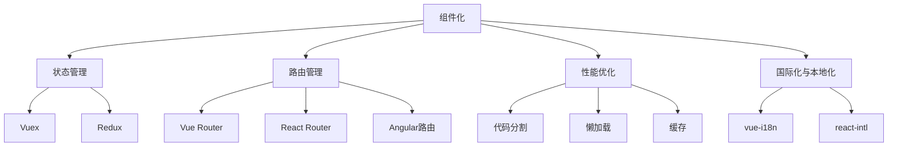

                 

关键词：Web前端框架，高级应用，复杂界面，可扩展性，Vue.js，React，Angular

摘要：本文深入探讨了Web前端框架的高级应用，通过实例和详细解释，揭示了如何利用这些框架构建复杂且可扩展的界面。文章涵盖了核心概念、算法原理、数学模型、项目实践以及未来展望，旨在为开发者提供实用的指导和深刻的见解。

## 1. 背景介绍

随着互联网技术的飞速发展，Web前端开发的重要性日益凸显。在现代Web应用中，前端框架已经成为开发者的必备工具。它们提供了高效、模块化的开发方式，使得开发者能够更加专注于业务逻辑的实现，而无需重复编写DOM操作等底层代码。

前端框架的主要目标是简化开发流程、提高开发效率和代码可维护性。然而，仅仅使用基本的前端框架功能还不足以应对复杂和可扩展的界面构建需求。因此，高级应用成为前端开发的重要课题。

本文将围绕Web前端框架的高级应用展开，探讨如何利用Vue.js、React和Angular等流行框架构建复杂且可扩展的界面。通过具体实例和详细解释，读者将了解到这些框架的强大功能和应用场景。

### 1.1 前端框架的演变

前端框架的演变历程可以追溯到2000年代初的纯HTML、CSS和JavaScript时代。随着Web技术的不断进步，开发者开始意识到使用框架的重要性，以解决跨浏览器兼容性、代码复用和可维护性问题。

最初，像jQuery这样的库被广泛使用，它们通过简化DOM操作和事件处理，极大地提高了开发效率。然而，随着Web应用的复杂性增加，开发者逐渐发现这些库的局限性，于是开始探索更加模块化和功能强大的前端框架。

### 1.2 当前主流前端框架

目前，前端框架市场主要被Vue.js、React和Angular三大框架占据。这些框架各有特点，适用于不同的开发场景。

**Vue.js**：Vue.js 是一个渐进式JavaScript框架，易于上手，适合快速构建小到中型的单页应用。其数据绑定机制、组件化和双向数据流特性使得开发过程更加高效。

**React**：React 是一个用于构建用户界面的JavaScript库，具有虚拟DOM、组件化和单向数据流等特性。React的设计理念是分而治之，使得大型应用的开发和维护更加方便。

**Angular**：Angular 是一个由Google维护的全功能前端框架，具有丰富的功能和严格的模式。它提供了双向数据绑定、依赖注入、模块化等特性，适用于大型和复杂的应用。

### 1.3 高级应用的重要性

在复杂和可扩展的界面构建过程中，前端框架的高级应用显得尤为重要。高级应用包括但不限于：

- **状态管理**：复杂应用通常需要管理大量状态，高级框架提供了强大的状态管理工具，如Vue.js的Vuex和React的Redux。
- **路由管理**：单页应用（SPA）需要高效的路由管理，框架提供了路由配置和动态加载页面组件的功能。
- **性能优化**：高级框架提供了多种性能优化策略，如懒加载、代码分割和缓存等。
- **国际化与本地化**：大型应用往往需要支持多种语言和地区，框架提供了国际化与本地化支持。

接下来，本文将深入探讨这些高级应用，并通过具体实例展示如何在实际项目中实现。

## 2. 核心概念与联系

在深入探讨前端框架的高级应用之前，我们需要了解一些核心概念和原理，以及它们之间的联系。以下是几个关键概念：

### 2.1 组件化

组件化是现代Web前端开发的重要原则之一。组件是可复用的UI构建块，具有独立的功能和界面。通过组件化，开发者可以将复杂的应用拆分为多个可管理的部分，提高代码的可维护性和可复用性。

### 2.2 状态管理

状态管理是复杂应用的核心，涉及到数据的存储、更新和同步。在Vue.js中，Vuex是一个强大的状态管理库；在React中，Redux是一个常用的状态管理解决方案。

### 2.3 路由管理

路由管理是单页应用（SPA）的重要组成部分。它负责处理URL的变化，并加载对应的页面组件。Vue.js的Vue Router、React的React Router和Angular的路由模块都是常用的路由管理工具。

### 2.4 性能优化

性能优化是提高用户体验的关键。前端框架提供了多种性能优化策略，如代码分割、懒加载、缓存等。这些策略有助于减少页面加载时间，提高应用的响应速度。

### 2.5 国际化与本地化

国际化与本地化使得应用能够支持多种语言和地区。前端框架提供了国际化与本地化的支持，如Vue.js的vue-i18n、React的react-intl等。

### 2.6 Mermaid 流程图

以下是使用Mermaid绘制的Web前端框架核心概念与联系流程图：



通过这个流程图，我们可以清晰地看到各个核心概念之间的联系，以及它们如何共同作用，为复杂和可扩展的界面构建提供支持。

## 3. 核心算法原理 & 具体操作步骤

### 3.1 算法原理概述

在构建复杂和可扩展的界面时，前端框架的核心算法原理起到了至关重要的作用。以下是Vue.js、React和Angular中的核心算法原理：

**Vue.js**：
- **响应式数据绑定**：Vue.js 通过响应式系统实现数据绑定，当数据变化时，视图会自动更新。
- **虚拟DOM**：Vue.js 使用虚拟DOM来优化渲染性能，通过对比虚拟DOM和实际DOM的差异，最小化实际的DOM操作。

**React**：
- **虚拟DOM**：React 使用虚拟DOM来提高渲染性能，通过比较虚拟DOM和实际DOM的差异，实现高效更新。
- **组件生命周期**：React 组件有多个生命周期方法，如`componentDidMount`、`componentDidUpdate`等，用于处理组件的创建、更新和销毁。

**Angular**：
- **双向数据绑定**：Angular 提供了强大的双向数据绑定机制，实现数据和视图的同步更新。
- **依赖注入**：Angular 使用依赖注入来管理组件之间的依赖关系，提高代码的可测试性和可维护性。

### 3.2 算法步骤详解

**Vue.js**：
1. **初始化**：创建Vue实例，设置数据、模板和挂载点。
2. **响应式数据绑定**：Vue通过Object.defineProperty()实现数据的响应式绑定，监听数据的变更。
3. **虚拟DOM渲染**：Vue使用虚拟DOM来构建虚拟树，并通过diff算法与实际DOM进行比较，实现高效的更新。
4. **更新DOM**：根据diff结果，更新实际的DOM。

**React**：
1. **组件初始化**：创建React组件，设置组件的状态和属性。
2. **虚拟DOM构建**：React通过虚拟DOM构建虚拟树，并计算组件的渲染结果。
3. **组件渲染**：将虚拟DOM渲染为实际的DOM，显示在页面上。
4. **组件更新**：当组件的状态或属性发生变化时，重新执行虚拟DOM构建和渲染过程。

**Angular**：
1. **模块化**：Angular通过模块（Module）来组织组件、服务和路由等。
2. **双向数据绑定**：Angular通过`ngModel`指令实现数据和视图的双向绑定。
3. **依赖注入**：Angular通过依赖注入（DI）来提供组件所需的依赖关系。
4. **组件生命周期管理**：Angular管理组件的生命周期，处理组件的创建、更新和销毁。

### 3.3 算法优缺点

**Vue.js**：
- **优点**：简单易学、文档丰富、社区活跃。
- **缺点**：虚拟DOM实现较为复杂、状态管理需要额外依赖Vuex。

**React**：
- **优点**：社区活跃、虚拟DOM性能优越、组件化开发。
- **缺点**：学习曲线较陡峭、状态管理需要额外使用Redux。

**Angular**：
- **优点**：功能强大、代码结构清晰、支持大型应用。
- **缺点**：学习成本较高、性能优化较为复杂。

### 3.4 算法应用领域

- **Vue.js**：适合快速开发小型到中型的单页应用。
- **React**：适合构建中大型单页应用，特别是需要高性能和复杂组件的应用。
- **Angular**：适合构建大型、复杂的Web应用，如企业级应用和单页应用。

通过上述核心算法原理和具体操作步骤的介绍，我们可以看到，前端框架的算法设计旨在提高开发效率和性能优化，为构建复杂和可扩展的界面提供有力支持。

## 4. 数学模型和公式 & 详细讲解 & 举例说明

### 4.1 数学模型构建

在构建复杂和可扩展的界面时，数学模型和公式起到了关键作用。以下是一个简单的数学模型示例，用于计算单页应用（SPA）的页面加载时间。

**假设**：
- `T1`：首屏加载时间。
- `T2`：首屏渲染时间。
- `T3`：后续页面加载时间。
- `T4`：后续页面渲染时间。

**目标**：最小化页面加载时间，提高用户体验。

**数学模型**：

$$
T_{\text{total}} = \max(T1, T2) + \sum_{i=2}^{n} T_i
$$

其中，`n` 为页面的总数量。

### 4.2 公式推导过程

为了推导上述公式，我们需要分析页面加载的各个阶段：

1. **首屏加载时间（T1）**：包括HTML、CSS和JavaScript文件的加载时间。
2. **首屏渲染时间（T2）**：包括首屏内容的渲染时间，通常与虚拟DOM构建和渲染相关。
3. **后续页面加载时间（T3）**：包括后续页面的加载时间，与网络延迟和页面大小有关。
4. **后续页面渲染时间（T4）**：包括后续页面的渲染时间，同样与虚拟DOM构建和渲染相关。

通过上述分析，我们可以得到总加载时间的公式。其中，`T1` 和 `T2` 的大小决定了页面的初始加载速度，而后续页面的加载时间（`T3` 和 `T4`）则影响整体用户体验。

### 4.3 案例分析与讲解

**案例**：一个包含10个页面的单页应用，每个页面的加载时间如下：

- 首屏加载时间（T1）：1秒
- 首屏渲染时间（T2）：0.5秒
- 后续页面加载时间（T3）：平均2秒
- 后续页面渲染时间（T4）：平均1秒

**计算**：

$$
T_{\text{total}} = \max(1, 0.5) + 9 \times 2 + 10 \times 1 = 1.5 + 18 + 10 = 29.5 \text{秒}
$$

通过这个案例，我们可以看到，虽然每个页面的加载时间不算很长，但总加载时间却较高，这可能会影响用户体验。为了优化加载时间，我们可以采取以下策略：

1. **优化首屏加载**：通过懒加载、代码分割等技术，减少首屏加载的内容。
2. **优化首屏渲染**：使用虚拟DOM、WebAssembly等技术，提高首屏渲染速度。
3. **优化后续页面加载**：使用缓存、预加载等技术，减少后续页面的加载时间。
4. **优化后续页面渲染**：通过减少DOM操作、使用CSS动画等技术，提高后续页面的渲染速度。

通过这些优化策略，我们可以显著减少总加载时间，提高用户体验。

### 4.4 数学模型在实际开发中的应用

在实际开发中，数学模型和公式可以帮助我们：

1. **性能评估**：通过计算页面加载时间，评估应用的性能，找出瓶颈并进行优化。
2. **资源分配**：根据页面加载时间，合理分配资源，如带宽、服务器性能等。
3. **性能监控**：使用数学模型监控应用的性能，及时发现并解决性能问题。

通过数学模型和公式的应用，开发者可以更加科学地优化前端应用的性能，为用户提供更好的体验。

## 5. 项目实践：代码实例和详细解释说明

### 5.1 开发环境搭建

在进行项目实践之前，我们需要搭建一个适合前端开发的环境。以下是使用Vue.js搭建开发环境的具体步骤：

**步骤1**：安装Node.js

首先，我们需要安装Node.js。从Node.js官网（https://nodejs.org/）下载并安装最新版本的Node.js。

**步骤2**：安装Vue CLI

在终端中运行以下命令，安装Vue CLI：

```bash
npm install -g @vue/cli
```

**步骤3**：创建新项目

安装Vue CLI后，我们可以在终端中创建一个新项目：

```bash
vue create my-vue-project
```

在创建项目时，可以选择是否使用Vue Router、Vuex和其他插件。

### 5.2 源代码详细实现

以下是一个简单的Vue.js项目示例，展示了如何使用Vue.js、Vue Router和Vuex构建一个简单的Todo应用。

**步骤1**：项目结构

首先，我们创建一个名为`my-vue-project`的文件夹，并在其中创建以下文件和文件夹：

```bash
my-vue-project/
|-- public/
|   |-- index.html
|-- src/
|   |-- assets/
|   |   |-- styles/
|   |       |-- main.css
|   |-- components/
|   |   |-- TodoList.vue
|   |   |-- TodoItem.vue
|   |-- App.vue
|   |-- main.js
|   |-- router.js
|   |-- store.js
```

**步骤2**：配置路由

在`src/router.js`中，我们使用Vue Router配置路由：

```javascript
import Vue from 'vue';
import VueRouter from 'vue-router';
import TodoList from '@/components/TodoList.vue';

Vue.use(VueRouter);

const routes = [
  {
    path: '/',
    name: 'TodoList',
    component: TodoList
  }
];

const router = new VueRouter({
  routes
});

export default router;
```

**步骤3**：配置Vuex

在`src/store.js`中，我们使用Vuex配置状态管理：

```javascript
import Vue from 'vue';
import Vuex from 'vuex';

Vue.use(Vuex);

export default new Vuex.Store({
  state: {
    todos: []
  },
  mutations: {
    ADD_TODO(state, todo) {
      state.todos.push(todo);
    }
  },
  actions: {
    addTodo({ commit }, todo) {
      commit('ADD_TODO', todo);
    }
  }
});
```

**步骤4**：创建组件

在`src/components/TodoList.vue`中，我们创建一个Todo列表组件：

```vue
<template>
  <div>
    <ul>
      <li v-for="todo in todos" :key="todo.id">
        {{ todo.text }}
      </li>
    </ul>
    <input v-model="newTodo" @keyup.enter="addTodo">
  </div>
</template>

<script>
export default {
  data() {
    return {
      newTodo: ''
    };
  },
  computed: {
    todos() {
      return this.$store.state.todos;
    }
  },
  methods: {
    addTodo() {
      this.$store.dispatch('addTodo', { text: this.newTodo, id: Date.now() });
      this.newTodo = '';
    }
  }
};
</script>
```

在`src/components/TodoItem.vue`中，我们创建一个Todo项组件：

```vue
<template>
  <li>
    {{ todo.text }}
  </li>
</template>

<script>
export default {
  props: {
    todo: Object
  }
};
</script>
```

**步骤5**：主组件

在`src/App.vue`中，我们引入路由和Vuex，并使用它们：

```vue
<template>
  <div id="app">
    <router-view />
  </div>
</template>

<script>
import Vue from 'vue';
import VueRouter from 'vue-router';
import TodoList from './components/TodoList.vue';

Vue.use(VueRouter);

const router = new VueRouter({
  routes: [
    {
      path: '/',
      component: TodoList
    }
  ]
});

export default {
  name: 'App',
  router
};
</script>
```

**步骤6**：入口文件

在`src/main.js`中，我们引入Vue，创建Vue实例，并挂载到DOM上：

```javascript
import Vue from 'vue';
import App from './App.vue';
import router from './router';
import store from './store';

new Vue({
  router,
  store,
  render: h => h(App)
}).$mount('#app');
```

### 5.3 代码解读与分析

在上述示例中，我们使用Vue.js、Vue Router和Vuex构建了一个简单的Todo应用。以下是代码的关键部分解读：

- **路由配置**：在`src/router.js`中，我们配置了一个简单的路由，将根路径映射到`TodoList`组件。

- **状态管理**：在`src/store.js`中，我们使用Vuex配置了应用的状态管理。状态（`state`）存储了`todos`数组，通过`mutations`和`actions`来更新状态。

- **组件**：在`src/components/TodoList.vue`中，我们创建了一个Todo列表组件。它使用Vue的数据绑定和事件处理来管理Todo项。当用户在输入框中按下回车键时，会触发`addTodo`方法，通过`store.dispatch`将新的Todo项添加到状态中。

- **主组件**：在`src/App.vue`中，我们引入了路由和Vuex，并使用它们。主组件负责渲染路由视图。

通过这个示例，我们可以看到如何使用Vue.js、Vue Router和Vuex构建复杂和可扩展的界面。这些框架提供了强大的功能和灵活的组件化机制，使得开发者能够高效地构建和管理应用。

### 5.4 运行结果展示

完成上述代码后，我们可以在终端中运行项目：

```bash
npm install
npm run serve
```

打开浏览器，访问`http://localhost:8080/`，可以看到一个简单的Todo应用界面。用户可以在输入框中添加Todo项，每个Todo项都会显示在列表中。这个示例展示了如何使用Vue.js、Vue Router和Vuex构建一个复杂且可扩展的界面。

## 6. 实际应用场景

在前端开发中，复杂和可扩展的界面构建是一项重要任务。以下是一些实际应用场景，展示了如何使用Vue.js、React和Angular等前端框架实现这些场景：

### 6.1 在线购物平台

**场景描述**：在线购物平台需要构建一个复杂的用户界面，包括产品展示、购物车、订单管理等功能。

**解决方案**：
- **Vue.js**：使用Vue.js构建单页面应用（SPA），实现高效的用户体验。通过Vue Router管理页面路由，使用Vuex管理全局状态，如用户信息和购物车数据。通过Vue组件化，将不同部分拆分为独立的组件，如产品列表、购物车、订单详情等。

- **React**：使用React构建高交互性的用户界面，如产品筛选和搜索功能。利用React的虚拟DOM和组件生命周期方法，实现高效的数据更新和渲染。使用Redux进行状态管理，确保数据和界面的同步更新。

- **Angular**：使用Angular构建复杂的企业级在线购物平台。Angular提供了强大的双向数据绑定和依赖注入功能，使得开发过程更加高效。通过Angular模块和组件，将应用拆分为多个可管理的部分，提高代码的可维护性。

### 6.2 社交媒体平台

**场景描述**：社交媒体平台需要构建一个复杂的用户界面，包括动态展示、用户互动、私信等功能。

**解决方案**：
- **Vue.js**：使用Vue.js构建社交媒体平台的单页面应用（SPA），实现快速响应的用户互动。通过Vue Router管理页面路由，使用Vuex管理动态数据和用户状态。通过Vue组件化，将不同部分拆分为独立的组件，如动态列表、私信聊天等。

- **React**：使用React构建社交媒体平台的高交互性用户界面，如动态加载和实时更新。利用React的虚拟DOM和组件生命周期方法，实现高效的数据更新和渲染。使用Redux进行状态管理，确保数据和界面的同步更新。

- **Angular**：使用Angular构建复杂的企业级社交媒体平台。Angular提供了强大的双向数据绑定和依赖注入功能，使得开发过程更加高效。通过Angular模块和组件，将应用拆分为多个可管理的部分，提高代码的可维护性。

### 6.3 企业级应用

**场景描述**：企业级应用需要构建一个复杂的用户界面，包括报表分析、数据可视化、任务管理等功能。

**解决方案**：
- **Vue.js**：使用Vue.js构建企业级应用的单页面应用（SPA），实现高效的数据可视化。通过Vue Router管理页面路由，使用Vuex管理全局状态，如用户权限和数据。通过Vue组件化，将不同部分拆分为独立的组件，如报表图表、数据面板等。

- **React**：使用React构建企业级应用的高交互性用户界面，如实时数据分析和报表生成。利用React的虚拟DOM和组件生命周期方法，实现高效的数据更新和渲染。使用Redux进行状态管理，确保数据和界面的同步更新。

- **Angular**：使用Angular构建复杂的企业级应用。Angular提供了强大的双向数据绑定和依赖注入功能，使得开发过程更加高效。通过Angular模块和组件，将应用拆分为多个可管理的部分，提高代码的可维护性。

### 6.4 未来应用展望

随着Web技术的不断进步，前端框架的高级应用将在更多场景中发挥重要作用。以下是未来应用的一些展望：

- **智能化与自动化**：前端框架将更加智能化和自动化，提供更多高级工具和插件，简化开发流程，提高开发效率。

- **跨平台支持**：前端框架将加强对跨平台支持，如移动应用和桌面应用，实现一次编写，多端运行。

- **WebAssembly**：WebAssembly（WASM）作为一种新兴的技术，将进一步提升Web应用的性能。前端框架将更好地集成WebAssembly，实现高效的数据处理和渲染。

- **云原生开发**：前端框架将更加关注云原生开发，支持容器化、服务化等特性，提高应用的弹性和可扩展性。

通过以上实际应用场景和未来展望，我们可以看到，前端框架的高级应用在构建复杂和可扩展的界面中具有巨大的潜力。

## 7. 工具和资源推荐

在前端开发过程中，掌握一些实用的工具和资源可以显著提高开发效率和代码质量。以下是一些推荐的工具和资源：

### 7.1 学习资源推荐

**在线教程**：
- [Vue.js官方文档](https://vuejs.org/v2/guide/)
- [React官方文档](https://reactjs.org/docs/getting-started.html)
- [Angular官方文档](https://angular.io/docs)

**书籍推荐**：
- 《Vue.js实战》
- 《React Up & Running》
- 《Angular权威指南》

**在线课程**：
- [Vue.js从入门到精通](https://www.udemy.com/course/vuejs-from-scratch/)
- [React.js实战教程](https://www.udemy.com/course/react-essential-training-for-full-stack-developers/)
- [Angular框架深入理解](https://www.udemy.com/course/angular-4-the-complete-guide/)

### 7.2 开发工具推荐

**代码编辑器**：
- Visual Studio Code
- Sublime Text
- Atom

**构建工具**：
- Webpack
- Rollup
-Parcel

**包管理器**：
- npm
- Yarn

**版本控制**：
- Git
- GitHub
- GitLab

### 7.3 相关论文推荐

**Vue.js**：
- "Vue.js: A Progressive JavaScript Framework for Building UIs"
- "Reactive Programming with Vue.js"

**React**：
- "Building UIs with React: Understanding the Virtual DOM"
- "Unifying Developer Experience Across the Stack with React"

**Angular**：
- "Angular: High Productivity for UI Development"
- "Angular Universal: Building Ultra-Fast Single Page Applications"

通过这些学习资源、开发工具和论文，开发者可以深入了解前端框架的高级应用，提高自己的技能水平。

## 8. 总结：未来发展趋势与挑战

在前端开发领域，Web前端框架的高级应用已经成为构建复杂和可扩展界面的重要手段。Vue.js、React和Angular等框架凭借其独特的优势和强大的功能，为开发者提供了高效、灵活的开发体验。随着技术的不断进步，前端框架的发展趋势和面临的挑战也越来越明确。

### 8.1 研究成果总结

通过对Vue.js、React和Angular的研究，我们可以总结出以下成果：

1. **渐进式框架**：Vue.js 和 React 都采用了渐进式框架的设计理念，使得开发者可以逐步引入框架的功能，降低学习成本。
2. **高性能渲染**：Vue.js 和 React 都采用了虚拟DOM技术，显著提高了页面的渲染性能。
3. **状态管理**：Vuex 和 Redux 提供了强大的状态管理解决方案，使得开发者可以更方便地管理应用状态。
4. **组件化开发**：Vue.js、React 和 Angular 都支持组件化开发，提高了代码的可维护性和复用性。

### 8.2 未来发展趋势

1. **智能化与自动化**：未来前端框架将更加智能化和自动化，提供更多高级工具和插件，简化开发流程，提高开发效率。
2. **跨平台支持**：前端框架将加强对跨平台支持，如移动应用和桌面应用，实现一次编写，多端运行。
3. **WebAssembly**：WebAssembly（WASM）作为一种新兴的技术，将进一步提升Web应用的性能，前端框架将更好地集成WebAssembly。
4. **云原生开发**：前端框架将更加关注云原生开发，支持容器化、服务化等特性，提高应用的弹性和可扩展性。

### 8.3 面临的挑战

1. **学习成本**：虽然前端框架具有强大的功能，但学习成本较高，特别是对于新手开发者，需要花费大量时间掌握。
2. **性能优化**：在构建复杂和可扩展的界面时，性能优化成为一项重要挑战。开发者需要深入理解框架的原理，进行针对性的优化。
3. **生态系统**：前端框架的生态系统不断发展，但存在碎片化问题，开发者需要选择合适的工具和库，构建高效的应用。
4. **安全性**：随着Web应用的复杂度增加，安全性问题也越来越突出。开发者需要关注安全漏洞和攻击手段，加强应用的安全防护。

### 8.4 研究展望

未来，前端框架的发展将朝着更加智能、高效、安全的方向迈进。研究者可以关注以下方向：

1. **智能化开发**：通过人工智能和机器学习技术，提升开发工具的智能化水平，为开发者提供更好的开发体验。
2. **性能优化**：深入研究虚拟DOM、状态管理和组件化等技术，提高Web应用的性能和响应速度。
3. **跨平台支持**：探索更多跨平台技术，实现一次编写，多端运行，降低开发成本。
4. **安全性**：加强前端框架的安全特性，提高应用的抗攻击能力，保护用户数据安全。

总之，前端框架的高级应用在构建复杂和可扩展的界面中具有重要意义。通过不断的研究和创新，我们可以为开发者提供更强大的工具，推动前端技术的发展。

## 9. 附录：常见问题与解答

### 9.1 前端框架的选择

**Q**：Vue.js、React和Angular哪个框架更适合我的项目？

**A**：选择前端框架主要取决于项目需求和开发团队的熟悉程度。

- **Vue.js**：适合快速开发小型到中型的单页应用，学习曲线较平缓。
- **React**：适合构建中大型单页应用，特别是需要高性能和复杂组件的应用。
- **Angular**：适合构建大型、复杂的企业级应用，功能强大但学习成本较高。

### 9.2 状态管理

**Q**：如何选择合适的状态管理工具？

**A**：

- **Vue.js**：使用Vuex进行状态管理，适合中大型应用。
- **React**：使用Redux进行状态管理，社区支持广泛，适合大型应用。
- **Angular**：内置了强大的状态管理功能，适合大型企业级应用。

### 9.3 性能优化

**Q**：如何优化Web应用性能？

**A**：

- **代码分割**：将代码拆分为多个块，按需加载，减少首屏加载时间。
- **懒加载**：延迟加载非首屏资源，提高页面初始加载速度。
- **缓存策略**：合理设置缓存，减少重复请求，提高页面性能。
- **虚拟DOM**：使用虚拟DOM技术，提高页面渲染效率。

### 9.4 跨平台开发

**Q**：如何使用前端框架实现跨平台开发？

**A**：

- **Vue.js**：可以使用Weex或uni-app实现跨平台开发。
- **React**：可以使用React Native实现跨平台开发。
- **Angular**：可以使用Angular Mobile或Starter Kits实现跨平台开发。

通过上述常见问题与解答，开发者可以更好地了解前端框架的高级应用，并解决实际开发中的常见问题。希望这些信息能对您有所帮助。

