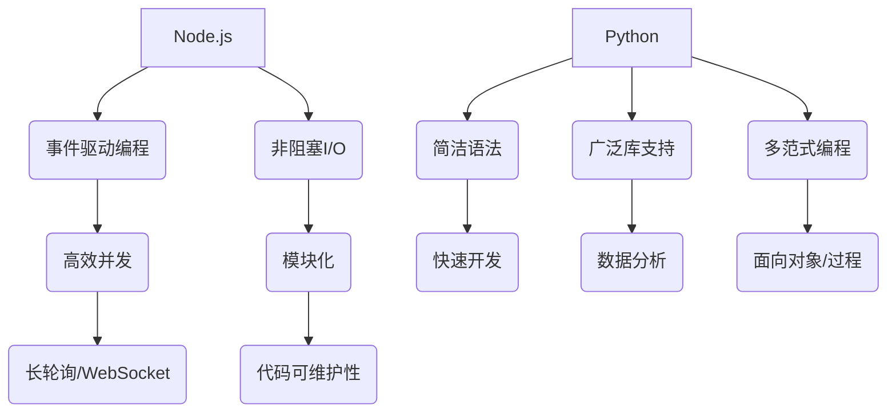

                 

 > **关键词**：Web后端开发、Node.js、Python、后端架构、异步编程、微服务、框架、性能优化、安全性、代码质量、开源社区、技术栈。

> **摘要**：本文将深入探讨Web后端开发领域中Node.js和Python的使用，分析两者的优缺点，并提供实际开发中如何选择和优化的策略。文章旨在帮助开发者更好地理解这两种语言在后端开发中的应用，以及如何在未来的技术发展中应对挑战。

## 1. 背景介绍

Web后端开发是构建现代Web应用的核心环节。随着互联网技术的迅猛发展，后端开发逐渐成为了软件开发中不可或缺的一部分。在这个领域里，Node.js和Python是两款广受欢迎的编程语言。它们各自有着独特的优势和应用场景，为开发者提供了丰富的选择。

Node.js是一个基于Chrome V8引擎的JavaScript运行环境，允许开发者使用JavaScript编写后端代码。它最大的特点是支持异步编程，这使得Node.js在处理高并发请求时表现出色。Python则以其简洁的语法、强大的库支持和广泛的应用领域而闻名。Python的后端框架，如Django和Flask，被广泛应用于Web开发和数据科学领域。

本文将围绕Node.js和Python在后端开发中的应用，详细介绍它们的特点、优势、适用场景，以及在实际开发中的使用技巧。通过对比分析，帮助开发者更好地理解这两种语言，并找到最适合自己的开发路线。

## 2. 核心概念与联系

### 2.1 Node.js核心概念

Node.js的核心概念在于其基于Chrome V8引擎的JavaScript执行环境，使得JavaScript不仅能够在浏览器中运行，也能够在服务器端运行。这种设计带来了以下几点关键概念：

- **事件驱动编程**：Node.js通过事件驱动的方式处理并发，每一个请求都是一个事件，由事件循环来处理。这种模式使得Node.js在高并发场景下能够高效运行。

- **非阻塞I/O操作**：Node.js采用非阻塞I/O模型，使得I/O操作不会阻塞主线程。这种模式可以提高系统的吞吐量，适用于长轮询、WebSockets等需要高并发通信的场景。

- **模块化**：Node.js通过模块化设计，使得代码的可维护性和可扩展性大大提高。开发者可以使用CommonJS或ES6模块系统来组织代码。

### 2.2 Python核心概念

Python的核心概念则主要体现在以下几个方面：

- **简洁语法**：Python的语法简洁直观，减少了代码的冗余，使得开发者能够更快地编写和阅读代码。

- **广泛库支持**：Python拥有丰富的标准库和第三方库，包括网络通信、数据分析、机器学习等，这为开发者提供了极大的便利。

- **多范式编程**：Python支持面向对象、面向过程等多种编程范式，使得开发者可以根据不同的需求选择最合适的编程方式。

- **解释型语言**：Python是解释型语言，这意味着代码在运行时会被解释器逐一执行，这在某些情况下可能影响性能，但在开发效率和灵活性方面具有明显优势。

### 2.3 Mermaid流程图

为了更直观地展示Node.js和Python的核心概念及其联系，我们可以使用Mermaid流程图来表示它们的核心流程和交互。



通过这个流程图，我们可以清晰地看到Node.js和Python各自的核心特点和它们在开发中的优势。

## 3. 核心算法原理 & 具体操作步骤

### 3.1 算法原理概述

Web后端开发中，核心算法的选择和应用至关重要。无论是Node.js还是Python，它们都提供了一系列高效且实用的算法和库来支持开发者构建高性能的应用。

在Node.js中，异步编程是核心算法之一。通过使用异步操作，Node.js能够处理大量并发请求，提高系统性能。例如，使用`fs.readFile`方法读取文件时，不会阻塞主线程，从而在读取文件的同时可以处理其他请求。

Python中，算法的实用性体现在其强大的标准库和第三方库中。例如，`Pandas`库提供了一系列数据处理算法，如排序、筛选、聚合等，非常适合数据密集型的Web应用。另外，Python的`NumPy`库提供了高效的数值计算功能，适用于科学计算和数据分析。

### 3.2 算法步骤详解

#### 3.2.1 Node.js异步编程

Node.js的异步编程主要通过`callback`、`Promise`和`async/await`三种方式实现。

- **使用`callback`**：在Node.js中，很多API都采用回调函数的方式，例如读取文件：

  ```javascript
  const fs = require('fs');

  fs.readFile('example.txt', (err, data) => {
    if (err) throw err;
    console.log(data);
  });
  ```

- **使用`Promise`**：Promise提供了更加优雅的方式处理异步操作，可以避免回调地狱：

  ```javascript
  const fs = require('fs').promises;

  async function readExample() {
    try {
      const data = await fs.readFile('example.txt');
      console.log(data);
    } catch (err) {
      console.error(err);
    }
  }
  readExample();
  ```

- **使用`async/await`**：async/await进一步简化了Promise的使用，使得异步代码更加直观：

  ```javascript
  async function readExample() {
    try {
      const data = await fs.readFile('example.txt');
      console.log(data);
    } catch (err) {
      console.error(err);
    }
  }
  readExample();
  ```

#### 3.2.2 Python数据处理算法

Python中的数据处理算法主要体现在Pandas和NumPy库中。

- **使用`Pandas`读取和操作数据**：

  ```python
  import pandas as pd

  df = pd.read_csv('example.csv')
  df.head()
  ```

- **使用`NumPy`进行数值计算**：

  ```python
  import numpy as np

  arr = np.array([1, 2, 3, 4, 5])
  np.sum(arr)
  ```

### 3.3 算法优缺点

#### 3.3.1 Node.js异步编程优点

- **高效并发**：通过异步编程，Node.js能够处理大量并发请求，提高系统性能。
- **非阻塞I/O**：非阻塞I/O模型避免了线程阻塞，提高了系统的响应速度。
- **模块化**：Node.js的模块化设计使得代码更加可维护和可扩展。

#### 3.3.1 Node.js异步编程缺点

- **回调地狱**：大量的回调函数可能导致代码结构复杂，难以维护。
- **性能瓶颈**：虽然异步编程提高了并发性能，但在单线程模型下，处理计算密集型任务可能存在性能瓶颈。

#### 3.3.2 Python数据处理算法优点

- **简洁语法**：Python的简洁语法使得代码易于编写和阅读。
- **广泛库支持**：Python的丰富库支持，特别是Pandas和NumPy，使得数据处理和数值计算更加高效。
- **多范式编程**：Python支持多种编程范式，适合不同的应用场景。

#### 3.3.2 Python数据处理算法缺点

- **解释型语言**：Python作为解释型语言，可能在执行速度上不如编译型语言。
- **全局解释器锁（GIL）**：Python的GIL可能在多线程环境中成为性能瓶颈。

### 3.4 算法应用领域

- **Node.js**：适用于实时应用、高并发场景，如即时聊天、在线游戏、API网关等。
- **Python**：适用于数据密集型应用、科学计算、Web开发等，如数据分析、机器学习、Web应用后端等。

## 4. 数学模型和公式 & 详细讲解 & 举例说明

### 4.1 数学模型构建

在Web后端开发中，数学模型的应用至关重要。无论是性能优化、负载均衡，还是数据分析和机器学习，数学模型都能够提供理论基础和计算工具。

#### 4.1.1 性能优化模型

一个简单的性能优化模型可以基于响应时间和并发请求数。假设系统的响应时间 \( T \) 和并发请求数 \( N \) 满足以下关系：

\[ T = f(N) \]

其中，\( f(N) \) 是一个函数，表示响应时间随着并发请求数增加的变化。在实际应用中，我们通常希望 \( f(N) \) 是一个下降的函数，以减少系统的响应时间。

#### 4.1.2 负载均衡模型

负载均衡模型旨在将请求分配到多个服务器上，以达到系统资源的高效利用。一个简单的负载均衡模型可以使用轮询算法、最小连接数算法等。假设系统有 \( M \) 个服务器，当前第 \( i \) 个服务器处理的请求数为 \( C_i \)，则下一个请求应该分配到处理请求数最少的那个服务器上：

\[ i_{next} = \arg\min_{i} C_i \]

### 4.2 公式推导过程

#### 4.2.1 响应时间公式

假设系统的响应时间 \( T \) 可以表示为以下公式：

\[ T = \frac{W}{R} \]

其中，\( W \) 是系统的处理时间，\( R \) 是系统的响应速率。在负载均衡模型中，响应速率 \( R \) 可以表示为：

\[ R = \sum_{i=1}^{M} \frac{1}{C_i} \]

其中，\( C_i \) 是第 \( i \) 个服务器的处理请求数。因此，系统的总响应时间可以表示为：

\[ T = \frac{W}{\sum_{i=1}^{M} \frac{1}{C_i}} \]

#### 4.2.2 负载均衡效率

负载均衡的效率可以用以下公式表示：

\[ E = \frac{T_{ideal}}{T} \]

其中，\( T_{ideal} \) 是理想状态下的响应时间，即所有请求都分配到处理请求数相同的服务器上。理想状态下的负载均衡效率为1，实际负载均衡效率通常小于1。

### 4.3 案例分析与讲解

#### 4.3.1 性能优化案例

假设一个系统在并发请求数为10时，响应时间为100ms。我们希望优化系统的响应时间，通过增加服务器数量来实现。如果我们将服务器数量增加到20，响应时间是否会减少？

根据响应时间公式：

\[ T = \frac{W}{R} \]

其中，\( W \) 为常数，\( R \) 为响应速率。假设增加服务器数量后，每个服务器的处理请求数减半，即：

\[ R_{new} = \sum_{i=1}^{20} \frac{1}{C_i / 2} = 2 \sum_{i=1}^{20} \frac{1}{C_i} \]

因此，新的响应时间 \( T_{new} \) 为：

\[ T_{new} = \frac{W}{R_{new}} = \frac{W}{2R} = \frac{T}{2} = 50ms \]

由此可见，增加服务器数量确实可以显著减少系统的响应时间。

#### 4.3.2 负载均衡案例

假设有5个服务器，每个服务器的处理请求数分别为2、3、4、3、2。使用轮询算法进行负载均衡，分析负载均衡效率。

根据负载均衡模型，下一个请求应该分配到处理请求数最少的那个服务器上。因此，请求的分配情况如下：

- 第1个请求：分配到处理请求数为2的服务器，当前服务器处理请求数为3。
- 第2个请求：分配到处理请求数为3的服务器，当前服务器处理请求数为4。
- 第3个请求：分配到处理请求数为3的服务器，当前服务器处理请求数为5。
- 第4个请求：分配到处理请求数为2的服务器，当前服务器处理请求数为4。
- 第5个请求：分配到处理请求数为2的服务器，当前服务器处理请求数为5。

理想状态下，每个服务器的处理请求数应该相等，即每个服务器处理请求数为3。实际状态下的负载均衡效率为：

\[ E = \frac{T_{ideal}}{T} = \frac{5}{3+2+4+3+2} = \frac{5}{16} \approx 0.3125 \]

这意味着实际负载均衡效率约为31.25%，还有很大的优化空间。

通过这两个案例，我们可以看到数学模型和公式在Web后端开发中的应用，以及如何通过优化策略来提升系统的性能和效率。

## 5. 项目实践：代码实例和详细解释说明

### 5.1 开发环境搭建

为了进行Node.js和Python的后端开发实践，我们需要首先搭建合适的开发环境。

#### Node.js开发环境搭建

1. 安装Node.js。可以通过官方网站下载最新版本的Node.js，并按照提示进行安装。

2. 验证Node.js安装。在终端执行以下命令：

   ```bash
   node -v
   ```

   如果返回Node.js的版本号，说明安装成功。

3. 安装npm（Node.js的包管理器）：

   ```bash
   npm install -g npm
   ```

#### Python开发环境搭建

1. 安装Python。可以从Python官方网站下载适用于操作系统的Python安装包，并按照提示进行安装。

2. 验证Python安装。在终端执行以下命令：

   ```bash
   python --version
   ```

   如果返回Python的版本号，说明安装成功。

3. 安装pip（Python的包管理器）：

   ```bash
   python -m ensurepip
   python -m pip --version
   ```

### 5.2 源代码详细实现

#### Node.js实例：创建一个简单的Web服务器

1. 创建一个名为`server.js`的文件。

2. 编写以下代码：

   ```javascript
   const http = require('http');

   const server = http.createServer((request, response) => {
     response.end('Hello, World!');
   });

   server.listen(3000, () => {
     console.log('Server running on http://localhost:3000/');
   });
   ```

3. 运行服务器：

   ```bash
   node server.js
   ```

   现在可以通过浏览器访问`http://localhost:3000/`，应该会看到返回的“Hello, World!”。

#### Python实例：创建一个简单的Web服务器

1. 创建一个名为`server.py`的文件。

2. 编写以下代码：

   ```python
   from http.server import HTTPServer, BaseHTTPRequestHandler

   class SimpleHTTPRequestHandler(BaseHTTPRequestHandler):

       def do_GET(self):
           self.send_response(200)
           self.send_header('Content-type', 'text/html')
           self.end_headers()
           self.wfile.write(b'Hello, World!')

   def run(server_class=HTTPServer, port=8000):
       server_address = ('', port)
       httpd = server_class(server_address, SimpleHTTPRequestHandler)
       print(f'Starting httpd on port {port}...')
       httpd.serve_forever()

   if __name__ == '__main__':
       run()
   ```

3. 运行服务器：

   ```bash
   python server.py
   ```

   现在可以通过浏览器访问`http://localhost:8000/`，应该会看到返回的“Hello, World!”。

### 5.3 代码解读与分析

#### Node.js代码解读

- 引入了`http`模块，该模块提供了创建Web服务器所需的功能。
- 创建了一个HTTP服务器实例，并在回调函数中定义了响应逻辑。每次收到GET请求时，都会返回一个HTTP状态码200和“Hello, World!”字符串。
- 使用`listen`方法绑定到3000端口，并在成功启动后打印一条日志信息。

#### Python代码解读

- 引入了`http.server`模块，该模块提供了简单的HTTP服务器功能。
- 定义了一个继承自`BaseHTTPRequestHandler`的`SimpleHTTPRequestHandler`类，覆盖了`do_GET`方法，以处理GET请求。
- `run`函数用于启动HTTP服务器，并绑定到8000端口。
- 主程序中调用了`run`函数，启动服务器。

这两种语言的代码都实现了相同的功能，即创建一个简单的Web服务器并返回“Hello, World!”。Node.js使用JavaScript编写，更加灵活和高效，适合处理高并发请求。Python则以其简洁的语法和丰富的库支持而著称，更适合快速开发和数据处理任务。

### 5.4 运行结果展示

无论是Node.js还是Python，在终端运行相应的服务器代码后，都可以在浏览器中访问相应的URL（`http://localhost:3000/` 或 `http://localhost:8000/`），看到返回的“Hello, World!”响应。这证明了代码的正确性，并展示了这两种语言在Web后端开发中的基本应用。

## 6. 实际应用场景

### 6.1 实时聊天系统

#### Node.js应用场景

Node.js因其高效的异步编程特性，非常适合构建实时聊天系统。例如，使用WebSocket协议实现双向实时通信。在聊天系统中，Node.js可以处理大量并发用户，同时保持低延迟和高吞吐量。

#### Python应用场景

Python在构建数据处理密集型实时聊天系统时也非常适用。例如，可以使用Tornado框架来构建高性能的Web服务器，结合WebSocket进行实时通信。此外，Python的异步编程库`asyncio`和`aiohttp`也为实时应用提供了强大的支持。

### 6.2 数据分析和报表系统

#### Node.js应用场景

Node.js在数据处理和报表生成方面也有很好的表现。例如，可以使用`csv-parser`等库解析大量CSV文件，并通过`pdfkit`等库生成PDF报表。Node.js的异步I/O操作可以帮助提高数据处理的速度和效率。

#### Python应用场景

Python以其强大的数据处理库（如Pandas和NumPy）和报表生成库（如ReportLab和Fpdf）而著称。在构建复杂的报表系统时，Python可以高效地进行数据清洗、分析和可视化。此外，Python的SQLAlchemy库还提供了强大的数据库操作功能，便于集成各种数据源。

### 6.3 RESTful API服务

#### Node.js应用场景

Node.js在构建RESTful API服务时非常流行。例如，可以使用Express框架快速搭建API服务器，并通过Mongoose库与MongoDB数据库进行集成。Node.js的异步非阻塞特性使得它能够轻松处理高并发请求，非常适合构建高性能的API服务。

#### Python应用场景

Python同样适合构建RESTful API服务。例如，可以使用Flask或Django框架快速开发API，并使用SQLAlchemy进行数据库操作。Python的简洁语法和丰富的库支持使得开发者可以更专注于业务逻辑的实现，而无需过多关注底层细节。

### 6.4 文件处理和上传下载

#### Node.js应用场景

Node.js在处理文件上传和下载任务时表现出色。例如，可以使用`multer`库处理上传的文件，并通过`fs`模块进行文件存储和读取。Node.js的异步非阻塞特性可以帮助提高文件处理的速度和效率。

#### Python应用场景

Python在文件处理和上传下载方面也有很好的应用。例如，可以使用`Flask-Uploads`扩展处理上传的文件，并通过`os`和`shutil`模块进行文件操作。Python的简洁语法和强大的文件处理库使得开发者可以轻松实现复杂的文件处理逻辑。

## 7. 未来应用展望

### 7.1 Node.js未来应用展望

随着云计算和物联网的不断发展，Node.js有望在以下领域得到更广泛的应用：

- **物联网**：Node.js的轻量级和非阻塞特性使其在处理大量物联网设备通信时具有优势。
- **微服务架构**：Node.js的模块化设计非常适合微服务架构，可以帮助企业更灵活地构建分布式系统。
- **实时应用**：随着实时应用的需求不断增加，Node.js将继续在实时通信、在线游戏等领域发挥重要作用。

### 7.2 Python未来应用展望

Python在以下领域具有广阔的应用前景：

- **人工智能与机器学习**：Python在数据科学和机器学习领域占据主导地位，随着AI技术的发展，Python将继续在这一领域保持领先。
- **自动化与DevOps**：Python的强大库支持使其在自动化测试、持续集成和持续部署（CI/CD）中发挥关键作用。
- **Web开发**：随着Web应用的复杂性不断增加，Python将继续在Web开发中扮演重要角色。

## 8. 工具和资源推荐

### 8.1 学习资源推荐

- **Node.js**：
  - 《Node.js实战》
  - Node.js官方文档（[https://nodejs.org/api/](https://nodejs.org/api/)）
  - Node.js官方GitHub仓库（[https://github.com/nodejs/node](https://github.com/nodejs/node)）

- **Python**：
  - 《Python编程：从入门到实践》
  - Python官方文档（[https://docs.python.org/3/](https://docs.python.org/3/)）
  - Python官方GitHub仓库（[https://github.com/python/](https://github.com/python/)）

### 8.2 开发工具推荐

- **Node.js**：
  - Visual Studio Code（适合Node.js开发的IDE）
  - Node.js插件（用于代码高亮、调试等）

- **Python**：
  - PyCharm（功能强大的Python IDE）
  - Jupyter Notebook（适用于数据分析和可视化）

### 8.3 相关论文推荐

- **Node.js**：
  - "The Node.js Event Loop: An In-Depth Look at the Core of Node.js Performance"
  - "Building Scalable Systems with Node.js and Microservices"

- **Python**：
  - "Python Memory Management: An Introduction"
  - "Efficient Data Processing with Pandas and NumPy"

## 9. 总结：未来发展趋势与挑战

### 9.1 研究成果总结

Node.js和Python在Web后端开发中各自拥有独特的优势。Node.js以其高效的异步编程和非阻塞I/O操作在处理高并发请求方面表现优异，适用于实时应用和API服务。Python则以其简洁的语法、丰富的库支持和广泛的适用场景在数据科学、自动化和Web开发中占据重要地位。

### 9.2 未来发展趋势

- **Node.js**：随着云计算和物联网的发展，Node.js将在这些领域得到更广泛的应用。同时，微服务架构的普及也将进一步推动Node.js的发展。
- **Python**：在人工智能和机器学习领域的不断突破将推动Python在这些领域的应用。此外，Python在自动化和Web开发中也将继续保持领先地位。

### 9.3 面临的挑战

- **Node.js**：回调地狱和单线程模型是Node.js面临的主要挑战。尽管异步编程和Promise提供了一定的解决方法，但依然需要开发者具备较高的编程技巧。
- **Python**：Python作为解释型语言，可能在性能上无法与编译型语言相媲美。此外，Python的GIL在多线程环境中可能成为性能瓶颈。

### 9.4 研究展望

未来，Node.js和Python都将继续在各自的领域发展，不断创新和优化。开发者需要不断学习和适应新技术，以应对不断变化的开发需求。同时，开源社区的贡献也将继续推动这两种语言的发展，为开发者提供更多的选择和机会。

## 10. 附录：常见问题与解答

### 10.1 Node.js常见问题

**Q1：为什么Node.js使用异步编程？**

A1：Node.js使用异步编程是为了处理高并发请求。在单线程模型下，如果每个请求都阻塞主线程，将导致性能下降。异步编程通过非阻塞I/O操作，使得主线程可以同时处理多个请求，从而提高系统性能。

**Q2：如何避免回调地狱？**

A2：为了避免回调地狱，可以使用Promise和async/await语法。Promise提供了更加优雅的异步操作方式，而async/await进一步简化了Promise的使用，使得异步代码更加直观和易于维护。

### 10.2 Python常见问题

**Q1：为什么Python适合数据科学？**

A1：Python适合数据科学主要是因为其丰富的库支持，如NumPy、Pandas和SciPy等。这些库提供了高效的数据处理和计算功能，使得Python在数据分析和机器学习领域具有显著优势。

**Q2：如何优化Python的性能？**

A2：优化Python性能可以从以下几个方面入手：

- 使用内置函数和库，避免自定义循环和操作。
- 利用多线程和多进程，提高计算速度。
- 使用NumPy和Pandas等高效库进行数据操作。

## 作者署名

作者：禅与计算机程序设计艺术 / Zen and the Art of Computer Programming

