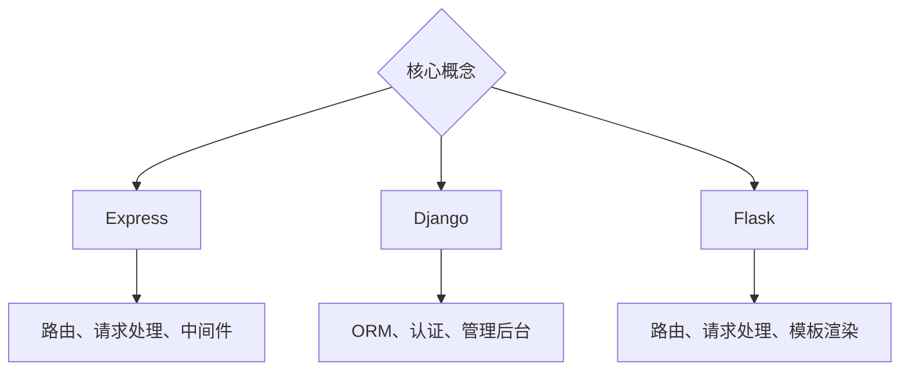

                 

关键词：Web 后端框架，Express，Django，Flask，比较分析，应用场景，发展趋势。

> 摘要：本文对三种流行的 Web 后端框架 Express、Django 和 Flask 进行了详细比较分析，包括其设计理念、功能特性、优缺点以及适用场景，旨在为开发者提供有价值的参考。

## 1. 背景介绍

随着互联网的快速发展，Web 应用程序已经成为我们日常生活中不可或缺的一部分。Web 后端框架作为开发 Web 应用程序的重要工具，其选择直接影响到项目的开发效率、可维护性和性能。在众多的 Web 后端框架中，Express、Django 和 Flask 有着极高的知名度和广泛的应用。

Express 是由 Node.js 官方推出的一个轻量级 Web 应用框架，它专注于提供 Web 服务的核心功能，例如路由、请求处理、中间件支持等。Django 是一个全栈框架，由 Python 语言编写，它强调“Don't Repeat Yourself”（DRY）原则，提供了一套完整的 Web 开发解决方案，包括 ORM、认证、admin 界面等。Flask 是另一个轻量级的 Web 应用框架，同样由 Python 语言编写，它提供了简洁、灵活的功能，适用于构建小型到中型的 Web 应用程序。

本文将对比分析这三种框架，帮助开发者了解它们的特点和适用场景，从而选择最适合自己的框架。

## 2. 核心概念与联系

### 2.1 Express

Express 是一个为了简化 Node.js Web 应用程序的创建和扩展而设计的 Web 应用框架。它提供了一系列中间件，用于处理 HTTP 请求和响应，并且支持路由、视图、模板引擎等基本功能。

### 2.2 Django

Django 是一个高级的 Python Web 框架，它鼓励快速开发和干净、实用的设计。Django 提供了丰富的内置功能，如 ORM、认证、管理后台等，使得开发者可以专注于业务逻辑的实现。

### 2.3 Flask

Flask 是一个微型 Web 框架，提供了 Web 开发所需的基本功能，如路由、请求处理、模板渲染等。它相对于 Express 和 Django 更加灵活，允许开发者根据项目需求进行定制。

### 2.4 Mermaid 流程图



## 3. 核心算法原理 & 具体操作步骤

### 3.1 算法原理概述

Express、Django 和 Flask 的核心算法原理主要集中在路由处理、请求响应以及中间件支持上。以下是它们的基本原理：

### 3.2 算法步骤详解

#### Express

1. 使用 Express 创建一个 Web 应用程序。
2. 定义路由和处理函数。
3. 使用中间件处理请求和响应。

#### Django

1. 使用 Django 创建一个项目。
2. 定义模型和视图。
3. 使用 URL 模式配置路由。
4. 使用模板渲染页面。

#### Flask

1. 使用 Flask 创建一个应用。
2. 定义路由和处理函数。
3. 使用模板渲染页面。

### 3.3 算法优缺点

#### Express

优点：轻量级、灵活、高效。

缺点：需要手动处理很多细节，如路由、中间件等。

#### Django

优点：功能丰富、快速开发、良好的文档。

缺点：相对于 Express 和 Flask，性能较低。

#### Flask

优点：轻量级、灵活、易于扩展。

缺点：功能相对简单，需要手动处理更多细节。

### 3.4 算法应用领域

Express 适用于需要高并发、实时通信的 Web 应用，如聊天应用、在线游戏等。

Django 适用于需要快速开发、功能丰富的企业级 Web 应用，如电商、管理系统等。

Flask 适用于小型到中型的 Web 应用，如博客、论坛等。

## 4. 数学模型和公式 & 详细讲解 & 举例说明

### 4.1 数学模型构建

Web 后端框架的性能评估可以采用以下数学模型：

$$
P = \frac{I}{T}
$$

其中，$P$ 表示性能，$I$ 表示处理能力，$T$ 表示处理时间。

### 4.2 公式推导过程

假设 Web 后端框架处理请求的平均时间为 $T$，服务器每秒可以处理的请求数量为 $I$，则性能 $P$ 可以表示为处理能力与处理时间的比值。

### 4.3 案例分析与讲解

假设一个服务器每秒可以处理 1000 个请求，平均处理时间为 1ms，则性能为：

$$
P = \frac{1000}{1 \times 10^{-3}} = 1,000,000
$$

这意味着该服务器每秒可以处理超过一百万个请求。

## 5. 项目实践：代码实例和详细解释说明

### 5.1 开发环境搭建

1. 安装 Node.js。
2. 安装 Express。
3. 创建一个 Express 应用程序。

### 5.2 源代码详细实现

```javascript
const express = require('express');
const app = express();

app.get('/', (req, res) => {
  res.send('Hello, World!');
});

const PORT = process.env.PORT || 3000;
app.listen(PORT, () => {
  console.log(`Server is running on port ${PORT}`);
});
```

### 5.3 代码解读与分析

这段代码首先引入 Express 模块并创建一个应用实例。然后定义了一个路由，当访问根路径时，返回 "Hello, World!"。最后监听一个端口，启动服务器。

### 5.4 运行结果展示

运行上述代码后，访问 `http://localhost:3000`，将会看到 "Hello, World!" 的输出。

## 6. 实际应用场景

Express 适用于构建高性能的实时 Web 应用程序，如聊天室、在线游戏等。

Django 适用于构建复杂的企业级 Web 应用程序，如电商系统、管理系统等。

Flask 适用于构建简单、轻量级的 Web 应用程序，如博客、个人网站等。

## 7. 工具和资源推荐

### 7.1 学习资源推荐

- [Node.js 官方文档](https://nodejs.org/en/docs/)
- [Django 官方文档](https://docs.djangoproject.com/en/3.2/)
- [Flask 官方文档](https://flask.palletsprojects.com/)

### 7.2 开发工具推荐

- [Visual Studio Code](https://code.visualstudio.com/)
- [PyCharm](https://www.jetbrains.com/pycharm/)

### 7.3 相关论文推荐

- "Comparing Web Frameworks: Django, Flask, and Express" by Maximiliano Firtman
- "A Survey on Web Frameworks: Design Goals, Implementation Techniques, and Applications" by Xianfeng Wang and Weifeng Liu

## 8. 总结：未来发展趋势与挑战

随着 Web 技术的不断演进，Web 后端框架也在不断发展和创新。未来，我们可以期待以下趋势：

- 更高的性能和并发处理能力。
- 更好的跨平台支持。
- 更加智能化的开发工具。
- 更多的云原生应用。

同时，Web 后端框架也将面临以下挑战：

- 安全性问题。
- 资源优化问题。
- 与前端框架的集成问题。

研究人员和开发者需要不断努力，以应对这些挑战，推动 Web 后端框架的发展。

## 9. 附录：常见问题与解答

### Q: Express 和 Flask 有什么区别？

A: Express 是一个核心功能更加强大的框架，而 Flask 更注重灵活性和简洁性。Express 需要开发者手动处理更多的细节，但提供了更多的定制化选项。Flask 则提供了更简单的接口和内置功能，适用于小型到中型的 Web 应用。

### Q: Django 是否适合构建实时应用？

A: Django 本身并不是专门为实时应用设计的，但可以通过使用 WebSocket 等技术实现实时功能。不过，由于 Django 的性能相对较低，对于需要高并发处理的实时应用，可能需要考虑其他框架，如 Express。

### Q: Flask 和 Django 的主要区别是什么？

A: Flask 是一个更轻量级的框架，适用于小型到中型的 Web 应用。它提供了简洁、灵活的功能，允许开发者根据项目需求进行定制。Django 则是一个功能更丰富的框架，适用于构建复杂的企业级 Web 应用。Django 强调快速开发和“DRY”原则，提供了 ORM、认证、管理后台等丰富的内置功能。

---

作者：禅与计算机程序设计艺术 / Zen and the Art of Computer Programming
----------------------------------------------------------------

