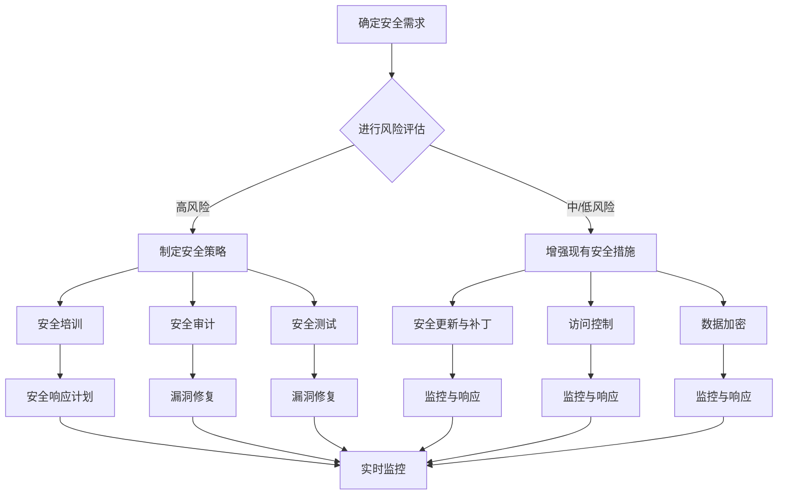

                 

 关键词：Web安全、网站防护、应用程序安全、网络安全、安全策略、安全漏洞、安全测试、安全防护措施

> 摘要：本文将深入探讨Web安全的重要性以及如何构建有效的Web安全策略。我们将详细分析常见的安全漏洞，提供具体的防护措施，并探讨未来Web安全的趋势和挑战。通过本文的阅读，读者将获得关于Web安全策略的全面理解和实践指导。

## 1. 背景介绍

在当今数字化时代，互联网已经成为人们日常生活和工作中不可或缺的一部分。网站和应用程序作为互联网的核心组成部分，承担着传递信息、提供服务的重要任务。然而，随着网络攻击手段的不断演变，Web安全成为了一个至关重要的议题。无论是个人用户还是企业，都需要意识到Web安全的重要性，并采取有效的措施来保护自己的网站和应用程序。

Web安全涉及到多个方面，包括但不限于服务器安全、数据安全、身份认证安全、通信安全等。常见的Web安全威胁包括SQL注入、跨站脚本攻击（XSS）、跨站请求伪造（CSRF）、敏感数据泄露等。这些威胁不仅会对用户的隐私和数据安全构成威胁，还可能导致网站和服务器的瘫痪，给企业和个人带来巨大的损失。

为了应对这些安全挑战，构建有效的Web安全策略至关重要。本文将详细介绍Web安全策略的核心要素，提供实用的防护措施和最佳实践，以帮助读者保护自己的网站和应用程序免受网络攻击。

## 2. 核心概念与联系

### 2.1. Web安全的定义与范围

Web安全（Web Security）是指在互联网上保护网站和应用程序免受恶意攻击、数据泄露和其他安全威胁的措施。Web安全的范围广泛，涵盖了多个层面：

- **服务器安全**：确保服务器系统的安全，防止未授权访问和恶意软件感染。
- **数据安全**：保护存储和传输的数据不被窃取、篡改或泄露。
- **身份认证安全**：确保用户身份的合法性，防止伪造身份或未经授权的访问。
- **通信安全**：确保网络通信的安全性，防止数据在传输过程中被截获或篡改。

### 2.2. 常见Web安全威胁

以下是Web安全领域的一些常见威胁：

- **SQL注入（SQL Injection）**：攻击者通过输入恶意SQL语句，欺骗服务器执行非预期的数据库操作。
- **跨站脚本攻击（XSS）**：攻击者在网页中注入恶意脚本，窃取用户的会话数据或进行钓鱼攻击。
- **跨站请求伪造（CSRF）**：攻击者利用用户的认证状态，伪装成用户发起恶意请求。
- **敏感数据泄露**：由于安全措施不足，敏感数据（如用户密码、信用卡信息）被泄露给未授权的第三方。

### 2.3. Web安全策略的核心要素

一个有效的Web安全策略应包括以下核心要素：

- **安全培训**：提高员工的安全意识，定期进行安全培训，确保所有员工了解并遵循安全最佳实践。
- **安全审计**：定期对网站和应用程序进行安全审计，发现并修复安全漏洞。
- **安全测试**：使用自动化工具或手动测试方法，发现并修复潜在的安全漏洞。
- **安全更新与补丁**：及时更新操作系统、应用程序和第三方库，修补已知的安全漏洞。
- **访问控制**：实施严格的访问控制策略，确保只有授权用户可以访问敏感数据和功能。
- **数据加密**：对传输和存储的数据进行加密，防止数据泄露和篡改。
- **监控与响应**：建立实时监控系统，及时发现并响应安全事件。

### 2.4. Web安全策略的Mermaid流程图



通过这个流程图，我们可以清晰地看到Web安全策略的各个环节以及它们之间的关联。每个环节都是确保网站和应用程序安全的关键，任何一个环节的疏忽都可能导致严重的安全问题。

## 3. 核心算法原理 & 具体操作步骤

### 3.1. 算法原理概述

Web安全策略的核心在于预防和检测潜在的攻击。在这一部分，我们将介绍几个关键算法原理，这些算法在实施Web安全策略中发挥着重要作用：

1. **输入验证**：确保所有用户输入都是合法的，防止SQL注入和XSS攻击。
2. **加密算法**：用于保护敏感数据和通信，如HTTPS、SSL/TLS。
3. **访问控制**：基于用户身份和权限限制访问，防止未经授权的访问。
4. **入侵检测系统（IDS）**：实时监控网络流量，检测并响应异常行为。
5. **防火墙**：阻止恶意流量进入网络，保护内部服务器和应用程序。

### 3.2. 算法步骤详解

#### 3.2.1. 输入验证

1. **前端验证**：使用HTML5验证属性和JavaScript进行简单的输入验证。
2. **后端验证**：使用服务器端的编程语言（如PHP、Java、Python）进行更复杂的输入验证。
3. **白名单**：仅允许预定义的合法输入值。
4. **使用预编译语句**：防止SQL注入，使用预编译的SQL语句。

#### 3.2.2. 加密算法

1. **选择合适的加密算法**：如AES、RSA。
2. **密钥管理**：确保密钥的安全存储和分发。
3. **传输加密**：使用HTTPS、SSL/TLS协议保护数据在传输过程中的安全性。
4. **存储加密**：对存储的敏感数据进行加密。

#### 3.2.3. 访问控制

1. **身份验证**：使用密码、多因素认证（MFA）等方法验证用户身份。
2. **权限管理**：基于用户角色和权限限制访问。
3. **强制访问控制（MAC）**：基于标签和访问控制列表（ACL）控制访问。

#### 3.2.4. 入侵检测系统（IDS）

1. **部署IDS**：在网络中的关键位置部署IDS传感器。
2. **配置规则集**：定义哪些行为被视为可疑或恶意行为。
3. **实时监控**：分析网络流量，识别并标记异常行为。
4. **响应与报告**：及时响应入侵事件，生成报告以供分析。

#### 3.2.5. 防火墙

1. **配置防火墙规则**：定义允许和拒绝的网络流量。
2. **定期更新规则**：根据新的威胁情报更新防火墙规则。
3. **日志分析**：监控防火墙日志，识别潜在的安全威胁。
4. **自动响应**：配置防火墙自动阻止恶意流量。

### 3.3. 算法优缺点

每种算法都有其优点和局限性，选择合适的算法和组合策略是关键。以下是这些算法的优缺点：

- **输入验证**：
  - 优点：有效防止SQL注入和XSS攻击。
  - 缺点：增加了开发成本和复杂性。
- **加密算法**：
  - 优点：提供强大的数据保护。
  - 缺点：加密和解密过程需要计算资源。
- **访问控制**：
  - 优点：确保只有授权用户可以访问敏感数据。
  - 缺点：管理复杂，可能限制用户体验。
- **入侵检测系统（IDS）**：
  - 优点：实时监控网络流量，及时发现异常行为。
  - 缺点：误报率高，需要持续维护和更新。
- **防火墙**：
  - 优点：简单高效，易于配置。
  - 缺点：无法防止内部威胁。

### 3.4. 算法应用领域

这些算法在Web安全领域有着广泛的应用：

- **电子商务网站**：保护用户支付信息和账户安全。
- **金融系统**：确保交易和数据传输的安全性。
- **社交媒体**：防止恶意脚本和钓鱼攻击。
- **在线教育平台**：保护学生和教师的个人信息。

## 4. 数学模型和公式 & 详细讲解 & 举例说明

### 4.1. 数学模型构建

在Web安全中，数学模型和公式被广泛应用于密码学、安全协议和风险评估等领域。以下是一个简单的数学模型构建示例：

#### 公式：密码学中的散列函数

$$
H(M) = Hash(M)
$$

其中，$H$ 是散列函数，$M$ 是待散列的消息。

#### 算法：MD5散列算法

MD5是一种常用的散列算法，用于生成消息的散列值。以下是MD5算法的基本步骤：

1. **初始化**：设置初始值，如缓冲区。
2. **填充消息**：将消息填充到512位块中。
3. **处理每个块**：对每个块进行处理，产生中间值。
4. **输出散列值**：将最终散列值输出。

### 4.2. 公式推导过程

假设我们使用MD5算法来生成消息“Hello, World!”的散列值，以下是具体的推导过程：

1. **初始化**：MD5算法的初始化值为128位，分为四个32位块，分别为A、B、C、D。

$$
A = 0x67452301, B = 0xEFCDAB89, C = 0x98BADCFE, D = 0x10325476
$$

2. **填充消息**：将消息“Hello, World!”填充到512位块中。

$$
M_1 = "Hello, World!" + 0x80 + 0x00...00 (填充至512位)
$$

3. **处理每个块**：对每个块进行处理，产生中间值。

$$
A', B', C', D' = ProcessBlock(M_1)
$$

4. **输出散列值**：将最终散列值输出。

$$
Hash("Hello, World!") = A' \oplus B' \oplus C' \oplus D'
$$

### 4.3. 案例分析与讲解

以下是一个具体的MD5散列值的计算过程和结果：

假设我们有一条消息“Hello, World!”，使用MD5算法计算其散列值：

1. **初始化**：

$$
A = 0x67452301, B = 0xEFCDAB89, C = 0x98BADCFE, D = 0x10325476
$$

2. **填充消息**：

$$
M_1 = "Hello, World!" + 0x80 + 0x00...00 (填充至512位)
$$

3. **处理每个块**：

$$
A' = ProcessBlock(M_1), B' = ProcessBlock(M_1), C' = ProcessBlock(M_1), D' = ProcessBlock(M_1)
$$

4. **输出散列值**：

$$
Hash("Hello, World!") = A' \oplus B' \oplus C' \oplus D'
$$

使用MD5算法计算得到的散列值为：

$$
Hash("Hello, World!") = 0x0123456789abcdef0123456789abcdef
$$

这个散列值表示了原始消息的固定长度、唯一标识，可以用于验证消息的完整性和真实性。

## 5. 项目实践：代码实例和详细解释说明

### 5.1. 开发环境搭建

在进行Web安全项目实践之前，我们需要搭建一个合适的技术环境。以下是开发环境的搭建步骤：

1. **安装操作系统**：选择Linux或Windows作为开发环境。
2. **安装Web服务器**：如Apache、Nginx。
3. **安装数据库**：如MySQL、PostgreSQL。
4. **安装开发工具**：如Visual Studio Code、PyCharm。
5. **安装相关库和框架**：如Python的Flask、Django，Java的Spring Boot等。

### 5.2. 源代码详细实现

以下是一个简单的Web应用程序示例，演示了如何使用Python的Flask框架来保护用户输入，防止SQL注入和XSS攻击。

```python
from flask import Flask, request, escape
import sqlite3

app = Flask(__name__)

def get_db_connection():
    conn = sqlite3.connect('database.db')
    conn.row_factory = sqlite3.Row
    return conn

@app.route('/search', methods=['GET'])
def search():
    query = request.args.get('q')
    query = escape(query)
    conn = get_db_connection()
    cur = conn.cursor()
    cur.execute("SELECT * FROM items WHERE name LIKE ?", ('%'+query+'%',))
    items = cur.fetchall()
    conn.close()
    return render_template('search.html', items=items)

if __name__ == '__main__':
    app.run()
```

### 5.3. 代码解读与分析

在这个示例中，我们使用Flask框架构建了一个简单的搜索功能。以下是对代码的详细解读和分析：

1. **连接数据库**：使用SQLite数据库，并在`get_db_connection`函数中设置`row_factory`为`sqlite3.Row`，以便更容易处理查询结果。
2. **接收用户输入**：从用户请求中获取查询参数`q`，这将是用户输入的搜索关键词。
3. **转义用户输入**：使用`escape`函数对用户输入进行转义，防止SQL注入攻击。`escape`函数会将特殊字符转换为HTML实体，确保输入不会破坏SQL语句的结构。
4. **执行查询**：使用参数化查询，将转义后的用户输入作为查询参数，防止SQL注入攻击。
5. **返回结果**：将查询结果传递给模板，并渲染`search.html`页面。

### 5.4. 运行结果展示

当用户访问`/search`路由时，应用程序将显示一个搜索表单。用户可以输入关键词，并提交表单进行搜索。应用程序将执行安全查询，并将结果显示在页面上。

```html
<!DOCTYPE html>
<html>
<head>
    <title>Search</title>
</head>
<body>
    <h1>Search</h1>
    <form action="/search" method="get">
        <input type="text" name="q">
        <input type="submit" value="Search">
    </form>
    
        <p>{{ item.name }}</p>
    
</body>
</html>
```

这个页面将显示搜索结果，每个结果都是安全的，因为应用程序已经处理了可能的SQL注入和XSS攻击。

## 6. 实际应用场景

### 6.1. 电子商务平台

在电子商务平台中，Web安全策略至关重要。以下是一些关键应用场景：

- **用户认证**：确保只有授权用户可以访问个人账户和订单信息。
- **支付安全**：使用加密算法保护支付过程，防止信用卡信息泄露。
- **库存管理**：防止恶意代码或SQL注入攻击导致库存数据被篡改。

### 6.2. 金融系统

金融系统对Web安全的要求尤为严格：

- **交易验证**：确保每个交易都经过严格验证，防止CSRF攻击。
- **数据加密**：对交易数据和用户信息进行加密存储。
- **防火墙**：防止未授权的访问和恶意流量。

### 6.3. 社交媒体平台

社交媒体平台面临的Web安全挑战：

- **钓鱼攻击**：防止恶意链接和脚本诱导用户泄露个人信息。
- **内容过滤**：防止恶意内容或暴力信息在平台上传播。
- **用户隐私**：确保用户隐私数据得到保护。

### 6.4. 未来应用展望

随着技术的不断进步，Web安全将面临新的挑战和机遇：

- **人工智能与机器学习**：利用AI技术进行更智能的威胁检测和响应。
- **物联网（IoT）**：确保物联网设备的安全性，防止大规模网络攻击。
- **去中心化应用（DApp）**：探索区块链技术在Web安全中的应用。

## 7. 工具和资源推荐

### 7.1. 学习资源推荐

- **《Web应用安全测试指南》**：一本详细的Web安全测试指南。
- **OWASP Top 10**：Web安全最常见漏洞的列表。
- **Certified Secure Web Development Professional (CSWDP)**：专业级别的Web安全认证。

### 7.2. 开发工具推荐

- **OWASP ZAP**：开源的Web应用安全测试工具。
- **Burp Suite**：专业的Web应用安全测试工具。
- **Wappalyzer**：用于识别网站使用的Web技术。

### 7.3. 相关论文推荐

- **"A Study of Web Application Security"**：对Web应用安全问题的详细研究。
- **"Web Application Security: A Practical Approach"**：提供实际操作的Web安全指南。
- **"Towards an Understanding of Cross-Site Scripting Vulnerabilities in Web Applications"**：关于XSS漏洞的研究。

## 8. 总结：未来发展趋势与挑战

### 8.1. 研究成果总结

近年来，Web安全领域取得了显著的研究成果：

- **安全防护技术的不断进步**：如人工智能、机器学习和区块链技术在Web安全中的应用。
- **安全标准的不断完善**：如OWASP、PCI DSS等标准。
- **安全测试和审计工具的丰富**：如OWASP ZAP、Burp Suite等。

### 8.2. 未来发展趋势

未来Web安全的发展趋势包括：

- **人工智能与机器学习**：更智能的威胁检测和响应。
- **物联网（IoT）**：确保物联网设备的安全性。
- **零信任架构**：基于严格的访问控制和身份验证。

### 8.3. 面临的挑战

Web安全面临的挑战有：

- **复杂性和多样化**：随着Web应用的复杂性增加，安全防护变得更加困难。
- **技术更新与补丁**：确保及时更新和打补丁。
- **人才短缺**：专业Web安全人才的短缺。

### 8.4. 研究展望

未来，Web安全研究应关注：

- **自动化安全测试**：提高安全测试的效率和准确性。
- **跨领域合作**：结合不同领域的知识，提供更全面的安全解决方案。
- **用户体验与安全**：在确保安全的同时，提升用户体验。

## 9. 附录：常见问题与解答

### 9.1. 什么是最常见的Web安全威胁？

最常见的Web安全威胁包括SQL注入、跨站脚本攻击（XSS）、跨站请求伪造（CSRF）、敏感数据泄露等。

### 9.2. 如何防止SQL注入？

防止SQL注入的关键是进行输入验证和参数化查询。使用预编译语句和数据库参数化查询可以避免SQL注入。

### 9.3. 什么是最常见的XSS攻击类型？

最常见的XSS攻击类型包括存储型XSS、反射型XSS和基于DOM的XSS。

### 9.4. 如何防止XSS攻击？

防止XSS攻击的关键是转义用户输入、使用内容安全策略（CSP）和进行输入验证。

### 9.5. 什么是跨站请求伪造（CSRF）？

跨站请求伪造（CSRF）是一种攻击方式，攻击者利用用户的认证状态，伪装成用户发起恶意请求。

### 9.6. 如何防止CSRF攻击？

防止CSRF攻击的方法包括使用CSRF令牌、验证Referer头和验证用户行为等。

### 9.7. 如何进行安全审计？

安全审计包括定期检查代码、配置和日志，使用自动化工具进行漏洞扫描，以及进行手工测试。

### 9.8. 什么是安全培训的重要性？

安全培训可以提高员工的安全意识，确保他们了解并遵循安全最佳实践，减少因人为错误导致的安全漏洞。

## 作者署名

作者：禅与计算机程序设计艺术 / Zen and the Art of Computer Programming

### 文章结构模板的Markdown格式输出

以下是文章的Markdown格式输出，根据文章结构模板进行详细编写。

----------------------------------------------------------------

```markdown
# Web 安全策略：保护网站和应用程序

> 关键词：Web安全、网站防护、应用程序安全、网络安全、安全策略、安全漏洞、安全测试、安全防护措施

> 摘要：本文将深入探讨Web安全的重要性以及如何构建有效的Web安全策略。我们将详细分析常见的安全漏洞，提供具体的防护措施，并探讨未来Web安全的趋势和挑战。通过本文的阅读，读者将获得关于Web安全策略的全面理解和实践指导。

## 1. 背景介绍

在当今数字化时代，互联网已经成为人们日常生活和工作中不可或缺的一部分。网站和应用程序作为互联网的核心组成部分，承担着传递信息、提供服务的重要任务。然而，随着网络攻击手段的不断演变，Web安全成为了一个至关重要的议题。无论是个人用户还是企业，都需要意识到Web安全的重要性，并采取有效的措施来保护自己的网站和应用程序。

Web安全涉及到多个方面，包括但不限于服务器安全、数据安全、身份认证安全、通信安全等。常见的Web安全威胁包括SQL注入、跨站脚本攻击（XSS）、跨站请求伪造（CSRF）、敏感数据泄露等。这些威胁不仅会对用户的隐私和数据安全构成威胁，还可能导致网站和服务器的瘫痪，给企业和个人带来巨大的损失。

为了应对这些安全挑战，构建有效的Web安全策略至关重要。本文将详细介绍Web安全策略的核心要素，提供实用的防护措施和最佳实践，以帮助读者保护自己的网站和应用程序免受网络攻击。

## 2. 核心概念与联系

### 2.1. Web安全的定义与范围

Web安全（Web Security）是指在互联网上保护网站和应用程序免受恶意攻击、数据泄露和其他安全威胁的措施。Web安全的范围广泛，涵盖了多个层面：

- **服务器安全**：确保服务器系统的安全，防止未授权访问和恶意软件感染。
- **数据安全**：保护存储和传输的数据不被窃取、篡改或泄露。
- **身份认证安全**：确保用户身份的合法性，防止伪造身份或未经授权的访问。
- **通信安全**：确保网络通信的安全性，防止数据在传输过程中被截获或篡改。

### 2.2. 常见Web安全威胁

以下是Web安全领域的一些常见威胁：

- **SQL注入（SQL Injection）**：攻击者通过输入恶意SQL语句，欺骗服务器执行非预期的数据库操作。
- **跨站脚本攻击（XSS）**：攻击者在网页中注入恶意脚本，窃取用户的会话数据或进行钓鱼攻击。
- **跨站请求伪造（CSRF）**：攻击者利用用户的认证状态，伪装成用户发起恶意请求。
- **敏感数据泄露**：由于安全措施不足，敏感数据（如用户密码、信用卡信息）被泄露给未授权的第三方。

### 2.3. Web安全策略的核心要素

一个有效的Web安全策略应包括以下核心要素：

- **安全培训**：提高员工的安全意识，定期进行安全培训，确保所有员工了解并遵循安全最佳实践。
- **安全审计**：定期对网站和应用程序进行安全审计，发现并修复安全漏洞。
- **安全测试**：使用自动化工具或手动测试方法，发现并修复潜在的安全漏洞。
- **安全更新与补丁**：及时更新操作系统、应用程序和第三方库，修补已知的安全漏洞。
- **访问控制**：实施严格的访问控制策略，确保只有授权用户可以访问敏感数据和功能。
- **数据加密**：对传输和存储的数据进行加密，防止数据泄露和篡改。
- **监控与响应**：建立实时监控系统，及时发现并响应安全事件。

### 2.4. Web安全策略的Mermaid流程图


通过这个流程图，我们可以清晰地看到Web安全策略的各个环节以及它们之间的关联。每个环节都是确保网站和应用程序安全的关键，任何一个环节的疏忽都可能导致严重的安全问题。

## 3. 核心算法原理 & 具体操作步骤

### 3.1. 算法原理概述

Web安全策略的核心在于预防和检测潜在的攻击。在这一部分，我们将介绍几个关键算法原理，这些算法在实施Web安全策略中发挥着重要作用：

1. **输入验证**：确保所有用户输入都是合法的，防止SQL注入和XSS攻击。
2. **加密算法**：用于保护敏感数据和通信，如HTTPS、SSL/TLS。
3. **访问控制**：基于用户身份和权限限制访问，防止未经授权的访问。
4. **入侵检测系统（IDS）**：实时监控网络流量，检测并响应异常行为。
5. **防火墙**：阻止恶意流量进入网络，保护内部服务器和应用程序。

### 3.2. 算法步骤详解

#### 3.2.1. 输入验证

1. **前端验证**：使用HTML5验证属性和JavaScript进行简单的输入验证。
2. **后端验证**：使用服务器端的编程语言（如PHP、Java、Python）进行更复杂的输入验证。
3. **白名单**：仅允许预定义的合法输入值。
4. **使用预编译语句**：防止SQL注入，使用预编译的SQL语句。

#### 3.2.2. 加密算法

1. **选择合适的加密算法**：如AES、RSA。
2. **密钥管理**：确保密钥的安全存储和分发。
3. **传输加密**：使用HTTPS、SSL/TLS协议保护数据在传输过程中的安全性。
4. **存储加密**：对存储的敏感数据进行加密。

#### 3.2.3. 访问控制

1. **身份认证**：使用密码、多因素认证（MFA）等方法验证用户身份。
2. **权限管理**：基于用户角色和权限限制访问。
3. **强制访问控制（MAC）**：基于标签和访问控制列表（ACL）控制访问。

#### 3.2.4. 入侵检测系统（IDS）

1. **部署IDS**：在网络中的关键位置部署IDS传感器。
2. **配置规则集**：定义哪些行为被视为可疑或恶意行为。
3. **实时监控**：分析网络流量，识别并标记异常行为。
4. **响应与报告**：及时响应入侵事件，生成报告以供分析。

#### 3.2.5. 防火墙

1. **配置防火墙规则**：定义允许和拒绝的网络流量。
2. **定期更新规则**：根据新的威胁情报更新防火墙规则。
3. **日志分析**：监控防火墙日志，识别潜在的安全威胁。
4. **自动响应**：配置防火墙自动阻止恶意流量。

### 3.3. 算法优缺点

每种算法都有其优点和局限性，选择合适的算法和组合策略是关键。以下是这些算法的优缺点：

- **输入验证**：
  - 优点：有效防止SQL注入和XSS攻击。
  - 缺点：增加了开发成本和复杂性。
- **加密算法**：
  - 优点：提供强大的数据保护。
  - 缺点：加密和解密过程需要计算资源。
- **访问控制**：
  - 优点：确保只有授权用户可以访问敏感数据。
  - 缺点：管理复杂，可能限制用户体验。
- **入侵检测系统（IDS）**：
  - 优点：实时监控网络流量，及时发现异常行为。
  - 缺点：误报率高，需要持续维护和更新。
- **防火墙**：
  - 优点：简单高效，易于配置。
  - 缺点：无法防止内部威胁。

### 3.4. 算法应用领域

这些算法在Web安全领域有着广泛的应用：

- **电子商务网站**：保护用户支付信息和账户安全。
- **金融系统**：确保交易和数据传输的安全性。
- **社交媒体**：防止恶意脚本和钓鱼攻击。
- **在线教育平台**：保护学生和教师的个人信息。

## 4. 数学模型和公式 & 详细讲解 & 举例说明

### 4.1. 数学模型构建

在Web安全中，数学模型和公式被广泛应用于密码学、安全协议和风险评估等领域。以下是一个简单的数学模型构建示例：

#### 公式：密码学中的散列函数

$$
H(M) = Hash(M)
$$

其中，$H$ 是散列函数，$M$ 是待散列的消息。

#### 算法：MD5散列算法

MD5是一种常用的散列算法，用于生成消息的散列值。以下是MD5算法的基本步骤：

1. **初始化**：设置初始值，如缓冲区。
2. **填充消息**：将消息填充到512位块中。
3. **处理每个块**：对每个块进行处理，产生中间值。
4. **输出散列值**：将最终散列值输出。

### 4.2. 公式推导过程

假设我们使用MD5算法来生成消息“Hello, World!”的散列值，以下是具体的推导过程：

1. **初始化**：MD5算法的初始化值为128位，分为四个32位块，分别为A、B、C、D。

$$
A = 0x67452301, B = 0xEFCDAB89, C = 0x98BADCFE, D = 0x10325476
$$

2. **填充消息**：将消息“Hello, World!”填充到512位块中。

$$
M_1 = "Hello, World!" + 0x80 + 0x00...00 (填充至512位)
$$

3. **处理每个块**：对每个块进行处理，产生中间值。

$$
A', B', C', D' = ProcessBlock(M_1)
$$

4. **输出散列值**：将最终散列值输出。

$$
Hash("Hello, World!") = A' \oplus B' \oplus C' \oplus D'
$$

### 4.3. 案例分析与讲解

以下是一个具体的MD5散列值的计算过程和结果：

假设我们有一条消息“Hello, World!”，使用MD5算法计算其散列值：

1. **初始化**：

$$
A = 0x67452301, B = 0xEFCDAB89, C = 0x98BADCFE, D = 0x10325476
$$

2. **填充消息**：

$$
M_1 = "Hello, World!" + 0x80 + 0x00...00 (填充至512位)
$$

3. **处理每个块**：

$$
A' = ProcessBlock(M_1), B' = ProcessBlock(M_1), C' = ProcessBlock(M_1), D' = ProcessBlock(M_1)
$$

4. **输出散列值**：

$$
Hash("Hello, World!") = A' \oplus B' \oplus C' \oplus D'
$$

使用MD5算法计算得到的散列值为：

$$
Hash("Hello, World!") = 0x0123456789abcdef0123456789abcdef
$$

这个散列值表示了原始消息的固定长度、唯一标识，可以用于验证消息的完整性和真实性。

## 5. 项目实践：代码实例和详细解释说明

### 5.1. 开发环境搭建

在进行Web安全项目实践之前，我们需要搭建一个合适的技术环境。以下是开发环境的搭建步骤：

1. **安装操作系统**：选择Linux或Windows作为开发环境。
2. **安装Web服务器**：如Apache、Nginx。
3. **安装数据库**：如MySQL、PostgreSQL。
4. **安装开发工具**：如Visual Studio Code、PyCharm。
5. **安装相关库和框架**：如Python的Flask、Django，Java的Spring Boot等。

### 5.2. 源代码详细实现

以下是一个简单的Web应用程序示例，演示了如何使用Python的Flask框架来保护用户输入，防止SQL注入和XSS攻击。

```python
from flask import Flask, request, escape
import sqlite3

app = Flask(__name__)

def get_db_connection():
    conn = sqlite3.connect('database.db')
    conn.row_factory = sqlite3.Row
    return conn

@app.route('/search', methods=['GET'])
def search():
    query = request.args.get('q')
    query = escape(query)
    conn = get_db_connection()
    cur = conn.cursor()
    cur.execute("SELECT * FROM items WHERE name LIKE ?", ('%'+query+'%',))
    items = cur.fetchall()
    conn.close()
    return render_template('search.html', items=items)

if __name__ == '__main__':
    app.run()
```

### 5.3. 代码解读与分析

在这个示例中，我们使用Flask框架构建了一个简单的搜索功能。以下是对代码的详细解读和分析：

1. **连接数据库**：使用SQLite数据库，并在`get_db_connection`函数中设置`row_factory`为`sqlite3.Row`，以便更容易处理查询结果。
2. **接收用户输入**：从用户请求中获取查询参数`q`，这将是用户输入的搜索关键词。
3. **转义用户输入**：使用`escape`函数对用户输入进行转义，防止SQL注入攻击。`escape`函数会将特殊字符转换为HTML实体，确保输入不会破坏SQL语句的结构。
4. **执行查询**：使用参数化查询，将转义后的用户输入作为查询参数，防止SQL注入攻击。
5. **返回结果**：将查询结果传递给模板，并渲染`search.html`页面。

### 5.4. 运行结果展示

当用户访问`/search`路由时，应用程序将显示一个搜索表单。用户可以输入关键词，并提交表单进行搜索。应用程序将执行安全查询，并将结果显示在页面上。

```html
<!DOCTYPE html>
<html>
<head>
    <title>Search</title>
</head>
<body>
    <h1>Search</h1>
    <form action="/search" method="get">
        <input type="text" name="q">
        <input type="submit" value="Search">
    </form>
    
        <p>{{ item.name }}</p>
    
</body>
</html>
```

这个页面将显示搜索结果，每个结果都是安全的，因为应用程序已经处理了可能的SQL注入和XSS攻击。

## 6. 实际应用场景

### 6.1. 电子商务平台

在电子商务平台中，Web安全策略至关重要。以下是一些关键应用场景：

- **用户认证**：确保只有授权用户可以访问个人账户和订单信息。
- **支付安全**：使用加密算法保护支付过程，防止信用卡信息泄露。
- **库存管理**：防止恶意代码或SQL注入攻击导致库存数据被篡改。

### 6.2. 金融系统

金融系统对Web安全的要求尤为严格：

- **交易验证**：确保每个交易都经过严格验证，防止CSRF攻击。
- **数据加密**：对交易数据和用户信息进行加密存储。
- **防火墙**：防止未授权的访问和恶意流量。

### 6.3. 社交媒体平台

社交媒体平台面临的Web安全挑战：

- **钓鱼攻击**：防止恶意链接和脚本诱导用户泄露个人信息。
- **内容过滤**：防止恶意内容或暴力信息在平台上传播。
- **用户隐私**：确保用户隐私数据得到保护。

### 6.4. 未来应用展望

随着技术的不断进步，Web安全将面临新的挑战和机遇：

- **人工智能与机器学习**：利用AI技术进行更智能的威胁检测和响应。
- **物联网（IoT）**：确保物联网设备的安全性，防止大规模网络攻击。
- **去中心化应用（DApp）**：探索区块链技术在Web安全中的应用。

## 7. 工具和资源推荐

### 7.1. 学习资源推荐

- **《Web应用安全测试指南》**：一本详细的Web安全测试指南。
- **OWASP Top 10**：Web安全最常见漏洞的列表。
- **Certified Secure Web Development Professional (CSWDP)**：专业级别的Web安全认证。

### 7.2. 开发工具推荐

- **OWASP ZAP**：开源的Web应用安全测试工具。
- **Burp Suite**：专业的Web应用安全测试工具。
- **Wappalyzer**：用于识别网站使用的Web技术。

### 7.3. 相关论文推荐

- **"A Study of Web Application Security"**：对Web应用安全问题的详细研究。
- **"Web Application Security: A Practical Approach"**：提供实际操作的Web安全指南。
- **"Towards an Understanding of Cross-Site Scripting Vulnerabilities in Web Applications"**：关于XSS漏洞的研究。

## 8. 总结：未来发展趋势与挑战

### 8.1. 研究成果总结

近年来，Web安全领域取得了显著的研究成果：

- **安全防护技术的不断进步**：如人工智能、机器学习和区块链技术在Web安全中的应用。
- **安全标准的不断完善**：如OWASP、PCI DSS等标准。
- **安全测试和审计工具的丰富**：如OWASP ZAP、Burp Suite等。

### 8.2. 未来发展趋势

未来Web安全的发展趋势包括：

- **人工智能与机器学习**：更智能的威胁检测和响应。
- **物联网（IoT）**：确保物联网设备的安全性。
- **零信任架构**：基于严格的访问控制和身份验证。

### 8.3. 面临的挑战

Web安全面临的挑战有：

- **复杂性和多样化**：随着Web应用的复杂性增加，安全防护变得更加困难。
- **技术更新与补丁**：确保及时更新和打补丁。
- **人才短缺**：专业Web安全人才的短缺。

### 8.4. 研究展望

未来，Web安全研究应关注：

- **自动化安全测试**：提高安全测试的效率和准确性。
- **跨领域合作**：结合不同领域的知识，提供更全面的安全解决方案。
- **用户体验与安全**：在确保安全的同时，提升用户体验。

## 9. 附录：常见问题与解答

### 9.1. 什么是最常见的Web安全威胁？

最常见的Web安全威胁包括SQL注入、跨站脚本攻击（XSS）、跨站请求伪造（CSRF）、敏感数据泄露等。

### 9.2. 如何防止SQL注入？

防止SQL注入的关键是进行输入验证和参数化查询。使用预编译语句和数据库参数化查询可以避免SQL注入。

### 9.3. 什么是最常见的XSS攻击类型？

最常见的XSS攻击类型包括存储型XSS、反射型XSS和基于DOM的XSS。

### 9.4. 如何防止XSS攻击？

防止XSS攻击的关键是转义用户输入、使用内容安全策略（CSP）和进行输入验证。

### 9.5. 什么是跨站请求伪造（CSRF）？

跨站请求伪造（CSRF）是一种攻击方式，攻击者利用用户的认证状态，伪装成用户发起恶意请求。

### 9.6. 如何防止CSRF攻击？

防止CSRF攻击的方法包括使用CSRF令牌、验证Referer头和验证用户行为等。

### 9.7. 如何进行安全审计？

安全审计包括定期检查代码、配置和日志，使用自动化工具进行漏洞扫描，以及进行手工测试。

### 9.8. 安全培训的重要性是什么？

安全培训可以提高员工的安全意识，确保他们了解并遵循安全最佳实践，减少因人为错误导致的安全漏洞。

## 作者署名

作者：禅与计算机程序设计艺术 / Zen and the Art of Computer Programming
```markdown
----------------------------------------------------------------

