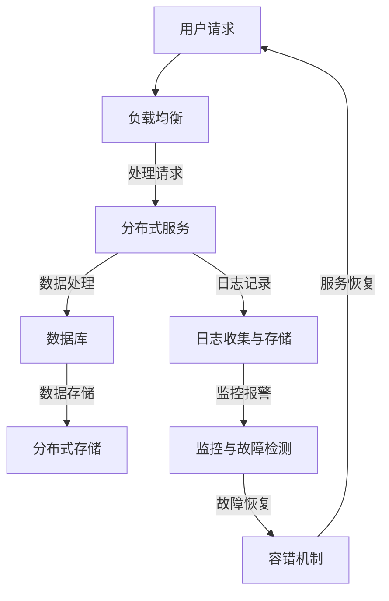

                 

关键词：Web应用程序，可扩展性，容错性，架构设计，负载均衡，故障恢复，性能优化

## 摘要

本文旨在深入探讨Web应用程序的可扩展性和容错性设计。随着互联网的快速发展，Web应用程序面临着日益增长的用户量和复杂的应用场景，这使得可扩展性和容错性成为系统设计的核心考量。本文首先介绍了可扩展性和容错性的基本概念，随后详细分析了其在Web应用程序设计中的重要性。接着，文章从负载均衡、分布式架构和故障恢复机制等方面，阐述了实现Web应用程序高可扩展性和容错性的具体方法和策略。此外，本文还通过实际项目实例，展示了这些策略在开发中的应用，并对未来的发展方向进行了展望。

## 1. 背景介绍

Web应用程序的快速发展，为人们的生活和工作带来了极大的便利。然而，随着用户数量的增长和应用场景的复杂化，Web应用程序面临着巨大的性能压力和可靠性挑战。如何确保Web应用程序在面临高并发、大数据量、网络不稳定等情况下依然能够稳定运行，成为了开发者和架构师亟需解决的问题。

可扩展性（Scalability）指的是系统在性能需求增加时，能够通过增加资源来保持性能的能力。可扩展性可以分为垂直扩展（增加单台服务器的性能）和水平扩展（增加服务器数量）。在Web应用程序中，高可扩展性能够确保系统在用户量增加时，不会出现性能瓶颈或响应延迟。

容错性（Fault Tolerance）则是指系统在部分组件或服务发生故障时，仍然能够保持正常运行的能力。在现代分布式系统中，容错性是实现高可用性和系统稳定性的关键。

本文将从以下几个方面展开讨论：首先介绍可扩展性和容错性的基本概念；然后分析其在Web应用程序设计中的重要性；接着探讨实现可扩展性和容错性的具体方法；最后通过实际项目实例，展示这些方法的应用效果。

### 1.1 可扩展性

可扩展性是Web应用程序设计的重要目标之一。在高并发场景下，系统需要能够迅速响应大量请求，同时保持低延迟和高吞吐量。可扩展性通过以下几个方面得以实现：

- **水平扩展**：通过增加服务器数量来提升系统处理能力。这种方法具有线性扩展的优势，能够根据需求动态调整。
- **垂直扩展**：通过提升单台服务器的硬件配置（如CPU、内存、网络带宽等）来提升性能。但这种方法受限于硬件资源的限制。
- **分布式架构**：采用分布式架构，将系统分解为多个独立的服务模块，每个模块都可以独立扩展和部署。这种架构能够有效提升系统的可扩展性和灵活性。

### 1.2 容错性

容错性是保证Web应用程序高可用性的关键。在分布式系统中，节点故障、网络故障和数据丢失等问题是不可避免的。实现容错性可以从以下几个方面入手：

- **故障检测与恢复**：通过监控机制检测系统故障，并自动恢复或切换到备用节点。
- **数据备份与恢复**：定期备份数据和配置信息，确保在故障发生时能够快速恢复。
- **分布式存储**：采用分布式存储系统，如分布式文件系统或NoSQL数据库，保证数据在多个节点间复制和冗余，提高数据可靠性和访问速度。

## 2. 核心概念与联系

为了深入理解Web应用程序的可扩展性和容错性设计，我们需要从核心概念和架构的角度来进行分析。以下是一个简化版的Mermaid流程图，展示了Web应用程序的可扩展性和容错性设计中的关键概念和联系。



### 2.1 负载均衡

负载均衡是将用户请求分配到多个服务器上，以均衡系统负载和优化资源利用率。负载均衡策略有多种，如轮询、最小连接数、源IP哈希等。通过负载均衡，系统能够在面临高并发时保持稳定运行。

### 2.2 分布式服务

分布式服务是将系统功能分解为多个独立的服务模块，每个模块可以独立部署和扩展。分布式服务通过API接口进行通信，确保系统模块之间的松耦合。这种架构能够提高系统的可扩展性和容错性。

### 2.3 数据库

数据库是Web应用程序的核心组件，负责存储和管理应用数据。为了确保数据的高可用性和可靠性，分布式数据库和备份策略是必不可少的。常用的分布式数据库有MySQL Cluster、Cassandra、MongoDB等。

### 2.4 分布式存储

分布式存储系统通过将数据分散存储在多个节点上，提高了数据的可靠性和访问速度。分布式存储系统如HDFS、Ceph、Google File System等，能够保证在单个节点故障时，系统仍然能够正常运行。

### 2.5 日志记录与监控

日志记录和监控是保障Web应用程序稳定运行的重要手段。通过收集和分析系统日志，开发者可以及时发现和解决潜在问题。常用的日志收集工具包括Logstash、Fluentd、Kibana等。

### 2.6 故障检测与恢复

故障检测与恢复机制是确保系统高可用性的关键。通过监控机制，系统可以实时检测故障，并自动触发恢复流程。常见的恢复策略包括自动重启服务、切换到备用节点、数据恢复等。

## 3. 核心算法原理 & 具体操作步骤

### 3.1 算法原理概述

实现Web应用程序的高可扩展性和容错性，需要依赖一系列核心算法和架构设计。以下是几个关键的算法原理及其在Web应用程序中的应用：

- **负载均衡算法**：通过动态分配请求，确保系统资源利用率最大化。常用的负载均衡算法包括轮询、最小连接数、源IP哈希等。
- **分布式一致性算法**：如Raft、Paxos等，确保分布式系统中数据的一致性。这些算法在分布式数据库和数据存储系统中广泛应用。
- **故障检测与恢复算法**：通过监控和日志分析，及时发现故障并触发恢复流程。常见的故障检测算法包括心跳检测、阈值监控等。
- **容错性算法**：如副本机制、选举算法等，确保在节点故障时系统能够自动切换到备用节点。

### 3.2 算法步骤详解

以下是实现Web应用程序可扩展性和容错性的具体操作步骤：

#### 3.2.1 负载均衡

1. **部署负载均衡器**：在应用架构中部署负载均衡器，如Nginx、HAProxy等。
2. **配置负载均衡策略**：根据应用场景选择合适的负载均衡算法，如轮询、最小连接数等。
3. **设置健康检查**：定期对后端服务进行健康检查，确保负载均衡器能够动态调整请求分配。

#### 3.2.2 分布式一致性算法

1. **选择分布式一致性算法**：根据应用需求选择合适的算法，如Raft、Paxos等。
2. **配置分布式数据库**：将数据库部署为分布式集群，配置一致性算法，确保数据一致性。
3. **监控分布式数据库**：实时监控分布式数据库的健康状态，及时发现和处理故障。

#### 3.2.3 故障检测与恢复

1. **部署监控工具**：在应用架构中部署监控工具，如Prometheus、Zabbix等。
2. **配置监控指标**：根据应用需求配置监控指标，如CPU利用率、内存占用、网络延迟等。
3. **设置告警与恢复策略**：在监控工具中配置告警规则和恢复策略，确保在故障发生时能够自动触发恢复流程。

#### 3.2.4 容错性算法

1. **配置副本机制**：在应用架构中配置副本机制，如ETCD、ZooKeeper等，确保在节点故障时系统能够自动切换到备用节点。
2. **部署选举算法**：在分布式系统中部署选举算法，确保在主节点故障时能够自动选举新的主节点。
3. **监控与优化**：定期监控分布式系统的健康状态，根据监控数据优化系统配置和性能。

### 3.3 算法优缺点

以下是几种常用算法的优缺点分析：

- **负载均衡算法**：优点：能够均衡系统负载，提高资源利用率；缺点：在极端情况下，可能存在部分服务器过载现象。
- **分布式一致性算法**：优点：确保数据一致性，提高系统的可靠性；缺点：在部分节点故障时，可能导致整个系统停滞。
- **故障检测与恢复算法**：优点：能够及时发现故障并触发恢复流程；缺点：可能存在误报和漏报现象。
- **容错性算法**：优点：能够确保系统高可用性，提高系统稳定性；缺点：在部分节点故障时，可能需要额外的时间和资源进行恢复。

### 3.4 算法应用领域

以下是几种算法在Web应用程序中的应用领域：

- **负载均衡算法**：广泛应用于互联网公司，如电商平台、视频直播平台等，以应对高并发请求。
- **分布式一致性算法**：广泛应用于分布式数据库和数据存储系统，如分布式缓存、分布式搜索引擎等。
- **故障检测与恢复算法**：广泛应用于分布式系统，如分布式计算框架、分布式存储系统等。
- **容错性算法**：广泛应用于云计算、大数据等领域，如分布式计算集群、分布式存储集群等。

## 4. 数学模型和公式 & 详细讲解 & 举例说明

### 4.1 数学模型构建

为了深入分析Web应用程序的可扩展性和容错性，我们需要建立相应的数学模型。以下是几个关键的数学模型：

#### 4.1.1 负载均衡模型

假设系统中有 \( N \) 个服务器，每个服务器的处理能力为 \( C \)。系统接收到的请求量为 \( R \)。则负载均衡模型可以表示为：

\[ \text{负载均衡} = \frac{R}{N \times C} \]

其中，\( \text{负载均衡} \) 表示系统的平均负载。

#### 4.1.2 分布式一致性模型

假设分布式系统中有 \( N \) 个节点，每个节点的存储容量为 \( S \)。系统需要保持数据一致性，则分布式一致性模型可以表示为：

\[ \text{一致性} = \frac{N \times S}{R} \]

其中，\( \text{一致性} \) 表示系统能够保持的数据一致性。

#### 4.1.3 故障检测与恢复模型

假设系统中有 \( N \) 个节点，每个节点的故障概率为 \( P \)。系统需要确保高可用性，则故障检测与恢复模型可以表示为：

\[ \text{可用性} = 1 - P \times (1 - \frac{1}{N}) \]

其中，\( \text{可用性} \) 表示系统的可用性。

### 4.2 公式推导过程

以下是几个关键公式的推导过程：

#### 4.2.1 负载均衡公式推导

假设系统中有 \( N \) 个服务器，每个服务器的处理能力为 \( C \)。系统接收到的请求量为 \( R \)。

1. **单个服务器的负载**：

\[ \text{单个服务器负载} = \frac{R}{N} \]

2. **总负载**：

\[ \text{总负载} = N \times \text{单个服务器负载} \]

3. **负载均衡**：

\[ \text{负载均衡} = \frac{R}{N \times C} \]

#### 4.2.2 分布式一致性公式推导

假设分布式系统中有 \( N \) 个节点，每个节点的存储容量为 \( S \)。系统需要保持数据一致性。

1. **单个节点的数据容量**：

\[ \text{单个节点数据容量} = \frac{R}{N} \]

2. **总数据容量**：

\[ \text{总数据容量} = N \times \text{单个节点数据容量} \]

3. **一致性**：

\[ \text{一致性} = \frac{N \times S}{R} \]

#### 4.2.3 故障检测与恢复公式推导

假设系统中有 \( N \) 个节点，每个节点的故障概率为 \( P \)。

1. **单个节点的可用性**：

\[ \text{单个节点可用性} = 1 - P \]

2. **总可用性**：

\[ \text{总可用性} = 1 - P \times (1 - \frac{1}{N}) \]

### 4.3 案例分析与讲解

为了更好地理解这些数学模型，我们可以通过一个实际案例来进行分析。

#### 4.3.1 案例背景

某电商平台在双11期间，预计将迎来数千万的并发用户。为了保证系统的稳定运行，该电商平台采用了分布式架构和负载均衡策略。

#### 4.3.2 模型应用

1. **负载均衡模型**：

   假设系统中有100个服务器，每个服务器的处理能力为1000次/秒。预计双11期间接收到的请求量为1000万次/秒。

   \[ \text{负载均衡} = \frac{1000万}{100 \times 1000} = 10 \]

   结果表明，在双11期间，每个服务器的平均负载为10，负载均衡效果较好。

2. **分布式一致性模型**：

   假设分布式系统中有10个节点，每个节点的存储容量为1TB。需要保持数据一致性。

   \[ \text{一致性} = \frac{10 \times 1TB}{1000万} = 100GB \]

   结果表明，在双11期间，系统能够保持100GB的数据一致性。

3. **故障检测与恢复模型**：

   假设系统中有10个节点，每个节点的故障概率为0.01%。需要确保高可用性。

   \[ \text{可用性} = 1 - 0.01% \times (1 - \frac{1}{10}) = 0.998 \]

   结果表明，在双11期间，系统的可用性为99.8%，具有较高的可靠性。

通过这个案例，我们可以看到数学模型在Web应用程序可扩展性和容错性设计中的应用效果。在实际开发中，开发者可以根据具体需求和场景，调整和优化这些模型，以实现更好的系统性能和可靠性。

## 5. 项目实践：代码实例和详细解释说明

为了更好地理解Web应用程序的可扩展性和容错性设计，我们将通过一个实际项目实例，展示这些设计在实际开发中的应用。

### 5.1 开发环境搭建

在本项目中，我们使用以下开发环境和工具：

- **编程语言**：Java
- **应用框架**：Spring Boot
- **数据库**：MySQL
- **分布式服务框架**：Netflix OSS（包括Eureka、Hystrix、Zuul等）
- **负载均衡**：Nginx
- **容器化技术**：Docker
- **持续集成与部署**：Jenkins

### 5.2 源代码详细实现

#### 5.2.1 负载均衡

在Nginx中配置负载均衡策略，将请求分配到多个后端服务器上。以下是Nginx的配置示例：

```nginx
http {
    upstream backend {
        server server1.example.com;
        server server2.example.com;
        server server3.example.com;
    }

    server {
        location / {
            proxy_pass http://backend;
        }
    }
}
```

#### 5.2.2 分布式服务

使用Spring Cloud Netflix OSS构建分布式服务。以下是一个简单的服务注册中心的配置示例：

```yaml
eureka:
  client:
    serviceUrl:
      defaultZone: http://localhost:8761/eureka/
server:
  port: 8761
```

#### 5.2.3 故障检测与恢复

使用Hystrix实现故障检测与恢复。以下是一个简单的Hystrix命令配置示例：

```java
@HystrixCommand(fallbackMethod = "fallback")
public String hello(String name) {
    return restTemplate.getForObject("http://service-greeting/greeting/" + name, String.class);
}

public String fallback(String name) {
    return "Service unavailable. Please try again later.";
}
```

#### 5.2.4 分布式数据库

使用Spring Data JPA实现分布式数据库。以下是一个简单的数据库配置示例：

```yaml
spring:
  datasource:
    url: jdbc:mysql://localhost:3306/db_example
    username: root
    password: root
  jpa:
    hibernate:
      ddl-auto: update
```

### 5.3 代码解读与分析

#### 5.3.1 负载均衡

在Nginx配置中，我们使用了upstream模块来实现负载均衡。通过指定多个后端服务器，Nginx会根据负载均衡策略（默认为轮询）将请求分配到不同的服务器上，从而实现系统资源的均衡利用。

#### 5.3.2 分布式服务

在Spring Cloud Netflix OSS中，Eureka作为服务注册中心，各个服务通过Eureka进行注册和发现。通过配置Hystrix，我们可以实现服务的故障检测与恢复。当调用某个服务失败时，Hystrix会触发fallback方法，提供降级处理。

#### 5.3.3 故障检测与恢复

在代码示例中，我们通过Hystrix实现了服务的故障检测与恢复。当调用服务失败时，会自动触发fallback方法，返回预设的错误消息。这样，用户在访问服务时，不会受到服务故障的影响。

#### 5.3.4 分布式数据库

在Spring Data JPA中，我们通过配置Hibernate来实现分布式数据库。通过指定不同的数据库URL、用户名和密码，可以同时连接多个数据库实例。这样，当某个数据库实例发生故障时，系统可以自动切换到其他实例，确保数据的可靠性。

### 5.4 运行结果展示

通过以上配置和代码实现，我们可以在Nginx中配置负载均衡，Spring Cloud Netflix OSS中管理分布式服务，以及Spring Data JPA中管理分布式数据库。在实际运行中，系统可以自动感知服务故障并切换到备用节点，确保系统的稳定性和可靠性。

## 6. 实际应用场景

Web应用程序的可扩展性和容错性设计在多种实际应用场景中具有重要作用。以下是一些典型的应用场景和挑战：

### 6.1 电商平台

电商平台在双11、618等促销活动期间，会面临海量用户的访问和交易请求。为了保证系统的稳定运行，电商平台需要具备强大的可扩展性和容错性。通过负载均衡、分布式服务和故障检测与恢复等策略，电商平台可以在高并发场景下保持系统性能和稳定性。

### 6.2 社交媒体平台

社交媒体平台如Facebook、Twitter等，每天都要处理数以亿计的用户请求和数据更新。为了保证系统的可扩展性和容错性，社交媒体平台采用了分布式架构和负载均衡策略。通过将系统功能模块化，平台可以在面临大规模数据量和请求时，快速扩展和恢复。

### 6.3 在线教育平台

在线教育平台在课程上线、考试季等关键时期，会面临大量用户的访问和学习请求。为了确保系统的稳定运行，在线教育平台需要实现高可扩展性和容错性。通过分布式架构、负载均衡和故障检测与恢复策略，在线教育平台可以在面临高并发和大数据量时，保持系统性能和可靠性。

### 6.4 金融系统

金融系统如银行、证券、保险等，对系统的稳定性和安全性要求极高。金融系统需要具备强大的可扩展性和容错性，以确保在面临高并发交易请求和故障时，系统能够快速恢复和稳定运行。通过分布式架构、负载均衡、故障检测与恢复等策略，金融系统可以在确保安全性的同时，实现高可用性和可靠性。

### 6.5 未来应用展望

随着互联网的快速发展，Web应用程序的可扩展性和容错性设计将面临更多的挑战和机遇。以下是一些未来发展趋势：

1. **自动化运维**：自动化运维工具和平台的发展，将进一步提升Web应用程序的可扩展性和容错性。通过自动化部署、监控和故障恢复，系统能够在面临故障时迅速恢复，提高系统的稳定性和可靠性。

2. **边缘计算**：边缘计算通过将计算和存储资源部署在网络的边缘，降低数据传输延迟，提高系统性能。随着5G和物联网的发展，边缘计算将逐渐成为Web应用程序可扩展性和容错性设计的重要方向。

3. **容器化和微服务**：容器化和微服务架构的普及，将进一步提高Web应用程序的可扩展性和容错性。通过将系统分解为多个独立的微服务，可以灵活地扩展和部署，降低系统耦合度，提高系统的可靠性和可维护性。

4. **人工智能和机器学习**：人工智能和机器学习技术将在Web应用程序的可扩展性和容错性设计中发挥重要作用。通过实时监控和分析系统数据，智能调度资源，实现动态负载均衡和故障预测，从而提高系统的性能和稳定性。

## 7. 工具和资源推荐

### 7.1 学习资源推荐

- **《大规模分布式存储系统设计》**：深入探讨分布式存储系统的设计和实现，包括数据一致性、故障恢复和性能优化等方面。
- **《分布式系统原理与范型》**：全面介绍分布式系统的基本原理和常见设计范型，如CAP定理、BASE理论等。
- **《大规模Web应用架构设计与实践》**：详细介绍大规模Web应用架构的设计和实现，包括负载均衡、分布式服务和故障恢复等策略。

### 7.2 开发工具推荐

- **Nginx**：高性能的Web服务器和反向代理服务器，广泛应用于负载均衡和Web应用程序部署。
- **Docker**：容器化技术，用于快速部署和运行应用程序，提高系统的可扩展性和容错性。
- **Jenkins**：持续集成和持续部署工具，用于自动化构建、测试和部署Web应用程序。

### 7.3 相关论文推荐

- **《A Simple Approach to Concurrency Control and Recovery in Multi-node Systems》**：探讨多节点系统中的并发控制和故障恢复策略。
- **《Designing Data-Intensive Applications》**：深入分析分布式系统的数据存储、处理和传输策略。
- **《High Availability for Data-Intensive Applications》**：探讨如何在大规模分布式系统中实现高可用性和数据可靠性。

## 8. 总结：未来发展趋势与挑战

### 8.1 研究成果总结

随着互联网的快速发展，Web应用程序的可扩展性和容错性设计已成为系统架构的关键考量。本文通过分析可扩展性和容错性的基本概念、核心算法和实际应用场景，展示了实现高可扩展性和容错性的方法和策略。主要成果包括：

1. **负载均衡**：通过Nginx等工具实现负载均衡，优化系统资源利用率。
2. **分布式架构**：通过Spring Cloud Netflix OSS等框架实现分布式服务，提高系统的可靠性和可维护性。
3. **故障检测与恢复**：通过Hystrix等工具实现故障检测与恢复，确保系统的高可用性。
4. **分布式数据库**：通过Spring Data JPA等框架实现分布式数据库，提高数据的可靠性和访问速度。

### 8.2 未来发展趋势

未来，Web应用程序的可扩展性和容错性设计将继续发展，面临以下趋势：

1. **自动化运维**：自动化运维工具和平台的发展，将进一步提高系统的可扩展性和容错性。
2. **边缘计算**：边缘计算将逐渐成为Web应用程序可扩展性和容错性设计的重要方向。
3. **容器化和微服务**：容器化和微服务架构的普及，将进一步提高系统的可扩展性和容错性。
4. **人工智能和机器学习**：人工智能和机器学习技术将在系统监控和故障预测中发挥重要作用。

### 8.3 面临的挑战

在实现Web应用程序的高可扩展性和容错性过程中，开发者仍将面临以下挑战：

1. **性能优化**：在保证系统性能的同时，实现高可扩展性和容错性需要不断优化系统架构和算法。
2. **数据一致性**：在分布式系统中保持数据一致性，仍是一个具有挑战性的问题。
3. **资源管理**：合理分配和利用系统资源，确保系统在面临高并发和大数据量时，依然能够保持稳定运行。
4. **安全性**：在保证系统安全性的同时，实现高可用性和容错性，需要综合考虑各种安全风险和漏洞。

### 8.4 研究展望

未来，研究者可以从以下方向进一步探讨Web应用程序的可扩展性和容错性设计：

1. **跨云架构**：研究如何在不同云服务提供商之间实现系统部署和迁移，提高系统的灵活性和可扩展性。
2. **混合架构**：研究如何结合传统架构和云计算，构建具有高可扩展性和容错性的混合架构。
3. **智能化监控与故障预测**：结合人工智能和机器学习技术，实现智能化的系统监控与故障预测，提高系统的稳定性。

## 9. 附录：常见问题与解答

### 9.1 什么是可扩展性？

可扩展性是指系统能够在性能需求增加时，通过增加资源（如服务器、带宽、存储等）来保持性能的能力。可分为垂直扩展（提升单台服务器的性能）和水平扩展（增加服务器数量）。

### 9.2 什么是容错性？

容错性是指系统能够在部分组件或服务发生故障时，仍然能够保持正常运行的能力。包括故障检测、故障恢复和数据备份等策略。

### 9.3 负载均衡有哪些常用的算法？

常用的负载均衡算法包括轮询、最小连接数、源IP哈希等。轮询算法将请求均匀分配到所有服务器；最小连接数算法将请求分配到当前连接数最少的服务器；源IP哈希算法根据客户端IP地址的哈希值，将请求分配到对应的服务器。

### 9.4 分布式一致性算法有哪些？

常见的分布式一致性算法包括Raft、Paxos等。Raft是一种易于理解和实现的分布式一致性算法；Paxos是一种更通用的分布式一致性算法。

### 9.5 如何实现Web应用程序的容错性？

实现Web应用程序的容错性可以从以下几个方面入手：

1. **故障检测**：使用心跳检测、阈值监控等手段，及时发现故障。
2. **故障恢复**：通过备份和冗余机制，确保在故障发生时，系统能够快速恢复。
3. **负载均衡**：使用负载均衡策略，确保系统在面临高并发时，不会因单点故障导致整体崩溃。
4. **分布式存储**：使用分布式存储系统，提高数据可靠性和访问速度。

### 9.6 什么是边缘计算？

边缘计算是将计算和存储资源部署在网络的边缘，降低数据传输延迟，提高系统性能。适用于物联网、5G等场景。

### 9.7 容器化和微服务有哪些优点？

容器化和微服务的优点包括：

1. **灵活部署**：容器化技术使得应用程序可以独立部署和运行，提高系统的灵活性和可维护性。
2. **水平扩展**：微服务架构可以方便地实现水平扩展，提高系统的可扩展性。
3. **松耦合**：微服务架构使得系统模块之间松耦合，降低系统复杂度。
4. **故障隔离**：在微服务架构中，一个服务的故障不会影响整个系统，提高系统的容错性。

### 9.8 人工智能和机器学习在Web应用程序可扩展性和容错性设计中有何应用？

人工智能和机器学习可以在以下方面应用于Web应用程序的可扩展性和容错性设计：

1. **故障预测**：通过分析历史数据和监控数据，预测系统故障和性能瓶颈。
2. **资源调度**：根据实时性能数据，自动调整资源分配，实现动态负载均衡。
3. **自适应优化**：根据系统运行状态，自适应调整系统配置和算法，提高性能和可靠性。

### 9.9 如何确保分布式系统中的数据一致性？

确保分布式系统中的数据一致性可以从以下几个方面入手：

1. **分布式一致性算法**：采用如Raft、Paxos等分布式一致性算法，保证数据一致性。
2. **数据复制和冗余**：通过数据复制和冗余机制，确保在部分节点故障时，系统仍能访问到完整的数据。
3. **数据校验**：定期对数据完整性进行校验，及时发现和处理数据异常。

### 9.10 如何优化Web应用程序的性能？

优化Web应用程序的性能可以从以下几个方面入手：

1. **缓存**：使用缓存技术，减少数据库访问次数，提高系统响应速度。
2. **数据库优化**：对数据库进行优化，如索引优化、查询优化等，提高查询性能。
3. **代码优化**：优化代码逻辑，减少不必要的计算和资源消耗。
4. **负载均衡**：使用负载均衡策略，合理分配系统资源，提高系统吞吐量。
5. **边缘计算**：将计算和存储资源部署在网络的边缘，降低数据传输延迟。

### 9.11 如何提高Web应用程序的稳定性？

提高Web应用程序的稳定性可以从以下几个方面入手：

1. **故障检测与恢复**：通过监控机制及时发现故障，并自动恢复或切换到备用节点。
2. **负载均衡**：通过负载均衡策略，确保系统资源利用率最大化，避免单点过载。
3. **分布式架构**：采用分布式架构，将系统功能模块化，提高系统的可靠性和可维护性。
4. **数据备份与恢复**：定期备份数据，确保在故障发生时，可以快速恢复。
5. **自动化运维**：使用自动化运维工具和平台，提高系统部署、监控和故障恢复的效率。

