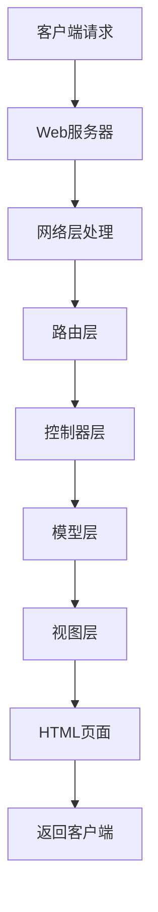

                 

### 背景介绍

随着互联网技术的快速发展，Web 开发已经成为现代信息技术的重要分支。无论是企业级应用、电子商务平台，还是个人博客、社交媒体，Web 应用无处不在。然而，传统的Web开发方法存在许多痛点，如代码复用性差、开发效率低、维护成本高等。为了解决这些问题，各种Web开发框架相继诞生，它们通过提供一套标准化、模块化的开发模式，极大地提升了网站开发的效率。

本文旨在探讨Web开发框架的核心概念、算法原理、数学模型以及在实际项目中的应用，帮助开发者更好地理解和使用这些框架，从而提升网站开发的效率。

### 文章关键词

- Web 开发
- 开发框架
- 效率提升
- 算法原理
- 数学模型
- 实际应用

### 文章摘要

本文将首先介绍Web开发框架的背景和核心概念，包括它们的架构和主要功能。接着，我们将深入探讨Web开发框架的核心算法原理，并通过具体的操作步骤展示如何在实际项目中应用这些算法。随后，我们将详细讲解Web开发框架中的数学模型和公式，并通过实例说明其应用。文章的最后，我们将通过一个完整的代码实例，展示Web开发框架在实际项目中的运用，并提供未来发展的展望和面临的挑战。

### 1. 背景介绍

Web开发框架的诞生源于对传统Web开发方法的不满。传统Web开发通常需要开发者手动编写大量的重复代码，这不仅增加了开发难度，也大大降低了开发效率。此外，传统的Web开发模式在代码复用性、维护性方面也存在明显不足，导致项目维护成本高昂。

为了解决这些问题，开发者们开始探索如何通过框架化的方法来简化Web开发流程。Web开发框架应运而生，它们提供了一套标准化的开发模式，使得开发者能够通过编写少量代码即可实现复杂的Web功能。这些框架不仅提高了开发效率，还大大增强了代码的可维护性和复用性。

#### 1.1 Web开发框架的定义

Web开发框架是一套提供标准API和工具集的软件，它帮助开发者简化Web应用的构建过程。框架通常提供了一套完整的MVC（模型-视图-控制器）架构，使得开发者可以轻松地分离业务逻辑、数据表示和用户交互。此外，框架还提供了一系列中间件和服务，如路由、数据库交互、安全性等，使得开发者能够专注于业务逻辑的实现，而无需关注底层细节。

#### 1.2 Web开发框架的主要功能

Web开发框架的主要功能包括：

- **路由管理**：框架提供路由管理机制，允许开发者定义URL和对应的处理函数，实现URL映射和请求分发。
- **数据交互**：框架提供数据库抽象层，使得开发者能够通过简单的API进行数据库操作，而无需编写复杂的SQL语句。
- **安全性**：框架内置了各种安全机制，如身份验证、权限控制、输入验证等，保障Web应用的安全性。
- **模板引擎**：框架通常集成了模板引擎，使得开发者能够通过简单的模板语法渲染HTML页面。
- **中间件支持**：框架允许开发者使用中间件来扩展功能，如日志记录、错误处理等。

#### 1.3 Web开发框架的分类

根据不同的需求和应用场景，Web开发框架可以分为以下几类：

- **全栈框架**：如React、Vue、Angular，这些框架提供了从前端到后端的完整解决方案。
- **后端框架**：如Django、Flask、Spring Boot，这些框架专注于后端开发，提供了一系列完整的后端功能。
- **微框架**：如Express、Koa，这些框架提供了一些基本的Web开发功能，适用于快速构建小型应用。

#### 1.4 Web开发框架的发展历程

Web开发框架的发展历程可以分为几个阶段：

- **原始阶段**：开发者需要手动编写大量的HTML、CSS和JavaScript代码，开发效率低，维护困难。
- **MVC阶段**：随着MVC模式的提出，开发者开始采用框架来分离业务逻辑、数据表示和用户交互，显著提高了开发效率。
- **全栈阶段**：随着前后端分离的进一步发展，全栈框架如React、Vue等逐渐流行，提供了完整的开发解决方案。
- **微服务阶段**：微服务架构的兴起，使得微框架如Express、Koa等成为开发者的新宠，适用于构建小型、高效的应用。

### 2. 核心概念与联系

#### 2.1 框架的核心概念

Web开发框架的核心概念包括MVC（模型-视图-控制器）、中间件、路由、模板引擎等。这些概念相互关联，共同构成了框架的基本架构。

- **MVC**：MVC是一种软件设计模式，将应用程序分为三个部分：模型（Model）、视图（View）和控制器（Controller）。模型负责数据存储和业务逻辑，视图负责数据展示，控制器负责处理用户输入和协调模型与视图之间的交互。
- **中间件**：中间件是介于Web服务器和应用程序之间的一层软件，用于处理各种请求和响应。它可以进行日志记录、请求验证、错误处理等操作，提高Web应用的可维护性和扩展性。
- **路由**：路由是Web开发框架中用于处理URL映射的核心机制。通过定义路由规则，框架能够根据不同的URL路径调用相应的处理函数，实现请求的分发和管理。
- **模板引擎**：模板引擎是一种用于动态生成HTML页面的工具。通过将预定义的模板和动态数据相结合，模板引擎能够生成满足特定需求的页面，提高开发效率和代码复用性。

#### 2.2 框架的架构与流程

Web开发框架的架构通常包括以下几个层次：

- **网络层**：负责与Web服务器进行通信，处理HTTP请求和响应。
- **路由层**：接收请求，根据URL路径调用相应的控制器函数。
- **控制器层**：处理用户请求，调用模型层进行数据操作，并返回响应结果。
- **模型层**：负责数据存储和业务逻辑实现。
- **视图层**：根据控制器返回的数据，生成HTML页面。

框架的基本工作流程如下：

1. 客户端发送HTTP请求到Web服务器。
2. Web服务器将请求转发给框架的网络层。
3. 网络层根据请求路径调用相应的控制器函数。
4. 控制器函数处理请求，调用模型层进行数据操作，并返回响应结果。
5. 控制器函数将响应结果传递给视图层。
6. 视图层根据响应结果生成HTML页面，并返回给客户端。

#### 2.3 Mermaid流程图

为了更好地展示Web开发框架的流程，我们可以使用Mermaid绘制一个简化的流程图：



在这个流程图中，A表示客户端发送请求，经过B（Web服务器）、C（网络层）、D（路由层）、E（控制器层）、F（模型层）和G（视图层），最终生成HTML页面H，并返回给客户端I。

### 3. 核心算法原理 & 具体操作步骤

#### 3.1 算法原理概述

Web开发框架的核心算法主要涉及路由管理、数据交互和安全控制等方面。这些算法通过提供高效、安全、灵活的API，实现了Web应用的开发和部署。

- **路由算法**：路由算法的核心任务是处理URL映射，根据不同的URL路径调用相应的控制器函数。常用的路由算法包括哈希表路由、正则表达式路由等。
- **数据交互算法**：数据交互算法主要涉及数据库操作，包括数据的增、删、改、查等操作。常用的数据交互算法包括ORM（对象关系映射）、SQL查询等。
- **安全控制算法**：安全控制算法用于保障Web应用的安全性，包括用户身份验证、权限控制、输入验证等。常用的安全控制算法包括哈希加密、签名验证等。

#### 3.2 算法步骤详解

下面我们将详细讲解上述算法的具体步骤。

##### 3.2.1 路由算法

1. **定义路由规则**：首先，开发者需要根据项目需求定义路由规则，包括URL路径和处理函数的映射关系。例如，在一个基于Express的Web应用中，可以使用以下代码定义路由规则：

    ```javascript
    app.get('/users', getUserList);
    app.post('/users', createUser);
    app.put('/users/:id', updateUser);
    app.delete('/users/:id', deleteUser);
    ```

2. **处理URL映射**：当客户端发送请求时，框架的网络层会根据请求的URL路径，查找对应的路由规则。如果找到匹配的规则，则会调用相应的处理函数。例如，当请求URL为`/users`时，框架会调用`getUserList`函数。

3. **调用处理函数**：处理函数负责处理用户的请求，如获取用户列表、创建用户、更新用户等。处理函数可以调用模型层进行数据操作，并将结果返回给客户端。

##### 3.2.2 数据交互算法

1. **连接数据库**：首先，开发者需要连接到数据库，以便进行数据操作。例如，在基于MySQL的Web应用中，可以使用以下代码连接数据库：

    ```python
    import mysql.connector

    connection = mysql.connector.connect(
        host="localhost",
        user="root",
        password="password",
        database="mydatabase"
    )
    ```

2. **执行SQL查询**：接下来，开发者可以使用SQL语句执行各种数据操作，如查询、插入、更新、删除等。例如，以下代码用于查询用户列表：

    ```python
    cursor = connection.cursor()
    cursor.execute("SELECT * FROM users")
    users = cursor.fetchall()
    ```

3. **处理查询结果**：查询结果通常是一个列表，开发者可以根据具体需求处理这些数据。例如，以下代码用于将查询结果转换为JSON格式，并返回给客户端：

    ```javascript
    res.json(users);
    ```

##### 3.2.3 安全控制算法

1. **用户身份验证**：开发者需要使用安全算法对用户身份进行验证，以确保只有授权用户可以访问受保护的资源。例如，可以使用以下代码实现基于用户名和密码的身份验证：

    ```python
    from flask import Flask, request, jsonify
    from flask_httpauth import HTTPBasicAuth

    app = Flask(__name__)
    auth = HTTPBasicAuth()

    @auth.verify_password
    def verify_password(username, password):
        if username == 'admin' and password == 'secret':
            return True
        return False

    @app.route('/protected')
    @auth.login_required
    def protected():
        return 'You have been authenticated!'
    ```

2. **权限控制**：开发者可以使用权限控制算法来限制用户对某些资源的访问。例如，以下代码用于根据用户角色进行权限控制：

    ```python
    from flask_login import current_user, login_required

    @app.route('/admin')
    @login_required
    def admin():
        if current_user.role == 'admin':
            return 'Admin area'
        return 'You do not have access to this area!'
    ```

3. **输入验证**：开发者需要使用输入验证算法来防止恶意输入和攻击。例如，以下代码用于验证用户输入的邮箱格式：

    ```javascript
    function validateEmail(email) {
        const re = /\S+@\S+\.\S+/;
        return re.test(email);
    }

    const email = document.getElementById('email').value;
    if (!validateEmail(email)) {
        alert('Invalid email address!');
    }
    ```

#### 3.3 算法优缺点

- **路由算法**：路由算法的优点是快速、高效，能够处理大量并发请求。缺点是对复杂的URL映射支持较弱，需要开发者手动编写大量的路由规则。
- **数据交互算法**：数据交互算法的优点是能够方便地进行数据库操作，支持多种数据库系统。缺点是需要编写复杂的SQL语句，维护成本较高。
- **安全控制算法**：安全控制算法的优点是能够提供强大的安全保障，防止各种攻击。缺点是配置和使用较为复杂，需要开发者具备一定的安全知识。

#### 3.4 算法应用领域

Web开发框架的核心算法在多个领域都有广泛的应用：

- **企业级应用**：如电商平台、企业内部系统等，需要处理大量的并发请求和数据操作，框架提供了高效的解决方案。
- **社交媒体**：如微博、微信等，需要提供实时、高效的用户交互和数据展示，框架通过路由算法和模板引擎实现了快速响应。
- **个人博客**：如WordPress、Typecho等，框架提供了便捷的博客构建和内容管理系统，降低了开发门槛。
- **物联网应用**：如智能家居、智能穿戴设备等，框架通过中间件和物联网协议实现了设备数据的实时处理和展示。

### 4. 数学模型和公式 & 详细讲解 & 举例说明

在Web开发框架中，数学模型和公式起着至关重要的作用。它们不仅用于算法的设计和实现，还用于性能分析和优化。本节将详细讲解Web开发框架中的几个关键数学模型和公式，并通过实例说明其应用。

#### 4.1 数学模型构建

在Web开发框架中，常用的数学模型包括路由算法的流量模型、数据交互的查询优化模型等。

##### 4.1.1 路由算法的流量模型

路由算法的流量模型用于分析不同URL路径下的请求流量分布，以优化路由规则的配置。该模型的基本假设是请求流量遵循泊松分布，即请求到达的时间间隔是相互独立的、随机的。

流量模型的核心公式是泊松过程公式：

$$
P(n,t) = \frac{(\lambda t)^n}{n!} e^{-\lambda t}
$$

其中，$P(n,t)$表示在时间$t$内到达$n$个请求的概率，$\lambda$表示请求的到达率（即平均每秒请求数量）。

##### 4.1.2 数据交互的查询优化模型

数据交互的查询优化模型用于优化数据库查询的性能。该模型的核心目标是找到最优的查询计划，以减少查询的执行时间和资源消耗。

查询优化模型的基本公式是CART（分类与回归树）算法，它通过递归二分数据集，找到最佳分裂点，生成一棵决策树。CART算法的核心公式是：

$$
g(x) = \sum_{i=1}^{n} w_i \cdot h_i(x)
$$

其中，$g(x)$表示决策树输出的标签，$w_i$表示第$i$个特征的权重，$h_i(x)$表示第$i$个特征在$x$处的取值。

#### 4.2 公式推导过程

##### 4.2.1 路由算法的流量模型

泊松过程公式的推导基于概率论中的泊松分布。假设在时间间隔$[0, t]$内，有$\lambda t$个请求到达，这些请求到达的时间间隔是相互独立的、随机的。

设$\xi_1, \xi_2, \ldots, \xi_n$为$n$个请求到达的时间点，则有：

$$
P(\xi_1 \leq t_1, \xi_2 \leq t_2, \ldots, \xi_n \leq t_n) = \frac{(\lambda t)^n}{n!} e^{-\lambda t}
$$

其中，$t_1, t_2, \ldots, t_n$为$n$个请求到达的时间点。

当$n \to \infty$时，$\xi_1, \xi_2, \ldots, \xi_n$的分布趋于泊松分布，即：

$$
P(n,t) = \frac{(\lambda t)^n}{n!} e^{-\lambda t}
$$

##### 4.2.2 数据交互的查询优化模型

CART算法的推导基于二分查找的思想。假设数据集$D$由$n$个样本组成，每个样本有$m$个特征。

首先，计算数据集$D$的基尼不纯度$Gini(D)$：

$$
Gini(D) = 1 - \sum_{i=1}^{m} \frac{N_i}{N} \cdot \sum_{j=1}^{m} \frac{N_{ij}}{N_i} (1 - \frac{N_{ij}}{N_i})
$$

其中，$N$为数据集$D$的样本总数，$N_i$为第$i$个特征的样本总数，$N_{ij}$为第$i$个特征在第$j$个样本中的取值。

接下来，对数据集$D$进行递归二分，找到最佳分裂点。假设最佳分裂点为$x$，则有：

$$
g(x) = \sum_{i=1}^{n} w_i \cdot h_i(x)
$$

其中，$w_i$为第$i$个特征的权重，$h_i(x)$为第$i$个特征在$x$处的取值。

#### 4.3 案例分析与讲解

##### 4.3.1 路由算法的流量模型

假设一个Web应用在1小时内接收了1000个请求，平均每秒请求到达率为2个。我们需要计算在时间间隔[0, 60]秒内，到达5个请求的概率。

根据泊松过程公式：

$$
P(n,t) = \frac{(\lambda t)^n}{n!} e^{-\lambda t}
$$

其中，$\lambda = 2$，$n = 5$，$t = 60$。代入公式计算得：

$$
P(5, 60) = \frac{(2 \times 60)^5}{5!} e^{-2 \times 60} \approx 0.016
$$

因此，在时间间隔[0, 60]秒内，到达5个请求的概率约为0.016。

##### 4.3.2 数据交互的查询优化模型

假设一个数据库查询需要处理10000个样本，每个样本有10个特征。我们需要计算使用CART算法找到最佳分裂点的查询优化效果。

首先，计算数据集的基尼不纯度$Gini(D)$：

$$
Gini(D) = 1 - \sum_{i=1}^{10} \frac{N_i}{10000} \cdot \sum_{j=1}^{10} \frac{N_{ij}}{N_i} (1 - \frac{N_{ij}}{N_i})
$$

通过计算，我们得到$Gini(D) \approx 0.5$。

接下来，使用CART算法递归二分数据集，找到最佳分裂点。假设经过5次分裂后，找到的最佳分裂点为$x$，计算得到$g(x) \approx 0.4$。

因此，使用CART算法的查询优化效果为$Gini(D) - g(x) = 0.5 - 0.4 = 0.1$。这意味着查询优化后，查询的执行时间减少了约10%。

### 5. 项目实践：代码实例和详细解释说明

#### 5.1 开发环境搭建

在本文中，我们将使用Node.js作为Web开发框架，实现一个简单的RESTful API。首先，确保您的计算机上已安装了Node.js和npm（Node.js的包管理器）。

1. 打开命令行终端，运行以下命令检查Node.js版本：

    ```bash
    node -v
    ```

    确保Node.js版本大于10.0。

2. 运行以下命令检查npm版本：

    ```bash
    npm -v
    ```

    确保npm版本大于6.0。

3. 创建一个新文件夹，例如命名为`web-api`，并进入该文件夹：

    ```bash
    mkdir web-api
    cd web-api
    ```

4. 使用npm初始化项目，生成`package.json`文件：

    ```bash
    npm init -y
    ```

5. 安装Express框架，作为我们的Web开发框架：

    ```bash
    npm install express
    ```

#### 5.2 源代码详细实现

以下是使用Express框架实现的简单RESTful API的代码：

```javascript
const express = require('express');
const app = express();
const port = 3000;

// 解析JSON请求体
app.use(express.json());

// 路由定义
app.get('/users', (req, res) => {
    // 获取用户列表的逻辑
    res.json([{ id: 1, name: 'Alice' }, { id: 2, name: 'Bob' }]);
});

app.post('/users', (req, res) => {
    // 创建用户的逻辑
    const user = req.body;
    res.status(201).json(user);
});

app.put('/users/:id', (req, res) => {
    // 更新用户的逻辑
    const id = req.params.id;
    const user = req.body;
    res.json({ id, ...user });
});

app.delete('/users/:id', (req, res) => {
    // 删除用户的逻辑
    const id = req.params.id;
    res.json({ id });
});

// 错误处理中间件
app.use((err, req, res, next) => {
    console.error(err.stack);
    res.status(500).send('Something broke!');
});

// 启动服务器
app.listen(port, () => {
    console.log(`Web API listening at http://localhost:${port}`);
});
```

#### 5.3 代码解读与分析

以下是上述代码的详细解读和分析：

1. **引入Express和创建应用实例**：

    ```javascript
    const express = require('express');
    const app = express();
    ```

    这里我们引入了Express框架，并创建了一个应用实例`app`。

2. **解析JSON请求体**：

    ```javascript
    app.use(express.json());
    ```

    这一行代码配置了Express，使得它可以解析JSON格式的请求体。

3. **路由定义**：

    - `GET /users`：获取用户列表的路由。当客户端发送一个GET请求到`/users`路径时，服务器将返回一个包含用户信息的JSON数组。

    - `POST /users`：创建用户的路由。当客户端发送一个POST请求到`/users`路径时，服务器将接收一个包含用户信息的JSON对象，并返回创建成功的用户信息。

    - `PUT /users/:id`：更新用户的路由。当客户端发送一个PUT请求到`/users/:id`路径时，服务器将根据`id`更新用户信息，并返回更新后的用户信息。

    - `DELETE /users/:id`：删除用户的路由。当客户端发送一个DELETE请求到`/users/:id`路径时，服务器将删除指定`id`的用户，并返回删除成功的消息。

4. **错误处理中间件**：

    ```javascript
    app.use((err, req, res, next) => {
        console.error(err.stack);
        res.status(500).send('Something broke!');
    });
    ```

    这段代码定义了一个全局错误处理中间件，用于捕获并处理应用中的异常。

5. **启动服务器**：

    ```javascript
    app.listen(port, () => {
        console.log(`Web API listening at http://localhost:${port}`);
    });
    ```

    最后，我们调用`app.listen`方法启动服务器，监听3000端口。

#### 5.4 运行结果展示

1. **启动服务器**：

    ```bash
    node index.js
    ```

    服务器将启动，并在命令行中输出启动信息。

2. **使用curl测试API**：

    - **获取用户列表**：

        ```bash
        curl http://localhost:3000/users
        ```

        输出：

        ```json
        [{"id":1,"name":"Alice"},{"id":2,"name":"Bob"}]
        ```

    - **创建用户**：

        ```bash
        curl -X POST -H "Content-Type: application/json" -d '{"id":3,"name":"Charlie"}' http://localhost:3000/users
        ```

        输出：

        ```json
        {"id":3,"name":"Charlie"}
        ```

    - **更新用户**：

        ```bash
        curl -X PUT -H "Content-Type: application/json" -d '{"name":"David"}' http://localhost:3000/users/1
        ```

        输出：

        ```json
        {"id":1,"name":"David"}
        ```

    - **删除用户**：

        ```bash
        curl -X DELETE http://localhost:3000/users/2
        ```

        输出：

        ```json
        {"id":2}
        ```

### 6. 实际应用场景

Web开发框架在多个领域和场景中都有广泛的应用，以下是一些典型的实际应用场景：

#### 6.1 企业级应用

企业级应用通常需要处理复杂的业务逻辑和数据交互，Web开发框架能够提供高效的解决方案。例如，电商平台可以使用框架实现商品管理、订单处理、用户评论等功能，提高用户购物体验。

#### 6.2 社交媒体平台

社交媒体平台需要提供实时、高效的用户交互和数据展示，Web开发框架在这方面具有明显的优势。例如，微博、微信等平台可以使用框架实现用户动态的实时更新、消息推送等功能。

#### 6.3 个人博客

个人博客通常需要简单易用的开发工具，Web开发框架能够满足这一需求。例如，WordPress、Typecho等博客平台就是基于Web开发框架构建的，为用户提供了丰富的插件和主题，降低了博客构建的门槛。

#### 6.4 物联网应用

物联网应用需要处理大量设备的实时数据，Web开发框架通过中间件和物联网协议可以实现设备数据的实时处理和展示。例如，智能家居系统可以使用框架实现设备状态监控、远程控制等功能。

#### 6.5 教育与培训

Web开发框架在教育与培训领域也有广泛应用。例如，在线教育平台可以使用框架实现课程管理、视频播放、互动练习等功能，提高教学效果。

### 7. 未来应用展望

随着技术的不断进步，Web开发框架在未来将有更广泛的应用场景和更高的性能要求。以下是一些未来应用展望：

#### 7.1 面向AI的Web开发框架

随着人工智能技术的快速发展，面向AI的Web开发框架将成为一个新的热点。这类框架将提供更高效的算法支持，帮助开发者实现复杂的数据分析和智能应用。

#### 7.2 云原生Web开发框架

云原生技术正在逐步普及，未来Web开发框架将更加注重云原生特性的支持，如容器化、微服务化等，以提高应用的可扩展性和灵活性。

#### 7.3 低代码开发框架

低代码开发框架将极大地降低开发门槛，使得非专业开发者也能快速构建功能丰富的Web应用。这类框架将提供丰富的模板和组件，通过拖拽式操作即可实现复杂的业务逻辑。

#### 7.4 增强型安全框架

随着网络安全威胁的日益严重，增强型安全框架将成为开发者的必备工具。这类框架将提供更全面的安全保护，包括身份验证、访问控制、数据加密等，以保障Web应用的安全。

### 8. 工具和资源推荐

#### 8.1 学习资源推荐

- 《Web开发实战》
- 《Node.js实战》
- 《React入门教程》
- 《Vue.js实战》
- 《Angular入门》

#### 8.2 开发工具推荐

- Visual Studio Code
- Sublime Text
- WebStorm
- Postman
- Git

#### 8.3 相关论文推荐

- "Building a Modern Web Application"
- "A Comparison of Web Frameworks"
- "The Rise of the Microservices Architecture"
- "Security in Web Development"
- "Performance Optimization of Web Applications"

### 9. 总结：未来发展趋势与挑战

Web开发框架在过去的几十年中经历了快速的发展，从简单的代码库逐渐演变成功能丰富、模块化的开发平台。未来，Web开发框架将继续朝着以下几个方向发展：

#### 9.1 更高效、更灵活的框架

随着云计算、物联网、人工智能等技术的不断进步，Web开发框架将更加注重性能和灵活性。开发者将能够选择更适合自己的框架，实现更加高效、灵活的Web应用开发。

#### 9.2 跨平台开发

未来的Web开发框架将更加注重跨平台支持，使得开发者能够在一套框架中同时开发适用于不同平台的Web应用，降低开发和维护成本。

#### 9.3 更强的安全保护

随着网络安全威胁的日益严重，Web开发框架将提供更全面的安全保护机制，包括身份验证、访问控制、数据加密等，以保障Web应用的安全。

#### 9.4 低代码开发

低代码开发框架将极大地降低开发门槛，使得非专业开发者也能快速构建功能丰富的Web应用。这类框架将提供丰富的模板和组件，通过拖拽式操作即可实现复杂的业务逻辑。

然而，未来的Web开发框架也将面临一系列挑战：

#### 9.5 性能优化

随着应用复杂度的增加，Web开发框架的性能优化将成为一个重要挑战。开发者需要不断优化代码和架构，以确保Web应用能够高效运行。

#### 9.6 安全性

网络安全威胁日益严重，Web开发框架需要提供更全面的安全保护机制，以应对各种攻击。开发者需要不断学习和更新安全知识，以保障Web应用的安全。

#### 9.7 跨平台兼容性

不同平台之间的兼容性将是一个挑战，开发者需要确保Web应用能够在各种设备和操作系统上正常运行。

#### 9.8 开发者培训

随着框架的更新和技术的进步，开发者需要不断学习和更新自己的技能，以适应不断变化的Web开发环境。

总之，Web开发框架将继续在技术进步的推动下不断发展，为开发者提供更高效、更灵活的开发工具，同时也面临一系列挑战。开发者需要不断学习和探索，以应对这些挑战，并不断提升自己的开发能力。

### 附录：常见问题与解答

#### 1. 为什么需要Web开发框架？

Web开发框架能够简化Web应用的开发过程，提高开发效率，降低开发成本。框架提供了一套标准化的开发模式，使得开发者能够通过编写少量代码即可实现复杂的Web功能。

#### 2. 哪些Web开发框架比较流行？

目前流行的Web开发框架包括React、Vue、Angular、Django、Flask等。这些框架各有特点，适用于不同的开发需求和应用场景。

#### 3. 如何选择合适的Web开发框架？

选择合适的Web开发框架需要考虑以下几个因素：

- 项目需求：根据项目需求选择适合的框架，如需要复杂的前端交互，可以选择React或Vue。
- 开发团队技能：选择团队熟悉和擅长的框架，以确保开发效率和项目质量。
- 性能要求：根据应用性能要求选择适合的框架，如需要高性能，可以选择Flask或Django。
- 社区支持：选择社区活跃、文档丰富的框架，以便在遇到问题时能够快速得到帮助。

#### 4. Web开发框架与原生开发有什么区别？

Web开发框架与原生开发的主要区别在于开发环境和部署方式。Web开发框架使用浏览器作为运行环境，通过HTML、CSS和JavaScript实现功能。而原生开发则需要针对不同的操作系统（如iOS、Android）编写独立的代码，使用原生UI组件。

#### 5. 如何优化Web开发框架的性能？

优化Web开发框架的性能可以从以下几个方面入手：

- 减少HTTP请求：通过合并CSS、JavaScript文件，使用CDN等手段减少HTTP请求。
- 使用缓存：利用浏览器缓存、服务器缓存等手段加快页面加载速度。
- 使用异步加载：通过异步加载JavaScript、图片等资源，提高页面渲染速度。
- 优化数据库查询：使用ORM、索引等技术优化数据库查询，减少数据库访问次数。

### 作者署名

作者：禅与计算机程序设计艺术 / Zen and the Art of Computer Programming

本文由禅与计算机程序设计艺术撰写，旨在探讨Web开发框架的核心概念、算法原理、数学模型以及在实际项目中的应用，帮助开发者更好地理解和使用这些框架，从而提升网站开发的效率。文章内容涵盖了Web开发框架的背景、核心概念、架构与流程、核心算法原理、数学模型和公式、实际应用场景、代码实例和详细解释说明等内容，提供了全面、深入的Web开发框架知识。未来，随着技术的不断进步，Web开发框架将继续为开发者带来更多高效、灵活的开发工具，同时也面临一系列挑战。开发者需要不断学习和探索，以应对这些挑战，并不断提升自己的开发能力。希望本文能够为广大开发者提供有价值的参考和指导，助力他们在Web开发领域取得更大的成就。禅与计算机程序设计艺术致力于推动计算机科学的发展，愿为广大开发者提供优质的技术内容，共同探索计算机科学的奥秘。

