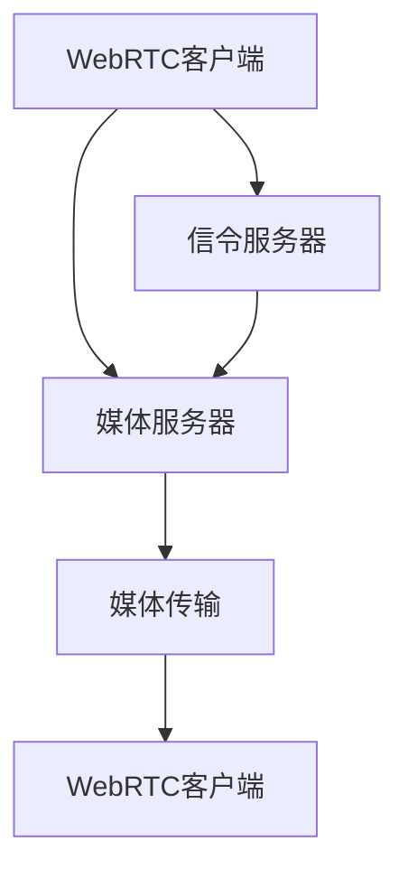
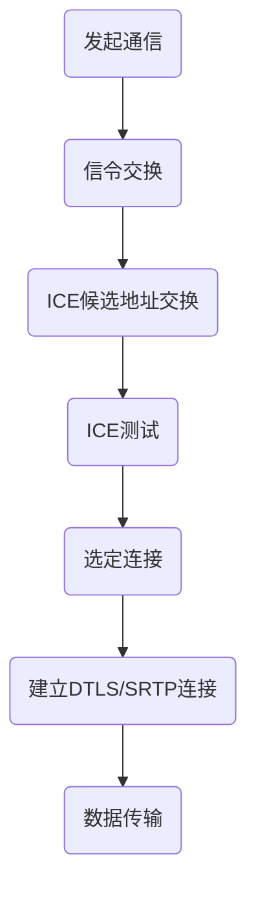

                 

 WebRTC（Web Real-Time Communication）是一种支持浏览器进行实时语音、视频和消息通信的开源协议，它允许网络应用或站点在不使用第三方插件的情况下，在浏览器中实现实时通信功能。WebRTC在现代网络通信中扮演着越来越重要的角色，特别是在需要实时互动的应用场景中，如在线教育、远程医疗、视频会议和在线游戏等。

> 关键词：WebRTC、实时通信、浏览器、互动、语音、视频、消息通信

> 摘要：本文将深入探讨WebRTC协议在浏览器中的应用，解释其核心概念和原理，提供具体的实现步骤和代码实例，分析其在不同应用场景中的表现，并展望未来的发展趋势和面临的挑战。

## 1. 背景介绍

WebRTC起源于Google，旨在提供一种无需插件、可以在任何浏览器中运行的实时通信解决方案。最初，WebRTC是为了在浏览器之间进行简单的P2P通信，后来逐渐扩展到支持语音、视频和数据共享等多种通信方式。WebRTC协议的设计目标是实现高效率、低延迟、高可靠性的实时通信。

WebRTC的关键特性包括：

- **P2P通信**：WebRTC支持端到端的P2P通信，不需要经过服务器中转。
- **安全性**：通过信令交换和加密协议确保通信安全。
- **跨平台性**：WebRTC可以在各种操作系统和浏览器上运行。
- **低延迟**：优化了传输路径，减少了数据传输的延迟。

随着WebRTC技术的成熟，越来越多的应用开始采用它来实现实时通信功能。WebRTC不仅被用于Web应用，还被用于移动应用，从而极大地扩展了其应用范围。

## 2. 核心概念与联系

### 2.1 WebRTC协议架构

WebRTC协议由几个关键组件构成，包括数据通道（Data Channels）、媒体传输（Media Transmission）和信令（Signaling）。以下是一个简化的WebRTC架构图：



- **信令服务器**：用于交换信令数据，如身份验证信息、媒体类型和参数等。
- **媒体服务器**：可选组件，用于处理媒体流，如转码和混音等。
- **数据通道**：允许浏览器之间直接传输数据，如文本消息、文件等。
- **媒体传输**：通过ICE（Interactive Connectivity Establishment）、DTLS（Datagram Transport Layer Security）和SRTP（Secure Real-time Transport Protocol）等协议进行数据传输。

### 2.2 核心概念原理

**ICE**：ICE协议用于发现和选择最佳的通信路径。它通过一系列的候选地址交换和测试，选择最优的连接。

**DTLS**：DTLS是一种加密协议，用于确保通信的安全性。它对数据包进行加密，防止窃听和篡改。

**SRTP**：SRTP是一种传输层协议，用于对实时传输的数据进行加密和同步。

### 2.3 Mermaid 流程图

以下是一个简单的WebRTC通信流程的Mermaid流程图：



## 3. 核心算法原理 & 具体操作步骤

### 3.1 算法原理概述

WebRTC的核心算法主要涉及网络发现、媒体传输和信令交换。以下是这些算法的基本原理：

- **网络发现**：通过ICE协议发现和选择最佳的通信路径。
- **媒体传输**：通过SRTP和DTLS协议进行数据加密和传输。
- **信令交换**：通过HTTP/HTTPS协议在服务器和客户端之间交换信令数据。

### 3.2 算法步骤详解

以下是WebRTC通信的基本步骤：

1. **建立信令连接**：客户端和服务器通过信令协议交换会话描述协议（SDP）和数据通道信息。
2. **ICE候选地址交换**：客户端和服务器交换ICE候选地址，进行网络路径发现。
3. **ICE测试**：进行候选地址测试，选择最优的通信路径。
4. **建立媒体连接**：通过ICE测试后，客户端和服务器建立DTLS和SRTP连接。
5. **数据传输**：通过数据通道传输语音、视频和数据。

### 3.3 算法优缺点

**优点**：

- 无需插件，跨平台兼容性好。
- 高效的P2P通信，低延迟。
- 强大的加密和安全性。

**缺点**：

- 需要一定的网络配置，对网络环境要求较高。
- 需要复杂的信令和媒体处理，实现难度较大。

### 3.4 算法应用领域

WebRTC在多种应用领域都有广泛的应用，如：

- 视频会议：用于企业内部的远程会议和协作。
- 在线教育：实现师生之间的实时互动。
- 远程医疗：支持医生和患者之间的实时视频咨询。
- 在线游戏：实现玩家之间的实时语音和数据交互。

## 4. 数学模型和公式 & 详细讲解 & 举例说明

### 4.1 数学模型构建

WebRTC的通信过程涉及多个数学模型，包括网络模型、加密模型和传输模型。以下是这些模型的基本构成：

- **网络模型**：基于概率论和图论，用于评估网络路径的质量。
- **加密模型**：基于加密学原理，确保通信的安全性。
- **传输模型**：基于信息论，优化数据的传输效率。

### 4.2 公式推导过程

以下是一个简单的网络模型公式的推导：

假设网络中的两个节点A和B，它们的通信延迟为\(L\)，带宽为\(B\)，丢包率为\(P\)。我们可以使用以下公式评估网络路径的质量：

\[ Q = \frac{B}{L + P \cdot B} \]

### 4.3 案例分析与讲解

假设我们有一个WebRTC通信场景，客户端A和服务器B之间的通信延迟为100ms，带宽为1Mbps，丢包率为1%。我们可以使用上述公式计算网络路径的质量：

\[ Q = \frac{1}{100 + 1 \cdot 100} = \frac{1}{200} = 0.005 \]

这意味着在这个场景下，网络路径的质量为0.005。这表明网络传输效率较低，可能需要优化网络配置。

## 5. 项目实践：代码实例和详细解释说明

### 5.1 开发环境搭建

要在项目中实现WebRTC通信，需要以下开发环境：

- **浏览器**：支持WebRTC的浏览器，如Chrome、Firefox等。
- **Node.js**：用于搭建信令服务器。
- **WebRTC JavaScript库**：如RTCPeerConnection，用于处理WebRTC通信。

### 5.2 源代码详细实现

以下是一个简单的WebRTC信令服务器和客户端的示例代码：

**信令服务器**：

```javascript
const http = require('http');
const { RTCPeerConnection, RTCSessionDescription, RTCIceCandidate } } = require('wrtc');

const server = http.createServer((request, response) => {
    const connection = new RTCPeerConnection();
    // ... 生成和发送offer/answer
    response.end();
});

server.listen(3000, () => {
    console.log('信令服务器启动，端口：3000');
});
```

**客户端**：

```javascript
const { RTCPeerConnection } = require('wrtc');

const connection = new RTCPeerConnection();
// ... 发送offer/接收answer

connection.onicecandidate = (event) => {
    if (event.candidate) {
        // 发送ICE候选地址到信令服务器
    }
};

connection.createOffer().then((offer) => {
    // 发送offer到信令服务器
    connection.setLocalDescription(offer);
}).catch((error) => {
    console.error('创建offer出错：', error);
});
```

### 5.3 代码解读与分析

这段代码展示了如何使用WebRTC库在Node.js中搭建信令服务器和客户端。信令服务器用于处理客户端发送的信令请求，客户端则负责处理ICE候选地址和媒体流。

### 5.4 运行结果展示

在运行上述代码后，客户端和服务器之间将建立信令连接，并交换ICE候选地址和媒体流。最后，客户端和服务器将成功建立媒体连接，实现实时通信。

## 6. 实际应用场景

### 6.1 在线教育

WebRTC可以用于在线教育平台，实现师生之间的实时语音、视频和互动。通过WebRTC，教师可以实时与学生交流，提高教学效果。

### 6.2 视频会议

WebRTC支持企业级视频会议系统，实现多人实时语音、视频和数据交互。WebRTC的高效性和低延迟特性使得视频会议更加流畅。

### 6.3 远程医疗

WebRTC可以用于远程医疗服务，实现医生和患者之间的实时视频咨询。WebRTC的加密特性确保了通信的安全性。

### 6.4 在线游戏

WebRTC可以用于在线游戏平台，实现玩家之间的实时语音和数据交互。通过WebRTC，玩家可以更好地协作和交流。

## 7. 工具和资源推荐

### 7.1 学习资源推荐

- **WebRTC官网**：https://webrtc.org/
- **MDN WebRTC文档**：https://developer.mozilla.org/en-US/docs/Web/API/WebRTC_API
- **《WebRTC编程实战》**：一本关于WebRTC编程的实践指南。

### 7.2 开发工具推荐

- **WebRTC测试工具**：https://webrtc.github.io/samples/
- **WebRTC浏览器插件**：Chrome、Firefox等。

### 7.3 相关论文推荐

- **《WebRTC: Real-Time Communication Beyond Plug-ins》**：一篇关于WebRTC的综述性论文。

## 8. 总结：未来发展趋势与挑战

### 8.1 研究成果总结

WebRTC作为一种高效、低延迟、安全的实时通信协议，已经在多个领域得到广泛应用。未来，WebRTC有望在更多场景中得到推广和应用。

### 8.2 未来发展趋势

- **跨平台支持**：WebRTC将逐渐支持更多的操作系统和设备。
- **标准化**：随着WebRTC技术的成熟，其标准化进程将加快。
- **应用场景拓展**：WebRTC将在更多领域得到应用，如物联网、虚拟现实等。

### 8.3 面临的挑战

- **网络环境优化**：需要进一步优化网络环境，提高WebRTC的兼容性和性能。
- **安全性提升**：需要加强对通信过程中的安全保护，防范恶意攻击。

### 8.4 研究展望

WebRTC具有广泛的应用前景，未来将在实时通信领域发挥更加重要的作用。我们期待看到WebRTC在更多领域的突破和应用。

## 9. 附录：常见问题与解答

### Q: WebRTC是否支持移动设备？

A: 是的，WebRTC支持移动设备，包括iOS和Android设备。

### Q: WebRTC需要服务器支持吗？

A: 是的，WebRTC需要信令服务器支持，用于交换信令数据。

### Q: WebRTC如何保证通信的安全性？

A: WebRTC通过DTLS和SRTP协议确保通信的安全性，对数据包进行加密和同步。

### Q: WebRTC是否支持数据通道？

A: 是的，WebRTC支持数据通道，允许浏览器之间直接传输数据。

## 作者署名

作者：禅与计算机程序设计艺术 / Zen and the Art of Computer Programming
----------------------------------------------------------------

以上就是关于《WebRTC 实时通信协议在浏览器中的应用：实现互动和通信》的完整文章。希望本文对您在WebRTC技术领域的学习和应用有所帮助。感谢您的阅读。

