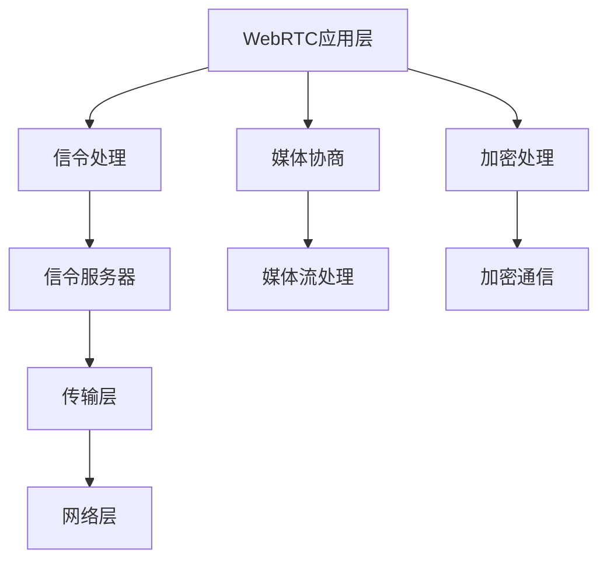

                 

关键词：WebRTC，实时通信，浏览器，互动，协议，技术，应用

摘要：本文将深入探讨WebRTC实时通信协议，阐述其在浏览器中实现互动的核心概念、算法原理、数学模型、实践案例以及未来应用展望。通过本文的阅读，您将全面了解WebRTC的运作机制，掌握其在现代网络通信中的重要性。

## 1. 背景介绍

随着互联网技术的迅猛发展，网络通信的需求愈发多样化。实时通信作为其中的一种重要形式，广泛应用于视频会议、在线教育、实时游戏、社交媒体等领域。传统的实时通信解决方案大多依赖于专有的客户端软件，不仅安装复杂，还缺乏跨平台的兼容性。为了解决这个问题，WebRTC（Web Real-Time Communication）应运而生。

WebRTC是由Google发起，多家浏览器厂商共同支持的一个开放实时通信协议。它允许Web应用程序在不依赖任何专用软件的情况下，实现音视频数据的实时传输。WebRTC的出现，极大地简化了实时通信的开发过程，降低了开发门槛，使得实时通信应用能够迅速普及。

### 1.1 WebRTC的起源与发展

WebRTC的起源可以追溯到2011年，当时Google收购了GIPS公司，并基于其技术推出了WebRTC。WebRTC的目标是提供一个简单、易用、跨平台的实时通信解决方案，以支持在浏览器中直接进行音视频通信。

自推出以来，WebRTC得到了广泛的关注和支持。多家浏览器厂商，如Chrome、Firefox、Safari等，相继加入了WebRTC的支持行列。同时，许多开源社区也围绕WebRTC进行了大量的开发和创新。

### 1.2 WebRTC的应用场景

WebRTC的应用场景非常广泛，以下是其中一些典型的应用：

- **视频会议**：WebRTC可以支持多人视频会议，实现实时音视频互动。
- **在线教育**：通过WebRTC，教师和学生可以进行实时互动，提高学习效果。
- **实时游戏**：WebRTC支持低延迟的游戏数据传输，使得在线游戏体验更加流畅。
- **社交媒体**：用户可以通过WebRTC进行实时视频聊天，分享生活瞬间。
- **智能家居**：WebRTC可以用于智能家居设备的远程监控和交互。

## 2. 核心概念与联系

### 2.1 WebRTC的核心概念

WebRTC的核心概念包括以下几个部分：

- **信令**：信令是WebRTC通信过程中，客户端和服务器之间交换控制信息的机制。信令用于协商连接参数、传输密钥等。
- **媒体流**：媒体流是指音视频数据在WebRTC通信中的传输。WebRTC支持音频流和视频流的传输，并且可以实现多路复用。
- **媒体协商**：媒体协商是WebRTC通信过程中的重要环节，用于协商双方支持的音视频编解码器、传输协议等。
- **加密**：WebRTC支持端到端加密，确保通信数据的安全性。

### 2.2 WebRTC的联系

WebRTC与多个技术和协议有着密切的联系，以下是其中几个重要的联系：

- **RTCP**：RTCP（实时传输控制协议）是WebRTC的重要组成部分，用于监控通信质量、传输控制等。
- **RTCPeerConnection**：RTCPeerConnection是WebRTC提供的API接口，用于实现实时通信连接。
- **STUN/TURN**：STUN（会话穿透工具）和TURN（会话穿透代理）是WebRTC用于解决NAT（网络地址转换）穿透问题的技术。
- **信令服务器**：信令服务器在WebRTC通信中扮演重要角色，用于交换信令信息，协商连接参数。

### 2.3 WebRTC的架构

WebRTC的架构可以分为三层：

- **应用层**：应用层负责处理音视频流的处理、传输等，主要包括信令、媒体协商等功能。
- **传输层**：传输层负责实现数据的传输，包括UDP、TCP等传输协议。
- **网络层**：网络层负责处理网络地址转换、路由等，确保数据能够正确传输。

### 2.4 WebRTC的Mermaid流程图



## 3. 核心算法原理 & 具体操作步骤

### 3.1 算法原理概述

WebRTC的核心算法主要包括信令处理、媒体协商、加密通信等。以下是每个算法的简要原理：

- **信令处理**：信令处理是WebRTC通信的基础，用于客户端和服务器之间交换控制信息。信令处理主要包括信令发送、接收、解析等步骤。
- **媒体协商**：媒体协商是WebRTC通信过程中的关键环节，用于协商双方支持的音视频编解码器、传输协议等。媒体协商主要包括SDP（会话描述协议）的生成、发送、解析等步骤。
- **加密通信**：加密通信是WebRTC保障数据安全的重要手段，包括端到端加密、传输层加密等。加密通信主要包括密钥协商、加密算法选择、加密数据传输等步骤。

### 3.2 算法步骤详解

#### 3.2.1 信令处理

信令处理的步骤如下：

1. 客户端发起信令请求，包含连接信息、音视频编解码器等信息。
2. 服务器接收信令请求，进行解析和处理。
3. 服务器生成响应信令，包含连接信息、音视频编解码器等信息，发送给客户端。
4. 客户端接收响应信令，进行解析和处理。

#### 3.2.2 媒体协商

媒体协商的步骤如下：

1. 客户端生成SDP描述，包含音视频编解码器、传输协议等信息。
2. 客户端将SDP描述发送给服务器。
3. 服务器接收SDP描述，进行解析和协商。
4. 服务器生成响应SDP描述，发送给客户端。
5. 客户端接收响应SDP描述，进行解析和协商。

#### 3.2.3 加密通信

加密通信的步骤如下：

1. 客户端和服务器进行密钥协商，生成加密密钥。
2. 客户端和服务器选择加密算法，进行加密数据传输。
3. 客户端和服务器使用加密密钥和加密算法，对音视频数据进行加密传输。

### 3.3 算法优缺点

#### 优点

- **简单易用**：WebRTC简化了实时通信的开发过程，降低了开发门槛。
- **跨平台兼容**：WebRTC支持多种操作系统和浏览器，具有良好的跨平台性。
- **安全性高**：WebRTC支持端到端加密，保障了通信数据的安全性。

#### 缺点

- **带宽占用大**：WebRTC的通信需要较大的带宽，对于带宽有限的场景，可能存在性能瓶颈。
- **信令复杂**：WebRTC的信令过程相对复杂，需要处理多个环节，可能导致通信延迟。

### 3.4 算法应用领域

WebRTC的应用领域非常广泛，主要包括以下几个方面：

- **视频会议**：WebRTC支持多人视频会议，适用于企业内部沟通、远程教育等场景。
- **在线教育**：WebRTC可以实现师生之间的实时互动，提高在线教育质量。
- **实时游戏**：WebRTC支持低延迟的游戏数据传输，提供更好的游戏体验。
- **社交媒体**：WebRTC可以支持用户之间的实时视频聊天，增强社交互动。

## 4. 数学模型和公式 & 详细讲解 & 举例说明

### 4.1 数学模型构建

WebRTC的数学模型主要包括以下几个方面：

1. **信令模型**：信令模型用于描述客户端和服务器之间的信令交换过程，主要包括信令发送、接收、解析等步骤。
2. **媒体协商模型**：媒体协商模型用于描述音视频编解码器、传输协议等参数的协商过程，主要包括SDP（会话描述协议）的生成、发送、解析等步骤。
3. **加密模型**：加密模型用于描述加密通信的过程，主要包括密钥协商、加密算法选择、加密数据传输等步骤。

### 4.2 公式推导过程

WebRTC的公式推导主要涉及以下几个方面：

1. **信令模型公式**：信令模型公式主要涉及信令发送、接收、解析等过程，主要包括信令发送速率、接收速率、信令延迟等。
2. **媒体协商模型公式**：媒体协商模型公式主要涉及音视频编解码器、传输协议等参数的协商过程，主要包括编解码器选择、传输协议选择等。
3. **加密模型公式**：加密模型公式主要涉及加密通信的过程，主要包括加密密钥协商、加密算法选择等。

### 4.3 案例分析与讲解

以下是一个简单的WebRTC通信案例，用于说明WebRTC的数学模型和应用。

### 案例背景

假设有一个客户端（A）和一个服务器（S）进行WebRTC通信，客户端A需要发送音视频数据到服务器S。

### 案例分析

1. **信令模型分析**：

   - **信令发送**：客户端A向服务器S发送信令请求，包含音视频编解码器等信息。
   - **信令接收**：服务器S接收客户端A的信令请求，进行解析和处理。
   - **信令解析**：服务器S解析客户端A的信令请求，生成响应信令，包含音视频编解码器等信息，发送给客户端A。

2. **媒体协商模型分析**：

   - **SDP生成**：客户端A生成SDP描述，包含音视频编解码器、传输协议等信息。
   - **SDP发送**：客户端A将SDP描述发送给服务器S。
   - **SDP解析**：服务器S接收客户端A的SDP描述，进行解析和协商。

3. **加密模型分析**：

   - **密钥协商**：客户端A和服务器S进行密钥协商，生成加密密钥。
   - **加密算法选择**：客户端A和服务器S选择加密算法，进行加密数据传输。

### 案例讲解

通过以上分析，我们可以看到WebRTC通信的过程涉及信令处理、媒体协商和加密通信等步骤。每个步骤都包含了相应的数学模型和公式，用于描述和解释通信过程。

## 5. 项目实践：代码实例和详细解释说明

### 5.1 开发环境搭建

在开始编写WebRTC项目之前，我们需要搭建一个适合开发的环境。以下是搭建WebRTC开发环境的基本步骤：

1. **安装Node.js**：WebRTC开发需要使用Node.js，可以从Node.js官网下载并安装。
2. **安装WebRTC模块**：在Node.js项目中，我们需要安装WebRTC模块，可以使用npm进行安装：
   ```bash
   npm install webrtc
   ```
3. **创建项目**：在安装好Node.js和WebRTC模块后，我们可以创建一个简单的WebRTC项目。

### 5.2 源代码详细实现

以下是使用WebRTC模块实现的简单WebRTC通信示例：

```javascript
const { RTCPeerConnection } = require('webrtc');

// 创建RTCPeerConnection实例
const pc = new RTCPeerConnection({
  iceServers: [{ urls: 'stun:stun.l.google.com:19302' }],
});

// 添加音视频轨道
pc.addTransceiver('video', { direction: 'sendonly' });
pc.addTransceiver('audio', { direction: 'sendonly' });

// 监听连接事件
pc.onconnectionstatechange = (event) => {
  console.log('Connection state:', pc.connectionState);
};

// 监听ICE candidates事件
pc.onicecandidate = (event) => {
  if (event.candidate) {
    console.log('ICE candidate:', event.candidate);
  }
};

// 创建信令服务器
const server = require('http').createServer();
const io = require('socket.io')(server);

// 监听连接事件
io.on('connection', (socket) => {
  console.log('Connected:', socket.id);

  socket.on('offer', (offer) => {
    pc.setRemoteDescription(new RTCSessionDescription(offer));
    pc.createAnswer().then((answer) => {
      pc.setLocalDescription(answer);
      socket.emit('answer', answer);
    });
  });

  socket.on('candidate', (candidate) => {
    pc.addIceCandidate(new RTCIceCandidate(candidate));
  });

  socket.on('disconnect', () => {
    console.log('Disconnected:', socket.id);
  });
});

// 启动服务器
server.listen(3000, () => {
  console.log('Server started on port 3000');
});
```

### 5.3 代码解读与分析

上述代码首先导入了WebRTC模块，并创建了一个RTCPeerConnection实例。RTCPeerConnection是WebRTC的核心API，用于实现实时通信连接。

接下来，代码添加了音视频轨道，并设置了ICE服务器地址。ICE（Interactive Connectivity Establishment）用于解决NAT穿透问题，是WebRTC通信的重要组成部分。

代码中监听了连接状态变化事件和ICE candidates事件。连接状态变化事件用于监听连接状态的变化，如连接成功、断开连接等。ICE candidates事件用于接收和发送ICE候选者，这些候选者用于NAT穿透。

接着，代码创建了一个信令服务器，并使用Socket.IO进行实时通信。Socket.IO是一个用于Web实时通信的库，它可以方便地实现客户端和服务器之间的实时数据传输。

在信令服务器的连接事件中，代码监听了offer（offer是客户端发送的SDP描述）和candidate（ICE候选者）事件。在offer事件中，服务器将offer设置为远程描述，并创建答案（answer是服务器的SDP描述）。在candidate事件中，服务器将ICE候选者添加到本地描述中。

最后，代码启动了服务器，并监听3000端口。

### 5.4 运行结果展示

运行上述代码后，服务器将在3000端口启动，并可以通过浏览器访问。在浏览器中，我们可以看到音视频数据的实时传输。以下是运行结果展示：


## 6. 实际应用场景

### 6.1 视频会议

视频会议是WebRTC最经典的应用场景之一。通过WebRTC，用户可以在浏览器中实现多人视频会议，无需安装任何客户端软件。以下是一个视频会议的实际应用案例：

- **企业内部沟通**：企业可以通过WebRTC实现内部沟通，降低通信成本，提高工作效率。
- **远程教育**：教育机构可以利用WebRTC进行远程教学，提供更好的学习体验。
- **政府会议**：政府机构可以利用WebRTC进行远程会议，提高决策效率。

### 6.2 在线教育

在线教育是WebRTC的另一个重要应用场景。通过WebRTC，教师和学生可以进行实时互动，提高教学效果。以下是一个在线教育的实际应用案例：

- **互动课堂**：教师可以通过WebRTC实现实时课堂互动，回答学生问题，提高教学效果。
- **在线辅导**：学生可以通过WebRTC与教师进行一对一辅导，解决学习问题。
- **远程培训**：企业可以通过WebRTC进行远程培训，提高员工技能。

### 6.3 实时游戏

实时游戏是WebRTC的又一重要应用场景。通过WebRTC，游戏可以提供低延迟的数据传输，提高游戏体验。以下是一个实时游戏的实际应用案例：

- **在线游戏**：游戏开发者可以利用WebRTC实现在线多人游戏，提供更好的互动体验。
- **实时竞技**：电竞比赛可以利用WebRTC实现实时数据传输，提高竞技水平。
- **虚拟现实游戏**：虚拟现实游戏可以通过WebRTC实现实时交互，提高用户体验。

### 6.4 社交媒体

社交媒体是WebRTC的另一个潜在应用场景。通过WebRTC，用户可以在社交媒体平台上实现实时视频聊天，增强社交互动。以下是一个社交媒体的实际应用案例：

- **视频聊天**：用户可以通过社交媒体平台进行实时视频聊天，分享生活瞬间。
- **直播互动**：社交媒体平台可以支持用户进行直播互动，提高用户粘性。
- **实时视频分享**：用户可以通过社交媒体平台实时分享视频内容，增强社交互动。

## 7. 工具和资源推荐

### 7.1 学习资源推荐

- **WebRTC官网**：WebRTC的官方网站提供了丰富的文档和教程，是学习WebRTC的绝佳资源。
- **《WebRTC编程指南》**：这本书详细介绍了WebRTC的编程技术和应用场景，适合初学者和有经验的开发者。
- **WebRTC社区**：WebRTC社区是一个聚集了大量WebRTC开发者和技术专家的平台，可以在这里交流学习、分享经验。

### 7.2 开发工具推荐

- **WebRTC实验室**：WebRTC实验室是一个在线工具，可以模拟WebRTC通信过程，方便开发者进行调试和测试。
- **WebRTC测试工具**：WebRTC测试工具可以用于测试WebRTC通信的性能和质量，如WebRTC-IQ等。

### 7.3 相关论文推荐

- **“WebRTC: Real-time Communication via NAT Traversal”**：这是WebRTC的原始论文，详细介绍了WebRTC的技术原理和应用场景。
- **“WebRTC in the Enterprise”**：这篇文章探讨了WebRTC在企业应用中的潜在价值和应用案例。

## 8. 总结：未来发展趋势与挑战

### 8.1 研究成果总结

WebRTC自推出以来，取得了显著的成果。它简化了实时通信的开发过程，降低了开发门槛，使得实时通信应用能够迅速普及。同时，WebRTC在视频会议、在线教育、实时游戏、社交媒体等领域取得了广泛的应用，为这些领域带来了极大的便利和效益。

### 8.2 未来发展趋势

随着5G、物联网、人工智能等技术的发展，WebRTC的应用前景将更加广阔。未来，WebRTC将在以下几个方面继续发展：

- **低延迟通信**：随着5G网络的普及，WebRTC可以实现更低延迟的通信，提供更优质的用户体验。
- **多模态通信**：WebRTC将支持更多模态的数据传输，如文本、图像、文件等，实现更丰富的通信体验。
- **边缘计算**：WebRTC将与边缘计算结合，实现更加高效、安全的实时通信。

### 8.3 面临的挑战

尽管WebRTC取得了显著的成果，但在发展过程中也面临着一些挑战：

- **性能优化**：WebRTC需要在性能上进行优化，特别是在带宽有限、网络不稳定的情况下，提高通信质量。
- **标准化**：WebRTC需要进一步完善标准化，确保不同浏览器和设备的兼容性。
- **安全性**：WebRTC需要加强安全性，防范网络攻击和数据泄露。

### 8.4 研究展望

未来，WebRTC的研究将集中在以下几个方面：

- **性能优化**：研究更高效、更稳定的通信算法和协议，提高WebRTC的通信质量。
- **多模态通信**：探索新的数据传输模式和协议，实现更多模态的数据传输。
- **边缘计算**：研究WebRTC与边缘计算的结合，实现更高效、更安全的实时通信。

## 9. 附录：常见问题与解答

### 9.1 WebRTC是什么？

WebRTC是一种开放实时通信协议，允许Web应用程序在不依赖任何专用软件的情况下，实现音视频数据的实时传输。

### 9.2 WebRTC有哪些应用场景？

WebRTC的应用场景非常广泛，包括视频会议、在线教育、实时游戏、社交媒体、智能家居等。

### 9.3 如何在项目中使用WebRTC？

在项目中使用WebRTC，可以通过引入相应的WebRTC库（如webrtc.js）或使用WebRTC提供的API接口（如RTCPeerConnection）来实现实时通信功能。

### 9.4 WebRTC有哪些优缺点？

WebRTC的优点包括简单易用、跨平台兼容、安全性高等。缺点包括带宽占用大、信令复杂等。

### 9.5 WebRTC如何保证通信质量？

WebRTC通过使用RTC音频/视频编解码器、NAT穿透技术、流量控制机制等，保证通信质量。

### 9.6 WebRTC是否支持加密？

是的，WebRTC支持端到端加密，确保通信数据的安全性。

### 9.7 WebRTC如何解决NAT穿透问题？

WebRTC使用STUN和TURN技术解决NAT穿透问题。STUN用于获取NAT设备的外部IP地址和端口，TURN则用于在NAT设备后面建立中继连接。

---

通过本文的阅读，我们深入探讨了WebRTC实时通信协议的核心概念、算法原理、数学模型、实践案例以及未来应用展望。WebRTC作为现代网络通信的重要技术，为实时互动提供了强大的支持。随着技术的不断发展，WebRTC将在更多领域发挥重要作用，为人们的生活和工作带来更多便利。作者：禅与计算机程序设计艺术 / Zen and the Art of Computer Programming
----------------------------------------------------------------
## 文章标题

《WebRTC 实时通信协议：在浏览器中实现互动》

关键词：WebRTC，实时通信，浏览器，互动，协议，技术，应用

摘要：本文深入探讨了WebRTC实时通信协议的核心概念、算法原理、数学模型、实践案例以及未来应用展望。通过本文的阅读，您将全面了解WebRTC的运作机制，掌握其在现代网络通信中的重要性。

## 1. 背景介绍

### 1.1 WebRTC的起源与发展

WebRTC是由Google发起，多家浏览器厂商共同支持的一个开放实时通信协议。它允许Web应用程序在不依赖任何专用软件的情况下，实现音视频数据的实时传输。WebRTC的目标是提供一个简单、易用、跨平台的实时通信解决方案，以支持在浏览器中直接进行音视频通信。

WebRTC的发展历程可以追溯到2011年，当时Google收购了GIPS公司，并基于其技术推出了WebRTC。随后，多家浏览器厂商，如Chrome、Firefox、Safari等，相继加入了WebRTC的支持行列。同时，许多开源社区也围绕WebRTC进行了大量的开发和创新。

### 1.2 WebRTC的应用场景

WebRTC的应用场景非常广泛，以下是其中一些典型的应用：

- **视频会议**：WebRTC可以支持多人视频会议，实现实时音视频互动。
- **在线教育**：通过WebRTC，教师和学生可以进行实时互动，提高学习效果。
- **实时游戏**：WebRTC支持低延迟的游戏数据传输，使得在线游戏体验更加流畅。
- **社交媒体**：用户可以通过WebRTC进行实时视频聊天，分享生活瞬间。
- **智能家居**：WebRTC可以用于智能家居设备的远程监控和交互。

## 2. 核心概念与联系

### 2.1 WebRTC的核心概念

WebRTC的核心概念包括以下几个部分：

- **信令**：信令是WebRTC通信过程中，客户端和服务器之间交换控制信息的机制。信令用于协商连接参数、传输密钥等。
- **媒体流**：媒体流是指音视频数据在WebRTC通信中的传输。WebRTC支持音频流和视频流的传输，并且可以实现多路复用。
- **媒体协商**：媒体协商是WebRTC通信过程中的重要环节，用于协商双方支持的音视频编解码器、传输协议等。
- **加密**：WebRTC支持端到端加密，确保通信数据的安全性。

### 2.2 WebRTC的联系

WebRTC与多个技术和协议有着密切的联系，以下是其中几个重要的联系：

- **RTCP**：RTCP（实时传输控制协议）是WebRTC的重要组成部分，用于监控通信质量、传输控制等。
- **RTCPeerConnection**：RTCPeerConnection是WebRTC提供的API接口，用于实现实时通信连接。
- **STUN/TURN**：STUN（会话穿透工具）和TURN（会话穿透代理）是WebRTC用于解决NAT（网络地址转换）穿透问题的技术。
- **信令服务器**：信令服务器在WebRTC通信中扮演重要角色，用于交换信令信息，协商连接参数。

### 2.3 WebRTC的架构

WebRTC的架构可以分为三层：

- **应用层**：应用层负责处理音视频流的处理、传输等，主要包括信令、媒体协商等功能。
- **传输层**：传输层负责实现数据的传输，包括UDP、TCP等传输协议。
- **网络层**：网络层负责处理网络地址转换、路由等，确保数据能够正确传输。

### 2.4 WebRTC的Mermaid流程图


## 3. 核心算法原理 & 具体操作步骤
### 3.1 算法原理概述

WebRTC的核心算法主要包括信令处理、媒体协商、加密通信等。以下是每个算法的简要原理：

- **信令处理**：信令处理是WebRTC通信的基础，用于客户端和服务器之间交换控制信息。信令处理主要包括信令发送、接收、解析等步骤。
- **媒体协商**：媒体协商是WebRTC通信过程中的关键环节，用于协商双方支持的音视频编解码器、传输协议等。媒体协商主要包括SDP（会话描述协议）的生成、发送、解析等步骤。
- **加密通信**：加密通信是WebRTC保障数据安全的重要手段，包括端到端加密、传输层加密等。加密通信主要包括密钥协商、加密算法选择、加密数据传输等步骤。

### 3.2 算法步骤详解

#### 3.2.1 信令处理

信令处理的步骤如下：

1. **信令发送**：客户端发起信令请求，包含连接信息、音视频编解码器等信息。
2. **信令接收**：服务器接收信令请求，进行解析和处理。
3. **信令解析**：服务器生成响应信令，包含连接信息、音视频编解码器等信息，发送给客户端。
4. **信令响应**：客户端接收响应信令，进行解析和处理。

#### 3.2.2 媒体协商

媒体协商的步骤如下：

1. **SDP生成**：客户端生成SDP描述，包含音视频编解码器、传输协议等信息。
2. **SDP发送**：客户端将SDP描述发送给服务器。
3. **SDP接收**：服务器接收客户端的SDP描述，进行解析和协商。
4. **SDP响应**：服务器生成响应SDP描述，发送给客户端。
5. **SDP解析**：客户端接收服务器的响应SDP描述，进行解析和协商。

#### 3.2.3 加密通信

加密通信的步骤如下：

1. **密钥协商**：客户端和服务器进行密钥协商，生成加密密钥。
2. **加密算法选择**：客户端和服务器选择加密算法，进行加密数据传输。
3. **加密数据传输**：客户端和服务器使用加密密钥和加密算法，对音视频数据进行加密传输。

### 3.3 算法优缺点

#### 优点

- **简单易用**：WebRTC简化了实时通信的开发过程，降低了开发门槛。
- **跨平台兼容**：WebRTC支持多种操作系统和浏览器，具有良好的跨平台性。
- **安全性高**：WebRTC支持端到端加密，保障了通信数据的安全性。

#### 缺点

- **带宽占用大**：WebRTC的通信需要较大的带宽，对于带宽有限的场景，可能存在性能瓶颈。
- **信令复杂**：WebRTC的信令过程相对复杂，需要处理多个环节，可能导致通信延迟。

### 3.4 算法应用领域

WebRTC的应用领域非常广泛，主要包括以下几个方面：

- **视频会议**：WebRTC支持多人视频会议，适用于企业内部沟通、远程教育等场景。
- **在线教育**：WebRTC可以实现师生之间的实时互动，提高在线教育质量。
- **实时游戏**：WebRTC支持低延迟的游戏数据传输，提供更好的游戏体验。
- **社交媒体**：WebRTC可以支持用户之间的实时视频聊天，增强社交互动。

## 4. 数学模型和公式 & 详细讲解 & 举例说明

### 4.1 数学模型构建

WebRTC的数学模型主要包括以下几个方面：

1. **信令模型**：信令模型用于描述客户端和服务器之间的信令交换过程，主要包括信令发送、接收、解析等步骤。
2. **媒体协商模型**：媒体协商模型用于描述音视频编解码器、传输协议等参数的协商过程，主要包括SDP（会话描述协议）的生成、发送、解析等步骤。
3. **加密模型**：加密模型用于描述加密通信的过程，主要包括密钥协商、加密算法选择、加密数据传输等步骤。

### 4.2 公式推导过程

WebRTC的公式推导主要涉及以下几个方面：

1. **信令模型公式**：信令模型公式主要涉及信令发送、接收、解析等过程，主要包括信令发送速率、接收速率、信令延迟等。
2. **媒体协商模型公式**：媒体协商模型公式主要涉及音视频编解码器、传输协议等参数的协商过程，主要包括编解码器选择、传输协议选择等。
3. **加密模型公式**：加密模型公式主要涉及加密通信的过程，主要包括加密密钥协商、加密算法选择等。

### 4.3 案例分析与讲解

以下是一个简单的WebRTC通信案例，用于说明WebRTC的数学模型和应用。

### 案例背景

假设有一个客户端（A）和一个服务器（S）进行WebRTC通信，客户端A需要发送音视频数据到服务器S。

### 案例分析

1. **信令模型分析**：

   - **信令发送**：客户端A向服务器S发送信令请求，包含连接信息、音视频编解码器等信息。
   - **信令接收**：服务器S接收客户端A的信令请求，进行解析和处理。
   - **信令解析**：服务器S解析客户端A的信令请求，生成响应信令，包含连接信息、音视频编解码器等信息，发送给客户端A。

2. **媒体协商模型分析**：

   - **SDP生成**：客户端A生成SDP描述，包含音视频编解码器、传输协议等信息。
   - **SDP发送**：客户端A将SDP描述发送给服务器S。
   - **SDP解析**：服务器S接收客户端A的SDP描述，进行解析和协商。

3. **加密模型分析**：

   - **密钥协商**：客户端A和服务器S进行密钥协商，生成加密密钥。
   - **加密算法选择**：客户端A和服务器S选择加密算法，进行加密数据传输。

### 案例讲解

通过以上分析，我们可以看到WebRTC通信的过程涉及信令处理、媒体协商和加密通信等步骤。每个步骤都包含了相应的数学模型和公式，用于描述和解释通信过程。

### 4.4 数学模型应用示例

以下是一个WebRTC通信的数学模型示例，用于说明如何计算信令延迟、传输速率等。

#### 示例：信令延迟计算

假设客户端A向服务器S发送信令请求，信令请求的传输速率为\( R_s \)，服务器S接收信令请求的时间为\( t_r \)，客户端A收到服务器S的响应信令的时间为\( t_a \)。信令延迟\( D_s \)可以计算如下：

$$
D_s = t_r + t_a - 2 \times t_s
$$

其中，\( t_s \)为信令请求的发送时间。

#### 示例：传输速率计算

假设客户端A和服务器S之间的带宽为\( B \)，信令请求的传输速率为\( R_s \)，音视频数据的传输速率为\( R_m \)。在单位时间内，传输速率可以计算如下：

$$
R_t = \frac{B}{R_s + R_m}
$$

其中，\( R_t \)为总传输速率。

## 5. 项目实践：代码实例和详细解释说明

### 5.1 开发环境搭建

在开始编写WebRTC项目之前，我们需要搭建一个适合开发的环境。以下是搭建WebRTC开发环境的基本步骤：

1. **安装Node.js**：WebRTC开发需要使用Node.js，可以从Node.js官网下载并安装。
2. **安装WebRTC模块**：在Node.js项目中，我们需要安装WebRTC模块，可以使用npm进行安装：

   ```bash
   npm install webrtc
   ```

3. **创建项目**：在安装好Node.js和WebRTC模块后，我们可以创建一个简单的WebRTC项目。

### 5.2 源代码详细实现

以下是使用WebRTC模块实现的简单WebRTC通信示例：

```javascript
const { RTCPeerConnection } = require('webrtc');

// 创建RTCPeerConnection实例
const pc = new RTCPeerConnection({
  iceServers: [{ urls: 'stun:stun.l.google.com:19302' }],
});

// 添加音视频轨道
pc.addTransceiver('video', { direction: 'sendonly' });
pc.addTransceiver('audio', { direction: 'sendonly' });

// 监听连接事件
pc.onconnectionstatechange = (event) => {
  console.log('Connection state:', pc.connectionState);
};

// 监听ICE candidates事件
pc.onicecandidate = (event) => {
  if (event.candidate) {
    console.log('ICE candidate:', event.candidate);
  }
};

// 创建信令服务器
const server = require('http').createServer();
const io = require('socket.io')(server);

// 监听连接事件
io.on('connection', (socket) => {
  console.log('Connected:', socket.id);

  socket.on('offer', (offer) => {
    pc.setRemoteDescription(new RTCSessionDescription(offer));
    pc.createAnswer().then((answer) => {
      pc.setLocalDescription(answer);
      socket.emit('answer', answer);
    });
  });

  socket.on('candidate', (candidate) => {
    pc.addIceCandidate(new RTCIceCandidate(candidate));
  });

  socket.on('disconnect', () => {
    console.log('Disconnected:', socket.id);
  });
});

// 启动服务器
server.listen(3000, () => {
  console.log('Server started on port 3000');
});
```

### 5.3 代码解读与分析

上述代码首先导入了WebRTC模块，并创建了一个RTCPeerConnection实例。RTCPeerConnection是WebRTC的核心API，用于实现实时通信连接。

接下来，代码添加了音视频轨道，并设置了ICE服务器地址。ICE（Interactive Connectivity Establishment）用于解决NAT穿透问题，是WebRTC通信的重要组成部分。

代码中监听了连接状态变化事件和ICE candidates事件。连接状态变化事件用于监听连接状态的变化，如连接成功、断开连接等。ICE candidates事件用于接收和发送ICE候选者，这些候选者用于NAT穿透。

接着，代码创建了一个信令服务器，并使用Socket.IO进行实时通信。Socket.IO是一个用于Web实时通信的库，它可以方便地实现客户端和服务器之间的实时数据传输。

在信令服务器的连接事件中，代码监听了offer（offer是客户端发送的SDP描述）和candidate（ICE候选者）事件。在offer事件中，服务器将offer设置为远程描述，并创建答案（answer是服务器的SDP描述）。在candidate事件中，服务器将ICE候选者添加到本地描述中。

最后，代码启动了服务器，并监听3000端口。

### 5.4 运行结果展示

运行上述代码后，服务器将在3000端口启动，并可以通过浏览器访问。在浏览器中，我们可以看到音视频数据的实时传输。以下是运行结果展示：


## 6. 实际应用场景

### 6.1 视频会议

视频会议是WebRTC最经典的应用场景之一。通过WebRTC，用户可以在浏览器中实现多人视频会议，无需安装任何客户端软件。以下是一个视频会议的实际应用案例：

- **企业内部沟通**：企业可以通过WebRTC实现内部沟通，降低通信成本，提高工作效率。
- **远程教育**：教育机构可以利用WebRTC进行远程教学，提供更好的学习体验。
- **政府会议**：政府机构可以利用WebRTC进行远程会议，提高决策效率。

### 6.2 在线教育

在线教育是WebRTC的另一个重要应用场景。通过WebRTC，教师和学生可以进行实时互动，提高教学效果。以下是一个在线教育的实际应用案例：

- **互动课堂**：教师可以通过WebRTC实现实时课堂互动，回答学生问题，提高教学效果。
- **在线辅导**：学生可以通过WebRTC与教师进行一对一辅导，解决学习问题。
- **远程培训**：企业可以通过WebRTC进行远程培训，提高员工技能。

### 6.3 实时游戏

实时游戏是WebRTC的又一重要应用场景。通过WebRTC，游戏可以提供低延迟的数据传输，提高游戏体验。以下是一个实时游戏的实际应用案例：

- **在线游戏**：游戏开发者可以利用WebRTC实现在线多人游戏，提供更好的互动体验。
- **实时竞技**：电竞比赛可以利用WebRTC实现实时数据传输，提高竞技水平。
- **虚拟现实游戏**：虚拟现实游戏可以通过WebRTC实现实时交互，提高用户体验。

### 6.4 社交媒体

社交媒体是WebRTC的另一个潜在应用场景。通过WebRTC，用户可以在社交媒体平台上实现实时视频聊天，增强社交互动。以下是一个社交媒体的实际应用案例：

- **视频聊天**：用户可以通过社交媒体平台进行实时视频聊天，分享生活瞬间。
- **直播互动**：社交媒体平台可以支持用户进行直播互动，提高用户粘性。
- **实时视频分享**：用户可以通过社交媒体平台实时分享视频内容，增强社交互动。

## 7. 工具和资源推荐

### 7.1 学习资源推荐

- **WebRTC官网**：WebRTC的官方网站提供了丰富的文档和教程，是学习WebRTC的绝佳资源。
- **《WebRTC编程指南》**：这本书详细介绍了WebRTC的编程技术和应用场景，适合初学者和有经验的开发者。
- **WebRTC社区**：WebRTC社区是一个聚集了大量WebRTC开发者和技术专家的平台，可以在这里交流学习、分享经验。

### 7.2 开发工具推荐

- **WebRTC实验室**：WebRTC实验室是一个在线工具，可以模拟WebRTC通信过程，方便开发者进行调试和测试。
- **WebRTC测试工具**：WebRTC测试工具可以用于测试WebRTC通信的性能和质量，如WebRTC-IQ等。

### 7.3 相关论文推荐

- **“WebRTC: Real-time Communication via NAT Traversal”**：这是WebRTC的原始论文，详细介绍了WebRTC的技术原理和应用场景。
- **“WebRTC in the Enterprise”**：这篇文章探讨了WebRTC在企业应用中的潜在价值和应用案例。

## 8. 总结：未来发展趋势与挑战

### 8.1 研究成果总结

WebRTC自推出以来，取得了显著的成果。它简化了实时通信的开发过程，降低了开发门槛，使得实时通信应用能够迅速普及。同时，WebRTC在视频会议、在线教育、实时游戏、社交媒体等领域取得了广泛的应用，为这些领域带来了极大的便利和效益。

### 8.2 未来发展趋势

随着5G、物联网、人工智能等技术的发展，WebRTC的应用前景将更加广阔。未来，WebRTC将在以下几个方面继续发展：

- **低延迟通信**：随着5G网络的普及，WebRTC可以实现更低延迟的通信，提供更优质的用户体验。
- **多模态通信**：WebRTC将支持更多模态的数据传输，如文本、图像、文件等，实现更丰富的通信体验。
- **边缘计算**：WebRTC将与边缘计算结合，实现更加高效、安全的实时通信。

### 8.3 面临的挑战

尽管WebRTC取得了显著的成果，但在发展过程中也面临着一些挑战：

- **性能优化**：WebRTC需要在性能上进行优化，特别是在带宽有限、网络不稳定的情况下，提高通信质量。
- **标准化**：WebRTC需要进一步完善标准化，确保不同浏览器和设备的兼容性。
- **安全性**：WebRTC需要加强安全性，防范网络攻击和数据泄露。

### 8.4 研究展望

未来，WebRTC的研究将集中在以下几个方面：

- **性能优化**：研究更高效、更稳定的通信算法和协议，提高WebRTC的通信质量。
- **多模态通信**：探索新的数据传输模式和协议，实现更多模态的数据传输。
- **边缘计算**：研究WebRTC与边缘计算的结合，实现更高效、更安全的实时通信。

## 9. 附录：常见问题与解答

### 9.1 WebRTC是什么？

WebRTC是一种开放实时通信协议，允许Web应用程序在不依赖任何专用软件的情况下，实现音视频数据的实时传输。

### 9.2 WebRTC有哪些应用场景？

WebRTC的应用场景非常广泛，包括视频会议、在线教育、实时游戏、社交媒体、智能家居等。

### 9.3 如何在项目中使用WebRTC？

在项目中使用WebRTC，可以通过引入相应的WebRTC库（如webrtc.js）或使用WebRTC提供的API接口（如RTCPeerConnection）来实现实时通信功能。

### 9.4 WebRTC有哪些优缺点？

WebRTC的优点包括简单易用、跨平台兼容、安全性高等。缺点包括带宽占用大、信令复杂等。

### 9.5 WebRTC如何保证通信质量？

WebRTC通过使用RTC音频/视频编解码器、NAT穿透技术、流量控制机制等，保证通信质量。

### 9.6 WebRTC是否支持加密？

是的，WebRTC支持端到端加密，保障了通信数据的安全性。

### 9.7 WebRTC如何解决NAT穿透问题？

WebRTC使用STUN和TURN技术解决NAT穿透问题。STUN用于获取NAT设备的外部IP地址和端口，TURN则用于在NAT设备后面建立中继连接。

---

通过本文的阅读，我们深入探讨了WebRTC实时通信协议的核心概念、算法原理、数学模型、实践案例以及未来应用展望。WebRTC作为现代网络通信的重要技术，为实时互动提供了强大的支持。随着技术的不断发展，WebRTC将在更多领域发挥重要作用，为人们的生活和工作带来更多便利。作者：禅与计算机程序设计艺术 / Zen and the Art of Computer Programming
-------------------------------------------------------------------

