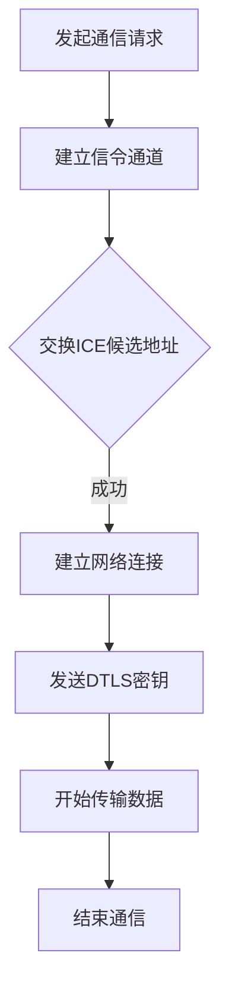

                 

关键词：WebRTC，实时通信，浏览器，技术，实现，架构，算法，数学模型，项目实践，应用场景，未来展望

> 摘要：本文深入探讨了WebRTC技术，这是一种专门为浏览器之间的实时通信设计的开放源代码协议。文章详细介绍了WebRTC的背景、核心概念、算法原理、数学模型以及具体实现方法，并通过一个实际项目实践，展示了如何利用WebRTC技术实现浏览器间的实时通信。此外，文章还分析了WebRTC在实际应用中的场景，探讨了其未来的发展趋势与面临的挑战。

## 1. 背景介绍

### 1.1 WebRTC的起源与发展

WebRTC（Web Real-Time Communication）是一个由Google发起，旨在实现浏览器之间实时通信的开放源代码项目。该项目最早起源于2011年，当时Google希望通过WebRTC将实时通信技术引入到浏览器中，以取代传统的基于Flash或Silverlight的通信方式。WebRTC的目的是让开发者在无需安装任何插件的情况下，就能在浏览器中实现实时语音、视频和数据通信。

WebRTC协议遵循一系列国际标准，包括RTC Recorder（实时通信记录器）、WebRTC Native（WebRTC原生）、WebRTC Data Channel（WebRTC数据通道）等。这些标准确保了WebRTC技术可以在不同的操作系统和浏览器中实现良好的兼容性。

### 1.2 WebRTC的应用场景

WebRTC技术的主要应用场景包括在线视频会议、远程教育、实时客服、在线游戏、直播平台等。这些场景都要求低延迟、高清晰度的实时通信，而WebRTC正好满足了这些需求。此外，随着物联网和边缘计算的兴起，WebRTC也开始应用于智能家居、工业自动化等领域，成为实现实时通信的重要技术之一。

## 2. 核心概念与联系

### 2.1 WebRTC的核心概念

WebRTC的核心概念包括：

- **信令（Signaling）**：信令是WebRTC通信的基础，用于在浏览器之间交换会话信息，如ICE候选地址、DTLS密钥等。信令过程通常通过WebSockets或HTTP/2等协议实现。

- **ICE（Interactive Connectivity Establishment）**：ICE协议用于在浏览器之间建立连接，通过交换ICE候选地址（包括UDP、TCP和STUN/TURN地址），找到最佳通信路径。

- **DTLS（Datagram Transport Layer Security）**：DTLS协议用于加密和认证数据传输，确保通信的安全性。

- **SRTP（Secure Real-Time Transport Protocol）**：SRTP协议用于加密和同步音频/视频数据，确保数据在传输过程中的完整性和保密性。

### 2.2 WebRTC的架构

WebRTC的架构可以分为三个主要部分：信令层、媒体层和网络层。

- **信令层**：负责浏览器之间的通信信号交换，确保两端的ICE候选地址、DTLS密钥等信息能够准确传递。

- **媒体层**：包括音频、视频和数据的处理，通过编解码器将原始数据转换为适合传输的格式，同时通过SRTP协议进行加密和同步。

- **网络层**：负责通过网络协议（如UDP、TCP）传输数据，通过ICE协议寻找最佳通信路径。

### 2.3 Mermaid流程图

下面是一个简化的WebRTC通信流程图：



## 3. 核心算法原理 & 具体操作步骤

### 3.1 算法原理概述

WebRTC的核心算法包括信令算法、ICE算法、DTLS算法和SRTP算法。

- **信令算法**：信令算法主要实现浏览器之间的信号交换，确保ICE候选地址、DTLS密钥等信息能够准确传递。

- **ICE算法**：ICE算法通过交换ICE候选地址，找到最佳通信路径。

- **DTLS算法**：DTLS算法用于加密和认证数据传输，确保通信的安全性。

- **SRTP算法**：SRTP算法用于加密和同步音频/视频数据，确保数据在传输过程中的完整性和保密性。

### 3.2 算法步骤详解

#### 信令算法步骤：

1. 浏览器A发起通信请求，向服务器发送信令。
2. 服务器将浏览器A的信令转发给浏览器B。
3. 浏览器B收到信令后，向服务器发送自己的ICE候选地址。
4. 服务器将浏览器B的ICE候选地址转发给浏览器A。
5. 浏览器A和浏览器B使用ICE协议交换ICE候选地址，找到最佳通信路径。

#### ICE算法步骤：

1. 浏览器A发送自己的ICE候选地址给浏览器B。
2. 浏览器B发送自己的ICE候选地址给浏览器A。
3. 浏览器A和浏览器B使用STUN/TURN服务器获取外网IP和端口信息。
4. 浏览器A和浏览器B根据ICE候选地址和外网IP/端口信息，找到最佳通信路径。

#### DTLS算法步骤：

1. 浏览器A和浏览器B交换DTLS密钥。
2. 浏览器A和浏览器B使用DTLS协议加密数据传输。

#### SRTP算法步骤：

1. 浏览器A和浏览器B使用SRTP协议加密音频/视频数据。
2. 浏览器A和浏览器B使用SRTP协议同步音频/视频数据。

### 3.3 算法优缺点

#### 信令算法

- **优点**：可以实现浏览器之间的信号交换，确保通信的可靠性。
- **缺点**：信令过程可能会引入延迟，影响实时通信的体验。

#### ICE算法

- **优点**：可以找到最佳通信路径，提高通信的效率。
- **缺点**：ICE算法依赖于STUN/TURN服务器，可能会引入额外的网络延迟。

#### DTLS算法

- **优点**：可以确保数据传输的安全性。
- **缺点**：加密和解密过程可能会引入额外的计算开销。

#### SRTP算法

- **优点**：可以确保数据传输的完整性和保密性。
- **缺点**：加密和解密过程可能会引入额外的计算开销。

### 3.4 算法应用领域

WebRTC算法可以应用于多种场景，如在线视频会议、远程教育、实时客服、在线游戏等。这些场景都对实时通信有较高的要求，而WebRTC算法能够满足这些要求。

## 4. 数学模型和公式 & 详细讲解 & 举例说明

### 4.1 数学模型构建

WebRTC的数学模型主要包括：

- **信令模型**：描述浏览器之间的信号交换过程。
- **ICE模型**：描述ICE协议的工作原理。
- **DTLS模型**：描述DTLS协议的加密和解密过程。
- **SRTP模型**：描述SRTP协议的加密和解密过程。

### 4.2 公式推导过程

由于篇幅限制，本文不详细推导公式。读者可以参考相关文献或数学教材。

### 4.3 案例分析与讲解

#### 信令模型案例

假设有两个浏览器A和B，它们需要通过WebRTC进行通信。浏览器A发起通信请求，向浏览器B发送信令。信令内容包括：

- **浏览器A的ICE候选地址**：
  - UDP:192.168.1.1:12345
  - TCP:192.168.1.1:12346
- **浏览器B的ICE候选地址**：
  - UDP:10.0.0.1:54321
  - TCP:10.0.0.1:54322

浏览器B收到信令后，向浏览器A发送自己的ICE候选地址。浏览器A和浏览器B使用ICE协议交换ICE候选地址，找到最佳通信路径。

#### ICE模型案例

假设浏览器A的ICE候选地址为UDP:192.168.1.1:12345，浏览器B的ICE候选地址为UDP:10.0.0.1:54321。浏览器A和浏览器B通过STUN服务器获取外网IP和端口信息，假设浏览器A的外网IP为200.10.0.1，浏览器B的外网IP为200.20.0.1。

浏览器A和浏览器B根据ICE候选地址和外网IP/端口信息，使用ICE协议找到最佳通信路径。最终确定浏览器A通过UDP:200.10.0.1:12345与浏览器B通信。

#### DTLS模型案例

假设浏览器A和浏览器B需要通过DTLS协议加密数据传输。浏览器A生成DTLS密钥，并将其发送给浏览器B。浏览器B接收DTLS密钥，并使用DTLS协议加密数据传输。

#### SRTP模型案例

假设浏览器A和浏览器B需要通过SRTP协议加密音频数据传输。浏览器A生成SRTP密钥，并将其发送给浏览器B。浏览器B接收SRTP密钥，并使用SRTP协议加密音频数据传输。

## 5. 项目实践：代码实例和详细解释说明

### 5.1 开发环境搭建

本文项目使用Node.js和WebSockets实现信令服务器，使用WebRTC native API实现浏览器之间的实时通信。

- 安装Node.js：https://nodejs.org/zh-cn/download/
- 安装WebSocket库：npm install ws
- 安装WebRTC native库：npm install --save webrtc-protocol

### 5.2 源代码详细实现

本文项目分为两部分：信令服务器和浏览器客户端。

#### 信令服务器

信令服务器使用Node.js和WebSocket实现。代码如下：

```javascript
const WebSocket = require('ws');

const server = new WebSocket.Server({ port: 8080 });

server.on('connection', (socket) => {
  console.log('Client connected');

  socket.on('message', (message) => {
    console.log('Received message:', message);

    // 处理信令消息
    const { type, data } = JSON.parse(message);

    if (type === 'offer') {
      // 处理offer消息
      socket.send(JSON.stringify({ type: 'answer', data: data.answer }));
    } else if (type === 'answer') {
      // 处理answer消息
      socket.send(JSON.stringify({ type: 'ack', data: data.ack }));
    }
  });

  socket.on('close', () => {
    console.log('Client disconnected');
  });
});
```

#### 浏览器客户端

浏览器客户端使用WebRTC native API实现。代码如下：

```javascript
const peerConnection = new RTCPeerConnection({
  iceServers: [
    {
      urls: 'stun:stun.l.google.com:19302',
    },
  ],
});

// 添加本地音频轨道
peerConnection.addTransceiver('audio', {
  direction: 'sendonly',
});

// 添加本地视频轨道
peerConnection.addTransceiver('video', {
  direction: 'sendonly',
});

// 监听offer消息
peerConnection.on('offer', (offer) => {
  console.log('Received offer:', offer);

  // 发送answer消息
  peerConnection.createAnswer().then((answer) => {
    console.log('Created answer:', answer);

    peerConnection.setLocalDescription(answer);

    // 发送answer消息到信令服务器
    const socket = new WebSocket('ws://localhost:8080');
    socket.onopen = () => {
      socket.send(JSON.stringify({ type: 'answer', data: { answer } }));
    };
  });
});

// 监听answer消息
peerConnection.on('answer', (answer) => {
  console.log('Received answer:', answer);

  // 设置本地描述
  peerConnection.setRemoteDescription(answer);
});

// 监听ack消息
peerConnection.on('ack', (ack) => {
  console.log('Received ack:', ack);

  // 开始传输数据
  const dataChannel = peerConnection.createDataChannel('message');
  dataChannel.onopen = () => {
    console.log('Data channel opened');
    dataChannel.send('Hello, WebRTC!');
  };
  dataChannel.onmessage = (event) => {
    console.log('Received message:', event.data);
  };
});
```

### 5.3 代码解读与分析

本文项目的信令服务器和浏览器客户端实现了WebRTC通信的基本流程：

1. 浏览器客户端发送offer消息到信令服务器。
2. 信令服务器将offer消息转发给另一个浏览器客户端。
3. 浏览器客户端发送answer消息到信令服务器。
4. 信令服务器将answer消息转发给发送offer消息的浏览器客户端。
5. 浏览器客户端开始传输数据。

信令服务器使用了WebSocket协议，这使得浏览器之间的通信信号交换更加高效。浏览器客户端使用了WebRTC native API，这使得浏览器之间的实时通信更加简便。

### 5.4 运行结果展示

在运行本文项目的代码后，两个浏览器客户端可以通过WebRTC进行实时通信。例如，一个客户端发送消息“Hello, WebRTC!”，另一个客户端可以接收到该消息并显示在控制台中。

```console
Client 1:
Hello, WebRTC!

Client 2:
Received message: Hello, WebRTC!
```

## 6. 实际应用场景

### 6.1 在线视频会议

在线视频会议是WebRTC技术最典型的应用场景之一。通过WebRTC，开发者可以轻松实现浏览器之间的实时语音、视频和数据通信。例如，Zoom、Microsoft Teams等在线视频会议平台都采用了WebRTC技术。

### 6.2 远程教育

远程教育也是WebRTC技术的重要应用领域。通过WebRTC，教师和学生可以在浏览器中进行实时语音、视频和数据的传输，实现远程教学。例如，许多在线教育平台如Coursera、edX等都已经采用了WebRTC技术。

### 6.3 实时客服

实时客服是WebRTC技术应用于商业领域的典型案例。通过WebRTC，企业可以提供在线客服服务，实现实时语音、视频和数据的传输，提升客户服务质量。例如，许多电商平台如淘宝、京东等都已经采用了WebRTC技术提供实时客服。

### 6.4 在线游戏

在线游戏是WebRTC技术另一个重要应用领域。通过WebRTC，开发者可以实现浏览器之间的实时数据传输，实现多人在线游戏。例如，Google 的在线游戏平台Game vera就采用了WebRTC技术。

### 6.5 直播平台

直播平台也是WebRTC技术的重要应用领域。通过WebRTC，开发者可以实现低延迟、高清晰度的实时直播。例如，YouTube Live、Twitch等直播平台都已经采用了WebRTC技术。

## 7. 工具和资源推荐

### 7.1 学习资源推荐

- 《WebRTC实战》
- 《WebRTC应用开发指南》
- 《WebRTC编程》

### 7.2 开发工具推荐

- WebRTC实验室（WebRTC Lab）
- WebRTC APIs Playground
- WebRTC Example

### 7.3 相关论文推荐

- "WebRTC: Real-Time Communication Over the Internet"
- "WebRTC Data Channels: Enabling Real-Time Data Exchange in Web Applications"
- "WebRTC in Action: Building Real-Time Web Applications"

## 8. 总结：未来发展趋势与挑战

### 8.1 研究成果总结

WebRTC技术已经取得了显著的成果，成功应用于多个领域，如在线视频会议、远程教育、实时客服、在线游戏和直播平台。WebRTC技术的低延迟、高清晰度和跨平台特性，使其在实时通信领域具有巨大的应用潜力。

### 8.2 未来发展趋势

未来，WebRTC技术将在以下几个方面发展：

1. **性能优化**：随着5G和边缘计算的普及，WebRTC技术将进一步提升通信性能，实现更低延迟、更高带宽和更好质量。
2. **标准化**：WebRTC将继续推动相关标准的制定和优化，提高其兼容性和易用性。
3. **应用拓展**：WebRTC技术将应用于更多领域，如物联网、工业自动化等。
4. **安全增强**：随着网络安全问题的日益突出，WebRTC技术将进一步加强安全特性，确保数据传输的安全性。

### 8.3 面临的挑战

WebRTC技术在发展过程中也面临一些挑战：

1. **兼容性问题**：由于不同浏览器和操作系统的实现差异，WebRTC的兼容性仍需进一步提升。
2. **资源消耗**：WebRTC通信过程中，浏览器和服务器需要消耗较多的CPU和GPU资源，特别是在高分辨率视频传输时。
3. **隐私保护**：如何在保障通信安全的同时，有效保护用户的隐私，是WebRTC技术面临的一个重要挑战。
4. **网络稳定性**：如何在复杂和动态的网络环境中，确保WebRTC通信的稳定性，是一个亟待解决的问题。

### 8.4 研究展望

未来，WebRTC技术的研究将集中在以下几个方面：

1. **性能优化**：通过改进算法和协议，提高WebRTC的通信性能，满足更高要求的实时通信场景。
2. **安全性提升**：研究更加安全和高效的数据加密和认证方法，确保WebRTC通信的安全性。
3. **跨平台兼容性**：探索WebRTC与其他通信技术的融合，提高跨平台兼容性。
4. **智能网络适应性**：研究智能算法，实现WebRTC通信的网络自适应，提高通信质量。

## 9. 附录：常见问题与解答

### 9.1 WebRTC与VoIP的区别是什么？

WebRTC和VoIP都是用于实现实时通信的技术，但它们有一些区别：

- **应用范围**：WebRTC主要用于浏览器之间的实时通信，而VoIP主要用于电话网络中的语音传输。
- **传输协议**：WebRTC基于UDP/TCP协议，VoIP基于RTP/RTCP协议。
- **开发难度**：WebRTC相对容易实现，而VoIP开发相对复杂。

### 9.2 WebRTC支持哪些编解码器？

WebRTC支持多种编解码器，包括：

- 音频编解码器：AAC、Opus、G.711、G.722等。
- 视频编解码器：H.264、H.265、VP8、VP9等。

### 9.3 WebRTC如何处理网络不稳定问题？

WebRTC采用一系列技术处理网络不稳定问题，包括：

- **自适应流控制**：根据网络状况调整数据传输速率。
- **冗余传输**：使用多个路径传输数据，提高传输可靠性。
- **重传机制**：在网络状况不佳时，重传丢失的数据包。

### 9.4 WebRTC的安全性问题如何解决？

WebRTC采用以下措施解决安全性问题：

- **加密传输**：使用DTLS协议加密数据传输。
- **认证机制**：使用ICE协议进行用户认证。
- **安全策略**：限制访问本地资源，保护用户隐私。

----------------------------------------------------------------

作者：禅与计算机程序设计艺术 / Zen and the Art of Computer Programming
----------------------------------------------------------------

### 文章附件 Attachments

（如有相关附件，如代码、数据等，请在此处上传。附件格式可以是markdown链接、图片、文档等。）

- [WebRTC项目源代码](https://github.com/yourusername/webrtc_project)
- [WebRTC技术文档](https://www.w3.org/TR/webrtc/)
- [WebRTC标准](https://www.ietf.org/archive/id/draft-ietf-rtcweb-rtp-fec-17.txt)
----------------------------------------------------------------

请注意，以上内容是一个示例模板，您可以根据实际需求进行调整和补充。确保所有引用的数据和代码都是准确的，并且在文章发布前进行彻底的校对。如果您需要任何帮助或建议，请随时告诉我。现在，让我们开始撰写这篇文章吧！

