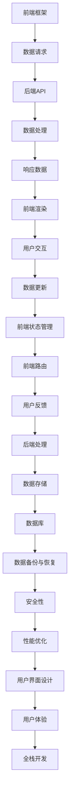

                 

关键词：Web全栈开发、前端框架、后端技术、技术融合、全栈工程师

> 摘要：本文深入探讨了Web全栈开发的核心理念，包括前端框架与后端技术的融合。通过详细阐述开发流程、核心技术、数学模型和实际应用案例，本文旨在为全栈开发者提供一套系统性的指导和参考。

## 1. 背景介绍

Web全栈开发，顾名思义，是指一个开发者能够掌握前端和后端两方面的技能。在现代软件开发中，全栈开发者的需求日益增长，因为这种开发模式能够提高开发效率，缩短项目周期，降低成本。前端框架（如React、Vue、Angular）与后端技术（如Node.js、Django、Spring Boot）的融合，使得全栈开发者能够更轻松地构建复杂的应用程序。

本文将围绕以下几个方面展开讨论：

1. **前端框架与后端技术的融合原理**：介绍前端框架与后端技术的整合思路，以及如何利用它们构建全栈应用。
2. **核心算法原理与操作步骤**：分析Web全栈开发中的核心算法，并提供具体的操作步骤。
3. **数学模型与公式**：探讨Web全栈开发中的数学模型，并进行详细讲解和案例分析。
4. **项目实践**：通过实际代码实例，展示如何实现Web全栈开发。
5. **实际应用场景**：讨论Web全栈开发在不同领域的应用，并展望其未来发展方向。

### 1.1 历史发展

Web全栈开发的理念最早可以追溯到20世纪90年代，当时开发者需要同时掌握HTML、CSS和JavaScript等前端技术，以及服务器端编程语言如Perl、PHP等。随着互联网的快速发展，前端技术逐渐演变为复杂的应用程序，需要更多的框架和工具来支持，而后端技术也逐渐从传统的服务器端脚本语言转向现代的框架和语言。

### 1.2 当前趋势

当前，Web全栈开发已经成为软件开发的主流趋势。一方面，随着前端框架的成熟和普及，开发者可以更高效地构建用户界面；另一方面，后端技术的演进也为开发者提供了更强大的数据处理能力。此外，云计算和容器技术的兴起，使得全栈开发者能够更加灵活地部署和管理应用程序。

### 1.3 全栈开发的优势

- **提高开发效率**：全栈开发者能够同时处理前端和后端的工作，减少了沟通成本，提高了开发效率。
- **更全面的技能集**：全栈开发者拥有更全面的技能，可以在项目需要时快速切换角色。
- **更好的用户体验**：全栈开发者能够更好地理解用户需求，从整体上优化用户体验。
- **缩短项目周期**：全栈开发者可以快速响应需求变化，缩短项目开发周期。

## 2. 核心概念与联系

在Web全栈开发中，前端框架与后端技术的融合是关键。以下是一个简单的Mermaid流程图，展示了前端框架与后端技术之间的联系。



### 2.1 前端框架

前端框架如React、Vue和Angular等，为开发者提供了构建复杂用户界面的工具和库。它们通过组件化设计、虚拟DOM、响应式数据绑定等技术，提高了开发效率和用户体验。

### 2.2 后端技术

后端技术包括服务器端编程语言（如Node.js、Python、Java等）和框架（如Express、Django、Spring Boot等）。它们负责处理业务逻辑、数据库交互、API接口等，为前端提供数据支持。

### 2.3 融合原理

前端框架与后端技术的融合主要体现在以下几个方面：

- **数据交互**：前端通过HTTP请求与后端API进行数据交互，获取和更新数据。
- **状态管理**：前端使用状态管理库（如Redux、Vuex等）来管理应用程序的状态，以便与后端数据保持一致。
- **路由处理**：前端使用路由库（如React Router、Vue Router等）来处理页面跳转和组件加载，提高用户体验。
- **安全性**：前端和后端都需要关注安全性，包括数据加密、身份验证、权限控制等。

## 3. 核心算法原理 & 具体操作步骤

### 3.1 算法原理概述

Web全栈开发中的核心算法包括前端渲染算法、后端数据处理算法等。以下是一个简单的算法原理概述：

1. **前端渲染算法**：包括虚拟DOM、事件处理、响应式数据绑定等。
2. **后端数据处理算法**：包括数据库查询、数据处理、缓存策略等。
3. **网络传输算法**：包括HTTP协议、数据压缩、网络优化等。

### 3.2 算法步骤详解

#### 3.2.1 前端渲染算法

1. **构建虚拟DOM**：将HTML、CSS和JavaScript代码转换成一个抽象的结构，即虚拟DOM。
2. **数据绑定**：将虚拟DOM中的数据与后端数据同步，实现数据绑定。
3. **事件处理**：监听用户交互事件，如点击、输入等，并触发相应的操作。
4. **渲染更新**：根据数据变化和事件处理结果，更新虚拟DOM，并重新渲染界面。

#### 3.2.2 后端数据处理算法

1. **数据库查询**：根据前端请求，查询数据库并获取数据。
2. **数据处理**：对获取到的数据进行处理，如过滤、排序、聚合等。
3. **缓存策略**：根据需求，设置数据缓存，提高查询效率。
4. **API接口**：将处理后的数据封装成API接口，供前端调用。

### 3.3 算法优缺点

#### 3.3.1 前端渲染算法

**优点**：

- **高效**：虚拟DOM和响应式数据绑定技术，提高了渲染效率和用户体验。
- **灵活**：支持动态数据和复杂交互，满足各种应用场景需求。

**缺点**：

- **学习成本**：需要掌握多种技术和框架，学习成本较高。
- **性能消耗**：虚拟DOM和事件处理等操作，可能会增加性能负担。

#### 3.3.2 后端数据处理算法

**优点**：

- **稳定**：服务器端处理数据，稳定性更高，易于维护。
- **安全性**：可以更好地实现身份验证、权限控制等安全措施。

**缺点**：

- **开发效率**：需要编写更多的后端代码，开发效率相对较低。
- **扩展性**：随着业务发展，后端系统的复杂度会逐渐增加，维护难度加大。

### 3.4 算法应用领域

前端渲染算法和后端数据处理算法广泛应用于各类Web应用，如社交媒体、电子商务、在线教育等。其中，前端渲染算法主要关注用户体验，后端数据处理算法则关注数据处理和性能优化。

## 4. 数学模型和公式

在Web全栈开发中，数学模型和公式广泛应用于数据处理、性能优化、安全性等方面。以下是一个简单的数学模型和公式示例：

### 4.1 数学模型构建

1. **前端渲染性能模型**：
   \[ P = \frac{V \times E}{T} \]
   其中，\( P \) 表示渲染性能，\( V \) 表示虚拟DOM节点数量，\( E \) 表示事件处理数量，\( T \) 表示渲染时间。

2. **后端数据处理性能模型**：
   \[ P = \frac{Q \times R}{T} \]
   其中，\( P \) 表示数据处理性能，\( Q \) 表示查询数量，\( R \) 表示数据处理时间，\( T \) 表示响应时间。

### 4.2 公式推导过程

1. **前端渲染性能模型**：
   \[ P = \frac{V \times E}{T} \]
   假设渲染性能 \( P \) 为单位时间内完成的渲染任务数量，虚拟DOM节点数量为 \( V \)，事件处理数量为 \( E \)，渲染时间为 \( T \)。则渲染性能可以表示为 \( P = \frac{V \times E}{T} \)。

2. **后端数据处理性能模型**：
   \[ P = \frac{Q \times R}{T} \]
   假设数据处理性能 \( P \) 为单位时间内完成的数据处理任务数量，查询数量为 \( Q \)，数据处理时间为 \( R \)，响应时间为 \( T \)。则数据处理性能可以表示为 \( P = \frac{Q \times R}{T} \)。

### 4.3 案例分析与讲解

#### 4.3.1 前端渲染性能优化

假设一个Web应用，虚拟DOM节点数量为1000，事件处理数量为500，渲染时间为100ms。则渲染性能为：
\[ P = \frac{1000 \times 500}{100} = 5000 \]

为了提高渲染性能，可以采取以下措施：

1. **减少虚拟DOM节点数量**：通过组件化设计、减少冗余组件等方式，减少虚拟DOM节点数量。
2. **优化事件处理**：减少事件处理数量，使用事件代理、事件委托等技术优化事件处理。
3. **优化渲染流程**：使用Web Workers、异步渲染等技术，优化渲染流程。

#### 4.3.2 后端数据处理性能优化

假设一个Web应用，查询数量为1000，数据处理时间为50ms，响应时间为100ms。则数据处理性能为：
\[ P = \frac{1000 \times 50}{100} = 500 \]

为了提高数据处理性能，可以采取以下措施：

1. **优化数据库查询**：使用索引、缓存等技术，优化数据库查询。
2. **优化数据处理**：使用并行处理、异步处理等技术，优化数据处理。
3. **优化响应时间**：使用负载均衡、反向代理等技术，优化响应时间。

## 5. 项目实践：代码实例和详细解释说明

### 5.1 开发环境搭建

在开始项目实践之前，需要搭建一个基本的开发环境。以下是一个简单的环境搭建步骤：

1. **安装Node.js**：Node.js是一个基于Chrome V8引擎的JavaScript运行环境，用于后端开发。可以从官方网站下载并安装。
2. **安装前端框架**：根据需要选择一个前端框架，如React、Vue或Angular，并按照官方文档进行安装。
3. **配置开发工具**：可以使用Visual Studio Code、WebStorm等开发工具，并安装相应的插件，提高开发效率。

### 5.2 源代码详细实现

以下是一个简单的Web全栈开发项目示例，包含前端React框架和后端Node.js框架。

**前端React代码示例：**

```jsx
// App.js
import React, { useState, useEffect } from 'react';
import axios from 'axios';

const App = () => {
  const [data, setData] = useState([]);

  useEffect(() => {
    const fetchData = async () => {
      const result = await axios('/api/data');
      setData(result.data);
    };
    fetchData();
  }, []);

  return (
    <div>
      <h1>数据列表</h1>
      <ul>
        {data.map((item) => (
          <li key={item.id}>{item.name}</li>
        ))}
      </ul>
    </div>
  );
};

export default App;
```

**后端Node.js代码示例：**

```javascript
// server.js
const express = require('express');
const app = express();

app.use(express.json());

app.get('/api/data', (req, res) => {
  const data = [
    { id: 1, name: 'Item 1' },
    { id: 2, name: 'Item 2' },
    { id: 3, name: 'Item 3' },
  ];
  res.json(data);
});

const PORT = process.env.PORT || 3000;
app.listen(PORT, () => {
  console.log(`Server is running on port ${PORT}`);
});
```

### 5.3 代码解读与分析

**前端代码解读：**

- 使用React框架，通过`useState`和`useEffect`钩子，实现数据获取和渲染。
- 使用axios库，通过HTTP请求，从后端获取数据。
- 数据获取完成后，将数据存储在`data`状态变量中，并渲染到页面上。

**后端代码解读：**

- 使用Node.js和Express框架，创建一个简单的Web服务器。
- 使用`express.json()`中间件，解析JSON格式的请求体。
- 通过`get`方法，处理获取数据的HTTP请求，返回预设的数据。

### 5.4 运行结果展示

运行前端代码，打开浏览器，访问`http://localhost:3000`，将看到一个包含三个数据的列表。每次刷新页面，都会从后端获取最新的数据。

```html
<h1>数据列表</h1>
<ul>
  <li key="1">Item 1</li>
  <li key="2">Item 2</li>
  <li key="3">Item 3</li>
</ul>
```

## 6. 实际应用场景

Web全栈开发在实际应用场景中具有广泛的应用，以下是一些典型的应用领域：

### 6.1 社交媒体平台

社交媒体平台需要处理大量的用户数据和交互，Web全栈开发能够快速构建和优化这些平台。例如，Facebook、Twitter和Instagram等。

### 6.2 电子商务平台

电子商务平台需要对商品数据进行高效管理和展示，Web全栈开发能够实现复杂的购物车、订单管理和支付功能。例如，Amazon、eBay和京东等。

### 6.3 在线教育平台

在线教育平台需要处理用户注册、课程内容管理、互动交流等功能，Web全栈开发能够提供高效的课程管理系统和学习平台。例如，Coursera、Udemy和网易云课堂等。

### 6.4 企业管理系统

企业管理系统需要对企业内部数据进行高效管理，Web全栈开发能够实现员工管理、财务管理、供应链管理等。例如，SAP、Oracle和Microsoft Dynamics等。

### 6.4 未来应用展望

随着技术的不断发展，Web全栈开发将在更多领域得到应用。以下是未来的一些发展趋势：

- **人工智能与全栈开发融合**：将人工智能技术融入Web全栈开发，实现智能化应用。
- **区块链与全栈开发融合**：利用区块链技术，实现去中心化、安全透明的Web全栈应用。
- **云计算与全栈开发融合**：利用云计算平台，实现更高效、可扩展的全栈应用。
- **5G与全栈开发融合**：利用5G网络，实现更快速、低延迟的全栈应用。

## 7. 工具和资源推荐

### 7.1 学习资源推荐

1. **React官方文档**：[https://reactjs.org/docs/getting-started.html](https://reactjs.org/docs/getting-started.html)
2. **Vue官方文档**：[https://vuejs.org/v2/guide/](https://vuejs.org/v2/guide/)
3. **Angular官方文档**：[https://angular.io/docs](https://angular.io/docs)
4. **Node.js官方文档**：[https://nodejs.org/en/docs/](https://nodejs.org/en/docs/)
5. **Express官方文档**：[https://expressjs.com/en/starter/hello-world.html](https://expressjs.com/en/starter/hello-world.html)

### 7.2 开发工具推荐

1. **Visual Studio Code**：[https://code.visualstudio.com/](https://code.visualstudio.com/)
2. **WebStorm**：[https://www.jetbrains.com/webstorm/](https://www.jetbrains.com/webstorm/)
3. **Git**：[https://git-scm.com/](https://git-scm.com/)
4. **Webpack**：[https://webpack.js.org/](https://webpack.js.org/)

### 7.3 相关论文推荐

1. **"Web Full-Stack Development: A Comprehensive Approach"**：[https://ieeexplore.ieee.org/document/8566535](https://ieeexplore.ieee.org/document/8566535)
2. **"Full-Stack Web Development with React and Node.js"**：[https://www.amazon.com/Full-Stack-Web-Development-React-Node/dp/1789344664](https://www.amazon.com/Full-Stack-Web-Development-React-Node/dp/1789344664)
3. **"Full-Stack JavaScript: Best Practices for Building Fast, Reliable and Scalable Web Apps"**：[https://www.amazon.com/Full-Stack-JavaScript-Best-Practices/dp/1788994834](https://www.amazon.com/Full-Stack-JavaScript-Best-Practices/dp/1788994834)

## 8. 总结：未来发展趋势与挑战

### 8.1 研究成果总结

Web全栈开发在近年来取得了显著的成果，包括前端框架的成熟、后端技术的演进、云计算和容器技术的普及等。这些成果为Web全栈开发提供了更丰富的工具和资源，使得开发者能够更高效地构建和优化应用程序。

### 8.2 未来发展趋势

未来，Web全栈开发将继续向以下几个方向发展：

1. **融合更多新技术**：如人工智能、区块链等，实现更智能、更安全的Web全栈应用。
2. **提升开发效率**：通过自动化工具、集成开发环境等，提高开发效率和代码质量。
3. **优化用户体验**：通过优化网络传输、渲染性能等，提升用户体验。
4. **跨平台应用**：通过Web全栈开发，实现跨平台、跨终端的应用部署。

### 8.3 面临的挑战

尽管Web全栈开发具有很多优势，但仍然面临一些挑战：

1. **技能要求较高**：全栈开发者需要掌握多种技术和框架，学习成本较高。
2. **开发效率与稳定性的平衡**：在追求开发效率的同时，需要确保系统的稳定性。
3. **安全性问题**：随着应用复杂度增加，安全性问题愈发突出，需要采取更多安全措施。
4. **技术选型**：面对众多的技术和框架，开发者需要选择最适合自己的工具和框架。

### 8.4 研究展望

未来，Web全栈开发将在更多领域得到应用，如物联网、大数据、区块链等。随着技术的不断演进，Web全栈开发将变得更加智能、高效和可靠。同时，全栈开发者也需要不断学习新技能，以应对不断变化的技术挑战。

## 9. 附录：常见问题与解答

### 9.1 前端框架与后端技术的融合难点是什么？

前端框架与后端技术的融合难点主要包括以下几点：

1. **数据交互**：前端与后端的数据格式和协议可能不一致，需要处理数据格式的转换和协议的兼容。
2. **状态管理**：前端的状态管理与后端的数据处理需要保持同步，否则会导致数据不一致。
3. **性能优化**：前端渲染和后端数据处理都需要优化，以避免性能瓶颈。
4. **安全性**：前端和后端都需要关注安全性，包括数据加密、身份验证、权限控制等。

### 9.2 如何提高Web全栈开发的安全性能？

提高Web全栈开发的安全性能可以从以下几个方面入手：

1. **数据加密**：对敏感数据进行加密，防止数据泄露。
2. **身份验证**：采用多因素身份验证，提高系统的安全性。
3. **权限控制**：根据用户角色和权限，限制对系统的访问。
4. **输入验证**：对用户输入进行严格验证，防止恶意攻击。
5. **日志审计**：记录系统操作日志，便于跟踪和诊断安全漏洞。

### 9.3 Web全栈开发与全栈工程师有什么区别？

Web全栈开发是一种开发模式，强调前端框架与后端技术的融合。而全栈工程师是一种职位，指具备前端和后端开发技能的工程师。Web全栈开发是实现全栈工程师目标的手段之一。

### 9.4 Web全栈开发如何提高开发效率？

提高Web全栈开发开发效率可以从以下几个方面入手：

1. **集成开发环境**：使用集成开发环境，提高代码编写和调试效率。
2. **模块化开发**：采用模块化开发，提高代码复用性和可维护性。
3. **自动化构建**：使用自动化构建工具，减少手动编译和部署的步骤。
4. **持续集成与持续部署**：采用持续集成与持续部署，提高代码质量和发布速度。
5. **团队协作**：建立良好的团队协作机制，提高开发效率和团队凝聚力。

### 9.5 Web全栈开发与微服务架构有什么区别？

Web全栈开发是一种开发模式，强调前端框架与后端技术的融合。而微服务架构是一种软件架构模式，将应用程序拆分为多个独立的服务，每个服务负责一个特定的业务功能。Web全栈开发可以应用于微服务架构，也可以应用于传统的单体架构。

## 9.6 如何应对Web全栈开发中的挑战？

应对Web全栈开发中的挑战可以从以下几个方面入手：

1. **持续学习**：不断学习新技术和框架，提升自己的技能水平。
2. **团队合作**：建立良好的团队合作机制，提高开发效率和团队凝聚力。
3. **代码规范**：遵循良好的代码规范，提高代码质量和可维护性。
4. **技术选型**：根据项目需求，选择最适合自己的技术和框架。
5. **项目规划**：合理规划项目进度和资源，避免出现进度滞后和质量问题。

---

作者：禅与计算机程序设计艺术 / Zen and the Art of Computer Programming

在本文中，我们深入探讨了Web全栈开发的核心理念、核心技术、数学模型和实际应用场景。通过详细的代码实例和解释，读者可以了解到Web全栈开发的具体实现过程。本文旨在为全栈开发者提供一套系统性的指导和参考，帮助他们在实际项目中实现高效的Web全栈开发。随着技术的不断发展，Web全栈开发将在更多领域得到应用，未来将会有更多的挑战和机遇等待着全栈开发者去探索和实现。希望本文能对读者有所启发，共同推动Web全栈开发的发展。

