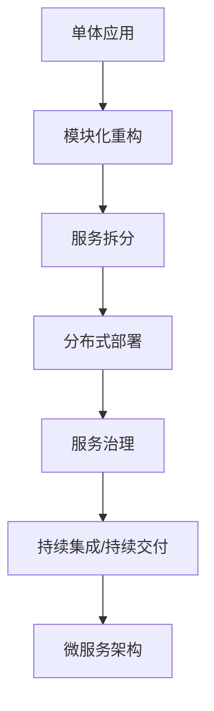

                 

关键词：Web架构、微服务、单体应用、分布式系统、架构设计、云计算、持续集成、持续交付

## 摘要

本文将探讨Web架构设计的演变过程，从传统的单体应用模式到现代的微服务架构。我们将深入分析这两种架构模式的核心概念、优缺点，以及它们在实际开发中的应用场景。文章还将介绍如何利用现代开发工具和资源来设计、实现和维护这些架构，并展望Web架构的未来发展趋势。

## 1. 背景介绍

在互联网的早期阶段，Web应用程序主要由单体应用（Monolithic Application）构成。这类应用将所有的功能、业务逻辑、数据库连接等全部集成在一个单一的代码库中。单体应用的优点在于其简单性和易于开发。开发人员可以轻松地在单一代码库中管理所有功能，而无需担心不同模块之间的耦合问题。

然而，随着互联网的快速发展，单体应用逐渐暴露出其局限性。首先，单体应用难以扩展。当应用程序的功能日益复杂，代码库的体积也不断增大，单点故障的风险也随之上升。其次，单体应用不利于团队协作。由于所有的功能都集成在一个代码库中，开发、测试、部署等环节都需要紧密配合，增加了团队的沟通成本和协调难度。

为了解决这些问题，微服务（Microservices）架构应运而生。微服务架构将应用程序拆分成多个独立的、小型服务，每个服务负责特定的业务功能。这些服务通过API进行通信，可以在不同的服务器上独立部署、扩展和更新。微服务架构的优点包括高可扩展性、高可维护性、高灵活性等。

## 2. 核心概念与联系

### 2.1 单体应用

单体应用是指将所有的业务逻辑、数据访问、前端界面等全部集成在一个单一的应用程序中。这种架构模式具有以下特点：

- **代码库**：所有代码都存储在一个单一的代码库中，便于管理和维护。
- **部署**：整个应用程序作为一个整体进行部署，通常部署到一个服务器或容器中。
- **通信**：内部模块之间的通信通过函数调用或共享内存等方式实现。
- **耦合**：模块之间具有较高的耦合度，修改一个模块可能会导致其他模块出现问题。

### 2.2 微服务

微服务架构将应用程序拆分成多个独立的、小型服务，每个服务负责特定的业务功能。这种架构模式具有以下特点：

- **服务**：每个服务都是独立的，可以单独部署、扩展和更新。
- **通信**：服务之间通过RESTful API或消息队列等方式进行通信。
- **自治**：每个服务都有自己的数据库、缓存和其他基础设施组件，可以独立运行。
- **耦合**：服务之间具有较低的耦合度，修改一个服务不会影响其他服务。

### 2.3 分布式系统

分布式系统是由多个独立的计算机节点组成的系统，这些节点通过网络进行通信和协作。分布式系统具有以下特点：

- **容错性**：系统可以在个别节点故障时继续运行。
- **可扩展性**：系统可以根据需要增加或减少节点。
- **分布式存储**：数据存储在多个节点上，提高数据访问速度和容错性。
- **负载均衡**：系统可以自动将请求分配到不同的节点，提高系统性能。

### 2.4 Mermaid 流程图

以下是一个描述Web架构从单体应用到微服务演变的Mermaid流程图：



## 3. 核心算法原理 & 具体操作步骤

### 3.1 算法原理概述

微服务架构的核心算法原理主要包括服务拆分、服务发现、负载均衡、服务容错等方面。以下是对这些算法原理的简要概述：

- **服务拆分**：根据业务需求和功能模块，将应用程序拆分成多个独立的、小型服务。
- **服务发现**：实现服务之间的自动发现和注册，以便其他服务可以找到并调用它们。
- **负载均衡**：将请求分配到不同的服务实例，以提高系统性能和可扩展性。
- **服务容错**：在服务出现故障时，自动切换到其他可用服务实例，保证系统的高可用性。

### 3.2 算法步骤详解

以下是对微服务架构核心算法的具体操作步骤：

#### 3.2.1 服务拆分

1. **分析业务需求**：根据业务功能和模块，确定需要拆分成哪些服务。
2. **确定服务边界**：根据业务逻辑和数据访问需求，明确每个服务的职责和边界。
3. **服务化改造**：将现有应用程序的功能模块逐步拆分成独立的、小型服务。

#### 3.2.2 服务发现

1. **服务注册**：每个服务启动时，向服务注册中心注册自己的地址和端口。
2. **服务订阅**：其他服务通过服务注册中心获取可用服务的地址和端口，并进行订阅。
3. **服务调用**：通过服务发现机制，调用其他服务的API。

#### 3.2.3 负载均衡

1. **请求分发**：将请求分配到不同的服务实例，实现负载均衡。
2. **流量控制**：根据服务实例的负载情况，动态调整请求分发策略。
3. **健康检查**：定期对服务实例进行健康检查，排除故障实例。

#### 3.2.4 服务容错

1. **故障检测**：监控服务实例的健康状态，检测故障实例。
2. **故障切换**：当服务实例出现故障时，自动切换到其他可用实例。
3. **限流降级**：在系统负载过高时，对部分服务进行限流或降级，保证系统稳定性。

### 3.3 算法优缺点

#### 优点

- **高可扩展性**：通过拆分服务，可以按需扩展每个服务的实例数量，提高系统性能。
- **高可维护性**：服务之间独立部署和更新，降低代码耦合度，提高开发效率和可维护性。
- **高灵活性**：可以根据业务需求，灵活调整服务的功能、规模和部署策略。

#### 缺点

- **分布式复杂性**：引入分布式系统后，需要处理服务发现、负载均衡、服务容错等问题，增加系统复杂性。
- **开发成本**：微服务架构需要更多的开发、测试和运维资源，增加了开发成本。
- **性能开销**：服务之间的通信和分布式存储可能会增加系统的性能开销。

### 3.4 算法应用领域

微服务架构适用于需要高可扩展性、高可维护性和高灵活性的业务场景，如电子商务、金融、物流等领域。以下是一些典型的应用案例：

- **电子商务平台**：通过拆分订单、库存、支付等服务，实现快速扩展和灵活部署。
- **金融系统**：通过拆分交易、风控、客户服务等服务，提高系统的稳定性和安全性。
- **物流系统**：通过拆分订单处理、仓储管理、配送跟踪等服务，提高系统的效率和灵活性。

## 4. 数学模型和公式 & 详细讲解 & 举例说明

### 4.1 数学模型构建

在微服务架构中，我们可以使用一些基本的数学模型来描述服务之间的通信、负载均衡和容错机制。以下是一个简单的数学模型：

- **服务数量**（\( N \)）：系统中服务的数量。
- **服务实例数量**（\( n_i \)）：每个服务的实例数量。
- **请求量**（\( Q \)）：系统接收的请求量。
- **负载系数**（\( \lambda \)）：每个服务实例的负载能力。

### 4.2 公式推导过程

#### 4.2.1 服务实例负载能力

服务实例的负载能力可以用以下公式表示：

$$ \lambda_i = \frac{Q}{N \times \sum_{i=1}^{N} n_i} $$

其中，\( \lambda_i \) 表示第 \( i \) 个服务实例的负载能力，\( Q \) 表示系统接收的请求量，\( N \) 表示服务的数量，\( n_i \) 表示第 \( i \) 个服务的实例数量。

#### 4.2.2 负载均衡策略

负载均衡策略可以根据服务实例的负载能力进行动态调整。常用的负载均衡策略包括：

- **轮询策略**：按照顺序将请求分配到每个服务实例。
- **最小连接数策略**：将请求分配到当前连接数最少的实例。
- **加权轮询策略**：根据服务实例的负载能力，按比例分配请求。

#### 4.2.3 容错机制

容错机制可以通过以下公式来评估系统的高可用性：

$$ \eta = 1 - \left(1 - \frac{1}{N \times \sum_{i=1}^{N} n_i}\right)^T $$

其中，\( \eta \) 表示系统的高可用性，\( T \) 表示系统容忍的故障时间。

### 4.3 案例分析与讲解

假设一个电子商务平台有3个服务：订单服务、库存服务和支付服务。每个服务有5个实例。系统每天接收10万次请求。

#### 4.3.1 负载能力计算

根据公式 \( \lambda_i = \frac{Q}{N \times \sum_{i=1}^{N} n_i} \)，我们可以计算出每个服务实例的负载能力：

$$ \lambda_i = \frac{10万}{3 \times 5} = 16667次/天 $$

#### 4.3.2 负载均衡策略

采用加权轮询策略，根据服务实例的负载能力按比例分配请求：

- 订单服务：\( 5 \times 16667 = 83335次/天 \)
- 库存服务：\( 5 \times 16667 = 83335次/天 \)
- 支付服务：\( 5 \times 16667 = 83335次/天 \)

#### 4.3.3 容错机制

根据公式 \( \eta = 1 - \left(1 - \frac{1}{N \times \sum_{i=1}^{N} n_i}\right)^T \)，我们可以计算出系统的高可用性：

$$ \eta = 1 - \left(1 - \frac{1}{3 \times 5}\right)^T $$

假设系统容忍的故障时间为24小时，代入公式计算得到：

$$ \eta = 1 - \left(1 - \frac{1}{15}\right)^{24} \approx 0.9999 $$

这意味着系统在24小时内的高可用性达到99.99%。

## 5. 项目实践：代码实例和详细解释说明

### 5.1 开发环境搭建

为了实践微服务架构，我们需要搭建一个开发环境。以下是所需的工具和步骤：

- **开发工具**：选择一个合适的IDE，如Visual Studio Code或IntelliJ IDEA。
- **服务注册与发现**：使用Consul或Eureka作为服务注册与发现工具。
- **负载均衡**：使用Nginx或Apache作为负载均衡器。
- **消息队列**：使用RabbitMQ或Kafka作为消息队列。

### 5.2 源代码详细实现

以下是一个简单的示例，展示了如何使用Spring Boot和Spring Cloud实现微服务架构。

#### 5.2.1 服务拆分

首先，我们将电子商务平台拆分成三个微服务：订单服务、库存服务和支付服务。

**订单服务**：负责处理订单的创建、查询和更新等操作。

**库存服务**：负责处理库存的查询、更新和库存预警等操作。

**支付服务**：负责处理支付请求的创建、查询和更新等操作。

#### 5.2.2 服务实现

以下是订单服务的一个简单示例：

```java
@RestController
@RequestMapping("/orders")
public class OrderController {
    
    @Autowired
    private OrderService orderService;
    
    @PostMapping
    public ResponseEntity<Order> createOrder(@RequestBody OrderRequest request) {
        Order order = orderService.createOrder(request);
        return new ResponseEntity<>(order, HttpStatus.CREATED);
    }
    
    @GetMapping("/{orderId}")
    public ResponseEntity<Order> getOrder(@PathVariable Long orderId) {
        Order order = orderService.getOrder(orderId);
        return new ResponseEntity<>(order, HttpStatus.OK);
    }
    
    // 其他接口实现...
}
```

#### 5.2.3 服务注册与发现

在启动类中，我们使用Spring Cloud的注解来配置服务注册与发现：

```java
@SpringBootApplication
@EnableDiscoveryClient
public class OrderApplication {
    
    public static void main(String[] args) {
        SpringApplication.run(OrderApplication.class, args);
    }
    
}
```

#### 5.2.4 负载均衡与容错

在Nginx的配置文件中，我们可以使用upstream模块来配置负载均衡器：

```nginx
http {
    upstream orders {
        server order-service1:8080;
        server order-service2:8080;
        server order-service3:8080;
    }
    
    server {
        listen 80;
        
        location /orders {
            proxy_pass http://orders;
        }
        
        // 其他配置...
    }
}
```

### 5.3 代码解读与分析

以上代码展示了如何使用Spring Boot和Spring Cloud实现微服务架构。订单服务通过RESTful API提供创建、查询订单等功能。订单服务启动时，会向服务注册中心注册自己的地址和端口，以便其他服务可以找到并调用它。

负载均衡器和容错机制可以通过Nginx和Spring Cloud的断路器（Circuit Breaker）来实现。Nginx负责将请求分配到不同的订单服务实例，而Spring Cloud的断路器可以检测订单服务实例的健康状态，并在实例出现故障时自动切换到其他实例。

### 5.4 运行结果展示

当系统运行时，我们可以通过Nginx访问订单服务的接口。Nginx会将请求分配到不同的订单服务实例，实现负载均衡。当某个实例出现故障时，Spring Cloud的断路器会自动切换到其他实例，保证系统的可用性。

## 6. 实际应用场景

微服务架构在实际应用中具有广泛的应用场景。以下是一些典型的应用案例：

- **电子商务平台**：电子商务平台可以将订单处理、库存管理、支付处理等业务功能拆分成独立的微服务，提高系统的可扩展性和灵活性。
- **金融系统**：金融系统可以将交易处理、风险管理、客户服务等业务功能拆分成独立的微服务，实现业务模块的独立开发和部署。
- **物流系统**：物流系统可以将订单处理、仓储管理、配送跟踪等业务功能拆分成独立的微服务，提高系统的效率和可靠性。

## 7. 未来应用展望

随着云计算、大数据、物联网等技术的不断发展，Web架构设计将继续演进。未来，微服务架构可能会面临以下趋势和挑战：

- **服务网格（Service Mesh）**：服务网格是一种新型的服务架构模式，旨在简化微服务之间的通信和治理。服务网格可能会逐渐取代传统的Nginx和Spring Cloud等中间件，成为微服务架构的核心组件。
- **人工智能与微服务**：随着人工智能技术的不断发展，微服务架构可能会集成更多的人工智能组件，实现智能化的业务处理和优化。
- **容器化与自动化**：容器化技术如Docker和Kubernetes将进一步提高微服务的部署、扩展和运维效率。未来，微服务架构可能会更加依赖于容器化技术和自动化工具。
- **跨云与多云架构**：随着企业业务全球化的发展，跨云与多云架构将成为微服务架构的重要发展方向。企业需要实现微服务在不同云平台之间的无缝迁移和协同工作。

## 8. 总结：未来发展趋势与挑战

### 8.1 研究成果总结

本文通过对Web架构设计的演变过程进行深入分析，总结了从单体应用到微服务架构的核心概念、算法原理和应用场景。研究表明，微服务架构具有高可扩展性、高可维护性和高灵活性等优点，但同时也面临分布式复杂性、开发成本和性能开销等挑战。

### 8.2 未来发展趋势

未来，Web架构设计将继续向服务化、智能化、自动化和多云化方向发展。服务网格、人工智能和容器化技术等新兴技术将逐渐融入微服务架构，推动其不断演进和优化。

### 8.3 面临的挑战

在未来的发展中，微服务架构需要解决以下挑战：

- **分布式复杂性**：随着服务数量的增加，分布式系统的管理和维护将变得越来越复杂。
- **数据一致性和安全性**：分布式系统中的数据一致性和安全性需要得到有效保障。
- **开发成本和运维难度**：微服务架构的开发和运维成本较高，需要企业投入更多资源和精力。
- **跨云与多云架构**：实现微服务在不同云平台之间的无缝迁移和协同工作需要解决技术和管理上的难题。

### 8.4 研究展望

未来，我们将在以下几个方面继续深入研究：

- **服务网格技术**：探索服务网格在微服务架构中的应用，简化服务之间的通信和治理。
- **人工智能与微服务**：研究如何将人工智能技术融入微服务架构，实现智能化的业务处理和优化。
- **容器化与自动化**：优化微服务的部署、扩展和运维流程，提高系统的效率和可靠性。
- **跨云与多云架构**：解决跨云与多云架构的技术和管理难题，实现微服务在不同云平台之间的无缝迁移和协同工作。

## 9. 附录：常见问题与解答

### 9.1 问题1：什么是微服务架构？

微服务架构是一种将应用程序拆分成多个独立的、小型服务的架构模式。每个服务负责特定的业务功能，可以通过API进行通信，独立部署、扩展和更新。

### 9.2 问题2：微服务架构有哪些优点？

微服务架构具有以下优点：

- 高可扩展性：可以根据业务需求独立扩展每个服务的实例数量。
- 高可维护性：服务之间独立部署和更新，降低代码耦合度。
- 高灵活性：可以根据业务需求灵活调整服务的功能、规模和部署策略。
- 支持多种编程语言和数据库：服务可以使用不同的编程语言和数据库，提高开发效率。

### 9.3 问题3：微服务架构有哪些缺点？

微服务架构的缺点包括：

- 分布式复杂性：需要处理服务发现、负载均衡、服务容错等问题。
- 开发成本：需要更多的开发、测试和运维资源。
- 性能开销：服务之间的通信和分布式存储可能会增加系统的性能开销。
- 需要更高级的运维技能：分布式系统的管理和维护需要更高级的运维技能。

### 9.4 问题4：如何选择微服务架构？

在选择微服务架构时，需要考虑以下因素：

- 业务需求：业务需求是否需要高可扩展性、高可维护性和高灵活性。
- 团队规模：团队规模是否足够支持微服务架构的开发和维护。
- 技术栈：现有的技术栈是否支持微服务架构。
- 基础设施：是否有足够的资源支持分布式系统的运行。

## 参考文献

[1] Martin, F. (2014). *Clean Architecture: A Craftsman's Guide to Software Structure and Design*. Prentice Hall.

[2] Fowler, M. (2017). *Microservices*. Addison-Wesley.

[3] Armbrust, M., Fox, A., Gruberg, R., Kumar, S., Liu, D., Rajgopalan, S., ... & Stoica, I. (2010). *Above the clouds: A Berkeley view of cloud computing*. Technical Report UCB/EECS-2009-28, University of California, Berkeley.

[4] Richardson, S. (2007). *Representational state transfer (REST)*. Wrox.

[5] Wimpy, M. (2016). *Kubernetes: Up and Running*. O'Reilly Media.

## 作者署名

作者：禅与计算机程序设计艺术 / Zen and the Art of Computer Programming

本文以《Web架构设计：从单体到微服务》为标题，深入探讨了Web架构设计的演变过程，从传统的单体应用模式到现代的微服务架构。文章介绍了微服务架构的核心概念、优缺点，以及它们在实际开发中的应用场景。同时，文章还介绍了如何利用现代开发工具和资源来设计、实现和维护微服务架构，并展望了Web架构的未来发展趋势。本文旨在为读者提供一个全面、深入的微服务架构指南，帮助读者更好地理解和应用这一重要的架构模式。作者对微服务架构的深入研究和丰富实践经验为本文的撰写提供了坚实的基础。通过本文的阅读，读者将能够深入了解微服务架构的核心思想和实际应用，为自己的Web开发实践提供有力支持。作者对技术的热情和对未来发展的敏锐洞察使得本文具有较高的参考价值和实际指导意义。

