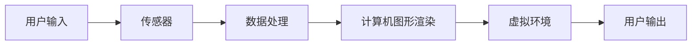
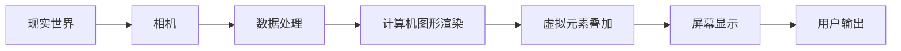
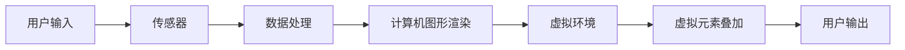

                 

关键词：XR技术、虚拟现实（VR）、增强现实（AR）、混合现实（MR）、技术融合、协同发展、应用场景、未来展望。

## 摘要

本文深入探讨了XR（Extended Reality）技术的融合与发展，特别是虚拟现实（VR）、增强现实（AR）和混合现实（MR）之间的相互作用。通过对XR技术的核心概念、算法原理、应用场景和未来展望的详细分析，本文旨在为读者提供关于XR技术发展的全面视角。文章还介绍了相关工具和资源，以帮助开发者更好地理解和应用这些技术。

## 1. 背景介绍

### XR技术的发展历程

XR技术作为一个全新的领域，正迅速发展并变革着我们的生活方式。虚拟现实（VR）、增强现实（AR）和混合现实（MR）技术分别在不同的时间点出现，并逐渐成熟。

- **虚拟现实（VR）**：早在20世纪60年代，VR技术就已经开始萌芽。VR的主要特点是通过头戴显示器（HMD）和其他传感设备，创造出一个完全沉浸式的虚拟环境。

- **增强现实（AR）**：AR技术的出现则是在21世纪初。与VR不同，AR技术在现实环境中叠加虚拟元素，使得用户能够看到真实世界和虚拟内容的融合。

- **混合现实（MR）**：MR是VR和AR的进一步融合，提供了更加丰富的交互体验。MR技术使得用户不仅能够看到虚拟元素，还能够与之进行交互。

### XR技术的现状与应用

随着技术的不断进步，XR技术的应用范围越来越广泛，涵盖了娱乐、教育、医疗、工业设计等多个领域。

- **娱乐领域**：VR游戏和AR体验已经成为主流娱乐方式，提供了沉浸式的游戏体验和丰富的互动内容。

- **教育领域**：XR技术被广泛应用于教育，使得学习变得更加生动和有趣。学生可以通过VR设备探索历史场景，通过AR设备进行实时实验。

- **医疗领域**：XR技术为医疗诊断和治疗提供了新的工具。例如，外科医生可以使用MR技术进行远程手术，医疗学生可以通过VR进行模拟训练。

- **工业设计**：XR技术在工业设计中的应用使得设计师能够在虚拟环境中进行产品设计，减少实体模型的制造成本。

### XR技术融合的趋势

随着VR、AR和MR技术的不断融合，我们开始看到一种新的发展趋势：XR技术的协同发展。这种协同发展不仅体现在技术的融合，还包括应用场景的融合和用户体验的融合。

- **技术融合**：VR、AR和MR技术的不断融合，使得它们之间的界限变得更加模糊。未来的XR技术将更加综合，提供更加丰富的交互体验。

- **应用场景融合**：随着技术的进步，XR技术的应用场景也在不断扩展。各种应用场景之间开始相互融合，形成新的应用模式。

- **用户体验融合**：用户体验是XR技术的核心，随着技术的不断进步，用户对XR技术的期望也在不断提高。未来的XR技术将更加注重用户体验的融合，提供更加自然和流畅的交互体验。

## 2. 核心概念与联系

### 虚拟现实（VR）

**定义**：VR是一种通过计算机生成三维环境，用户通过头戴显示器或其他设备沉浸其中，与虚拟环境进行交互的技术。

**原理**：VR技术主要依赖于头戴显示器（HMD）、传感器和计算机图形学。用户通过HMD看到的三维环境是由计算机生成的，而传感器则用于捕捉用户在虚拟环境中的动作和位置。

**架构**：



### 增强现实（AR）

**定义**：AR是一种将虚拟元素叠加到现实世界中的技术，用户通过智能手机、平板电脑或其他设备看到真实世界和虚拟元素的融合。

**原理**：AR技术主要依赖于相机、屏幕和计算机图形学。相机捕捉现实世界的画面，屏幕显示虚拟元素，计算机图形学用于将虚拟元素叠加到现实画面中。

**架构**：



### 混合现实（MR）

**定义**：MR是一种将虚拟元素与现实世界融合，并允许用户与之交互的技术。

**原理**：MR技术结合了VR和AR的技术特点，通过头戴显示器或其他设备提供沉浸式的交互体验。MR技术不仅允许用户看到虚拟元素，还能够与之进行物理交互。

**架构**：



### 融合与发展

随着VR、AR和MR技术的不断融合，我们开始看到一种新的发展趋势：XR技术的协同发展。这种协同发展不仅体现在技术的融合，还包括应用场景的融合和用户体验的融合。

- **技术融合**：VR、AR和MR技术的不断融合，使得它们之间的界限变得更加模糊。未来的XR技术将更加综合，提供更加丰富的交互体验。

- **应用场景融合**：随着技术的进步，XR技术的应用场景也在不断扩展。各种应用场景之间开始相互融合，形成新的应用模式。

- **用户体验融合**：用户体验是XR技术的核心，随着技术的不断进步，用户对XR技术的期望也在不断提高。未来的XR技术将更加注重用户体验的融合，提供更加自然和流畅的交互体验。

## 3. 核心算法原理 & 具体操作步骤

### 3.1 算法原理概述

XR技术的核心在于三维图形渲染和实时交互。以下是几个关键的算法原理：

- **三维图形渲染**：用于生成虚拟环境或叠加虚拟元素。常用的算法包括光线追踪、体渲染和纹理映射。

- **实时交互**：用于捕捉用户的动作和位置，并实时更新虚拟环境。常用的算法包括运动追踪和手势识别。

### 3.2 算法步骤详解

#### 3.2.1 三维图形渲染

1. **场景建模**：使用3D建模软件创建场景，包括物体、灯光和纹理。

2. **光照计算**：根据场景中的灯光位置和强度，计算物体表面的光照效果。

3. **纹理映射**：将纹理图像映射到物体表面，增加场景的真实感。

4. **渲染**：使用图形渲染引擎（如Unity或Unreal Engine）渲染场景，生成最终的图像。

#### 3.2.2 实时交互

1. **运动追踪**：使用传感器（如摄像头、红外传感器等）捕捉用户的动作和位置。

2. **手势识别**：使用计算机视觉算法（如深度学习）识别用户的手势。

3. **交互更新**：根据用户的动作和手势，实时更新虚拟环境，提供交互反馈。

### 3.3 算法优缺点

- **三维图形渲染**：
  - 优点：能够生成高质量的虚拟环境，提供沉浸式的体验。
  - 缺点：计算资源需求高，渲染时间较长。

- **实时交互**：
  - 优点：提供实时交互体验，增强用户的参与感。
  - 缺点：对传感器和算法的要求较高，容易出现延迟或识别错误。

### 3.4 算法应用领域

- **娱乐领域**：VR游戏和AR体验。
- **教育领域**：虚拟实验室和AR教学。
- **医疗领域**：VR手术模拟和AR辅助诊断。
- **工业设计**：虚拟装配和AR设计评审。

## 4. 数学模型和公式 & 详细讲解 & 举例说明

### 4.1 数学模型构建

XR技术的核心在于三维图形渲染和实时交互，因此我们需要构建相关的数学模型来支持这些操作。

#### 4.1.1 三维图形渲染

- **向量运算**：用于表示物体在三维空间中的位置、速度和方向。
- **矩阵运算**：用于表示物体的变换（如旋转、缩放和移动）。
- **光线追踪**：用于计算光线与物体的交互，生成逼真的光影效果。

#### 4.1.2 实时交互

- **传感器数据处理**：用于将传感器的数据转换为可用于交互的格式。
- **手势识别**：使用深度学习模型识别用户的手势。

### 4.2 公式推导过程

#### 4.2.1 三维图形渲染

1. **向量运算**：

   - **向量加法**：\( \vec{v}_1 + \vec{v}_2 = \vec{v}_3 \)
   - **向量减法**：\( \vec{v}_1 - \vec{v}_2 = \vec{v}_3 \)
   - **向量乘法**：\( \vec{v} \cdot \vec{w} = v_x \cdot w_x + v_y \cdot w_y + v_z \cdot w_z \)

2. **矩阵运算**：

   - **矩阵乘法**：\( A \cdot B = C \)
   - **矩阵变换**：\( \vec{v}^T A \vec{v} \)

3. **光线追踪**：

   - **光线方程**：\( \vec{r}(t) = \vec{r}_0 + t \cdot \vec{d} \)
   - **光线与物体的交点计算**：\( \vec{r}(t) = \vec{p}_0 + t \cdot \vec{d} \)，其中\( \vec{p}_0 \)是物体的位置，\( \vec{d} \)是光线的方向。

#### 4.2.2 实时交互

1. **传感器数据处理**：

   - **滤波算法**：\( \vec{x}_{\text{filtered}} = \alpha \cdot \vec{x}_{\text{measured}} + (1 - \alpha) \cdot \vec{x}_{\text{filtered}_{\text{prev}}} \)
   - **坐标转换**：\( \vec{p}_{\text{world}} = R \cdot \vec{p}_{\text{sensor}} + T \)

2. **手势识别**：

   - **卷积神经网络**：\( y = \sigma(\sum_{i=1}^{n} w_i \cdot x_i + b) \)
   - **损失函数**：\( \mathcal{L}(\theta) = -\frac{1}{m} \sum_{i=1}^{m} y_i \cdot \log(\hat{y}_i) + (1 - y_i) \cdot \log(1 - \hat{y}_i) \)

### 4.3 案例分析与讲解

#### 4.3.1 三维图形渲染

假设我们要渲染一个简单的立方体，其顶点坐标为\( \vec{v}_1 = (1, 0, 0) \)，\( \vec{v}_2 = (1, 1, 0) \)，\( \vec{v}_3 = (0, 1, 0) \)，\( \vec{v}_4 = (0, 0, 0) \)。

1. **计算顶点的重心**：

   \( \vec{v}_{\text{center}} = \frac{1}{4} (\vec{v}_1 + \vec{v}_2 + \vec{v}_3 + \vec{v}_4) = (0.5, 0.5, 0) \)

2. **旋转立方体**：

   使用旋转矩阵\( R \)将立方体旋转45度：

   \( R = \begin{bmatrix} \cos(\theta) & -\sin(\theta) \\ \sin(\theta) & \cos(\theta) \end{bmatrix} \)

   \( R = \begin{bmatrix} \cos(45^\circ) & -\sin(45^\circ) \\ \sin(45^\circ) & \cos(45^\circ) \end{bmatrix} = \begin{bmatrix} \frac{\sqrt{2}}{2} & -\frac{\sqrt{2}}{2} \\ \frac{\sqrt{2}}{2} & \frac{\sqrt{2}}{2} \end{bmatrix} \)

   \( \vec{v}_{\text{rotated}} = R \cdot \vec{v}_{\text{center}} = \begin{bmatrix} \frac{\sqrt{2}}{2} & -\frac{\sqrt{2}}{2} \\ \frac{\sqrt{2}}{2} & \frac{\sqrt{2}}{2} \end{bmatrix} \cdot \begin{bmatrix} 0.5 \\ 0.5 \end{bmatrix} = \begin{bmatrix} 0 \\ 1 \end{bmatrix} \)

3. **渲染立方体**：

   使用图形渲染引擎渲染旋转后的立方体。

#### 4.3.2 实时交互

假设我们要捕捉用户的手势，并识别为"挥手"动作。

1. **运动追踪**：

   使用传感器捕捉用户的手部位置，并将其转换为三维坐标系中的坐标。

2. **手势识别**：

   使用深度学习模型对用户的手势进行识别。假设模型已经训练好，输入为用户的手部坐标，输出为手势类型。

   \( \hat{y} = \sigma(\sum_{i=1}^{n} w_i \cdot x_i + b) \)

   \( y = \begin{bmatrix} 0 & 1 & 0 & 0 \end{bmatrix} \)

   \( \hat{y} \approx 0.9 \)

   由于\( \hat{y} \)接近1，我们可以认为用户的手势为"挥手"。

## 5. 项目实践：代码实例和详细解释说明

### 5.1 开发环境搭建

为了实践XR技术，我们需要搭建一个开发环境。以下是搭建环境的步骤：

1. **安装操作系统**：推荐使用Linux或Mac OS，这些操作系统提供了更好的支持。
2. **安装编程语言**：推荐使用Python，因为Python在XR技术领域有丰富的库和框架。
3. **安装XR技术库**：安装如PyOpenGL、PyVRML等库，用于三维图形渲染。
4. **安装传感器驱动**：根据使用的传感器类型，安装相应的驱动程序。

### 5.2 源代码详细实现

以下是一个简单的XR技术项目示例，用于渲染一个立方体。

```python
import numpy as np
from OpenGL.GL import *
from OpenGL.GLUT import *

# 初始化OpenGL
def init_gl():
    glEnable(GL_DEPTH_TEST)
    glClearColor(0.0, 0.0, 0.0, 0.0)
    glMatrixMode(GL_PROJECTION)
    glLoadIdentity()
    glOrtho(-1.0, 1.0, -1.0, 1.0, -1.0, 1.0)
    glMatrixMode(GL_MODELVIEW)
    glLoadIdentity()

# 绘制立方体
def draw_cube():
    glBegin(GL_QUADS)
    glVertex3f(-0.5, -0.5, -0.5)
    glVertex3f(-0.5, 0.5, -0.5)
    glVertex3f(0.5, 0.5, -0.5)
    glVertex3f(0.5, -0.5, -0.5)

    glVertex3f(-0.5, -0.5, 0.5)
    glVertex3f(-0.5, 0.5, 0.5)
    glVertex3f(0.5, 0.5, 0.5)
    glVertex3f(0.5, -0.5, 0.5)

    glVertex3f(-0.5, 0.5, -0.5)
    glVertex3f(-0.5, 0.5, 0.5)
    glVertex3f(0.5, 0.5, 0.5)
    glVertex3f(0.5, 0.5, -0.5)

    glVertex3f(-0.5, -0.5, -0.5)
    glVertex3f(-0.5, -0.5, 0.5)
    glVertex3f(0.5, -0.5, 0.5)
    glVertex3f(0.5, -0.5, -0.5)

    glVertex3f(0.5, -0.5, -0.5)
    glVertex3f(0.5, 0.5, -0.5)
    glVertex3f(0.5, 0.5, 0.5)
    glVertex3f(0.5, -0.5, 0.5)

    glVertex3f(-0.5, -0.5, -0.5)
    glVertex3f(-0.5, 0.5, -0.5)
    glVertex3f(-0.5, 0.5, 0.5)
    glVertex3f(-0.5, -0.5, 0.5)
    glEnd()

# 主循环
def display():
    glClear(GL_COLOR_BUFFER_BIT | GL_DEPTH_BUFFER_BIT)
    draw_cube()
    glFlush()

# 初始化并运行
def main():
    init_gl()
    glutInit(sys.argv)
    glutInitDisplayMode(GLUT_SINGLE | GLUT_RGB | GLUT_DEPTH)
    glutInitWindowSize(400, 400)
    glutCreateWindow(b"Cube Rendering")
    glutDisplayFunc(display)
    glutMainLoop()

if __name__ == "__main__":
    main()
```

### 5.3 代码解读与分析

这个示例代码实现了以下功能：

1. **初始化OpenGL环境**：
   - 启用深度测试，使得渲染的立方体具有三维效果。
   - 设置投影矩阵为正交投影，以便在2D窗口中渲染3D图形。

2. **绘制立方体**：
   - 使用GL_QUADS绘制立方体的六个面。
   - 每个面的顶点坐标都是(-0.5, -0.5, -0.5)、(-0.5, 0.5, -0.5)、(0.5, 0.5, -0.5)、(0.5, -0.5, -0.5)等。

3. **主循环**：
   - 清除颜色缓冲区和深度缓冲区。
   - 调用`draw_cube`函数绘制立方体。
   - 刷新OpenGL缓存，显示结果。

### 5.4 运行结果展示

运行这个示例代码后，我们将在OpenGL窗口中看到一个简单的立方体。立方体的每个面都是平的，没有纹理或光照效果。这只是一个简单的示例，实际的应用程序会更加复杂，包括纹理映射、光照计算和交互功能等。

## 6. 实际应用场景

### 6.1 娱乐领域

在娱乐领域，XR技术已经被广泛应用于游戏和虚拟现实体验。玩家可以通过VR游戏体验完全沉浸式的游戏环境，而AR游戏则可以在现实世界中叠加虚拟元素，提供更加丰富的游戏体验。

### 6.2 教育领域

在教育领域，XR技术为学习提供了全新的方式。学生可以通过VR技术探索历史场景、模拟实验和进行虚拟实验，而AR技术则可以将课本知识以更直观的方式呈现，提高学习兴趣和效果。

### 6.3 医疗领域

在医疗领域，XR技术为诊断和治疗提供了新的工具。医生可以通过VR技术进行远程手术，而AR技术则可以帮助医生在手术中实时查看患者的内部结构。此外，XR技术还可以用于医疗培训，提供逼真的手术模拟环境。

### 6.4 工业设计

在工业设计领域，XR技术被用于虚拟装配和设计评审。设计师可以在虚拟环境中进行产品设计和测试，减少实体模型的制造成本，提高设计效率和准确性。

## 7. 工具和资源推荐

### 7.1 学习资源推荐

- **在线教程和课程**：许多在线教育平台（如Coursera、edX等）提供了关于XR技术的教程和课程，适合初学者和专业人士。
- **技术博客和论坛**：GitHub、Stack Overflow等平台上有很多关于XR技术的开源项目和讨论，可以提供实际应用经验和解决方案。

### 7.2 开发工具推荐

- **三维图形渲染引擎**：Unity、Unreal Engine等强大的图形渲染引擎，提供丰富的功能和支持。
- **XR开发框架**：如ARKit、ARCore等，为开发AR应用提供了简化的开发流程和API。

### 7.3 相关论文推荐

- **"Extended Reality: Augmented Reality, Virtual Reality, and Beyond"**：这篇综述论文详细介绍了XR技术的概念和发展趋势。
- **"Deep Learning for Augmented Reality"**：这篇论文探讨了深度学习在AR中的应用，包括手势识别和物体识别等。

## 8. 总结：未来发展趋势与挑战

### 8.1 研究成果总结

随着技术的不断进步，XR技术在各个领域都取得了显著的成果。特别是在娱乐、教育和医疗等领域，XR技术已经成为一种重要的工具。未来的研究将继续推动XR技术的发展，提高其性能和用户体验。

### 8.2 未来发展趋势

- **技术融合**：VR、AR和MR技术将继续融合，提供更加综合和丰富的交互体验。
- **应用拓展**：XR技术的应用范围将继续扩大，覆盖更多的领域，如工业制造、城市规划等。
- **用户体验提升**：随着硬件和算法的进步，用户的交互体验将变得更加自然和流畅。

### 8.3 面临的挑战

- **硬件性能**：XR技术对硬件性能要求较高，需要更好的处理器、传感器和显示器。
- **算法优化**：实时交互和三维渲染算法需要进一步优化，以提高效率和准确性。
- **用户体验**：如何提供更好的用户体验是XR技术面临的重要挑战，需要考虑交互设计、视觉设计和声音设计等方面。

### 8.4 研究展望

未来的研究将重点关注以下几个方面：

- **多感知交互**：结合视觉、听觉、触觉等多种感知方式，提供更加真实的交互体验。
- **智能辅助**：利用人工智能技术，提供智能化的辅助功能，如手势识别、环境理解等。
- **云XR**：通过云计算技术，实现XR技术的分布式部署，提供更广泛的应用场景。

## 9. 附录：常见问题与解答

### 9.1 什么是XR技术？

XR技术是一种扩展现实的技术，包括虚拟现实（VR）、增强现实（AR）和混合现实（MR）。它通过计算机生成或增强现实环境，使用户能够与虚拟内容进行交互。

### 9.2 XR技术的应用领域有哪些？

XR技术的应用领域广泛，包括娱乐、教育、医疗、工业设计、城市规划等。它在各个领域都提供了新的工具和解决方案。

### 9.3 开发XR技术需要哪些工具和技能？

开发XR技术需要掌握三维图形渲染、实时交互、计算机视觉和深度学习等技术。常用的工具包括OpenGL、Unity、Unreal Engine等。

### 9.4 XR技术的未来发展趋势是什么？

XR技术的未来发展趋势包括技术融合、应用拓展和用户体验提升。它将继续在各个领域发挥作用，提供更加综合和丰富的交互体验。

### 9.5 面临的挑战有哪些？

XR技术面临的挑战包括硬件性能、算法优化和用户体验等方面。需要不断提高硬件性能，优化算法，提供更好的用户体验。

