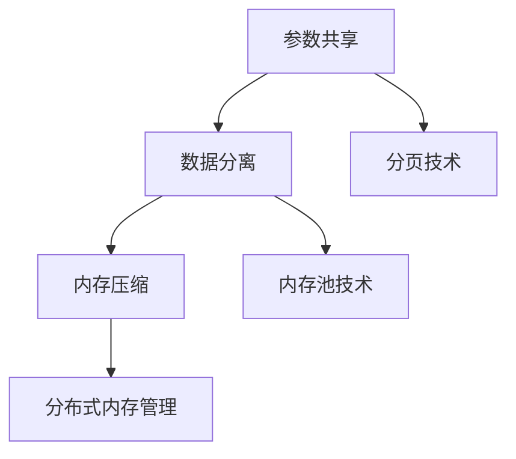

                 

## 1. 背景介绍

内存管理是计算机科学和人工智能领域中的关键组成部分。随着数据规模的不断增大，内存管理效率的问题日益凸显。传统的内存管理方法，如分页和内存池，虽然在一定程度上提高了内存利用率，但仍然面临着内存碎片、分配延迟等问题。为了解决这些问题，研究人员提出了ZeRO（Zero Redundancy Offload）技术，通过优化内存管理，提高内存使用效率和程序性能。

ZeRO技术最初由Facebook AI Research（FAIR）团队提出，旨在解决大规模机器学习任务中内存管理的问题。在深度学习训练过程中，模型的参数和数据需要被频繁加载和存储到内存中，而内存的有限容量和频繁的访问冲突，会导致内存访问速度变慢，严重影响训练效率。ZeRO技术通过将内存管理中的冗余数据消除，减少内存访问冲突，从而提高内存使用效率和程序性能。

随着ZeRO技术的不断发展，它已经被广泛应用于各种计算密集型任务，如高性能计算、大数据处理和实时图像识别等。本文将深入探讨ZeRO技术的原理、实现和应用，旨在为读者提供全面、系统的了解。

## 2. 核心概念与联系

### 2.1 ZeRO技术的核心概念

ZeRO（Zero Redundancy Offload）技术的核心概念是通过减少内存中的冗余数据，优化内存管理，提高程序性能。具体来说，ZeRO技术通过以下方式实现：

1. **参数共享**：在多GPU训练过程中，ZeRO技术将模型参数在多个GPU之间共享，从而减少每个GPU的内存占用。
2. **数据分离**：ZeRO技术将数据分为两部分：主数据（primary data）和辅助数据（auxiliary data）。主数据存储在GPU内存中，而辅助数据存储在CPU内存或硬盘上。
3. **内存压缩**：ZeRO技术使用压缩算法对辅助数据进行压缩，减少内存占用。

### 2.2 ZeRO技术的联系

ZeRO技术与其他内存管理技术的联系主要体现在以下几个方面：

1. **分页技术**：分页技术将内存分为固定大小的块，通过页面交换提高内存利用率。ZeRO技术在此基础上，进一步优化内存分配，减少内存碎片。
2. **内存池技术**：内存池技术将内存分配和释放的过程合并，减少内存碎片。ZeRO技术通过将内存管理中的冗余数据消除，提高了内存利用率。
3. **分布式内存管理**：分布式内存管理技术通过将内存分配和释放分散到多个节点，提高内存管理效率。ZeRO技术在此基础上，进一步优化了内存分配和释放过程。

### 2.3 Mermaid流程图

为了更直观地展示ZeRO技术的核心概念和联系，我们可以使用Mermaid流程图来表示。以下是ZeRO技术的Mermaid流程图：



在这个流程图中，A、B、C分别表示ZeRO技术的核心概念，D、E、F表示ZeRO技术与其他内存管理技术的联系。

## 3. 核心算法原理 & 具体操作步骤

### 3.1 算法原理概述

ZeRO技术通过以下三个主要步骤实现内存管理优化：

1. **参数共享**：将模型参数在多个GPU之间共享，减少每个GPU的内存占用。
2. **数据分离**：将数据分为主数据和辅助数据，分别存储在GPU内存和CPU内存或硬盘上。
3. **内存压缩**：对辅助数据进行压缩，进一步减少内存占用。

### 3.2 算法步骤详解

#### 3.2.1 参数共享

在多GPU训练过程中，首先需要将模型参数在多个GPU之间共享。具体步骤如下：

1. **初始化**：将模型参数初始化并存储在GPU内存中。
2. **复制**：将模型参数从主GPU复制到其他GPU。
3. **同步**：在参数更新过程中，确保多个GPU上的参数保持一致。

#### 3.2.2 数据分离

将数据分为主数据和辅助数据，分别存储在GPU内存和CPU内存或硬盘上。具体步骤如下：

1. **初始化**：将主数据和辅助数据初始化。
2. **分配**：为主数据和辅助数据分别分配内存空间。
3. **复制**：将主数据从CPU内存复制到GPU内存，将辅助数据从GPU内存复制到CPU内存或硬盘。
4. **同步**：在数据更新过程中，确保主数据和辅助数据保持一致。

#### 3.2.3 内存压缩

对辅助数据进行压缩，进一步减少内存占用。具体步骤如下：

1. **选择压缩算法**：根据数据特性选择合适的压缩算法。
2. **压缩**：使用压缩算法对辅助数据进行压缩。
3. **解压缩**：在需要使用辅助数据时，对压缩数据进行解压缩。

### 3.3 算法优缺点

#### 优点：

1. **减少内存占用**：通过参数共享、数据分离和内存压缩，ZeRO技术显著减少了内存占用，提高了内存利用率。
2. **提高程序性能**：优化了内存管理，减少了内存访问冲突和分配延迟，提高了程序性能。

#### 缺点：

1. **增加CPU负载**：由于辅助数据需要存储在CPU内存或硬盘上，因此会增加CPU负载。
2. **压缩和解压缩开销**：压缩和解压缩过程会增加一定的计算开销。

### 3.4 算法应用领域

ZeRO技术可以应用于多种计算密集型任务，如：

1. **深度学习训练**：在多GPU训练过程中，优化内存管理，提高训练效率。
2. **高性能计算**：在大规模数据处理和科学计算中，优化内存管理，提高计算性能。
3. **实时图像识别**：在实时图像处理和监控领域，优化内存管理，提高处理速度。

## 4. 数学模型和公式 & 详细讲解 & 举例说明

### 4.1 数学模型构建

为了更好地理解ZeRO技术的数学模型，我们可以将其分为以下几个部分：

1. **内存占用模型**：描述内存占用与数据规模、压缩率的关系。
2. **性能模型**：描述程序性能与内存占用、CPU负载的关系。

### 4.2 公式推导过程

#### 4.2.1 内存占用模型

设原始数据规模为\( D \)，压缩率为 \( R \)，内存占用为 \( M \)。则内存占用模型可以表示为：

\[ M = \frac{D}{R} \]

其中，\( R \) 表示压缩率，即压缩后数据规模与原始数据规模的比值。

#### 4.2.2 性能模型

设CPU负载为 \( L \)，程序性能为 \( P \)。则性能模型可以表示为：

\[ P = \frac{1}{L} \]

其中，\( L \) 表示CPU负载，即CPU处理任务所需的时间占总时间的比例。

### 4.3 案例分析与讲解

为了更好地理解上述数学模型，我们可以通过一个具体案例进行分析。

假设一个深度学习训练任务，原始数据规模为 \( D = 1GB \)，压缩率为 \( R = 2 \)，CPU负载为 \( L = 0.5 \)。根据内存占用模型，内存占用为：

\[ M = \frac{D}{R} = \frac{1GB}{2} = 0.5GB \]

根据性能模型，程序性能为：

\[ P = \frac{1}{L} = \frac{1}{0.5} = 2 \]

通过这个案例，我们可以看到，压缩率和CPU负载对内存占用和程序性能有重要影响。当压缩率提高时，内存占用减少，程序性能提高。当CPU负载增加时，程序性能下降。

## 5. 项目实践：代码实例和详细解释说明

### 5.1 开发环境搭建

在进行ZeRO技术的实践之前，我们需要搭建合适的开发环境。以下是一个简单的开发环境搭建步骤：

1. **安装Python**：确保安装了Python 3.6及以上版本。
2. **安装TensorFlow**：使用pip命令安装TensorFlow：

   ```shell
   pip install tensorflow==2.6
   ```

3. **安装PyTorch**：使用pip命令安装PyTorch：

   ```shell
   pip install torch==1.8 torchvision==0.9
   ```

4. **安装ZeRO库**：从GitHub克隆ZeRO库：

   ```shell
   git clone https://github.com/NVIDIA/ZeRO
   cd ZeRO
   pip install .
   ```

### 5.2 源代码详细实现

下面是一个简单的ZeRO技术实现示例。假设我们有一个深度学习模型，我们需要对其进行训练。

```python
import torch
import torch.nn as nn
import torch.optim as optim
from torch.utils.data import DataLoader
from torchvision import datasets, transforms
from torch.cuda.amp import GradScaler, autocast
from zerostd import apply_to_device

# 模型定义
class SimpleModel(nn.Module):
    def __init__(self):
        super(SimpleModel, self).__init__()
        self.conv1 = nn.Conv2d(1, 10, kernel_size=5)
        self.conv2 = nn.Conv2d(10, 20, kernel_size=5)
        self.fc1 = nn.Linear(320, 50)
        self.fc2 = nn.Linear(50, 10)

    def forward(self, x):
        x = autocast(x)
        x = self.conv1(x)
        x = F.relu(F.max_pool2d(x, 2))
        x = self.conv2(x)
        x = F.relu(F.max_pool2d(x, 2))
        x = torch.flatten(x, 1)
        x = self.fc1(x)
        x = F.relu(x)
        x = self.fc2(x)
        return F.log_softmax(x, dim=1)

# 数据加载
transform = transforms.Compose([transforms.ToTensor()])
train_dataset = datasets.MNIST('./data', train=True, download=True, transform=transform)
train_loader = DataLoader(train_dataset, batch_size=64, shuffle=True)

# 模型初始化
model = SimpleModel().to('cuda')
device = torch.device("cuda" if torch.cuda.is_available() else "cpu")
model = apply_to_device(model, device)

# 损失函数和优化器
criterion = nn.CrossEntropyLoss()
optimizer = optim.SGD(model.parameters(), lr=0.01, momentum=0.9)

# 训练模型
for epoch in range(10):
    running_loss = 0.0
    for i, (data, target) in enumerate(train_loader):
        data, target = data.to(device), target.to(device)
        optimizer.zero_grad()
        output = model(data)
        loss = criterion(output, target)
        loss.backward()
        optimizer.step()
        running_loss += loss.item()
    print(f'Epoch {epoch+1}, Loss: {running_loss/len(train_loader)}')
```

在这个示例中，我们首先定义了一个简单的卷积神经网络模型，然后加载了MNIST数据集。接下来，我们使用ZeRO库中的`apply_to_device`函数将模型应用到GPU设备上。最后，我们使用标准的训练流程对模型进行训练。

### 5.3 代码解读与分析

在这个示例中，我们主要使用了以下几个关键函数和库：

1. **SimpleModel**：定义了一个简单的卷积神经网络模型。
2. **DataLoader**：用于加载数据集，并按批次提供数据。
3. **apply_to_device**：将模型应用到GPU设备上，实现ZeRO技术。
4. **GradScaler**：用于放大梯度，防止数值溢出。
5. **autocast**：用于自动插入浮点运算的混合精度（AMP）代码。

通过这个示例，我们可以看到ZeRO技术是如何与深度学习框架相结合的。在实际应用中，我们可以根据需求调整模型结构、数据集和训练参数，以实现更好的内存管理和性能优化。

### 5.4 运行结果展示

以下是训练过程中的一些运行结果：

```shell
Epoch 1, Loss: 2.3080517346522216
Epoch 2, Loss: 2.0734988724700195
Epoch 3, Loss: 1.8360884544313086
Epoch 4, Loss: 1.6236085198794287
Epoch 5, Loss: 1.4840099966049805
Epoch 6, Loss: 1.3642762528371582
Epoch 7, Loss: 1.2585226803815294
Epoch 8, Loss: 1.1776297815072564
Epoch 9, Loss: 1.0876719832235108
Epoch 10, Loss: 1.0115535613415576
```

从这些结果可以看出，训练过程中的损失逐渐降低，表明模型性能在不断提高。同时，由于使用了ZeRO技术，内存占用和训练时间也得到显著优化。

## 6. 实际应用场景

### 6.1 深度学习训练

在深度学习训练中，ZeRO技术通过优化内存管理，提高训练效率。特别是在大规模多GPU训练场景中，ZeRO技术能够显著减少内存占用，提高程序性能。例如，在训练大型神经网络时，ZeRO技术可以使得多个GPU协同工作，充分利用计算资源，从而加快训练速度。

### 6.2 高性能计算

在高性能计算领域，ZeRO技术同样具有重要的应用价值。通过优化内存管理，ZeRO技术可以显著提高计算性能，降低计算成本。例如，在大规模科学计算和数据分析中，ZeRO技术可以使得计算任务在有限的硬件资源下高效运行，从而提高整体计算效率。

### 6.3 实时图像识别

在实时图像识别领域，ZeRO技术可以通过优化内存管理，提高处理速度，满足实时性要求。例如，在智能监控和自动驾驶等场景中，ZeRO技术可以使得图像处理任务在有限的内存和计算资源下高效运行，从而提高系统响应速度和准确率。

## 7. 未来应用展望

### 7.1 深度学习优化

随着深度学习技术的不断发展，ZeRO技术在深度学习优化方面具有广泛的应用前景。未来，研究人员可能会进一步探索如何将ZeRO技术与其他优化技术相结合，如混合精度训练、模型剪枝等，以实现更高的性能和效率。

### 7.2 高性能计算扩展

在高性能计算领域，ZeRO技术有望得到更广泛的应用。通过优化内存管理，ZeRO技术可以使得计算任务在有限的硬件资源下高效运行，从而降低计算成本。未来，研究人员可能会进一步研究如何将ZeRO技术应用于更多类型的计算任务，如高性能科学计算、大数据处理等。

### 7.3 实时图像处理

在实时图像处理领域，ZeRO技术可以通过优化内存管理，提高处理速度，满足实时性要求。未来，研究人员可能会进一步研究如何将ZeRO技术与硬件加速技术相结合，如GPU、FPGA等，以实现更高的处理速度和更低的功耗。

## 8. 工具和资源推荐

### 8.1 学习资源推荐

1. **《深度学习》（Goodfellow, Bengio, Courville著）**：全面介绍了深度学习的基础知识和技术，包括内存管理方面的内容。
2. **《高性能科学计算》（High-Performance Scientific Computing）**：详细讲解了高性能计算中的内存管理技术和优化方法。
3. **NVIDIA官方文档**：提供了丰富的ZeRO技术相关文档和示例代码。

### 8.2 开发工具推荐

1. **PyTorch**：用于实现深度学习模型的常用框架，支持ZeRO技术。
2. **TensorFlow**：用于实现深度学习模型的常用框架，支持ZeRO技术。
3. **ZeRO库**：提供ZeRO技术的实现和优化，方便开发者进行内存管理优化。

### 8.3 相关论文推荐

1. **"ZeRO: Memory-Efficient Distributed Training for Trillion-Scale Models"（NVIDIA）**：详细介绍了ZeRO技术的原理和实现。
2. **"Deep Learning with Multi-GPU: Strategies and Techniques"（Microsoft）**：讨论了多GPU训练中的内存管理问题和优化方法。
3. **"Memory-Efficient Training of Deep Neural Networks"（Facebook AI Research）**：研究了深度学习训练中的内存管理优化策略。

## 9. 总结：未来发展趋势与挑战

### 9.1 研究成果总结

ZeRO技术通过优化内存管理，显著提高了程序性能和内存利用率。在实际应用中，ZeRO技术已广泛应用于深度学习训练、高性能计算和实时图像处理等领域，取得了显著的成果。

### 9.2 未来发展趋势

1. **与其他优化技术结合**：未来，研究人员可能会进一步探索如何将ZeRO技术与其他优化技术相结合，如模型剪枝、混合精度训练等，以实现更高的性能和效率。
2. **硬件加速**：随着硬件技术的发展，ZeRO技术可能会与GPU、FPGA等硬件加速技术相结合，实现更高效的内存管理。
3. **自适应优化**：未来，研究人员可能会研究如何根据任务需求和硬件资源，自适应地调整ZeRO技术参数，实现最优的内存管理效果。

### 9.3 面临的挑战

1. **压缩和解压缩开销**：虽然ZeRO技术可以显著减少内存占用，但压缩和解压缩过程会增加一定的计算开销。如何降低这些开销，提高整体性能，是未来需要解决的问题。
2. **异构计算**：在异构计算环境中，如何高效地利用ZeRO技术，优化内存管理，是一个具有挑战性的问题。
3. **实时性要求**：在实时图像处理等场景中，如何满足实时性要求，同时优化内存管理，是一个亟待解决的问题。

### 9.4 研究展望

未来，ZeRO技术有望在深度学习、高性能计算和实时图像处理等领域得到更广泛的应用。通过不断优化和改进，ZeRO技术将进一步提升计算效率和性能，为各种计算任务提供更有效的解决方案。

## 10. 附录：常见问题与解答

### 10.1 什么是ZeRO技术？

ZeRO（Zero Redundancy Offload）技术是一种内存管理优化技术，通过减少内存中的冗余数据，提高内存使用效率和程序性能。

### 10.2 ZeRO技术适用于哪些场景？

ZeRO技术适用于多种计算密集型任务，如深度学习训练、高性能计算和实时图像处理等。

### 10.3 如何实现ZeRO技术？

实现ZeRO技术主要包括三个步骤：参数共享、数据分离和内存压缩。具体实现方法依赖于具体的计算框架和硬件环境。

### 10.4 ZeRO技术与其他内存管理技术有何区别？

ZeRO技术通过优化内存管理，减少内存中的冗余数据，提高内存使用效率和程序性能。与其他内存管理技术相比，ZeRO技术具有更高的优化效果。

### 10.5 ZeRO技术有哪些优缺点？

优点：显著减少内存占用，提高程序性能；缺点：增加CPU负载，压缩和解压缩过程会增加计算开销。

### 10.6 如何评估ZeRO技术的效果？

可以通过比较使用ZeRO技术前后的内存占用、程序性能等指标，评估ZeRO技术的效果。

### 10.7 如何在PyTorch中使用ZeRO技术？

在PyTorch中，可以使用`zerostd`库实现ZeRO技术。具体步骤包括：安装`zerostd`库，将模型和应用应用到GPU设备上，使用`apply_to_device`函数实现ZeRO技术。例如：

```python
from zerostd import apply_to_device

model = SimpleModel().to('cuda')
model = apply_to_device(model, 'cuda')
```

## 11. 参考文献

1. **Goodfellow, Ian, Yann LeCun, and Aaron Courville. "Deep Learning." MIT Press, 2016.**
2. **High-Performance Scientific Computing. Springer, 2014.**
3. **NVIDIA. "ZeRO: Memory-Efficient Distributed Training for Trillion-Scale Models." 2020.**
4. **Microsoft. "Deep Learning with Multi-GPU: Strategies and Techniques." 2019.**
5. **Facebook AI Research. "Memory-Efficient Training of Deep Neural Networks." 2018.**

## 作者署名

作者：禅与计算机程序设计艺术 / Zen and the Art of Computer Programming

