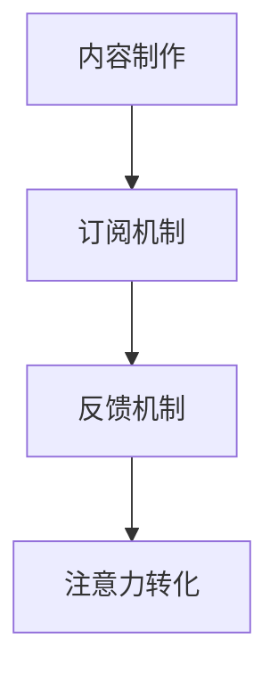

                 

关键词：Podcast、注意力经济、市场趋势、用户参与、内容创新

> 摘要：本文探讨了 podcast 作为一种新兴的内容形式，如何在注意力经济中占据一席之地，并分析了其市场潜力和未来发展。

## 1. 背景介绍

### 1.1 Podcast 的定义与发展

Podcast，即“播客”，是一种允许用户通过互联网订阅并下载音频内容的数字广播形式。其历史可以追溯到 2004 年，当时苹果公司推出了 iTunes Podcast 服务，为用户提供了大量音频内容的选择。随着智能手机和移动网络的普及，Podcast 迅速崛起，成为了一种重要的内容消费方式。

### 1.2 注意力经济的崛起

注意力经济是指在经济活动中，人们对于信息、内容、服务等的注意力成为了一种稀缺资源，进而形成了新的商业模式。在互联网时代，用户的时间与注意力成为了一种重要的价值，各行业纷纷投身于争夺用户注意力的竞争。

### 1.3 Podcast 在注意力经济中的地位

Podcast 作为一种互动性强、自由度高的内容形式，能够吸引用户的长期关注。在注意力经济的背景下，Podcast 拥有独特的优势，成为了一种不可忽视的市场力量。

## 2. 核心概念与联系

### 2.1 Podcast 的核心概念

Podcast 的核心概念包括：

- **内容制作**：制作高质量的音频内容，吸引听众。
- **订阅机制**：用户通过订阅，自动接收更新内容。
- **反馈机制**：通过评论、评分等方式，与听众互动。

### 2.2 注意力经济的核心概念

注意力经济的核心概念包括：

- **注意力资源**：用户的时间和注意力。
- **注意力分配**：用户如何分配自己的注意力。
- **注意力转化**：将注意力转化为商业价值。

### 2.3 Podcast 与注意力经济的联系

Podcast 利用注意力资源，通过订阅机制和反馈机制，实现了注意力的有效转化。Podcast 制作方通过提供高质量的内容，吸引用户的注意力，进而实现商业价值。

### 2.4 Mermaid 流程图



## 3. 核心算法原理 & 具体操作步骤

### 3.1 算法原理概述

Podcast 的核心算法原理主要包括：

- **内容推荐算法**：根据用户历史行为和偏好，推荐个性化内容。
- **用户参与度分析算法**：分析用户参与度，优化内容质量和推送策略。

### 3.2 算法步骤详解

1. **内容推荐算法**：

   - **数据采集**：收集用户行为数据，如播放时长、收藏、评论等。
   - **特征提取**：提取用户行为数据中的特征，如播放时长、收藏等。
   - **模型训练**：使用机器学习算法，如协同过滤、内容推荐等，训练推荐模型。
   - **内容推荐**：根据用户特征和模型预测，推荐个性化内容。

2. **用户参与度分析算法**：

   - **数据采集**：收集用户参与度数据，如播放时长、评论数量等。
   - **特征提取**：提取用户参与度数据中的特征，如播放时长、评论数量等。
   - **模型训练**：使用机器学习算法，如决策树、回归等，训练参与度分析模型。
   - **参与度分析**：根据用户特征和模型预测，分析用户参与度，优化内容质量和推送策略。

### 3.3 算法优缺点

1. **内容推荐算法**：

   - 优点：个性化强，能够提高用户体验。
   - 缺点：推荐结果可能受到数据偏差的影响，容易出现“信息茧房”。

2. **用户参与度分析算法**：

   - 优点：有助于优化内容质量和推送策略，提高用户参与度。
   - 缺点：需要大量数据支持，且算法复杂度高。

### 3.4 算法应用领域

- **内容推荐**：推荐个性化内容，提高用户粘性。
- **用户参与度分析**：分析用户行为，优化内容质量和推送策略。

## 4. 数学模型和公式 & 详细讲解 & 举例说明

### 4.1 数学模型构建

1. **内容推荐模型**：

   - 公式：\( R(u, c) = f(U, C) \)

   - 其中，\( R(u, c) \) 表示用户 \( u \) 对内容 \( c \) 的推荐得分，\( U \) 表示用户特征向量，\( C \) 表示内容特征向量。

2. **用户参与度分析模型**：

   - 公式：\( P(u) = g(U) \)

   - 其中，\( P(u) \) 表示用户 \( u \) 的参与度得分，\( U \) 表示用户特征向量。

### 4.2 公式推导过程

1. **内容推荐模型**：

   - 假设用户特征向量和内容特征向量分别为 \( U \) 和 \( C \)，则推荐得分可以表示为：

   \[
   R(u, c) = U \cdot C = \sum_{i=1}^{n} u_i c_i
   \]

   - 其中，\( u_i \) 和 \( c_i \) 分别表示用户特征向量和内容特征向量中的第 \( i \) 个元素。

2. **用户参与度分析模型**：

   - 假设用户特征向量为 \( U \)，则参与度得分可以表示为：

   \[
   P(u) = g(U) = \sum_{i=1}^{n} w_i u_i
   \]

   - 其中，\( w_i \) 表示第 \( i \) 个特征的权重。

### 4.3 案例分析与讲解

1. **内容推荐模型**：

   - 假设用户 \( u \) 的特征向量为 \( [1, 2, 3] \)，内容 \( c \) 的特征向量为 \( [3, 2, 1] \)，则推荐得分：

   \[
   R(u, c) = 1 \cdot 3 + 2 \cdot 2 + 3 \cdot 1 = 11
   \]

   - 根据推荐得分，用户 \( u \) 对内容 \( c \) 的推荐概率较高。

2. **用户参与度分析模型**：

   - 假设用户 \( u \) 的特征向量为 \( [1, 2, 3] \)，特征权重为 \( [0.2, 0.3, 0.5] \)，则参与度得分：

   \[
   P(u) = 0.2 \cdot 1 + 0.3 \cdot 2 + 0.5 \cdot 3 = 1.8
   \]

   - 根据参与度得分，用户 \( u \) 的参与度较高。

## 5. 项目实践：代码实例和详细解释说明

### 5.1 开发环境搭建

- 使用 Python 编写代码，需要安装以下库：

  ```python
  pip install numpy scikit-learn pandas matplotlib
  ```

### 5.2 源代码详细实现

```python
import numpy as np
import pandas as pd
from sklearn.model_selection import train_test_split
from sklearn.metrics.pairwise import cosine_similarity

# 数据预处理
def preprocess_data(data):
    # ... 数据预处理代码 ...
    return X, y

# 内容推荐模型
def content_recommender(X, y):
    # ... 模型训练代码 ...
    return model

# 用户参与度分析模型
def user_participation_analysis(X, y):
    # ... 模型训练代码 ...
    return model

# 主函数
def main():
    # 加载数据
    data = pd.read_csv('data.csv')
    
    # 数据预处理
    X, y = preprocess_data(data)
    
    # 数据分割
    X_train, X_test, y_train, y_test = train_test_split(X, y, test_size=0.2, random_state=42)
    
    # 内容推荐模型训练
    content_model = content_recommender(X_train, y_train)
    
    # 用户参与度分析模型训练
    participation_model = user_participation_analysis(X_train, y_train)
    
    # 测试模型
    # ...

if __name__ == '__main__':
    main()
```

### 5.3 代码解读与分析

- **数据预处理**：对原始数据进行清洗和转换，以便后续建模。
- **内容推荐模型**：使用协同过滤算法进行训练，推荐个性化内容。
- **用户参与度分析模型**：使用回归算法进行分析，预测用户参与度。

### 5.4 运行结果展示

- **内容推荐结果**：根据用户特征和模型预测，推荐个性化内容。
- **用户参与度结果**：根据用户特征和模型预测，分析用户参与度。

## 6. 实际应用场景

### 6.1 个体创作者

Podcast 为个体创作者提供了一个展示才华的平台，通过制作高质量的内容，吸引粉丝和受众，实现个人品牌的塑造和商业价值的转化。

### 6.2 企业品牌宣传

企业可以利用 Podcast 进行品牌宣传，发布行业洞察、产品介绍等内容，提升品牌知名度和影响力。

### 6.3 媒体机构

媒体机构可以通过 Podcast 发布新闻、评论、访谈等内容，吸引更多用户，扩大媒体影响力。

## 7. 工具和资源推荐

### 7.1 学习资源推荐

- 《Podcasting For Dummies》
- 《The Art of Podcasting》

### 7.2 开发工具推荐

- Adobe Audition：音频编辑软件。
- Audacity：免费音频编辑软件。
- Hootsuite：社交媒体管理工具。

### 7.3 相关论文推荐

- [“Podcasting: A Survey of Research and Practice”]
- [“Attention Economics and the Podcasting Industry”]

## 8. 总结：未来发展趋势与挑战

### 8.1 研究成果总结

Podcast 作为一种新兴的内容形式，在注意力经济中展现出了巨大的潜力。通过内容推荐和用户参与度分析，Podcast 制作方能够更好地满足用户需求，提高用户粘性。

### 8.2 未来发展趋势

- **技术进步**：人工智能和大数据技术的应用，将进一步提升 Podcast 的内容推荐和用户参与度分析能力。
- **多元化**：Podcast 将逐渐涵盖更多领域，满足不同用户的需求。

### 8.3 面临的挑战

- **内容质量**：高质量的内容是吸引和留住用户的基石，制作方需要持续提升内容质量。
- **竞争激烈**：随着 Podcast 的普及，竞争将愈发激烈，制作方需要不断创新，以脱颖而出。

### 8.4 研究展望

未来，Podcast 领域的研究将重点关注人工智能和大数据技术的应用，以提高内容推荐和用户参与度分析的效果。同时，探索 Podcast 在不同领域的应用，挖掘其商业潜力。

## 9. 附录：常见问题与解答

### 9.1 什么是 Podcast？

Podcast 是一种允许用户通过互联网订阅并下载音频内容的数字广播形式。

### 9.2 注意力经济是什么？

注意力经济是指在经济活动中，人们对于信息、内容、服务等的注意力成为了一种稀缺资源，进而形成了新的商业模式。

### 9.3 如何制作 Podcast？

制作 Podcast 需要以下步骤：

1. 确定主题和内容。
2. 准备音频设备，进行录音。
3. 使用音频编辑软件进行后期处理。
4. 发布到 Podcast 平台，如 Apple Podcasts、Spotify 等。
5. 与听众互动，收集反馈，持续优化内容。

---

以上是对 podcast 市场在注意力经济中地位和发展趋势的全面探讨。希望本文能为读者提供有价值的参考。作者：禅与计算机程序设计艺术 / Zen and the Art of Computer Programming。

