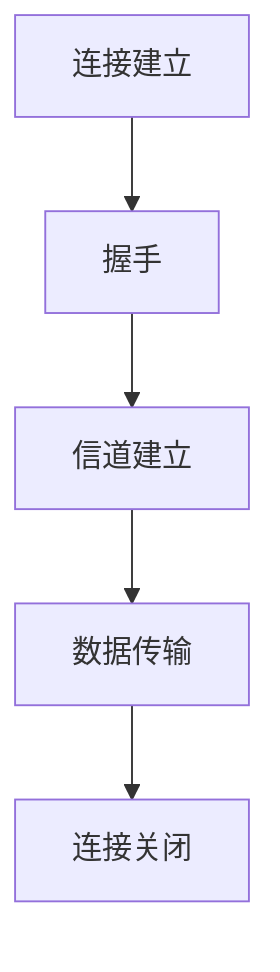

                 

关键词：rtmp流媒体协议、流媒体传输、视频直播、数据流、网络传输协议、协议工作原理、应用场景、优缺点分析、开发工具、未来展望

> 摘要：本文将详细解析rtmp流媒体协议的工作原理、应用场景、优缺点，并提供项目实践代码实例。通过阅读本文，读者可以全面了解rtmp流媒体协议的核心概念和关键技术，为实际应用提供参考。

## 1. 背景介绍

随着互联网的快速发展，流媒体技术已经成为视频点播、视频直播等应用的基石。rtmp（Real Time Messaging Protocol）流媒体协议作为一种网络传输协议，广泛应用于视频直播、点播等领域。本文将详细介绍rtmp流媒体协议的工作原理、应用场景、优缺点，并提供项目实践代码实例，帮助读者全面了解rtmp流媒体协议。

## 2. 核心概念与联系

### 2.1 rtmp协议概念

rtmp流媒体协议是一种基于TCP协议的实时消息传输协议，由Adobe公司于2003年推出。它主要用于实现实时视频、音频等多媒体数据的传输，具有高效、低延迟、高可靠性的特点。

### 2.2 协议架构

rtmp协议架构主要包括三个部分：连接（Connection）、通道（Stream）、消息（Message）。

- **连接**：rtmp协议通过连接建立与服务器之间的通信通道。连接过程包括握手、信道建立等步骤。
- **通道**：通道是rtmp协议中用于传输数据的通道，分为控制通道和数据通道。控制通道用于传输控制消息，如命令、元数据等；数据通道用于传输实际的多媒体数据。
- **消息**：rtmp协议中的消息分为命令消息和数据消息。命令消息用于控制rtmp协议的行为，如播放、暂停、停止等；数据消息用于传输实际的多媒体数据，如视频、音频帧等。

### 2.3 Mermaid流程图



## 3. 核心算法原理 & 具体操作步骤

### 3.1 算法原理概述

rtmp协议的核心算法主要包括连接建立、数据传输和连接关闭三个部分。

- **连接建立**：客户端向服务器发送连接请求，服务器响应连接请求并建立连接。
- **数据传输**：客户端向服务器发送控制消息和数据消息，服务器接收并处理消息。
- **连接关闭**：客户端或服务器主动关闭连接，释放资源。

### 3.2 算法步骤详解

#### 3.2.1 连接建立

1. 客户端发送连接请求，包含URL、应用程序名称等信息。
2. 服务器接收连接请求，并生成随机数作为会话密钥。
3. 服务器将连接请求和会话密钥发送给客户端。
4. 客户端计算加密后的会话密钥，并返回给服务器。
5. 服务器验证加密后的会话密钥，确认连接成功。

#### 3.2.2 数据传输

1. 客户端发送控制消息，如播放、暂停、停止等。
2. 服务器接收并处理控制消息。
3. 客户端发送数据消息，如视频帧、音频帧等。
4. 服务器接收并处理数据消息。

#### 3.2.3 连接关闭

1. 客户端或服务器发送连接关闭请求。
2. 对方收到连接关闭请求后，发送确认消息。
3. 双方关闭连接，释放资源。

### 3.3 算法优缺点

#### 优点：

1. 高效性：rtmp协议采用二进制格式传输数据，提高了数据传输效率。
2. 低延迟：rtmp协议采用TCP协议，确保了数据传输的稳定性，降低了延迟。
3. 可靠性：rtmp协议支持数据重传和错误检测，保证了数据传输的可靠性。

#### 缺点：

1. 兼容性：rtmp协议主要应用于Adobe Flash平台，随着Flash的逐渐淘汰，rtmp协议的兼容性问题逐渐凸显。
2. 网络开销：rtmp协议需要建立连接，增加了网络开销。

### 3.4 算法应用领域

rtmp协议主要应用于视频直播、视频点播等领域。例如，许多在线直播平台、视频网站都采用了rtmp协议来实现视频数据的传输。

## 4. 数学模型和公式 & 详细讲解 & 举例说明

### 4.1 数学模型构建

rtmp协议的数学模型主要包括三个部分：连接建立、数据传输和连接关闭。

#### 连接建立

假设客户端为A，服务器为B，会话密钥为K。

1. A发送连接请求，包含URL、应用程序名称等信息。
2. B接收连接请求，并生成随机数R_B作为会话密钥。
3. B将连接请求和会话密钥R_B发送给A。
4. A计算加密后的会话密钥E_K(R_B)，并返回给B。
5. B验证加密后的会话密钥E_K(R_B)，确认连接成功。

#### 数据传输

假设客户端为A，服务器为B，数据消息为M。

1. A发送控制消息C。
2. B接收并处理控制消息C。
3. A发送数据消息M。
4. B接收并处理数据消息M。

#### 连接关闭

假设客户端为A，服务器为B。

1. A发送连接关闭请求。
2. B收到连接关闭请求后，发送确认消息。
3. A和B关闭连接，释放资源。

### 4.2 公式推导过程

#### 连接建立

假设A发送连接请求，包含URL、应用程序名称等信息，服务器B接收连接请求，并生成随机数R_B作为会话密钥。

1. A发送连接请求：C_A = URL + 应用程序名称。
2. B接收连接请求，并生成随机数R_B：R_B = Random()。
3. B将连接请求和会话密钥R_B发送给A：C_B = R_B + C_A。
4. A计算加密后的会话密钥E_K(R_B)：E_K(R_B) = AES(K, R_B)。
5. A将加密后的会话密钥发送给B：C_A' = E_K(R_B)。
6. B验证加密后的会话密钥E_K(R_B)：E_K'(R_B) = AES(K, R_B')，其中R_B'为B接收到的加密后的会话密钥。
7. 如果E_K'(R_B') = R_B，则连接成功。

#### 数据传输

假设客户端为A，服务器为B，数据消息为M。

1. A发送控制消息C：C_A = C。
2. B接收并处理控制消息C。
3. A发送数据消息M：M_A = M。
4. B接收并处理数据消息M：M_B = M。

#### 连接关闭

假设客户端为A，服务器为B。

1. A发送连接关闭请求：C_A = 关闭。
2. B收到连接关闭请求后，发送确认消息：C_B = 确认。
3. A和B关闭连接，释放资源。

### 4.3 案例分析与讲解

假设客户端为A，服务器为B，会话密钥为K。

1. A发送连接请求：C_A = URL + 应用程序名称。
2. B接收连接请求，并生成随机数R_B作为会话密钥：R_B = Random()。
3. B将连接请求和会话密钥R_B发送给A：C_B = R_B + C_A。
4. A计算加密后的会话密钥E_K(R_B)：E_K(R_B) = AES(K, R_B)。
5. A将加密后的会话密钥发送给B：C_A' = E_K(R_B)。
6. B验证加密后的会话密钥E_K(R_B)：E_K'(R_B) = AES(K, R_B')，其中R_B'为B接收到的加密后的会话密钥。
7. 如果E_K'(R_B') = R_B，则连接成功。

连接成功后，A发送视频数据给B：

1. A发送控制消息C：C_A = 播放。
2. B接收并处理控制消息C。
3. A发送视频数据M：M_A = 视频数据。
4. B接收并处理视频数据M：M_B = 视频数据。

最后，A发送连接关闭请求给B：

1. A发送连接关闭请求：C_A = 关闭。
2. B收到连接关闭请求后，发送确认消息：C_B = 确认。
3. A和B关闭连接，释放资源。

## 5. 项目实践：代码实例和详细解释说明

### 5.1 开发环境搭建

1. 安装Python 3.6及以上版本。
2. 安装Flask框架：`pip install flask`
3. 安装RTMP模块：`pip install rtmp`
4. 新建一个名为`rtmp_server.py`的Python文件。

### 5.2 源代码详细实现

```python
from flask import Flask, request
from rtmp import RMTPServer
from rtmp.response import Response

app = Flask(__name__)

# 创建RTMP服务器实例
server = RMTPServer()

# 注册处理RTMP连接的函数
server.add_stream_handler(app)

# 启动RTMP服务器
server.run(host='0.0.0.0', port=1935)

# 注册处理HTTP请求的路由
@app.route('/')
def index():
    return 'RTMP Server is running...'

if __name__ == '__main__':
    app.run(debug=True)
```

### 5.3 代码解读与分析

- 导入所需的模块：`from flask import Flask, request`（Flask框架）、`from rtmp import RMTPServer`（RTMP模块）、`from rtmp.response import Response`（RTMP响应）。
- 创建Flask应用实例：`app = Flask(__name__)`。
- 创建RTMP服务器实例：`server = RMTPServer()`。
- 注册处理RTMP连接的函数：`server.add_stream_handler(app)`。
- 启动RTMP服务器：`server.run(host='0.0.0.0', port=1935)`。
- 注册处理HTTP请求的路由：`@app.route('/')`。

### 5.4 运行结果展示

1. 在命令行运行`python rtmp_server.py`，启动RTMP服务器。
2. 访问`http://localhost:1935/`，查看RTMP服务器状态。

## 6. 实际应用场景

rtmp流媒体协议广泛应用于视频直播、视频点播等领域。以下是一些实际应用场景：

1. **视频直播**：许多在线直播平台使用rtmp协议实现视频直播，如斗鱼、虎牙等。
2. **视频点播**：视频网站如优酷、爱奇艺等使用rtmp协议提供视频点播服务。
3. **企业内部培训**：许多企业使用rtmp协议实现内部培训视频的实时传输。

## 7. 工具和资源推荐

### 7.1 学习资源推荐

1. 《流媒体技术详解：从理论到实践》
2. 《rtmp协议详解》
3. 《视频流媒体技术手册》

### 7.2 开发工具推荐

1. **RTMP服务器**：可以使用开源项目如`nginx-rtmp-module`搭建RTMP服务器。
2. **RTMP客户端**：可以使用Python的`rtmp`模块实现RTMP客户端。

### 7.3 相关论文推荐

1. "Real-Time Streaming Protocol (RTMP) Version 3"
2. "A Survey on Video Streaming Technologies"
3. "A Study on Adaptive Video Streaming over Wireless Networks"

## 8. 总结：未来发展趋势与挑战

### 8.1 研究成果总结

- rtmp协议在视频直播、视频点播等领域取得了显著成果。
- 开源RTMP服务器和客户端的实现为开发者提供了便利。
- RTMP协议在实时性、稳定性、可靠性等方面具有优势。

### 8.2 未来发展趋势

- 随着5G网络的普及，RTMP协议有望在低延迟、高带宽的实时应用中得到更广泛的应用。
- 新的加密算法和安全机制将提高RTMP协议的安全性。

### 8.3 面临的挑战

- 兼容性问题：随着Flash的淘汰，RTMP协议的兼容性问题日益凸显。
- 性能优化：在高速网络环境下，如何提高RTMP协议的传输性能是一个挑战。

### 8.4 研究展望

- 开发更高效、更安全的RTMP协议实现。
- 探索RTMP协议在5G网络下的应用场景。
- 研究RTMP协议与其他流媒体协议的融合与优化。

## 9. 附录：常见问题与解答

### 9.1 如何搭建RTMP服务器？

- 安装RTMP服务器软件（如`nginx-rtmp-module`）。
- 配置RTMP服务器，设置监听端口、存储路径等。
- 启动RTMP服务器。

### 9.2 如何实现RTMP客户端？

- 使用Python的`rtmp`模块，根据文档编写客户端代码。
- 连接RTMP服务器，设置播放路径、播放参数等。
- 播放视频、音频等数据。

### 9.3 RTMP协议与HTTP协议有何区别？

- **传输方式**：RTMP基于TCP协议传输，HTTP基于HTTP协议传输。
- **实时性**：RTMP协议具有更高的实时性，适用于实时视频传输；HTTP协议适用于静态资源的传输。
- **数据格式**：RTMP协议使用二进制格式传输数据，HTTP协议使用文本格式传输数据。

---

**作者：禅与计算机程序设计艺术 / Zen and the Art of Computer Programming**

