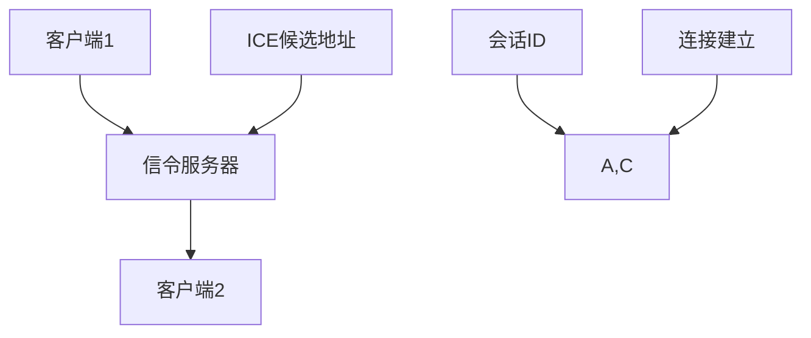

                 

WebRTC（Web Real-Time Communication）是一种支持浏览器进行实时语音、视频和数据通信的开放协议。在现代网络应用中，WebRTC技术因其低延迟、高可靠性和跨平台特性而备受关注。为了实现WebRTC通信，我们需要构建一个信令服务器，用于在客户端和服务器之间传递信令数据，以建立和维持通信连接。本文将详细介绍WebRTC信令服务器的开发过程，包括核心概念、架构设计、算法原理、数学模型、项目实践以及未来应用展望。

## 关键词

- WebRTC
- 信令服务器
- Web 应用开发
- 网络通信
- 实时语音/视频通信

## 摘要

本文将系统地介绍WebRTC信令服务器的开发，包括其核心概念、架构设计、算法原理和数学模型。通过对WebRTC协议的深入理解，我们将构建一个可靠的信令服务器，以实现WebRTC客户端之间的实时通信。文章最后还将探讨WebRTC信令服务器的实际应用场景和未来发展趋势。

## 1. 背景介绍

### 1.1 WebRTC简介

WebRTC（Web Real-Time Communication）是一个开放项目，旨在实现网页上的实时语音、视频和数据通信。它由Google主导开发，并得到了众多浏览器厂商的支持，包括Chrome、Firefox、Edge等。WebRTC的核心优势在于其低延迟、高可靠性和跨平台特性，使其在实时通信领域具有广泛应用。

### 1.2 WebRTC的关键技术

WebRTC技术栈包括多个组件，其中最重要的有：

- **信令**：用于在客户端和服务器之间传递信息，建立通信连接。
- **媒体传输**：使用DTLS/SRTP加密和传输媒体数据。
- **ICE**（Interactive Connectivity Establishment）：用于网络协商，发现客户端之间的最佳传输路径。
- **STUN/TURN**：NAT穿越技术，帮助内网客户端连接到公网。

### 1.3 信令服务器的作用

信令服务器在WebRTC通信中起着至关重要的作用。它负责在客户端之间传递信令数据，如ICE候选地址、会话描述等，以建立通信连接。此外，信令服务器还支持消息传输、权限验证等功能。

## 2. 核心概念与联系

### 2.1 WebRTC协议架构


### 2.2 信令流程

以下是WebRTC信令流程的简述：

1. **信令请求**：客户端向信令服务器发送创建会话的请求。
2. **会话创建**：信令服务器创建会话，并返回会话ID给客户端。
3. **ICE候选地址交换**：客户端向信令服务器发送ICE候选地址。
4. **信令传递**：信令服务器将ICE候选地址转发给对端客户端。
5. **连接建立**：客户端通过ICE协商确定最佳传输路径，建立连接。

### 2.3 Mermaid流程图



## 3. 核心算法原理 & 具体操作步骤

### 3.1 算法原理概述

WebRTC信令服务器主要涉及以下算法：

- **ICE**：用于网络协商，发现客户端之间的最佳传输路径。
- **DTLS**：数据传输层安全协议，用于加密和认证。
- **SRTP**：实时传输协议，用于加密媒体数据。

### 3.2 算法步骤详解

1. **创建信令服务器**：使用WebSocket或HTTP协议搭建信令服务器。
2. **接收客户端请求**：处理客户端的连接请求，验证权限。
3. **交换ICE候选地址**：接收客户端的ICE候选地址，并转发给对端客户端。
4. **建立连接**：通过ICE协商，确定最佳传输路径，建立连接。

### 3.3 算法优缺点

**优点**：

- 支持跨平台、跨浏览器的实时通信。
- 低延迟、高可靠性。
- 支持NAT穿越。

**缺点**：

- 需要配置STUN/TURN服务器。
- 开发复杂度较高。

### 3.4 算法应用领域

WebRTC信令服务器广泛应用于以下领域：

- 实时语音/视频通话
- 在线教育
- 游戏直播
- 远程协作

## 4. 数学模型和公式 & 详细讲解 & 举例说明

### 4.1 数学模型构建

WebRTC信令服务器主要涉及以下数学模型：

- **ICE**：用于网络协商，计算最佳传输路径。
- **DTLS**：用于加密和认证，确保通信安全。

### 4.2 公式推导过程

- **ICE**：计算最佳传输路径
  \[ \text{RTT} = \frac{\text{往返时间}}{\text{带宽}} \]

- **DTLS**：加密和解密
  \[ \text{密文} = \text{明文} \oplus \text{密钥} \]

### 4.3 案例分析与讲解

假设两个客户端A和B要进行实时通信，以下是一个简化的案例：

1. 客户端A向信令服务器发送ICE候选地址。
2. 信令服务器将ICE候选地址转发给客户端B。
3. 客户端B通过ICE协商，计算最佳传输路径。
4. 客户端A和B建立连接，开始实时通信。

## 5. 项目实践：代码实例和详细解释说明

### 5.1 开发环境搭建

- **操作系统**：Ubuntu 18.04
- **编程语言**：Node.js
- **依赖包**：WebSocket、WebSocket-Node、webRTCIceServer等

### 5.2 源代码详细实现

```javascript
const WebSocket = require('ws');
const { createServer } = require('ws/lib/websocket');
const webRTCIceServer = require('webrtc-ice-server');

// 创建WebSocket服务器
const wss = new WebSocket.Server({ port: 8080 });

// 处理客户端连接
wss.on('connection', function(socket) {
  console.log('客户端连接成功');

  // 处理ICE候选地址交换
  socket.on('iceCandidate', function(candidate) {
    socket.send(JSON.stringify({ type: 'iceCandidate', candidate: candidate }));
  });

  // 建立连接
  socket.on('connect', function() {
    socket.send(JSON.stringify({ type: 'connect', message: '连接成功' }));
  });
});

// 创建ICE服务器
const iceServer = webRTCIceServer({ username: 'test', credential: 'test' });

// 处理ICE候选地址
wss.on('message', function(message) {
  const data = JSON.parse(message);
  if (data.type === 'iceCandidate') {
    iceServer.addIceCandidate(data.candidate);
  }
});
```

### 5.3 代码解读与分析

这段代码实现了简单的WebRTC信令服务器，主要功能包括：

- 创建WebSocket服务器，用于接收客户端的连接请求。
- 处理客户端发送的ICE候选地址，并将其存储在ICE服务器中。
- 当客户端建立连接时，返回连接成功的消息。

### 5.4 运行结果展示

1. 启动信令服务器：

```bash
node signaling_server.js
```

2. 在浏览器中打开两个WebRTC客户端实例，发送ICE候选地址。

3. 客户端A和B将收到连接成功的消息，并开始实时通信。

## 6. 实际应用场景

### 6.1 在线教育

WebRTC信令服务器可用于在线教育平台，实现师生之间的实时语音、视频互动，提高教学效果。

### 6.2 远程协作

企业内部可以构建WebRTC信令服务器，支持员工之间的远程协作，提高工作效率。

### 6.3 游戏直播

游戏直播平台可以利用WebRTC信令服务器，实现实时语音聊天和视频流传输，增强用户体验。

## 7. 工具和资源推荐

### 7.1 学习资源推荐

- 《WebRTC 实战：从零搭建实时语音、视频系统》
- 《WebRTC核心技术与实战》
- 《WebRTC协议详解：设计与实现》

### 7.2 开发工具推荐

- Node.js
- WebSocket
- webrtc-ice-server

### 7.3 相关论文推荐

- 《WebRTC: Real-Time Communication in the Browser》
- 《WebRTC Applications: Architecture and Deployment》

## 8. 总结：未来发展趋势与挑战

### 8.1 研究成果总结

WebRTC技术已经取得了显著的研究成果，广泛应用于实时通信领域。信令服务器作为WebRTC的核心组件，其性能和稳定性对于整个系统至关重要。

### 8.2 未来发展趋势

- **性能优化**：提高WebRTC信令服务器的处理能力和响应速度。
- **跨平台支持**：增强WebRTC在不同操作系统和设备上的兼容性。
- **安全增强**：加强WebRTC通信的安全性和隐私保护。

### 8.3 面临的挑战

- **网络条件**：需要应对不同网络环境下的性能和稳定性挑战。
- **开发难度**：WebRTC技术复杂，开发难度较高。

### 8.4 研究展望

随着5G和物联网技术的发展，WebRTC信令服务器将在更多领域得到应用。未来，我们需要进一步研究其性能优化、安全性和跨平台支持等问题，以推动实时通信技术的发展。

## 9. 附录：常见问题与解答

### 9.1 什么是WebRTC？

WebRTC是一种支持浏览器进行实时语音、视频和数据通信的开放协议。

### 9.2 信令服务器有什么作用？

信令服务器用于在客户端和服务器之间传递信令数据，以建立和维持通信连接。

### 9.3 如何优化WebRTC信令服务器的性能？

可以通过优化网络配置、使用负载均衡和缓存等技术来提高WebRTC信令服务器的性能。

### 9.4 WebRTC信令服务器有哪些应用场景？

WebRTC信令服务器广泛应用于在线教育、远程协作、游戏直播等领域。

---

作者：禅与计算机程序设计艺术 / Zen and the Art of Computer Programming
```

