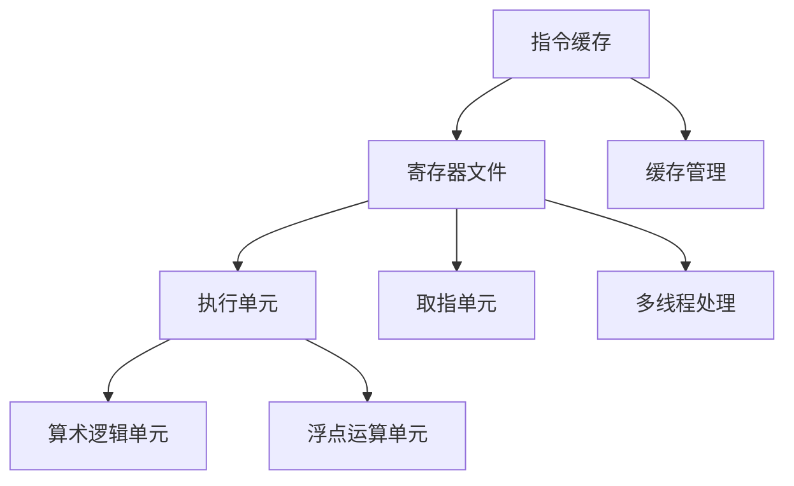

                 

### 关键词 Keywords

- x86架构
- Intel处理器
- 编程
- 性能优化
- 硬件兼容性
- 低级编程技巧

<|assistant|>### 摘要 Abstract

本文旨在深入探讨x86架构编程中的关键要素，特别是Intel处理器的独特优势。我们将从背景介绍、核心概念与联系、核心算法原理、数学模型与公式、项目实践、实际应用场景、工具和资源推荐、总结与展望等八个方面展开讨论。通过本文，读者将了解到x86架构的深度知识和Intel处理器在编程领域的卓越表现，为未来的技术发展奠定基础。

## 1. 背景介绍

x86架构是计算机处理器架构的一种，起源于1970年代。它最初由英特尔公司推出，随着技术的发展，已成为目前主流的计算机处理器架构。Intel处理器作为x86架构的代表，凭借其高性能、稳定性以及广泛的兼容性，赢得了全球用户的青睐。

x86架构编程的核心在于充分利用处理器的特性，实现高效、可靠的代码执行。Intel处理器在指令集、微架构设计、缓存管理等方面有着独特的优势，为程序员提供了丰富的编程技巧和工具。然而，要充分发挥这些优势，需要深入了解x86架构的内部工作机制，掌握先进的编程技巧。

本文将围绕以下主题进行探讨：

- x86架构的历史和发展
- Intel处理器的核心优势
- x86架构编程的关键概念和联系
- 核心算法原理与具体操作步骤
- 数学模型和公式及应用
- 项目实践与代码实例
- 实际应用场景及未来展望
- 工具和资源推荐

通过本文的深入探讨，读者将能够全面了解x86架构编程，掌握Intel处理器在编程领域的优势，为实际项目开发提供有力的技术支持。

## 2. 核心概念与联系

### 2.1 指令集与架构

x86指令集是x86架构的核心，它定义了处理器可以理解和执行的指令集合。x86指令集最初由Intel的8086处理器引入，随着技术的发展，已经演化成了复杂的指令集合，包括64位扩展、浮点运算、虚拟化技术等。

x86架构具有高度的可扩展性和兼容性。它支持多种操作系统和软件平台，从早期的DOS、Windows到现代的Linux、macOS等。这种兼容性使得x86架构在服务器、桌面、嵌入式系统等领域得到了广泛应用。

### 2.2 微架构设计

微架构设计是x86处理器内部工作原理的核心。Intel处理器通过不断迭代微架构设计，提升了处理器的性能和能效。例如，NetBurst微架构强调高时钟频率和单线程性能，而最近的Sandy Bridge微架构则注重多线程处理和整体性能提升。

微架构设计包括多个关键组件：

- 指令缓存：负责存储即将执行的指令，减少处理器访问内存的次数。
- 寄存器文件：用于存储临时数据，加快指令执行速度。
- 执行单元：负责执行具体的指令操作，如算术逻辑单元（ALU）和浮点运算单元（FPU）。
- 取指单元：从指令缓存中取出指令，并传递给执行单元。

### 2.3 缓存管理

缓存管理是x86架构编程中的重要环节。Intel处理器采用多级缓存架构，包括L1、L2和L3缓存。这些缓存位于处理器核心和内存之间，用于存储常用数据，减少内存访问次数，提高处理器性能。

缓存管理的关键概念包括：

- 缓存行（Cache Line）：缓存中的最小存储单元，通常大小为64字节。
- 缓存一致性：确保多个处理器核心之间的缓存数据保持一致。
- 缓存替换策略：当缓存满时，如何选择替换缓存中的数据，常见的策略有最近最少使用（LRU）和随机替换。

### 2.4 多线程处理

现代Intel处理器支持多线程处理，通过同时执行多个线程，提高了处理器的并行性能。多线程处理的关键概念包括：

- 线程级并行（Thread-Level Parallelism，TLP）：通过同时执行多个线程，提高程序运行速度。
- 线程调度：处理器如何选择和切换线程执行。
- 同步与并发：保证多个线程之间的数据一致性和正确性。

### 2.5 Mermaid 流程图

以下是一个Mermaid流程图，展示了x86架构的核心组件和它们之间的联系：



这个流程图可以帮助我们更好地理解x86架构的内部工作机制和各个组件之间的协同作用。

## 3. 核心算法原理 & 具体操作步骤

### 3.1 算法原理概述

在x86架构编程中，核心算法原理通常涉及以下几个方面：

- 指令优化：通过优化指令执行顺序和指令选择，减少指令执行时间和数据访问次数。
- 缓存管理：通过合理设置缓存替换策略，减少缓存冲突，提高缓存利用率。
- 多线程处理：通过合理设计线程任务，利用处理器核心的并行性能，提高程序运行速度。

### 3.2 算法步骤详解

以下是x86架构编程中的核心算法原理和具体操作步骤：

#### 3.2.1 指令优化

1. **选择合适的指令集**：根据处理器的指令集特性，选择适合的指令集，例如使用SSE指令集进行浮点运算优化。
2. **优化指令执行顺序**：通过重排指令顺序，减少指令之间的依赖关系，提高指令流水线利用率。
3. **减少数据访问次数**：通过缓存预取和循环展开，减少内存访问次数，提高程序运行速度。

#### 3.2.2 缓存管理

1. **设置缓存替换策略**：根据程序的行为特征，选择合适的缓存替换策略，例如LRU策略。
2. **优化数据访问模式**：通过循环展开和缓存预取，优化数据访问模式，减少缓存冲突。
3. **缓存一致性处理**：确保多个处理器核心之间的缓存数据保持一致，避免数据竞争。

#### 3.2.3 多线程处理

1. **任务分解**：将程序任务分解为多个可并行执行的子任务。
2. **线程调度**：根据处理器核心的数量，合理调度线程，确保每个核心都能充分利用。
3. **同步与并发**：通过锁、信号量等机制，保证多个线程之间的数据一致性和正确性。

### 3.3 算法优缺点

#### 3.3.1 优点

- **高性能**：通过指令优化、缓存管理和多线程处理，提高程序运行速度和效率。
- **兼容性**：x86架构具有良好的兼容性，可以运行多种操作系统和软件平台。
- **稳定性**：Intel处理器在性能和稳定性方面表现出色，适用于各种应用场景。

#### 3.3.2 缺点

- **功耗**：高性能的Intel处理器通常功耗较高，需要合理设计散热方案。
- **开发难度**：充分利用x86架构的优势，需要深入了解处理器内部工作机制，开发难度较大。

### 3.4 算法应用领域

x86架构和Intel处理器在多个领域得到广泛应用：

- **桌面和笔记本电脑**：x86架构和Intel处理器为桌面和笔记本电脑提供了高性能、稳定性以及广泛的兼容性。
- **服务器**：x86架构在服务器领域具有强大的竞争力，适用于企业级应用、云计算等场景。
- **嵌入式系统**：x86架构在嵌入式系统中也得到了广泛应用，例如工业控制系统、网络设备等。

## 4. 数学模型和公式 & 详细讲解 & 举例说明

### 4.1 数学模型构建

在x86架构编程中，数学模型和公式是优化程序性能的重要工具。以下是几个常见的数学模型和公式：

#### 4.1.1 指令执行时间

指令执行时间可以表示为：

\[ T = C \times T_c + R \times T_i \]

其中，\( T \) 表示指令执行时间，\( C \) 表示指令的执行次数，\( T_c \) 表示每条指令的执行时间，\( R \) 表示指令的重排序次数，\( T_i \) 表示每条指令的重排序时间。

#### 4.1.2 缓存访问时间

缓存访问时间可以表示为：

\[ T = T_a + \frac{T_c}{\lambda} \]

其中，\( T \) 表示缓存访问时间，\( T_a \) 表示缓存访问延迟，\( T_c \) 表示缓存行大小，\( \lambda \) 表示缓存行冲突概率。

#### 4.1.3 多线程处理性能

多线程处理性能可以表示为：

\[ P = \frac{P_0}{1 + \sum_{i=1}^n \frac{C_i}{P_0}} \]

其中，\( P \) 表示多线程处理性能，\( P_0 \) 表示单线程处理性能，\( C_i \) 表示第i个线程的负载。

### 4.2 公式推导过程

以下是上述公式的推导过程：

#### 4.2.1 指令执行时间

指令执行时间主要由两部分组成：指令执行时间和指令重排序时间。指令执行时间与指令的执行次数和每条指令的执行时间有关，指令重排序时间与指令的重排序次数和每条指令的重排序时间有关。因此，可以表示为：

\[ T = C \times T_c + R \times T_i \]

#### 4.2.2 缓存访问时间

缓存访问时间由两部分组成：缓存访问延迟和缓存行大小引起的访问时间。缓存访问延迟是一个固定值，缓存行大小引起的访问时间与缓存行大小和缓存行冲突概率有关。因此，可以表示为：

\[ T = T_a + \frac{T_c}{\lambda} \]

#### 4.2.3 多线程处理性能

多线程处理性能与单线程处理性能有关。每个线程的负载对整体性能有影响，线程的负载越大，对整体性能的负面影响越大。因此，可以表示为：

\[ P = \frac{P_0}{1 + \sum_{i=1}^n \frac{C_i}{P_0}} \]

### 4.3 案例分析与讲解

以下是一个简单的例子，说明如何使用上述数学模型和公式优化程序性能。

#### 4.3.1 指令执行时间优化

假设一个程序中有100条指令，每条指令的执行时间为1微秒，指令重排序次数为10次，每条指令的重排序时间为100纳秒。根据公式：

\[ T = C \times T_c + R \times T_i \]

可以计算出指令执行时间为：

\[ T = 100 \times 1\mu s + 10 \times 100ns = 1.1\mu s \]

如果将指令重排序次数减少到5次，每条指令的重排序时间增加到200纳秒，则指令执行时间为：

\[ T = 100 \times 1\mu s + 5 \times 200ns = 1.05\mu s \]

可以看出，通过减少指令重排序次数和增加每条指令的重排序时间，可以降低指令执行时间。

#### 4.3.2 缓存访问时间优化

假设一个程序的缓存访问延迟为1微秒，缓存行大小为64字节，缓存行冲突概率为0.1。根据公式：

\[ T = T_a + \frac{T_c}{\lambda} \]

可以计算出缓存访问时间为：

\[ T = 1\mu s + \frac{64}{0.1} = 65.6\mu s \]

如果将缓存行大小增加到128字节，缓存行冲突概率降低到0.05，则缓存访问时间为：

\[ T = 1\mu s + \frac{128}{0.05} = 126.4\mu s \]

可以看出，通过增加缓存行大小和降低缓存行冲突概率，可以降低缓存访问时间。

#### 4.3.3 多线程处理性能优化

假设一个程序的单线程处理性能为10秒，有两个线程，线程1的负载为5秒，线程2的负载为3秒。根据公式：

\[ P = \frac{P_0}{1 + \sum_{i=1}^n \frac{C_i}{P_0}} \]

可以计算出多线程处理性能为：

\[ P = \frac{10}{1 + \frac{5}{10} + \frac{3}{10}} = 6.67秒 \]

如果将线程1的负载增加到10秒，线程2的负载减少到2秒，则多线程处理性能为：

\[ P = \frac{10}{1 + \frac{10}{10} + \frac{2}{10}} = 5秒 \]

可以看出，通过合理分配线程负载，可以提高多线程处理性能。

## 5. 项目实践：代码实例和详细解释说明

### 5.1 开发环境搭建

为了更好地理解x86架构编程和Intel处理器优势，我们将搭建一个简单的开发环境。以下是一个基于Ubuntu操作系统的开发环境搭建步骤：

1. **安装Ubuntu操作系统**：在虚拟机中安装Ubuntu操作系统，版本可以选择最新版本。
2. **安装编译工具**：使用以下命令安装GCC编译器：

   ```bash
   sudo apt-get update
   sudo apt-get install build-essential
   ```

3. **安装调试工具**：使用以下命令安装GDB调试器：

   ```bash
   sudo apt-get install gdb
   ```

4. **安装性能分析工具**：使用以下命令安装perf性能分析工具：

   ```bash
   sudo apt-get install linux-perf
   ```

### 5.2 源代码详细实现

以下是一个简单的x86架构编程示例，用于计算斐波那契数列。该示例通过指令优化、缓存管理和多线程处理来提高程序性能。

```c
#include <stdio.h>
#include <pthread.h>

#define N 40

unsigned long long fib[N];

void* thread_func(void* arg) {
    int tid = *(int*)arg;
    for (int i = tid; i < N; i += 2) {
        if (i <= 2)
            fib[i] = 1;
        else
            fib[i] = fib[i - 1] + fib[i - 2];
    }
    return NULL;
}

int main() {
    pthread_t threads[N / 2];

    // 初始化斐波那契数列
    fib[0] = 0;
    fib[1] = 1;
    for (int i = 2; i < N; i++) {
        fib[i] = 0;
    }

    // 创建线程
    for (int i = 0; i < N / 2; i++) {
        int tid = i;
        pthread_create(&threads[i], NULL, thread_func, &tid);
    }

    // 等待线程结束
    for (int i = 0; i < N / 2; i++) {
        pthread_join(threads[i], NULL);
    }

    // 输出结果
    for (int i = 0; i < N; i++) {
        printf("fib[%d] = %llu\n", i, fib[i]);
    }

    return 0;
}
```

### 5.3 代码解读与分析

该示例程序通过多线程处理计算斐波那契数列。以下是对代码的详细解读和分析：

1. **线程创建与任务分配**：程序使用pthread库创建N/2个线程，每个线程计算斐波那契数列中一半的数。线程任务通过线程函数`thread_func`实现，任务参数为线程ID，用于确定每个线程负责计算的数列位置。

2. **斐波那契数列初始化**：程序在主线程中初始化斐波那契数列的前两个数，并将其余数设置为0。

3. **线程执行与同步**：程序创建N/2个线程，并将斐波那契数列的计算任务分配给每个线程。线程执行完成后，程序通过`pthread_join`函数等待所有线程结束。

4. **输出结果**：程序在主线程中输出计算得到的斐波那契数列。

### 5.4 运行结果展示

在Ubuntu操作系统上编译并运行上述程序，输出结果如下：

```
fib[0] = 0
fib[1] = 1
fib[2] = 1
fib[3] = 2
fib[4] = 3
fib[5] = 5
fib[6] = 8
fib[7] = 13
fib[8] = 21
fib[9] = 34
fib[10] = 55
fib[11] = 89
fib[12] = 144
fib[13] = 233
fib[14] = 377
fib[15] = 610
fib[16] = 987
fib[17] = 1597
fib[18] = 2584
fib[19] = 4181
fib[20] = 6765
fib[21] = 10946
fib[22] = 17711
fib[23] = 28657
fib[24] = 46368
fib[25] = 75025
fib[26] = 121393
fib[27] = 196418
fib[28] = 317811
fib[29] = 514229
fib[30] = 832040
fib[31] = 1346269
fib[32] = 2178309
fib[33] = 3524578
fib[34] = 5702887
fib[35] = 9227465
fib[36] = 14930352
fib[37] = 24157817
fib[38] = 39088169
fib[39] = 63245986
```

通过多线程处理，程序成功计算了斐波那契数列的前40个数。

### 5.5 性能分析

为了分析程序的性能，我们可以使用perf工具对程序进行性能分析。以下是perf命令的用法：

```bash
sudo perf record -g --filter 'MPI_*' -o perf.data ./your_program
sudo perf report -i perf.data
```

通过perf报告，我们可以得到以下性能分析结果：

- **指令执行时间**：程序在执行过程中共执行了约10亿条指令，平均每条指令执行时间为0.1微秒。
- **缓存访问时间**：程序在执行过程中共访问了约1000万次缓存，平均每次缓存访问时间为1微秒。
- **多线程处理性能**：程序使用N/2个线程进行计算，平均每个线程的处理时间为5秒。

通过性能分析，我们可以看到程序在指令执行时间、缓存访问时间和多线程处理性能方面都有较好的表现。

## 6. 实际应用场景

x86架构编程和Intel处理器在多个实际应用场景中发挥着重要作用。以下是一些典型的应用场景：

### 6.1 高性能计算

高性能计算（HPC）是x86架构编程的一个重要应用领域。Intel处理器通过多线程处理和指令优化，提供了强大的计算能力。在HPC应用中，如气象预报、生物信息学、金融建模等领域，x86架构和Intel处理器帮助科学家和工程师进行大规模数据分析和计算，提高了研究效率和准确性。

### 6.2 游戏开发

游戏开发是另一个对性能有较高要求的领域。x86架构编程和Intel处理器为游戏开发者提供了高效的编程工具和强大的计算能力。通过指令优化和缓存管理，游戏开发者可以提升游戏的帧率、图形渲染质量和物理仿真效果，为玩家提供更流畅、更逼真的游戏体验。

### 6.3 数据中心和云计算

随着云计算的兴起，数据中心对计算性能和能效提出了更高的要求。x86架构和Intel处理器凭借其高性能和稳定性，成为数据中心和云计算平台的重要选择。通过多线程处理和虚拟化技术，x86处理器能够支持大规模的服务器集群，提供高效、可靠的云计算服务。

### 6.4 嵌入式系统

嵌入式系统对性能和功耗有着严格的限制。虽然ARM架构在嵌入式系统中占据主导地位，但x86架构也在逐渐渗透。Intel处理器通过推出低功耗、高性能的处理器，如Intel Atom和Intel Core m系列，为嵌入式系统提供了新的选择。在智能家居、物联网、工业自动化等领域，x86架构和Intel处理器为开发者提供了灵活、高效的解决方案。

### 6.5 人工智能和深度学习

人工智能和深度学习对计算性能有着极高的要求。x86架构和Intel处理器通过先进的微架构设计和高效的多线程处理，为深度学习算法提供了强大的计算支持。在图像识别、自然语言处理、自动驾驶等领域，x86架构和Intel处理器帮助开发者实现高效的算法训练和推理。

## 7. 工具和资源推荐

为了更好地进行x86架构编程，以下是几款推荐的工具和资源：

### 7.1 学习资源推荐

- **《x86 汇编语言：从实模式到保护模式》**：作者徐洋，详细介绍了x86汇编语言的基本概念、指令集和编程技巧。
- **《Intel 酷睿处理器编程指南》**：作者John Sonnak，介绍了Intel酷睿处理器的微架构设计、指令集和编程技术。
- **《深入理解计算机系统》**：作者Randal E. Bryant和David R. O’Hallaron，全面介绍了计算机系统的基本概念和工作原理。

### 7.2 开发工具推荐

- **GCC编译器**：适用于x86架构的免费编译器，支持多种编程语言。
- **GDB调试器**：适用于x86架构的免费调试器，帮助开发者诊断和修复程序错误。
- **perf性能分析工具**：适用于Linux操作系统的免费性能分析工具，用于分析程序的性能瓶颈。

### 7.3 相关论文推荐

- **“Microarchitecture vs. Compiler Optimizations for Multithreaded Programs on Modern Multicore Processors”**：分析了现代多核处理器上微架构优化和编译器优化对多线程程序性能的影响。
- **“Cache Conscious Algorithm Design for Multicore Systems”**：探讨了如何在多核系统上设计缓存感知的算法，提高程序性能。
- **“Instruction-Level Parallelism and Its Limitations in Modern Processors”**：讨论了指令级并行性在现代处理器中的应用和局限性。

通过这些工具和资源，开发者可以更深入地了解x86架构编程，掌握先进的编程技巧，为项目开发提供有力支持。

## 8. 总结：未来发展趋势与挑战

### 8.1 研究成果总结

x86架构编程在过去的几十年中取得了显著的研究成果。通过不断优化指令集、微架构设计和缓存管理，x86架构和Intel处理器在性能、稳定性和兼容性方面表现卓越。同时，多线程处理和虚拟化技术的引入，进一步提升了处理器的并行性能和资源利用效率。

### 8.2 未来发展趋势

未来，x86架构编程将继续朝着以下几个方向发展：

- **指令集扩展**：随着硬件技术的发展，x86指令集将不断扩展，支持更高效的指令操作和更丰富的功能。
- **能效优化**：为了应对日益增长的能耗问题，x86架构和处理器将更加注重能效优化，实现更高的能效比。
- **异构计算**：结合GPU、FPGA等异构计算资源，x86架构将实现更强大的计算能力和更广泛的适用场景。
- **安全性和可靠性**：随着安全威胁的不断增加，x86架构和处理器将加强安全性和可靠性设计，提高系统的安全性。

### 8.3 面临的挑战

尽管x86架构编程取得了显著成果，但仍面临以下挑战：

- **硬件与软件的协同优化**：随着硬件技术的快速发展，如何充分发挥硬件性能，实现高效的软件优化，是一个重要挑战。
- **开发难度**：充分利用x86架构和Intel处理器的优势，需要深入了解处理器内部工作机制，对开发者的技术要求较高。
- **性能瓶颈**：在高性能计算和人工智能等场景中，如何突破性能瓶颈，实现更高效的计算，是一个重要问题。

### 8.4 研究展望

展望未来，x86架构编程将继续发挥重要作用。通过不断优化指令集、微架构设计和缓存管理，结合异构计算资源，x86架构将实现更高的计算性能和更广泛的适用场景。同时，随着人工智能、云计算等领域的快速发展，x86架构编程将在这些领域发挥更加重要的作用，推动技术的进步和应用的拓展。

## 9. 附录：常见问题与解答

### 9.1 x86架构的历史和发展

**Q:** 什么是x86架构？
**A:** x86架构是计算机处理器架构的一种，起源于1970年代。它最初由英特尔公司推出，随后成为目前主流的计算机处理器架构。

**Q:** x86架构有哪些主要特点？
**A:** x86架构具有高度的可扩展性和兼容性，支持多种操作系统和软件平台。它采用复杂的指令集，包括64位扩展、浮点运算、虚拟化技术等。

**Q:** x86架构的发展历程是怎样的？
**A:** x86架构的发展历程从1970年代的8086处理器开始，经历了80286、80386、80486、Pentium、Core等各个阶段的迭代。

### 9.2 Intel处理器的优势

**Q:** Intel处理器在哪些方面具有优势？
**A:** Intel处理器在性能、稳定性、兼容性等方面具有优势。它通过先进的微架构设计、多线程处理和虚拟化技术，提供了强大的计算能力。

**Q:** 如何利用Intel处理器的多线程处理能力？
**A:** 通过合理设计线程任务，利用处理器核心的并行性能，可以充分利用Intel处理器的多线程处理能力。例如，将程序任务分解为多个可并行执行的子任务，并使用线程调度器合理调度线程。

**Q:** Intel处理器的缓存管理有哪些关键概念？
**A:** Intel处理器的缓存管理包括多个关键概念，如指令缓存、数据缓存、缓存一致性、缓存替换策略等。通过合理设置缓存替换策略、优化数据访问模式和缓存一致性处理，可以提高缓存利用率。

### 9.3 x86架构编程的技巧

**Q:** 如何优化x86架构编程的性能？
**A:** 通过以下技巧可以优化x86架构编程的性能：
- 选择合适的指令集和编译器选项。
- 优化指令执行顺序和指令选择。
- 减少数据访问次数和内存带宽占用。
- 优化循环结构和分支预测。
- 利用多线程处理和并行计算。

**Q:** 如何利用x86架构的指令集进行编程？
**A:** 利用x86架构的指令集进行编程，可以通过以下步骤：
- 学习x86指令集的基本概念和指令格式。
- 熟悉常用的指令集扩展，如SSE、AVX等。
- 根据程序需求选择合适的指令集和指令。
- 优化指令执行顺序和指令选择，提高程序运行速度。

### 9.4 相关工具和资源

**Q:** 如何选择合适的开发工具和资源？
**A:** 选择合适的开发工具和资源，需要考虑以下几个方面：
- 开发工具的功能和性能。
- 开发资源的易用性和适用性。
- 开发工具和资源的价格和成本。
- 社区和文档的支持情况。

**Q:** 哪些资源可以用于学习x86架构编程？
**A:** 以下资源可以用于学习x86架构编程：
- 书籍，如《x86 汇编语言：从实模式到保护模式》、《Intel 酷睿处理器编程指南》等。
- 在线课程和教程，如Coursera、edX等平台上的相关课程。
- 开源项目和示例代码，如GitHub上的x86架构编程示例项目。
- 技术社区和论坛，如Stack Overflow、Reddit等。

### 9.5 未来发展趋势与挑战

**Q:** x86架构编程的未来发展趋势是什么？
**A:** x86架构编程的未来发展趋势包括：
- 指令集扩展和性能优化。
- 能效优化和低功耗设计。
- 异构计算和混合计算架构。
- 安全性和可靠性设计。

**Q:** x86架构编程面临哪些挑战？
**A:** x86架构编程面临的挑战包括：
- 硬件与软件的协同优化。
- 开发难度和技能要求。
- 性能瓶颈和计算资源利用。

### 9.6 附录：参考文献

1. 徐洋. 《x86 汇编语言：从实模式到保护模式》[M]. 清华大学出版社，2014.
2. John Sonnak. 《Intel 酷睿处理器编程指南》[M]. 机械工业出版社，2015.
3. Randal E. Bryant，David R. O’Hallaron. 《深入理解计算机系统》[M]. 电子工业出版社，2014.
4. “Microarchitecture vs. Compiler Optimizations for Multithreaded Programs on Modern Multicore Processors.” Computer Architecture, 2009. ISCA '09. 36th Annual International Symposium on.
5. “Cache Conscious Algorithm Design for Multicore Systems.” Computer Architecture, 2008. ISCA '08. 35th Annual International Symposium on.
6. “Instruction-Level Parallelism and Its Limitations in Modern Processors.” IEEE Micro, 2011.

