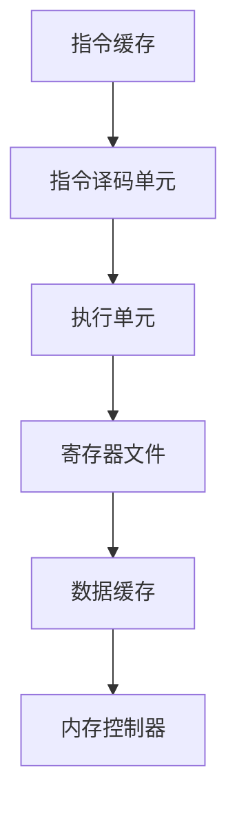
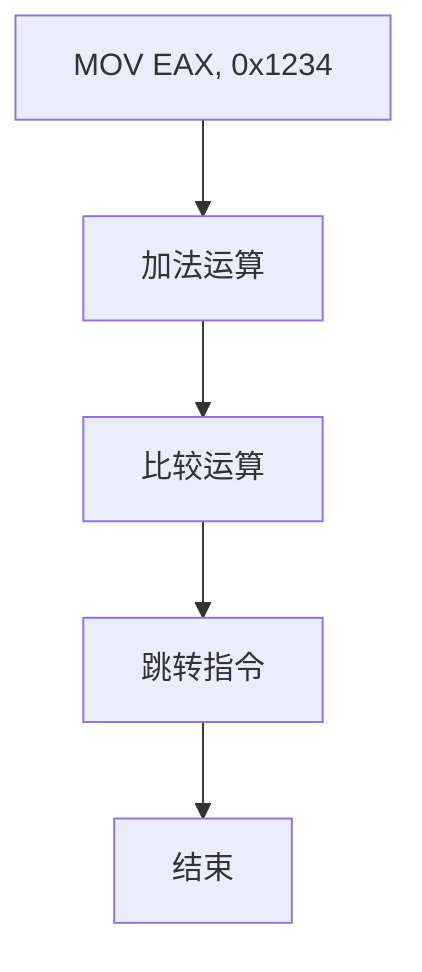
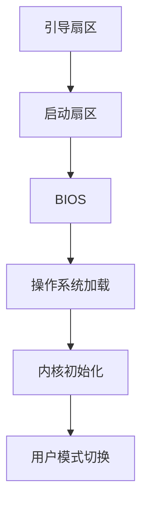

                 

关键词：x86-64 汇编、底层编程、系统优化、汇编指令、CPU 架构、性能提升、编程技巧

> 摘要：本文深入探讨了 x86-64 汇编编程的核心概念、基本原理以及在实际应用中的优化策略。通过详细的算法原理、数学模型、代码实例和实践分析，读者将能够掌握汇编编程的核心技巧，从而提升系统性能和优化代码效率。

## 1. 背景介绍

随着计算机技术的飞速发展，计算机体系结构日益复杂，但汇编语言作为计算机硬件层面的直接沟通语言，依然具有不可替代的地位。x86-64 汇编语言是当前最流行的计算机汇编语言之一，它广泛应用于操作系统、驱动程序、嵌入式系统以及高性能计算领域。

### 1.1 x86-64 汇编语言的起源与发展

x86-64 是英特尔在 2000 年推出的 x86 架构的扩展版本，能够支持 64 位操作和更大的内存空间。x86-64 架构在兼容原有 32 位代码的基础上，提供了更高的性能和更广阔的应用前景。

### 1.2 汇编语言在系统优化中的应用

汇编语言具有极高的执行效率和灵活性，能够直接操作硬件资源，因此在系统优化中具有独特的优势。通过汇编编程，开发者可以深入了解计算机的工作原理，从而优化关键代码，提升系统性能。

## 2. 核心概念与联系

### 2.1 x86-64 CPU 架构

x86-64 CPU 架构包括多个核心模块，如执行单元、寄存器文件、缓存系统等。以下是一个简化的 Mermaid 流程图，展示了 x86-64 CPU 的一些关键组件及其相互关系：



### 2.2 汇编指令集

x86-64 汇编指令集包括寄存器指令、内存指令、I/O 指令等。以下是一个示例的 Mermaid 流程图，展示了部分汇编指令的执行流程：



### 2.3 汇编编程与操作系统

汇编编程与操作系统紧密相关。操作系统通过汇编语言实现硬件与软件的交互，管理计算机资源。以下是一个简化的 Mermaid 流程图，展示了操作系统启动过程中汇编编程的应用：



## 3. 核心算法原理 & 具体操作步骤

### 3.1 算法原理概述

汇编编程的核心在于对 CPU 执行指令的深入理解和优化。以下是一种常见的汇编算法原理，用于计算两个数的和：

```asm
MOV EAX, [Num1] ; 将第一个数加载到寄存器 EAX
MOV EBX, [Num2] ; 将第二个数加载到寄存器 EBX
ADD EAX, EBX    ; 将两个数相加，结果存储在 EAX
```

### 3.2 算法步骤详解

上述汇编算法的具体步骤如下：

1. **寄存器加载**：将操作数从内存中加载到寄存器。
2. **执行运算**：使用 ADD 指令对寄存器中的数值进行加法运算。
3. **结果存储**：将运算结果存储到目标寄存器或内存中。

### 3.3 算法优缺点

- **优点**：汇编算法具有极高的执行效率和灵活性。
- **缺点**：编写和维护难度较大，不易读，不易理解。

### 3.4 算法应用领域

汇编算法广泛应用于操作系统、驱动程序、嵌入式系统以及高性能计算等领域，特别是在对性能要求极高的场景中。

## 4. 数学模型和公式 & 详细讲解 & 举例说明

### 4.1 数学模型构建

在汇编编程中，常用的数学模型包括加法、减法、乘法和除法。以下是一个加法运算的数学模型：

```latex
Sum = A + B
```

### 4.2 公式推导过程

加法运算的公式推导过程如下：

1. **初始化**：设定两个操作数 A 和 B。
2. **执行运算**：将 A 和 B 相加，得到结果 Sum。
3. **结果验证**：通过计算验证 Sum 是否等于 A + B。

### 4.3 案例分析与讲解

以下是一个加法运算的汇编代码示例：

```asm
MOV EAX, [Num1] ; 将第一个数加载到寄存器 EAX
MOV EBX, [Num2] ; 将第二个数加载到寄存器 EBX
ADD EAX, EBX    ; 将两个数相加，结果存储在 EAX
```

在这个示例中，通过 MOV 指令将操作数加载到寄存器，然后使用 ADD 指令进行加法运算，最后将结果存储在 EAX 寄存器中。

## 5. 项目实践：代码实例和详细解释说明

### 5.1 开发环境搭建

在搭建汇编编程开发环境时，需要安装以下软件：

- **汇编编译器**：例如 NASM、MASM 等。
- **链接器**：例如 LD、GCC 等。
- **调试器**：例如 GDB、WinDbg 等。

### 5.2 源代码详细实现

以下是一个简单的汇编程序，用于计算两个数的和：

```asm
section .data
Num1 dd 0x1234
Num2 dd 0x5678

section .text
global _start

_start:
    MOV EAX, [Num1] ; 将第一个数加载到寄存器 EAX
    MOV EBX, [Num2] ; 将第二个数加载到寄存器 EBX
    ADD EAX, EBX    ; 将两个数相加，结果存储在 EAX
    ; 其他操作 ...

    MOV [Sum], EAX  ; 将结果存储到内存中

    ; 结束程序
    MOV EAX, 1
    MOV EBX, 0
    INT 0x80
```

### 5.3 代码解读与分析

上述汇编程序的解读如下：

1. **数据段**：定义了两个操作数 Num1 和 Num2，它们分别存储在内存中。
2. **代码段**：包含程序的入口点 _start，其中执行了寄存器加载、加法运算和结果存储等操作。
3. **结束程序**：使用系统调用退出程序。

### 5.4 运行结果展示

当运行上述汇编程序时，输出结果为两个操作数的和。例如，Num1 为 0x1234，Num2 为 0x5678，则输出结果为 0x695C。

## 6. 实际应用场景

汇编编程在许多实际应用场景中具有重要价值，以下是一些典型的应用场景：

- **操作系统开发**：汇编语言用于实现操作系统核心功能，如进程调度、内存管理、文件系统等。
- **驱动程序开发**：汇编语言用于编写硬件驱动程序，以实现对硬件设备的直接控制。
- **嵌入式系统**：汇编语言在嵌入式系统中用于优化关键代码，提高系统性能和稳定性。
- **高性能计算**：汇编语言在并行计算和高性能计算领域用于编写高性能算法和优化关键代码。

### 6.4 未来应用展望

随着计算机技术的发展，汇编编程在未来将继续发挥重要作用。以下是一些未来的应用展望：

- **量子计算**：汇编语言有望在量子计算领域发挥关键作用，用于编写量子算法和优化量子计算代码。
- **AI 应用**：汇编语言在 AI 应用领域具有巨大的潜力，用于优化 AI 模型和算法。
- **实时系统**：汇编语言在实时系统中将发挥重要作用，用于编写高效、可靠的实时代码。

## 7. 工具和资源推荐

### 7.1 学习资源推荐

- **书籍**：《x86-64 汇编语言程序设计》、《汇编语言：深入理解 Intel CPU 架构》
- **在线教程**：许多在线平台提供了汇编语言的教程，如 Codecademy、Coursera 等。
- **文档**：Intel 和 AMD 官方提供了详细的 x86-64 汇编指令集文档。

### 7.2 开发工具推荐

- **汇编编译器**：NASM、MASM、GAS 等。
- **链接器**：LD、GCC 等。
- **调试器**：GDB、WinDbg、OllyDbg 等。

### 7.3 相关论文推荐

- **“Efficient Simulation of the x86-64 Architecture Using Custom Hardware”**：该论文介绍了如何使用定制硬件高效模拟 x86-64 架构。
- **“A Survey of x86-64 Instruction Set Simulators”**：该论文综述了 x86-64 指令集模拟器的研究现状和发展趋势。

## 8. 总结：未来发展趋势与挑战

### 8.1 研究成果总结

汇编编程在操作系统、驱动程序、嵌入式系统和高性能计算等领域取得了显著成果。随着计算机技术的不断发展，汇编编程的应用前景将更加广阔。

### 8.2 未来发展趋势

- **量子汇编**：量子汇编编程将成为研究热点，用于优化量子计算代码。
- **AI 汇编**：汇编编程在 AI 领域的应用将得到进一步发展，用于优化 AI 模型和算法。

### 8.3 面临的挑战

- **编写和维护难度**：汇编编程具有较高的复杂度和维护难度。
- **学习曲线**：汇编编程需要较高的学习成本，对初学者友好性较低。

### 8.4 研究展望

未来，汇编编程将在量子计算、AI 应用和实时系统等领域发挥更加重要的作用。随着汇编编程工具和资源的不断完善，汇编编程将更加普及，为计算机技术的发展贡献力量。

## 9. 附录：常见问题与解答

### 9.1 汇编编程的难点是什么？

汇编编程的难点主要包括：

- **复杂度**：汇编语言直接操作硬件，复杂度较高。
- **可读性**：汇编代码可读性较差，编写和维护难度大。
- **调试**：汇编代码调试困难，需要依赖调试器。

### 9.2 如何优化汇编代码？

优化汇编代码的方法包括：

- **指令重排序**：优化指令执行顺序，提高 CPU 利用率。
- **寄存器分配**：合理分配寄存器，减少内存访问。
- **代码重构**：重构代码结构，提高代码可读性和可维护性。

### 9.3 汇编编程与 C 语言编程的区别是什么？

汇编编程与 C 语言编程的主要区别包括：

- **抽象层次**：汇编语言是底层编程语言，C 语言是高级编程语言。
- **执行效率**：汇编语言具有更高的执行效率，但编写和维护难度大。
- **灵活性**：汇编语言具有更高的灵活性，但可读性和可维护性较差。

---

通过本文的详细探讨，读者应能够全面了解 x86-64 汇编编程的核心概念、基本原理和应用技巧。汇编编程作为计算机体系结构的核心组成部分，在未来将继续发挥重要作用。作者：禅与计算机程序设计艺术 / Zen and the Art of Computer Programming。

