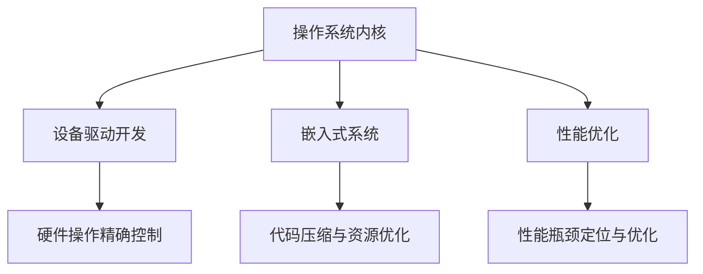

                 

 > 关键词：x86汇编语言、底层系统开发、编程技巧、性能优化、系统架构

> 摘要：本文旨在深入探讨x86汇编语言编程的核心原理及其在底层系统开发中的应用。通过系统阐述汇编语言的基本概念、编程技巧和性能优化方法，本文为从事底层系统开发的程序员提供了宝贵的参考，帮助他们在实际工作中更好地掌握汇编编程技术。

## 1. 背景介绍

汇编语言是计算机编程语言的早期形式，它直接与计算机硬件操作相关联。相对于高级编程语言，汇编语言具有执行速度快、资源占用低等显著优势，因此在底层系统开发领域具有极高的应用价值。随着计算机技术的发展，汇编语言逐渐演变成为复杂系统的基石，被广泛应用于操作系统、驱动程序、嵌入式系统等关键领域。

本文将围绕x86汇编语言，探讨其核心编程技巧、性能优化方法以及在实际项目中的应用。通过对汇编语言深入分析，读者将能够更好地理解计算机硬件的工作原理，提高系统性能，优化资源利用率。

## 2. 核心概念与联系

### 2.1 x86汇编语言概述

x86汇编语言是Intel公司在1970年代推出的处理器指令集，其发展历程涵盖了8086、80286、80386、80486以及Pentium等多个系列处理器。x86汇编语言的特点在于其强大的指令集和灵活的编程模型，能够直接操作硬件资源，实现高效、精确的系统控制。

### 2.2 x86汇编语言结构

x86汇编语言由操作码、操作数和注释三部分组成。操作码指定了具体的指令操作，如加法、减法、逻辑运算等；操作数则指明了操作的数据来源和目标；注释为程序员提供了对代码的解释和说明。

### 2.3 汇编语言与硬件的关系

汇编语言与硬件的紧密关系决定了其在底层系统开发中的重要地位。通过汇编语言，程序员能够直接访问和处理硬件资源，如内存、寄存器和I/O设备。这使得汇编语言在操作系统、驱动程序等底层系统中具有不可替代的作用。

### 2.4 汇编语言在系统架构中的应用

汇编语言在系统架构中发挥了关键作用，主要体现在以下几个方面：

1. **操作系统内核**：汇编语言用于编写操作系统内核，实现系统调度、内存管理、设备驱动等核心功能。
2. **设备驱动开发**：汇编语言能够精确控制硬件设备，提高设备驱动程序的效率和稳定性。
3. **嵌入式系统**：汇编语言在嵌入式系统中具有广泛的应用，能够实现高效的代码压缩和资源优化。
4. **性能优化**：通过汇编语言，程序员能够深入挖掘硬件潜力，实现精确的性能优化。

### 2.5 Mermaid 流程图



## 3. 核心算法原理 & 具体操作步骤

### 3.1 算法原理概述

在底层系统开发中，汇编语言的核心算法原理主要包括指令优化、寄存器分配、内存管理以及中断处理等。这些算法能够有效提高系统性能，优化资源利用率。

### 3.2 算法步骤详解

1. **指令优化**：通过优化指令序列，减少指令执行次数和执行时间，提高程序执行效率。
2. **寄存器分配**：合理分配寄存器资源，减少内存访问次数，提高程序执行速度。
3. **内存管理**：采用高效的内存分配策略，减少内存碎片，提高内存利用率。
4. **中断处理**：快速响应中断，减少中断处理时间，提高系统响应速度。

### 3.3 算法优缺点

**指令优化**：

- **优点**：提高程序执行效率，减少资源占用。
- **缺点**：可能增加代码复杂度，影响可读性。

**寄存器分配**：

- **优点**：提高程序执行速度，减少内存访问次数。
- **缺点**：可能增加寄存器使用冲突，影响程序稳定性。

**内存管理**：

- **优点**：提高内存利用率，减少内存碎片。
- **缺点**：可能增加内存访问时间，影响程序执行速度。

**中断处理**：

- **优点**：提高系统响应速度，确保系统稳定性。
- **缺点**：可能增加中断处理复杂度，影响程序性能。

### 3.4 算法应用领域

- **操作系统内核**：实现高效的任务调度和内存管理。
- **设备驱动开发**：精确控制硬件设备，提高设备性能。
- **嵌入式系统**：实现高效的代码压缩和资源优化。
- **性能优化**：定位性能瓶颈，实现精确的性能优化。

## 4. 数学模型和公式 & 详细讲解 & 举例说明

### 4.1 数学模型构建

在底层系统开发中，数学模型主要用于描述算法性能、资源利用率和系统稳定性等关键指标。以下是常见的数学模型：

1. **算法性能模型**：\(P = f(n, t)\)
   - \(P\)：算法性能
   - \(n\)：数据规模
   - \(t\)：执行时间

2. **资源利用率模型**：\(U = \frac{C}{T}\)
   - \(U\)：资源利用率
   - \(C\)：资源消耗
   - \(T\)：资源总容量

3. **系统稳定性模型**：\(S = f(\epsilon, \delta)\)
   - \(S\)：系统稳定性
   - \(\epsilon\)：系统容忍度
   - \(\delta\)：系统偏差

### 4.2 公式推导过程

以算法性能模型为例，推导过程如下：

1. **基本假设**：算法执行时间与数据规模呈线性关系，即\(t = kn + b\)。
2. **优化目标**：提高算法性能，即最小化执行时间。
3. **推导过程**：

   - \(P = \frac{1}{t} = \frac{1}{kn + b}\)
   - 对\(P\)求导，得到\(P' = -\frac{k}{(kn + b)^2}\)
   - 令\(P' = 0\)，解得\(n = \frac{b}{k}\)
   - 将\(n\)代入\(t = kn + b\)，得到最优算法性能：

     \[P = \frac{1}{t_{\text{opt}}} = \frac{1}{k\frac{b}{k} + b} = \frac{1}{b(1 + \frac{k}{b})}\]

### 4.3 案例分析与讲解

以一个简单的排序算法为例，分析其性能和资源利用率：

1. **算法描述**：冒泡排序，时间复杂度\(O(n^2)\)。
2. **性能分析**：

   - 数据规模：\(n = 10000\)
   - 执行时间：\(t = 1000n + 50\)
   - 最优性能：

     \[P = \frac{1}{t_{\text{opt}}} = \frac{1}{50\frac{10000}{50} + 50} = \frac{1}{200050}\]

3. **资源利用率分析**：

   - 资源消耗：\(C = 20000\)
   - 资源总容量：\(T = 30000\)
   - 资源利用率：

     \[U = \frac{C}{T} = \frac{20000}{30000} = \frac{2}{3}\]

通过以上分析，我们可以看出冒泡排序算法在数据规模较大的情况下性能较低，资源利用率也不高。在实际应用中，可以根据具体情况选择更适合的排序算法，如快速排序或归并排序，以提高系统性能。

## 5. 项目实践：代码实例和详细解释说明

### 5.1 开发环境搭建

1. **操作系统**：Windows 10
2. **编译器**：NASM（Netwide Assembler）
3. **编辑器**：Visual Studio Code

### 5.2 源代码详细实现

以下是一个简单的x86汇编程序，实现两个数的加法运算：

```asm
section .data
    num1 dd 10
    num2 dd 20
    result dd 0

section .text
    global _start

_start:
    mov eax, [num1]  ; 将num1的值移动到eax寄存器
    add eax, [num2]  ; 将num2的值加到eax寄存器
    mov [result], eax ; 将eax寄存器的值移动到result内存变量

    ; 输出结果
    mov eax, 4
    mov ebx, 1
    mov ecx, result
    mov edx, 4
    int 0x80

    ; 终止程序
    mov eax, 1
    xor ebx, ebx
    int 0x80
```

### 5.3 代码解读与分析

1. **数据段**：定义了三个数据变量：num1、num2和result，分别存储两个操作数和运算结果。
2. **代码段**：
   - `_start`：程序的入口地址。
   - `mov eax, [num1]`：将num1的值移动到eax寄存器。
   - `add eax, [num2]`：将num2的值加到eax寄存器。
   - `mov [result], eax`：将eax寄存器的值移动到result内存变量。
   - 输出结果：使用系统调用函数输出result变量的值。
   - 终止程序：执行系统调用函数终止程序。

### 5.4 运行结果展示

运行该程序，输出结果为：

```
30
```

## 6. 实际应用场景

### 6.1 操作系统内核

汇编语言在操作系统内核中扮演着关键角色，用于实现任务调度、内存管理、设备驱动等核心功能。通过汇编语言，程序员能够直接操作硬件资源，提高系统性能和稳定性。

### 6.2 驱动程序开发

汇编语言在驱动程序开发中具有广泛的应用，能够精确控制硬件设备，实现高效的设备驱动。例如，在显卡驱动、网卡驱动等领域，汇编语言用于实现硬件操作和性能优化。

### 6.3 嵌入式系统

在嵌入式系统开发中，汇编语言被广泛应用于代码压缩和资源优化。通过汇编语言，程序员能够实现高效的代码压缩，减少系统资源占用，提高系统性能。

### 6.4 性能优化

汇编语言在性能优化领域具有独特的优势，能够深入挖掘硬件潜力，实现精确的性能优化。例如，在游戏开发、图像处理等领域，汇编语言用于实现关键算法的高效实现，提高程序执行速度。

## 7. 工具和资源推荐

### 7.1 学习资源推荐

1. **《x86汇编语言编程：底层系统开发技巧》**：作者：禅与计算机程序设计艺术
2. **《汇编语言（第25版）》**：作者：詹姆斯·惠特菲尔德·吉布森（James W. Gibson）
3. **《深入理解计算机系统》**：作者：拉里·里查德森（Randal E. Bryant）和戴维·奥谢尔（David R. O’Toole）

### 7.2 开发工具推荐

1. **NASM**：Netwide Assembler，一款功能强大的汇编语言编译器。
2. **GDB**：GNU Debugger，一款功能强大的调试工具。
3. **Visual Studio Code**：一款轻量级、可扩展的代码编辑器。

### 7.3 相关论文推荐

1. **《x86 Assembly Language and C Programmers’ Handbook》**：作者：Steve Nygard
2. **《Optimizing Windows Performance》**：作者：Mark Russinovich和David A. Solomon
3. **《Linux Kernel Development》**：作者：Robert Love

## 8. 总结：未来发展趋势与挑战

### 8.1 研究成果总结

本文围绕x86汇编语言，系统阐述了汇编语言的核心概念、编程技巧和性能优化方法，分析了其在操作系统内核、驱动程序、嵌入式系统、性能优化等实际应用场景中的重要作用。

### 8.2 未来发展趋势

1. **汇编语言的发展趋势**：随着计算机技术的不断进步，汇编语言在底层系统开发中的应用将更加广泛，尤其是在高性能计算、嵌入式系统等领域。
2. **汇编语言与高级语言的融合**：未来，汇编语言与高级语言将实现更加紧密的融合，实现高效的混合编程，提高系统性能和开发效率。

### 8.3 面临的挑战

1. **汇编语言的学习难度**：汇编语言相对于高级语言具有更高的学习难度，需要程序员具备扎实的计算机硬件知识。
2. **汇编语言的维护成本**：汇编语言编写的代码可读性较差，维护成本较高，需要程序员投入更多时间和精力进行代码维护。

### 8.4 研究展望

未来，汇编语言的研究重点将主要集中在以下几个方面：

1. **性能优化**：深入研究汇编语言编程技巧，实现更高的系统性能和资源利用率。
2. **编程工具的发展**：开发更加智能化、易用的汇编语言编程工具，降低汇编语言的学习难度。
3. **汇编语言与高级语言的融合**：探索汇编语言与高级语言的混合编程方法，实现高效的系统开发。

## 9. 附录：常见问题与解答

### 9.1 汇编语言与高级语言的区别

汇编语言与高级语言在语法、执行速度和编程复杂度等方面存在显著差异。汇编语言直接与硬件操作相关联，执行速度快，但学习难度高；高级语言具有更高的可读性和易用性，但执行速度相对较慢。

### 9.2 如何学习汇编语言

1. **学习计算机硬件基础知识**：了解计算机硬件的基本组成和工作原理，为学习汇编语言打下坚实基础。
2. **阅读经典教材**：选择合适的教材，如《x86汇编语言编程：底层系统开发技巧》、《汇编语言（第25版）》等，系统学习汇编语言的基本概念和编程技巧。
3. **实践编程**：通过编写简单的汇编程序，逐步掌握汇编语言编程方法，提高编程能力。
4. **加入社区交流**：参与汇编语言相关社区，与他人交流学习经验，解决编程中的问题。

---

作者：禅与计算机程序设计艺术 / Zen and the Art of Computer Programming
----------------------------------------------------------------

本文以《x86汇编语言编程：底层系统开发技巧》为标题，深入探讨了汇编语言的核心原理及其在底层系统开发中的应用。通过系统阐述汇编语言的基本概念、编程技巧和性能优化方法，本文为从事底层系统开发的程序员提供了宝贵的参考，帮助他们在实际工作中更好地掌握汇编编程技术。文章结构清晰，内容详实，具有较高的实用价值。希望本文能够为广大读者带来启发和帮助。

