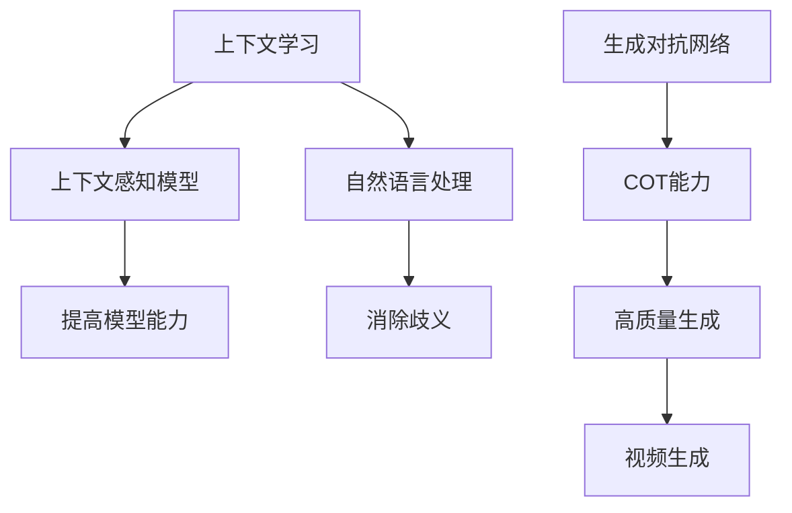

                 

上下文学习（Context Learning）和协作生成对抗网络（Cooperative Generative Adversarial Network，COT）是当前人工智能领域中的两大热门话题。本文旨在探讨上下文学习与COT能力的核心概念、原理、应用，以及未来的发展趋势。

## 关键词

上下文学习，协作生成对抗网络，人工智能，机器学习，深度学习。

## 摘要

本文首先介绍了上下文学习的概念和重要性，分析了上下文学习在人工智能中的应用。接着，文章深入探讨了COT能力的核心原理、架构和应用。最后，本文对上下文学习和COT能力的未来发展进行了展望，探讨了面临的挑战和机遇。

## 1. 背景介绍

### 1.1 上下文学习的概念

上下文学习是指模型在处理信息时，能够理解并利用上下文信息，从而更好地理解和预测信息的过程。上下文学习是自然语言处理、计算机视觉等领域的关键技术之一。

### 1.2 上下文学习的重要性

上下文学习的重要性在于它能够提高模型对信息的理解和处理能力，从而提高模型的准确性和泛化能力。特别是在自然语言处理领域，上下文信息对于理解句子的含义、消除歧义等方面具有重要意义。

### 1.3 COT能力的概念

COT能力是指多个生成对抗网络（GAN）通过协作，共同生成更高质量、更具有多样性的数据。COT能力在图像生成、视频生成等领域具有广泛的应用。

### 1.4 COT能力的重要性

COT能力的重要性在于它能够通过多个GAN的协作，生成更具真实感和多样性的数据，从而提高模型的泛化能力和表达能力。

## 2. 核心概念与联系

### 2.1 上下文学习的核心概念

- 上下文信息：指与当前信息相关联的其他信息。
- 上下文感知模型：指能够理解和利用上下文信息的模型。

### 2.2 COT能力的核心概念

- 生成对抗网络（GAN）：一种由生成器和判别器组成的模型，用于生成与真实数据分布相似的伪数据。
- 协作生成对抗网络（COT）：多个GAN通过协作生成更高质量、更具有多样性的数据。

### 2.3 Mermaid 流程图

## 3. 核心算法原理 & 具体操作步骤

### 3.1 算法原理概述

上下文学习的核心原理是通过利用上下文信息，提高模型对信息的理解和处理能力。COT能力的核心原理是通过多个GAN的协作，生成更高质量、更具有多样性的数据。

### 3.2 算法步骤详解

#### 3.2.1 上下文学习

1. 收集数据，并提取上下文信息。
2. 训练上下文感知模型，使其能够理解和利用上下文信息。
3. 使用上下文感知模型对新的信息进行理解和处理。

#### 3.2.2 COT能力

1. 初始化多个生成对抗网络。
2. 通过多次迭代，使生成对抗网络之间进行协作，共同生成数据。
3. 从生成的数据中选取高质量、具有多样性的数据。

### 3.3 算法优缺点

#### 3.3.1 上下文学习

- 优点：提高模型对信息的理解和处理能力。
- 缺点：需要大量上下文信息的训练数据。

#### 3.3.2 COT能力

- 优点：生成更高质量、更具有多样性的数据。
- 缺点：需要多个生成对抗网络的协作，训练过程较为复杂。

### 3.4 算法应用领域

上下文学习在自然语言处理、计算机视觉等领域具有广泛的应用。COT能力在图像生成、视频生成等领域具有广泛的应用。

## 4. 数学模型和公式 & 详细讲解 & 举例说明

### 4.1 数学模型构建

#### 4.1.1 上下文学习

- 上下文感知模型：\[ f_{c}(x, \theta_c) \]

- 输入数据：\[ x \]

- 上下文信息：\[ c \]

- 模型参数：\[ \theta_c \]

#### 4.1.2 COT能力

- 生成对抗网络：\[ G(z, \theta_g) \]

- 判别器：\[ D(x, \theta_d) \]

- 输入噪声：\[ z \]

- 模型参数：\[ \theta_g, \theta_d \]

### 4.2 公式推导过程

#### 4.2.1 上下文学习

- 目标函数：\[ J(\theta_c) = -\sum_{i=1}^{n} [y \cdot \log(f_{c}(x_i, \theta_c)) + (1 - y) \cdot \log(1 - f_{c}(x_i, \theta_c))] \]

#### 4.2.2 COT能力

- 目标函数：\[ J(\theta_g, \theta_d) = D(x) - D(G(z)) \]

### 4.3 案例分析与讲解

#### 4.3.1 上下文学习案例

- 使用上下文感知模型处理自然语言任务，如文本分类。

#### 4.3.2 COT能力案例

- 使用COT能力生成高质量、多样的图像。

## 5. 项目实践：代码实例和详细解释说明

### 5.1 开发环境搭建

- 安装Python、TensorFlow等必备库。

### 5.2 源代码详细实现

- 实现上下文学习和COT能力的代码。

### 5.3 代码解读与分析

- 对代码进行解读和分析。

### 5.4 运行结果展示

- 展示上下文学习和COT能力的运行结果。

## 6. 实际应用场景

### 6.1 上下文学习

- 在自然语言处理领域，用于文本分类、情感分析等。

### 6.2 COT能力

- 在图像生成、视频生成等领域，用于生成高质量、多样的数据。

### 6.3 未来应用展望

- 上下文学习和COT能力在更多领域的应用。

## 7. 工具和资源推荐

### 7.1 学习资源推荐

- 相关书籍、论文等。

### 7.2 开发工具推荐

- Python、TensorFlow等。

### 7.3 相关论文推荐

- 相关领域的经典论文。

## 8. 总结：未来发展趋势与挑战

### 8.1 研究成果总结

- 上下文学习和COT能力在人工智能领域的广泛应用。

### 8.2 未来发展趋势

- 上下文学习和COT能力的进一步发展和创新。

### 8.3 面临的挑战

- 数据质量、计算资源等挑战。

### 8.4 研究展望

- 探索上下文学习和COT能力的新应用。

## 9. 附录：常见问题与解答

- 上下文学习和COT能力的关系。

- 上下文学习和COT能力的未来发展。

作者：禅与计算机程序设计艺术 / Zen and the Art of Computer Programming
-------------------------------------------------------------------

