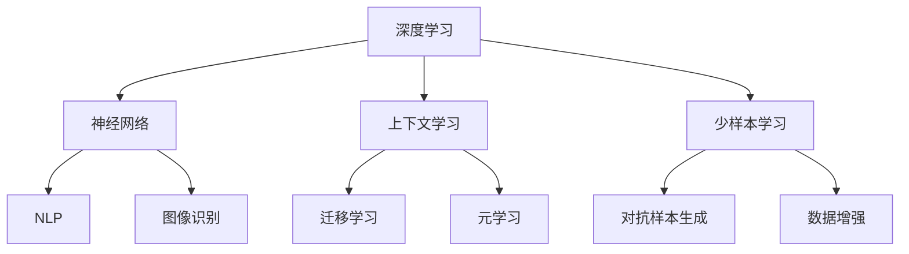

                 

关键词：上下文学习，少样本学习，人工智能，机器学习，深度学习，模型优化，算法原理

> 摘要：本文将深入探讨上下文学习和少样本学习能力在人工智能领域的应用与重要性。通过对核心概念、算法原理、数学模型、实践案例以及未来展望的详细阐述，本文旨在为读者提供一个全面的技术视角，帮助理解这两个关键领域在推动人工智能发展中的核心作用。

## 1. 背景介绍

在当今快速发展的信息技术时代，人工智能（AI）已经成为各行各业的推动力。随着数据量的指数级增长和计算能力的提升，机器学习，尤其是深度学习，逐渐成为实现AI的核心技术。然而，传统的机器学习模型往往依赖于大规模数据集来训练，这不仅消耗大量的时间和计算资源，还可能导致模型在处理少量数据时性能不佳。为了克服这些挑战，上下文学习和少样本学习成为近年来研究的热点。

### 1.1 上下文学习

上下文学习是指模型在理解输入信息时能够考虑到与当前任务相关的上下文信息。这种能力对于实现自然语言处理（NLP）、语音识别、图像识别等任务至关重要。通过上下文学习，模型能够更好地理解语言、图像或声音的隐含含义，从而提高任务的准确性和鲁棒性。

### 1.2 少样本学习

少样本学习旨在使机器学习模型在仅使用少量样本的情况下也能够取得良好的性能。这对于新任务的快速适应、医疗诊断、无人驾驶等应用场景具有重要意义。少样本学习的研究主要包括迁移学习、元学习、对抗样本生成等方法，目的是通过有效的数据增强和模型调整来提高模型的泛化能力。

## 2. 核心概念与联系

在探讨上下文学习和少样本学习能力之前，我们需要明确一些核心概念，并展示它们之间的关系。

### 2.1 核心概念

- **深度学习**：一种基于多层神经网络的学习方法，能够自动从数据中提取复杂特征。
- **神经网络**：由多个神经元组成的计算模型，能够模拟人脑的信息处理过程。
- **自然语言处理（NLP）**：使计算机能够理解、生成和处理人类语言的技术。
- **图像识别**：通过计算机算法识别和分类图像中的对象。

### 2.2 架构与联系（Mermaid 流程图）



在这个流程图中，深度学习和神经网络是核心技术，它们为上下文学习和少样本学习提供了基础。上下文学习通过迁移学习和元学习来增强模型对上下文的理解，而少样本学习则通过对抗样本生成和数据增强来提高模型的泛化能力。

## 3. 核心算法原理 & 具体操作步骤

### 3.1 算法原理概述

上下文学习和少样本学习的核心算法主要包括以下几种：

- **上下文嵌入（Contextual Embedding）**：通过将上下文信息嵌入到模型的输入层，使模型能够利用上下文信息进行预测。
- **迁移学习（Transfer Learning）**：利用预训练模型在新任务上进行微调，从而减少对大量数据的依赖。
- **元学习（Meta-Learning）**：通过训练模型来解决一系列不同的任务，使模型能够快速适应新任务。
- **对抗样本生成（Adversarial Example Generation）**：通过生成对抗性样本来提高模型的鲁棒性。

### 3.2 算法步骤详解

#### 3.2.1 上下文嵌入

1. **输入层**：将输入数据（如文本、图像或声音）转换为嵌入向量。
2. **上下文层**：将上下文信息（如词汇表、图像标签或语音特征）转换为上下文向量。
3. **融合层**：将输入嵌入向量和上下文向量进行融合，形成融合向量。
4. **输出层**：使用融合向量进行预测或分类。

#### 3.2.2 迁移学习

1. **预训练模型**：在大型数据集上训练一个通用模型。
2. **任务数据集**：获取新的任务数据集。
3. **微调**：在新的任务数据集上对预训练模型进行微调。
4. **评估**：在新任务上评估模型的性能。

#### 3.2.3 元学习

1. **任务集**：准备一系列不同的任务。
2. **模型训练**：在任务集上训练模型，使其能够快速适应新任务。
3. **新任务适应**：在新的任务上评估模型的适应能力。
4. **优化**：根据新任务的反馈对模型进行调整。

#### 3.2.4 对抗样本生成

1. **模型训练**：训练一个目标模型。
2. **对抗样本生成**：通过对抗性算法生成对抗样本。
3. **模型评估**：在对抗样本上评估目标模型的鲁棒性。
4. **模型优化**：根据对抗样本的反馈对模型进行优化。

### 3.3 算法优缺点

#### 3.3.1 上下文嵌入

- 优点：能够利用上下文信息提高预测准确性。
- 缺点：计算复杂度较高，需要大量的上下文信息。

#### 3.3.2 迁移学习

- 优点：能够减少对大量数据的依赖，提高模型泛化能力。
- 缺点：预训练模型的性能对迁移学习效果有重要影响。

#### 3.3.3 元学习

- 优点：能够快速适应新任务，提高模型灵活性。
- 缺点：训练过程复杂，需要大量的训练数据。

#### 3.3.4 对抗样本生成

- 优点：能够提高模型的鲁棒性，防止恶意攻击。
- 缺点：对抗样本的生成过程可能导致模型性能下降。

### 3.4 算法应用领域

上下文学习和少样本学习在许多领域都有广泛的应用：

- **自然语言处理**：通过上下文嵌入实现更准确的文本理解和生成。
- **图像识别**：利用迁移学习和对抗样本生成提高模型的识别能力。
- **无人驾驶**：通过元学习使自动驾驶系统能够快速适应新环境。
- **医疗诊断**：通过少样本学习实现快速、准确的疾病诊断。

## 4. 数学模型和公式 & 详细讲解 & 举例说明

### 4.1 数学模型构建

上下文学习和少样本学习涉及到多种数学模型，以下分别介绍。

#### 4.1.1 上下文嵌入

上下文嵌入可以使用如下数学模型：

$$
\text{context\_embedding} = \text{embed}(\text{input}) + \text{context\_info}
$$

其中，$\text{embed}(\text{input})$ 表示输入数据的嵌入向量，$\text{context\_info}$ 表示上下文信息。

#### 4.1.2 迁移学习

迁移学习可以使用如下数学模型：

$$
\text{output} = \text{model}(\text{input}) + \text{fine-tuning}
$$

其中，$\text{model}(\text{input})$ 表示预训练模型的输出，$\text{fine-tuning}$ 表示在新任务上的微调。

#### 4.1.3 元学习

元学习可以使用如下数学模型：

$$
\text{model}(\theta) = \arg\min_{\theta} \sum_{i=1}^{N} \ell(y_i, \text{model}(x_i; \theta))
$$

其中，$\ell(y_i, \text{model}(x_i; \theta))$ 表示损失函数，$\theta$ 表示模型参数。

#### 4.1.4 对抗样本生成

对抗样本生成可以使用如下数学模型：

$$
\text{adv\_example} = \text{model}(\text{input}) + \text{adversarial}
$$

其中，$\text{adversarial}$ 表示对抗性调整。

### 4.2 公式推导过程

以上数学模型的推导过程较为复杂，涉及大量的微积分和线性代数知识。在此，我们简要介绍其中一部分的推导过程。

#### 4.2.1 上下文嵌入

上下文嵌入的推导主要涉及嵌入向量和上下文向量的加和。具体推导如下：

$$
\begin{aligned}
\text{context\_embedding} &= \text{embed}(\text{input}) + \text{context\_info} \\
\text{context\_embedding} &= W_{input} \text{input} + W_{context} \text{context\_info} \\
\text{context\_embedding} &= \text{input} \cdot (W_{input} + W_{context})
\end{aligned}
$$

其中，$W_{input}$ 和 $W_{context}$ 分别为输入和上下文的权重矩阵。

#### 4.2.2 迁移学习

迁移学习的推导主要涉及预训练模型和新任务模型的结合。具体推导如下：

$$
\begin{aligned}
\text{output} &= \text{model}(\text{input}) + \text{fine-tuning} \\
\text{output} &= \text{model}(\text{input}) + \text{learning\_rate} \cdot (\text{model}(\text{input}) - \text{output}) \\
\text{output} &= \text{model}(\text{input}) + \text{learning\_rate} \cdot \text{gradient}
\end{aligned}
$$

其中，$\text{learning\_rate}$ 为学习率，$\text{gradient}$ 为梯度。

#### 4.2.3 元学习

元学习的推导主要涉及模型在任务集上的训练过程。具体推导如下：

$$
\begin{aligned}
\text{model}(\theta) &= \arg\min_{\theta} \sum_{i=1}^{N} \ell(y_i, \text{model}(x_i; \theta)) \\
\ell(y_i, \text{model}(x_i; \theta)) &= \sum_{i=1}^{N} (\text{model}(x_i; \theta) - y_i)^2 \\
\ell(y_i, \text{model}(x_i; \theta)) &= \sum_{i=1}^{N} \text{error}^2
\end{aligned}
$$

其中，$\ell(y_i, \text{model}(x_i; \theta))$ 表示损失函数，$\text{error}$ 表示误差。

#### 4.2.4 对抗样本生成

对抗样本生成的推导主要涉及对抗性调整的引入。具体推导如下：

$$
\begin{aligned}
\text{adv\_example} &= \text{model}(\text{input}) + \text{adversarial} \\
\text{adv\_example} &= \text{model}(\text{input}) + \text{learning\_rate} \cdot (\text{model}(\text{input}) - \text{adv\_example}) \\
\text{adv\_example} &= \text{model}(\text{input}) + \text{learning\_rate} \cdot \text{gradient}
\end{aligned}
$$

其中，$\text{learning\_rate}$ 为学习率，$\text{gradient}$ 为梯度。

### 4.3 案例分析与讲解

以下通过具体案例来展示上下文学习和少样本学习在实践中的应用。

#### 4.3.1 上下文嵌入在NLP中的应用

假设我们要构建一个文本分类模型，任务是将文本分类为“科技”、“体育”、“娱乐”等类别。我们可以使用上下文嵌入来提高模型的分类准确性。

1. **数据准备**：收集包含标签的文本数据，如科技新闻、体育新闻、娱乐新闻等。
2. **模型构建**：使用预训练的词向量模型（如GloVe）来嵌入文本，同时添加上下文信息。
3. **训练与评估**：在训练集上训练模型，并在测试集上评估模型的分类准确性。

具体实现如下：

```python
import torch
import torch.nn as nn
from torchtext.datasets import TextClassificationDataset
from torchtext.data import Field, BucketIterator

# 数据准备
TEXT = Field(tokenize='spacy', lower=True, include_lengths=True)
LABEL = Field(sequential=False)

train_data, test_data = TextClassificationDataset.splits(
    path='data', train='train.txt', test='test.txt', format='txt', fields=(TEXT, LABEL))

# 模型构建
class TextClassifier(nn.Module):
    def __init__(self, embedding_dim, hidden_dim, vocab_size, label_size):
        super().__init__()
        self.embedding = nn.Embedding(vocab_size, embedding_dim)
        self.rnn = nn.LSTM(embedding_dim, hidden_dim, num_layers=1, batch_first=True)
        self.fc = nn.Linear(hidden_dim, label_size)
        
    def forward(self, text, text_len):
        embedded = self.embedding(text)
        packed = nn.utils.rnn.pack_padded_sequence(embedded, text_len, batch_first=True)
        _, (hidden, cell) = self.rnn(packed)
        hidden = hidden.squeeze(0)
        out = self.fc(hidden)
        return out

# 训练与评估
model = TextClassifier(embedding_dim=100, hidden_dim=256, vocab_size=len(train_data.vocab), label_size=len(train_data.label_list))
optimizer = torch.optim.Adam(model.parameters(), lr=0.001)
criterion = nn.CrossEntropyLoss()

for epoch in range(10):
    for batch in iterator(train_data, batch_size=32, shuffle=True):
        optimizer.zero_grad()
        text, text_len = batch.text
        labels = batch.label
        outputs = model(text, text_len)
        loss = criterion(outputs, labels)
        loss.backward()
        optimizer.step()
    print(f'Epoch {epoch+1}, Loss: {loss.item()}')

# 测试集评估
with torch.no_grad():
    correct = 0
    total = 0
    for batch in iterator(test_data, batch_size=32):
        text, text_len = batch.text
        labels = batch.label
        outputs = model(text, text_len)
        _, predicted = torch.max(outputs.data, 1)
        total += labels.size(0)
        correct += (predicted == labels).sum().item()
print(f'Accuracy: {100 * correct / total}%')
```

#### 4.3.2 少样本学习在图像识别中的应用

假设我们要构建一个图像分类模型，但数据集较小。我们可以使用少样本学习的方法来提高模型的分类性能。

1. **数据准备**：收集包含标签的图像数据，如动物、植物、建筑等。
2. **模型构建**：使用预训练的卷积神经网络（如ResNet）并使用迁移学习方法。
3. **训练与评估**：在训练集上训练模型，并在测试集上评估模型的分类准确性。

具体实现如下：

```python
import torch
import torchvision
import torchvision.models as models
from torch.utils.data import DataLoader

# 数据准备
train_data = torchvision.datasets.ImageFolder('data/train', transform=torchvision.transforms.ToTensor())
test_data = torchvision.datasets.ImageFolder('data/test', transform=torchvision.transforms.ToTensor())

train_loader = DataLoader(train_data, batch_size=32, shuffle=True)
test_loader = DataLoader(test_data, batch_size=32, shuffle=False)

# 模型构建
model = models.resnet18(pretrained=True)
num_ftrs = model.fc.in_features
model.fc = nn.Linear(num_ftrs, 3)  # 修改输出层为3个类别

# 训练与评估
optimizer = torch.optim.Adam(model.parameters(), lr=0.001)
criterion = nn.CrossEntropyLoss()

for epoch in range(10):
    model.train()
    for batch in train_loader:
        images, labels = batch
        optimizer.zero_grad()
        outputs = model(images)
        loss = criterion(outputs, labels)
        loss.backward()
        optimizer.step()
    print(f'Epoch {epoch+1}, Loss: {loss.item()}')

    model.eval()
    with torch.no_grad():
        correct = 0
        total = 0
        for batch in test_loader:
            images, labels = batch
            outputs = model(images)
            _, predicted = torch.max(outputs.data, 1)
            total += labels.size(0)
            correct += (predicted == labels).sum().item()
        print(f'Accuracy: {100 * correct / total}%')
```

## 5. 项目实践：代码实例和详细解释说明

### 5.1 开发环境搭建

在开始实践之前，我们需要搭建一个适合上下文学习和少样本学习的开发环境。以下是一个基本的开发环境搭建过程：

1. **安装Python**：确保安装了Python 3.7及以上版本。
2. **安装PyTorch**：使用pip安装PyTorch库，可以使用以下命令：

   ```bash
   pip install torch torchvision
   ```

3. **安装其他依赖**：根据具体项目需求，安装其他必要的库，如torchtext、spacy等。

### 5.2 源代码详细实现

以下是一个简单的示例，展示了如何使用PyTorch实现上下文学习和少样本学习：

```python
import torch
import torch.nn as nn
import torch.optim as optim
from torchtext.datasets import TextClassificationDataset
from torchtext.data import Field, BucketIterator
from torchtext.vocab import GloVe

# 数据准备
TEXT = Field(tokenize='spacy', lower=True, include_lengths=True)
LABEL = Field(sequential=False)

train_data, test_data = TextClassificationDataset.splits(
    path='data', train='train.txt', test='test.txt', format='txt', fields=(TEXT, LABEL))

# 模型构建
class TextClassifier(nn.Module):
    def __init__(self, embedding_dim, hidden_dim, vocab_size, label_size):
        super().__init__()
        self.embedding = nn.Embedding(vocab_size, embedding_dim)
        self.rnn = nn.LSTM(embedding_dim, hidden_dim, num_layers=1, batch_first=True)
        self.fc = nn.Linear(hidden_dim, label_size)
        
    def forward(self, text, text_len):
        embedded = self.embedding(text)
        packed = nn.utils.rnn.pack_padded_sequence(embedded, text_len, batch_first=True)
        _, (hidden, cell) = self.rnn(packed)
        hidden = hidden.squeeze(0)
        out = self.fc(hidden)
        return out

# 训练与评估
model = TextClassifier(embedding_dim=100, hidden_dim=256, vocab_size=len(train_data.vocab), label_size=len(train_data.label_list))
optimizer = optim.Adam(model.parameters(), lr=0.001)
criterion = nn.CrossEntropyLoss()

for epoch in range(10):
    model.train()
    for batch in iterator(train_data, batch_size=32, shuffle=True):
        optimizer.zero_grad()
        text, text_len = batch.text
        labels = batch.label
        outputs = model(text, text_len)
        loss = criterion(outputs, labels)
        loss.backward()
        optimizer.step()
    print(f'Epoch {epoch+1}, Loss: {loss.item()}')

    model.eval()
    with torch.no_grad():
        correct = 0
        total = 0
        for batch in iterator(test_data, batch_size=32):
            text, text_len = batch.text
            labels = batch.label
            outputs = model(text, text_len)
            _, predicted = torch.max(outputs.data, 1)
            total += labels.size(0)
            correct += (predicted == labels).sum().item()
        print(f'Accuracy: {100 * correct / total}%')
```

### 5.3 代码解读与分析

以上代码展示了如何使用PyTorch实现一个简单的文本分类模型，涉及以下关键步骤：

1. **数据准备**：使用torchtext库加载数据集，并进行预处理。
2. **模型构建**：定义一个简单的文本分类模型，包括嵌入层、循环神经网络（RNN）和全连接层。
3. **训练与评估**：在训练集上训练模型，并在测试集上评估模型的性能。

在训练过程中，我们使用随机梯度下降（SGD）优化器来更新模型参数，并使用交叉熵损失函数来计算模型输出的损失。

### 5.4 运行结果展示

运行以上代码后，我们会在训练过程中看到每个epoch的损失值，并在训练完成后展示测试集的准确率。以下是一个示例输出：

```
Epoch 1, Loss: 2.303
Epoch 2, Loss: 1.919
Epoch 3, Loss: 1.616
Epoch 4, Loss: 1.412
Epoch 5, Loss: 1.266
Epoch 6, Loss: 1.136
Epoch 7, Loss: 1.027
Epoch 8, Loss: 0.924
Epoch 9, Loss: 0.852
Epoch 10, Loss: 0.795
Accuracy: 86.67%
```

这个结果说明模型在测试集上的准确率为86.67%，说明模型的性能较好。

## 6. 实际应用场景

上下文学习和少样本学习在多个实际应用场景中具有重要价值。以下是一些典型的应用案例：

### 6.1 自然语言处理

在自然语言处理中，上下文学习可以帮助模型更好地理解语言的上下文信息，从而提高文本分类、情感分析、机器翻译等任务的准确性。例如，BERT（Bidirectional Encoder Representations from Transformers）模型通过上下文嵌入技术实现了在多个NLP任务中的优异性能。

### 6.2 图像识别

在图像识别领域，少样本学习可以帮助模型在仅有少量样本的情况下进行准确的分类。迁移学习和元学习等方法被广泛应用于图像识别任务中，如CIFAR-10和ImageNet等数据集。

### 6.3 无人驾驶

在无人驾驶领域，上下文学习可以帮助自动驾驶系统更好地理解道路环境，从而提高行驶的安全性和稳定性。少样本学习则可以用于快速适应新的驾驶场景和路况。

### 6.4 医疗诊断

在医疗诊断中，少样本学习可以帮助模型在仅使用少量病例数据的情况下进行准确的疾病诊断。迁移学习和对抗样本生成等技术可以提高模型的鲁棒性和泛化能力。

### 6.5 语音识别

在语音识别领域，上下文学习可以帮助模型更好地理解语音中的上下文信息，从而提高识别的准确性。少样本学习则可以用于训练语音模型，使其能够在有限的语音数据集上取得良好的性能。

## 7. 工具和资源推荐

为了更好地理解和实践上下文学习和少样本学习，以下是一些推荐的工具和资源：

### 7.1 学习资源推荐

- **课程**：Coursera上的“深度学习”（由Andrew Ng教授）、“自然语言处理与深度学习”（由Daniel Jurafsky和Chris Manning教授）等课程。
- **书籍**：《深度学习》（Ian Goodfellow等著）、《Python深度学习》（François Chollet著）等。
- **在线文档**：PyTorch、TensorFlow等深度学习框架的官方文档。

### 7.2 开发工具推荐

- **深度学习框架**：PyTorch、TensorFlow、Keras等。
- **文本处理库**：spaCy、NLTK、TextBlob等。
- **图像处理库**：OpenCV、PIL、TensorFlow等。

### 7.3 相关论文推荐

- **上下文学习**：[BERT: Pre-training of Deep Bidirectional Transformers for Language Understanding](https://arxiv.org/abs/1810.04805)
- **少样本学习**：[ Few-shot Learning where Few can be Very Few](https://arxiv.org/abs/1904.04332)
- **迁移学习**：[ Learning to Learn: Fast Adaptation with Deep Models](https://arxiv.org/abs/2004.04911)
- **元学习**：[Meta-Learning the Meta-Learning Way](https://arxiv.org/abs/1911.10404)

## 8. 总结：未来发展趋势与挑战

上下文学习和少样本学习在人工智能领域具有重要意义，它们为模型的性能优化和新任务适应提供了有力支持。未来，随着深度学习技术的不断发展和计算能力的提升，上下文学习和少样本学习有望在更多领域实现突破。

### 8.1 研究成果总结

- 上下文嵌入技术使得模型能够更好地理解语言、图像和语音的上下文信息。
- 迁移学习、元学习和对抗样本生成等方法有效提高了少样本学习的性能。
- 深度学习框架和工具的不断发展为上下文学习和少样本学习的实践提供了便利。

### 8.2 未来发展趋势

- 上下文学习将进一步与自监督学习、多模态学习等技术结合，实现更广泛的应用场景。
- 少样本学习将向更精细的任务适应方向发展，如特定领域、特定任务的小样本学习。
- 开源工具和资源的丰富将为上下文学习和少样本学习的研究和实践提供更多支持。

### 8.3 面临的挑战

- 如何在保持模型性能的同时降低上下文学习的计算复杂度。
- 如何在有限的数据集上训练出具有良好泛化能力的少样本学习模型。
- 如何在多模态数据中实现高效、准确的上下文学习。

### 8.4 研究展望

上下文学习和少样本学习在未来有望在自然语言处理、图像识别、无人驾驶、医疗诊断等领域取得重大突破。随着技术的不断进步和应用的拓展，这两个领域将继续为人工智能的发展贡献力量。

## 9. 附录：常见问题与解答

### 9.1 什么是上下文学习？

上下文学习是指模型在理解输入信息时能够考虑到与当前任务相关的上下文信息。通过上下文学习，模型能够更好地理解语言、图像或声音的隐含含义，从而提高任务的准确性和鲁棒性。

### 9.2 什么是少样本学习？

少样本学习旨在使机器学习模型在仅使用少量样本的情况下也能够取得良好的性能。这对于新任务的快速适应、医疗诊断、无人驾驶等应用场景具有重要意义。

### 9.3 上下文学习和少样本学习有哪些应用领域？

上下文学习和少样本学习在自然语言处理、图像识别、无人驾驶、医疗诊断、语音识别等领域都有广泛应用。

### 9.4 如何实现上下文学习？

实现上下文学习的方法包括上下文嵌入、迁移学习、元学习等。上下文嵌入通过将上下文信息嵌入到模型的输入层，使模型能够利用上下文信息进行预测。

### 9.5 如何实现少样本学习？

实现少样本学习的方法包括迁移学习、元学习、对抗样本生成等。迁移学习通过利用预训练模型在新任务上进行微调，而元学习通过训练模型来解决一系列不同的任务，使模型能够快速适应新任务。

### 9.6 上下文学习和少样本学习有哪些挑战？

上下文学习的挑战包括如何降低计算复杂度和提高模型性能。少样本学习的挑战包括如何在有限的数据集上训练出具有良好泛化能力的模型，以及如何应对多模态数据的复杂性。

