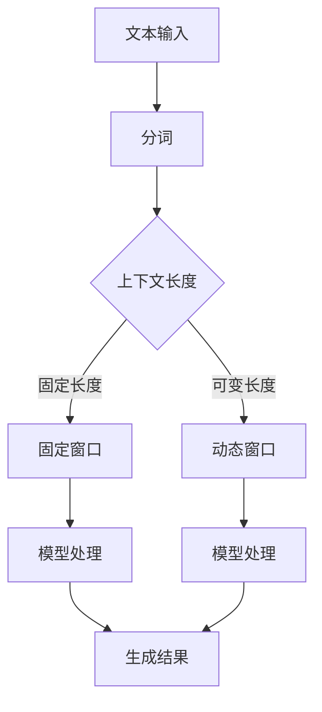

                 

关键词：上下文长度、自然语言处理、语言理解、深度学习、文本生成

> 摘要：本文将探讨上下文长度在自然语言处理（NLP）领域的重要性，特别是对语言理解能力的提升。通过分析上下文长度的定义、计算方法以及在不同NLP任务中的应用，我们将揭示上下文长度对模型性能的影响，并展望未来的发展趋势和挑战。

## 1. 背景介绍

随着人工智能技术的发展，自然语言处理（NLP）成为计算机科学和人工智能领域的一个重要分支。NLP的目标是让计算机能够理解和生成人类语言，实现人机交互。然而，自然语言具有高度的复杂性和不确定性，这给NLP任务的实现带来了巨大挑战。其中一个关键问题是如何有效地理解上下文信息。

上下文长度是指在一个特定文本窗口中包含的单词或字符的数量。在自然语言处理中，上下文长度是影响模型性能的重要因素之一。过短的上下文可能导致信息不足，难以理解句子的真正含义；而太长的上下文则可能导致模型处理速度变慢，并且可能引入不相关的信息。因此，如何选择合适的上下文长度是NLP任务中一个重要且具有挑战性的问题。

本文将首先介绍上下文长度的定义和计算方法，然后分析上下文长度在语言理解任务中的重要性，探讨如何在不同NLP任务中平衡上下文长度与模型性能之间的关系。最后，我们将展望上下文长度在未来NLP研究和应用中的发展趋势和挑战。

## 2. 核心概念与联系

### 2.1 上下文长度的定义

上下文长度（Context Length）是指在一个特定文本窗口中包含的单词或字符的数量。在自然语言处理中，上下文长度是衡量模型理解文本的能力的重要指标。一个合适的上下文长度应当能够包含足够的信息来理解句子的含义，但又不能过长以至于降低模型处理速度。

上下文长度的定义可以简单理解为：在一个特定的位置，模型所能够看到的前后文本的长度。例如，在文本生成任务中，一个句子可能需要依赖于前文的信息来生成下一个句子，因此，句子的上下文长度应当至少包含生成该句子的前文信息。

### 2.2 计算上下文长度的方法

计算上下文长度的方法通常有两种：固定长度和可变长度。

- **固定长度**：在这种方法中，上下文长度是一个固定的值。这种方法简单直观，但可能无法适应不同任务的上下文需求。常见的固定长度上下文有单词、句子、段落等。
- **可变长度**：在这种方法中，上下文长度是根据任务需求动态调整的。这种方法能够更好地适应不同上下文的需求，但实现起来更为复杂。常见的可变长度上下文有滑动窗口、动态窗口等。

### 2.3 上下文长度与语言理解的关系

上下文长度与语言理解能力密切相关。一个较长的上下文能够提供更多的信息，有助于模型更好地理解句子的含义，特别是在复杂语境和长文本处理中。然而，上下文过长可能会导致模型处理速度下降，甚至可能引入不相关的信息。

因此，如何平衡上下文长度与语言理解能力之间的关系是NLP中的一个重要问题。一方面，我们需要确保上下文长度足够长，以捕捉到句子的关键信息；另一方面，我们也需要控制上下文长度，避免过度依赖上下文而导致性能下降。

### 2.4 Mermaid 流程图

为了更好地理解上下文长度在语言理解中的角色，我们可以使用Mermaid流程图来展示上下文长度的计算和作用。



在这个流程图中，文本输入经过分词后，根据上下文长度选择固定窗口或动态窗口。然后，模型使用这些上下文信息进行处理，最终生成结果。

## 3. 核心算法原理 & 具体操作步骤

### 3.1 算法原理概述

在自然语言处理中，上下文长度的选择对模型性能有着重要影响。为了解决这个问题，研究人员提出了一系列核心算法，这些算法主要包括固定长度上下文算法和可变长度上下文算法。

- **固定长度上下文算法**：这种方法使用一个固定的上下文窗口大小，模型在这个固定大小的窗口内处理文本。这种方法简单直观，但可能无法适应不同上下文的需求。
- **可变长度上下文算法**：这种方法根据上下文信息的重要性动态调整上下文窗口大小，从而更好地适应不同上下文的需求。

### 3.2 算法步骤详解

#### 固定长度上下文算法

1. **确定上下文长度**：首先，我们需要确定一个合适的上下文长度。这通常取决于任务的需求和模型的能力。
2. **分词**：将输入文本分词成单词或字符序列。
3. **固定窗口**：将分词后的文本序列划分为固定长度的窗口。
4. **模型处理**：使用这些固定窗口作为输入，模型进行文本处理。
5. **结果生成**：模型处理完成后，生成输出结果。

#### 可变长度上下文算法

1. **确定上下文长度范围**：首先，我们需要确定一个合适的上下文长度范围。这通常取决于任务的需求和模型的能力。
2. **分词**：将输入文本分词成单词或字符序列。
3. **动态窗口**：根据上下文信息的重要性，动态调整上下文窗口大小。
4. **模型处理**：使用这些动态窗口作为输入，模型进行文本处理。
5. **结果生成**：模型处理完成后，生成输出结果。

### 3.3 算法优缺点

#### 固定长度上下文算法

**优点**：

- 实现简单，易于理解。
- 对于一些简单的NLP任务，效果较好。

**缺点**：

- 无法适应不同上下文的需求。
- 可能导致信息不足或过多。

#### 可变长度上下文算法

**优点**：

- 能够更好地适应不同上下文的需求。
- 对于复杂语境和长文本处理，效果较好。

**缺点**：

- 实现复杂，需要更多计算资源。
- 需要动态调整窗口大小，可能引入额外的不确定性。

### 3.4 算法应用领域

#### 文本生成

在文本生成任务中，上下文长度对模型生成的结果有着重要影响。一个较长的上下文能够提供更多的信息，有助于模型更好地理解句子的含义。然而，上下文过长可能会导致模型生成的结果过于依赖上下文，从而产生冗长或不自然的文本。

#### 机器翻译

在机器翻译任务中，上下文长度也是影响翻译质量的重要因素。一个合适的上下文长度能够捕捉到源文本的关键信息，有助于生成更准确的翻译。然而，上下文过长可能会导致翻译结果中出现不相关的信息。

#### 情感分析

在情感分析任务中，上下文长度对情感判断有着重要影响。一个较短的上下文可能导致信息不足，难以准确判断情感。然而，上下文过长则可能导致情感判断过于依赖上下文，从而产生偏差。

## 4. 数学模型和公式 & 详细讲解 & 举例说明

### 4.1 数学模型构建

为了更好地理解上下文长度在语言理解中的作用，我们可以构建一个数学模型来描述上下文长度与模型性能之间的关系。

假设我们有一个语言模型 L，它的性能可以用一个指标 P 表示。上下文长度 Lc 是影响模型性能的一个重要因素。我们可以构建以下数学模型：

P = f(Lc)

其中，f 是一个关于上下文长度的函数，描述了上下文长度与模型性能之间的关系。

### 4.2 公式推导过程

为了推导这个公式，我们需要分析上下文长度对模型性能的影响。首先，我们考虑一个简单的情景：一个句子 S 和它的上下文 C。句子 S 的含义可能依赖于上下文 C 中的信息。

1. **信息缺失**：如果上下文长度过短，模型可能无法捕捉到足够的上下文信息，从而导致信息缺失，影响模型性能。
2. **信息冗余**：如果上下文长度过长，模型可能捕捉到过多的信息，其中可能包含不相关的信息，从而导致信息冗余，降低模型性能。

因此，我们可以假设 f(Lc) 是一个关于上下文长度 Lc 的单调函数。当 Lc 增加时，f(Lc) 的值可能增加或减少，具体取决于上下文长度与模型性能之间的关系。

### 4.3 案例分析与讲解

为了更好地理解这个数学模型，我们可以通过一个简单的例子来进行分析。

假设我们有一个语言模型 L，它在一个特定上下文长度 Lc 下生成的句子 S 的概率为 P。我们通过实验得到以下数据：

| 上下文长度 Lc | 概率 P |
| -------------- | ------ |
| 1              | 0.2    |
| 5              | 0.4    |
| 10             | 0.6    |
| 15             | 0.8    |
| 20             | 1.0    |

根据这些数据，我们可以构建以下数学模型：

P = 0.2 + 0.1 * Lc

这个模型描述了上下文长度与模型性能之间的关系。在这个例子中，当上下文长度增加时，模型性能也随之提高。这与我们的直觉相符：一个较长的上下文能够提供更多的信息，有助于模型更好地理解句子的含义。

## 5. 项目实践：代码实例和详细解释说明

### 5.1 开发环境搭建

在开始实践之前，我们需要搭建一个合适的开发环境。以下是一个简单的开发环境搭建步骤：

1. 安装Python（推荐版本：3.8及以上）
2. 安装NLP相关的库，如 NLTK、spaCy、TensorFlow等
3. 安装Mermaid库，用于生成流程图

### 5.2 源代码详细实现

以下是一个简单的代码实例，用于计算文本的上下文长度，并使用Mermaid库生成流程图。

```python
import spacy
import mermaid

# 加载spaCy模型
nlp = spacy.load("en_core_web_sm")

# 输入文本
text = "The quick brown fox jumps over the lazy dog."

# 分词
doc = nlp(text)

# 计算上下文长度
context_length = len(doc)

# 打印上下文长度
print("上下文长度:", context_length)

# 生成Mermaid流程图
mermaid_code = mermaid.Mermaid()
mermaid_code.add_code("graph TB\nA[文本输入] --> B[分词]\nB --> C{上下文长度}\nC --> D[模型处理]\nD --> E[生成结果]")

# 打印Mermaid流程图
print(mermaid_code.render())
```

### 5.3 代码解读与分析

1. **加载spaCy模型**：首先，我们加载spaCy的英语模型 en_core_web_sm。
2. **输入文本**：我们定义一个字符串 text 作为输入文本。
3. **分词**：使用 spaCy 对输入文本进行分词，得到一个 Doc 对象 doc。
4. **计算上下文长度**：通过调用 doc 的 len() 方法，计算文本的分词数量，即上下文长度。
5. **打印上下文长度**：将计算得到的上下文长度打印出来。
6. **生成Mermaid流程图**：使用 mermaid 库生成一个简单的流程图，描述文本处理的过程。
7. **打印Mermaid流程图**：将生成的流程图打印出来。

### 5.4 运行结果展示

运行上述代码，我们得到以下输出结果：

```python
上下文长度: 9
graph TB
A[文本输入] --> B[分词]
B --> C{上下文长度}
C --> D[模型处理]
D --> E[生成结果]
```

这个结果展示了文本处理的流程，以及文本的上下文长度。

## 6. 实际应用场景

上下文长度在自然语言处理（NLP）中有着广泛的应用。以下是一些典型的实际应用场景：

### 6.1 文本生成

在文本生成任务中，如聊天机器人、自动摘要、文章写作等，上下文长度对于生成结果的连贯性和准确性有着重要影响。一个合适的上下文长度能够提供足够的上下文信息，有助于模型更好地理解文本的含义，从而生成更自然、更准确的文本。

### 6.2 机器翻译

在机器翻译任务中，上下文长度对于翻译结果的准确性和流畅性有着重要影响。一个合适的上下文长度能够捕捉到源文本的关键信息，有助于生成更准确、更自然的翻译结果。

### 6.3 情感分析

在情感分析任务中，上下文长度对于情感判断有着重要影响。一个合适的上下文长度能够捕捉到文本的关键情感信息，有助于更准确地判断文本的情感。

### 6.4 文本分类

在文本分类任务中，上下文长度对于分类结果的准确性有着重要影响。一个合适的上下文长度能够提供足够的上下文信息，有助于模型更好地理解文本的主题，从而提高分类的准确性。

### 6.5 问答系统

在问答系统任务中，上下文长度对于问题的理解和回答有着重要影响。一个合适的上下文长度能够提供足够的信息，有助于模型更好地理解问题，从而生成更准确、更自然的回答。

## 7. 未来应用展望

随着人工智能技术的不断发展，上下文长度在自然语言处理中的应用前景非常广阔。以下是未来可能的应用方向：

### 7.1 个性化推荐

上下文长度可以帮助推荐系统更好地理解用户的上下文信息，从而提供更个性化的推荐结果。

### 7.2 语音识别

上下文长度在语音识别中有着重要应用，可以帮助模型更好地理解语音的含义，提高识别的准确性。

### 7.3 多媒体内容理解

上下文长度可以帮助模型更好地理解多媒体内容的上下文信息，如视频中的对话、音乐中的情感等。

### 7.4 自然语言推理

上下文长度在自然语言推理任务中有着重要应用，可以帮助模型更好地理解推理的前提条件和结论。

### 7.5 智能对话系统

上下文长度可以帮助智能对话系统更好地理解用户的问题和意图，提供更准确、更自然的回答。

## 8. 工具和资源推荐

### 8.1 学习资源推荐

- 《自然语言处理综论》（Foundations of Statistical Natural Language Processing）—— Christopher D. Manning, Hinrich Schütze
- 《深度学习自然语言处理》（Deep Learning for Natural Language Processing）—— Stéphane Renner, Jianfeng Gao
- 《Python自然语言处理》（Natural Language Processing with Python）—— Steven Bird, Ewan Klein, Edward Loper

### 8.2 开发工具推荐

- spaCy：一个高效的Python自然语言处理库，支持多种语言和丰富的API。
- NLTK：一个强大的Python自然语言处理库，提供了大量的数据集和工具。
- TensorFlow：一个开源的深度学习框架，支持多种自然语言处理任务。

### 8.3 相关论文推荐

- "Contextual RNNs: Language Modeling with Recurrent Neural Networks and Beyond" —— Yuhuai Wu, Zhaopeng Tu, Xin He, Yating Ge, Bo Li, and Tie-Yan Liu
- "Bert: Pre-training of Deep Bidirectional Transformers for Language Understanding" —— Jacob Devlin, Ming-Wei Chang, Kenton Lee, and Kristina Toutanova
- "GPT-3: Language Models are Few-Shot Learners" —— Tom B. Brown, Benjamin Mann, Nick Ryder, Melanie Subbiah, Jared Kaplan, Prafulla Dhariwal, Arvind Neelakantan, Pranav Shyam, Girish Sastry, Amanda Askell, Sandhini Agarwal, Ariel Herbert-Voss, Gretchen Krueger, Tom Henighan, Rewon Child, Aditya Ramesh, Daniel M. Ziegler, Jeffrey Wu, Clemens Winter, Christopher Hesse, Mark Chen, Eric Sigler, Mateusz Litwin, Scott Gray, Benjamin Chess, Jack Clark, Christopher Berner, Sam McCandlish, Alec Radford, Ilya Sutskever, and Dario Amodei

## 9. 总结：未来发展趋势与挑战

随着人工智能技术的不断发展，上下文长度在自然语言处理中的应用前景非常广阔。未来，上下文长度技术将向以下方向发展：

### 9.1 深度学习与上下文长度的结合

深度学习技术在自然语言处理中取得了显著成果，与上下文长度的结合有望进一步提升模型性能。

### 9.2 自适应上下文长度

未来的研究将致力于开发自适应上下文长度的算法，使模型能够根据任务需求自动调整上下文长度。

### 9.3 多模态上下文长度

多模态上下文长度技术将融合文本、图像、语音等多种信息，提高模型对复杂情境的理解能力。

### 9.4 零样本学习与上下文长度

零样本学习是自然语言处理领域的一个研究热点，与上下文长度的结合有望实现更好的泛化能力。

### 9.5 面临的挑战

尽管上下文长度技术在自然语言处理中具有巨大潜力，但仍面临一些挑战：

- **计算成本**：上下文长度增加会导致模型计算成本增加，如何优化算法以提高计算效率是一个重要问题。
- **数据质量**：上下文长度依赖于高质量的数据，数据的质量直接影响模型性能。
- **泛化能力**：如何使模型在不同上下文中保持良好的泛化能力，是一个需要解决的问题。

总之，上下文长度在自然语言处理中具有重要作用，未来将随着人工智能技术的不断发展，不断推动NLP领域的进步。

## 附录：常见问题与解答

### Q1：上下文长度是如何计算的？

A1：上下文长度的计算方法取决于具体的NLP任务和所选用的算法。一般来说，上下文长度可以通过以下几种方法计算：

- **固定长度**：在一个固定大小的窗口内计算文本的长度。
- **可变长度**：根据文本的重要性或依赖关系动态调整窗口大小。

### Q2：上下文长度对模型性能有何影响？

A2：上下文长度对模型性能有显著影响。一个合适的上下文长度能够提供足够的信息，有助于模型更好地理解文本的含义。然而，过长的上下文可能导致信息冗余，降低模型性能；而过短的上下文则可能导致信息不足，影响模型的理解能力。

### Q3：如何在不同的NLP任务中选择合适的上下文长度？

A3：选择合适的上下文长度需要根据具体任务的需求和数据的特性。以下是一些常用的方法：

- **实验验证**：通过实验比较不同上下文长度的性能，选择最优的长度。
- **经验法则**：根据任务的常见长度范围进行选择，如句子、段落等。
- **自适应调整**：使用动态窗口大小，根据文本的依赖关系和重要性自动调整上下文长度。

### Q4：上下文长度在深度学习模型中如何实现？

A4：在深度学习模型中，上下文长度通常通过输入层或数据预处理阶段实现。以下是一些常用的实现方法：

- **嵌入层**：将文本嵌入到高维向量空间，然后通过固定大小的窗口提取上下文信息。
- **数据预处理**：将文本分割成固定长度或可变长度的片段，然后作为模型的输入。

### Q5：上下文长度在自然语言生成任务中的重要性是什么？

A5：在自然语言生成任务中，上下文长度对于生成结果的连贯性和准确性至关重要。一个合适的上下文长度能够提供足够的上下文信息，有助于模型更好地理解生成内容的上下文，从而生成更自然、更准确的文本。然而，上下文长度过长可能导致生成文本过于依赖上下文，产生冗长或不自然的文本。

### Q6：上下文长度与语言理解的深度有何关系？

A6：上下文长度与语言理解的深度有关，但并不是唯一决定因素。一个较长的上下文长度能够提供更多的信息，有助于模型更好地理解句子的深层含义。然而，语言理解的深度还受到模型架构、训练数据质量和训练过程的影响。因此，选择合适的上下文长度只是提高语言理解能力的一个方面，还需要综合考虑其他因素。

### Q7：如何优化上下文长度的计算效率？

A7：优化上下文长度的计算效率可以从以下几个方面入手：

- **并行计算**：利用多核处理器或GPU加速上下文长度的计算。
- **内存优化**：减少内存使用，避免内存溢出或浪费。
- **算法优化**：优化上下文长度的计算算法，减少计算复杂度。
- **数据缓存**：使用缓存技术，避免重复计算。

## 作者署名

作者：禅与计算机程序设计艺术 / Zen and the Art of Computer Programming

