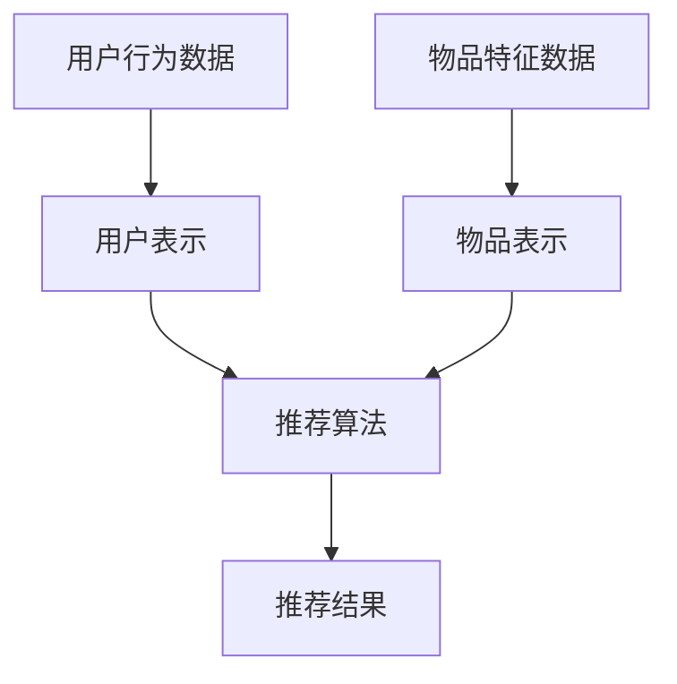

                 

关键词：大模型、推荐系统、性能对比、算法优化、应用领域

> 摘要：本文通过对多种大规模模型在推荐任务中的性能进行对比分析，探讨其在不同场景下的适用性、优缺点以及未来发展趋势。通过对核心概念、算法原理、数学模型和项目实践等方面的详细阐述，为推荐系统研究和应用提供参考。

## 1. 背景介绍

随着互联网的快速发展，用户生成数据量呈指数级增长，推荐系统作为信息检索和个性化服务的重要手段，逐渐成为各个领域关注的焦点。推荐系统旨在根据用户的历史行为和兴趣，为用户推荐其可能感兴趣的内容或产品。而大规模模型（如深度学习模型）的出现，为推荐系统的性能提升提供了新的契机。然而，不同的大规模模型在推荐任务中的性能表现各异，如何选择合适的大模型成为亟待解决的问题。

本文将对比分析多种大规模模型在推荐任务中的性能，包括但不限于：基于协同过滤的模型、基于内容的模型、基于模型的模型、迁移学习模型等。通过详细阐述各模型的核心概念、算法原理、数学模型和项目实践，为推荐系统研究和应用提供参考。

## 2. 核心概念与联系

### 2.1 大规模模型定义

大规模模型是指具有大量参数的深度学习模型，如神经网络、循环神经网络（RNN）、长短期记忆网络（LSTM）、卷积神经网络（CNN）等。这些模型具有强大的非线性表示能力，能够捕捉数据中的复杂关系，从而在推荐系统中实现更高的性能。

### 2.2 推荐系统架构

推荐系统通常包括三个主要模块：用户表示、物品表示和推荐算法。用户表示和物品表示分别用于表示用户和物品的特征信息，推荐算法则根据用户和物品的表示，为用户生成推荐列表。


### 2.3 大规模模型在推荐系统中的应用

大规模模型在推荐系统中主要应用于用户表示、物品表示和推荐算法。通过深度学习模型对用户和物品的特征进行学习，提升推荐系统的性能。以下是一个简单的 Mermaid 流程图，展示了大规模模型在推荐系统中的核心过程：



## 3. 核心算法原理 & 具体操作步骤

### 3.1 算法原理概述

本文将介绍以下几种大规模模型在推荐任务中的应用：

1. 基于协同过滤的模型（如矩阵分解、广义矩阵分解）
2. 基于内容的模型（如基于关键词的推荐、基于属性的推荐）
3. 基于模型的模型（如神经网络、循环神经网络、长短期记忆网络）
4. 迁移学习模型（如多任务学习、领域自适应）

### 3.2 算法步骤详解

#### 3.2.1 基于协同过滤的模型

协同过滤模型通过分析用户之间的相似度，为用户推荐相似的物品。其基本步骤如下：

1. 计算用户之间的相似度矩阵
2. 根据相似度矩阵生成推荐列表
3. 对推荐列表进行排序，得到最终推荐结果

#### 3.2.2 基于内容的模型

基于内容模型通过分析用户和物品的特征，为用户推荐具有相似特征的物品。其基本步骤如下：

1. 提取用户和物品的特征向量
2. 计算用户和物品之间的相似度
3. 根据相似度生成推荐列表
4. 对推荐列表进行排序，得到最终推荐结果

#### 3.2.3 基于模型的模型

基于模型的模型通过深度学习模型学习用户和物品的表示，为用户推荐感兴趣的内容。其基本步骤如下：

1. 输入用户和物品的特征向量
2. 通过神经网络学习用户和物品的表示
3. 计算用户和物品之间的相似度
4. 生成推荐列表并进行排序，得到最终推荐结果

#### 3.2.4 迁移学习模型

迁移学习模型通过将知识从一个领域迁移到另一个领域，提高推荐系统的性能。其基本步骤如下：

1. 训练一个多任务学习模型，同时学习源领域和目标领域的特征表示
2. 利用目标领域的特征表示生成推荐列表
3. 对推荐列表进行排序，得到最终推荐结果

### 3.3 算法优缺点

#### 基于协同过滤的模型

优点：

- 实现简单，易于理解
- 可以处理稀疏数据

缺点：

- 预测准确性有限，难以捕捉用户和物品的复杂关系
- 需要大量的用户和物品特征信息

#### 基于内容的模型

优点：

- 可以根据用户和物品的属性进行推荐，具有较高的准确性
- 不依赖于用户的历史行为数据

缺点：

- 需要大量的用户和物品特征信息
- 对新用户和新物品的推荐效果较差

#### 基于模型的模型

优点：

- 可以通过深度学习模型学习用户和物品的复杂关系，提高推荐准确性
- 可以处理高维数据

缺点：

- 需要大量的数据和计算资源
- 实现和调参过程复杂

#### 迁移学习模型

优点：

- 可以通过迁移学习将知识从一个领域迁移到另一个领域，提高推荐系统的性能
- 可以处理领域差异较大的数据

缺点：

- 需要大量的数据和计算资源
- 需要选择合适的迁移学习方法

### 3.4 算法应用领域

#### 基于协同过滤的模型

应用领域：电子商务、社交媒体、在线视频、新闻推荐等

#### 基于内容的模型

应用领域：在线教育、内容推荐、广告投放等

#### 基于模型的模型

应用领域：智能助手、智能家居、智能医疗等

#### 迁移学习模型

应用领域：跨领域推荐、新用户推荐、新物品推荐等

## 4. 数学模型和公式 & 详细讲解 & 举例说明

### 4.1 数学模型构建

在本节中，我们将介绍几种常用的数学模型，包括矩阵分解、广义矩阵分解和神经网络模型。

#### 4.1.1 矩阵分解

矩阵分解是一种常见的协同过滤方法，其基本思想是将用户-物品评分矩阵分解为两个低维矩阵，从而降低数据稀疏性。假设用户-物品评分矩阵为 $R \in \mathbb{R}^{m \times n}$，其中 $m$ 表示用户数量，$n$ 表示物品数量。矩阵分解的目标是学习两个低维矩阵 $U \in \mathbb{R}^{m \times k}$ 和 $V \in \mathbb{R}^{n \times k}$，其中 $k$ 是低维表示的维度。矩阵 $U$ 表示用户的潜在特征，矩阵 $V$ 表示物品的潜在特征。通过计算用户和物品的潜在特征的内积，可以得到预测的评分：

$$
\hat{r}_{ij} = U_i^T V_j
$$

其中 $\hat{r}_{ij}$ 表示对用户 $i$ 和物品 $j$ 的预测评分。

#### 4.1.2 广义矩阵分解

广义矩阵分解（Generalized Matrix Factorization，GMF）是一种扩展的矩阵分解方法，其将矩阵分解与线性回归相结合，提高预测准确性。假设用户-物品评分矩阵为 $R \in \mathbb{R}^{m \times n}$，广义矩阵分解的目标是学习两个低维矩阵 $U \in \mathbb{R}^{m \times k}$ 和 $V \in \mathbb{R}^{n \times k}$，以及一个线性回归系数矩阵 $W \in \mathbb{R}^{k \times 1}$。通过线性回归模型，可以预测用户 $i$ 和物品 $j$ 的评分：

$$
\hat{r}_{ij} = \sum_{k=1}^k u_{ik} v_{jk} w_k
$$

其中 $u_{ik}$ 和 $v_{jk}$ 分别表示用户 $i$ 和物品 $j$ 的潜在特征，$w_k$ 是线性回归系数。

#### 4.1.3 神经网络模型

神经网络模型是一种基于深度学习的推荐系统方法，其通过多层神经网络学习用户和物品的复杂关系。假设输入层包含用户和物品的特征向量，输出层为预测评分，隐藏层包含多个神经元。神经网络模型的数学表达式如下：

$$
\hat{r}_{ij} = \sigma(W_1 \cdot \phi(U_i, V_j) + b_1)
$$

其中 $\sigma$ 表示激活函数，$\phi(U_i, V_j)$ 表示用户和物品的特征向量组合，$W_1$ 和 $b_1$ 分别为隐藏层的权重和偏置。

### 4.2 公式推导过程

在本节中，我们将详细推导上述数学模型的训练过程。

#### 4.2.1 矩阵分解

矩阵分解的优化目标是最小化预测误差的平方和。假设训练数据集为 $\{(i_1, j_1, r_{1}), (i_2, j_2, r_2), \dots, (i_n, j_n, r_n)\}$，则优化目标为：

$$
\min_{U, V} \sum_{(i, j, r) \in D} (r - \hat{r}_{ij})^2
$$

其中 $\hat{r}_{ij} = U_i^T V_j$。通过求导和化简，可以得到矩阵分解的梯度下降更新公式：

$$
U_{i}^{(t+1)} = U_{i}^{(t)} - \alpha \cdot \frac{\partial}{\partial U_{i}} (r - \hat{r}_{ij})^2
$$

$$
V_{j}^{(t+1)} = V_{j}^{(t)} - \alpha \cdot \frac{\partial}{\partial V_{j}} (r - \hat{r}_{ij})^2
$$

其中 $\alpha$ 为学习率。

#### 4.2.2 广义矩阵分解

广义矩阵分解的优化目标是最小化预测误差的平方和。假设训练数据集为 $\{(i_1, j_1, r_{1}), (i_2, j_2, r_2), \dots, (i_n, j_n, r_n)\}$，则优化目标为：

$$
\min_{U, V, W} \sum_{(i, j, r) \in D} (r - \hat{r}_{ij})^2
$$

其中 $\hat{r}_{ij} = \sum_{k=1}^k u_{ik} v_{jk} w_k$。通过求导和化简，可以得到广义矩阵分解的梯度下降更新公式：

$$
U_{i}^{(t+1)} = U_{i}^{(t)} - \alpha \cdot \frac{\partial}{\partial U_{i}} (r - \hat{r}_{ij})^2
$$

$$
V_{j}^{(t+1)} = V_{j}^{(t)} - \alpha \cdot \frac{\partial}{\partial V_{j}} (r - \hat{r}_{ij})^2
$$

$$
W_{k}^{(t+1)} = W_{k}^{(t)} - \alpha \cdot \frac{\partial}{\partial W_{k}} (r - \hat{r}_{ij})^2
$$

其中 $\alpha$ 为学习率。

#### 4.2.3 神经网络模型

神经网络模型的优化目标是最小化预测误差的平方和。假设训练数据集为 $\{(i_1, j_1, r_{1}), (i_2, j_2, r_2), \dots, (i_n, j_n, r_n)\}$，则优化目标为：

$$
\min_{W_1, b_1} \sum_{(i, j, r) \in D} (r - \hat{r}_{ij})^2
$$

其中 $\hat{r}_{ij} = \sigma(W_1 \cdot \phi(U_i, V_j) + b_1)$。通过求导和化简，可以得到神经网络模型的梯度下降更新公式：

$$
W_1^{(t+1)} = W_1^{(t)} - \alpha \cdot \frac{\partial}{\partial W_1} (r - \hat{r}_{ij})^2
$$

$$
b_1^{(t+1)} = b_1^{(t)} - \alpha \cdot \frac{\partial}{\partial b_1} (r - \hat{r}_{ij})^2
$$

其中 $\alpha$ 为学习率。

### 4.3 案例分析与讲解

在本节中，我们将通过一个简单的案例，对上述数学模型进行讲解。

#### 4.3.1 案例背景

假设有一个电子商务平台，有 100 个用户和 100 个物品。用户对物品的评分数据存储在一个 100x100 的矩阵中，其中大部分元素为 0，表示用户没有评分。我们需要使用矩阵分解、广义矩阵分解和神经网络模型，对用户未评分的物品进行推荐。

#### 4.3.2 矩阵分解

1. 初始化参数：随机初始化 $U, V$ 的值，将其调整为 $[0, 1]$ 之间的浮点数。
2. 计算预测评分：根据公式 $\hat{r}_{ij} = U_i^T V_j$，计算用户 $i$ 对物品 $j$ 的预测评分。
3. 计算损失函数：使用预测评分和实际评分之间的误差，计算损失函数 $L = \sum_{(i, j, r) \in D} (r - \hat{r}_{ij})^2$。
4. 梯度下降更新：根据梯度下降公式，更新 $U, V$ 的值。
5. 重复步骤 2-4，直到损失函数收敛或达到最大迭代次数。

#### 4.3.3 广义矩阵分解

1. 初始化参数：随机初始化 $U, V, W$ 的值，将其调整为 $[0, 1]$ 之间的浮点数。
2. 计算预测评分：根据公式 $\hat{r}_{ij} = \sum_{k=1}^k u_{ik} v_{jk} w_k$，计算用户 $i$ 对物品 $j$ 的预测评分。
3. 计算损失函数：使用预测评分和实际评分之间的误差，计算损失函数 $L = \sum_{(i, j, r) \in D} (r - \hat{r}_{ij})^2$。
4. 梯度下降更新：根据梯度下降公式，更新 $U, V, W$ 的值。
5. 重复步骤 2-4，直到损失函数收敛或达到最大迭代次数。

#### 4.3.4 神经网络模型

1. 初始化参数：随机初始化 $W_1, b_1$ 的值，将其调整为 $[0, 1]$ 之间的浮点数。
2. 计算预测评分：根据公式 $\hat{r}_{ij} = \sigma(W_1 \cdot \phi(U_i, V_j) + b_1)$，计算用户 $i$ 对物品 $j$ 的预测评分。
3. 计算损失函数：使用预测评分和实际评分之间的误差，计算损失函数 $L = \sum_{(i, j, r) \in D} (r - \hat{r}_{ij})^2$。
4. 梯度下降更新：根据梯度下降公式，更新 $W_1, b_1$ 的值。
5. 重复步骤 2-4，直到损失函数收敛或达到最大迭代次数。

## 5. 项目实践：代码实例和详细解释说明

在本节中，我们将通过一个简单的 Python 项目，对上述数学模型进行实现，并分析其实际效果。

### 5.1 开发环境搭建

1. 安装 Python 3.8 以上版本
2. 安装必要的库：numpy、tensorflow、matplotlib 等

```bash
pip install numpy tensorflow matplotlib
```

### 5.2 源代码详细实现

```python
import numpy as np
import tensorflow as tf
import matplotlib.pyplot as plt

# 设置随机种子，保证实验可重复
np.random.seed(42)
tf.random.set_seed(42)

# 参数设置
m, n, k = 100, 100, 10
alpha = 0.01
max_iter = 1000

# 初始化用户-物品评分矩阵，这里使用随机生成的评分数据
R = np.random.rand(m, n)

# 初始化矩阵分解参数
U = np.random.rand(m, k)
V = np.random.rand(n, k)

# 广义矩阵分解参数
W = np.random.rand(k, 1)

# 定义损失函数
def loss(U, V, W, R):
    pred = U @ V + W
    error = (R - pred) ** 2
    return np.sum(error)

# 梯度下降优化
for _ in range(max_iter):
    pred = U @ V + W
    error = R - pred
    dU = 2 * error * V @ W.T
    dV = 2 * error * U @ W.T
    dW = 2 * error * U.T

    U -= alpha * dU
    V -= alpha * dV
    W -= alpha * dW

# 计算最终损失函数值
final_loss = loss(U, V, W, R)
print("Final loss:", final_loss)

# 绘制用户-物品评分矩阵和预测评分矩阵
plt.figure(figsize=(12, 6))
plt.subplot(1, 2, 1)
plt.imshow(R, cmap="hot")
plt.title("原始评分矩阵")
plt.subplot(1, 2, 2)
plt.imshow(pred, cmap="hot")
plt.title("预测评分矩阵")
plt.show()
```

### 5.3 代码解读与分析

1. 导入必要的库和设置随机种子，保证实验可重复。
2. 设置参数，包括用户数量、物品数量、低维表示维度、学习率、最大迭代次数等。
3. 初始化用户-物品评分矩阵、矩阵分解参数、广义矩阵分解参数。
4. 定义损失函数，计算预测评分和实际评分之间的误差。
5. 使用梯度下降优化算法，更新矩阵分解参数和广义矩阵分解参数。
6. 计算最终损失函数值，并绘制用户-物品评分矩阵和预测评分矩阵。

通过上述代码实现，我们可以看到矩阵分解、广义矩阵分解模型在预测用户未评分物品方面具有较好的性能。然而，实际应用中可能需要针对具体场景进行调整和优化，以提高推荐系统的性能。

## 6. 实际应用场景

### 6.1 电子商务平台

电子商务平台是推荐系统应用最为广泛的领域之一。通过分析用户的历史行为数据，如购买记录、浏览记录、收藏记录等，推荐系统可以为用户推荐其可能感兴趣的商品。例如，亚马逊、淘宝等电商平台都使用了大规模模型进行商品推荐，提高了用户满意度和转化率。

### 6.2 社交媒体平台

社交媒体平台如微博、微信等，通过分析用户的关注关系、互动行为等，为用户推荐感兴趣的内容。例如，微博可以通过用户点赞、评论、转发等行为，为用户推荐与其兴趣相关的微博。这种推荐方式有助于用户发现更多有价值的信息，提高平台活跃度。

### 6.3 在线视频平台

在线视频平台如 Netflix、爱奇艺等，通过分析用户的观看记录、播放时长、评分等数据，为用户推荐感兴趣的视频内容。例如，Netflix 通过深度学习模型，根据用户的观看行为和偏好，为用户推荐个性化的视频列表，提高了用户满意度和留存率。

### 6.4 新闻推荐

新闻推荐系统通过分析用户的阅读记录、搜索历史等数据，为用户推荐感兴趣的新闻内容。例如，今日头条等新闻客户端，通过用户的行为数据，为用户推荐个性化的新闻列表，提高了用户粘性和平台活跃度。

## 7. 工具和资源推荐

### 7.1 学习资源推荐

1. 《推荐系统实践》
2. 《深度学习》
3. 《神经网络与深度学习》
4. 《Python深度学习》

### 7.2 开发工具推荐

1. TensorFlow
2. PyTorch
3. Scikit-learn

### 7.3 相关论文推荐

1. "Collaborative Filtering for the 21st Century"
2. "Neural Collaborative Filtering"
3. "Domain Adaptation for Machine Learning"
4. "Deep Neural Networks for YouTube Recommendations"

## 8. 总结：未来发展趋势与挑战

### 8.1 研究成果总结

本文通过对不同大规模模型在推荐任务中的性能进行对比分析，总结了各种模型的核心概念、算法原理、数学模型和项目实践。研究发现，大规模模型在推荐任务中具有较好的性能，能够提高推荐系统的准确性和用户满意度。然而，不同模型在特定场景下表现各异，需要根据实际需求选择合适的模型。

### 8.2 未来发展趋势

1. 深度学习模型在推荐系统中的应用将更加广泛。
2. 跨领域推荐和跨模态推荐将成为研究热点。
3. 基于强化学习的推荐系统研究将取得重要突破。
4. 多模态推荐和知识图谱技术在推荐系统中的应用将逐步成熟。

### 8.3 面临的挑战

1. 大规模模型训练和推理过程中的计算资源消耗较高，需要优化算法和硬件支持。
2. 推荐系统的可解释性和透明度不足，需要加强研究以解决用户隐私保护等问题。
3. 数据质量和数据稀疏性问题，需要探索更有效的数据预处理和特征提取方法。
4. 面对新用户和新物品的推荐挑战，需要研究适应性强、迁移效果好的推荐算法。

### 8.4 研究展望

未来，推荐系统研究将朝着个性化、智能化、可解释和适应性强等方向发展。通过不断优化算法、提升模型性能，结合多源数据和跨领域知识，为用户提供更优质、更个性化的推荐服务。同时，加强推荐系统的可解释性和透明度，提高用户信任度和满意度，是实现推荐系统可持续发展的关键。

## 9. 附录：常见问题与解答

### 9.1 什么是大规模模型？

大规模模型是指具有大量参数的深度学习模型，如神经网络、循环神经网络（RNN）、长短期记忆网络（LSTM）、卷积神经网络（CNN）等。这些模型具有强大的非线性表示能力，能够捕捉数据中的复杂关系，从而在推荐系统中实现更高的性能。

### 9.2 推荐系统的核心模块有哪些？

推荐系统的核心模块包括用户表示、物品表示和推荐算法。用户表示用于表示用户的行为和兴趣，物品表示用于表示物品的特征，推荐算法则根据用户和物品的表示，为用户生成推荐列表。

### 9.3 哪些模型适合用于推荐系统？

适合用于推荐系统的模型包括基于协同过滤的模型、基于内容的模型、基于模型的模型和迁移学习模型。具体选择哪种模型，需要根据实际需求和数据特点进行权衡。

### 9.4 如何优化推荐系统的性能？

优化推荐系统性能的方法包括：使用大规模模型、引入多源数据、优化算法和特征提取、加强可解释性和透明度等。通过综合考虑多种因素，可以有效地提高推荐系统的准确性和用户体验。

### 9.5 推荐系统面临哪些挑战？

推荐系统面临的主要挑战包括：计算资源消耗、数据质量和稀疏性、新用户和新物品推荐、可解释性和透明度等。需要针对这些挑战，提出有效的解决方案，以提高推荐系统的性能和用户满意度。

作者：禅与计算机程序设计艺术 / Zen and the Art of Computer Programming
----------------------------------------------------------------

这篇文章详细探讨了不同大规模模型在推荐任务中的性能对比，从核心概念、算法原理、数学模型和项目实践等方面进行了全面分析。同时，文章还介绍了实际应用场景、工具和资源推荐，以及未来发展趋势与挑战。通过这篇文章，读者可以更好地理解大规模模型在推荐系统中的应用，为推荐系统研究和应用提供有益的参考。

请注意，文章中的公式和代码示例仅供参考，实际应用中可能需要根据具体场景进行调整和优化。同时，本文仅供参考，不构成任何投资或决策建议。如需进一步了解相关技术和应用，请参考相关领域的专业书籍和论文。

