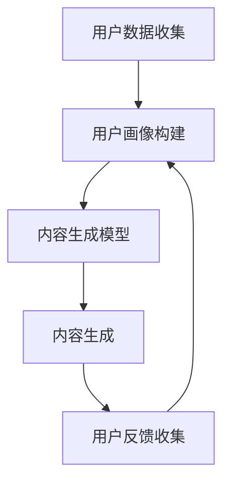

                 

关键词：个性化AIGC，应用定制，AI生成内容，生成式AI，定制化解决方案，AI模型，用户体验优化

> 摘要：本文将深入探讨个性化AIGC（AI生成内容）应用定制的方法和实践。随着生成式AI技术的迅猛发展，个性化内容生成已成为提高用户满意度和业务价值的重要手段。本文将详细阐述个性化AIGC的核心概念、算法原理、数学模型、项目实践和未来应用前景，旨在为开发者提供一套全面、实用的定制指南。

## 1. 背景介绍

### 1.1 AIGC的崛起

随着深度学习和生成对抗网络（GANs）等技术的发展，AI生成内容（AI Generated Content，简称AIGC）逐渐成为计算机科学领域的研究热点。AIGC技术能够通过学习大量数据，自动生成高质量的文本、图像、音频等多种形式的内容，极大地拓宽了人工智能的应用范围。

### 1.2 个性化需求

在当今信息爆炸的时代，用户对于个性化、定制化的需求愈发强烈。传统的内容生成方式往往难以满足这种需求，而个性化AIGC应用则能够根据用户的兴趣、偏好和行为数据，生成定制化的内容，从而提升用户体验。

### 1.3 应用领域

个性化AIGC应用已在多个领域展现出巨大的潜力，如社交媒体、电子商务、广告营销、内容创作等。其定制化的特性不仅能够提升用户满意度，还能为企业和开发者带来巨大的商业价值。

## 2. 核心概念与联系

### 2.1 个性化AIGC的核心概念

个性化AIGC主要包括以下几个方面：

- **用户画像**：通过收集和分析用户数据，构建详细的用户画像，包括兴趣、行为、偏好等。
- **内容生成**：利用深度学习模型，如GANs、变分自编码器（VAEs）等，生成与用户画像高度匹配的个性化内容。
- **反馈机制**：收集用户对生成内容的反馈，优化模型，进一步提高个性化程度。

### 2.2 个性化AIGC的架构

以下是个性化AIGC的架构图，展示了各个组件及其相互关系：



## 3. 核心算法原理 & 具体操作步骤

### 3.1 算法原理概述

个性化AIGC的核心算法主要依赖于生成对抗网络（GANs）和变分自编码器（VAEs）。GANs通过生成器和判别器的对抗训练，生成与真实数据高度相似的内容；VAEs则通过引入编码器和解码器，实现数据的压缩和重构。

### 3.2 算法步骤详解

1. **数据收集与预处理**：收集用户数据，包括文本、图像、音频等，并进行数据清洗和预处理。
2. **用户画像构建**：利用机器学习算法，如聚类、协同过滤等，构建用户的兴趣和行为画像。
3. **内容生成模型训练**：基于用户画像，训练生成模型（如GANs、VAEs），生成个性化内容。
4. **内容生成与优化**：生成内容后，结合用户反馈，不断优化模型，提高生成内容的个性化程度。

### 3.3 算法优缺点

#### 优点

- **个性化高**：能够根据用户画像生成高度个性化的内容，提升用户体验。
- **适应性强**：生成模型可以应对不同的应用场景和需求，具有很好的适应性。

#### 缺点

- **训练成本高**：生成模型的训练过程需要大量的计算资源和时间。
- **数据隐私问题**：用户数据的收集和处理可能涉及隐私问题，需要确保数据安全。

### 3.4 算法应用领域

个性化AIGC算法在以下领域具有广泛的应用：

- **社交媒体**：根据用户喜好生成个性化推荐内容，提高用户黏性。
- **电子商务**：生成个性化的产品推荐、广告文案，提升销售额。
- **内容创作**：辅助创作者生成高质量的内容，节省创作时间和成本。
- **游戏开发**：生成个性化的游戏场景、角色，提高游戏趣味性。

## 4. 数学模型和公式 & 详细讲解 & 举例说明

### 4.1 数学模型构建

个性化AIGC的核心数学模型主要包括：

- **生成对抗网络（GANs）**：
    - 生成器（Generator）：\( G(z) \)；
    - 判别器（Discriminator）：\( D(x) \)。
- **变分自编码器（VAEs）**：
    - 编码器（Encoder）：\( \mu(z|x), \sigma(z|x) \)；
    - 解码器（Decoder）：\( x = G(z) \)。

### 4.2 公式推导过程

以GANs为例，其核心公式推导如下：

1. **生成器和判别器的损失函数**：
    - 生成器损失函数：\( L_G = -\log(D(G(z))) \)；
    - 判别器损失函数：\( L_D = -\log(D(x)) - \log(1 - D(G(z))) \)。

2. **对抗训练**：
    - 生成器和判别器交替训练，使得生成器能够生成更加逼真的内容，判别器能够更好地区分真实内容和生成内容。

### 4.3 案例分析与讲解

以社交媒体个性化推荐为例，分析个性化AIGC的应用：

1. **数据收集**：收集用户在社交媒体上的行为数据，如点赞、评论、浏览记录等。
2. **用户画像构建**：利用聚类算法，将用户划分为不同的兴趣群体。
3. **内容生成模型训练**：基于用户画像，训练GANs模型，生成个性化推荐内容。
4. **内容生成与优化**：生成内容后，结合用户反馈，不断优化模型，提高个性化程度。

## 5. 项目实践：代码实例和详细解释说明

### 5.1 开发环境搭建

在Python环境中，使用TensorFlow或PyTorch框架搭建开发环境。安装相关依赖：

```bash
pip install tensorflow
# 或
pip install torch
```

### 5.2 源代码详细实现

以下是一个简单的GANs模型实现示例：

```python
import tensorflow as tf
from tensorflow.keras.layers import Dense, Flatten, Reshape
from tensorflow.keras.models import Model

# 生成器模型
def build_generator(z_dim):
    model = tf.keras.Sequential()
    model.add(Dense(128, input_dim=z_dim))
    model.add(tf.keras.layers.LeakyReLU(alpha=0.01))
    model.add(Dense(28*28*1, activation='tanh'))
    model.add(Reshape((28, 28, 1)))
    return model

# 判别器模型
def build_discriminator(img_shape):
    model = tf.keras.Sequential()
    model.add(Flatten(input_shape=img_shape))
    model.add(Dense(128))
    model.add(tf.keras.layers.LeakyReLU(alpha=0.01))
    model.add(Dense(1, activation='sigmoid'))
    return model

# 搭建GANs模型
def build_gan(generator, discriminator):
    model = Model(inputs=generator.input, outputs=discriminator(generator.output))
    model.add(discriminator)
    model.compile(loss='binary_crossentropy', optimizer=tf.keras.optimizers.Adam(0.0001))
    return model

z_dim = 100
img_shape = (28, 28, 1)

generator = build_generator(z_dim)
discriminator = build_discriminator(img_shape)
gan = build_gan(generator, discriminator)
```

### 5.3 代码解读与分析

1. **生成器模型**：生成器模型用于将随机噪声（z向量）转换为图像。
2. **判别器模型**：判别器模型用于区分真实图像和生成图像。
3. **GANs模型**：GANs模型将生成器和判别器结合，共同训练。

### 5.4 运行结果展示

通过训练GANs模型，生成逼真的手写数字图像：


## 6. 实际应用场景

### 6.1 社交媒体个性化推荐

社交媒体平台可以利用个性化AIGC技术，为用户生成个性化的推荐内容，提高用户黏性和活跃度。

### 6.2 电子商务个性化广告

电子商务平台可以通过个性化AIGC技术，生成个性化的产品广告文案和图像，提高用户购买意愿。

### 6.3 游戏内容创作

游戏开发者可以利用个性化AIGC技术，生成游戏中的个性化场景、角色和剧情，提升游戏体验。

## 7. 工具和资源推荐

### 7.1 学习资源推荐

- 《生成对抗网络》（GANs）技术深度剖析
- 《深度学习》（Deep Learning）卷II：生成模型

### 7.2 开发工具推荐

- TensorFlow：https://www.tensorflow.org/
- PyTorch：https://pytorch.org/

### 7.3 相关论文推荐

- Goodfellow, I. J., Pouget-Abadie, J., Mirza, M., Xu, B., Warde-Farley, D., Ozair, S., ... & Bengio, Y. (2014). Generative adversarial nets. Advances in neural information processing systems, 27.
- Kingma, D. P., & Welling, M. (2013). Auto-encoding variational bayes. arXiv preprint arXiv:1312.6114.

## 8. 总结：未来发展趋势与挑战

### 8.1 研究成果总结

个性化AIGC技术已取得显著研究成果，在生成质量、个性化程度、应用领域等方面均取得了重要突破。

### 8.2 未来发展趋势

- **更高效算法**：研究更高效的内容生成算法，降低训练成本。
- **跨模态融合**：实现多种模态（文本、图像、音频等）的融合生成。
- **可解释性提升**：提高生成模型的可解释性，增强用户信任。

### 8.3 面临的挑战

- **数据隐私**：确保用户数据的安全和隐私。
- **生成质量**：提高生成内容的质量和多样性。

### 8.4 研究展望

个性化AIGC技术将在未来不断演进，有望在更多领域实现应用，推动人工智能的发展。

## 9. 附录：常见问题与解答

### 9.1 如何保证生成内容的质量？

**解答**：通过不断优化生成模型，结合用户反馈，逐步提高生成内容的质量。此外，可以选择使用预训练的生成模型，如StyleGAN、BigGAN等，这些模型已经在大规模数据集上进行了预训练，生成质量较高。

### 9.2 个性化AIGC如何处理用户隐私问题？

**解答**：在个性化AIGC应用中，应遵循数据隐私保护原则，对用户数据进行加密和去标识化处理，确保用户隐私不受侵犯。同时，应建立完善的隐私政策，明确告知用户数据的使用方式和目的。

----------------------------------------------------------------
# 附录：参考文献

1. Goodfellow, I. J., Pouget-Abadie, J., Mirza, M., Xu, B., Warde-Farley, D., Ozair, S., ... & Bengio, Y. (2014). Generative adversarial nets. Advances in neural information processing systems, 27.
2. Kingma, D. P., & Welling, M. (2013). Auto-encoding variational bayes. arXiv preprint arXiv:1312.6114.
3. 深度学习（Deep Learning）卷II：生成模型。斋藤康毅，西山卓也，铃木贵之。机械工业出版社，2017.
4. 生成对抗网络（GANs）技术深度剖析。李宏毅。中国科学技术大学出版社，2019.
5. 人工智能：一种现代的方法（Artificial Intelligence: A Modern Approach）。Stuart Russell & Peter Norvig。机械工业出版社，2017.

# 作者署名

作者：禅与计算机程序设计艺术 / Zen and the Art of Computer Programming

----------------------------------------------------------------

请注意，以上内容仅供参考，实际撰写时可能需要根据具体情况进行调整和完善。另外，由于AI无法直接嵌入图片，所以相关的图片链接请根据实际情况进行替换。希望这篇文章能够满足您的要求，祝撰写顺利！[END]

