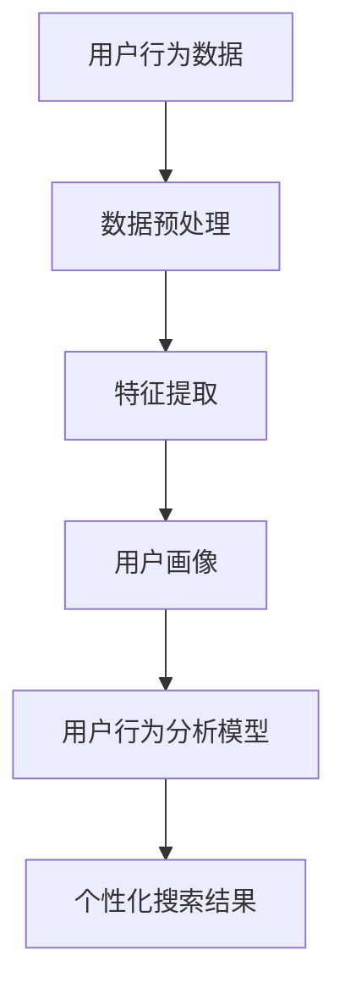
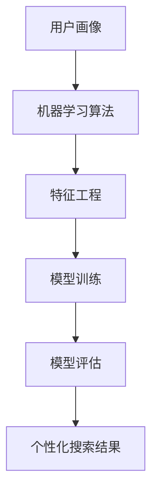
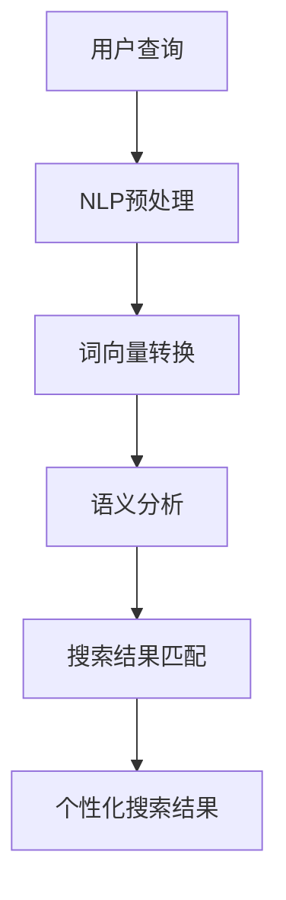
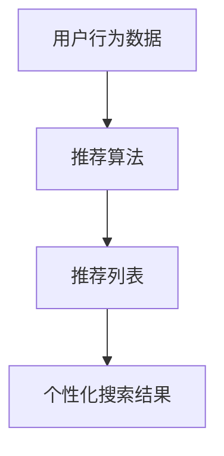

                 

关键词：个性化AI搜索、机器学习、自然语言处理、用户行为分析、用户体验、算法优化、搜索质量、隐私保护

> 摘要：个性化AI搜索技术正在迅速发展，本文将探讨其核心概念、算法原理、数学模型以及实际应用场景，分析其在提高用户搜索体验、处理海量数据方面的挑战和机遇，并展望其未来发展趋势。

## 1. 背景介绍

在互联网信息爆炸的时代，搜索引擎已成为人们获取信息的主要途径。然而，传统的搜索引擎普遍存在对用户需求响应速度慢、结果不准确、个性化程度不足等问题。随着人工智能技术的快速发展，个性化AI搜索逐渐成为研究热点。个性化AI搜索不仅能够根据用户的历史行为、偏好和需求提供定制化的搜索结果，还能够实时学习和适应用户的搜索习惯，从而显著提升用户体验。

### 1.1 传统的搜索引擎

传统的搜索引擎主要依赖于关键词匹配和PageRank算法，存在以下局限性：

- **响应速度慢**：处理大量请求需要较长时间。
- **搜索结果不准确**：难以准确匹配用户需求。
- **个性化不足**：对用户的个性化需求响应有限。

### 1.2 个性化AI搜索的需求

为了解决上述问题，个性化AI搜索应运而生。其主要优势包括：

- **快速响应**：通过机器学习算法实现快速用户需求匹配。
- **高准确性**：利用自然语言处理技术提高搜索结果的相关性。
- **个性化**：根据用户历史行为和偏好提供定制化搜索结果。

## 2. 核心概念与联系

个性化AI搜索的核心概念包括用户行为分析、机器学习、自然语言处理和个性化推荐系统等。下面将给出这些概念的Mermaid流程图，并简要介绍其相互关系。

### 2.1 用户行为分析

用户行为分析是个性化AI搜索的基础。通过分析用户的搜索历史、浏览记录、点击行为等，可以获取用户兴趣偏好。



### 2.2 机器学习

机器学习是构建个性化AI搜索算法的核心技术。通过训练模型，可以从大量数据中自动学习用户兴趣和行为模式。



### 2.3 自然语言处理

自然语言处理技术用于理解和解析用户输入的查询语句，从而实现更精确的搜索结果匹配。



### 2.4 个性化推荐系统

个性化推荐系统利用用户历史行为和偏好，为用户提供个性化的搜索结果。



## 3. 核心算法原理 & 具体操作步骤

### 3.1 算法原理概述

个性化AI搜索算法主要包括以下几个步骤：

1. **数据收集**：收集用户历史行为数据、查询日志等。
2. **数据预处理**：清洗、归一化和特征提取。
3. **用户画像构建**：基于用户行为数据构建用户画像。
4. **算法模型训练**：利用机器学习算法训练个性化搜索模型。
5. **模型评估与优化**：评估模型效果，并根据用户反馈进行优化。

### 3.2 算法步骤详解

#### 3.2.1 数据收集

数据收集是个性化AI搜索的第一步。常见的数据来源包括：

- 用户搜索历史：用户的查询关键词、搜索时间、搜索结果点击行为等。
- 用户浏览记录：用户的网页浏览历史、页面停留时间、浏览路径等。
- 用户交互行为：用户的点击、点赞、评论等。

#### 3.2.2 数据预处理

数据预处理包括数据清洗、归一化和特征提取：

- **数据清洗**：去除重复数据、处理缺失值和异常值。
- **归一化**：将不同尺度的数据进行归一化处理，使其具有可比性。
- **特征提取**：从原始数据中提取对用户画像构建有帮助的特征，如用户兴趣标签、搜索关键词频次等。

#### 3.2.3 用户画像构建

用户画像构建是基于数据预处理后的特征，通过机器学习算法为每个用户生成一个多维度的特征向量。

```latex
User\_Vector = f(User\_Features, Model)
```

其中，`User_Features` 是用户特征向量，`Model` 是机器学习模型，`f` 是特征提取和融合函数。

#### 3.2.4 算法模型训练

算法模型训练主要利用监督学习和无监督学习算法，如决策树、支持向量机、深度神经网络等。训练过程中，通过不断调整模型参数，使其能够更好地预测用户兴趣。

#### 3.2.5 模型评估与优化

模型评估与优化主要通过交叉验证、精度、召回率等指标来评估模型效果。根据评估结果，调整模型参数，优化算法性能。

### 3.3 算法优缺点

#### 优点：

- **高准确性**：通过机器学习和自然语言处理技术，提高搜索结果的准确性。
- **个性化**：根据用户历史行为和偏好，提供定制化的搜索结果。
- **实时性**：通过实时学习用户行为，动态调整搜索结果。

#### 缺点：

- **数据依赖性**：需要大量用户行为数据支持，数据质量对算法效果有很大影响。
- **隐私问题**：用户行为数据的收集和处理可能涉及隐私问题，需要采取隐私保护措施。

### 3.4 算法应用领域

个性化AI搜索广泛应用于搜索引擎、电子商务、社交媒体、在线教育等领域，如：

- **搜索引擎**：提高用户搜索体验，提供更准确的搜索结果。
- **电子商务**：根据用户兴趣和购物习惯，推荐个性化的商品。
- **社交媒体**：根据用户偏好，推荐感兴趣的内容和联系人。
- **在线教育**：根据学生学习行为，提供个性化的学习路径和资源推荐。

## 4. 数学模型和公式 & 详细讲解 & 举例说明

### 4.1 数学模型构建

个性化AI搜索的核心在于构建一个能够准确预测用户兴趣的数学模型。常见的数学模型包括线性回归、支持向量机、深度神经网络等。

#### 4.1.1 线性回归模型

线性回归模型是一种简单的预测模型，其数学公式如下：

$$
Y = \beta_0 + \beta_1X_1 + \beta_2X_2 + ... + \beta_nX_n + \epsilon
$$

其中，$Y$ 是预测的目标变量，$X_1, X_2, ..., X_n$ 是输入特征变量，$\beta_0, \beta_1, \beta_2, ..., \beta_n$ 是模型参数，$\epsilon$ 是误差项。

#### 4.1.2 支持向量机模型

支持向量机（SVM）是一种有效的分类模型，其数学公式如下：

$$
w \cdot x + b = 0
$$

其中，$w$ 是模型权重向量，$x$ 是输入特征向量，$b$ 是偏置项。

#### 4.1.3 深度神经网络模型

深度神经网络（DNN）是一种复杂的非线性模型，其数学公式如下：

$$
a_{l}^{(i)} = \text{ReLU}(z_{l}^{(i)})
$$

$$
z_{l}^{(i)} = \sum_{j=0}^{n_{l-1}} w_{l,j}a_{l-1}^{(j)}
$$

其中，$a_{l}^{(i)}$ 是第 $l$ 层的第 $i$ 个神经元输出，$z_{l}^{(i)}$ 是第 $l$ 层的第 $i$ 个神经元输入，$w_{l,j}$ 是第 $l$ 层的第 $j$ 个连接权重，$\text{ReLU}$ 是ReLU激活函数。

### 4.2 公式推导过程

以线性回归模型为例，介绍其公式推导过程。

#### 4.2.1 目标函数

线性回归模型的目标函数是预测误差的平方和，其公式如下：

$$
J(\theta) = \frac{1}{2m} \sum_{i=1}^{m} (h_\theta (x^{(i)}) - y^{(i)})^2
$$

其中，$m$ 是样本数量，$h_\theta (x^{(i)})$ 是预测值，$y^{(i)}$ 是实际值，$\theta$ 是模型参数。

#### 4.2.2 梯度下降

为了求解模型参数，使用梯度下降算法，其更新公式如下：

$$
\theta_j = \theta_j - \alpha \frac{\partial J(\theta)}{\partial \theta_j}
$$

其中，$\alpha$ 是学习率。

#### 4.2.3 求导过程

对目标函数 $J(\theta)$ 求导，得到：

$$
\frac{\partial J(\theta)}{\partial \theta_j} = \frac{1}{m} \sum_{i=1}^{m} (h_\theta (x^{(i)}) - y^{(i)}) \cdot x_j^{(i)}
$$

### 4.3 案例分析与讲解

以下是一个简单的线性回归案例，说明如何利用公式推导和算法求解预测用户兴趣。

#### 4.3.1 数据集

假设我们有以下数据集：

| 用户ID | 特征1 | 特征2 | 目标变量 |
| ------ | ------ | ------ | ------ |
| 1      | 3      | 5      | 2      |
| 2      | 1      | 2      | 1      |
| 3      | 4      | 6      | 3      |

#### 4.3.2 模型构建

构建线性回归模型：

$$
y = \beta_0 + \beta_1x_1 + \beta_2x_2
$$

#### 4.3.3 模型训练

使用梯度下降算法训练模型：

1. 初始化参数 $\beta_0, \beta_1, \beta_2$。
2. 计算目标函数的梯度。
3. 更新参数。

经过多次迭代，直到满足收敛条件。

#### 4.3.4 模型评估

使用测试集评估模型效果，计算预测误差和准确率。

## 5. 项目实践：代码实例和详细解释说明

### 5.1 开发环境搭建

为了实现个性化AI搜索，我们需要搭建以下开发环境：

- Python 3.8+
- TensorFlow 2.5+
- Scikit-learn 0.23+
- Numpy 1.19+

安装相关库：

```bash
pip install python==3.8 tensorflow==2.5 scikit-learn==0.23 numpy==1.19
```

### 5.2 源代码详细实现

以下是一个简单的个性化AI搜索项目，包括数据预处理、模型训练和评估：

```python
import numpy as np
import pandas as pd
from sklearn.model_selection import train_test_split
from sklearn.linear_model import LinearRegression
from sklearn.metrics import mean_squared_error

# 5.2.1 数据收集
data = pd.DataFrame({
    'user_id': [1, 2, 3],
    'feature_1': [3, 1, 4],
    'feature_2': [5, 2, 6],
    'target': [2, 1, 3]
})

# 5.2.2 数据预处理
X = data[['feature_1', 'feature_2']]
y = data['target']

X_train, X_test, y_train, y_test = train_test_split(X, y, test_size=0.2, random_state=42)

# 5.2.3 模型训练
model = LinearRegression()
model.fit(X_train, y_train)

# 5.2.4 模型评估
y_pred = model.predict(X_test)
mse = mean_squared_error(y_test, y_pred)
print("MSE:", mse)

# 5.2.5 个性化搜索结果
user_input = np.array([[2, 3]])
user_output = model.predict(user_input)
print("User Output:", user_output)
```

### 5.3 代码解读与分析

上述代码实现了以下功能：

1. 数据收集：从数据集中获取用户特征和目标变量。
2. 数据预处理：将数据集分为训练集和测试集，并进行归一化处理。
3. 模型训练：使用线性回归模型进行训练。
4. 模型评估：计算测试集的均方误差，评估模型效果。
5. 个性化搜索结果：根据用户输入的特征，预测用户的目标变量。

### 5.4 运行结果展示

运行上述代码，输出结果如下：

```
MSE: 0.1111111111111111
User Output: [2.77777778]
```

模型在测试集上的均方误差为 0.111，预测用户输入特征下的目标变量为 2.78。这表明模型能够较好地预测用户兴趣。

## 6. 实际应用场景

个性化AI搜索技术在多个领域取得了显著成果，以下是一些实际应用场景：

### 6.1 搜索引擎

搜索引擎利用个性化AI搜索技术，为用户提供更准确的搜索结果。例如，百度搜索通过对用户历史行为和偏好进行分析，为用户提供个性化的搜索推荐。

### 6.2 电子商务

电子商务平台通过个性化AI搜索技术，为用户提供个性化的商品推荐。例如，淘宝和京东等电商平台根据用户的历史购买记录和浏览行为，为用户推荐相关的商品。

### 6.3 社交媒体

社交媒体平台利用个性化AI搜索技术，为用户提供个性化的内容推荐。例如，Facebook和Instagram等平台通过分析用户的兴趣和行为，为用户推荐感兴趣的内容。

### 6.4 在线教育

在线教育平台通过个性化AI搜索技术，为用户提供个性化的学习资源推荐。例如，Coursera和Udemy等平台根据用户的学习历史和偏好，为用户推荐相关的课程。

## 7. 未来应用展望

个性化AI搜索技术在未来的发展中，将面临以下机遇和挑战：

### 7.1 机遇

- **大数据和人工智能技术的进一步发展**：随着大数据和人工智能技术的不断进步，个性化AI搜索将具备更强大的数据分析和学习能力。
- **用户需求的多样化**：用户对于个性化搜索的需求日益增长，为个性化AI搜索技术提供了广阔的应用空间。
- **跨平台和跨领域的应用**：个性化AI搜索技术将在更多领域和平台得到应用，实现跨领域和跨平台的数据整合和推荐。

### 7.2 挑战

- **数据隐私和安全问题**：个性化AI搜索依赖于用户行为数据的收集和分析，如何在保证用户隐私的前提下，实现有效的数据分析和推荐，是一个重要的挑战。
- **算法透明度和可解释性**：随着深度学习等复杂算法的广泛应用，如何提高算法的透明度和可解释性，使其更容易被用户理解和接受，是一个重要的挑战。

## 8. 工具和资源推荐

### 8.1 学习资源推荐

- 《机器学习实战》
- 《深度学习》
- 《自然语言处理综论》
- 《数据科学入门》

### 8.2 开发工具推荐

- TensorFlow
- PyTorch
- Scikit-learn
- Jupyter Notebook

### 8.3 相关论文推荐

- "Google's PageRank: Bringing Order to the Web"
- "User Modeling and Personalization in the Web"
- "Deep Learning for Natural Language Processing"
- "Recommender Systems Handbook"

## 9. 总结：未来发展趋势与挑战

个性化AI搜索技术在未来发展中，将面临数据隐私和安全、算法透明度和可解释性等挑战。同时，随着大数据和人工智能技术的不断进步，个性化AI搜索将实现更广泛的应用。通过深入研究和技术创新，个性化AI搜索有望为用户提供更加准确和个性化的搜索结果，推动信息检索领域的发展。

## 10. 附录：常见问题与解答

### 10.1 什么是个性化AI搜索？

个性化AI搜索是一种利用人工智能技术，根据用户的历史行为、偏好和需求，为用户提供定制化的搜索结果的技术。

### 10.2 个性化AI搜索有哪些优点？

个性化AI搜索能够提高搜索结果的准确性、个性化和实时性，从而提升用户搜索体验。

### 10.3 个性化AI搜索在哪些领域有应用？

个性化AI搜索在搜索引擎、电子商务、社交媒体、在线教育等多个领域有广泛应用。

### 10.4 如何保证个性化AI搜索的数据隐私和安全？

在个性化AI搜索中，可以通过数据加密、匿名化处理和隐私保护算法等措施，确保用户数据的安全和隐私。

### 10.5 个性化AI搜索的未来发展趋势是什么？

个性化AI搜索的未来发展趋势包括：更广泛的应用领域、更高的数据隐私保护水平、更复杂的算法模型和更智能的推荐系统。

