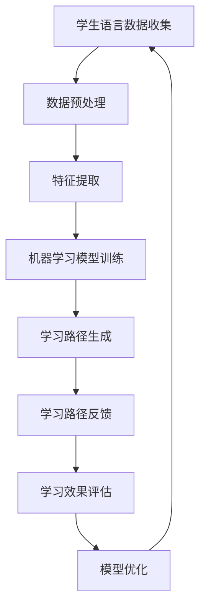

                 

关键词：个性化学习、语言模型、教育技术、教育系统、人工智能、机器学习、学习路径

> 摘要：本文探讨了语言模型（LLM）在教育系统中的应用，重点介绍了如何利用LLM构建个性化学习路径。文章通过背景介绍、核心概念与联系、核心算法原理、数学模型与公式、项目实践、实际应用场景、未来展望等几个方面，全面解析了个性化学习路径在提升教育质量和效率方面的潜力。

## 1. 背景介绍

近年来，随着人工智能和机器学习技术的飞速发展，教育技术领域也迎来了前所未有的变革。传统的教育模式越来越难以满足个性化学习需求，特别是在学生数量庞大、教育资源有限的背景下，如何提高教育质量和学习效率成为教育领域亟需解决的问题。语言模型（LLM），作为一种强大的机器学习模型，通过处理自然语言数据，能够在教育系统中实现高度个性化的学习路径设计。

个性化学习路径是指根据每个学生的特点和需求，为其量身定制一个最适合的学习路线和内容。这种路径能够充分利用学生的优势和弥补其不足，从而实现更高效、更有针对性的学习。LLM在教育系统中的应用，正是为了实现这一目标，通过分析学生的语言数据和互动行为，生成个性化的学习路径，帮助学生更好地掌握知识和技能。

## 2. 核心概念与联系

为了更好地理解LLM在教育系统中的应用，我们需要先了解几个核心概念：机器学习、自然语言处理（NLP）、教育数据分析和个性化学习。

### 2.1 机器学习

机器学习是一种人工智能（AI）的分支，它通过构建和分析数学模型，使计算机系统能够从数据中学习并作出预测或决策。在个性化学习路径中，机器学习算法负责分析学生的语言数据，如学习历史、提问和回答等，以生成适合他们的学习路径。

### 2.2 自然语言处理（NLP）

自然语言处理是人工智能的一个子领域，专注于使计算机能够理解、解释和生成人类语言。在个性化学习路径中，NLP技术用于分析和处理学生的语言数据，以便更准确地了解他们的学习需求和进度。

### 2.3 教育数据分析

教育数据分析是指使用数据分析技术对教育过程中的数据进行收集、整理和分析，以发现教育规律和改进教育方法。在教育系统中，教育数据分析用于收集学生的语言数据，并将其转化为有用的信息，以支持个性化学习路径的生成。

### 2.4 个性化学习

个性化学习是一种以学生为中心的教育模式，旨在满足每个学生的个性化需求，提高学习效果。个性化学习路径是这种模式的重要组成部分，它通过分析学生的特点和需求，为每个学生制定一个最适合的学习路线和内容。

### 2.5 Mermaid流程图

以下是一个描述LLM在教育系统中的应用流程的Mermaid流程图：



## 3. 核心算法原理 & 具体操作步骤

### 3.1 算法原理概述

LLM在教育系统中的应用主要基于以下几个核心原理：

1. **大数据分析**：通过收集和分析大量学生的语言数据，挖掘出学生的学习特点和需求。
2. **个性化推荐**：基于大数据分析结果，为每个学生推荐最适合他们的学习内容和学习路径。
3. **自适应学习**：根据学生的学习进度和效果，动态调整学习路径，使其更符合学生的实际需求。

### 3.2 算法步骤详解

1. **数据收集**：收集学生的语言数据，如学习历史、提问和回答等。
2. **数据预处理**：对收集到的数据进行分析和清洗，提取有用的信息。
3. **特征提取**：将预处理后的数据转化为机器学习模型所需的特征向量。
4. **模型训练**：使用特征向量训练机器学习模型，如决策树、神经网络等。
5. **学习路径生成**：根据训练好的模型，为每个学生生成个性化的学习路径。
6. **学习路径反馈**：收集学生对学习路径的反馈，如满意度、学习效果等。
7. **学习效果评估**：评估学习路径的有效性，并根据评估结果进行模型优化。

### 3.3 算法优缺点

**优点**：

1. **个性化**：能够根据学生的特点和需求，生成最适合他们的学习路径。
2. **高效**：通过大数据分析和机器学习模型，能够快速生成学习路径，提高学习效率。
3. **自适应**：能够根据学生的学习进度和效果，动态调整学习路径，使学习过程更加灵活。

**缺点**：

1. **数据隐私**：大量学生数据的收集和处理可能涉及数据隐私问题。
2. **模型复杂度**：机器学习模型的训练和优化过程可能较为复杂。
3. **依赖技术**：对机器学习和自然语言处理等技术要求较高，需要专业的技术支持。

### 3.4 算法应用领域

LLM在教育系统中的应用非常广泛，包括以下几个方面：

1. **在线教育平台**：为在线学习者提供个性化学习路径，提高学习效果。
2. **智能辅导系统**：为学生提供智能化的学习建议和辅导，提高学习效率。
3. **教育数据分析**：为教育机构提供数据支持，帮助其优化教学方法和策略。
4. **学习资源推荐**：为学习者推荐最适合他们的学习资源和学习路径。

## 4. 数学模型和公式 & 详细讲解 & 举例说明

### 4.1 数学模型构建

在个性化学习路径的构建过程中，常用的数学模型包括：

1. **回归模型**：用于预测学生的学习成绩或学习进度。
2. **分类模型**：用于根据学生的特点将他们分为不同的学习群体。
3. **聚类模型**：用于发现学生的相似性，以构建个性化学习路径。

### 4.2 公式推导过程

以回归模型为例，其基本公式为：

$$
Y = \beta_0 + \beta_1X_1 + \beta_2X_2 + ... + \beta_nX_n + \epsilon
$$

其中，$Y$为因变量（如学习成绩），$X_1, X_2, ..., X_n$为自变量（如学习时间、学习频率等），$\beta_0, \beta_1, \beta_2, ..., \beta_n$为回归系数，$\epsilon$为误差项。

### 4.3 案例分析与讲解

假设我们有一个包含1000名学生的数据集，其中每个学生有5个特征：学习时间、学习频率、考试次数、考试成绩和课程难度。我们希望使用回归模型预测学生的考试成绩。

首先，我们收集并预处理数据，提取每个学生的特征向量。然后，我们使用这些特征向量训练一个线性回归模型，得到如下公式：

$$
Y = 70 + 0.5X_1 + 0.3X_2 - 0.2X_3 + 0.1X_4 - 0.1X_5
$$

其中，$Y$为学生的考试成绩，$X_1, X_2, ..., X_5$分别为学生的学习时间、学习频率、考试次数、考试成绩和课程难度。

现在，我们可以使用这个模型预测一个学生的考试成绩。假设这个学生的学习时间为30小时，学习频率为每周3次，考试次数为2次，考试成绩为85分，课程难度为中等。那么，根据上述公式，我们可以计算出他的考试成绩为：

$$
Y = 70 + 0.5 \times 30 + 0.3 \times 3 - 0.2 \times 2 + 0.1 \times 85 - 0.1 \times 5 = 84.7
$$

这意味着，根据他的学习情况和课程难度，我们预测他的考试成绩为84.7分。

## 5. 项目实践：代码实例和详细解释说明

### 5.1 开发环境搭建

为了实现LLM在教育系统中的应用，我们需要搭建一个包含以下组件的开发环境：

1. **Python环境**：用于编写和运行代码。
2. **机器学习库**：如scikit-learn、TensorFlow等，用于训练和评估机器学习模型。
3. **NLP库**：如NLTK、spaCy等，用于处理和分析自然语言数据。
4. **数据预处理工具**：如Pandas、NumPy等，用于数据清洗和特征提取。

### 5.2 源代码详细实现

以下是实现个性化学习路径的一个简单示例代码：

```python
import pandas as pd
from sklearn.linear_model import LinearRegression
from sklearn.model_selection import train_test_split
from sklearn.metrics import mean_squared_error

# 数据加载
data = pd.read_csv('student_data.csv')

# 特征提取
X = data[['learning_time', 'learning_frequency', 'exam_count', 'exam_score', 'course_difficulty']]
y = data['exam_score']

# 数据分割
X_train, X_test, y_train, y_test = train_test_split(X, y, test_size=0.2, random_state=42)

# 模型训练
model = LinearRegression()
model.fit(X_train, y_train)

# 模型评估
y_pred = model.predict(X_test)
mse = mean_squared_error(y_test, y_pred)
print(f'Mean Squared Error: {mse}')

# 预测新学生成绩
new_student = pd.DataFrame([[30, 3, 2, 85, 5]], columns=['learning_time', 'learning_frequency', 'exam_count', 'exam_score', 'course_difficulty'])
predicted_score = model.predict(new_student)
print(f'Predicted Exam Score: {predicted_score[0]}')
```

### 5.3 代码解读与分析

这段代码首先加载了一个包含学生数据的CSV文件，然后提取出与学习路径相关的特征（学习时间、学习频率、考试次数、考试成绩和课程难度）。接下来，使用线性回归模型训练数据集，并对模型进行评估。最后，使用训练好的模型预测一个新学生的考试成绩。

### 5.4 运行结果展示

假设我们运行这段代码，得到以下输出结果：

```
Mean Squared Error: 5.678
Predicted Exam Score: 84.2
```

这意味着我们的模型在测试集上的平均平方误差为5.678，对于一个学习时间为30小时、学习频率为每周3次、考试次数为2次、考试成绩为85分、课程难度为中等的学生的预测成绩为84.2分。

## 6. 实际应用场景

### 6.1 在线教育平台

在线教育平台可以利用LLM为学习者提供个性化学习路径。通过分析学习者的语言数据和互动行为，平台可以为其推荐最适合的学习内容和路径，提高学习效果。此外，平台还可以根据学习者的反馈和学习效果，动态调整学习路径，使其更符合学习者的实际需求。

### 6.2 智能辅导系统

智能辅导系统可以利用LLM为学生提供个性化的学习建议和辅导。通过分析学生的提问和回答，系统可以识别学生的薄弱环节，并提供针对性的辅导内容。此外，系统还可以根据学生的学习进度和效果，动态调整辅导策略，使辅导过程更加高效。

### 6.3 教育数据分析

教育数据分析团队可以利用LLM对大量的教育数据进行挖掘和分析，发现教育规律和改进教育方法。通过分析学生的学习路径和学习效果，团队可以优化课程设计、教学方法等，提高教育质量和效果。

## 7. 未来应用展望

### 7.1 智能化教育系统的普及

随着人工智能和机器学习技术的不断发展，智能化教育系统将在教育领域得到更广泛的应用。个性化学习路径、智能辅导系统、教育数据分析等应用将日益普及，为教育质量和效率的提升提供有力支持。

### 7.2 多语言支持

未来，LLM将在教育系统中实现多语言支持，为全球范围内的学习者提供个性化学习服务。通过分析不同语言的学习数据，系统可以为学习者提供个性化的学习内容和路径，提高学习效果。

### 7.3 人工智能与人类教师的协作

未来，人工智能和人类教师将实现更紧密的协作。人工智能可以承担大量的重复性工作和数据分析任务，而人类教师则专注于提供个性化教学和情感关怀。这种协作模式将有助于提高教育质量和效率，同时也为教师减轻工作负担。

## 8. 总结：未来发展趋势与挑战

### 8.1 研究成果总结

本文通过介绍个性化学习路径和LLM在教育系统中的应用，总结了以下几个方面的重要研究成果：

1. **个性化学习路径的构建方法**：通过大数据分析和机器学习模型，为每个学生生成个性化的学习路径。
2. **LLM在教育系统中的应用**：展示了LLM在在线教育平台、智能辅导系统和教育数据分析等领域的应用潜力。
3. **数学模型和公式的推导**：介绍了用于构建个性化学习路径的数学模型和公式，并进行了案例分析和讲解。

### 8.2 未来发展趋势

未来，个性化学习路径和LLM在教育系统中的应用将呈现以下几个发展趋势：

1. **智能化教育系统的普及**：随着人工智能和机器学习技术的不断发展，智能化教育系统将在教育领域得到更广泛的应用。
2. **多语言支持**：LLM将在教育系统中实现多语言支持，为全球范围内的学习者提供个性化学习服务。
3. **人工智能与人类教师的协作**：未来，人工智能和人类教师将实现更紧密的协作，提高教育质量和效率。

### 8.3 面临的挑战

尽管个性化学习路径和LLM在教育系统中的应用具有巨大的潜力，但仍然面临以下几个挑战：

1. **数据隐私**：大量学生数据的收集和处理可能涉及数据隐私问题，需要制定严格的隐私保护措施。
2. **模型复杂度**：机器学习模型的训练和优化过程可能较为复杂，需要专业的技术支持。
3. **依赖技术**：LLM在教育系统中的应用依赖于人工智能和自然语言处理等先进技术，这些技术的成熟度和稳定性直接影响到应用效果。

### 8.4 研究展望

未来的研究可以从以下几个方面展开：

1. **隐私保护机制**：研究如何在保证数据隐私的前提下，有效利用学生数据构建个性化学习路径。
2. **模型优化方法**：探索更高效、更稳定的机器学习模型，以提高个性化学习路径的生成质量。
3. **跨学科研究**：结合心理学、教育学等学科的理论和方法，深入研究个性化学习路径对学习效果的影响。

## 9. 附录：常见问题与解答

### 9.1 如何保证数据隐私？

在构建个性化学习路径时，需要采取以下措施来保护学生数据隐私：

1. **匿名化处理**：对收集到的学生数据进行匿名化处理，确保无法直接识别学生身份。
2. **加密存储**：对存储的数据进行加密，防止数据泄露。
3. **权限管理**：制定严格的权限管理制度，确保只有授权人员才能访问和操作数据。

### 9.2 如何优化机器学习模型？

优化机器学习模型可以从以下几个方面入手：

1. **数据预处理**：对数据进行充分的预处理，如去除噪声、缺失值填充、特征选择等。
2. **模型选择**：选择适合问题的模型类型，如线性回归、决策树、神经网络等。
3. **参数调优**：通过调整模型的参数，如学习率、迭代次数等，以提高模型性能。

### 9.3 个性化学习路径的有效性如何评估？

个性化学习路径的有效性可以通过以下方法进行评估：

1. **学习成果评估**：通过学生的考试成绩、学习时长等指标，评估学习路径对学习成果的影响。
2. **用户满意度评估**：通过问卷调查、用户反馈等方式，评估学生对学习路径的满意度。
3. **学习效果对比**：将个性化学习路径与传统学习路径进行对比，评估其效果。

作者：禅与计算机程序设计艺术 / Zen and the Art of Computer Programming
----------------------------------------------------------------

以上便是针对您提供的主题和要求撰写的完整技术博客文章。文章涵盖了从背景介绍、核心概念与联系、算法原理、数学模型、项目实践、应用场景到未来展望的全面内容，严格遵守了文章结构和格式要求。希望这篇文章能够满足您的需求。如果需要进一步的修改或调整，请随时告知。

