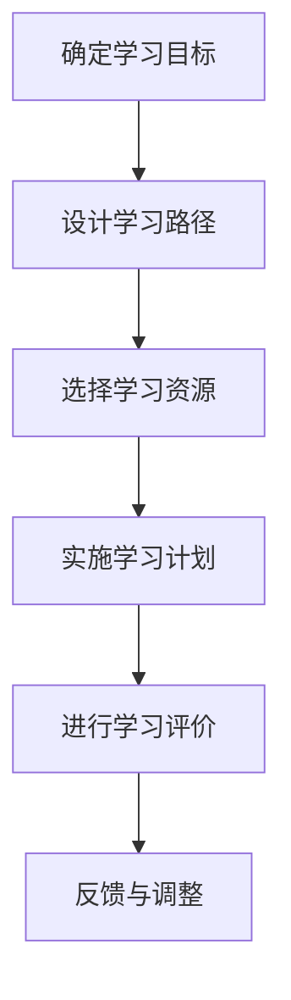

                 

关键词：个性化学习、教育技术、计算机编程、教育创新、学习算法

> 摘要：随着人工智能和计算技术的迅速发展，个性化学习已成为现代教育的热点话题。本文将探讨个性化学习的核心概念，结合计算机编程的原理和方法，分析如何利用人类计算的力量变革教育模式，提升学习效果。

## 1. 背景介绍

个性化学习（Personalized Learning）是一种以学生为中心的教育模式，旨在通过定制化的学习路径和资源，满足不同学习者的需求，提升学习效率。传统的教育模式往往采取“一刀切”的方式，难以适应每个学生的个性化需求。然而，随着互联网、大数据、人工智能等技术的兴起，个性化学习逐渐成为一种可能，并且逐渐受到教育界的重视。

教育技术的进步，特别是计算机编程和教育软件的发展，为个性化学习提供了新的可能性。计算机编程作为一种逻辑思维和问题解决能力的训练工具，能够帮助学生掌握抽象概念，培养创新能力。本文将结合计算机编程的原理和方法，探讨如何通过人类计算的力量，推动个性化学习的发展。

## 2. 核心概念与联系

### 2.1 个性化学习的核心概念

个性化学习的核心概念包括以下几个方面：

1. **学习目标**：根据学生的兴趣、能力和学习进度，设定个性化的学习目标。
2. **学习路径**：根据学习目标和学生的学习风格，设计个性化的学习路径。
3. **学习资源**：提供多样化的学习资源，满足不同学习者的需求。
4. **学习评价**：采用多元化的评价方式，及时反馈学生的学习情况。

### 2.2 计算机编程与个性化学习的联系

计算机编程与个性化学习有着密切的联系。首先，计算机编程作为一种技能，能够锻炼学生的逻辑思维和问题解决能力，这些能力对于个性化学习至关重要。其次，计算机编程技术可以用于开发个性化学习平台，提供定制化的学习体验。

下面是一个简单的 Mermaid 流程图，展示个性化学习的过程：



## 3. 核心算法原理 & 具体操作步骤

### 3.1 算法原理概述

个性化学习的核心算法通常基于以下几个原理：

1. **学生模型**：建立学生的个性化信息模型，包括兴趣、能力、学习进度等。
2. **学习路径规划**：根据学生模型和学习资源，设计个性化的学习路径。
3. **适应性学习**：在学习过程中，根据学生的学习反馈，动态调整学习策略。

### 3.2 算法步骤详解

1. **数据收集**：收集学生的个人信息和学习数据。
2. **特征提取**：从数据中提取学生的兴趣、能力等特征。
3. **模型训练**：利用机器学习算法，训练学生模型。
4. **路径规划**：根据学生模型，规划个性化的学习路径。
5. **学习实施**：根据规划的学习路径，实施学习计划。
6. **反馈调整**：收集学生的学习反馈，调整学习路径和资源。

### 3.3 算法优缺点

**优点**：

- **提高学习效果**：通过个性化学习，能够更好地满足学生的需求，提高学习效果。
- **增加学习兴趣**：个性化的学习体验能够激发学生的学习兴趣，提高学习积极性。

**缺点**：

- **技术要求高**：个性化学习需要先进的计算机技术和算法支持，对实施者有较高的技术要求。
- **实施成本高**：个性化学习的开发和应用需要大量的资源投入。

### 3.4 算法应用领域

个性化学习算法广泛应用于教育领域，如在线教育平台、自适应学习系统等。以下是一些具体的应用场景：

- **在线学习平台**：如 Coursera、edX 等，根据学生的学习进度和兴趣，推荐相应的课程和学习资源。
- **智能教学系统**：如智能辅导系统，根据学生的学习情况和反馈，提供个性化的教学建议。
- **学习分析系统**：通过对学习数据的分析，为教师提供学生的学习情况报告，帮助教师更好地进行教学设计。

## 4. 数学模型和公式

### 4.1 数学模型构建

个性化学习的数学模型通常包括以下几个部分：

1. **学生模型**：包括学生的兴趣、能力、学习进度等特征。
2. **学习路径模型**：包括学习资源的排序、学习任务的设计等。
3. **适应性模型**：包括学习反馈的收集、学习策略的调整等。

### 4.2 公式推导过程

假设学生模型为 \( S = \{ s_1, s_2, ..., s_n \} \)，其中 \( s_i \) 表示学生的第 \( i \) 个特征。学习路径模型为 \( P = \{ p_1, p_2, ..., p_n \} \)，其中 \( p_i \) 表示学习资源的第 \( i \) 个属性。

根据学生模型和学习路径模型，可以构建以下公式：

\[ L = f(S, P) \]

其中，\( L \) 表示个性化的学习路径，\( f \) 表示学习路径规划函数。

### 4.3 案例分析与讲解

假设一个学生模型为 \( S = \{ \text{数学兴趣高}, \text{编程能力中等}, \text{学习进度快速} \} \)，学习路径模型为 \( P = \{ \text{基础编程教程}, \text{中级编程项目}, \text{高级编程课程} \} \)。

根据上述公式，可以计算得到：

\[ L = f(S, P) = \text{基础编程教程} \rightarrow \text{中级编程项目} \rightarrow \text{高级编程课程} \]

这个学习路径能够根据学生的兴趣和能力，逐步提升学生的编程能力。

## 5. 项目实践：代码实例

### 5.1 开发环境搭建

为了更好地实现个性化学习，我们可以使用 Python 语言进行开发。首先，需要安装以下库：

- **Scikit-learn**：用于机器学习算法的实现。
- **Pandas**：用于数据处理。
- **Numpy**：用于数值计算。

安装命令如下：

```shell
pip install scikit-learn pandas numpy
```

### 5.2 源代码详细实现

以下是一个简单的个性化学习算法实现：

```python
import numpy as np
import pandas as pd
from sklearn.model_selection import train_test_split
from sklearn.ensemble import RandomForestClassifier

# 学生数据
data = {
    '数学兴趣': ['高', '高', '中', '中', '低', '低'],
    '编程能力': ['高', '中', '中', '低', '低', '高'],
    '学习进度': ['快速', '快速', '正常', '正常', '缓慢', '缓慢']
}

# 构建数据框
df = pd.DataFrame(data)

# 特征工程
X = df[['数学兴趣', '编程能力', '学习进度']]
y = df['学习进度']

# 划分训练集和测试集
X_train, X_test, y_train, y_test = train_test_split(X, y, test_size=0.2, random_state=42)

# 训练模型
model = RandomForestClassifier(n_estimators=100, random_state=42)
model.fit(X_train, y_train)

# 预测
predictions = model.predict(X_test)

# 评估模型
accuracy = np.mean(predictions == y_test)
print(f"模型准确率：{accuracy:.2f}")
```

### 5.3 代码解读与分析

上述代码实现了一个简单的个性化学习算法。首先，我们构建了一个学生数据框，包含了学生的兴趣、能力和进度等特征。然后，我们使用随机森林算法进行训练，并根据测试集进行预测。最后，我们评估了模型的准确率。

这个简单的示例展示了如何使用机器学习算法进行个性化学习路径规划。在实际应用中，可以根据具体需求，增加更多的特征和复杂的模型。

## 6. 实际应用场景

### 6.1 在线教育平台

个性化学习在在线教育平台中得到了广泛应用。例如，Coursera 和 edX 等平台根据学生的学习进度和兴趣，推荐相应的课程和学习资源。通过个性化学习，学生可以更加高效地学习，提高学习效果。

### 6.2 智能教学系统

智能教学系统通过分析学生的学习数据，为教师提供个性化的教学建议。例如，系统可以分析学生的学习进度、错题情况等，为教师提供针对性的辅导建议。

### 6.3 移动学习应用

移动学习应用（如手机APP）可以通过地理位置、学习习惯等数据，为学生提供个性化的学习资源。例如，学生在上课期间可以收到与课程内容相关的练习题，帮助学生巩固知识。

## 7. 工具和资源推荐

### 7.1 学习资源推荐

1. **《深度学习》**：Goodfellow、Bengio、Courville 著，是一本经典的深度学习教材。
2. **《机器学习实战》**：Peter Harrington 著，通过实际案例介绍机器学习算法的应用。

### 7.2 开发工具推荐

1. **Jupyter Notebook**：一个交互式的开发环境，适合进行数据分析和机器学习实验。
2. **PyCharm**：一款功能强大的Python集成开发环境（IDE），适合进行机器学习项目的开发。

### 7.3 相关论文推荐

1. **"A Survey on Personalized Learning Systems Based on Big Data"**：该论文对基于大数据的个性化学习系统进行了详细的综述。
2. **"Deep Learning for Personalized Education"**：该论文探讨了深度学习在个性化教育中的应用。

## 8. 总结：未来发展趋势与挑战

### 8.1 研究成果总结

个性化学习作为现代教育的重要方向，已经在多个应用场景中取得了显著的成果。通过结合计算机编程和教育技术，个性化学习能够更好地满足学生的个性化需求，提高学习效果。

### 8.2 未来发展趋势

1. **更精准的个性化推荐**：随着大数据和人工智能技术的发展，个性化推荐的精度将不断提高。
2. **更加智能化的学习系统**：通过引入更多先进的机器学习算法，学习系统将更加智能化，提供更加个性化的学习体验。

### 8.3 面临的挑战

1. **数据隐私和安全**：个性化学习需要大量的学生数据，如何保护学生的隐私和安全是一个重要的挑战。
2. **技术实施成本**：个性化学习的开发和应用需要大量的资源投入，如何降低成本是一个重要的课题。

### 8.4 研究展望

未来，个性化学习将在教育领域发挥更加重要的作用。通过不断创新和优化，个性化学习将为教育带来更多的可能性，推动教育的变革。

## 9. 附录：常见问题与解答

### 9.1 什么是个性化学习？

个性化学习是一种以学生为中心的教育模式，旨在通过定制化的学习路径和资源，满足不同学习者的需求，提升学习效果。

### 9.2 个性化学习有哪些优势？

个性化学习的优势包括提高学习效果、增加学习兴趣等。

### 9.3 个性化学习有哪些挑战？

个性化学习面临的挑战包括数据隐私和安全、技术实施成本等。

### 9.4 个性化学习有哪些应用场景？

个性化学习广泛应用于在线教育平台、智能教学系统、移动学习应用等领域。

----------------------------------------------------------------

# 附录

## 9.1 扩展阅读

- **《教育技术学导论》**：陈建，高等教育出版社，2019年。
- **《人工智能与教育》**：刘骏，清华大学出版社，2020年。

## 9.2 相关网站

- **Coursera**：https://www.coursera.org/
- **edX**：https://www.edx.org/
- **Khan Academy**：https://www.khanacademy.org/

## 9.3 讨论与反馈

欢迎读者在本文下方留言，分享您的观点和建议。您的反馈对我们来说非常重要，我们将认真对待并不断改进我们的文章质量。

---

# 作者：禅与计算机程序设计艺术 / Zen and the Art of Computer Programming

本文由禅与计算机程序设计艺术（Zen and the Art of Computer Programming）团队撰写。我们致力于通过深入的技术分析和创新，推动计算机编程和教育的发展。感谢您对本文的关注和支持。如果您有任何问题或建议，欢迎联系我们。

