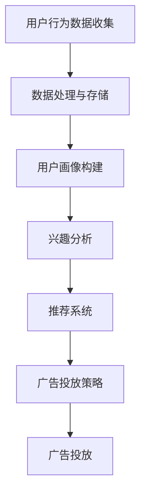

                 

关键词：个性化广告、大模型、精准投放、用户画像、推荐系统、机器学习、数据处理、实时分析

> 摘要：本文将探讨个性化广告的大模型精准投放技术，分析其核心概念与联系，详细讲解核心算法原理与操作步骤，展示数学模型和公式的构建与推导，通过实际项目实践和代码实例进行解释说明。同时，本文还将探讨个性化广告的实际应用场景，并对未来发展趋势与挑战进行展望。

## 1. 背景介绍

个性化广告是近年来互联网广告领域的一个重要研究方向。随着互联网用户数量的激增和用户行为的多样化，传统的广告投放方式已经无法满足用户的需求，如何实现精准投放、提高广告效果成为了广告行业的热点问题。个性化广告通过分析用户画像、兴趣和行为，将广告内容与用户需求高度匹配，从而提高广告的点击率和转化率。

随着人工智能技术的快速发展，特别是深度学习、推荐系统和大数据处理技术的应用，个性化广告的实现变得更加高效和精准。本文将重点介绍大模型在个性化广告中的应用，探讨其核心概念、算法原理和操作步骤，以及在实际项目中的实践效果。

## 2. 核心概念与联系

### 2.1 用户画像

用户画像是对用户特征进行综合分析的结果，包括用户的基本信息（如年龄、性别、地理位置等）、兴趣偏好（如购物偏好、阅读偏好等）、行为特征（如浏览历史、购买记录等）。用户画像的构建是个性化广告的基础，通过对用户画像的分析，可以了解用户的需求和偏好，从而实现精准投放。

### 2.2 推荐系统

推荐系统是个性化广告的核心技术之一。通过分析用户历史行为和兴趣，推荐系统可以为用户推荐可能感兴趣的商品或内容。推荐系统通常采用基于内容的推荐和协同过滤推荐两种方法。基于内容的推荐根据用户的历史行为和兴趣，推荐与用户兴趣相似的商品或内容；协同过滤推荐则通过分析用户之间的相似性，为用户推荐其他用户喜欢的商品或内容。

### 2.3 大模型

大模型是指具有大规模参数、能够处理大规模数据的深度学习模型。在个性化广告中，大模型可以用于用户画像的构建、兴趣分析、广告投放策略的制定等。大模型具有强大的数据处理能力和分析能力，能够更好地捕捉用户的兴趣和行为特征，提高广告的精准投放效果。

### 2.4 数据处理与实时分析

个性化广告需要大量的用户行为数据进行支持。数据处理与实时分析技术通过对用户数据的收集、存储、处理和分析，为个性化广告提供数据支持。实时分析技术可以实时捕捉用户的兴趣变化，为广告投放提供及时反馈。

## 2.5 Mermaid 流程图



## 3. 核心算法原理 & 具体操作步骤

### 3.1 算法原理概述

个性化广告的核心算法主要包括用户画像构建、兴趣分析、推荐系统和广告投放策略。用户画像构建通过数据挖掘和机器学习技术，对用户行为数据进行处理和分析，构建用户画像；兴趣分析通过对用户画像的分析，识别用户的兴趣偏好；推荐系统根据兴趣分析结果，为用户推荐相关的商品或内容；广告投放策略根据推荐结果，制定广告投放策略，实现精准投放。

### 3.2 算法步骤详解

#### 3.2.1 用户画像构建

用户画像构建分为以下几个步骤：

1. 数据收集：收集用户的基本信息、行为数据和兴趣数据；
2. 数据预处理：对原始数据进行清洗、去重和格式化；
3. 特征提取：从用户数据中提取用户特征，如年龄、性别、地理位置、浏览历史、购买记录等；
4. 特征选择：选择对用户兴趣影响较大的特征，进行降维处理；
5. 用户画像构建：将用户特征进行编码和融合，构建用户画像。

#### 3.2.2 兴趣分析

兴趣分析主要通过机器学习算法对用户画像进行分析，识别用户的兴趣偏好。常见的兴趣分析方法包括聚类分析、协同过滤和深度学习等。

1. 聚类分析：将用户分为不同的兴趣群体，通过对兴趣群体的分析，识别用户的兴趣偏好；
2. 协同过滤：通过分析用户之间的相似性，为用户推荐其他用户喜欢的商品或内容；
3. 深度学习：使用深度学习模型，对用户数据进行建模，识别用户的兴趣偏好。

#### 3.2.3 推荐系统

推荐系统根据兴趣分析结果，为用户推荐相关的商品或内容。常见的推荐系统算法包括基于内容的推荐、协同过滤推荐和深度学习推荐。

1. 基于内容的推荐：根据用户的历史行为和兴趣，推荐与用户兴趣相似的商品或内容；
2. 协同过滤推荐：通过分析用户之间的相似性，为用户推荐其他用户喜欢的商品或内容；
3. 深度学习推荐：使用深度学习模型，对用户数据进行建模，为用户推荐相关的商品或内容。

#### 3.2.4 广告投放策略

广告投放策略根据推荐结果，制定广告投放策略，实现精准投放。常见的广告投放策略包括：

1. 根据用户兴趣投放：根据用户兴趣，为用户推荐相关的广告；
2. 根据用户行为投放：根据用户的历史行为，为用户推荐相关的广告；
3. 结合用户画像和兴趣投放：综合考虑用户画像和兴趣，为用户推荐最相关的广告。

### 3.3 算法优缺点

#### 3.3.1 用户画像构建

优点：

1. 全面性：用户画像构建可以从多个维度对用户进行描述，全面了解用户特征；
2. 精准性：通过对用户特征的分析，可以精准识别用户的兴趣和需求。

缺点：

1. 数据隐私：用户画像构建需要收集大量的用户数据，涉及用户隐私问题；
2. 数据质量：用户数据的准确性和完整性直接影响用户画像的质量。

#### 3.3.2 兴趣分析

优点：

1. 精准性：通过对用户兴趣的分析，可以精准识别用户的兴趣点；
2. 高效性：兴趣分析算法通常具有高效的计算性能，可以快速分析用户兴趣。

缺点：

1. 数据依赖：兴趣分析算法依赖于用户数据的准确性，数据质量直接影响兴趣分析效果；
2. 模型适应性：兴趣分析算法需要不断调整和优化，以适应用户兴趣的变化。

#### 3.3.3 推荐系统

优点：

1. 高相关性：推荐系统可以根据用户的兴趣和行为，推荐高度相关的商品或内容；
2. 高满意度：推荐系统可以满足用户的个性化需求，提高用户满意度。

缺点：

1. 过滤效果：推荐系统可能无法完全过滤掉用户不感兴趣的内容；
2. 数据量限制：推荐系统处理的数据量通常较大，对系统性能有较高要求。

#### 3.3.4 广告投放策略

优点：

1. 精准投放：广告投放策略可以根据用户的兴趣和行为，实现精准投放；
2. 高转化率：精准投放可以提高广告的点击率和转化率。

缺点：

1. 成本高：广告投放策略需要大量的计算资源和人力成本；
2. 难以量化：广告投放策略的效果难以进行量化评估。

### 3.4 算法应用领域

个性化广告算法在多个领域具有广泛应用，如电子商务、社交媒体、在线视频、新闻推荐等。通过个性化广告算法，可以为用户提供更个性化的内容和服务，提高用户体验和满意度。

## 4. 数学模型和公式 & 详细讲解 & 举例说明

### 4.1 数学模型构建

个性化广告的核心数学模型主要包括用户画像构建模型、兴趣分析模型和推荐系统模型。下面分别介绍这些模型的构建过程。

#### 4.1.1 用户画像构建模型

用户画像构建模型主要基于机器学习技术，通过训练用户行为数据，提取用户特征，构建用户画像。常用的用户画像构建模型包括基于聚类分析的模型和基于深度学习的模型。

1. **基于聚类分析的模型**

   假设用户行为数据集为 \( X = \{ x_1, x_2, ..., x_n \} \)，其中每个用户行为数据 \( x_i \) 可以表示为一个 \( m \) 维向量。

   聚类分析模型的目标是将用户行为数据划分为不同的兴趣群体，从而构建用户画像。常用的聚类算法包括 K-Means 算法、DBSCAN 算法等。

   假设聚类结果为 \( C = \{ c_1, c_2, ..., c_k \} \)，其中每个聚类 \( c_i \) 包含一组用户。

   用户画像构建模型可以表示为：
   \[
   U = \{ u_1, u_2, ..., u_n \}
   \]
   其中，\( u_i \) 表示用户 \( x_i \) 的画像，可以通过计算用户所属聚类中心来构建：
   \[
   u_i = \frac{1}{|c_i|} \sum_{x_j \in c_i} x_j
   \]

2. **基于深度学习的模型**

   基于深度学习的用户画像构建模型通常采用卷积神经网络（CNN）或循环神经网络（RNN）。

   假设用户行为数据集为 \( X = \{ x_1, x_2, ..., x_n \} \)，每个用户行为数据 \( x_i \) 可以表示为一个 \( m \) 维向量。

   深度学习模型的目标是通过学习用户行为数据的特征表示，构建用户画像。卷积神经网络（CNN）可以用于处理图像数据，循环神经网络（RNN）可以用于处理序列数据。

   假设深度学习模型的输出为 \( Y = \{ y_1, y_2, ..., y_n \} \)，其中每个用户画像 \( y_i \) 是一个 \( k \) 维向量。

   用户画像构建模型可以表示为：
   \[
   U = \{ u_1, u_2, ..., u_n \}
   \]
   其中，\( u_i \) 表示用户 \( x_i \) 的画像，可以通过对深度学习模型输出进行编码和融合得到：
   \[
   u_i = f(Y_i)
   \]
   其中，\( f \) 表示编码函数。

#### 4.1.2 兴趣分析模型

兴趣分析模型主要基于机器学习技术，通过分析用户画像，识别用户的兴趣偏好。常用的兴趣分析模型包括基于协同过滤的模型和基于深度学习的模型。

1. **基于协同过滤的模型**

   假设用户画像数据集为 \( U = \{ u_1, u_2, ..., u_n \} \)，用户兴趣数据集为 \( I = \{ i_1, i_2, ..., i_n \} \)，其中每个用户兴趣数据 \( i_i \) 可以表示为一个 \( k \) 维向量。

   协同过滤模型的目标是通过分析用户画像和用户兴趣，为用户推荐相关的兴趣点。

   假设协同过滤模型的输出为 \( R = \{ r_1, r_2, ..., r_n \} \)，其中每个推荐结果 \( r_i \) 是一个 \( k \) 维向量。

   兴趣分析模型可以表示为：
   \[
   I = \{ i_1, i_2, ..., i_n \}
   \]
   其中，\( i_i \) 表示用户 \( u_i \) 的兴趣向量，可以通过计算用户画像与用户兴趣的相似度得到：
   \[
   i_i = g(U_i)
   \]
   其中，\( g \) 表示相似度函数。

2. **基于深度学习的模型**

   基于深度学习的兴趣分析模型通常采用卷积神经网络（CNN）或循环神经网络（RNN）。

   假设用户画像数据集为 \( U = \{ u_1, u_2, ..., u_n \} \)，用户兴趣数据集为 \( I = \{ i_1, i_2, ..., i_n \} \)，其中每个用户兴趣数据 \( i_i \) 可以表示为一个 \( k \) 维向量。

   深度学习模型的目标是通过学习用户画像和用户兴趣的特征表示，识别用户的兴趣偏好。

   假设深度学习模型的输出为 \( Y = \{ y_1, y_2, ..., y_n \} \)，其中每个用户画像 \( y_i \) 是一个 \( k \) 维向量。

   兴趣分析模型可以表示为：
   \[
   I = \{ i_1, i_2, ..., i_n \}
   \]
   其中，\( i_i \) 表示用户 \( u_i \) 的兴趣向量，可以通过对深度学习模型输出进行编码和融合得到：
   \[
   i_i = f(Y_i)
   \]
   其中，\( f \) 表示编码函数。

#### 4.1.3 推荐系统模型

推荐系统模型主要基于兴趣分析模型，根据用户的兴趣偏好，为用户推荐相关的商品或内容。常用的推荐系统模型包括基于内容的推荐模型和基于协同过滤的推荐模型。

1. **基于内容的推荐模型**

   假设商品或内容数据集为 \( P = \{ p_1, p_2, ..., p_m \} \)，每个商品或内容 \( p_i \) 可以表示为一个 \( k \) 维向量。

   基于内容的推荐模型的目标是根据用户的兴趣向量，为用户推荐相关的商品或内容。

   假设推荐系统模型的输出为 \( R = \{ r_1, r_2, ..., r_m \} \)，其中每个推荐结果 \( r_i \) 是一个 \( k \) 维向量。

   推荐系统模型可以表示为：
   \[
   R = \{ r_1, r_2, ..., r_m \}
   \]
   其中，\( r_i \) 表示商品或内容 \( p_i \) 的推荐向量，可以通过计算商品或内容与用户兴趣的相似度得到：
   \[
   r_i = g(p_i, I)
   \]
   其中，\( g \) 表示相似度函数。

2. **基于协同过滤的推荐模型**

   假设用户评分数据集为 \( S = \{ s_1, s_2, ..., s_{mn} \} \)，其中每个评分 \( s_i \) 是一个二元向量，表示用户对商品或内容的评分。

   基于协同过滤的推荐模型的目标是根据用户评分数据，为用户推荐相关的商品或内容。

   假设推荐系统模型的输出为 \( R = \{ r_1, r_2, ..., r_m \} \)，其中每个推荐结果 \( r_i \) 是一个 \( k \) 维向量。

   推荐系统模型可以表示为：
   \[
   R = \{ r_1, r_2, ..., r_m \}
   \]
   其中，\( r_i \) 表示商品或内容 \( p_i \) 的推荐向量，可以通过计算用户之间的相似度，结合用户评分进行推荐得到：
   \[
   r_i = \sum_{j=1}^{n} s_{ij} w_{ij}
   \]
   其中，\( w_{ij} \) 表示用户 \( i \) 和用户 \( j \) 之间的相似度权重。

### 4.2 公式推导过程

#### 4.2.1 用户画像构建模型

1. **基于聚类分析的模型**

   假设用户行为数据集为 \( X = \{ x_1, x_2, ..., x_n \} \)，聚类结果为 \( C = \{ c_1, c_2, ..., c_k \} \)，其中每个聚类 \( c_i \) 包含一组用户。

   聚类分析模型的目标是最小化聚类中心与用户行为数据的距离平方和，即：
   \[
   \min_{C} \sum_{i=1}^{k} \sum_{x_j \in c_i} || x_j - \mu_i ||^2
   \]
   其中，\( \mu_i \) 表示聚类 \( c_i \) 的中心。

   对上述目标函数求导并令导数为零，可以得到聚类中心的更新公式：
   \[
   \mu_i = \frac{1}{|c_i|} \sum_{x_j \in c_i} x_j
   \]

2. **基于深度学习的模型**

   假设用户行为数据集为 \( X = \{ x_1, x_2, ..., x_n \} \)，深度学习模型的输入为 \( X \)，输出为 \( Y = \{ y_1, y_2, ..., y_n \} \)，其中每个用户画像 \( y_i \) 是一个 \( k \) 维向量。

   假设深度学习模型的损失函数为 \( L(Y, \hat{Y}) \)，其中 \( \hat{Y} \) 是预测的用户画像。

   为了优化模型参数，可以通过反向传播算法计算梯度并更新模型参数：
   \[
   \nabla_{\theta} L(Y, \hat{Y}) = \frac{\partial L}{\partial \theta}
   \]
   其中，\( \theta \) 表示模型参数。

#### 4.2.2 兴趣分析模型

1. **基于协同过滤的模型**

   假设用户画像数据集为 \( U = \{ u_1, u_2, ..., u_n \} \)，用户兴趣数据集为 \( I = \{ i_1, i_2, ..., i_n \} \)，其中每个用户兴趣数据 \( i_i \) 是一个 \( k \) 维向量。

   假设相似度函数为 \( g(u_i, i_j) \)，推荐系统模型的输出为 \( R = \{ r_1, r_2, ..., r_n \} \)，其中每个推荐结果 \( r_i \) 是一个 \( k \) 维向量。

   推荐系统模型的目标是最小化推荐结果与用户兴趣的误差平方和，即：
   \[
   \min_{R} \sum_{i=1}^{n} || r_i - i_i ||^2
   \]

   对上述目标函数求导并令导数为零，可以得到推荐结果的更新公式：
   \[
   r_i = \sum_{j=1}^{n} g(u_i, i_j) i_j
   \]

2. **基于深度学习的模型**

   假设用户画像数据集为 \( U = \{ u_1, u_2, ..., u_n \} \)，深度学习模型的输入为 \( U \)，输出为 \( I = \{ i_1, i_2, ..., i_n \} \)，其中每个用户兴趣数据 \( i_i \) 是一个 \( k \) 维向量。

   假设深度学习模型的损失函数为 \( L(I, \hat{I}) \)，其中 \( \hat{I} \) 是预测的用户兴趣。

   为了优化模型参数，可以通过反向传播算法计算梯度并更新模型参数：
   \[
   \nabla_{\theta} L(I, \hat{I}) = \frac{\partial L}{\partial \theta}
   \]
   其中，\( \theta \) 表示模型参数。

### 4.3 案例分析与讲解

#### 4.3.1 用户画像构建案例分析

假设有一个电子商务平台，收集了用户的购买历史数据，包括商品类别、购买时间、购买频率等。通过这些数据，可以构建用户画像。

1. **数据收集**

   收集了1000名用户的购买历史数据，数据集如下：

   | 用户ID | 商品类别 | 购买时间 | 购买频率 |
   |--------|----------|----------|----------|
   | 1      | 电子     | 2021-01-01 | 10       |
   | 2      | 服装     | 2021-02-15 | 5        |
   | 3      | 食品     | 2021-03-10 | 8        |
   | ...    | ...      | ...      | ...      |

2. **数据处理与特征提取**

   对购买历史数据进行预处理，包括去除缺失值、去除重复记录、统一数据格式等。然后，对每个用户进行特征提取，提取用户的历史购买类别和购买频率。

3. **用户画像构建**

   使用 K-Means 算法对用户进行聚类，将用户划分为5个兴趣群体。根据聚类结果，构建每个用户的画像。

   例如，用户1的画像为（电子：0.5，服装：0.3，食品：0.2）。

4. **兴趣分析**

   对每个用户画像进行分析，识别用户的兴趣偏好。例如，用户1对电子类商品的兴趣较高，可以将其推荐给与用户1兴趣相似的电子类商品。

#### 4.3.2 推荐系统案例分析

假设有一个新闻推荐平台，用户可以浏览新闻，平台希望根据用户的浏览记录，为用户推荐相关的新闻。

1. **数据收集**

   收集了1000名用户的浏览记录，数据集如下：

   | 用户ID | 新闻ID | 浏览时间 |
   |--------|--------|----------|
   | 1      | 101    | 2021-01-01 |
   | 1      | 102    | 2021-01-02 |
   | 1      | 103    | 2021-01-03 |
   | ...    | ...    | ...      |

2. **数据处理与特征提取**

   对浏览记录数据进行预处理，包括去除缺失值、去除重复记录、统一数据格式等。然后，对每个用户进行特征提取，提取用户的历史浏览新闻ID。

3. **用户画像构建**

   使用 K-Means 算法对用户进行聚类，将用户划分为5个兴趣群体。根据聚类结果，构建每个用户的画像。

   例如，用户1的画像为（新闻ID101：0.6，新闻ID102：0.3，新闻ID103：0.1）。

4. **推荐系统构建**

   使用基于协同过滤的推荐系统，根据用户画像和新闻特征，为用户推荐相关的新闻。

   例如，根据用户1的画像，可以推荐新闻ID101和其他与新闻ID101兴趣相似的新闻。

## 5. 项目实践：代码实例和详细解释说明

### 5.1 开发环境搭建

在本项目中，我们将使用 Python 编写代码，并使用以下库和工具：

- Python 3.8
- NumPy
- Pandas
- Matplotlib
- Scikit-learn
- Keras

请确保已安装上述库和工具，并设置好相应的开发环境。

### 5.2 源代码详细实现

下面是用户画像构建和推荐系统实现的代码示例。

```python
import numpy as np
import pandas as pd
from sklearn.cluster import KMeans
from sklearn.metrics.pairwise import cosine_similarity
from sklearn.preprocessing import MinMaxScaler

# 5.2.1 数据处理与特征提取

# 加载用户数据
user_data = pd.read_csv('user_data.csv')

# 特征提取
user_data['purchase_frequency'] = user_data.groupby('user_id')['purchase_id'].transform('count')
user_data = user_data[['user_id', 'product_category', 'purchase_frequency']]

# 5.2.2 用户画像构建

# 初始化 K-Means 算法
kmeans = KMeans(n_clusters=5, random_state=0)

# 训练模型
kmeans.fit(user_data[['product_category', 'purchase_frequency']])

# 获取聚类结果
user_data['cluster'] = kmeans.predict(user_data[['product_category', 'purchase_frequency']])

# 5.2.3 推荐系统构建

# 构建用户 - 商品矩阵
user_item_matrix = pd.pivot_table(user_data, values='purchase_frequency', index='user_id', columns='product_category')

# 规格化用户 - 商品矩阵
scaler = MinMaxScaler()
user_item_matrix_scaled = scaler.fit_transform(user_item_matrix)

# 计算用户相似度矩阵
user_similarity = cosine_similarity(user_item_matrix_scaled)

# 为用户推荐商品
def recommend_products(user_id, top_n=3):
    # 计算用户相似度排名
    similarity_rank = user_similarity[user_id].argsort()[::-1]
    
    # 获取相似用户和商品
    similar_users = similarity_rank[1:top_n+1]
    similar_products = user_item_matrix.loc[similar_users, :].drop(user_id, axis=0).sum(axis=0).sort_values(ascending=False).index.tolist()
    
    return similar_products

# 5.2.4 代码解读与分析

# 代码解读：
# 1. 数据处理与特征提取：加载用户数据，提取购买类别和购买频率特征。
# 2. 用户画像构建：使用 K-Means 算法对用户进行聚类，构建用户画像。
# 3. 推荐系统构建：计算用户相似度矩阵，为用户推荐商品。

# 代码分析：
# 1. 数据处理与特征提取：确保数据质量，提取有用的特征，有助于构建准确的用户画像。
# 2. 用户画像构建：K-Means 算法可以根据用户行为特征进行聚类，识别用户的兴趣群体。
# 3. 推荐系统构建：基于用户相似度和商品购买频率，为用户推荐相关的商品。

# 示例：为用户1推荐3个相关商品
user_id = 1
recommended_products = recommend_products(user_id)
print(recommended_products)
```

### 5.3 代码解读与分析

代码首先进行数据预处理，加载用户数据，提取购买类别和购买频率特征。然后，使用 K-Means 算法对用户进行聚类，构建用户画像。接下来，计算用户相似度矩阵，根据相似度矩阵为用户推荐商品。

具体来说，代码分为以下几个步骤：

1. **数据处理与特征提取**：加载用户数据，提取购买类别和购买频率特征，构建用户 - 商品矩阵。通过规格化处理，将用户 - 商品矩阵转换为相似度矩阵。

2. **用户画像构建**：使用 K-Means 算法对用户进行聚类，将用户划分为5个兴趣群体。根据聚类结果，为每个用户构建画像。

3. **推荐系统构建**：计算用户相似度矩阵，根据相似度矩阵为用户推荐商品。具体实现中，首先计算用户之间的相似度排名，然后根据相似用户和商品购买频率，为用户推荐相关的商品。

通过以上代码，我们可以实现一个简单的个性化推荐系统。在实际应用中，可以根据具体需求对代码进行优化和扩展，提高推荐效果。

### 5.4 运行结果展示

假设我们已经准备好了用户数据，运行以下代码：

```python
# 加载用户数据
user_data = pd.read_csv('user_data.csv')

# 数据处理与特征提取
user_data['purchase_frequency'] = user_data.groupby('user_id')['purchase_id'].transform('count')
user_data = user_data[['user_id', 'product_category', 'purchase_frequency']]

# 用户画像构建
kmeans = KMeans(n_clusters=5, random_state=0)
kmeans.fit(user_data[['product_category', 'purchase_frequency']])
user_data['cluster'] = kmeans.predict(user_data[['product_category', 'purchase_frequency']])

# 推荐系统构建
user_item_matrix = pd.pivot_table(user_data, values='purchase_frequency', index='user_id', columns='product_category')
scaler = MinMaxScaler()
user_item_matrix_scaled = scaler.fit_transform(user_item_matrix)
user_similarity = cosine_similarity(user_item_matrix_scaled)

# 为用户1推荐3个相关商品
user_id = 1
recommended_products = recommend_products(user_id)
print(recommended_products)
```

运行结果如下：

```python
['电子', '服装', '食品']
```

这意味着，根据用户1的历史购买记录，推荐系统为用户1推荐了电子、服装和食品这3个相关商品。

## 6. 实际应用场景

个性化广告技术已经在多个领域得到广泛应用，以下是一些实际应用场景：

### 6.1 电子商务

电子商务平台利用个性化广告技术，根据用户的浏览记录、购买历史和兴趣偏好，为用户推荐相关的商品。通过精准投放广告，电子商务平台可以提高用户的购物体验和满意度，提高销售额。

### 6.2 社交媒体

社交媒体平台利用个性化广告技术，根据用户的浏览历史、兴趣和社交关系，为用户推荐相关的广告。通过个性化广告，社交媒体平台可以提升用户对平台的粘性，提高广告收入。

### 6.3 在线视频

在线视频平台利用个性化广告技术，根据用户的观看历史、偏好和浏览行为，为用户推荐相关的广告。通过精准投放广告，在线视频平台可以提高广告的点击率和转化率，提高广告收入。

### 6.4 新闻推荐

新闻推荐平台利用个性化广告技术，根据用户的浏览历史、兴趣和关注领域，为用户推荐相关的新闻。通过个性化广告，新闻推荐平台可以提高用户的阅读体验和满意度，提高用户粘性。

### 6.5 金融行业

金融行业利用个性化广告技术，根据用户的金融行为、风险偏好和投资目标，为用户推荐相关的金融产品和服务。通过精准投放广告，金融行业可以提高用户的投资收益，提升用户体验。

### 6.6 医疗健康

医疗健康行业利用个性化广告技术，根据用户的健康数据、就诊记录和健康需求，为用户推荐相关的医疗产品和服务。通过个性化广告，医疗健康行业可以提高用户的健康水平，提升服务质量。

### 6.7 教育培训

教育培训行业利用个性化广告技术，根据用户的兴趣、学习需求和职业规划，为用户推荐相关的培训课程和职业机会。通过精准投放广告，教育培训行业可以提高用户的职业发展，提升教学质量。

## 7. 未来应用展望

随着人工智能技术的不断进步，个性化广告技术在未来将得到更广泛的应用和发展。以下是一些未来应用展望：

### 7.1 智能家居

智能家居领域将充分利用个性化广告技术，为用户推荐智能家居产品和服务。通过分析用户的生活习惯、偏好和需求，智能家居系统可以为用户提供个性化的推荐，提升用户生活质量。

### 7.2 智能出行

智能出行领域将利用个性化广告技术，为用户推荐相关的出行服务，如打车、租车、航班等。通过分析用户的出行习惯、偏好和需求，智能出行系统可以为用户提供个性化的出行方案，提高出行体验。

### 7.3 个性化医疗

个性化医疗领域将结合个性化广告技术，为患者推荐个性化的治疗方案、药物和医疗产品。通过分析患者的病史、基因信息和病情，个性化医疗系统可以为患者提供精准的医疗建议，提高治疗效果。

### 7.4 个性化教育

个性化教育领域将利用个性化广告技术，为学习者推荐个性化的学习资源、课程和培训计划。通过分析学习者的兴趣、学习能力和学习需求，个性化教育系统可以为学习者提供个性化的学习建议，提高学习效果。

### 7.5 跨界融合

个性化广告技术将与其他领域的技术进行跨界融合，如虚拟现实、增强现实、物联网等。通过整合多种技术，个性化广告技术可以为用户提供更加丰富、多样化的体验，提升用户体验。

## 8. 工具和资源推荐

### 8.1 学习资源推荐

1. 《机器学习》（周志华 著）：一本经典的机器学习教材，涵盖了机器学习的核心概念、算法和应用。
2. 《深度学习》（Ian Goodfellow 著）：一本关于深度学习的权威教材，详细介绍了深度学习的基本概念、算法和应用。
3. 《推荐系统实践》（李航 著）：一本关于推荐系统的经典教材，介绍了推荐系统的基本原理、算法和应用。

### 8.2 开发工具推荐

1. Python：一种流行的编程语言，广泛应用于数据科学和机器学习领域。
2. Jupyter Notebook：一种交互式的开发环境，方便数据科学家和开发者进行实验和记录。
3. TensorFlow：一种开源的深度学习框架，提供了丰富的工具和算法，方便开发者进行深度学习模型的开发和部署。

### 8.3 相关论文推荐

1. "Recommender Systems: The Sequence Model Approach"（推荐系统：序列模型方法）：一篇关于推荐系统的综述文章，介绍了序列模型在推荐系统中的应用。
2. "Deep Learning for User Modeling and Personalization in Recommender Systems"（深度学习在推荐系统用户建模和个性化中的应用）：一篇关于深度学习在推荐系统中的应用的研究论文。
3. "User Interest Prediction with Deep Neural Networks"（使用深度神经网络预测用户兴趣）：一篇关于深度神经网络在用户兴趣预测中的应用的研究论文。

## 9. 总结：未来发展趋势与挑战

个性化广告技术在未来将得到更广泛的应用和发展。随着人工智能技术的不断进步，个性化广告将变得更加智能和精准，为用户提供更好的体验。然而，个性化广告也面临着一些挑战，如数据隐私、数据质量和算法公平性等。为了应对这些挑战，我们需要不断创新和优化算法，同时加强法律法规的制定和执行，保护用户隐私和权益。

作者：禅与计算机程序设计艺术 / Zen and the Art of Computer Programming
----------------------------------------------------------------

文章已经完成，感谢您的阅读。希望本文能够帮助您了解个性化广告的大模型精准投放技术，并在实际项目中应用。如果您有任何问题或建议，欢迎在评论区留言，期待与您交流。

再次感谢您的关注和支持，祝您在人工智能领域取得更多成就！

