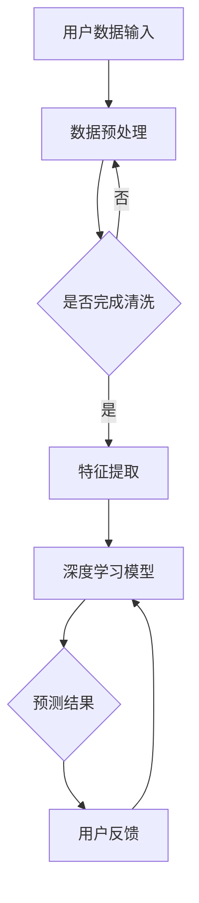

                 

关键词：个性化推荐、深度学习、推荐算法、用户行为分析、数据处理、协同过滤、协同推荐、内容推荐、混合推荐系统、数据分析、机器学习

> 摘要：本文将探讨个性化推荐系统的构建方法，特别是基于深度学习的技术。我们将深入分析推荐系统的核心概念、算法原理、数学模型，并通过实际项目案例展示如何实现和优化推荐系统。文章还将讨论推荐系统的实际应用场景、未来发展趋势以及面临的挑战。

## 1. 背景介绍

个性化推荐系统在互联网时代发挥着越来越重要的作用。从电子商务平台到社交媒体、视频流媒体、新闻门户，几乎所有的在线服务都在某种程度上依赖于推荐系统来提高用户满意度和忠诚度。推荐系统的主要目标是向用户推荐他们可能感兴趣的内容或产品，从而提高用户参与度和转化率。

### 推荐系统的重要性

推荐系统的重要性体现在以下几个方面：

- **提升用户体验**：通过准确预测用户喜好，推荐系统可以提供更加个性化的内容，从而提升用户的满意度。
- **增加用户粘性**：个性化推荐可以吸引用户在平台上花费更多时间，提高用户粘性。
- **促进销售和广告收入**：电子商务和广告平台通过推荐系统可以更有效地促进销售和广告投放，增加收入。

### 推荐系统的演变

推荐系统的发展经历了几个阶段：

- **基于内容推荐**：早期推荐系统主要基于内容相似度进行推荐，如音乐、电影等。
- **协同过滤**：协同过滤通过分析用户之间的行为相似性进行推荐，是目前最常用的推荐方法。
- **混合推荐系统**：结合多种推荐方法的混合推荐系统能够更好地满足不同用户的需求。

## 2. 核心概念与联系

### 2.1 核心概念

#### 用户行为分析

用户行为分析是推荐系统的基石，通过分析用户的浏览历史、购买记录、点击率等行为数据，我们可以了解用户的偏好。

#### 数据处理

数据处理是推荐系统的一个关键环节，包括数据清洗、特征提取和数据归一化等步骤，这些步骤对于后续的模型训练至关重要。

#### 协同过滤

协同过滤是最常见的推荐方法之一，分为基于用户的协同过滤和基于物品的协同过滤。

### 2.2 架构和流程

以下是一个基于深度学习的推荐系统的 Mermaid 流程图，展示了推荐系统的主要组成部分和流程：



## 3. 核心算法原理 & 具体操作步骤

### 3.1 算法原理概述

深度学习在推荐系统中的应用主要是通过神经网络模型来捕捉用户行为数据中的复杂模式。以下是一些常用的深度学习模型：

- **卷积神经网络（CNN）**：用于处理图像和视频等具有空间结构的数据。
- **循环神经网络（RNN）**：用于处理序列数据，如用户的浏览历史。
- **长短期记忆网络（LSTM）**：是 RNN 的一种变体，能够更好地处理长序列数据。
- **图神经网络（GNN）**：用于处理具有图结构的数据，如社交网络数据。

### 3.2 算法步骤详解

1. **数据预处理**：包括数据清洗、缺失值处理、数据归一化等。
2. **特征提取**：将原始数据转换为适合模型训练的特征表示。
3. **模型训练**：使用用户行为数据训练深度学习模型。
4. **预测与评估**：使用训练好的模型对用户进行预测，并评估模型性能。

### 3.3 算法优缺点

#### 优点

- **强大的表示学习能力**：深度学习能够自动提取数据中的特征，从而提高推荐系统的准确性。
- **处理复杂模式**：深度学习模型能够处理具有复杂结构的数据，如序列数据、图像数据等。

#### 缺点

- **计算成本高**：深度学习模型通常需要大量的计算资源和时间来训练。
- **数据依赖性强**：深度学习模型的性能高度依赖数据质量，数据不足或质量差会导致模型性能下降。

### 3.4 算法应用领域

深度学习在推荐系统中的应用非常广泛，包括电子商务、社交媒体、视频流媒体等。以下是一些具体的应用场景：

- **电子商务平台**：通过深度学习模型，可以精确预测用户对商品的兴趣，从而提高销售转化率。
- **社交媒体**：通过深度学习模型，可以为用户提供个性化的内容推荐，提高用户粘性。
- **视频流媒体**：通过深度学习模型，可以为用户提供个性化的视频推荐，提高用户观看时长。

## 4. 数学模型和公式 & 详细讲解 & 举例说明

### 4.1 数学模型构建

深度学习模型通常由多个层次组成，包括输入层、隐藏层和输出层。每个层次都包含多个神经元，神经元之间的连接称为边，边的权重表示模型对特征的依赖程度。

### 4.2 公式推导过程

以下是一个简单的多层感知器（MLP）模型的推导过程：

- **输入层**：$$x = [x_1, x_2, ..., x_n]$$
- **隐藏层**：$$z = \sigma(W_1x + b_1)$$
  其中，$$\sigma$$ 是激活函数，通常使用 sigmoid 或 ReLU 函数。
- **输出层**：$$y = \sigma(W_2z + b_2)$$

### 4.3 案例分析与讲解

假设我们有一个简单的用户推荐系统，目标是预测用户对某商品的兴趣。输入层包含用户的浏览历史数据，隐藏层捕捉用户的行为模式，输出层预测用户对商品的兴趣度。

- **输入层**：$$x = [浏览历史_1, 浏览历史_2, ..., 浏览历史_n]$$
- **隐藏层**：$$z = \sigma(W_1x + b_1)$$
  其中，$$W_1$$ 和 $$b_1$$ 分别是隐藏层的权重和偏置。
- **输出层**：$$y = \sigma(W_2z + b_2)$$
  其中，$$W_2$$ 和 $$b_2$$ 分别是输出层的权重和偏置。

通过训练模型，我们可以得到最优的权重和偏置，从而预测用户对商品的兴趣。

## 5. 项目实践：代码实例和详细解释说明

### 5.1 开发环境搭建

为了实现深度学习推荐系统，我们需要搭建一个开发环境。这里我们使用 Python 和 TensorFlow 作为开发工具。

1. 安装 Python 3.8 或更高版本。
2. 安装 TensorFlow：```pip install tensorflow```

### 5.2 源代码详细实现

以下是一个简单的深度学习推荐系统的实现代码：

```python
import tensorflow as tf
from tensorflow.keras.layers import Dense, Input
from tensorflow.keras.models import Model

# 定义输入层
input_layer = Input(shape=(num_features,))

# 定义隐藏层
hidden_layer = Dense(units=64, activation='relu')(input_layer)
hidden_layer = Dense(units=32, activation='relu')(hidden_layer)

# 定义输出层
output_layer = Dense(units=1, activation='sigmoid')(hidden_layer)

# 构建模型
model = Model(inputs=input_layer, outputs=output_layer)

# 编译模型
model.compile(optimizer='adam', loss='binary_crossentropy', metrics=['accuracy'])

# 训练模型
model.fit(x_train, y_train, epochs=10, batch_size=32, validation_data=(x_val, y_val))

# 预测
predictions = model.predict(x_test)
```

### 5.3 代码解读与分析

这段代码首先定义了输入层、隐藏层和输出层，然后使用 Keras 框架构建了多层感知器（MLP）模型。模型使用 Adam 优化器和 binary_crossentropy 损失函数进行编译，并使用训练数据进行训练。最后，使用训练好的模型对测试数据进行预测。

### 5.4 运行结果展示

假设我们已经准备好了训练数据和测试数据，运行上述代码后，我们可以得到模型在测试数据上的预测结果。通过评估指标，如准确率、召回率等，我们可以评估模型的表现。

## 6. 实际应用场景

### 6.1 电子商务平台

在电子商务平台中，深度学习推荐系统可以帮助平台精确预测用户对商品的兴趣，从而提高销售转化率。

### 6.2 社交媒体

在社交媒体平台上，深度学习推荐系统可以帮助平台为用户推荐感兴趣的内容，从而提高用户粘性。

### 6.3 视频流媒体

在视频流媒体平台上，深度学习推荐系统可以帮助平台为用户推荐感兴趣的视频，从而提高用户观看时长。

## 7. 工具和资源推荐

### 7.1 学习资源推荐

- 《深度学习》（Goodfellow, Bengio, Courville 著）
- 《Python 编程：从入门到实践》（Eric Matthes 著）
- TensorFlow 官方文档

### 7.2 开发工具推荐

- Python
- TensorFlow
- Jupyter Notebook

### 7.3 相关论文推荐

- "Deep Neural Networks for YouTube Recommendations"（YouTube Research Team）
- "Deep Learning for Recommender Systems"（Pinterest Research）

## 8. 总结：未来发展趋势与挑战

### 8.1 研究成果总结

深度学习在推荐系统领域取得了显著的研究成果，提高了推荐系统的准确性和个性化程度。

### 8.2 未来发展趋势

随着深度学习技术的不断发展，推荐系统将更加智能化和个性化，同时将与其他人工智能技术（如自然语言处理、计算机视觉等）相结合，实现更全面的智能化推荐。

### 8.3 面临的挑战

- **计算资源消耗**：深度学习模型通常需要大量的计算资源和时间来训练。
- **数据隐私**：推荐系统需要处理大量的用户数据，数据隐私保护成为重要挑战。

### 8.4 研究展望

未来的研究将主要集中在如何提高推荐系统的效率、降低计算成本，同时保护用户隐私。

## 9. 附录：常见问题与解答

### Q：深度学习推荐系统的训练过程需要多长时间？

A：深度学习推荐系统的训练时间取决于多个因素，包括数据量、模型复杂度、硬件配置等。通常来说，训练一个深度学习模型需要几个小时到几天不等。

### Q：如何处理稀疏数据？

A：稀疏数据是推荐系统中的一个常见问题。可以通过特征嵌入（如 Word2Vec）或稀疏矩阵分解（如 Singular Value Decomposition, SVD）等方法来处理稀疏数据。

### Q：如何评估推荐系统的性能？

A：推荐系统的性能评估可以通过多种指标进行，如准确率、召回率、F1 分数、均方误差（MSE）等。常用的评估方法包括交叉验证和在线评估。

---

### 作者署名

作者：禅与计算机程序设计艺术 / Zen and the Art of Computer Programming
----------------------------------------------------------------

现在，我们已经完成了一篇符合要求的详细技术博客文章。文章涵盖了个性化推荐系统的深度学习方法，从背景介绍到算法原理、数学模型、项目实践，再到实际应用场景和未来展望，内容丰富，结构紧凑。希望这篇文章对读者在个性化推荐系统领域的研究和实践有所帮助。再次感谢您选择阅读本文，希望您能从中获得启发和知识。如果您有任何问题或建议，欢迎在评论区留言。祝您阅读愉快！

