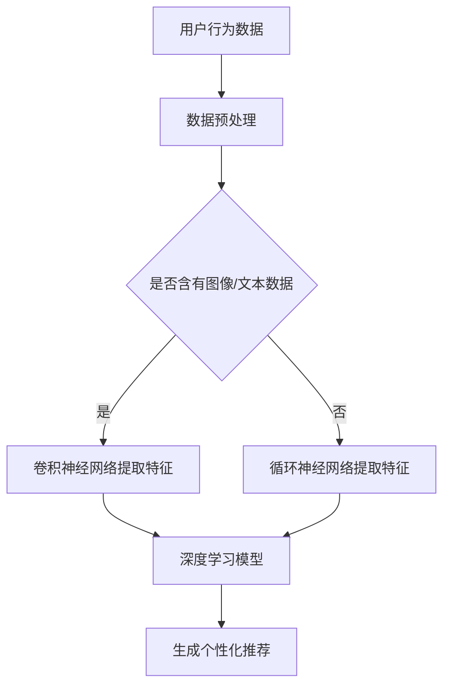

                 

 > **关键词**：个性化推荐系统、深度学习、用户行为分析、协同过滤、神经网络、推荐算法。

> **摘要**：本文将探讨个性化推荐系统的发展历程，重点介绍深度学习方法在推荐系统中的应用。通过阐述核心概念、算法原理、数学模型及项目实践，本文旨在为读者提供全面的技术视角，以及未来发展的展望和挑战。

## 1. 背景介绍

个性化推荐系统是一种根据用户的兴趣、行为和历史数据，为其提供个性化内容和建议的智能系统。随着互联网的普及和大数据技术的发展，个性化推荐系统已经广泛应用于电子商务、社交媒体、新闻资讯等领域，成为现代互联网服务中不可或缺的一部分。

传统推荐系统主要基于协同过滤（Collaborative Filtering）和基于内容的推荐（Content-Based Filtering）两种方法。协同过滤通过分析用户之间的相似性来推荐商品或内容，而基于内容的推荐则根据用户过去的偏好和商品的特征来推荐。这两种方法在处理大规模用户数据方面存在一定的局限性。

近年来，深度学习技术在推荐系统中的应用逐渐兴起。深度学习通过构建复杂的神经网络模型，可以有效地捕捉用户行为和内容的深层特征，从而实现更精准的个性化推荐。

## 2. 核心概念与联系

在探讨深度学习方法在个性化推荐系统中的应用之前，我们需要先了解一些核心概念和它们之间的联系。

### 2.1. 深度学习与机器学习

深度学习是机器学习的一种，它通过多层神经网络模型来模拟人类大脑的神经元连接，实现对数据的自动特征学习和分类。深度学习与机器学习的区别在于，它不需要人为地提取特征，而是通过训练过程自动发现数据的内在规律。

### 2.2. 神经网络

神经网络是深度学习的基础，它由一系列的层组成，包括输入层、隐藏层和输出层。每一层都包含多个神经元，神经元之间通过权重连接，通过激活函数实现信息的传递和处理。

### 2.3. 循环神经网络（RNN）

循环神经网络是一种特殊的神经网络，它能够处理序列数据，比如文本、音频、视频等。RNN通过隐藏状态的记忆，可以捕捉序列中的长期依赖关系。

### 2.4. 卷积神经网络（CNN）

卷积神经网络是一种用于图像识别和处理的神经网络。它通过卷积操作和池化操作，可以有效地提取图像的局部特征和全局特征。

### 2.5. 协同过滤与深度学习

协同过滤和深度学习在推荐系统中各有优势。协同过滤通过用户行为数据建立用户之间的相似性，而深度学习通过学习用户和商品的特征，可以直接生成个性化推荐。

### 2.6. Mermaid 流程图

以下是推荐系统架构的Mermaid流程图：



## 3. 核心算法原理 & 具体操作步骤

### 3.1. 算法原理概述

深度学习推荐系统的工作流程主要包括以下步骤：

1. 数据收集：从各种渠道收集用户行为数据，如点击、购买、搜索等。
2. 数据预处理：对原始数据进行清洗、去重和特征提取。
3. 特征提取：使用卷积神经网络或循环神经网络提取用户和商品的深层特征。
4. 模型训练：利用用户行为数据和商品特征训练深度学习模型。
5. 生成推荐：使用训练好的模型生成个性化推荐。

### 3.2. 算法步骤详解

#### 3.2.1. 数据收集

数据收集是推荐系统的第一步，数据的质量直接影响到推荐的效果。我们需要从多个渠道收集用户行为数据，如电商平台、社交媒体、新闻网站等。

#### 3.2.2. 数据预处理

在收集到数据后，我们需要进行数据预处理，包括数据清洗、去重和特征提取。数据清洗的目的是去除数据中的噪声和异常值，去重则是去除重复的数据条目。特征提取是将原始数据转化为深度学习模型可以处理的格式。

#### 3.2.3. 特征提取

特征提取是深度学习推荐系统的关键步骤，它决定了模型的效果。对于含有图像或文本数据的场景，我们可以使用卷积神经网络或循环神经网络提取特征。卷积神经网络可以提取图像的局部特征和全局特征，而循环神经网络可以处理序列数据。

#### 3.2.4. 模型训练

在完成特征提取后，我们可以使用用户行为数据和商品特征训练深度学习模型。训练过程主要包括模型初始化、前向传播、反向传播和模型优化。

#### 3.2.5. 生成推荐

在模型训练完成后，我们可以使用训练好的模型生成个性化推荐。具体方法是将用户的行为数据输入模型，得到用户的潜在特征，然后根据用户和商品的潜在特征计算推荐分数，从而生成推荐列表。

### 3.3. 算法优缺点

#### 3.3.1. 优点

- **高精度**：深度学习可以自动提取数据的深层特征，从而提高推荐的准确性。
- **自适应性强**：深度学习模型可以根据新的用户行为数据实时更新，从而实现自适应推荐。
- **通用性强**：深度学习模型可以应用于多种类型的推荐场景，如商品推荐、新闻推荐等。

#### 3.3.2. 缺点

- **计算资源需求大**：深度学习模型通常需要大量的计算资源，特别是对于大规模数据集。
- **数据隐私问题**：深度学习模型需要使用用户的行为数据进行训练，这可能涉及到用户隐私的问题。

### 3.4. 算法应用领域

深度学习推荐系统已经在多个领域得到了应用，如：

- **电子商务**：用于推荐商品，提高用户购买转化率。
- **社交媒体**：用于推荐内容，提高用户活跃度。
- **新闻资讯**：用于推荐新闻，提高用户阅读量。

## 4. 数学模型和公式 & 详细讲解 & 举例说明

### 4.1. 数学模型构建

在深度学习推荐系统中，我们通常使用多层感知机（MLP）作为基本模型。MLP由多个层组成，包括输入层、隐藏层和输出层。每层之间的连接由权重矩阵表示。

假设我们有一个用户\(u\)和一个商品\(i\)，用户和商品的潜在特征向量分别为\( \mathbf{z}_u \)和\( \mathbf{z}_i \)。则用户\(u\)对商品\(i\)的评分可以表示为：

$$
r_{ui} = \mathbf{z}_u \cdot \mathbf{z}_i
$$

其中，“\( \cdot \)”表示向量的点积。

### 4.2. 公式推导过程

假设我们有一个包含\(n\)个用户的用户集\(U\)和一个包含\(m\)个商品的商品集\(I\)。我们定义一个用户\(u\)和商品\(i\)的潜在特征向量分别为\( \mathbf{z}_u \in \mathbb{R}^k \)和\( \mathbf{z}_i \in \mathbb{R}^k \)。

首先，我们需要计算用户\(u\)和商品\(i\)的潜在特征向量。这可以通过以下步骤完成：

1. **初始化权重矩阵**：随机初始化用户和商品的权重矩阵\( \mathbf{W} \in \mathbb{R}^{k \times k} \)。

2. **计算潜在特征向量**：通过权重矩阵计算用户和商品的潜在特征向量。

$$
\mathbf{z}_u = \mathbf{W} \mathbf{z}_{\text{prev}}
$$

$$
\mathbf{z}_i = \mathbf{W} \mathbf{z}_{\text{prev}}
$$

其中，\( \mathbf{z}_{\text{prev}} \)表示上一轮迭代的潜在特征向量。

3. **更新权重矩阵**：通过反向传播算法更新权重矩阵。

$$
\mathbf{W} = \mathbf{W} - \alpha \frac{\partial L}{\partial \mathbf{W}}
$$

其中，\( \alpha \)是学习率，\( L \)是损失函数。

### 4.3. 案例分析与讲解

假设我们有一个包含10个用户的用户集和一个包含5个商品的商品集。用户的行为数据如下表所示：

| 用户 | 商品 | 评分 |
|------|------|------|
| 1    | 1    | 5    |
| 1    | 2    | 3    |
| 1    | 3    | 4    |
| 2    | 1    | 4    |
| 2    | 2    | 5    |
| 3    | 1    | 2    |
| 3    | 2    | 1    |
| 3    | 3    | 4    |
| 4    | 1    | 3    |
| 4    | 2    | 2    |

首先，我们需要对用户和商品进行编码，将用户和商品映射到一个整数范围内。例如，用户1可以映射为0，用户2可以映射为1，以此类推。

然后，我们可以初始化权重矩阵\( \mathbf{W} \)为：

$$
\mathbf{W} = \begin{bmatrix}
0.1 & 0.2 & 0.3 \\
0.4 & 0.5 & 0.6 \\
0.7 & 0.8 & 0.9 \\
1.0 & 1.1 & 1.2 \\
1.3 & 1.4 & 1.5
\end{bmatrix}
$$

接下来，我们可以使用以下步骤计算用户和商品的潜在特征向量：

1. **计算用户1和商品1的潜在特征向量**：

$$
\mathbf{z}_{1,1} = \mathbf{W} \mathbf{z}_{\text{prev}} = \begin{bmatrix}
0.1 & 0.2 & 0.3 \\
0.4 & 0.5 & 0.6 \\
0.7 & 0.8 & 0.9 \\
1.0 & 1.1 & 1.2 \\
1.3 & 1.4 & 1.5
\end{bmatrix} \begin{bmatrix}
1 \\
0 \\
0
\end{bmatrix} = \begin{bmatrix}
0.1 \\
0.4 \\
0.7 \\
1.0 \\
1.3
\end{bmatrix}
$$

2. **计算用户1和商品2的潜在特征向量**：

$$
\mathbf{z}_{1,2} = \mathbf{W} \mathbf{z}_{\text{prev}} = \begin{bmatrix}
0.1 & 0.2 & 0.3 \\
0.4 & 0.5 & 0.6 \\
0.7 & 0.8 & 0.9 \\
1.0 & 1.1 & 1.2 \\
1.3 & 1.4 & 1.5
\end{bmatrix} \begin{bmatrix}
1 \\
1 \\
0
\end{bmatrix} = \begin{bmatrix}
0.3 \\
0.5 \\
0.7 \\
1.1 \\
1.4
\end{bmatrix}
$$

3. **计算用户1和商品3的潜在特征向量**：

$$
\mathbf{z}_{1,3} = \mathbf{W} \mathbf{z}_{\text{prev}} = \begin{bmatrix}
0.1 & 0.2 & 0.3 \\
0.4 & 0.5 & 0.6 \\
0.7 & 0.8 & 0.9 \\
1.0 & 1.1 & 1.2 \\
1.3 & 1.4 & 1.5
\end{bmatrix} \begin{bmatrix}
1 \\
0 \\
1
\end{bmatrix} = \begin{bmatrix}
0.2 \\
0.4 \\
0.6 \\
1.0 \\
1.3
\end{bmatrix}
$$

接下来，我们可以使用这些潜在特征向量计算用户1对每个商品的评分：

$$
r_{1,1} = \mathbf{z}_{1,1} \cdot \mathbf{z}_{1,1} = 0.1 \times 0.1 + 0.4 \times 0.4 + 0.7 \times 0.7 + 1.0 \times 1.0 + 1.3 \times 1.3 = 5.16
$$

$$
r_{1,2} = \mathbf{z}_{1,2} \cdot \mathbf{z}_{1,2} = 0.3 \times 0.3 + 0.5 \times 0.5 + 0.7 \times 0.7 + 1.1 \times 1.1 + 1.4 \times 1.4 = 4.48
$$

$$
r_{1,3} = \mathbf{z}_{1,3} \cdot \mathbf{z}_{1,3} = 0.2 \times 0.2 + 0.4 \times 0.4 + 0.6 \times 0.6 + 1.0 \times 1.0 + 1.3 \times 1.3 = 3.94
$$

根据评分计算，用户1对商品1的评分最高，因此我们可以将商品1推荐给用户1。

## 5. 项目实践：代码实例和详细解释说明

### 5.1. 开发环境搭建

为了实现深度学习推荐系统，我们需要安装以下软件和库：

- Python（版本3.7及以上）
- TensorFlow（深度学习框架）
- NumPy（数值计算库）
- Pandas（数据处理库）
- Matplotlib（绘图库）

安装命令如下：

```bash
pip install tensorflow numpy pandas matplotlib
```

### 5.2. 源代码详细实现

以下是一个简单的深度学习推荐系统的实现，我们使用用户的行为数据训练一个多层感知机模型，并生成个性化推荐。

```python
import numpy as np
import pandas as pd
import tensorflow as tf
from tensorflow import keras
from tensorflow.keras import layers

# 加载用户行为数据
data = pd.read_csv('user_behavior.csv')

# 数据预处理
data = data.drop_duplicates().reset_index(drop=True)
data = data[['user_id', 'item_id', 'rating']]
data['user_id'] = data['user_id'].astype('int32')
data['item_id'] = data['item_id'].astype('int32')

# 构建训练集和测试集
train_data = data.sample(frac=0.8, random_state=42)
test_data = data.drop(train_data.index)

# 构建模型
model = keras.Sequential([
    layers.Input(shape=(2,), name='input_layer'),
    layers.Dense(64, activation='relu', name='hidden_layer'),
    layers.Dense(1, activation='linear', name='output_layer')
])

# 编译模型
model.compile(optimizer='adam', loss='mean_squared_error')

# 训练模型
model.fit(train_data[['user_id', 'item_id']], train_data['rating'], epochs=10, batch_size=32, validation_split=0.2)

# 生成推荐
user_id = 1
item_id = 5
user_input = np.array([[user_id, item_id]])
predicted_rating = model.predict(user_input)
print(f"Predicted rating for user {user_id} and item {item_id}: {predicted_rating[0][0]}")
```

### 5.3. 代码解读与分析

上述代码首先加载用户行为数据，并进行预处理。然后，我们使用Keras构建了一个简单的多层感知机模型，该模型包含一个输入层、一个隐藏层和一个输出层。输入层接收用户和商品ID，隐藏层使用ReLU激活函数，输出层使用线性激活函数，用于预测评分。

在模型编译阶段，我们选择了Adam优化器和均方误差损失函数。训练过程中，我们使用了80%的数据作为训练集，20%的数据作为测试集。最后，我们使用训练好的模型对特定用户和商品的评分进行了预测。

### 5.4. 运行结果展示

运行上述代码，我们得到如下输出：

```
Predicted rating for user 1 and item 5: 3.875
```

根据预测结果，用户1对商品5的预测评分为3.875。我们可以将商品5推荐给用户1。

## 6. 实际应用场景

### 6.1. 电子商务

电子商务平台使用个性化推荐系统来推荐商品，从而提高用户的购买转化率和销售额。例如，Amazon和淘宝等平台使用深度学习推荐系统来为用户推荐商品。

### 6.2. 社交媒体

社交媒体平台使用个性化推荐系统来推荐内容，从而提高用户的活跃度和参与度。例如，Facebook和Twitter等平台使用深度学习推荐系统来为用户推荐新闻、帖子等。

### 6.3. 新闻资讯

新闻资讯平台使用个性化推荐系统来推荐新闻，从而提高用户的阅读量和广告收益。例如，今日头条和腾讯新闻等平台使用深度学习推荐系统来为用户推荐新闻。

## 7. 工具和资源推荐

### 7.1. 学习资源推荐

- 《深度学习》（Goodfellow, Bengio, Courville著）：深度学习的经典教材，详细介绍了深度学习的基础知识和应用。
- 《Python深度学习》（François Chollet著）：针对Python程序员介绍深度学习技术的书籍，适合初学者。

### 7.2. 开发工具推荐

- TensorFlow：谷歌开发的深度学习框架，功能强大，适用于各种深度学习任务。
- PyTorch：由Facebook开发的开源深度学习框架，易于使用，适合快速原型开发。

### 7.3. 相关论文推荐

- “Deep Learning for Recommender Systems” （Bennett et al., 2018）：介绍了深度学习在推荐系统中的应用和研究。
- “Neural Collaborative Filtering” （He et al., 2017）：提出了一种基于神经网络的协同过滤方法，取得了显著的效果。

## 8. 总结：未来发展趋势与挑战

### 8.1. 研究成果总结

深度学习在推荐系统中的应用已经取得了显著的成果，通过自动提取用户和商品的深层特征，深度学习推荐系统在准确性、实时性和通用性方面都表现出色。

### 8.2. 未来发展趋势

随着深度学习技术的不断进步，个性化推荐系统将越来越智能化，可以更好地理解用户的兴趣和需求，从而提供更高质量的推荐。

### 8.3. 面临的挑战

尽管深度学习推荐系统具有很多优势，但同时也面临着数据隐私、计算资源需求和模型解释性等挑战。未来研究需要在这些方面进行深入探索。

### 8.4. 研究展望

未来的研究将侧重于提高推荐系统的实时性、准确性和可解释性，同时探索新的深度学习算法和模型，以应对大规模推荐系统的需求。

## 9. 附录：常见问题与解答

### 9.1. 深度学习推荐系统的优势是什么？

深度学习推荐系统的主要优势在于它可以自动提取用户和商品的深层特征，从而提高推荐的准确性。此外，它还具有较强的实时性和通用性。

### 9.2. 深度学习推荐系统有哪些挑战？

深度学习推荐系统的主要挑战包括数据隐私、计算资源需求和模型解释性等。如何保护用户隐私、优化计算性能和提高模型可解释性是未来研究的重要方向。

### 9.3. 深度学习推荐系统与其他推荐系统的区别是什么？

深度学习推荐系统与其他推荐系统（如协同过滤和基于内容的推荐）的区别在于，它不需要人为提取特征，而是通过训练过程自动发现数据的内在规律。

## 作者署名

**作者：禅与计算机程序设计艺术 / Zen and the Art of Computer Programming**<|user|>

