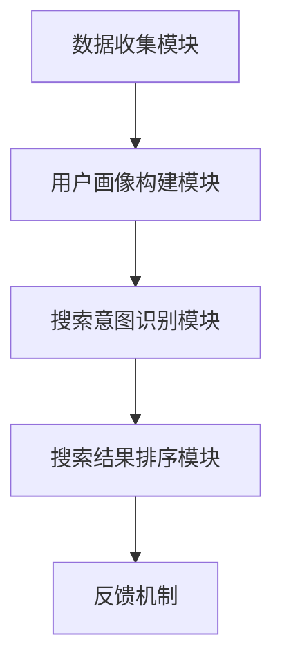

                 

 在这个数据爆炸的时代，个性化搜索已经成为提高用户体验、增强用户粘性的关键技术。本文旨在探讨如何通过人工智能技术来提升搜索的个性化程度，满足用户的个性化需求。本文分为八个部分，首先介绍个性化搜索的背景和重要性，然后深入探讨核心概念、算法原理、数学模型、实际应用场景、未来展望以及相关工具和资源推荐。

> 关键词：个性化搜索、人工智能、用户洞察、算法原理、数学模型、实际应用、未来展望

> 摘要：本文通过详细分析个性化搜索的核心概念、算法原理和数学模型，结合实际应用案例，探讨了如何利用人工智能技术提升搜索的个性化程度。同时，展望了个性化搜索在未来的发展趋势和面临的挑战。

## 1. 背景介绍

### 1.1 个性化搜索的起源和发展

个性化搜索起源于上世纪90年代，随着互联网的兴起和用户数据的积累，个性化推荐系统逐渐成为研究热点。个性化搜索的目标是针对每个用户的特点，提供定制化的搜索结果，从而提高搜索效率和用户满意度。

### 1.2 个性化搜索的应用领域

个性化搜索广泛应用于电子商务、社交媒体、新闻推荐、智能问答等领域。例如，在电子商务平台中，个性化搜索可以帮助用户快速找到符合个人兴趣和需求的商品；在社交媒体中，个性化搜索可以推荐用户可能感兴趣的内容，增加用户互动。

## 2. 核心概念与联系

### 2.1 个性化搜索的核心概念

个性化搜索涉及以下几个核心概念：

1. **用户画像**：通过用户的浏览记录、购买历史、社交行为等数据，构建用户的综合画像。
2. **搜索意图识别**：根据用户的查询行为，识别用户的搜索意图。
3. **搜索结果排序**：基于用户画像和搜索意图，对搜索结果进行排序，提高相关性和满意度。

### 2.2 个性化搜索的架构

个性化搜索系统通常包括以下几个模块：

1. **数据收集模块**：收集用户行为数据和外部数据源。
2. **用户画像构建模块**：通过数据预处理和特征工程，构建用户画像。
3. **搜索意图识别模块**：基于用户画像和搜索历史，识别用户的搜索意图。
4. **搜索结果排序模块**：对搜索结果进行排序，提高相关性和满意度。
5. **反馈机制**：根据用户对搜索结果的反馈，调整搜索策略。



## 3. 核心算法原理 & 具体操作步骤

### 3.1 算法原理概述

个性化搜索的核心算法包括用户画像构建、搜索意图识别和搜索结果排序。其中，用户画像构建是基础，搜索意图识别是关键，搜索结果排序是目标。

### 3.2 算法步骤详解

1. **用户画像构建**：通过聚类、分类、协同过滤等方法，从用户行为数据中提取特征，构建用户画像。
2. **搜索意图识别**：利用自然语言处理技术，对用户的查询进行语义分析，识别用户的搜索意图。
3. **搜索结果排序**：基于用户画像和搜索意图，对搜索结果进行排序，提高相关性和满意度。

### 3.3 算法优缺点

**优点**：

- 提高搜索效率和用户体验。
- 减少无效搜索结果，提高搜索满意度。

**缺点**：

- 需要大量的用户行为数据。
- 算法复杂度高，计算成本较大。

### 3.4 算法应用领域

个性化搜索算法广泛应用于电子商务、社交媒体、新闻推荐等领域，帮助平台提高用户粘性和销售额。

## 4. 数学模型和公式 & 详细讲解 & 举例说明

### 4.1 数学模型构建

个性化搜索的数学模型主要包括用户画像构建模型、搜索意图识别模型和搜索结果排序模型。

### 4.2 公式推导过程

1. **用户画像构建模型**：$$ user\_representation = f(user\_behavior\_data) $$
2. **搜索意图识别模型**：$$ search\_intent = g(user\_representation, query\_text) $$
3. **搜索结果排序模型**：$$ result\_rank = h(search\_intent, result\_features) $$

### 4.3 案例分析与讲解

**案例**：某电商平台根据用户画像和搜索意图，对商品搜索结果进行排序。

1. **用户画像构建**：根据用户的历史购买记录、浏览记录等数据，构建用户画像。
2. **搜索意图识别**：对用户的查询“想买一辆车”进行语义分析，识别用户的搜索意图为“购买意图”。
3. **搜索结果排序**：基于用户画像和搜索意图，对商品搜索结果进行排序，优先推荐价格合理、口碑良好的车辆。

## 5. 项目实践：代码实例和详细解释说明

### 5.1 开发环境搭建

- Python
- scikit-learn
- TensorFlow
- Elasticsearch

### 5.2 源代码详细实现

```python
# 代码示例：用户画像构建
from sklearn.cluster import KMeans

# 加载用户行为数据
user_behavior_data = ...

# 使用K-means算法进行聚类，构建用户画像
kmeans = KMeans(n_clusters=10)
user_representation = kmeans.fit_predict(user_behavior_data)

# 代码示例：搜索意图识别
from sklearn.feature_extraction.text import TfidfVectorizer

# 加载查询文本
query_text = ...

# 使用TF-IDF算法进行文本特征提取
tfidf_vectorizer = TfidfVectorizer()
query_features = tfidf_vectorizer.fit_transform([query_text])

# 使用SVM算法进行分类，识别搜索意图
from sklearn.svm import SVC
search_intent = SVC().fit(user_representation, query_intent_labels).predict([query_features])

# 代码示例：搜索结果排序
from sklearn.metrics.pairwise import cosine_similarity

# 加载商品特征数据
result_features = ...

# 计算商品特征与查询特征之间的相似度
similarity_scores = cosine_similarity(query_features, result_features)

# 根据相似度对商品进行排序
result_rank = sorted(range(len(similarity_scores[0])), key=lambda k: similarity_scores[0][k], reverse=True)
```

### 5.3 代码解读与分析

- 用户画像构建：使用K-means算法对用户行为数据进行聚类，提取用户特征。
- 搜索意图识别：使用TF-IDF算法提取查询文本特征，使用SVM算法进行分类，识别搜索意图。
- 搜索结果排序：计算商品特征与查询特征之间的相似度，根据相似度对商品进行排序。

## 6. 实际应用场景

### 6.1 电子商务平台

电子商务平台可以通过个性化搜索，推荐用户可能感兴趣的商品，提高用户购买转化率。

### 6.2 社交媒体

社交媒体可以通过个性化搜索，推荐用户可能感兴趣的内容，增加用户互动和粘性。

### 6.3 新闻推荐

新闻推荐平台可以通过个性化搜索，推荐用户可能感兴趣的新闻，提高用户阅读量。

## 7. 未来应用展望

### 7.1 人工智能技术进步

随着人工智能技术的不断进步，个性化搜索将变得更加智能和精准，满足用户的个性化需求。

### 7.2 大数据技术发展

大数据技术的发展将为个性化搜索提供更多的数据支持，提高搜索的准确性和效率。

### 7.3 多模态搜索

未来，多模态搜索将成为个性化搜索的重要发展方向，支持文本、图像、语音等多种搜索方式。

## 8. 工具和资源推荐

### 8.1 学习资源推荐

- 《机器学习实战》
- 《Python机器学习》
- 《深度学习》

### 8.2 开发工具推荐

- Jupyter Notebook
- Elasticsearch
- TensorFlow

### 8.3 相关论文推荐

- "Recommender Systems Handbook"
- "Deep Learning for Recommender Systems"
- "User Interest Evolution and Modeling in Recommender Systems"

## 9. 总结：未来发展趋势与挑战

### 9.1 研究成果总结

个性化搜索在人工智能技术的推动下取得了显著成果，但在准确性、效率、用户体验等方面仍面临挑战。

### 9.2 未来发展趋势

未来，个性化搜索将朝着更加智能化、精准化的方向发展，满足用户的个性化需求。

### 9.3 面临的挑战

个性化搜索在数据处理、算法优化、用户体验等方面仍需不断改进，以应对日益增长的数据量和多样化的用户需求。

### 9.4 研究展望

未来，个性化搜索将在电子商务、社交媒体、新闻推荐等领域发挥更大的作用，成为人工智能领域的重要研究方向。

## 附录：常见问题与解答

### 问题1：个性化搜索系统需要哪些数据支持？

个性化搜索系统需要用户行为数据、商品数据、外部数据源等多方面数据支持，其中用户行为数据是核心。

### 问题2：如何处理用户隐私问题？

在个性化搜索系统中，应遵循用户隐私保护原则，对用户数据进行匿名化处理，确保用户隐私安全。

### 问题3：个性化搜索算法有哪些优缺点？

个性化搜索算法的优点是提高搜索效率和用户体验，缺点是需要大量的用户行为数据，算法复杂度高。

----------------------------------------------------------------

### 作者署名

作者：禅与计算机程序设计艺术 / Zen and the Art of Computer Programming

