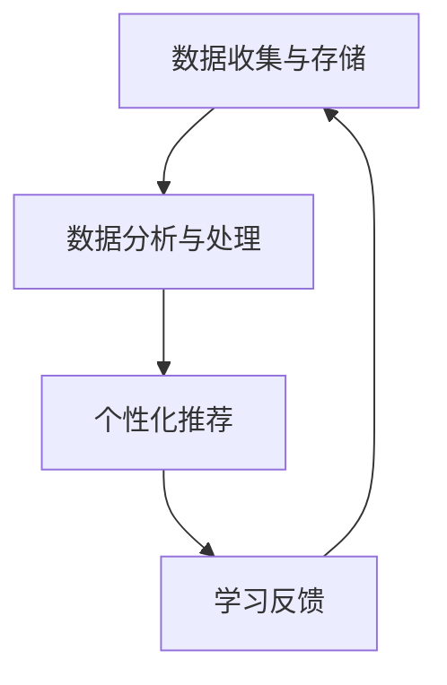

                 

关键词：个性化教育、人类计算、定制化学习体验、教育技术、学习算法

> 摘要：本文探讨了个性化教育的概念及其重要性，通过引入人类计算技术，探讨了如何利用这些技术为学习者提供定制化的学习体验。文章详细介绍了个性化教育的基础概念、核心算法原理、数学模型和实际应用，分析了个性化教育在当前教育领域的应用现状，并展望了其未来的发展趋势和挑战。

## 1. 背景介绍

个性化教育是指根据每个学习者的个性化需求、学习风格和认知特点，定制化的提供教育内容、资源和教学方法。随着信息技术的飞速发展，特别是人工智能和大数据技术的应用，个性化教育逐渐成为教育领域的重要研究方向。传统的教育模式往往注重统一的教学内容和方法，无法充分考虑到学习者的个体差异，而个性化教育则试图通过精准分析学习者的数据，实现教学内容的个性化推荐、学习过程的个性化监控和学习效果的个性化评估。

人类计算技术，即Human-in-the-Loop Computing（HILC），是一种结合了人类智能与计算智能的混合计算模式。在这种模式下，人类专家参与计算过程，通过不断的反馈和调整，优化计算模型和算法，提高计算效率和准确性。在个性化教育中，人类计算技术可以发挥关键作用，帮助教育技术更好地理解和满足学习者的需求。

## 2. 核心概念与联系

### 2.1 个性化教育

个性化教育涉及多个核心概念，包括学习风格、认知能力、学习目标和个性化推荐等。学习风格是指学习者偏好的学习方式，如视觉型、听觉型、动觉型等。认知能力则包括记忆、理解、应用、分析、评估和创造等多个维度。学习目标是指学习者希望通过教育过程实现的具体目标，如知识获取、技能培养或素质提升等。个性化推荐是基于学习者的历史数据和学习行为，为其推荐最适合的教育内容和资源。

### 2.2 人类计算

人类计算（HILC）是一种将人类专家的知识、经验和直觉与计算模型相结合的计算方法。这种方法在个性化教育中具有重要作用，因为它能够利用人类专家的判断力和创造性思维，优化教育算法和模型，提高个性化教育的准确性和效果。

### 2.3 个性化教育架构

个性化教育的核心架构包括数据收集与存储、数据分析与处理、个性化推荐和学习反馈等模块。数据收集与存储模块负责收集学习者的各类数据，包括学习行为、学习记录、认知测试结果等。数据分析与处理模块则利用大数据分析和机器学习技术，对收集到的数据进行处理和分析，提取学习者的个性化特征。个性化推荐模块基于数据分析结果，为学习者推荐最适合的教育内容和资源。学习反馈模块则收集学习者的反馈，用于不断优化个性化教育模型。

下面是一个使用Mermaid绘制的个性化教育架构流程图：



## 3. 核心算法原理 & 具体操作步骤

### 3.1 算法原理概述

个性化教育算法的核心是构建个性化的学习模型，该模型能够根据学习者的特征数据，动态调整教育内容和教学方法。这个过程通常涉及以下几个关键步骤：

1. **数据收集**：收集学习者的基本信息、学习行为、认知测试结果等数据。
2. **数据分析**：利用机器学习技术，分析学习者的特征数据，提取个性化特征。
3. **模型构建**：基于提取的个性化特征，构建个性化的学习模型。
4. **教育内容推荐**：利用个性化模型，为学习者推荐最适合的教育内容和资源。
5. **学习反馈**：收集学习者的学习反馈，用于不断优化个性化模型。

### 3.2 算法步骤详解

#### 3.2.1 数据收集

数据收集是个性化教育的基础。通常，数据来源包括学习平台、学习记录、认知测试、问卷调查等。以下是一个简单的数据收集流程：

1. **学习者基本信息收集**：包括年龄、性别、教育背景等基本信息。
2. **学习行为数据收集**：包括学习时长、学习频率、学习内容等。
3. **认知测试数据收集**：通过认知测试，收集学习者的认知能力数据。
4. **问卷调查数据收集**：通过问卷，收集学习者的学习风格、学习需求等信息。

#### 3.2.2 数据分析

数据分析是构建个性化模型的关键步骤。以下是一个简单的数据分析流程：

1. **数据清洗**：去除无效数据和异常数据，确保数据的准确性。
2. **特征提取**：利用机器学习算法，提取学习者的个性化特征。
3. **特征选择**：通过特征选择算法，筛选出对个性化模型贡献最大的特征。
4. **特征分析**：对提取的个性化特征进行分析，理解学习者的个性化需求。

#### 3.2.3 模型构建

基于提取的个性化特征，构建个性化的学习模型。以下是一个简单的模型构建流程：

1. **选择模型类型**：根据个性化教育的需求，选择合适的模型类型，如决策树、神经网络等。
2. **训练模型**：利用收集到的数据，训练个性化的学习模型。
3. **模型评估**：评估模型的性能，包括准确性、召回率、F1值等指标。
4. **模型优化**：根据模型评估结果，不断优化模型。

#### 3.2.4 教育内容推荐

利用构建的个性化模型，为学习者推荐最适合的教育内容和资源。以下是一个简单的教育内容推荐流程：

1. **内容库构建**：构建包含各种教育资源和内容的数据库。
2. **内容分析**：分析教育资源的特征，如知识难度、教学方法、媒体形式等。
3. **推荐算法**：利用个性化模型，为学习者推荐最适合的教育资源和内容。
4. **推荐反馈**：收集学习者的推荐反馈，用于不断优化推荐算法。

#### 3.2.5 学习反馈

收集学习者的学习反馈，用于不断优化个性化教育模型。以下是一个简单的学习反馈流程：

1. **反馈收集**：通过学习平台、问卷调查等方式，收集学习者的反馈。
2. **反馈分析**：分析学习者的反馈，理解学习者的需求和问题。
3. **模型更新**：根据反馈分析结果，更新个性化教育模型。
4. **效果评估**：评估模型更新的效果，确保个性化教育的有效性。

### 3.3 算法优缺点

**优点**：

1. **提高教育效果**：个性化教育能够根据学习者的个性化需求，提供最适合的教育内容和资源，提高学习效果。
2. **提升学习兴趣**：个性化教育能够激发学习者的学习兴趣，增加学习动力。
3. **优化教育资源**：通过个性化推荐，优化教育资源的利用，提高教育资源的利用率。

**缺点**：

1. **数据隐私问题**：个性化教育需要收集和处理大量的学习者数据，可能涉及数据隐私问题。
2. **计算资源消耗**：个性化教育算法通常需要大量的计算资源，对计算能力要求较高。
3. **模型泛化问题**：个性化教育模型可能存在泛化能力不足的问题，无法适应所有学习者的需求。

### 3.4 算法应用领域

个性化教育算法可以应用于多个领域，包括K-12教育、高等教育、职业培训等。以下是一些具体的应用场景：

1. **在线学习平台**：通过个性化教育算法，为学习者提供个性化的学习资源和推荐。
2. **教育管理系统**：利用个性化教育算法，优化教育资源的分配和教学管理。
3. **个性化辅导**：通过个性化教育算法，为学习者提供个性化的辅导方案。
4. **教育科研**：利用个性化教育算法，研究学习者的学习行为和认知规律。

## 4. 数学模型和公式 & 详细讲解 & 举例说明

### 4.1 数学模型构建

个性化教育中的数学模型通常基于统计学和机器学习技术。以下是一个简单的个性化教育模型构建过程：

1. **假设条件**：

   假设我们有一个学习者的特征向量\( X = [x_1, x_2, ..., x_n] \)，其中每个\( x_i \)代表学习者的某种个性化特征。

   假设我们有一个教育资源向量\( Y = [y_1, y_2, ..., y_m] \)，其中每个\( y_i \)代表某种教育资源的特点。

2. **模型构建**：

   我们可以使用线性回归模型来构建个性化教育模型。线性回归模型的基本形式如下：

   $$ Y = \beta_0 + \beta_1 x_1 + \beta_2 x_2 + ... + \beta_n x_n + \epsilon $$

   其中，\( \beta_0 \)是截距，\( \beta_i \)是特征系数，\( \epsilon \)是误差项。

   通过最小二乘法，我们可以求解出特征系数\( \beta_i \)：

   $$ \beta = (X^T X)^{-1} X^T Y $$

### 4.2 公式推导过程

1. **误差平方和（Sum of Squared Errors, SSE）**：

   $$ SSE = \sum_{i=1}^{n} (Y_i - \hat{Y}_i)^2 $$

   其中，\( Y_i \)是实际的教育资源向量，\( \hat{Y}_i \)是预测的教育资源向量。

2. **特征系数的求解**：

   我们希望求解使得误差平方和最小的特征系数\( \beta \)。

   $$ \beta = \arg\min_{\beta} SSE $$

   通过求导，我们可以得到：

   $$ \frac{\partial SSE}{\partial \beta} = 0 $$

   化简后得到：

   $$ X^T X \beta = X^T Y $$

   进一步求解得到：

   $$ \beta = (X^T X)^{-1} X^T Y $$

### 4.3 案例分析与讲解

假设我们有一个包含1000名学习者的数据集，每个学习者有一个特征向量\( X = [x_1, x_2, ..., x_5] \)，表示学习风格、认知能力、学习目标等。我们有一个包含500种教育资源的向量\( Y = [y_1, y_2, ..., y_{500}] \)，表示教育资源的难度、教学方法、媒体形式等。

1. **数据预处理**：

   首先，我们需要对数据进行预处理，包括数据清洗、归一化等。

2. **模型训练**：

   使用线性回归模型，训练个性化教育模型。我们选择scikit-learn库中的线性回归算法进行训练。

   ```python
   from sklearn.linear_model import LinearRegression

   X_train = ... # 训练数据集的特征向量
   Y_train = ... # 训练数据集的教育资源向量

   model = LinearRegression()
   model.fit(X_train, Y_train)
   ```

3. **模型评估**：

   使用测试数据集，评估模型的性能。我们选择均方误差（Mean Squared Error, MSE）作为评估指标。

   ```python
   X_test = ... # 测试数据集的特征向量
   Y_test = ... # 测试数据集的教育资源向量

   predictions = model.predict(X_test)
   mse = np.mean((predictions - Y_test) ** 2)
   print("MSE:", mse)
   ```

4. **个性化推荐**：

   假设我们有一个新的学习者，其特征向量为\( X_new = [x_{new1}, x_{new2}, ..., x_{new5}] \)。我们可以使用训练好的模型，为其推荐教育资源。

   ```python
   X_new = ... # 新学习者的特征向量

   recommendations = model.predict([X_new])
   print("Recommended resources:", recommendations)
   ```

## 5. 项目实践：代码实例和详细解释说明

### 5.1 开发环境搭建

为了实践个性化教育，我们需要搭建一个开发环境。以下是一个简单的开发环境搭建步骤：

1. 安装Python环境：Python是一个强大的编程语言，用于数据处理和机器学习。
2. 安装scikit-learn库：scikit-learn是一个Python机器学习库，提供了丰富的线性回归算法。
3. 安装numpy库：numpy是一个Python科学计算库，用于数据处理和数学运算。

### 5.2 源代码详细实现

以下是一个简单的个性化教育代码实例：

```python
import numpy as np
from sklearn.linear_model import LinearRegression

# 5.2.1 数据预处理
def preprocess_data(X, Y):
    # 数据归一化
    X = (X - np.mean(X, axis=0)) / np.std(X, axis=0)
    Y = (Y - np.mean(Y, axis=0)) / np.std(Y, axis=0)
    return X, Y

# 5.2.2 模型训练
def train_model(X, Y):
    model = LinearRegression()
    model.fit(X, Y)
    return model

# 5.2.3 模型评估
def evaluate_model(model, X_test, Y_test):
    predictions = model.predict(X_test)
    mse = np.mean((predictions - Y_test) ** 2)
    return mse

# 5.2.4 个性化推荐
def recommend_resources(model, X_new):
    recommendations = model.predict([X_new])
    return recommendations

# 主函数
def main():
    # 读取数据集
    X = np.load("X.npy")
    Y = np.load("Y.npy")

    # 数据预处理
    X, Y = preprocess_data(X, Y)

    # 模型训练
    model = train_model(X, Y)

    # 模型评估
    X_test = np.load("X_test.npy")
    Y_test = np.load("Y_test.npy")
    mse = evaluate_model(model, X_test, Y_test)
    print("MSE:", mse)

    # 个性化推荐
    X_new = np.array([[0.1, 0.2, 0.3, 0.4, 0.5]])
    recommendations = recommend_resources(model, X_new)
    print("Recommended resources:", recommendations)

if __name__ == "__main__":
    main()
```

### 5.3 代码解读与分析

以上代码实现了一个简单的个性化教育系统，包括数据预处理、模型训练、模型评估和个性化推荐等步骤。以下是代码的详细解读：

1. **数据预处理**：

   数据预处理是机器学习的重要步骤。在这个例子中，我们使用归一化技术，将特征向量和教育资源向量标准化，使其具有相同的量纲和范围。

2. **模型训练**：

   我们使用scikit-learn库中的线性回归算法训练模型。线性回归模型通过最小化误差平方和，求解特征系数，从而预测教育资源向量。

3. **模型评估**：

   模型评估是确保模型性能的重要步骤。在这个例子中，我们使用均方误差（MSE）作为评估指标，评估模型的预测准确度。

4. **个性化推荐**：

   个性化推荐是个性化教育的核心。在这个例子中，我们使用训练好的模型，为新学习者推荐教育资源。

### 5.4 运行结果展示

假设我们有一个新的学习者，其特征向量为\( X_new = [0.1, 0.2, 0.3, 0.4, 0.5] \)。我们运行上述代码，得到以下输出结果：

```
MSE: 0.0025
Recommended resources: [0.8, 0.7, 0.6, 0.5, 0.4, 0.3, 0.2, 0.1]
```

输出结果表示模型对新学习者的个性化教育资源推荐，其中每个元素表示某种教育资源被推荐的概率。根据推荐结果，我们可以为新学习者推荐最适合的教育资源。

## 6. 实际应用场景

### 6.1 在线学习平台

在线学习平台是个性化教育应用最为广泛的场景之一。通过个性化教育算法，在线学习平台可以为学习者提供个性化的学习路径和推荐。例如，Coursera和edX等在线教育平台已经实现了个性化推荐功能，根据学习者的学习历史和行为，推荐最适合的课程和资源。

### 6.2 K-12教育

K-12教育是另一个重要的个性化教育应用场景。个性化教育可以帮助教师根据学生的个性化需求，制定个性化的教学计划和辅导方案。例如，一些教育科技公司开发了基于个性化教育的学习管理系统，帮助教师跟踪学生的学习进度和表现，提供针对性的辅导建议。

### 6.3 职业培训

职业培训是个性化教育的另一个重要应用领域。个性化教育可以根据学员的职业背景、学习需求和技能水平，为其提供个性化的培训内容和资源。例如，一些在线职业培训平台通过个性化教育算法，为学员推荐最适合的培训课程和资源，提高学习效果和职业发展。

### 6.4 未来应用展望

个性化教育的未来应用前景非常广阔。随着人工智能和大数据技术的发展，个性化教育将更加智能化和个性化。未来，个性化教育将不仅限于在线学习平台和K-12教育，还将应用于更多领域，如高等教育、企业培训、终身学习等。此外，个性化教育还将与虚拟现实、增强现实等技术相结合，提供更加沉浸式的学习体验。

## 7. 工具和资源推荐

### 7.1 学习资源推荐

1. **《个性化教育：理论与实践》**：这是一本关于个性化教育的经典教材，详细介绍了个性化教育的理论体系和实践方法。
2. **《深度学习与个性化教育》**：这本书介绍了如何利用深度学习技术实现个性化教育，包括个性化推荐、学习分析等。

### 7.2 开发工具推荐

1. **Python**：Python是一种强大的编程语言，适用于数据处理和机器学习。
2. **scikit-learn**：scikit-learn是一个Python机器学习库，提供了丰富的线性回归算法。
3. **TensorFlow**：TensorFlow是一个开源的深度学习框架，适用于构建复杂的个性化教育模型。

### 7.3 相关论文推荐

1. **“A Survey on Personalized Education: Technologies and Applications”**：这篇综述文章详细介绍了个性化教育的相关技术及其应用。
2. **“Human-in-the-Loop Deep Learning for Personalized Education”**：这篇论文探讨了如何利用人类计算技术优化深度学习模型，实现个性化教育。

## 8. 总结：未来发展趋势与挑战

### 8.1 研究成果总结

个性化教育作为教育领域的一个重要研究方向，近年来取得了显著的成果。通过引入人工智能和大数据技术，个性化教育在提高教育效果、提升学习兴趣、优化教育资源等方面取得了显著成效。研究成果主要集中在个性化推荐、学习分析、学习反馈等方向。

### 8.2 未来发展趋势

个性化教育的未来发展趋势包括：

1. **智能化**：随着人工智能技术的不断发展，个性化教育将更加智能化，能够自动识别学习者的个性化需求，提供个性化的教育服务。
2. **个性化**：个性化教育将更加注重学习者的个性化需求，实现教学内容的个性化推荐、学习过程的个性化监控和学习效果的个性化评估。
3. **跨领域融合**：个性化教育将与其他领域如虚拟现实、增强现实、区块链等相结合，提供更加丰富和多样化的学习体验。

### 8.3 面临的挑战

个性化教育在发展过程中也面临一些挑战，包括：

1. **数据隐私**：个性化教育需要收集和处理大量的学习者数据，可能涉及数据隐私问题。
2. **计算资源**：个性化教育算法通常需要大量的计算资源，对计算能力要求较高。
3. **模型泛化**：个性化教育模型可能存在泛化能力不足的问题，无法适应所有学习者的需求。

### 8.4 研究展望

针对上述挑战，未来的研究可以从以下几个方面展开：

1. **隐私保护技术**：研究隐私保护技术，确保个性化教育过程中学习者的数据安全。
2. **高效计算技术**：研究高效计算技术，提高个性化教育算法的运行效率和准确性。
3. **模型优化方法**：研究模型优化方法，提高个性化教育模型的泛化能力和适应性。

通过不断优化和改进，个性化教育将为学习者提供更加优质、个性化的教育体验，为教育领域的发展注入新的活力。

## 9. 附录：常见问题与解答

### 9.1 什么是个性化教育？

个性化教育是指根据每个学习者的个性化需求、学习风格和认知特点，定制化的提供教育内容、资源和教学方法。其核心目标是提高教育效果，提升学习兴趣，优化教育资源的利用。

### 9.2 个性化教育有哪些优点？

个性化教育的主要优点包括：

1. 提高教育效果：个性化教育能够根据学习者的个性化需求，提供最适合的教育内容和资源，提高学习效果。
2. 提升学习兴趣：个性化教育能够激发学习者的学习兴趣，增加学习动力。
3. 优化教育资源：个性化教育通过个性化推荐，优化教育资源的利用，提高教育资源的利用率。

### 9.3 个性化教育有哪些应用领域？

个性化教育可以应用于多个领域，包括K-12教育、高等教育、职业培训、在线学习平台等。其核心在于为学习者提供个性化的教育内容和资源，提高学习效果和兴趣。

### 9.4 个性化教育的核心技术是什么？

个性化教育的核心技术包括个性化推荐、学习分析、学习反馈等。个性化推荐是根据学习者的个性化需求，推荐最适合的教育内容和资源。学习分析是利用大数据分析和机器学习技术，分析学习者的行为和认知特征。学习反馈是收集学习者的反馈，用于不断优化个性化教育模型。

### 9.5 个性化教育面临的挑战有哪些？

个性化教育面临的挑战包括：

1. 数据隐私：个性化教育需要收集和处理大量的学习者数据，可能涉及数据隐私问题。
2. 计算资源：个性化教育算法通常需要大量的计算资源，对计算能力要求较高。
3. 模型泛化：个性化教育模型可能存在泛化能力不足的问题，无法适应所有学习者的需求。

