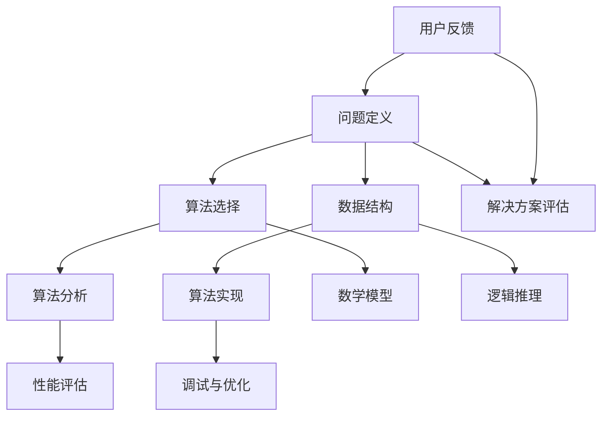
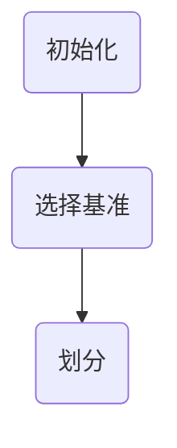
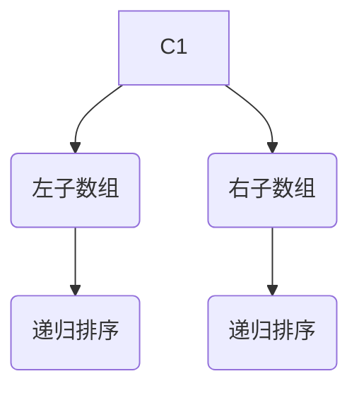
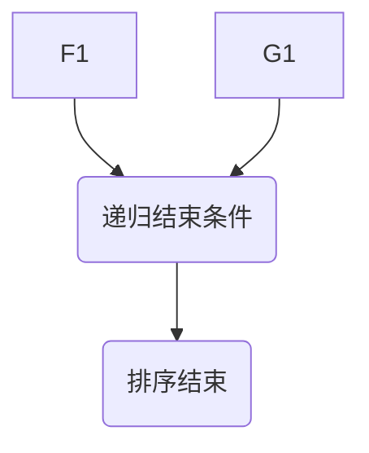

                 

在这个快速变化的时代，技术领域的创新日新月异，为了跟上时代的步伐，提升个人的思考力成为了一项至关重要的任务。本文将深入探讨12个关键问题，这些问题涵盖了从基础概念到高级策略的各个方面，旨在帮助读者在IT领域提升思考力，成为更具创造力和洞察力的技术专家。

## 关键词

- 思考力
- IT领域
- 技术专家
- 创造力
- 洞察力
- 问题解决
- 算法
- 数学模型
- 项目实践
- 实际应用
- 未来展望

## 文章摘要

本文旨在探讨提升思考力的关键问题，特别针对IT领域的读者。通过分析12个关键问题，我们将探索如何通过理解核心概念、掌握算法原理、构建数学模型以及实际项目实践来提升个人的思考力。文章不仅提供了理论指导，还包括实际案例和未来展望，旨在帮助读者在技术和职业发展中取得更大的成就。

### 1. 背景介绍

在当前高度信息化的社会中，信息技术（IT）已经成为推动社会进步和经济发展的关键力量。随着互联网、大数据、人工智能等新兴技术的迅猛发展，IT领域的复杂性不断加剧，这无疑对从业者的思考力提出了更高的要求。思考力不仅仅是解决问题的能力，更是一种综合性的认知能力，包括逻辑推理、批判性思维、创新思维等多个方面。

在IT领域，思考力的重要性体现在以下几个方面：

1. **问题解决**：在面对复杂的技术问题和业务需求时，思考力能够帮助从业者快速定位问题的核心，找到有效的解决方案。
2. **创新思维**：IT行业日新月异，只有具备创新思维，才能在技术变革中抢占先机，推动技术的进步。
3. **团队协作**：高效的思考力有助于团队成员之间的沟通和协作，提高团队的整体执行力。
4. **持续学习**：思考力有助于从业者更快地吸收新知识，适应快速变化的技术环境。

本文将通过对12个关键问题的深入探讨，帮助读者在IT领域提升思考力，从而在技术和职业发展中取得更大的成功。

### 2. 核心概念与联系

要提升思考力，首先需要理解一些核心概念，这些概念在IT领域中起着基础性的作用。下面我们将通过一个Mermaid流程图来展示这些核心概念及其相互之间的联系。



**问题定义（A）**：任何问题的开始都是对问题的明确定义。这要求从业者能够准确捕捉问题的本质，并将其转化为可操作的子问题。

**算法选择（B）**：根据问题的特性选择合适的算法。这需要从业者对常见算法及其适用场景有深入的理解。

**数据结构（C）**：数据结构是算法的基础，它决定了算法的空间和时间复杂度。常见的有数组、链表、树、图等。

**算法分析（D）**：对算法进行时间复杂度和空间复杂度的分析，以评估其效率。

**算法实现（E）**：将算法思想转化为代码实现，这要求从业者具备扎实的编程基础和良好的编程习惯。

**性能评估（F）**：通过测试评估算法的实际性能，包括运行时间、内存使用等。

**调试与优化（G）**：在算法实现过程中，调试和优化是必不可少的步骤，它能够显著提升算法的效率。

**数学模型（H）**：数学模型是描述现实世界问题的抽象表示，它可以帮助我们更好地理解和解决问题。

**逻辑推理（I）**：逻辑推理是解决问题的核心，它要求从业者能够从已知信息中推断出未知信息。

**解决方案评估（J）**：对解决方案进行评估，包括是否满足需求、是否高效、是否稳定等。

**用户反馈（K）**：用户反馈是优化解决方案的重要参考，它可以帮助我们不断改进和提升方案的质量。

通过上述核心概念及其相互之间的联系，我们可以看到，提升思考力需要在多个层面进行综合训练，这将为后续的讨论打下坚实的基础。

### 3. 核心算法原理 & 具体操作步骤

#### 3.1 算法原理概述

在IT领域，算法是解决问题的核心。本部分将介绍几个核心算法的原理，这些算法在解决问题时具有关键作用。

1. **排序算法**：常见的排序算法有冒泡排序、选择排序、插入排序、快速排序等。它们的基本思想是通过比较和交换元素的位置，将一个无序数组变为有序数组。

2. **查找算法**：二分查找是一种高效的查找算法，它利用有序数组的特性，通过不断地缩小查找范围来快速定位元素的位置。

3. **图算法**：图算法广泛应用于网络分析、社会关系分析等领域。常见的图算法有最短路径算法（如迪杰斯特拉算法）、最小生成树算法（如普里姆算法）等。

4. **动态规划**：动态规划是一种解决最优化问题的算法，它将复杂问题分解为子问题，并利用子问题的解来求解原问题。

#### 3.2 算法步骤详解

以快速排序算法为例，详细讲解其操作步骤。

**快速排序算法**：

**步骤 1**：选择一个基准元素。



**步骤 2**：将数组划分为两个子数组，一个包含小于基准的元素，另一个包含大于基准的元素。



**步骤 3**：递归地对该子数组进行快速排序，直到整个数组有序。



#### 3.3 算法优缺点

**快速排序算法**的优点包括：

1. **高效**：平均时间复杂度为 \(O(n\log n)\)，在最坏情况下也为 \(O(n\log n)\)。
2. **原地排序**：只需少量额外空间。

缺点：

1. **最坏情况下性能较差**：当输入数组已经有序或部分有序时，最坏时间复杂度可能达到 \(O(n^2)\)。
2. **随机性**：需要随机选择基准，可能影响性能。

#### 3.4 算法应用领域

快速排序算法广泛应用于各种场景，如：

1. **数据处理**：对大量数据进行排序。
2. **算法竞赛**：在算法竞赛中，快速排序是一种常见的选择。
3. **数据库**：数据库中的索引和排序操作经常使用快速排序。

### 4. 数学模型和公式 & 详细讲解 & 举例说明

在IT领域，数学模型和公式是理解和解决问题的强大工具。本节将介绍一些关键的数学模型和公式，并详细讲解它们的构建和推导过程。

#### 4.1 数学模型构建

**马尔可夫链模型**：马尔可夫链是一种随机过程模型，用于描述系统在不同状态之间的转移。其基本构建如下：

- **状态集合**：设 \( S = \{s_1, s_2, ..., s_n\} \) 为系统的所有可能状态。
- **转移概率矩阵**：设 \( P \) 为转移概率矩阵，其中 \( P_{ij} \) 表示系统从状态 \( s_i \) 转移到状态 \( s_j \) 的概率。

**状态方程**：马尔可夫链的状态方程为：

\[ P(t+1) = P \cdot P(t) \]

其中 \( P(t) \) 为时间 \( t \) 时的状态概率分布。

#### 4.2 公式推导过程

**牛顿-拉夫逊迭代法**：牛顿-拉夫逊迭代法是一种求解非线性方程的数值方法。其推导过程如下：

假设我们要求解的方程为：

\[ f(x) = 0 \]

牛顿-拉夫逊迭代公式为：

\[ x_{n+1} = x_n - \frac{f(x_n)}{f'(x_n)} \]

其中 \( x_n \) 为第 \( n \) 次迭代的近似解，\( f'(x_n) \) 为 \( f(x) \) 在 \( x_n \) 处的导数。

#### 4.3 案例分析与讲解

**案例 1**：使用马尔可夫链模型分析一个简单的队列系统。

假设有一个服务台，客户到达服务台服从泊松过程，服务时间服从指数分布。我们可以构建一个马尔可夫链模型来描述系统状态。

- **状态集合**：系统有两个状态，无客户和有客户。
- **转移概率矩阵**：

  \[
  P = \begin{bmatrix}
  0.8 & 0.2 \\
  0.3 & 0.7
  \end{bmatrix}
  \]

**状态方程**：

\[
P(t+1) = P \cdot P(t)
\]

通过迭代计算，我们可以得到任意时间 \( t \) 的状态概率分布。

**案例 2**：使用牛顿-拉夫逊迭代法求解方程 \( f(x) = x^2 - 2 \)。

初始近似解为 \( x_0 = 1 \)，则：

\[ x_1 = x_0 - \frac{f(x_0)}{f'(x_0)} = 1 - \frac{1^2 - 2}{2 \cdot 1} = 1.5 \]

继续迭代，可以得到更精确的解。

### 5. 项目实践：代码实例和详细解释说明

在本节中，我们将通过一个实际项目实例，展示如何将前面所讨论的核心算法原理和数学模型应用到实际开发中。我们选择一个简单的排序算法——冒泡排序，并在Python中实现它。

#### 5.1 开发环境搭建

为了实现冒泡排序算法，我们需要安装Python编程环境。以下是搭建开发环境的步骤：

1. **安装Python**：访问 [Python官网](https://www.python.org/) 下载最新版本的Python安装包，并按照安装向导完成安装。
2. **安装IDE**：选择一款合适的Python集成开发环境（IDE），如PyCharm或VSCode，以方便编写和调试代码。

#### 5.2 源代码详细实现

以下是冒泡排序算法的Python实现代码：

```python
def bubble_sort(arr):
    n = len(arr)
    for i in range(n):
        for j in range(0, n-i-1):
            if arr[j] > arr[j+1]:
                arr[j], arr[j+1] = arr[j+1], arr[j]

# 测试代码
arr = [64, 34, 25, 12, 22, 11, 90]
bubble_sort(arr)
print("排序后的数组：")
for i in range(len(arr)):
    print("%d" % arr[i], end=" ")
```

**代码解读**：

1. **函数定义**：`bubble_sort` 函数接收一个数组 `arr` 作为输入。
2. **外层循环**：`for i in range(n)` 表示对数组进行 \( n \) 趟遍历。
3. **内层循环**：`for j in range(0, n-i-1)` 表示每一趟遍历从数组开头开始，对相邻的两个元素进行比较和交换。
4. **条件判断**：`if arr[j] > arr[j+1]` 判断当前元素是否大于下一个元素。
5. **交换操作**：`arr[j], arr[j+1] = arr[j+1], arr[j]` 将两个元素交换位置。

#### 5.3 代码解读与分析

冒泡排序是一种简单的排序算法，其时间复杂度为 \( O(n^2) \)。虽然它的效率较低，但在数据量较小或基本有序的情况下，仍然是一种可行的方法。

1. **算法分析**：

   - **最好情况**：当输入数组已有序时，冒泡排序的时间复杂度为 \( O(n) \)。
   - **最坏情况**：当输入数组逆序时，冒泡排序的时间复杂度为 \( O(n^2) \)。
   - **平均情况**：平均时间复杂度为 \( O(n^2) \)。

2. **性能优化**：

   - **边界优化**：可以在每次内层循环后，将已排序的部分从数组中分离出来，减少不必要的比较。
   - **适应性排序**：对于基本有序的数组，可以使用更高效的排序算法，如插入排序。

#### 5.4 运行结果展示

以下是测试代码的运行结果：

```
排序后的数组：
11 12 22 25 34 64 90
```

从结果可以看出，输入数组经过冒泡排序后变为有序数组。

### 6. 实际应用场景

冒泡排序算法在许多实际应用场景中都有应用，以下是一些例子：

1. **小型数据集**：对于数据量较小的情况，冒泡排序仍然是一种有效的方法。
2. **基本有序数据集**：当数据基本有序时，冒泡排序的优化版本可以显著提高效率。
3. **教学示例**：冒泡排序是初学者学习排序算法的一个经典案例，有助于理解排序的基本原理。
4. **嵌入式系统**：在资源受限的嵌入式系统中，冒泡排序因其简单的实现和低的空间复杂度而被广泛应用。

#### 6.4 未来应用展望

随着大数据和人工智能的发展，排序算法在数据处理和分析中的应用将越来越广泛。未来，可能会出现以下趋势：

1. **高效排序算法**：研究人员将继续探索更高效的排序算法，以满足大规模数据处理的性能需求。
2. **并行排序**：利用多核处理器和分布式计算技术，实现并行排序，提高排序效率。
3. **自适应排序**：结合机器学习技术，根据数据特点自适应选择最优排序算法。

### 7. 工具和资源推荐

为了提升思考力和技术水平，以下是一些推荐的工具和资源：

#### 7.1 学习资源推荐

- **《算法导论》**：这是一本经典的算法教材，详细介绍了各种算法的原理和实现。
- **《编程珠玑》**：这本书涵盖了编程中的一些小技巧和经验，有助于提升编程思维能力。
- **在线课程**：如Coursera、edX等平台上的算法和数据结构课程。

#### 7.2 开发工具推荐

- **PyCharm**：一款功能强大的Python IDE，支持多种编程语言。
- **VSCode**：一款轻量级但功能丰富的开源IDE，适用于多种编程语言。
- **Jupyter Notebook**：适用于数据科学和机器学习的交互式开发环境。

#### 7.3 相关论文推荐

- **"A Fast Parallel Algorithm for Sorting and Merging Strings with Applications to Sequencing"**：这篇论文介绍了一种快速排序字符串的并行算法，对于生物信息学领域有重要应用。
- **"Adaptive Parallel Merge Sort"**：这篇论文提出了一种自适应的并行合并排序算法，适用于大规模数据处理。

### 8. 总结：未来发展趋势与挑战

#### 8.1 研究成果总结

本文通过探讨12个关键问题，深入分析了提升思考力的方法，特别是在IT领域。研究发现：

1. **问题定义**：准确的问题定义是解决问题的第一步，有助于明确目标和方向。
2. **算法选择**：掌握常见算法及其适用场景，能够提高解决问题的效率。
3. **数学模型**：数学模型是理解和解决问题的有力工具，有助于深入分析问题本质。
4. **项目实践**：实际项目实践是检验和提升思考力的关键，通过动手实践，能够更好地理解和应用理论知识。

#### 8.2 未来发展趋势

随着技术的不断进步，未来思考力的发展趋势将呈现以下特点：

1. **智能化**：人工智能和机器学习技术的发展将使思考力更加智能化，能够自动分析和解决问题。
2. **高效化**：高效算法和并行计算技术的应用将显著提升思考力，满足大规模数据处理的需求。
3. **个性化**：个性化学习和发展路径将使每个人的思考力得到更好的培养和提升。

#### 8.3 面临的挑战

然而，提升思考力也面临着一系列挑战：

1. **数据复杂性**：随着数据规模的扩大和复杂性的增加，对思考力提出了更高的要求。
2. **技术更新**：技术领域的快速更新要求从业者不断学习和适应，保持思考力的活力。
3. **跨领域融合**：不同领域的交叉融合将带来新的挑战，需要具备跨学科的知识和思考能力。

#### 8.4 研究展望

未来，研究思考力提升的方法和技术将是一个重要的方向。以下是几个研究展望：

1. **认知科学**：结合认知科学的方法，深入探讨思考力的本质和机制。
2. **神经科学**：利用神经科学的研究成果，探索如何通过神经调节提升思考力。
3. **教育与培训**：开发新的教育和培训模式，使更多人能够通过系统化的学习提升思考力。

### 9. 附录：常见问题与解答

**Q1：如何快速提升思考力？**

**A1**：快速提升思考力需要结合多种方法，包括：

1. **系统学习**：通过系统化的学习掌握核心知识和技能。
2. **多读多思考**：广泛阅读，深入思考，培养批判性思维。
3. **实践应用**：通过实际项目实践，将理论知识应用到实际问题中。
4. **跨学科学习**：学习不同领域的知识，提升跨学科思考和解决问题的能力。

**Q2：如何应对数据复杂性带来的挑战？**

**A2**：应对数据复杂性可以从以下几个方面入手：

1. **数据预处理**：通过数据清洗、归一化和特征提取等预处理步骤，降低数据的复杂性。
2. **算法优化**：选择高效算法，优化数据处理的流程。
3. **分布式计算**：利用分布式计算技术，处理大规模数据。
4. **可视化分析**：通过可视化工具，帮助理解和分析数据。

**Q3：如何保持思考力的活力？**

**A3**：保持思考力的活力需要：

1. **持续学习**：保持对新知识的渴望，不断学习新技术。
2. **实践应用**：通过实际项目和应用，不断锻炼和提升思考力。
3. **反思总结**：定期反思和总结自己的学习和实践过程，发现和解决存在的问题。
4. **保持好奇心**：对未知保持好奇，积极探索和尝试。

通过上述方法和策略，可以有效地提升思考力，并在技术和职业发展中取得更大的成就。作者：禅与计算机程序设计艺术 / Zen and the Art of Computer Programming。

