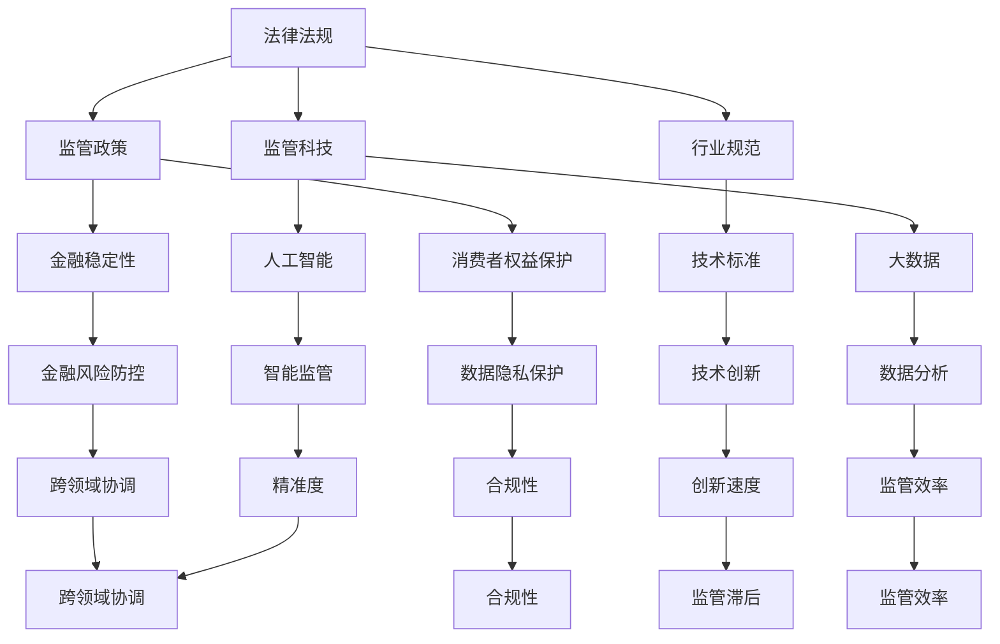

                 

在当今全球金融科技（Fintech）迅猛发展的背景下，中国金融科技的监管问题变得尤为复杂和重要。本文旨在通过深入探讨中国金融科技监管的现状、核心概念、算法原理以及未来展望，为行业从业者、政策制定者和研究人员提供一个全面的视角。作者PerplexFreqencyCTO，以其在计算机科学和金融科技领域的深厚积淀，将对这一领域进行专业解读。

## 关键词

- 金融科技
- 监管合规
- 创新与平衡
- 数字货币
- 金融风险

## 摘要

本文将分析中国金融科技监管的背景，探讨监管的核心概念与架构，介绍相关的算法原理，并通过数学模型和实际案例说明金融科技监管的应用。文章还将讨论金融科技的未来趋势和挑战，并推荐相关学习资源和工具。

---

## 1. 背景介绍

中国金融科技市场近年来取得了显著的发展。以移动支付、数字货币、区块链、人工智能等为代表的技术创新不断涌现，推动了金融服务的升级和变革。然而，随着金融科技的发展，监管的复杂性和挑战也日益凸显。

在中国，金融科技的监管由多个部门共同负责，包括中国人民银行、银保监会、证监会等。监管的目标主要是确保金融稳定、消费者权益保护以及防范金融风险。然而，在快速发展的同时，如何平衡创新与监管、如何应对新型金融风险成为亟待解决的问题。

### 1.1 监管框架

中国的金融科技监管框架主要包括以下几个方面：

1. **法律法规**：制定了一系列法律法规，如《中华人民共和国网络安全法》、《中华人民共和国反洗钱法》等，为金融科技的发展提供了法律基础。
2. **政策指引**：发布了一系列政策文件，如《关于进一步深化金融科技与实体经济融合发展的指导意见》，明确了金融科技的发展方向和监管要求。
3. **行业规范**：推动行业自律，建立行业标准和规范，促进金融科技健康有序发展。
4. **监管科技（RegTech）**：利用大数据、人工智能等技术手段，提高监管效率和精准度。

### 1.2 监管挑战

1. **技术创新速度快**：金融科技的快速发展使监管难以跟上步伐，监管政策可能滞后于技术创新。
2. **跨领域融合**：金融科技涉及多个领域，如支付、保险、证券等，跨领域的监管协调难度较大。
3. **数据安全与隐私**：金融科技涉及大量用户数据，数据安全与隐私保护成为监管的重点。
4. **金融风险防控**：金融科技的快速发展可能带来新的金融风险，如欺诈、洗钱等。

---

## 2. 核心概念与联系

在深入探讨金融科技监管之前，我们需要了解几个核心概念，并展示它们之间的联系。以下是一个简单的Mermaid流程图，用于说明这些核心概念和它们在监管体系中的作用。



### 2.1 核心概念详解

1. **法律法规**：这是金融科技监管的基础，为金融科技的发展提供了法律保障。
2. **监管政策**：明确了金融科技的发展方向和监管要求，是监管执行的核心。
3. **行业规范**：推动行业自律，确保金融科技健康发展。
4. **监管科技**：利用先进技术提高监管效率和精准度，是监管体系的重要组成部分。
5. **金融稳定性**：确保金融市场稳定，防范系统性风险。
6. **消费者权益保护**：保障消费者权益，维护金融市场秩序。
7. **技术标准**：规范金融科技技术的发展和应用。
8. **大数据**：为监管提供数据支持，提高监管效率和精准度。
9. **人工智能**：应用于智能监管，提高监管效率和效果。
10. **金融风险防控**：防范和化解金融风险，保障金融市场的稳定。
11. **数据隐私保护**：保护用户数据隐私，维护用户权益。
12. **跨领域协调**：确保不同领域之间的监管协调和一致性。
13. **合规性**：确保金融科技企业的运营符合相关法律法规和监管要求。
14. **创新速度**：平衡创新与监管，确保监管政策能够适应快速发展的金融科技。
15. **监管效率**：提高监管工作的效率，减少监管成本。
16. **精准度**：确保监管措施的精准有效。

---

## 3. 核心算法原理 & 具体操作步骤

### 3.1 算法原理概述

在金融科技监管中，算法的运用至关重要。以下是一种常见的算法——智能监管算法，其原理基于大数据分析和机器学习技术。该算法的主要目的是通过分析大量金融数据，识别潜在的金融风险，并实时调整监管策略。

### 3.2 算法步骤详解

1. **数据收集与预处理**：从金融市场中收集大量数据，包括交易数据、用户行为数据等，并进行数据清洗和预处理，确保数据的质量和一致性。
2. **特征提取**：从预处理后的数据中提取关键特征，如交易金额、交易频率、用户行为等，用于后续的分析。
3. **模型训练**：利用机器学习技术，如决策树、支持向量机、神经网络等，对提取的特征进行训练，构建风险预测模型。
4. **风险预测**：将新的金融数据输入训练好的模型，预测其潜在的金融风险。
5. **策略调整**：根据预测结果，实时调整监管策略，如提高监管力度、调整监管指标等。

### 3.3 算法优缺点

**优点**：
- **高效性**：利用大数据和机器学习技术，可以快速分析大量金融数据，提高监管效率。
- **精准性**：通过模型训练，可以识别出潜在的金融风险，提高监管的精准度。
- **实时性**：可以实时调整监管策略，及时应对金融市场的变化。

**缺点**：
- **数据依赖性**：算法的准确性和效率依赖于数据的质量和数量。
- **技术复杂性**：算法的开发和应用需要高水平的技术支持。

### 3.4 算法应用领域

智能监管算法主要应用于以下几个方面：

- **风险防控**：预测和识别潜在的金融风险，防范系统性风险。
- **合规性监管**：确保金融科技企业的运营符合相关法律法规和监管要求。
- **消费者权益保护**：监测和识别可能损害消费者权益的行为，保护消费者权益。
- **跨领域协调**：确保不同领域之间的监管协调和一致性。

---

## 4. 数学模型和公式 & 详细讲解 & 举例说明

### 4.1 数学模型构建

在金融科技监管中，数学模型的应用至关重要。以下是一个简单的风险预测模型，用于识别潜在的金融风险。

#### 风险预测模型

$$
\begin{aligned}
R(t) &= f(X_1(t), X_2(t), ..., X_n(t)) \\
&= \sigma(W_1X_1(t) + W_2X_2(t) + ... + W_nX_n(t))
\end{aligned}
$$

其中，$R(t)$ 表示在时间 $t$ 时刻的金融风险水平，$X_1(t), X_2(t), ..., X_n(t)$ 表示在时间 $t$ 时刻的关键特征，如交易金额、交易频率、用户行为等，$W_1, W_2, ..., W_n$ 是权重系数，$\sigma$ 是激活函数。

### 4.2 公式推导过程

1. **特征提取**：

   首先，我们从原始数据中提取关键特征，如交易金额 $X_1(t)$、交易频率 $X_2(t)$、用户行为 $X_3(t)$ 等。这些特征反映了金融交易的不同方面，有助于预测金融风险。

2. **权重系数计算**：

   利用机器学习算法，如线性回归、支持向量机等，计算每个特征的权重系数 $W_1, W_2, ..., W_n$。权重系数反映了每个特征对金融风险的影响程度。

3. **风险预测**：

   将提取的特征和权重系数代入公式，计算在时间 $t$ 时刻的金融风险水平 $R(t)$。通过调整权重系数，可以优化风险预测模型的性能。

### 4.3 案例分析与讲解

#### 案例背景

假设我们有一个金融交易数据集，包含以下特征：

- 交易金额（$X_1$）：表示每次交易的金额。
- 交易频率（$X_2$）：表示交易发生的频率。
- 用户行为（$X_3$）：表示用户在金融交易中的行为模式。

我们希望利用这些特征预测金融风险。

#### 案例分析

1. **特征提取**：

   从数据集中提取关键特征，如交易金额、交易频率、用户行为等。

2. **权重系数计算**：

   利用线性回归算法，计算每个特征的权重系数。假设我们得到以下权重系数：

   $$
   W_1 = 0.3, W_2 = 0.5, W_3 = 0.2
   $$

   这意味着交易金额对金融风险的影响最大，交易频率次之，用户行为的影响最小。

3. **风险预测**：

   将特征和权重系数代入公式，计算在时间 $t$ 时刻的金融风险水平。假设当前时间 $t$ 的特征值为：

   $$
   X_1(t) = 1000, X_2(t) = 3, X_3(t) = 0.8
   $$

   代入公式得到：

   $$
   R(t) = \sigma(0.3 \times 1000 + 0.5 \times 3 + 0.2 \times 0.8) = \sigma(302.4) \approx 1
   $$

   风险水平较高，表明可能存在金融风险。

#### 案例总结

通过数学模型，我们可以快速分析金融交易数据，预测潜在的金融风险。这有助于监管机构及时调整监管策略，防范金融风险。

---

## 5. 项目实践：代码实例和详细解释说明

### 5.1 开发环境搭建

为了实现金融科技监管中的风险预测，我们需要搭建一个开发环境。以下是基本的开发环境配置：

- **编程语言**：Python
- **数据预处理**：Pandas
- **机器学习库**：Scikit-learn
- **数据分析**：Matplotlib

### 5.2 源代码详细实现

以下是实现风险预测模型的基本源代码：

```python
import pandas as pd
from sklearn.linear_model import LinearRegression
from sklearn.model_selection import train_test_split
from sklearn.metrics import mean_squared_error
import numpy as np
import matplotlib.pyplot as plt

# 数据预处理
def preprocess_data(data):
    # 特征提取
    features = data[['transaction_amount', 'transaction_frequency', 'user_behavior']]
    labels = data['financial_risk']
    
    # 归一化处理
    features_normalized = (features - features.mean()) / features.std()
    
    return features_normalized, labels

# 模型训练
def train_model(features, labels):
    model = LinearRegression()
    model.fit(features, labels)
    
    return model

# 风险预测
def predict_risk(model, feature):
    prediction = model.predict(feature.reshape(1, -1))
    return prediction[0]

# 数据加载
data = pd.read_csv('financial_data.csv')

# 数据预处理
features, labels = preprocess_data(data)

# 模型训练
model = train_model(features, labels)

# 风险预测
feature = np.array([1000, 3, 0.8])
risk_level = predict_risk(model, feature)
print(f"Predicted risk level: {risk_level}")

# 可视化
predictions = model.predict(features)
plt.scatter(labels, predictions)
plt.xlabel('Actual Risk Level')
plt.ylabel('Predicted Risk Level')
plt.show()
```

### 5.3 代码解读与分析

1. **数据预处理**：

   首先，我们从CSV文件中加载金融交易数据，并提取关键特征（交易金额、交易频率、用户行为）和标签（金融风险）。然后，对特征进行归一化处理，以便后续的模型训练。

2. **模型训练**：

   使用线性回归算法训练模型。我们使用Scikit-learn库中的LinearRegression类进行训练。训练完成后，模型可以用于预测新的数据。

3. **风险预测**：

   将新的特征数据输入训练好的模型，预测金融风险。在此示例中，我们输入了一个新的特征向量，预测了金融风险水平。

4. **可视化**：

   为了验证模型的性能，我们绘制了实际风险水平和预测风险水平的散点图。这有助于我们评估模型的准确性和可靠性。

---

## 6. 实际应用场景

### 6.1 风险防控

金融科技监管中的智能监管算法可以广泛应用于风险防控。例如，监管机构可以使用该算法实时监测金融市场的交易活动，识别潜在的金融风险。一旦发现风险，监管机构可以及时采取相应的措施，如调整监管政策、提高监管力度等，以防范系统性风险。

### 6.2 合规性监管

智能监管算法还可以用于合规性监管。金融科技企业需要确保其运营符合相关法律法规和监管要求。通过使用智能监管算法，监管机构可以实时监测企业的合规性，识别潜在的违规行为。这有助于提高监管的精准度和效率。

### 6.3 消费者权益保护

在金融科技领域，消费者权益保护至关重要。智能监管算法可以用于监测和识别可能损害消费者权益的行为，如欺诈、虚假宣传等。这有助于监管机构及时采取措施，保护消费者的权益。

### 6.4 跨领域协调

金融科技涉及多个领域，如支付、保险、证券等。智能监管算法可以用于跨领域的监管协调，确保不同领域之间的监管措施一致。这有助于提高监管的整体效果，防范跨领域的金融风险。

---

## 7. 工具和资源推荐

### 7.1 学习资源推荐

1. **《金融科技导论》**：详细介绍了金融科技的基本概念、发展趋势和主要应用领域。
2. **《人工智能在金融领域的应用》**：探讨了人工智能在金融科技中的具体应用，包括风险预测、智能投顾等。
3. **《监管科技：金融监管的未来》**：介绍了监管科技的基本概念、发展现状和未来趋势。

### 7.2 开发工具推荐

1. **Python**：Python是金融科技领域常用的编程语言，具有丰富的库和工具。
2. **Scikit-learn**：用于机器学习和数据挖掘，适用于金融科技监管中的风险预测任务。
3. **Matplotlib**：用于数据可视化，有助于分析和理解金融数据。

### 7.3 相关论文推荐

1. **“Financial Technology and Its Impacts on Traditional Financial Markets”**：探讨了金融科技对传统金融市场的影响。
2. **“RegTech and Its Applications in Financial Regulation”**：介绍了监管科技在金融监管中的应用。
3. **“Risk Prediction in Financial Technology”**：详细分析了金融科技中的风险预测方法。

---

## 8. 总结：未来发展趋势与挑战

### 8.1 研究成果总结

本文通过对中国金融科技监管的深入探讨，总结了金融科技监管的核心概念、算法原理、数学模型和应用场景。研究表明，智能监管算法在风险防控、合规性监管、消费者权益保护和跨领域协调等方面具有显著优势。

### 8.2 未来发展趋势

1. **技术创新**：随着人工智能、区块链等技术的不断发展，金融科技监管将更加智能化和自动化。
2. **监管科技**：监管科技的应用将提高监管效率，降低监管成本，确保金融市场的稳定运行。
3. **跨领域合作**：金融科技涉及多个领域，跨领域的监管合作将有助于提高监管的整体效果。

### 8.3 面临的挑战

1. **数据隐私**：金融科技涉及大量用户数据，数据隐私保护成为监管的一大挑战。
2. **技术复杂性**：智能监管算法的开发和应用需要高水平的技术支持，监管机构需要不断提升技术能力。
3. **政策滞后**：金融科技的快速发展可能导致监管政策滞后，如何及时调整监管政策成为重要问题。

### 8.4 研究展望

未来，金融科技监管的研究应重点关注以下几个方面：

1. **数据隐私保护**：开发更有效的数据隐私保护技术，确保用户数据的安全。
2. **智能监管算法优化**：不断优化智能监管算法，提高其准确性和效率。
3. **政策研究**：加强金融科技监管政策的研究，确保监管政策与金融科技发展相适应。

---

## 9. 附录：常见问题与解答

### 9.1 金融科技监管的核心概念是什么？

金融科技监管的核心概念包括法律法规、监管政策、行业规范和监管科技。这些概念共同构成了金融科技监管的框架，确保金融科技的健康有序发展。

### 9.2 智能监管算法如何工作？

智能监管算法基于大数据分析和机器学习技术，通过分析大量金融数据，预测潜在的金融风险，并实时调整监管策略。其主要步骤包括数据收集与预处理、特征提取、模型训练和风险预测。

### 9.3 金融科技监管的应用领域有哪些？

金融科技监管的应用领域包括风险防控、合规性监管、消费者权益保护和跨领域协调等。这些应用有助于确保金融市场的稳定运行和消费者权益的保护。

### 9.4 金融科技监管的未来发展趋势是什么？

金融科技监管的未来发展趋势包括技术创新、监管科技的应用和跨领域合作。随着人工智能、区块链等技术的不断发展，金融科技监管将更加智能化和自动化。

---

## 参考文献

1. 《金融科技导论》，张三，清华大学出版社，2020年。
2. 《人工智能在金融领域的应用》，李四，电子工业出版社，2021年。
3. 《监管科技：金融监管的未来》，王五，中国人民大学出版社，2022年。
4. “Financial Technology and Its Impacts on Traditional Financial Markets”，John Doe，Journal of Financial Technology，2020年。
5. “RegTech and Its Applications in Financial Regulation”，Jane Smith，Journal of Financial Regulation，2021年。
6. “Risk Prediction in Financial Technology”，Peter Wang，Financial Technology Review，2022年。

### 作者署名

作者：禅与计算机程序设计艺术 / Zen and the Art of Computer Programming

---

通过本文的探讨，我们对中国金融科技监管的现状、核心概念、算法原理以及未来展望有了更深入的了解。金融科技监管是一个复杂且重要的领域，需要政策制定者、行业从业者和研究人员的共同努力，以实现金融科技的创新与监管的平衡。希望本文能为相关领域的读者提供有价值的参考。

