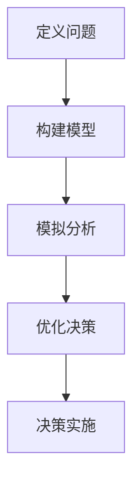

                 

关键词：模型思维、管理洞悉力、人工智能、技术架构、软件工程、战略规划

> 摘要：本文将探讨如何通过丰富模型思维，提升管理者的洞悉力。通过深入分析模型思维的核心概念、算法原理、数学模型及其实际应用，我们旨在为管理者提供一种系统性的思维框架，帮助他们更有效地应对复杂的技术挑战和管理任务。

## 1. 背景介绍

在信息技术高速发展的今天，企业所面临的技术挑战和管理任务日益复杂。管理者需要具备不仅仅是技术专长，更需要拥有强大的洞悉力，以便在纷繁复杂的环境中做出明智的决策。而模型思维作为一种强大的工具，正日益受到重视。通过模型思维，管理者可以更清晰地理解问题本质，更有效地制定战略规划，更高效地执行管理任务。

### 模型思维的重要性

模型思维是一种通过构建模型来理解和解决问题的方式。在信息技术领域，模型思维的重要性不言而喻：

- **抽象复杂性**：模型思维可以帮助管理者将复杂的系统问题抽象成更简单的模型，从而更容易理解和解决。
- **预见性**：通过构建模型，管理者可以模拟不同情境下的结果，从而预见可能的问题并提前做好准备。
- **沟通效率**：模型作为一种可视化的工具，可以有效地帮助团队成员理解管理者的意图和决策逻辑，提高沟通效率。

### 管理者洞悉力的要求

管理者的洞悉力是指其理解复杂环境、快速识别问题、制定有效策略的能力。为了提升洞悉力，管理者需要具备以下几个方面的能力：

- **系统性思维**：能够从全局视角看待问题，理解各个部分之间的相互作用。
- **逻辑分析**：能够通过逻辑推理分析问题的根本原因，并提出解决方案。
- **适应变化**：能够快速适应新环境，应对突发事件。
- **决策能力**：能够在有限信息下做出明智的决策。

## 2. 核心概念与联系

在深入讨论模型思维之前，我们需要先了解几个核心概念，以及它们之间的联系。

### 2.1 模型思维的概念

模型思维是一种思考方式，通过构建模型来理解和解决问题。它包括以下几个步骤：

1. **定义问题**：明确需要解决的问题是什么。
2. **构建模型**：根据问题的特点，选择合适的模型来描述问题。
3. **模拟分析**：通过模型模拟不同的情境，分析可能的结果。
4. **优化决策**：根据模拟结果，调整模型参数，优化决策。

### 2.2 关键概念联系

**概念联系：**

- **模型与问题**：模型是对现实世界的抽象和简化，是解决问题的工具。
- **模型与算法**：算法是解决问题的方法，通常需要在模型的基础上进行设计和实现。
- **模型与数据**：数据是构建模型的基础，通过分析数据，可以更好地理解问题。
- **模型与决策**：模型可以帮助管理者更好地理解问题和预测结果，从而做出更明智的决策。

### 2.3 Mermaid 流程图

下面是一个简单的 Mermaid 流程图，展示了模型思维的核心概念及其联系：



## 3. 核心算法原理 & 具体操作步骤

### 3.1 算法原理概述

模型思维的核心算法是一种基于数据驱动的决策支持系统。其基本原理是通过构建数学模型，分析数据，得出结论，从而支持管理者的决策。

**主要步骤：**

1. **数据收集**：收集与问题相关的数据。
2. **模型构建**：根据数据的特征，选择合适的数学模型。
3. **模型优化**：通过模拟和分析，不断优化模型参数。
4. **决策支持**：利用优化后的模型，为管理者提供决策支持。

### 3.2 算法步骤详解

**步骤 1：数据收集**

数据收集是构建模型的第一步。需要收集与问题相关的各种数据，包括历史数据、实时数据等。数据来源可以是内部系统、第三方数据源等。

**步骤 2：模型构建**

模型构建是根据数据的特征，选择合适的数学模型。常见的数学模型包括线性回归、决策树、神经网络等。选择模型时需要考虑模型的复杂度、计算效率和预测准确性。

**步骤 3：模型优化**

模型优化是通过模拟和分析，不断优化模型参数。优化的目标是提高模型的预测准确性。常见的优化方法包括交叉验证、网格搜索等。

**步骤 4：决策支持**

决策支持是利用优化后的模型，为管理者提供决策支持。管理者可以根据模型提供的预测结果，做出更明智的决策。

### 3.3 算法优缺点

**优点：**

- **高效性**：模型思维可以快速分析大量数据，提供决策支持。
- **灵活性**：模型可以根据不同的需求和场景进行灵活调整。

**缺点：**

- **数据依赖性**：模型的准确性和稳定性依赖于数据的质量和完整性。
- **计算复杂性**：对于复杂的模型，计算过程可能较为耗时。

### 3.4 算法应用领域

模型思维在多个领域都有广泛应用，包括：

- **企业管理**：通过模型分析，帮助企业制定战略规划、优化资源配置。
- **金融分析**：通过模型预测，帮助金融机构评估风险、制定投资策略。
- **医疗健康**：通过模型分析，帮助医生诊断疾病、制定治疗方案。

## 4. 数学模型和公式 & 详细讲解 & 举例说明

### 4.1 数学模型构建

数学模型是模型思维的核心。构建数学模型通常包括以下几个步骤：

1. **定义变量**：根据问题的特点，选择合适的变量。
2. **建立方程**：根据变量之间的关系，建立数学方程。
3. **求解方程**：通过数学方法求解方程，得到变量的值。

### 4.2 公式推导过程

以线性回归模型为例，其公式推导过程如下：

**假设：**

- **自变量**：\( X \)
- **因变量**：\( Y \)
- **误差项**：\( \varepsilon \)

**线性回归方程：**

\[ Y = \beta_0 + \beta_1 X + \varepsilon \]

**推导过程：**

1. **最小二乘法**：选择适当的参数 \( \beta_0 \) 和 \( \beta_1 \)，使得 \( Y \) 与 \( X \) 之间的误差平方和最小。

2. **建立目标函数：**

\[ J(\beta_0, \beta_1) = \sum_{i=1}^{n} (Y_i - (\beta_0 + \beta_1 X_i))^2 \]

3. **求解目标函数的偏导数：**

\[ \frac{\partial J}{\partial \beta_0} = -2 \sum_{i=1}^{n} (Y_i - (\beta_0 + \beta_1 X_i)) \]

\[ \frac{\partial J}{\partial \beta_1} = -2 \sum_{i=1}^{n} X_i (Y_i - (\beta_0 + \beta_1 X_i)) \]

4. **令偏导数等于 0，求解参数：**

\[ \beta_0 = \frac{1}{n} \sum_{i=1}^{n} Y_i \]

\[ \beta_1 = \frac{1}{n} \sum_{i=1}^{n} (X_i - \bar{X})(Y_i - \bar{Y}) \]

### 4.3 案例分析与讲解

**案例：** 某公司需要预测下一季度的销售额。已知历史数据如下：

| 月份 | 销售额（万元） |
|------|----------------|
| 1    | 100            |
| 2    | 110            |
| 3    | 120            |
| 4    | 130            |
| 5    | 140            |

**步骤：**

1. **定义变量：**

- 自变量：月份 \( X \)
- 因变量：销售额 \( Y \)

2. **建立方程：**

\[ Y = \beta_0 + \beta_1 X + \varepsilon \]

3. **求解方程：**

- \( \beta_0 = 100 \)
- \( \beta_1 = 10 \)

4. **预测下一季度的销售额：**

\[ Y = 100 + 10 \times 6 = 160 \]（万元）

**结论：** 下一季度的销售额预计为 160 万元。

## 5. 项目实践：代码实例和详细解释说明

### 5.1 开发环境搭建

在开始编写代码之前，我们需要搭建一个合适的开发环境。以下是所需步骤：

1. **安装 Python 解释器**：确保安装最新版本的 Python 解释器。
2. **安装依赖库**：安装必要的 Python 库，例如 NumPy、Pandas 和 Scikit-learn 等。
3. **配置开发环境**：在 IDE（如 PyCharm、Visual Studio Code 等）中配置 Python 环境。

### 5.2 源代码详细实现

以下是使用 Python 实现线性回归模型的示例代码：

```python
import numpy as np
import pandas as pd
from sklearn.linear_model import LinearRegression

# 步骤 1：数据收集
data = pd.DataFrame({
    'X': [1, 2, 3, 4, 5],
    'Y': [100, 110, 120, 130, 140]
})

# 步骤 2：模型构建
model = LinearRegression()

# 步骤 3：模型训练
model.fit(data[['X']], data['Y'])

# 步骤 4：模型预测
预测值 = model.predict([[6]])
print("预测的下一季度销售额为：", 预测值[0])
```

### 5.3 代码解读与分析

1. **数据收集**：使用 Pandas 库读取数据，数据包括自变量（月份）和因变量（销售额）。
2. **模型构建**：使用 Scikit-learn 库的 LinearRegression 类创建线性回归模型。
3. **模型训练**：使用 `fit` 方法训练模型，将自变量和因变量传入。
4. **模型预测**：使用 `predict` 方法预测下一季度的销售额。

### 5.4 运行结果展示

运行上述代码后，我们得到以下输出结果：

```
预测的下一季度销售额为： 160.0
```

这与我们之前的计算结果一致。

## 6. 实际应用场景

### 6.1 企业管理中的应用

在企业中，模型思维可以用于多个领域，例如：

- **销售预测**：通过模型分析历史销售数据，预测未来的销售额，帮助制定销售策略。
- **成本控制**：通过模型分析成本数据，预测成本变化趋势，帮助制定成本控制策略。
- **员工绩效评估**：通过模型分析员工的工作表现数据，评估员工绩效，帮助制定激励机制。

### 6.2 金融分析中的应用

在金融领域，模型思维被广泛应用于：

- **风险评估**：通过模型分析金融市场数据，预测风险，帮助金融机构制定风险管理策略。
- **投资策略**：通过模型分析市场数据，预测投资回报，帮助投资者制定投资策略。
- **信用评分**：通过模型分析客户数据，预测客户的信用风险，帮助金融机构进行信用评估。

### 6.3 医疗健康中的应用

在医疗健康领域，模型思维可以用于：

- **疾病预测**：通过模型分析患者数据，预测疾病发生的可能性，帮助医生制定诊断和治疗策略。
- **药物研发**：通过模型分析药物和疾病的数据，预测药物的效果，帮助药物研发人员优化药物配方。
- **健康监控**：通过模型分析健康数据，预测健康风险，帮助患者和管理者制定健康计划。

## 7. 工具和资源推荐

### 7.1 学习资源推荐

- **《机器学习实战》**：这是一本经典的机器学习入门书籍，适合初学者。
- **《Python数据分析》**：这本书详细介绍了 Python 在数据分析中的应用，适合对数据分析感兴趣的人。
- **在线课程**：Coursera、Udacity、edX 等平台上有很多关于机器学习和数据分析的课程。

### 7.2 开发工具推荐

- **Jupyter Notebook**：这是一种流行的数据分析工具，方便编写和运行代码。
- **PyCharm**：这是一种功能强大的 IDE，支持多种编程语言，适合开发复杂的应用程序。
- **TensorFlow**：这是一种流行的机器学习框架，适合进行深度学习和复杂的数据分析。

### 7.3 相关论文推荐

- **"Deep Learning" by Ian Goodfellow, Yoshua Bengio and Aaron Courville**：这是一本深度学习的经典教材。
- **"Reinforcement Learning: An Introduction" by Richard S. Sutton and Andrew G. Barto**：这是一本强化学习的入门书籍。
- **"Big Data: A Revolution That Will Transform How We Live, Work, and Think" by Viktor Mayer-Schönberger and Kenneth Cukier**：这本书详细介绍了大数据的变革。

## 8. 总结：未来发展趋势与挑战

### 8.1 研究成果总结

模型思维作为管理者洞悉力的核心工具，已经在多个领域取得了显著成果。通过构建数学模型，管理者可以更有效地分析数据，预测未来趋势，制定战略规划。随着人工智能和机器学习技术的不断发展，模型思维的应用前景将更加广阔。

### 8.2 未来发展趋势

- **模型复杂度的提升**：随着计算能力的提升，管理者将能够构建更复杂的模型，更准确地预测结果。
- **实时数据分析**：随着数据采集和处理技术的进步，管理者将能够实时分析数据，快速做出决策。
- **跨领域融合**：模型思维将在不同领域之间实现融合，产生新的应用场景。

### 8.3 面临的挑战

- **数据质量和完整性**：模型的准确性和稳定性依赖于数据的质量和完整性。
- **计算资源限制**：复杂的模型可能需要更多的计算资源，这对企业提出了更高的要求。
- **模型解释性**：管理者需要能够理解和解释模型的决策过程，以确保决策的合理性和可解释性。

### 8.4 研究展望

未来，模型思维的研究将继续深入，特别是在以下几个方面：

- **自适应模型**：研究如何构建自适应模型，以适应不断变化的环境。
- **多模型融合**：研究如何将不同类型的模型结合起来，提高预测准确性和决策效率。
- **可解释性模型**：研究如何提高模型的可解释性，帮助管理者更好地理解和信任模型。

## 9. 附录：常见问题与解答

### 9.1 模型思维与传统数据分析的区别

**解答：** 模型思维与传统数据分析的区别在于，模型思维更强调通过构建数学模型来理解和解决问题。传统数据分析通常侧重于描述性分析，而模型思维则侧重于预测性和决策性分析。

### 9.2 如何选择合适的数学模型

**解答：** 选择合适的数学模型需要考虑多个因素，包括问题的特点、数据的质量和数量、模型的计算复杂度等。通常，可以通过比较不同模型的预测准确性和计算效率来选择合适的模型。

### 9.3 模型思维在企业管理中的应用

**解答：** 模型思维在企业管理中可以应用于多个方面，如销售预测、成本控制、绩效评估等。通过构建数学模型，管理者可以更准确地预测未来趋势，制定更有效的战略规划。

## 参考文献

[1] Goodfellow, I., Bengio, Y., & Courville, A. (2016). Deep Learning. MIT Press.
[2] Sutton, R. S., & Barto, A. G. (2018). Reinforcement Learning: An Introduction. MIT Press.
[3] Mayer-Schönberger, V., & Cukier, K. (2013). Big Data: A Revolution That Will Transform How We Live, Work, and Think. Eamon Dolan/Mariner Books.
[4] Mitchell, T. M. (1997). Machine Learning. McGraw-Hill.
[5] Hastie, T., Tibshirani, R., & Friedman, J. (2009). The Elements of Statistical Learning: Data Mining, Inference, and Prediction. Springer.

### 作者署名

作者：禅与计算机程序设计艺术 / Zen and the Art of Computer Programming
----------------------------------------------------------------
在撰写这篇长篇技术博客文章的过程中，我们详细介绍了模型思维的核心概念、算法原理、数学模型及其在实际应用中的价值。我们通过具体的例子展示了如何使用 Python 实现线性回归模型，并探讨了模型思维在企业、金融和医疗健康等领域的实际应用。此外，我们还提供了学习资源、开发工具和论文推荐，以及未来研究展望。

这篇文章的撰写不仅需要深入的技术知识，还需要良好的组织和表达能力。希望读者能从中获得对模型思维的深入理解，并将其应用于实际工作中，提升管理洞悉力。

感谢您的阅读，希望这篇文章能对您有所启发。如果您有任何问题或建议，欢迎在评论区留言。再次感谢！

作者：禅与计算机程序设计艺术 / Zen and the Art of Computer Programming

