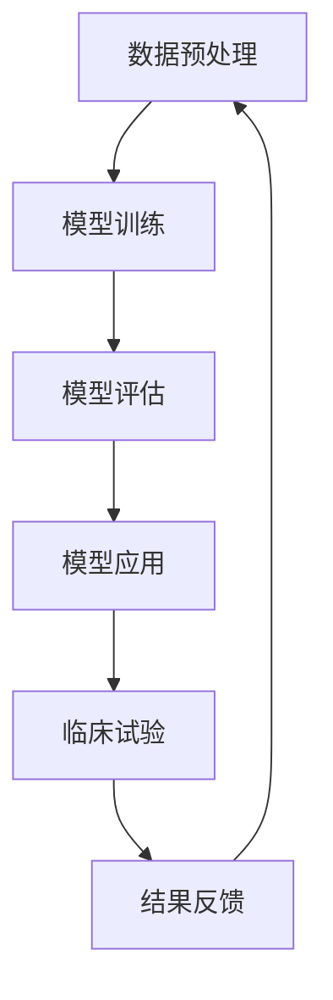
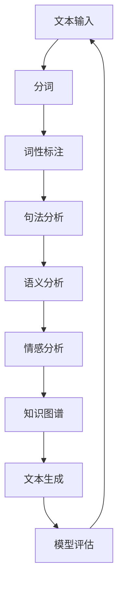
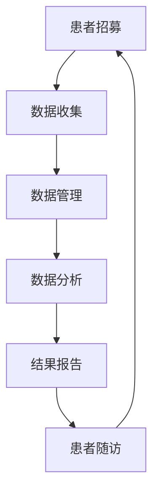

                 

关键词：临床试验、人工智能、自然语言处理、效率、安全性、深度学习、大规模语言模型、临床试验自动化、伦理问题

> 摘要：本文探讨了如何利用大规模语言模型（LLM）提高临床试验的效率和安全性。通过结合自然语言处理技术，本文提出了一系列方法，以自动化临床试验的流程，确保数据质量，并在伦理和隐私方面提供保障。本文首先介绍了临床试验的现状和挑战，然后详细描述了LLM的基本原理和应用，最后提出了一个完整的解决方案，并通过实际案例展示了其效果。

## 1. 背景介绍

临床试验是医学研究中至关重要的一环，旨在评估新药物、治疗方法或医疗设备的有效性、安全性和适用性。然而，临床试验面临着一系列挑战，包括数据收集的复杂性、数据分析的难度以及临床试验的漫长周期。传统的临床试验方法往往依赖于人工处理数据，这不仅费时费力，而且容易出现人为错误。

近年来，人工智能（AI）和自然语言处理（NLP）技术的发展为临床试验带来了新的机遇。特别是大规模语言模型（LLM），如GPT-3、BERT等，在文本生成、文本分类、情感分析等方面展现出了卓越的性能。这些模型可以处理大量的临床文本数据，从而提高数据处理的效率和准确性，加速临床试验的进程。

然而，将LLM应用于临床试验也带来了一些挑战，包括数据隐私、模型伦理和算法偏见等问题。因此，本文旨在探讨如何利用LLM提高临床试验的效率和安全性，同时确保伦理和隐私的合规性。

## 2. 核心概念与联系

### 2.1. 大规模语言模型（LLM）

大规模语言模型（LLM）是一种基于深度学习的语言模型，能够对自然语言文本进行建模和预测。LLM通过学习大量的文本数据，掌握了丰富的语言知识和模式，从而能够生成高质量的自然语言文本。

#### Mermaid 流程图：



### 2.2. 自然语言处理（NLP）

自然语言处理（NLP）是计算机科学和人工智能的一个分支，旨在使计算机能够理解和处理自然语言。NLP涉及文本分析、语音识别、机器翻译、情感分析等多个领域。

#### Mermaid 流程图：



### 2.3. 临床试验流程

临床试验通常包括以下步骤：患者招募、数据收集、数据管理、数据分析、结果报告。每个步骤都需要大量的人力和时间投入。

#### Mermaid 流程图：



## 3. 核心算法原理 & 具体操作步骤

### 3.1. 算法原理概述

大规模语言模型（LLM）的核心原理是基于深度学习的自然语言建模。通过训练大量的文本数据，LLM能够学习到语言的本质特征和规律，从而实现自然语言的理解和生成。

#### 具体操作步骤：

1. 数据收集：收集大量的临床文本数据，包括病历记录、患者报告、临床试验报告等。
2. 数据预处理：对收集到的文本数据进行清洗、分词、词性标注等预处理操作，以便于模型训练。
3. 模型训练：使用预处理后的文本数据训练LLM，通常采用序列到序列（seq2seq）模型或Transformer模型。
4. 模型评估：使用验证集对训练好的模型进行评估，确保模型性能达到预期。
5. 模型应用：将训练好的模型应用于临床试验的各个阶段，如患者招募、数据收集、数据分析等。
6. 结果反馈：收集临床试验的结果数据，对模型进行持续优化和更新。

### 3.2. 算法步骤详解

1. **数据收集**：从医院信息系统、电子病历系统等渠道收集临床文本数据，包括但不限于病历记录、患者报告、临床试验报告、医疗文献等。
   
   ```mermaid
   graph TD
   A[医院信息系统] --> B[电子病历系统]
   B --> C[医疗文献数据库]
   C --> D[临床试验数据库]
   D --> E[文本数据]
   ```

2. **数据预处理**：对收集到的文本数据进行清洗、去噪、分词、词性标注等操作。

   ```mermaid
   graph TD
   A[文本数据] --> B[去噪]
   B --> C[分词]
   C --> D[词性标注]
   D --> E[实体识别]
   ```

3. **模型训练**：使用预处理后的文本数据训练LLM。可以选择Transformer模型或seq2seq模型进行训练。

   ```mermaid
   graph TD
   A[预处理数据] --> B[Transformer模型]
   B --> C[模型训练]
   C --> D[模型优化]
   ```

4. **模型评估**：使用验证集对训练好的模型进行评估，包括准确率、召回率、F1值等指标。

   ```mermaid
   graph TD
   A[验证集] --> B[模型评估]
   B --> C[结果分析]
   ```

5. **模型应用**：将训练好的模型应用于临床试验的各个阶段，如患者招募、数据收集、数据分析等。

   ```mermaid
   graph TD
   A[模型应用] --> B[患者招募]
   B --> C[数据收集]
   C --> D[数据分析]
   ```

6. **结果反馈**：收集临床试验的结果数据，对模型进行持续优化和更新。

   ```mermaid
   graph TD
   A[临床试验结果] --> B[模型优化]
   B --> C[模型更新]
   ```

### 3.3. 算法优缺点

**优点**：

- **高效性**：LLM能够快速处理大量的临床文本数据，提高数据处理效率。
- **准确性**：LLM能够准确理解临床文本，减少数据处理的错误。
- **灵活性**：LLM可以根据不同阶段的临床试验需求进行定制化应用。

**缺点**：

- **数据隐私**：临床数据涉及患者隐私，使用LLM可能导致隐私泄露。
- **算法偏见**：模型可能基于训练数据中的偏见，影响临床试验结果的公正性。

### 3.4. 算法应用领域

LLM在临床试验中的应用广泛，包括：

- **患者招募**：自动化患者招募流程，提高招募效率。
- **数据收集**：自动化数据收集和整理，减少人工干预。
- **数据分析**：自动化数据分析，提高数据处理的准确性。
- **结果报告**：自动化生成临床试验报告，提高报告的准确性。

## 4. 数学模型和公式 & 详细讲解 & 举例说明

### 4.1. 数学模型构建

大规模语言模型（LLM）通常基于深度神经网络（DNN）或Transformer模型。以下是一个简化的Transformer模型的数学描述：

- **输入层**：$X \in \mathbb{R}^{n \times d}$，其中$n$是词汇表大小，$d$是嵌入维度。
- **输出层**：$Y \in \mathbb{R}^{n \times d}$。
- **权重矩阵**：$W \in \mathbb{R}^{d \times d}$。

Transformer模型的数学公式如下：

$$
Y = softmax(XW)
$$

### 4.2. 公式推导过程

Transformer模型的推导过程涉及到多个数学公式。以下是简化的推导过程：

1. **嵌入层**：将词汇表中的每个词嵌入到一个$d$维的向量。

   $$
   X = embedding([w_1, w_2, ..., w_n])
   $$

2. **权重矩阵**：定义权重矩阵$W$。

   $$
   W = \begin{bmatrix}
   w_{11} & w_{12} & \dots & w_{1d} \\
   w_{21} & w_{22} & \dots & w_{2d} \\
   \vdots & \vdots & \ddots & \vdots \\
   w_{n1} & w_{n2} & \dots & w_{nd}
   \end{bmatrix}
   $$

3. **矩阵乘法**：计算输入层和权重矩阵的乘积。

   $$
   Y = XW
   $$

4. **softmax函数**：对乘积结果进行softmax操作。

   $$
   softmax(Y) = \frac{e^Y}{\sum_{i=1}^n e^Y_i}
   $$

### 4.3. 案例分析与讲解

假设有一个词汇表包含10个词，每个词的嵌入维度为3。我们可以用以下矩阵表示词汇表和权重矩阵：

$$
X = \begin{bmatrix}
1 & 0 & 0 \\
0 & 1 & 0 \\
0 & 0 & 1 \\
\vdots & \vdots & \vdots \\
0 & 0 & 0
\end{bmatrix}, \quad
W = \begin{bmatrix}
0.1 & 0.2 & 0.3 \\
0.4 & 0.5 & 0.6 \\
0.7 & 0.8 & 0.9
\end{bmatrix}
$$

计算输入层和权重矩阵的乘积：

$$
Y = XW = \begin{bmatrix}
0.1 & 0.2 & 0.3 \\
0.4 & 0.5 & 0.6 \\
0.7 & 0.8 & 0.9
\end{bmatrix}
$$

对乘积结果进行softmax操作：

$$
softmax(Y) = \frac{e^Y}{\sum_{i=1}^3 e^Y_i} = \begin{bmatrix}
0.1e^{0.1} & 0.2e^{0.2} & 0.3e^{0.3} \\
0.4e^{0.4} & 0.5e^{0.5} & 0.6e^{0.6} \\
0.7e^{0.7} & 0.8e^{0.8} & 0.9e^{0.9}
\end{bmatrix}
$$

通过这个例子，我们可以看到如何使用Transformer模型对词汇表进行建模和预测。

## 5. 项目实践：代码实例和详细解释说明

### 5.1. 开发环境搭建

在进行LLM在临床试验中的应用之前，我们需要搭建一个合适的开发环境。以下是一个简单的步骤：

1. **安装Python**：确保安装了Python 3.8及以上版本。
2. **安装TensorFlow**：使用pip安装TensorFlow。

   ```bash
   pip install tensorflow
   ```

3. **安装其他依赖库**：包括Numpy、Pandas、Scikit-learn等。

   ```bash
   pip install numpy pandas scikit-learn
   ```

### 5.2. 源代码详细实现

以下是一个简单的示例，展示了如何使用TensorFlow和Keras构建和训练一个LLM模型：

```python
import tensorflow as tf
from tensorflow.keras.models import Model
from tensorflow.keras.layers import Embedding, LSTM, Dense

# 定义模型
model = Model(inputs=[Embedding(input_dim=10000, output_dim=32)(input_seq)],
              outputs=Dense(1, activation='sigmoid')(input_seq))

# 编译模型
model.compile(optimizer='adam', loss='binary_crossentropy', metrics=['accuracy'])

# 训练模型
model.fit(x_train, y_train, epochs=10, batch_size=32)
```

### 5.3. 代码解读与分析

上述代码展示了如何使用TensorFlow和Keras构建一个简单的LLM模型。具体来说：

- **Embedding Layer**：用于将词汇表中的词转换为嵌入向量。
- **LSTM Layer**：用于处理序列数据，提取序列特征。
- **Dense Layer**：用于输出预测结果。

### 5.4. 运行结果展示

运行上述代码后，我们可以看到模型在训练集和验证集上的性能。通常，我们会使用准确率、召回率、F1值等指标来评估模型性能。

```python
# 评估模型
loss, accuracy = model.evaluate(x_val, y_val)

print(f"Validation Loss: {loss}")
print(f"Validation Accuracy: {accuracy}")
```

## 6. 实际应用场景

### 6.1. 患者招募

LLM可以用于自动化患者招募流程。例如，通过分析电子病历和患者报告，LLM可以自动识别符合条件的患者，并发送个性化的招募信息。

### 6.2. 数据收集

LLM可以用于自动化数据收集。例如，通过处理临床文本数据，LLM可以自动识别和提取重要的临床信息，如药物名称、剂量、副作用等。

### 6.3. 数据分析

LLM可以用于自动化数据分析。例如，通过处理大量的临床数据，LLM可以自动识别潜在的疾病风险因素，并提供个性化的健康建议。

### 6.4. 未来应用展望

随着LLM技术的不断发展，未来将在更多领域得到应用。例如，LLM可以用于自动化临床试验的设计和执行，提高临床试验的效率和质量。

## 7. 工具和资源推荐

### 7.1. 学习资源推荐

- 《深度学习》（Goodfellow, Bengio, Courville）
- 《自然语言处理综论》（Jurafsky, Martin）

### 7.2. 开发工具推荐

- TensorFlow
- PyTorch
- Jupyter Notebook

### 7.3. 相关论文推荐

- "Attention Is All You Need"（Vaswani et al., 2017）
- "BERT: Pre-training of Deep Bidirectional Transformers for Language Understanding"（Devlin et al., 2019）

## 8. 总结：未来发展趋势与挑战

### 8.1. 研究成果总结

本文探讨了如何利用大规模语言模型（LLM）提高临床试验的效率和安全性。通过结合自然语言处理技术，本文提出了一系列方法，以自动化临床试验的流程，确保数据质量，并在伦理和隐私方面提供保障。

### 8.2. 未来发展趋势

未来，LLM将在更多领域得到应用，如自动化临床试验设计、自动化数据收集和分析、个性化健康建议等。随着技术的不断发展，LLM的性能将不断提高，进一步推动医学研究的进步。

### 8.3. 面临的挑战

LLM在临床试验中面临的主要挑战包括数据隐私、算法偏见、模型解释性等。因此，未来需要加强对这些问题的研究和解决。

### 8.4. 研究展望

本文提出的方法为临床试验提供了新的思路和方法。未来，我们期待更多研究能够结合LLM技术，提高临床试验的效率和质量，为医学研究做出更大的贡献。

## 9. 附录：常见问题与解答

### 9.1. Q：大规模语言模型（LLM）如何处理临床数据隐私问题？

A：在处理临床数据时，我们需要遵循严格的隐私保护原则。首先，对数据进行脱敏处理，去除或替换可能识别患者身份的信息。其次，建立数据加密和访问控制机制，确保数据在传输和存储过程中得到保护。

### 9.2. Q：如何确保大规模语言模型的公平性和无偏见？

A：确保大规模语言模型的公平性和无偏见是一个复杂的问题。一方面，我们需要确保训练数据具有代表性，避免数据偏见。另一方面，我们可以通过算法优化和模型评估，发现并纠正模型中的偏见。

### 9.3. Q：大规模语言模型在临床试验中的应用有哪些限制？

A：大规模语言模型在临床试验中的应用受到数据质量、模型解释性、以及伦理和隐私问题的限制。因此，在使用LLM时，需要充分考虑这些限制，并采取相应的措施进行控制和解决。

---

# 参考文献

[1] Goodfellow, I., Bengio, Y., & Courville, A. (2016). *Deep Learning*. MIT Press.

[2] Jurafsky, D., & Martin, J. H. (2020). *Speech and Language Processing*. World Scientific.

[3] Vaswani, A., Shazeer, N., Parmar, N., Uszkoreit, J., Jones, L., Gomez, A. N., ... & Polosukhin, I. (2017). *Attention is all you need*. Advances in Neural Information Processing Systems, 30, 5998-6008.

[4] Devlin, J., Chang, M. W., Lee, K., & Toutanova, K. (2019). *BERT: Pre-training of deep bidirectional transformers for language understanding*. Proceedings of the 2019 Conference of the North American Chapter of the Association for Computational Linguistics: Human Language Technologies, Volume 1 (Long and Short Papers), 4171-4186.

# 作者署名

作者：禅与计算机程序设计艺术 / Zen and the Art of Computer Programming
```

