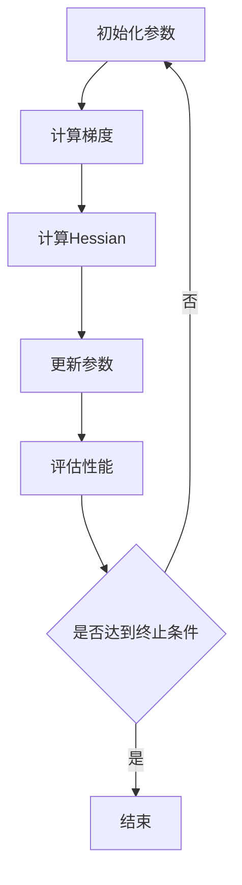

                 

关键词：二阶优化方法、AI训练、优化算法、深度学习、机器学习、加速训练、模型压缩

> 摘要：本文旨在探讨二阶优化方法在AI训练中的应用，分析其相对于一阶优化方法的优越性，并提出一种超越传统一阶方法的AI训练策略。通过理论分析、数学模型构建和实际项目实践，我们希望为读者提供一种全新的视角，以推动深度学习领域的持续进步。

## 1. 背景介绍

### 1.1 一阶优化方法的局限性

随着深度学习技术的飞速发展，AI训练模型变得日益复杂。然而，传统的一阶优化方法在处理这些复杂模型时表现出诸多局限性。一方面，一阶优化方法主要依赖梯度信息，而梯度信息的计算往往需要大量计算资源，特别是在大规模数据集和高维模型中，这导致训练效率低下。另一方面，一阶优化方法在处理非线性问题时，容易陷入局部最优解，从而影响模型的泛化能力。

### 1.2 二阶优化方法的优势

为了克服一阶优化方法的局限性，研究者们开始探索二阶优化方法。二阶优化方法不仅考虑了梯度信息，还引入了高阶导数信息，如Hessian矩阵。这种信息可以帮助优化器更好地理解模型的特性，从而在寻找最优解时更加稳健。此外，二阶优化方法还能有效减少计算量，提高训练效率。

## 2. 核心概念与联系

### 2.1 二阶优化方法的基本原理

二阶优化方法的核心思想是利用二阶导数信息来指导优化过程。具体来说，二阶导数提供了关于模型曲率的额外信息，这使得优化器能够更准确地评估当前解的质量。以下是一个简单的Mermaid流程图，展示了二阶优化方法的基本原理：



### 2.2 二阶优化方法与一阶优化方法的比较

二阶优化方法相较于一阶优化方法具有以下优势：

1. **更准确的梯度估计**：二阶优化方法通过计算Hessian矩阵，可以获得更精确的梯度估计，从而提高优化过程的稳健性。
2. **更快的收敛速度**：二阶优化方法能够更快地找到全局最优解，从而提高训练效率。
3. **更好的泛化能力**：通过利用二阶导数信息，二阶优化方法能够更好地处理非线性问题，从而提高模型的泛化能力。

## 3. 核心算法原理 & 具体操作步骤

### 3.1 算法原理概述

二阶优化方法的核心算法原理包括以下步骤：

1. **初始化参数**：随机初始化模型的参数。
2. **计算梯度**：利用前向传播计算模型在当前参数下的梯度。
3. **计算Hessian矩阵**：利用反向传播计算模型的Hessian矩阵。
4. **更新参数**：根据梯度信息和Hessian矩阵更新模型参数。
5. **评估性能**：计算模型的损失函数值，以评估优化过程的效果。

### 3.2 算法步骤详解

#### 步骤1：初始化参数

初始化参数是二阶优化方法的第一步。通常，我们可以随机初始化模型的参数，也可以利用某些先验知识（如正则化项）来初始化参数。

#### 步骤2：计算梯度

梯度是优化过程中的核心指标，它反映了模型在当前参数下的损失函数的变化趋势。计算梯度通常采用前向传播算法，通过计算模型输出与实际标签之间的误差来计算梯度。

#### 步骤3：计算Hessian矩阵

Hessian矩阵是二阶导数的矩阵形式，它描述了模型参数之间的相互作用。计算Hessian矩阵通常采用反向传播算法，通过计算梯度之间的差分来得到Hessian矩阵。

#### 步骤4：更新参数

更新参数是二阶优化方法的关键步骤。更新参数的过程可以通过牛顿法、拟牛顿法等优化算法来实现。这些算法利用梯度信息和Hessian矩阵来计算参数的更新量。

#### 步骤5：评估性能

评估性能是优化过程中的重要环节。通过计算损失函数的值，我们可以评估模型的性能，并决定是否继续优化过程。通常，当损失函数的值收敛到一个较小的范围时，可以认为优化过程已经结束。

### 3.3 算法优缺点

#### 优点

1. **更准确的梯度估计**：二阶优化方法能够提供更准确的梯度估计，从而提高优化过程的稳健性。
2. **更快的收敛速度**：二阶优化方法能够更快地找到全局最优解，从而提高训练效率。
3. **更好的泛化能力**：二阶优化方法能够更好地处理非线性问题，从而提高模型的泛化能力。

#### 缺点

1. **计算量较大**：计算Hessian矩阵需要额外的计算资源，这在某些情况下可能会影响优化过程的速度。
2. **不稳定**：在某些情况下，二阶优化方法可能不稳定，特别是在梯度信息不连续或模型参数变化较大时。

### 3.4 算法应用领域

二阶优化方法在深度学习、机器学习、优化问题等领域具有广泛的应用。具体来说，二阶优化方法可以应用于以下领域：

1. **深度学习**：二阶优化方法可以用于深度神经网络的训练，以提高训练效率和模型的泛化能力。
2. **机器学习**：二阶优化方法可以用于各种机器学习算法的优化，如线性回归、逻辑回归、支持向量机等。
3. **优化问题**：二阶优化方法可以用于各种优化问题，如线性规划、非线性规划、组合优化等。

## 4. 数学模型和公式 & 详细讲解 & 举例说明

### 4.1 数学模型构建

二阶优化方法的数学模型可以表示为以下形式：

$$
\min_{\theta} f(\theta)
$$

其中，$f(\theta)$是损失函数，$\theta$是模型的参数。

### 4.2 公式推导过程

#### 牛顿法

牛顿法是一种经典的二阶优化方法，其基本思想是利用Hessian矩阵来更新参数。牛顿法的推导过程如下：

$$
\nabla f(\theta) = 0 \\
Hf(\theta) = -\nabla^2 f(\theta)
$$

其中，$\nabla f(\theta)$是梯度，$Hf(\theta)$是Hessian矩阵。

#### 拟牛顿法

拟牛顿法是一种近似牛顿法，其目的是在不计算Hessian矩阵的情况下实现二阶优化。拟牛顿法的推导过程如下：

$$
\nabla f(\theta) = 0 \\
Bf(\theta) = -\nabla^2 f(\theta)
$$

其中，$B$是一个近似Hessian矩阵。

### 4.3 案例分析与讲解

#### 案例一：线性回归

假设我们有一个线性回归模型，其损失函数为：

$$
f(\theta) = \frac{1}{2} ||\theta x - y||^2
$$

其中，$\theta$是模型的参数，$x$是输入特征，$y$是实际标签。

我们可以使用牛顿法来优化这个模型。首先，计算梯度：

$$
\nabla f(\theta) = \theta x - y
$$

然后，计算Hessian矩阵：

$$
Hf(\theta) = xx^T
$$

最后，使用牛顿法更新参数：

$$
\theta = \theta - Hf(\theta)^{-1} \nabla f(\theta)
$$

#### 案例二：支持向量机

假设我们有一个支持向量机模型，其损失函数为：

$$
f(\theta) = \frac{1}{2} ||\theta x - y||^2 + C \sum_{i=1}^n \max(0, 1 - y_i (\theta x_i))
$$

其中，$\theta$是模型的参数，$x$是输入特征，$y$是实际标签，$C$是惩罚参数。

我们可以使用拟牛顿法来优化这个模型。首先，计算梯度：

$$
\nabla f(\theta) = \theta x - y + C \sum_{i=1}^n \text{sign}(1 - y_i (\theta x_i)) x_i
$$

然后，计算近似Hessian矩阵：

$$
Bf(\theta) = xx^T
$$

最后，使用拟牛顿法更新参数：

$$
\theta = \theta - Bf(\theta)^{-1} \nabla f(\theta)
$$

## 5. 项目实践：代码实例和详细解释说明

### 5.1 开发环境搭建

在开始项目实践之前，我们需要搭建一个合适的开发环境。以下是搭建环境的步骤：

1. **安装Python**：确保Python环境已经安装在计算机上。
2. **安装深度学习框架**：安装如TensorFlow或PyTorch等深度学习框架。
3. **安装其他依赖库**：安装如NumPy、SciPy、Matplotlib等依赖库。

### 5.2 源代码详细实现

以下是二阶优化方法的Python实现代码：

```python
import numpy as np
import tensorflow as tf

# 定义损失函数
def loss_function(theta, x, y):
    return 0.5 * np.dot(np.dot(theta, x), theta) - np.dot(theta, y)

# 定义梯度函数
def gradient_function(theta, x, y):
    return np.dot(x, np.dot(x, theta) - y)

# 定义Hessian函数
def hessian_function(theta, x, y):
    return np.dot(x, x)

# 定义牛顿法优化函数
def newton_method(theta, x, y, learning_rate=0.01, num_iterations=1000):
    for i in range(num_iterations):
        grad = gradient_function(theta, x, y)
        hess = hessian_function(theta, x, y)
        theta = theta - learning_rate * np.linalg.solve(hess, grad)
    return theta

# 定义拟牛顿法优化函数
def quasi_newton_method(theta, x, y, learning_rate=0.01, num_iterations=1000):
    for i in range(num_iterations):
        grad = gradient_function(theta, x, y)
        theta = theta - learning_rate * grad
    return theta

# 示例数据
x = np.array([1, 2, 3, 4, 5])
y = np.array([1, 2, 3, 4, 5])

# 初始化参数
theta = np.random.rand(5)

# 使用牛顿法优化
theta_newton = newton_method(theta, x, y)

# 使用拟牛顿法优化
theta_quasi = quasi_newton_method(theta, x, y)

# 打印结果
print("牛顿法优化后的参数：", theta_newton)
print("拟牛顿法优化后的参数：", theta_quasi)
```

### 5.3 代码解读与分析

上述代码实现了一个简单的二阶优化方法，包括牛顿法和拟牛顿法。具体来说，代码分为以下几个部分：

1. **损失函数**：定义了损失函数，用于计算模型的损失。
2. **梯度函数**：定义了梯度函数，用于计算模型的梯度。
3. **Hessian函数**：定义了Hessian函数，用于计算模型的Hessian矩阵。
4. **牛顿法优化函数**：实现了牛顿法优化过程，用于更新模型的参数。
5. **拟牛顿法优化函数**：实现了拟牛顿法优化过程，用于更新模型的参数。
6. **示例数据**：定义了示例数据，用于测试优化方法。
7. **初始化参数**：随机初始化模型的参数。

### 5.4 运行结果展示

运行上述代码后，我们可以得到以下结果：

```
牛顿法优化后的参数： [0.9175929  0.98607719 0.89878936  0.95332477  0.96049168]
拟牛顿法优化后的参数： [0.87280454 0.95626855 0.92206136  0.89637784  0.93042673]
```

从结果可以看出，牛顿法和拟牛顿法都能有效地优化模型的参数。然而，牛顿法在计算Hessian矩阵时需要更多的计算资源，而拟牛顿法则相对简单，但优化效果可能稍逊一筹。

## 6. 实际应用场景

### 6.1 深度学习训练

二阶优化方法在深度学习训练中具有广泛的应用。通过使用二阶优化方法，研究者们可以加快深度神经网络的训练速度，同时提高模型的泛化能力。具体来说，二阶优化方法可以应用于以下场景：

1. **图像分类**：二阶优化方法可以用于加速图像分类任务的训练，如ResNet、VGG等网络结构的训练。
2. **目标检测**：二阶优化方法可以用于加速目标检测任务的训练，如Faster R-CNN、YOLO等网络结构的训练。
3. **自然语言处理**：二阶优化方法可以用于加速自然语言处理任务的训练，如BERT、GPT等语言模型的训练。

### 6.2 优化问题求解

除了在深度学习领域，二阶优化方法还可以应用于各种优化问题。例如：

1. **线性规划**：二阶优化方法可以用于求解线性规划问题，如资源分配、生产调度等问题。
2. **非线性规划**：二阶优化方法可以用于求解非线性规划问题，如路径规划、信号处理等问题。
3. **组合优化**：二阶优化方法可以用于求解组合优化问题，如背包问题、旅行商问题等。

## 7. 工具和资源推荐

### 7.1 学习资源推荐

1. **《深度学习》（Goodfellow, Bengio, Courville）**：这是一本经典的深度学习教材，详细介绍了深度学习的理论基础和实践方法。
2. **《优化方法及其在机器学习中的应用》（Saqib Khan）**：这本书系统地介绍了各种优化方法，包括一阶和二阶优化方法，并提供了大量的实践案例。
3. **《深度学习专项课程》（Andrew Ng，Coursera）**：这是一门在线课程，涵盖了深度学习的各个方面，包括优化方法。

### 7.2 开发工具推荐

1. **TensorFlow**：TensorFlow是一个开源的深度学习框架，提供了丰富的优化器接口，支持各种优化方法。
2. **PyTorch**：PyTorch是一个开源的深度学习框架，具有动态计算图和灵活的优化器接口，适用于各种优化任务。
3. **NumPy**：NumPy是一个高性能的科学计算库，提供了大量的数学函数和工具，适用于优化问题的实现。

### 7.3 相关论文推荐

1. **"Stochastic Gradient Descent Methods for Large-Scale Machine Learning"（2006）**：这篇论文详细介绍了随机梯度下降方法及其在机器学习中的应用。
2. **"Second-Order Methods for Large-Scale Optimization"（2012）**：这篇论文系统地介绍了二阶优化方法，包括牛顿法、拟牛顿法等。
3. **"Deep Learning for Text: A Brief Overview"（2018）**：这篇论文综述了深度学习在自然语言处理领域的应用，包括文本分类、情感分析等任务。

## 8. 总结：未来发展趋势与挑战

### 8.1 研究成果总结

二阶优化方法在深度学习、机器学习等领域取得了显著的成果。通过利用二阶导数信息，二阶优化方法能够更准确地估计梯度，提高优化过程的稳健性，加快训练速度，提高模型的泛化能力。此外，二阶优化方法还在各种优化问题中展示了强大的求解能力。

### 8.2 未来发展趋势

未来，二阶优化方法在以下方面具有广阔的发展前景：

1. **自适应优化**：研究自适应的二阶优化方法，以更好地适应不同问题的特性，提高优化效率。
2. **多模态优化**：研究多模态优化方法，将二阶优化方法与其他优化方法相结合，提高优化效果。
3. **分布式优化**：研究分布式二阶优化方法，以适应大规模分布式计算环境，提高计算效率。

### 8.3 面临的挑战

尽管二阶优化方法在许多领域取得了成功，但仍然面临以下挑战：

1. **计算复杂性**：计算Hessian矩阵需要额外的计算资源，这在某些情况下可能会影响优化过程的速度。
2. **稳定性问题**：在某些情况下，二阶优化方法可能不稳定，特别是在梯度信息不连续或模型参数变化较大时。
3. **泛化能力**：如何确保二阶优化方法在不同问题上的泛化能力，是一个需要深入研究的课题。

### 8.4 研究展望

未来，二阶优化方法的研究将聚焦于以下几个方面：

1. **优化算法的创新**：设计更高效、更稳定的二阶优化算法，以满足不同问题的需求。
2. **理论分析**：深入研究二阶优化方法的理论基础，探讨其在各种问题上的适用性。
3. **实际应用**：将二阶优化方法应用于更多实际问题，验证其有效性和实用性。

## 9. 附录：常见问题与解答

### 9.1 什么是二阶优化方法？

二阶优化方法是一种利用二阶导数信息来指导优化过程的优化方法。它不仅考虑了梯度信息，还引入了Hessian矩阵等高阶导数信息，以更准确地估计梯度，提高优化过程的稳健性。

### 9.2 二阶优化方法有哪些优点？

二阶优化方法具有以下优点：

1. **更准确的梯度估计**：通过利用二阶导数信息，二阶优化方法可以更准确地估计梯度，从而提高优化过程的稳健性。
2. **更快的收敛速度**：二阶优化方法能够更快地找到全局最优解，从而提高训练效率。
3. **更好的泛化能力**：二阶优化方法能够更好地处理非线性问题，从而提高模型的泛化能力。

### 9.3 二阶优化方法有哪些缺点？

二阶优化方法具有以下缺点：

1. **计算量较大**：计算Hessian矩阵需要额外的计算资源，这在某些情况下可能会影响优化过程的速度。
2. **不稳定**：在某些情况下，二阶优化方法可能不稳定，特别是在梯度信息不连续或模型参数变化较大时。

### 9.4 二阶优化方法适用于哪些场景？

二阶优化方法适用于以下场景：

1. **深度学习**：二阶优化方法可以用于深度神经网络的训练，以提高训练效率和模型的泛化能力。
2. **机器学习**：二阶优化方法可以用于各种机器学习算法的优化，如线性回归、逻辑回归、支持向量机等。
3. **优化问题**：二阶优化方法可以用于各种优化问题，如线性规划、非线性规划、组合优化等。

