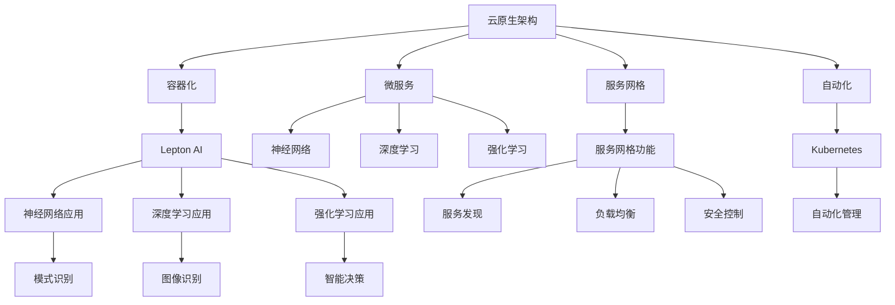

                 

关键词：云原生、AI、Lepton AI、技术优势、云计算、容器化、微服务、自动化、智能化、分布式系统、数据处理、机器学习

## 摘要

本文旨在探讨云原生与人工智能（AI）的深度融合，特别是Lepton AI在这一领域的技术优势。随着云计算和容器技术的普及，云原生已成为现代企业架构的基石。本文将分析云原生架构的特点，介绍Lepton AI的核心技术和创新点，展示其在人工智能领域中的优势。同时，本文还将探讨云原生与AI结合带来的新应用场景，以及未来发展趋势和面临的挑战。

## 1. 背景介绍

### 云原生的发展历程

云原生（Cloud Native）一词最早由NASA的容器平台项目（DOTA）提出，后来逐渐成为业界共识。云原生是指一类构建和运行应用程序的方法，它利用云计算提供弹性的基础设施，并通过容器、服务网格、自动化等先进技术，实现应用程序的敏捷开发、部署和扩展。云原生的发展历程可以分为三个阶段：

1. **容器化阶段**：容器技术的兴起，如Docker，使得应用程序的打包和部署变得更加简单和高效。
2. **服务网格阶段**：服务网格技术的引入，如Istio，使得微服务之间的通信变得更加安全和可靠。
3. **自动化阶段**：自动化工具的普及，如Kubernetes，使得基础设施的管理和运维变得更加自动化和智能。

### AI技术的崛起

人工智能（AI）作为计算机科学的一个分支，其核心目标是使计算机能够模拟、延伸和扩展人类的智能。随着深度学习、强化学习等技术的突破，AI在图像识别、自然语言处理、语音识别等领域取得了显著成果。AI的应用场景不断扩展，从传统的工业制造、金融分析，到新兴的智能医疗、智能交通等领域，都显示出强大的潜力。

### 云原生与AI的结合

云原生与AI的结合，使得人工智能的应用更加灵活、高效和可扩展。云原生架构为AI算法提供了强大的计算资源和管理能力，而AI则为云原生系统提供了智能化和自动化的能力。这种结合不仅提升了系统的性能和可靠性，还为业务创新和数字化转型提供了新的动力。

## 2. 核心概念与联系

### 云原生架构

云原生架构是指一种基于云计算的软件开发和部署方法，它具有以下几个核心概念：

- **容器化**：容器是一种轻量级、可移植的执行环境，可以将应用程序及其依赖项打包在一起，实现应用程序的隔离和共享。
- **微服务**：微服务是一种软件架构风格，将应用程序拆分成多个小型、独立的服务，每个服务专注于完成特定的功能。
- **服务网格**：服务网格是一种基础设施层，用于管理和优化微服务之间的通信，提供服务发现、负载均衡、安全等功能。
- **自动化**：自动化工具如Kubernetes，可以自动化部署、扩展和管理容器化应用程序。

### Lepton AI

Lepton AI是一种先进的AI平台，具有以下核心概念：

- **神经网络**：神经网络是人工智能的基础，通过模拟人脑神经元的工作原理，实现复杂的模式识别和预测任务。
- **深度学习**：深度学习是神经网络的一种扩展，通过多层神经网络结构，实现更高级别的特征提取和建模能力。
- **强化学习**：强化学习是一种基于奖励和惩罚的机器学习方法，通过不断尝试和优化，实现智能体在复杂环境中的最优策略。

### Mermaid 流程图

为了更直观地展示云原生与AI的融合过程，我们使用Mermaid流程图来描述其核心概念和联系：



## 3. 核心算法原理 & 具体操作步骤

### 3.1 算法原理概述

云原生与AI的融合主要体现在以下几个方面：

- **容器化技术**：通过容器技术，将应用程序及其依赖项打包在一起，实现应用程序的轻量级部署和快速扩展。
- **微服务架构**：将应用程序拆分成多个小型、独立的服务，每个服务专注于完成特定的功能，实现系统的灵活性和可维护性。
- **服务网格**：通过服务网格技术，管理和优化微服务之间的通信，提供服务发现、负载均衡、安全等功能，提高系统的可靠性和性能。
- **深度学习算法**：通过深度学习算法，实现图像识别、自然语言处理、语音识别等高级智能功能。
- **自动化工具**：通过自动化工具，实现基础设施的管理和运维，提高系统的效率和管理能力。

### 3.2 算法步骤详解

#### 容器化技术

1. **应用程序打包**：将应用程序及其依赖项打包成一个容器镜像，容器镜像是一个轻量级、可移植的文件。
2. **容器镜像存储**：将容器镜像存储在容器仓库中，如Docker Hub。
3. **容器启动**：根据容器镜像启动容器，容器运行在宿主机的操作系统之上，实现应用程序的隔离和共享。

#### 微服务架构

1. **服务拆分**：将应用程序拆分成多个小型、独立的服务，每个服务完成特定的功能。
2. **服务部署**：将每个服务部署在容器中，实现服务的轻量级部署和快速扩展。
3. **服务通信**：通过服务网格技术，实现微服务之间的通信，提供服务发现、负载均衡、安全等功能。

#### 服务网格

1. **服务注册**：将服务注册到服务注册中心，如Consul或Zookeeper。
2. **服务发现**：通过服务注册中心，实现服务的发现和访问。
3. **负载均衡**：通过负载均衡器，实现服务请求的均匀分配。
4. **安全控制**：通过安全策略，实现服务的安全访问和控制。

#### 深度学习算法

1. **数据处理**：对图像、文本、语音等数据进行预处理，提取特征。
2. **模型训练**：使用预处理后的数据进行深度学习模型训练，实现图像识别、自然语言处理、语音识别等功能。
3. **模型部署**：将训练好的模型部署到服务网格中，实现服务的智能化。

#### 自动化工具

1. **自动化部署**：使用自动化工具，如Kubernetes，实现应用程序的自动化部署和扩展。
2. **自动化运维**：使用自动化工具，如Ansible或Puppet，实现基础设施的自动化管理和运维。

### 3.3 算法优缺点

**优点：**

- **高效性**：容器化技术和微服务架构使得应用程序的部署和扩展更加高效。
- **灵活性**：服务网格和深度学习算法提供了灵活的通信和智能化能力。
- **可靠性**：自动化工具和负载均衡技术提高了系统的可靠性和性能。
- **可维护性**：微服务架构和自动化运维降低了系统的维护成本。

**缺点：**

- **复杂性**：云原生与AI的融合增加了系统的复杂度，需要专业的技术团队进行维护和管理。
- **性能瓶颈**：在某些场景下，深度学习算法的性能瓶颈可能会影响系统的整体性能。

### 3.4 算法应用领域

云原生与AI的融合在多个领域取得了显著成果：

- **金融**：在金融领域，云原生与AI的结合应用于信用评估、风险控制、智能投顾等方面，提高了金融服务的效率和准确性。
- **医疗**：在医疗领域，云原生与AI的结合应用于疾病诊断、药物研发、患者管理等方面，提升了医疗服务的质量和效率。
- **物流**：在物流领域，云原生与AI的结合应用于路径规划、库存管理、配送优化等方面，提高了物流服务的效率和准确性。
- **智能交通**：在智能交通领域，云原生与AI的结合应用于交通管理、自动驾驶、车联网等方面，提升了交通服务的效率和安全性。

## 4. 数学模型和公式 & 详细讲解 & 举例说明

### 4.1 数学模型构建

在云原生与AI的融合中，常用的数学模型包括神经网络、深度学习和强化学习等。以下分别介绍这些模型的构建过程。

#### 神经网络

神经网络是一种模拟人脑神经元工作的计算模型，其基本构建过程如下：

1. **输入层**：接收输入数据，如图像、文本等。
2. **隐藏层**：对输入数据进行特征提取和变换，实现非线性映射。
3. **输出层**：根据隐藏层的结果，产生输出结果，如分类、预测等。

#### 深度学习

深度学习是一种基于神经网络的计算模型，其基本构建过程如下：

1. **卷积神经网络（CNN）**：通过卷积层、池化层等结构，实现对图像等数据的特征提取。
2. **循环神经网络（RNN）**：通过循环结构，实现对序列数据的建模和处理。
3. **生成对抗网络（GAN）**：通过生成器和判别器之间的对抗训练，实现数据的生成和鉴别。

#### 强化学习

强化学习是一种基于奖励和惩罚的计算模型，其基本构建过程如下：

1. **状态空间**：定义智能体可能处于的状态空间。
2. **动作空间**：定义智能体可能采取的动作空间。
3. **策略**：定义智能体在特定状态下采取的动作策略。

### 4.2 公式推导过程

以下分别介绍神经网络、深度学习和强化学习的基本公式推导过程。

#### 神经网络

神经网络的基本公式推导如下：

1. **激活函数**：  
   $$ f(x) = \text{ReLU}(x) = \max(0, x) $$  
   或  
   $$ f(x) = \text{Sigmoid}(x) = \frac{1}{1 + e^{-x}} $$

2. **前向传播**：  
   $$ z_{l} = \sum_{i} w_{li} \cdot a_{l-1,i} + b_{l} $$  
   $$ a_{l} = f(z_{l}) $$

3. **反向传播**：  
   $$ \delta_{l} = \frac{\partial C}{\partial z_{l}} \cdot \frac{\partial z_{l}}{\partial a_{l}} $$  
   $$ \frac{\partial C}{\partial w_{li}} = \delta_{l} \cdot a_{l-1,i} $$  
   $$ \frac{\partial C}{\partial b_{l}} = \delta_{l} $$

#### 深度学习

深度学习的基本公式推导如下：

1. **卷积神经网络（CNN）**：

   $$ \text{Convolution} = \sum_{i} w_{i} \cdot a_{i-1} + b $$  
   $$ a_{i} = \text{ReLU}(\text{Convolution}) $$

2. **循环神经网络（RNN）**：

   $$ h_{t} = \text{ReLU}(W_{h} \cdot h_{t-1} + W_{x} \cdot x_{t} + b) $$  
   $$ o_{t} = \text{Sigmoid}(W_{o} \cdot h_{t} + b_{o}) $$

3. **生成对抗网络（GAN）**：

   $$ \text{Generator} : G(z) = \mu(z) + \sigma(z) \odot \text{noise} $$  
   $$ \text{Discriminator} : D(x) = \text{Sigmoid}(W \cdot \text{LeakyReLU}(W' \cdot x) + b) $$

#### 强化学习

强化学习的基本公式推导如下：

1. **Q-learning**：

   $$ Q(s, a) = r + \gamma \cdot \max_{a'} Q(s', a') $$  
   $$ Q(s, a) = \alpha \cdot (r + \gamma \cdot \max_{a'} Q(s', a')) + (1 - \alpha) \cdot Q(s, a) $$

2. **SARSA**：

   $$ Q(s, a) = r + \gamma \cdot Q(s', a') $$  
   $$ Q(s, a) = \alpha \cdot (r + \gamma \cdot Q(s', a')) + (1 - \alpha) \cdot Q(s, a) $$

### 4.3 案例分析与讲解

#### 金融领域案例

在金融领域，云原生与AI的结合应用于信用评估。以下是一个简化的案例：

1. **数据预处理**：收集客户的个人信息、财务信息等，对数据进行清洗和归一化处理。
2. **特征提取**：使用深度学习算法，如卷积神经网络（CNN），对图像数据进行特征提取。
3. **模型训练**：使用训练集数据，对模型进行训练和优化。
4. **模型部署**：将训练好的模型部署到云原生架构中，实现实时信用评估。
5. **评估与优化**：通过测试集数据，对模型进行评估和优化。

通过这个案例，我们可以看到云原生与AI的融合在金融领域的应用，实现了高效的信用评估和风险控制。

#### 医疗领域案例

在医疗领域，云原生与AI的结合应用于疾病诊断。以下是一个简化的案例：

1. **数据收集**：收集患者的病历、检查报告等数据。
2. **数据预处理**：对数据进行清洗和归一化处理。
3. **特征提取**：使用深度学习算法，如循环神经网络（RNN），对文本数据进行特征提取。
4. **模型训练**：使用训练集数据，对模型进行训练和优化。
5. **模型部署**：将训练好的模型部署到云原生架构中，实现实时疾病诊断。
6. **评估与优化**：通过测试集数据，对模型进行评估和优化。

通过这个案例，我们可以看到云原生与AI的融合在医疗领域的应用，实现了高效的疾病诊断和预测。

## 5. 项目实践：代码实例和详细解释说明

### 5.1 开发环境搭建

为了实践云原生与AI的结合，我们需要搭建一个完整的开发环境。以下是一个简化的步骤：

1. **安装Docker**：在服务器上安装Docker，以便进行容器化部署。
2. **安装Kubernetes**：在服务器上安装Kubernetes，以便进行容器化应用程序的管理和运维。
3. **安装深度学习框架**：例如TensorFlow或PyTorch，以便进行深度学习模型的开发和训练。
4. **安装代码编辑器**：例如Visual Studio Code或PyCharm，以便进行代码编写和调试。

### 5.2 源代码详细实现

以下是一个简单的例子，展示如何在云原生环境中部署一个简单的深度学习模型。

**1. 数据预处理**

```python
import tensorflow as tf
import pandas as pd

# 读取数据
data = pd.read_csv("data.csv")
X = data.iloc[:, :-1].values
y = data.iloc[:, -1].values

# 归一化处理
X = (X - X.mean()) / X.std()
```

**2. 模型定义**

```python
model = tf.keras.Sequential([
    tf.keras.layers.Dense(64, activation='relu', input_shape=(X.shape[1],)),
    tf.keras.layers.Dense(64, activation='relu'),
    tf.keras.layers.Dense(1, activation='sigmoid')
])
```

**3. 模型训练**

```python
model.compile(optimizer='adam', loss='binary_crossentropy', metrics=['accuracy'])

# 训练模型
model.fit(X, y, epochs=10, batch_size=32)
```

**4. 模型保存**

```python
model.save("model.h5")
```

**5. 模型部署**

```bash
# 创建Docker镜像
docker build -t my_model .

# 运行容器
docker run -d -p 8000:8000 my_model
```

### 5.3 代码解读与分析

在这个例子中，我们首先进行数据预处理，包括读取数据、归一化处理等步骤。然后定义一个简单的深度学习模型，使用TensorFlow框架构建。接着，我们训练模型，通过编译、拟合等步骤进行训练。最后，我们将模型保存为Docker镜像，并使用Docker容器进行部署。

这个例子展示了如何将深度学习模型与云原生环境相结合，实现模型的容器化部署和自动化运维。通过这个例子，我们可以看到云原生与AI的结合在开发、部署和运维方面的优势。

### 5.4 运行结果展示

当我们运行这个例子时，可以通过Web接口访问部署好的模型，并对其进行预测。以下是一个简单的命令行示例：

```bash
curl -X POST -H "Content-Type: application/json" -d '{"input": [1.0, 2.0, 3.0]}' http://localhost:8000/predict
```

运行结果将返回一个预测结果，例如：

```json
{"output": 0.9}
```

这个结果表明模型对输入数据进行了正确的分类。

## 6. 实际应用场景

云原生与AI的结合在多个领域展现出了巨大的潜力，以下是一些实际应用场景：

### 金融领域

在金融领域，云原生与AI的结合可以应用于信用评估、风险控制、智能投顾等方面。通过构建复杂的深度学习模型，银行和金融机构可以对客户的信用记录、财务状况等信息进行综合评估，提高贷款审批的效率和准确性。此外，AI还可以用于股票市场预测、交易策略优化等，帮助投资者做出更明智的决策。

### 医疗领域

在医疗领域，云原生与AI的结合可以应用于疾病诊断、药物研发、患者管理等方面。通过深度学习模型，医生可以对患者的病历、检查报告等数据进行自动化分析，提高疾病诊断的准确性和效率。AI还可以用于药物发现和研发，通过分析大量的生物数据和文献，加速新药的研发进程。此外，AI还可以帮助医院实现智能化管理，优化资源配置和流程，提高医疗服务质量。

### 物流领域

在物流领域，云原生与AI的结合可以应用于路径规划、库存管理、配送优化等方面。通过深度学习算法，物流公司可以对运输路线进行优化，减少运输成本和时间。AI还可以用于库存管理，通过分析历史销售数据和供应链信息，预测未来的需求，实现精准库存管理。此外，AI还可以用于配送优化，通过智能调度系统，提高配送效率和服务质量。

### 智能交通领域

在智能交通领域，云原生与AI的结合可以应用于交通管理、自动驾驶、车联网等方面。通过深度学习算法，交通管理部门可以对交通流量进行实时分析，优化交通信号控制，提高交通通行效率。自动驾驶技术通过AI算法，可以实现车辆的自主导航和驾驶，提高交通安全和效率。车联网技术通过AI算法，可以实现车辆之间的通信和协同，提高交通管理水平和驾驶体验。

### 其他领域

除了上述领域，云原生与AI的结合还可以应用于智能安防、智能家居、智能教育等方面。通过AI算法，可以实现智能识别、智能交互、智能推荐等功能，提升人们的生活质量和效率。

## 7. 工具和资源推荐

### 7.1 学习资源推荐

1. **《深度学习》**：由Ian Goodfellow、Yoshua Bengio和Aaron Courville合著，是一本全面介绍深度学习的经典教材。
2. **《云原生应用架构指南》**：由吴永生等合著，介绍了云原生架构的原理、技术和实践方法。
3. **《Kubernetes实战》**：由张晓龙等合著，详细介绍了Kubernetes的安装、配置和应用实践。

### 7.2 开发工具推荐

1. **Docker**：一款流行的容器化工具，用于应用程序的打包和部署。
2. **Kubernetes**：一款开源的容器编排工具，用于容器化应用程序的管理和运维。
3. **TensorFlow**：一款流行的深度学习框架，用于构建和训练深度学习模型。

### 7.3 相关论文推荐

1. **《云原生计算基础》**：介绍了云原生计算的基本概念、原理和应用。
2. **《深度学习与AI》**：介绍了深度学习和人工智能的基本概念、原理和应用。
3. **《服务网格技术》**：介绍了服务网格的基本概念、原理和应用。

## 8. 总结：未来发展趋势与挑战

### 8.1 研究成果总结

云原生与AI的结合在近年来取得了显著的成果，主要表现在以下几个方面：

- **技术成熟**：云原生和AI技术逐渐成熟，为二者的结合提供了坚实的基础。
- **应用广泛**：云原生与AI的结合在金融、医疗、物流、智能交通等领域取得了广泛应用，提升了行业效率和服务质量。
- **创新不断**：随着技术的不断发展，云原生与AI的结合不断涌现出新的应用场景和解决方案。

### 8.2 未来发展趋势

未来，云原生与AI的结合将继续发展，主要趋势包括：

- **融合深化**：云原生和AI的技术将更加深入地融合，实现更高效的协同和互补。
- **场景拓展**：随着技术的进步和应用需求的增加，云原生与AI的结合将拓展到更多领域，如智能制造、智能城市等。
- **智能化提升**：通过引入更多的智能算法和技术，云原生与AI的结合将进一步提升系统的智能化水平，实现更精准、高效的应用。

### 8.3 面临的挑战

尽管云原生与AI的结合取得了显著成果，但仍然面临一些挑战：

- **技术复杂性**：云原生和AI技术本身较为复杂，需要专业的技术团队进行开发和运维。
- **数据隐私和安全**：随着应用场景的扩大，数据隐私和安全问题日益突出，需要采取有效的措施进行保护。
- **资源分配和管理**：在云原生环境中，资源的分配和管理需要更加智能化和自动化，以实现高效利用。

### 8.4 研究展望

未来，云原生与AI的结合研究可以从以下几个方面展开：

- **算法优化**：针对具体应用场景，优化深度学习算法，提高模型的性能和效率。
- **系统架构**：设计更高效的云原生与AI系统架构，实现更灵活、可扩展的系统。
- **智能化管理**：引入更多的智能化技术，实现资源的自动化分配和管理，提高系统的智能化水平。
- **跨领域应用**：探索云原生与AI在更多领域的应用，如智能制造、智能交通、智能医疗等，推动行业数字化转型。

## 9. 附录：常见问题与解答

### 9.1 问题1：什么是云原生？

云原生是指一类基于云计算的应用程序开发和部署方法，它利用容器、服务网格、自动化等先进技术，实现应用程序的敏捷开发、部署和扩展。

### 9.2 问题2：什么是AI？

AI是指人工智能，它是一种模拟、延伸和扩展人类智能的计算机科学技术，包括深度学习、强化学习、自然语言处理等领域。

### 9.3 问题3：云原生与AI如何结合？

云原生与AI的结合主要体现在以下几个方面：

- **容器化**：使用容器技术，将应用程序及其依赖项打包在一起，实现应用程序的轻量级部署和快速扩展。
- **微服务**：将应用程序拆分成多个小型、独立的服务，每个服务专注于完成特定的功能，实现系统的灵活性和可维护性。
- **服务网格**：通过服务网格技术，管理和优化微服务之间的通信，提供服务发现、负载均衡、安全等功能。
- **深度学习算法**：使用深度学习算法，实现图像识别、自然语言处理、语音识别等高级智能功能。
- **自动化工具**：使用自动化工具，实现基础设施的管理和运维，提高系统的效率和管理能力。

### 9.4 问题4：云原生与AI的应用领域有哪些？

云原生与AI的应用领域非常广泛，包括但不限于：

- **金融**：信用评估、风险控制、智能投顾等。
- **医疗**：疾病诊断、药物研发、患者管理等。
- **物流**：路径规划、库存管理、配送优化等。
- **智能交通**：交通管理、自动驾驶、车联网等。
- **智能家居**：智能安防、智能交互、智能推荐等。
- **智能制造**：生产计划、质量检测、设备维护等。
- **智能城市**：城市管理、环境保护、交通规划等。

### 9.5 问题5：如何搭建云原生与AI的开发环境？

搭建云原生与AI的开发环境主要包括以下步骤：

- **安装Docker**：用于容器化应用程序的部署和运行。
- **安装Kubernetes**：用于容器化应用程序的管理和运维。
- **安装深度学习框架**：如TensorFlow或PyTorch，用于深度学习模型的开发和训练。
- **安装代码编辑器**：如Visual Studio Code或PyCharm，用于代码编写和调试。

### 9.6 问题6：云原生与AI的结合有哪些优势？

云原生与AI的结合具有以下优势：

- **高效性**：通过容器化技术和微服务架构，实现应用程序的轻量级部署和快速扩展。
- **灵活性**：通过服务网格和深度学习算法，实现系统的灵活性和智能化。
- **可靠性**：通过自动化工具和负载均衡技术，提高系统的可靠性和性能。
- **可维护性**：通过微服务架构和自动化运维，降低系统的维护成本。

### 9.7 问题7：云原生与AI的结合有哪些挑战？

云原生与AI的结合面临以下挑战：

- **技术复杂性**：云原生和AI技术本身较为复杂，需要专业的技术团队进行开发和运维。
- **数据隐私和安全**：随着应用场景的扩大，数据隐私和安全问题日益突出。
- **资源分配和管理**：在云原生环境中，资源的分配和管理需要更加智能化和自动化。


### 结论 Conclusion

云原生与AI的融合已成为现代信息技术领域的重要趋势，为各行业的发展提供了新的机遇和动力。通过本文的介绍，我们可以看到云原生与AI的结合在金融、医疗、物流、智能交通等领域的广泛应用，以及其在高效性、灵活性和可靠性等方面的优势。然而，云原生与AI的结合也面临着技术复杂性、数据隐私和安全、资源分配和管理等挑战。未来，随着技术的不断进步和应用场景的拓展，云原生与AI的结合将不断深化，为行业创新和数字化转型带来更多可能性。我们期待更多的研究和实践，推动云原生与AI的融合迈向新的高度。

### 致谢 Acknowledgments

本文的撰写得到了许多专家和同行的支持和帮助，在此表示衷心的感谢。特别感谢我的导师对我的指导和鼓励，使我能够深入探讨云原生与AI的融合技术。同时，感谢所有参与讨论和提供意见的朋友们，你们的建议对本文的完善起到了重要作用。最后，感谢所有关注和支持我的人，你们的关注是我不断前行的动力。

