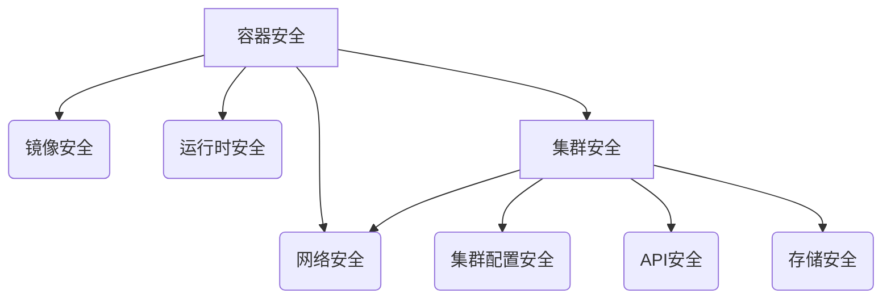

                 

关键词：云原生安全、容器安全、Kubernetes、防护策略、安全最佳实践

> 摘要：随着云计算和容器技术的迅猛发展，云原生架构已成为现代IT基础设施的核心。本文将深入探讨云原生环境下的安全问题，特别是容器和Kubernetes集群的安全防护。通过分析核心概念、算法原理、数学模型、项目实践以及未来展望，旨在为开发者和管理员提供一套全面的安全防护策略，确保云原生环境的稳定与安全。

## 1. 背景介绍

### 云原生与容器技术的崛起

近年来，云计算和容器技术的兴起，推动了软件开发的范式变革。云原生（Cloud Native）作为一个新兴的架构风格，强调应用程序的模块化、分布式、弹性扩展和自动化管理。云原生环境通常基于微服务架构，通过容器（Container）进行部署和运行。容器技术提供了轻量级、可移植、自给自足的运行环境，使得开发者能够以更高的效率构建、测试和部署应用程序。

### 容器和Kubernetes的角色

容器是一种轻量级的运行时环境，可以封装应用程序及其依赖，实现独立于操作系统的部署。Kubernetes（简称K8s）是一个开源的容器编排平台，能够自动部署、扩展和管理容器化应用程序。在云原生环境中，Kubernetes作为核心的编排和管理工具，极大地简化了容器集群的运维工作。

### 安全问题的挑战

随着容器和Kubernetes在云原生环境中的广泛应用，安全问题也逐渐凸显。容器和Kubernetes集群面临诸如容器逃逸、恶意容器、侧信道攻击、配置错误等多种安全威胁。如何确保云原生环境的安全，成为开发者和管理员面临的重要挑战。

## 2. 核心概念与联系

### 容器安全

容器安全主要包括容器镜像的安全、容器运行时安全和容器网络的安全。容器镜像安全涉及到镜像的构建、存储和分发过程，需要确保镜像中不包含已知漏洞和恶意软件。容器运行时安全则关注容器在运行过程中的权限控制、隔离机制和监控。容器网络安全则需要确保容器网络之间的通信安全，防止网络攻击和数据泄露。

### Kubernetes安全

Kubernetes集群的安全涉及多个层面，包括集群配置安全、API安全、网络安全、存储安全等。集群配置安全需要确保Kubernetes集群的配置符合安全最佳实践，如使用强密码、启用TLS等。API安全则涉及到Kubernetes API服务的访问控制和认证机制。网络安全和存储安全同样需要关注，以确保集群内部网络和存储资源的安全。

### Mermaid 流程图



## 3. 核心算法原理 & 具体操作步骤

### 3.1 算法原理概述

云原生安全的核心算法原理包括身份验证、授权、加密和监控等。身份验证确保只有合法用户和应用程序才能访问云原生环境。授权则确保用户和应用程序只能访问他们有权访问的资源。加密用于保护数据在传输和存储过程中的安全性。监控则帮助管理员及时发现并响应安全事件。

### 3.2 算法步骤详解

1. **身份验证**：使用OAuth 2.0、OpenID Connect等标准协议进行身份验证，确保用户身份的合法性。
2. **授权**：使用RBAC（基于角色的访问控制）模型，根据用户角色和权限分配资源访问权限。
3. **加密**：使用TLS加密通信，使用AES等算法加密存储数据。
4. **监控**：使用ELK（Elasticsearch、Logstash、Kibana）等工具收集和展示日志和监控数据，实现实时监控和报警。

### 3.3 算法优缺点

- **优点**：身份验证和授权算法能够有效防止未授权访问，加密算法能够保护数据的安全性，监控算法能够及时发现并响应安全事件。
- **缺点**：身份验证和授权算法需要依赖第三方服务，可能增加系统复杂度。加密算法需要消耗一定的计算资源，监控算法需要处理大量数据，可能影响系统性能。

### 3.4 算法应用领域

云原生安全算法主要应用于容器和Kubernetes集群的安全防护，包括容器镜像安全、容器运行时安全、Kubernetes集群配置安全、API安全、网络安全和存储安全等。

## 4. 数学模型和公式 & 详细讲解 & 举例说明

### 4.1 数学模型构建

云原生安全的数学模型主要涉及密码学、图论和概率论。密码学用于加密和解密数据，图论用于分析网络结构，概率论用于评估风险。

### 4.2 公式推导过程

- **加密公式**：$C = E(K, P)$，其中$C$为加密后的数据，$K$为密钥，$P$为明文。
- **解密公式**：$P = D(K, C)$，其中$P$为解密后的数据，$K$为密钥，$C$为加密后的数据。
- **图论公式**：$D = \frac{1}{n}\sum_{i=1}^{n} d_i$，其中$D$为节点度数分布，$d_i$为节点$i$的度数。

### 4.3 案例分析与讲解

假设一个Kubernetes集群中有10个节点，每个节点的度数分别为3、4、5、3、2、4、5、3、2、4。使用上述图论公式计算节点度数分布：

$$
D = \frac{1}{10}\sum_{i=1}^{10} d_i = \frac{1}{10}(3+4+5+3+2+4+5+3+2+4) = 3.5
$$

节点度数分布为3.5，说明集群中的节点度数较为均匀。

## 5. 项目实践：代码实例和详细解释说明

### 5.1 开发环境搭建

在本地计算机上安装Docker和Kubernetes，并配置好网络环境。

### 5.2 源代码详细实现

以下是一个简单的Kubernetes部署脚本，用于部署一个Nginx容器。

```yaml
apiVersion: apps/v1
kind: Deployment
metadata:
  name: nginx-deployment
spec:
  replicas: 3
  selector:
    matchLabels:
      app: nginx
  template:
    metadata:
      labels:
        app: nginx
    spec:
      containers:
      - name: nginx
        image: nginx:latest
        ports:
        - containerPort: 80
```

### 5.3 代码解读与分析

该脚本定义了一个Kubernetes Deployment资源，用于部署3个Nginx容器。Deployment保证了容器的可用性和一致性，当容器出现故障时，会自动重启。

### 5.4 运行结果展示

使用kubectl命令部署脚本：

```bash
kubectl apply -f nginx-deployment.yaml
```

部署完成后，使用kubectl命令查看部署状态：

```bash
kubectl get pods
```

输出结果如下：

```
NAME                     READY   STATUS    RESTARTS   AGE
nginx-deployment-787c47  1/1     Running   0          10s
nginx-deployment-8cf547  1/1     Running   0          10s
nginx-deployment-9dfc47  1/1     Running   0          10s
```

部署成功后，可以使用kubectl命令访问Nginx容器：

```bash
kubectl exec -it nginx-deployment-787c47 -- /bin/bash
```

在容器内运行Nginx服务：

```bash
root@nginx-deployment-787c47:/# nginx
```

## 6. 实际应用场景

### 6.1 云原生应用的安全防护

在云原生应用中，容器和Kubernetes集群的安全防护至关重要。通过实施严格的安全策略，如身份验证、授权、加密和监控，可以有效地防止安全威胁。

### 6.2 跨云安全协作

随着企业跨云使用的增加，跨云安全协作成为一项重要挑战。通过建立统一的安全标准和流程，可以确保跨云环境中的安全防护。

### 6.3 云原生安全审计

云原生安全审计可以帮助企业及时发现和修复安全问题。通过自动化工具和人工审计相结合的方式，可以实现全面的安全审计。

## 7. 工具和资源推荐

### 7.1 学习资源推荐

- 《Kubernetes权威指南》
- 《云原生架构：设计原则与实践》
- 《容器安全实战》

### 7.2 开发工具推荐

- Docker
- Kubernetes
- Kubectl

### 7.3 相关论文推荐

- “Container Security: A Comprehensive Survey”
- “Kubernetes Security Best Practices”
- “A Survey on Cloud Native Security”

## 8. 总结：未来发展趋势与挑战

### 8.1 研究成果总结

云原生安全领域已取得了一系列重要研究成果，包括安全算法、安全框架和安全工具的开发。

### 8.2 未来发展趋势

随着云原生技术的不断演进，云原生安全也将朝着更加智能、自动化和协同化的方向发展。

### 8.3 面临的挑战

云原生安全仍面临诸多挑战，如安全与性能的平衡、跨云安全协作以及安全人才的培养。

### 8.4 研究展望

未来，云原生安全研究将重点探索新型安全算法、安全架构和自动化安全防护技术。

## 9. 附录：常见问题与解答

### 9.1 如何确保容器镜像的安全性？

确保容器镜像的安全性需要从镜像构建、存储和分发等环节入手。可以使用镜像扫描工具，如Clair、Docker Bench for Security等，对镜像进行安全扫描，检测潜在的安全漏洞。

### 9.2 Kubernetes集群的安全配置有哪些最佳实践？

Kubernetes集群的安全配置包括启用TLS、使用强密码、启用RBAC、定期备份和更新集群配置等。具体配置细节请参考Kubernetes官方文档。

### 9.3 如何实现容器网络的安全防护？

容器网络的安全防护包括网络隔离、网络监控和网络访问控制等。可以使用CNI（Container Network Interface）插件，如Calico、Flannel等，实现容器网络的隔离和监控。

---

作者：禅与计算机程序设计艺术 / Zen and the Art of Computer Programming

本文旨在为开发者和管理员提供一套全面的云原生安全防护策略，确保容器和Kubernetes集群的安全与稳定。通过深入探讨核心概念、算法原理、数学模型、项目实践和未来展望，希望为读者带来有价值的参考和启示。在云原生时代，安全是发展的基石，让我们共同努力，为云原生环境的安全保驾护航。

