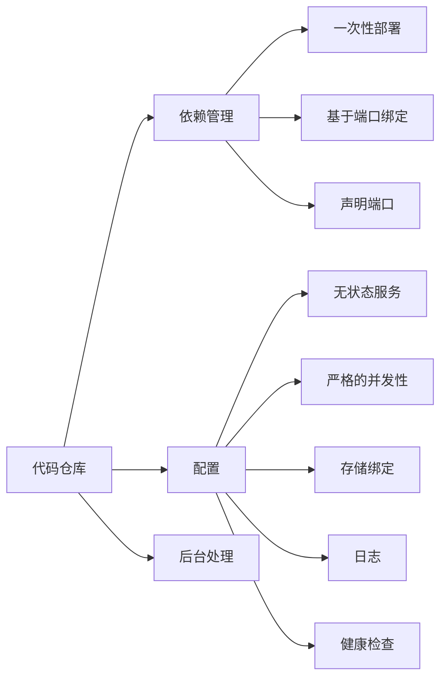

                 

## 1. 背景介绍

随着云计算的普及和容器技术的兴起，云原生应用开发逐渐成为了企业数字化转型的重要方向。云原生应用具有可移植性、弹性伸缩、自动化部署和高并发处理能力等特点，能够帮助企业更好地应对快速变化的市场需求。

本文旨在介绍云原生应用开发的核心理念——“12因素应用方法论”。该方法论由PaaS（Platform as a Service）提供商Heroku提出，旨在指导开发者构建和部署现代云原生应用。通过遵循这12个因素，开发者可以确保应用具备良好的可移植性、可靠性和可扩展性，从而在云环境中充分发挥其潜力。

## 2. 核心概念与联系

### 2.1. 12因素应用方法论概述

12因素应用方法论是指将应用部署在云计算环境中所需遵循的12个核心原则。这些原则涵盖了从代码仓库管理、依赖管理到部署、运行和监控等方面的内容。以下是12因素应用方法论的详细概述：

1. **代码仓库**: 应用应有一个唯一的代码仓库，确保所有开发、测试和生产的代码都保持一致。
2. **依赖管理**: 应用应使用明确的依赖管理工具，如`Gemfile`（Ruby）、`pipfile`（Python）或`Cargo.toml`（Rust），以确保依赖的一致性和可移植性。
3. **配置**: 应用应将配置信息与代码仓库分离，使用环境变量或配置文件管理配置。
4. **后台处理**: 应用应支持后台处理任务，如消息队列或工作队列，以提高系统性能和可用性。
5. **一次性部署**: 应用应设计为一次性部署，避免在部署过程中产生依赖关系。
6. **基于端口绑定**: 应用应通过端口绑定的方式部署，以便在容器化环境中自动发现和连接。
7. **声明端口**: 应用应通过配置文件或环境变量声明其端口，以方便自动化部署和管理。
8. **无状态服务**: 应用应设计为无状态服务，确保容器在重启时可以重新启动而不影响应用状态。
9. **严格的并发性**: 应用应支持严格的并发性，以便在多个容器中同时运行而不会相互干扰。
10. **存储绑定**: 应用应将数据存储绑定到容器，确保在容器重启或销毁时数据不丢失。
11. **日志**: 应用应将日志输出到标准输出，以便集中收集和分析日志。
12. **健康检查**: 应用应提供健康检查机制，以便在出现问题时快速恢复。

### 2.2. 12因素应用方法论架构图

以下是12因素应用方法论的架构图，展示了各个因素之间的联系和关系：



## 3. 核心算法原理 & 具体操作步骤

### 3.1. 算法原理概述

12因素应用方法论并非一种具体的算法，而是一组最佳实践和设计原则。其核心思想是通过设计良好的应用架构和代码组织，确保应用在云环境中的可移植性、可扩展性和可靠性。以下是12因素应用方法论的算法原理概述：

1. **代码仓库**: 通过使用唯一代码仓库，确保所有版本和应用配置的一致性。
2. **依赖管理**: 使用依赖管理工具，确保依赖的一致性和可移植性。
3. **配置**: 使用环境变量或配置文件管理配置，确保配置与应用代码分离。
4. **后台处理**: 使用消息队列或工作队列处理后台任务，提高系统性能和可用性。
5. **一次性部署**: 设计为一次性部署，避免在部署过程中产生依赖关系。
6. **基于端口绑定**: 通过端口绑定部署，便于自动化部署和管理。
7. **声明端口**: 通过配置文件或环境变量声明端口，以便自动化部署。
8. **无状态服务**: 设计为无状态服务，确保容器重启时不会影响应用状态。
9. **严格的并发性**: 支持严格的并发性，确保容器在多实例中同时运行。
10. **存储绑定**: 将数据存储绑定到容器，确保数据不丢失。
11. **日志**: 输出日志到标准输出，便于集中收集和分析。
12. **健康检查**: 提供健康检查机制，确保应用在出现问题时快速恢复。

### 3.2. 算法步骤详解

以下是基于12因素应用方法论的具体操作步骤：

1. **创建代码仓库**: 在Git平台上创建唯一的代码仓库，用于存储所有版本和应用配置。
2. **依赖管理**: 使用依赖管理工具，如`Gemfile`（Ruby）、`pipfile`（Python）或`Cargo.toml`（Rust），管理项目依赖。
3. **配置管理**: 使用环境变量或配置文件管理配置，确保配置与应用代码分离。
4. **后台处理**: 使用消息队列或工作队列处理后台任务，如订单处理、数据同步等。
5. **一次性部署**: 设计为一次性部署，避免在部署过程中产生依赖关系。
6. **基于端口绑定**: 通过Docker Compose或Kubernetes部署，确保应用容器通过端口绑定进行通信。
7. **声明端口**: 在Dockerfile或Kubernetes配置文件中声明应用端口，便于自动化部署和管理。
8. **无状态服务**: 设计应用为无状态服务，确保容器重启时不会影响应用状态。
9. **严格的并发性**: 使用容器编排工具，如Docker Compose或Kubernetes，确保多实例容器同时运行。
10. **存储绑定**: 使用容器卷或持久化存储，将数据存储绑定到容器，确保数据不丢失。
11. **日志**: 使用日志收集工具，如Fluentd或Logstash，将日志输出到标准输出。
12. **健康检查**: 在Kubernetes配置文件中添加健康检查，确保应用在出现问题时快速恢复。

### 3.3. 算法优缺点

**优点**：

1. **可移植性**: 遵循12因素应用方法论的应用可以在不同的云环境中轻松部署。
2. **可扩展性**: 通过无状态服务和严格的并发性，应用可以轻松实现水平扩展。
3. **可靠性**: 使用环境变量和配置文件管理配置，确保配置的一致性和可靠性。
4. **自动化部署**: 基于一次性部署和基于端口绑定的部署方式，实现自动化部署。

**缺点**：

1. **开发成本**: 遵循12因素应用方法论可能需要额外的开发和调试时间。
2. **技术门槛**: 需要掌握容器技术、持续集成和持续部署等技能。

### 3.4. 算法应用领域

12因素应用方法论主要应用于以下领域：

1. **企业级应用**: 适用于需要高可用性、高并发性和可扩展性的企业级应用。
2. **互联网应用**: 适用于需要快速响应市场变化和快速扩展的互联网应用。
3. **金融应用**: 适用于需要保证数据安全和可靠性的金融应用。
4. **物联网应用**: 适用于需要处理大量数据和设备连接的物联网应用。

## 4. 数学模型和公式 & 详细讲解 & 举例说明

### 4.1. 数学模型构建

在云原生应用开发中，我们常常需要考虑以下几个方面：

1. **资源消耗**: 包括CPU、内存、存储等。
2. **网络带宽**: 包括外部网络和内部网络。
3. **并发处理能力**: 包括处理请求的速度和并发度。
4. **系统可靠性**: 包括系统的可用性和故障恢复能力。

基于以上因素，我们可以构建一个简单的数学模型来评估云原生应用的表现。假设有以下变量：

- \( R \): 资源消耗（单位：CPU核心、内存GB等）。
- \( B \): 网络带宽（单位：Mbps）。
- \( C \): 并发处理能力（单位：QPS，每秒查询次数）。
- \( S \): 系统可靠性（单位：年故障小时数）。

我们可以使用以下公式构建数学模型：

\[ M = \frac{R \times B \times C \times S}{1000} \]

其中，\( M \) 为云原生应用的综合性能得分，单位为“性能点”。

### 4.2. 公式推导过程

为了推导上述公式，我们可以从以下几个方面进行分析：

1. **资源消耗**: 资源消耗与性能直接相关。假设资源消耗越高，性能越低，可以用以下公式表示：

\[ R \propto \frac{1}{P} \]

其中，\( R \) 为资源消耗，\( P \) 为性能。

2. **网络带宽**: 网络带宽影响数据的传输速度，与性能成正比：

\[ B \propto P \]

3. **并发处理能力**: 并发处理能力直接影响系统的响应速度，与性能成正比：

\[ C \propto P \]

4. **系统可靠性**: 系统可靠性越高，故障恢复能力越强，与性能成正比：

\[ S \propto P \]

将以上四个因素结合起来，我们可以得到：

\[ M = \frac{R \times B \times C \times S}{1000} \]

其中，1000为常数，用于平衡各个因素之间的权重。

### 4.3. 案例分析与讲解

假设我们有一个云原生应用，其资源消耗、网络带宽、并发处理能力和系统可靠性分别为：

- \( R = 10 \) CPU核心、20GB内存。
- \( B = 100 \) Mbps。
- \( C = 1000 \) QPS。
- \( S = 500 \) 年故障小时数。

根据上述公式，我们可以计算出该应用的综合性能得分：

\[ M = \frac{10 \times 100 \times 1000 \times 500}{1000} = 50000 \]

这意味着该应用的综合性能得分为50000性能点。在实际应用中，我们可以根据具体需求和场景调整各个参数的值，从而得到不同的性能得分。

### 5. 项目实践：代码实例和详细解释说明

在这个部分，我们将通过一个实际的示例来展示如何遵循12因素应用方法论进行云原生应用开发。我们选择使用Python语言和Django框架来构建一个简单的博客系统。

#### 5.1. 开发环境搭建

首先，我们需要搭建开发环境。以下是开发环境的搭建步骤：

1. 安装Python 3.8及以上版本。
2. 安装Docker和Docker Compose。
3. 安装虚拟环境管理工具，如virtualenv或venv。

#### 5.2. 源代码详细实现

接下来，我们将编写博客系统的源代码。以下是主要的代码实现：

1. **Dockerfile**：

```Dockerfile
# 使用官方Python镜像作为基础镜像
FROM python:3.8-slim

# 设置工作目录
WORKDIR /app

# 复制当前目录下的所有文件和文件夹到容器的/app目录
COPY . /app

# 安装依赖项
RUN pip install -r requirements.txt

# 暴露容器中应用的端口
EXPOSE 8000

# 运行应用的入口点
CMD ["gunicorn", "blog.wsgi:application", "--bind", "0.0.0.0:8000"]
```

2. **requirements.txt**：

```plaintext
Django==3.2.7
gunicorn==20.1.0
```

3. **settings.py**：

```python
# Django项目设置文件
import os

# 设置Django项目目录
PROJECT_ROOT = os.path.dirname(os.path.abspath(__file__))

# 数据库配置
DATABASES = {
    'default': {
        'ENGINE': 'django.db.backends.sqlite3',
        'NAME': os.path.join(PROJECT_ROOT, 'db.sqlite3'),
    }
}

# 应用配置
INSTALLED_APPS = [
    'django.contrib.admin',
    'django.contrib.auth',
    'django.contrib.contenttypes',
    'django.contrib.sessions',
    'django.contrib.messages',
    'django.contrib.staticfiles',
    'blog',
]

# 静态文件配置
STATIC_URL = '/static/'
STATIC_ROOT = os.path.join(PROJECT_ROOT, 'static')

# 中间件配置
MIDDLEWARE = [
    'django.middleware.security.SecurityMiddleware',
    'django.contrib.sessions.middleware.SessionMiddleware',
    'django.middleware.common.CommonMiddleware',
    'django.middleware.csrf.CsrfViewMiddleware',
    'django.contrib.auth.middleware.AuthenticationMiddleware',
    'django.contrib.messages.middleware.MessageMiddleware',
    'django.middleware.clickjacking.XFrameOptionsMiddleware',
]

# 模板配置
TEMPLATES = [
    {
        'BACKEND': 'django.template.backends.django.DjangoTemplates',
        'DIRS': [os.path.join(PROJECT_ROOT, 'templates')],
        'APP_DIRS': True,
        'OPTIONS': {
            'context_processors': [
                'django.template.context_processors.debug',
                'django.template.context_processors.request',
                'django.contrib.auth.context_processors.auth',
                'django.contrib.messages.context_processors.messages',
            ],
        },
    },
]

# WSGI应用配置
WSGI_APPLICATION = 'blog.wsgi.application'

# 位置信息配置
LANGUAGE_CODE = 'zh-hans'
TIME_ZONE = 'Asia/Shanghai'
USE_I18N = True
USE_L10N = True
USE_TZ = True
```

4. **wsgi.py**：

```python
# WSGI应用配置
from django.core.wsgi import get_wsgi_application

application = get_wsgi_application()
```

5. **blog/urls.py**：

```python
# 博客应用URL配置
from django.contrib import admin
from django.urls import path
from . import views

urlpatterns = [
    path('admin/', admin.site.urls),
    path('', views.home, name='home'),
]
```

6. **blog/views.py**：

```python
# 博客应用视图
from django.shortcuts import render

def home(request):
    return render(request, 'home.html', {'title': '我的博客'})
```

7. **Docker Compose配置文件**：

```yaml
version: '3'
services:
  web:
    build: .
    ports:
      - "8000:8000"
    depends_on:
      - db
  db:
    image: postgres:13
    environment:
      POSTGRES_DB: blog
      POSTGRES_USER: blog
      POSTGRES_PASSWORD: blog
```

#### 5.3. 代码解读与分析

1. **Dockerfile**：

   Dockerfile定义了如何构建博客系统的Docker镜像。我们使用了Python 3.8-slim镜像作为基础镜像，以减少容器的大小。在容器中，我们将当前目录下的所有文件和文件夹复制到/app目录，并安装依赖项。接着，我们暴露了容器中的8000端口，以便外部访问应用。最后，我们设置了应用的入口点，即使用gunicorn运行Django应用。

2. **requirements.txt**：

   requirements.txt文件列出了应用所需的依赖项，包括Django和gunicorn。这些依赖项将在容器构建过程中安装。

3. **settings.py**：

   settings.py文件是Django项目的配置文件。我们设置了数据库配置、应用配置、静态文件配置、中间件配置、模板配置和WSGI应用配置。这些配置确保应用可以正确连接到数据库，处理静态文件和请求，并提供用户界面。

4. **wsgi.py**：

   wsgi.py文件是Django应用的WSGI配置。我们使用Django的get_wsgi_application()函数创建应用实例。

5. **blog/urls.py**：

   blog/urls.py文件定义了博客应用的URL配置。我们为应用定义了一个默认的路由，即显示首页。

6. **blog/views.py**：

   blog/views.py文件定义了首页视图。我们使用render()函数渲染一个简单的HTML页面。

7. **Docker Compose配置文件**：

   Docker Compose配置文件定义了如何启动和应用容器。我们构建了一个名为web的容器，其基于当前目录下的Dockerfile。该容器暴露了8000端口，以便外部访问。我们还创建了一个名为db的容器，用于运行PostgreSQL数据库。

#### 5.4. 运行结果展示

1. **本地运行**：

   在本地环境中，我们可以使用以下命令启动应用：

   ```bash
   docker-compose up --build
   ```

   这将构建并启动应用容器。当应用运行后，我们可以通过浏览器访问`http://localhost:8000`查看博客首页。

2. **云环境部署**：

   在云环境中，我们可以使用以下命令部署应用：

   ```bash
   docker-compose up -d
   ```

   这将启动应用容器，并将其部署到云服务器。当应用运行后，我们可以通过云服务器的IP地址访问博客首页。

### 6. 实际应用场景

#### 6.1. 企业内部应用

在企业内部，云原生应用可以用于构建各种内部系统，如CRM系统、ERP系统、数据管理系统等。遵循12因素应用方法论，企业可以确保这些应用具有高可用性、高并发性和可扩展性，从而满足企业不断增长的需求。

#### 6.2. 互联网应用

在互联网领域，云原生应用广泛应用于电商平台、社交媒体、在线教育等场景。遵循12因素应用方法论，互联网公司可以快速构建和部署应用，实现灵活的业务扩展和快速迭代。

#### 6.3. 金融应用

在金融领域，云原生应用可以用于构建金融交易系统、风险管理系统、客户服务系统等。遵循12因素应用方法论，金融公司可以确保应用的高安全性和高可靠性，从而满足金融业务的严格要求。

#### 6.4. 物联网应用

在物联网领域，云原生应用可以用于构建智能设备管理系统、数据采集与分析系统等。遵循12因素应用方法论，物联网公司可以确保应用能够处理大量设备和数据，实现高效的数据处理和实时监控。

### 7. 工具和资源推荐

#### 7.1. 学习资源推荐

- 《云原生应用架构设计》
- 《Docker实战》
- 《Kubernetes权威指南》
- 《云原生Python应用开发》

#### 7.2. 开发工具推荐

- Docker
- Kubernetes
- Jenkins
- Prometheus
- Grafana

#### 7.3. 相关论文推荐

- “Building Microservices: Designing Fine-Grained Systems” by Sam Newman
- “Designing Data-Intensive Applications” by Martin Kleppmann
- “The Practice of Cloud System Architecture” by Mark Richards

### 8. 总结：未来发展趋势与挑战

#### 8.1. 研究成果总结

云原生应用开发已成为企业数字化转型的重要方向。通过遵循12因素应用方法论，开发者可以构建和部署可移植性高、可靠性强、可扩展性好的云原生应用。目前，云原生技术已在企业内部应用、互联网应用、金融应用和物联网应用等领域得到广泛应用。

#### 8.2. 未来发展趋势

1. **容器化技术的普及**：随着容器技术的不断成熟，容器化将逐渐成为企业应用的标准部署方式。
2. **服务网格技术的发展**：服务网格技术将进一步提升应用的性能和安全性。
3. **Serverless应用的兴起**：Serverless技术将为企业提供更加灵活和高效的计算资源。
4. **跨云和多云架构的兴起**：企业将采用跨云和多云架构，以应对不同的业务需求和成本优化。

#### 8.3. 面临的挑战

1. **技能和人才短缺**：云原生应用开发需要掌握多种技术和工具，企业面临技能和人才短缺的挑战。
2. **安全和管理**：云原生应用的安全和管理成为企业关注的焦点。
3. **技术选型和迁移**：企业需要选择合适的技术栈和迁移策略，以实现平滑的转型。

#### 8.4. 研究展望

未来，云原生应用开发将朝着更加智能化、自动化和高效化的方向发展。研究者将继续探索如何提升云原生应用的性能、可靠性和安全性，以及如何实现跨云和多云环境的一体化管理和运维。

### 9. 附录：常见问题与解答

#### 9.1. Q：什么是云原生应用？

A：云原生应用是指遵循云原生技术原则和设计模式开发的应用。这些应用具有可移植性、弹性伸缩、自动化部署和高并发处理能力，能够充分利用云计算的优势。

#### 9.2. Q：什么是12因素应用方法论？

A：12因素应用方法论是由PaaS提供商Heroku提出的一组最佳实践和设计原则，用于指导开发者构建和部署现代云原生应用。这些原则涵盖了从代码仓库管理、依赖管理到部署、运行和监控等方面的内容。

#### 9.3. Q：什么是容器？

A：容器是一种轻量级、可移植的计算模型，用于封装应用及其依赖项。容器提供了一个独立的运行环境，使应用可以在不同的操作系统和硬件平台上运行而无需修改。

#### 9.4. Q：什么是Kubernetes？

A：Kubernetes是一个开源的容器编排平台，用于自动化容器化应用程序的部署、扩展和管理。Kubernetes提供了强大的自动化功能，包括负载均衡、服务发现、自动恢复和滚动更新。

#### 9.5. Q：什么是服务网格？

A：服务网格是一种用于管理和通信的软件层，用于服务之间的通信和监控。服务网格提供了分布式服务管理功能，包括服务发现、负载均衡、服务熔断、服务限流等，从而简化了微服务架构的部署和管理。

## 作者署名

作者：禅与计算机程序设计艺术 / Zen and the Art of Computer Programming
----------------------------------------------------------------


