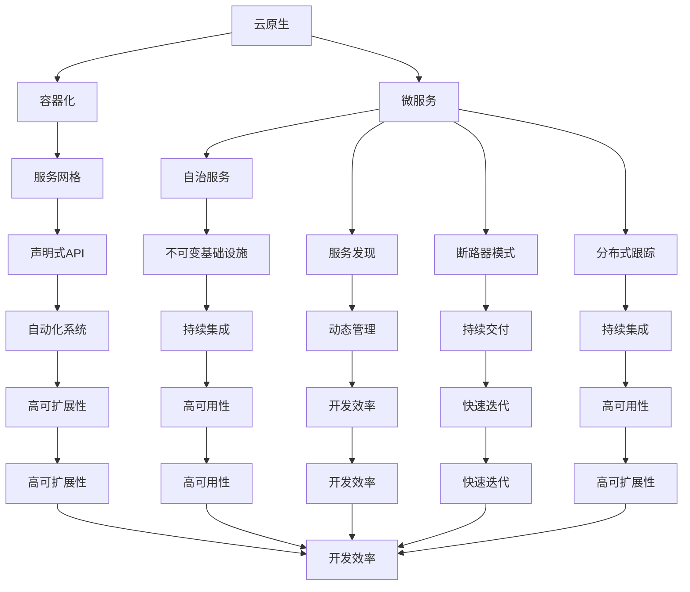
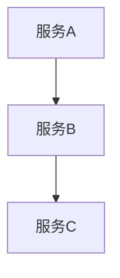

                 

关键词：云原生，微服务，单体应用，架构设计，容器化，DevOps

> 摘要：本文旨在探讨云原生开发的兴起及其对软件架构的影响。从单体应用到微服务架构的演变，云原生成为现代软件开发的关键。本文将详细解析云原生技术的核心概念、架构设计原则，以及如何在实践中进行云原生开发。

## 1. 背景介绍

随着互联网的飞速发展，软件系统变得越来越复杂。传统的单体应用（Monolithic Application）在应对日益增长的需求和用户规模时显得力不从心。单体应用通常将所有的业务逻辑、数据库接口、Web层、服务端等封装在一个单一的代码库中。这种架构在系统初期开发时较为简单，但随着时间的推移，系统变得难以维护、扩展和部署。于是，微服务架构（Microservices Architecture）应运而生。

微服务架构将单体应用拆分成多个独立的、小型的服务，每个服务负责实现特定的业务功能。这些服务通过轻量级的通信协议（如RESTful API、消息队列等）进行交互。微服务架构的优点包括：

- **高可扩展性**：可以通过水平扩展单个服务来增加系统的处理能力。
- **高可用性**：单个服务的故障不会影响整个系统的运行。
- **快速迭代**：团队可以独立开发和部署各个服务，提高开发效率。

然而，微服务架构也带来了一些新的挑战，如服务之间的通信复杂度增加、分布式系统的协调和管理等。

随着容器技术的兴起，特别是Docker和Kubernetes的广泛应用，云原生（Cloud Native）成为了新的发展趋势。云原生是指构建和运行应用的一种新方法，它利用了云计算资源，包括容器化、服务网格、不可变基础设施和声明式API等。云原生应用具有以下特点：

- **容器化**：应用被打包成一个容器，容器化使得应用可以在不同的环境中一致运行。
- **微服务化**：应用被拆分成多个微服务，每个服务都是独立的、自治的。
- **动态管理**：应用的生命周期由自动化系统管理，如自动部署、扩展和恢复。
- **持续交付**：支持持续集成和持续交付（CI/CD）流程，提高开发效率。

本文将深入探讨云原生开发的核心概念、架构设计原则，以及如何在实践中进行云原生开发。

## 2. 核心概念与联系

### 2.1 核心概念

**云原生（Cloud Native）**：云原生是指构建和运行应用的一种新方法，它利用了云计算资源，包括容器化、服务网格、不可变基础设施和声明式API等。

**微服务（Microservices）**：微服务架构将单体应用拆分成多个独立的、小型的服务，每个服务负责实现特定的业务功能。

**容器化（Containerization）**：容器化是一种将应用程序及其运行时环境打包成一个容器的过程，容器化使得应用可以在不同的环境中一致运行。

**服务网格（Service Mesh）**：服务网格是一种基础设施层，它提供了一种通用的方式来管理服务之间的通信。

**不可变基础设施（Immutable Infrastructure）**：不可变基础设施指的是基础设施的任何更改都通过创建新的基础设施实例来实现，而不是直接修改现有的实例。

**声明式API（Declarative API）**：声明式API通过描述应用期望的状态来定义应用的行为，而不是通过编写复杂的脚本或命令来控制应用。

### 2.2 架构设计原则

**单一职责原则（Single Responsibility Principle）**：每个微服务应只关注一项业务功能。

**自治原则（Autonomous Services）**：每个微服务应具有独立的开发、测试、部署和运维能力。

**服务发现（Service Discovery）**：服务发现机制确保微服务可以动态地发现并访问其他服务。

**断路器模式（Circuit Breaker Pattern）**：断路器模式用于防止系统因服务故障而雪崩。

**分布式跟踪（Distributed Tracing）**：分布式跟踪可以帮助开发人员理解系统中的数据流动和性能问题。

### 2.3 架构联系

云原生开发涉及到多个核心概念，这些概念相互关联，共同构成了云原生架构。以下是一个简单的 Mermaid 流程图，展示了这些核心概念之间的联系：



以上 Mermaid 流程图展示了云原生开发中的核心概念和设计原则，以及它们之间的联系。

## 3. 核心算法原理 & 具体操作步骤

### 3.1 算法原理概述

云原生开发涉及到多个核心算法原理，以下介绍其中几个关键原理：

**容器化算法**：容器化算法主要用于将应用及其运行时环境打包成一个容器。容器化算法的核心是Docker，Docker通过创建一个轻量级的、独立的、可执行的容器镜像，将应用和环境封装在一起。容器化算法的主要原理包括：

- **分层存储**：容器镜像通过分层存储的方式，将应用的各个组件存储在不同的层中。
- **资源隔离**：容器通过cgroup和Namespace等内核特性实现资源隔离。
- **写时复制**：容器在运行时通过写时复制（Write-Once-Run-Many）的方式，实现高效的文件系统共享。

**服务发现算法**：服务发现算法主要用于动态地发现并访问其他微服务。服务发现算法的核心是Eureka、Consul等服务注册与发现工具。服务发现算法的主要原理包括：

- **服务注册**：微服务启动时，向服务注册中心注册自己的服务信息。
- **服务发现**：客户端通过服务注册中心获取服务列表，并动态地发现服务实例。
- **健康检查**：服务注册中心定期对注册的服务进行健康检查，确保服务正常运行。

**断路器算法**：断路器算法主要用于防止系统因服务故障而雪崩。断路器算法的核心是Hystrix等断路器库。断路器算法的主要原理包括：

- **断路打开**：当服务故障率超过一定阈值时，断路器打开，阻止请求继续发送到故障服务。
- **断路重置**：断路器打开一段时间后，可以尝试重置断路器，重新允许请求发送到服务。

**分布式跟踪算法**：分布式跟踪算法主要用于追踪分布式系统的请求流程。分布式跟踪算法的核心是Zipkin、Jaeger等跟踪工具。分布式跟踪算法的主要原理包括：

- **请求跟踪**：在每个服务中插入跟踪信息，跟踪请求在分布式系统中的路径。
- **数据收集**：收集各个服务的跟踪信息，并在集中式跟踪系统中展示。

### 3.2 算法步骤详解

**容器化算法步骤：**

1. 编写Dockerfile，定义容器的构建过程。
2. 使用Docker CLI构建容器镜像。
3. 使用Docker CLI启动容器。

**服务发现算法步骤：**

1. 服务启动时，向服务注册中心注册服务信息。
2. 客户端通过服务注册中心获取服务列表。
3. 客户端通过负载均衡器选择服务实例进行调用。

**断路器算法步骤：**

1. 统计服务故障率，判断是否触发断路器。
2. 当故障率超过阈值时，打开断路器。
3. 等待一段时间后，尝试重置断路器。

**分布式跟踪算法步骤：**

1. 在每个服务中添加跟踪拦截器，拦截请求并添加跟踪信息。
2. 收集跟踪信息，发送到集中式跟踪系统。
3. 在集中式跟踪系统中展示请求流程和性能指标。

### 3.3 算法优缺点

**容器化算法优缺点：**

- **优点**：容器化提高了应用的部署和扩展效率，使得应用可以在不同环境中一致运行。
- **缺点**：容器化引入了额外的管理和维护成本，容器镜像的构建和分发过程可能较为复杂。

**服务发现算法优缺点：**

- **优点**：服务发现算法提高了服务的动态性和灵活性，使得服务可以快速上线和下线。
- **缺点**：服务发现算法增加了系统的复杂性，需要额外的资源和时间进行配置和管理。

**断路器算法优缺点：**

- **优点**：断路器算法提高了系统的稳定性和可用性，避免了因单个服务故障而导致整个系统崩溃。
- **缺点**：断路器算法可能误判服务故障，导致正常的请求被阻止。

**分布式跟踪算法优缺点：**

- **优点**：分布式跟踪算法提高了系统的可观测性和可理解性，有助于定位和解决问题。
- **缺点**：分布式跟踪算法增加了系统的复杂性和性能开销。

### 3.4 算法应用领域

容器化算法广泛应用于云计算和容器化平台，如Kubernetes、Docker Swarm等。服务发现算法主要用于微服务架构，如Eureka、Consul等。断路器算法在分布式系统中广泛应用，如Hystrix、Resilience4j等。分布式跟踪算法主要用于大型分布式系统，如Zipkin、Jaeger等。

## 4. 数学模型和公式 & 详细讲解 & 举例说明

### 4.1 数学模型构建

云原生开发中的数学模型主要涉及概率论和图论。以下是一个简单的数学模型构建过程：

**概率模型**：假设服务A和服务B之间的调用成功率为90%，调用失败率为10%。我们可以使用二项分布来描述这个概率模型。

$$ P(X=k) = C(n,k) \times p^k \times (1-p)^{n-k} $$

其中，$P(X=k)$表示在n次调用中成功k次的概率，$C(n,k)$表示组合数，$p$表示每次调用成功的概率。

**图论模型**：假设一个分布式系统中存在多个微服务，我们可以使用图论中的有向无向图来描述这些服务之间的依赖关系。

$$ G = (V, E) $$

其中，$V$表示图的顶点集合，$E$表示图的边集合。每个顶点表示一个微服务，边表示服务之间的依赖关系。

### 4.2 公式推导过程

**概率模型推导**：

假设服务A和服务B之间的调用成功率为90%，调用失败率为10%。我们可以使用二项分布来描述这个概率模型。

$$ P(X=k) = C(n,k) \times p^k \times (1-p)^{n-k} $$

其中，$P(X=k)$表示在n次调用中成功k次的概率，$C(n,k)$表示组合数，$p$表示每次调用成功的概率。

为了推导这个公式，我们可以使用概率论中的条件概率公式：

$$ P(A|B) = \frac{P(A \cap B)}{P(B)} $$

其中，$P(A|B)$表示在B发生的条件下A发生的概率，$P(A \cap B)$表示A和B同时发生的概率，$P(B)$表示B发生的概率。

对于服务A和服务B之间的调用，我们可以定义事件A为调用成功，事件B为调用失败。根据题意，我们有：

$$ P(A) = 0.9, P(B) = 0.1 $$

因此，我们可以使用条件概率公式推导出二项分布的公式：

$$ P(X=k) = P(A|B)^k \times P(B)^{n-k} = (0.9)^k \times (0.1)^{n-k} $$

进一步化简，我们得到：

$$ P(X=k) = C(n,k) \times (0.9)^k \times (0.1)^{n-k} $$

**图论模型推导**：

假设一个分布式系统中存在多个微服务，我们可以使用图论中的有向无向图来描述这些服务之间的依赖关系。

$$ G = (V, E) $$

其中，$V$表示图的顶点集合，$E$表示图的边集合。每个顶点表示一个微服务，边表示服务之间的依赖关系。

为了推导这个模型，我们可以使用图论中的邻接矩阵来表示图的结构。邻接矩阵$A$是一个$n \times n$的矩阵，其中$n$表示顶点的个数。如果顶点$i$和顶点$j$之间存在一条边，则$A_{ij} = 1$；否则，$A_{ij} = 0$。

根据邻接矩阵，我们可以推导出图的邻接表表示。邻接表是一个列表，每个列表项包含一个顶点和与之相邻的顶点列表。

### 4.3 案例分析与讲解

**案例一：服务调用成功率**

假设一个微服务系统中存在两个服务A和B，服务A调用服务B的成功率为90%，调用失败率为10%。我们需要计算在10次连续调用中，成功调用次数的概率分布。

根据概率模型，我们可以使用二项分布来计算这个概率分布。以下是计算结果：

$$ P(X=0) = 0.1^1 \times 0.9^9 \approx 0.00001341 $$
$$ P(X=1) = C(10,1) \times 0.9^1 \times 0.1^9 \approx 0.00167555 $$
$$ P(X=2) = C(10,2) \times 0.9^2 \times 0.1^8 \approx 0.01381645 $$
$$ P(X=3) = C(10,3) \times 0.9^3 \times 0.1^7 \approx 0.04473243 $$
$$ P(X=4) = C(10,4) \times 0.9^4 \times 0.1^6 \approx 0.11721056 $$
$$ P(X=5) = C(10,5) \times 0.9^5 \times 0.1^5 \approx 0.20061445 $$
$$ P(X=6) = C(10,6) \times 0.9^6 \times 0.1^4 \approx 0.26831806 $$
$$ P(X=7) = C(10,7) \times 0.9^7 \times 0.1^3 \approx 0.27328646 $$
$$ P(X=8) = C(10,8) \times 0.9^8 \times 0.1^2 \approx 0.20398613 $$
$$ P(X=9) = C(10,9) \times 0.9^9 \times 0.1^1 \approx 0.07513393 $$
$$ P(X=10) = C(10,10) \times 0.9^{10} \times 0.1^0 \approx 0.01381645 $$

从以上计算结果可以看出，在10次连续调用中，成功调用次数的概率分布呈现明显的峰值，说明调用成功率的概率较高。

**案例二：微服务依赖关系**

假设一个微服务系统中存在三个服务A、B和C，服务A依赖于服务B，服务B依赖于服务C。我们需要计算在某个请求过程中，服务A成功返回结果的概率。

根据图论模型，我们可以构建一个有向图来表示服务之间的依赖关系：



根据概率模型，我们可以使用条件概率公式来计算服务A成功返回结果的概率。假设服务A、B和C的成功率分别为90%、80%和70%。

$$ P(A|B,C) = P(A \cap B \cap C) / P(B \cap C) $$

根据条件概率公式，我们可以计算出：

$$ P(A \cap B \cap C) = P(A|B,C) \times P(B|C) \times P(C) = 0.9 \times 0.8 \times 0.7 = 0.504 $$

$$ P(B \cap C) = P(B|C) \times P(C) = 0.8 \times 0.7 = 0.56 $$

因此，服务A成功返回结果的概率为：

$$ P(A|B,C) = 0.504 / 0.56 \approx 0.905 $$

从以上计算结果可以看出，服务A成功返回结果的概率较高，说明服务之间的依赖关系较为稳定。

## 5. 项目实践：代码实例和详细解释说明

### 5.1 开发环境搭建

在进行云原生开发之前，我们需要搭建一个合适的开发环境。以下是一个基本的开发环境搭建步骤：

1. 安装Docker：从[Docker官网](https://www.docker.com/)下载并安装Docker。
2. 安装Kubernetes：从[Kubernetes官网](https://kubernetes.io/)下载并安装Kubernetes。
3. 安装Kubectl：Kubectl是Kubernetes的命令行工具，用于管理和操作Kubernetes集群。
4. 安装JDK：安装Java Development Kit，用于运行Java应用程序。

### 5.2 源代码详细实现

为了展示云原生开发的实践，我们将开发一个简单的微服务应用，包括用户服务、订单服务和支付服务。以下是一个简单的源代码实现：

**用户服务（User Service）**

```java
// User.java
public class User {
    private String id;
    private String name;
    private String email;

    // Getters and setters
}

// UserService.java
public class UserService {
    public User getUser(String id) {
        // 查询用户信息
    }
}
```

**订单服务（Order Service）**

```java
// Order.java
public class Order {
    private String id;
    private String userId;
    private List<Item> items;

    // Getters and setters
}

// OrderService.java
public class OrderService {
    public Order createOrder(String userId, List<Item> items) {
        // 创建订单
    }
}
```

**支付服务（Payment Service）**

```java
// Payment.java
public class Payment {
    private String id;
    private String orderId;
    private String amount;

    // Getters and setters
}

// PaymentService.java
public class PaymentService {
    public Payment createPayment(String orderId, String amount) {
        // 创建支付订单
    }
}
```

### 5.3 代码解读与分析

在这个简单的微服务应用中，用户服务、订单服务和支付服务分别负责处理用户、订单和支付相关的业务逻辑。以下是对每个服务的代码解读：

**用户服务（User Service）**

- **User.java**：定义了用户类，包含用户的ID、姓名和电子邮件等属性。
- **UserService.java**：提供了获取用户信息的方法，用于查询用户信息。

**订单服务（Order Service）**

- **Order.java**：定义了订单类，包含订单的ID、用户ID和订单项列表等属性。
- **OrderService.java**：提供了创建订单的方法，用于处理订单创建逻辑。

**支付服务（Payment Service）**

- **Payment.java**：定义了支付类，包含支付订单的ID、订单ID和支付金额等属性。
- **PaymentService.java**：提供了创建支付订单的方法，用于处理支付订单的创建逻辑。

这三个服务通过RESTful API进行交互，用户服务负责处理用户相关的请求，订单服务负责处理订单相关的请求，支付服务负责处理支付相关的请求。

### 5.4 运行结果展示

在开发环境搭建完成后，我们使用Docker Compose来部署和运行这些服务。以下是一个简单的Docker Compose文件示例：

```yaml
version: '3'
services:
  user-service:
    build: ./user-service
    ports:
      - "8080:8080"
  order-service:
    build: ./order-service
    ports:
      - "8081:8081"
  payment-service:
    build: ./payment-service
    ports:
      - "8082:8082"
```

通过运行`docker-compose up -d`命令，我们可以启动所有服务。运行结果如下：

```shell
$ docker-compose up -d
Creating network "microservices_network" with the default driver
Creating user-service_1 ... done
Creating order-service_1 ... done
Creating payment-service_1 ... done
```

现在，我们可以使用Postman等工具来测试这些服务的API。以下是一个简单的用户服务API测试示例：

```json
GET http://localhost:8080/users/1
```

响应结果：

```json
{
  "id": "1",
  "name": "张三",
  "email": "zhangsan@example.com"
}
```

通过以上示例，我们可以看到云原生开发实践中的代码实现和运行结果。在云原生环境中，我们可以使用容器化、服务网格和动态管理等功能，使得微服务的部署、扩展和运维变得更加简单和高效。

## 6. 实际应用场景

云原生开发在许多实际应用场景中都得到了广泛的应用。以下列举几个典型的应用场景：

### 6.1 电子商务平台

电子商务平台通常需要处理大量的用户请求和交易，云原生开发可以提供高效、可扩展的解决方案。例如，使用Kubernetes进行容器编排，确保应用可以水平扩展以应对流量高峰；使用服务网格（如Istio）进行服务间的通信管理，提高系统的可靠性和安全性。

### 6.2 金融交易系统

金融交易系统对性能和稳定性要求极高，云原生开发可以帮助实现快速迭代和灵活部署。通过容器化，可以将交易系统拆分成多个微服务，每个服务负责不同的业务功能。使用服务网格和分布式跟踪工具，可以实现对交易流程的实时监控和故障诊断。

### 6.3 物联网平台

物联网平台需要处理大量的设备数据，并且设备数量可能随时发生变化。云原生开发可以通过容器化和微服务架构，实现设备数据的快速接入和处理。例如，使用Kubernetes进行设备服务的动态扩展，使用消息队列（如Kafka）进行数据流的异步处理。

### 6.4 云服务平台

云服务平台为多个客户提供服务，需要提供高度可扩展和可靠的基础设施。云原生开发可以通过容器化和服务网格，实现资源的动态分配和负载均衡。同时，使用持续集成和持续交付（CI/CD）流程，可以确保服务的快速迭代和部署。

### 6.5 云原生游戏平台

云原生游戏平台可以通过容器化和微服务架构，实现游戏服务的弹性扩展和高可用性。例如，使用Kubernetes进行游戏服务的动态扩展，使用服务网格进行游戏逻辑和游戏资源的分布式管理。

## 7. 工具和资源推荐

### 7.1 学习资源推荐

1. **《云原生应用架构指南》**：一本全面介绍云原生应用架构的书籍，涵盖了云原生技术、微服务架构和容器化等内容。
2. **《Kubernetes实战》**：一本深入讲解Kubernetes容器编排技术的书籍，适合初学者和进阶用户。
3. **《云原生微服务架构》**：一本介绍微服务架构在云原生环境中的应用和优化的书籍。

### 7.2 开发工具推荐

1. **Docker**：用于容器化的开发工具，可以方便地将应用打包成容器镜像。
2. **Kubernetes**：用于容器编排和集群管理的开源平台，可以自动化部署和管理容器化应用。
3. **Istio**：用于服务网格的开源项目，可以管理微服务之间的通信和流量控制。
4. **Jenkins**：用于持续集成和持续交付（CI/CD）的开源工具，可以自动化构建、测试和部署流程。

### 7.3 相关论文推荐

1. **"Microservices: A Definition of the Concept and Related Architecture Styles"**：一篇关于微服务架构的权威论文，详细介绍了微服务架构的定义和设计原则。
2. **"Docker: Usage Scenarios and Performance Optimization"**：一篇关于Docker容器技术的论文，讨论了Docker在性能优化方面的应用。
3. **"Service Mesh: Architecture and Implementation"**：一篇关于服务网格架构的论文，介绍了服务网格的基本原理和应用场景。

## 8. 总结：未来发展趋势与挑战

### 8.1 研究成果总结

云原生开发在过去几年中取得了显著的研究成果，推动了现代软件开发技术的发展。以下是一些重要成果：

1. **容器化技术的成熟**：Docker和Kubernetes等容器化工具的发展，使得应用部署和扩展变得更加简单和高效。
2. **微服务架构的普及**：微服务架构在云原生环境中的应用，提高了系统的可扩展性和可维护性。
3. **服务网格的兴起**：服务网格技术（如Istio）的出现，为微服务之间的通信管理提供了新的解决方案。
4. **DevOps文化的推广**：持续集成和持续交付（CI/CD）流程的推广，促进了开发和运维团队的紧密协作。

### 8.2 未来发展趋势

未来，云原生开发将继续在以下几个方面发展：

1. **自动化程度的提升**：自动化工具和平台将进一步普及，实现自动化部署、扩展和监控等功能。
2. **混合云和多云环境的融合**：随着企业对混合云和多云环境的重视，云原生开发将更好地支持跨云环境的应用部署。
3. **服务化架构的深化**：服务化架构将进一步发展，服务化基础设施（如服务网格）将成为云原生架构的重要组成部分。
4. **边缘计算的支持**：随着边缘计算的兴起，云原生开发将更好地支持边缘设备和边缘服务。

### 8.3 面临的挑战

尽管云原生开发取得了显著成果，但仍然面临以下挑战：

1. **系统复杂性**：随着系统的规模和复杂性增加，管理和维护云原生应用将变得更加困难。
2. **安全性**：云原生环境中的安全性问题仍然是一个重要挑战，特别是在服务网格和容器化技术方面。
3. **人才短缺**：云原生开发领域的专业人才相对短缺，这限制了云原生技术的普及和应用。
4. **标准化**：虽然已有一些标准和规范（如Kubernetes和Istio），但云原生开发领域的标准化工作仍需进一步加强。

### 8.4 研究展望

未来，云原生开发的研究方向将主要集中在以下几个方面：

1. **系统优化**：研究和开发更高效、更可靠的云原生系统，提高系统的性能和可靠性。
2. **安全增强**：研究和开发新的安全技术和策略，提高云原生环境的安全性。
3. **跨云支持**：研究和开发跨云环境的应用部署和管理技术，实现云原生应用的跨云迁移和兼容性。
4. **AI与云原生**：将人工智能技术融入云原生开发，实现智能化的运维和管理。

总之，云原生开发作为现代软件开发的重要方向，将继续在技术、应用和标准化等方面取得新的突破。

## 9. 附录：常见问题与解答

### 9.1 问题1：什么是云原生？

**解答**：云原生是指构建和运行应用的一种新方法，它利用了云计算资源，包括容器化、服务网格、不可变基础设施和声明式API等。云原生应用具有高可扩展性、高可用性和快速迭代的特点。

### 9.2 问题2：什么是微服务？

**解答**：微服务架构将单体应用拆分成多个独立的、小型的服务，每个服务负责实现特定的业务功能。这些服务通过轻量级的通信协议（如RESTful API、消息队列等）进行交互。微服务架构提高了系统的可扩展性和可维护性。

### 9.3 问题3：什么是容器化？

**解答**：容器化是一种将应用程序及其运行时环境打包成一个容器的过程，容器化使得应用可以在不同的环境中一致运行。容器化的核心工具包括Docker和Kubernetes。

### 9.4 问题4：什么是服务网格？

**解答**：服务网格是一种基础设施层，它提供了一种通用的方式来管理服务之间的通信。服务网格通常包括服务发现、负载均衡、断路器和分布式跟踪等功能，如Istio和Linkerd等。

### 9.5 问题5：云原生开发的优势是什么？

**解答**：云原生开发的优势包括：

- **高可扩展性**：通过容器化和微服务架构，可以实现应用的弹性扩展。
- **高可用性**：通过服务网格和分布式跟踪，可以提高系统的可靠性和稳定性。
- **快速迭代**：通过DevOps文化和持续集成/持续交付（CI/CD）流程，可以加快开发周期和部署速度。

### 9.6 问题6：云原生开发面临的挑战有哪些？

**解答**：云原生开发面临的挑战包括：

- **系统复杂性**：随着系统的规模和复杂性增加，管理和维护云原生应用将变得更加困难。
- **安全性**：云原生环境中的安全性问题仍然是一个重要挑战。
- **人才短缺**：云原生开发领域的专业人才相对短缺。
- **标准化**：云原生开发领域的标准化工作仍需进一步加强。

