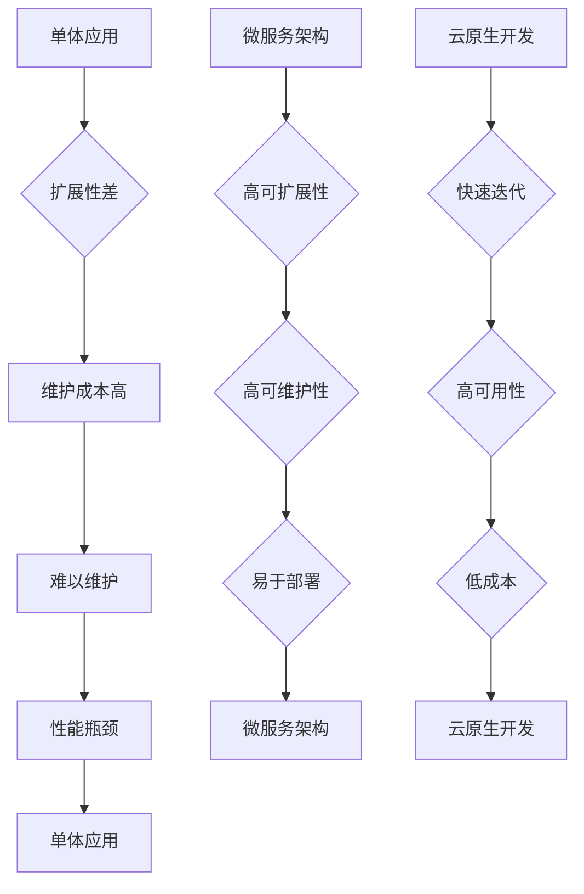

                 

关键词：云原生，微服务架构，单体应用，DevOps，容器化，持续集成和持续部署

摘要：本文将探讨从单体应用向微服务架构转型的云原生开发模式，阐述其核心概念、优势与挑战，并提供实用的项目实践和工具推荐。通过本文，读者将全面了解云原生开发的理念，掌握其关键技术和实践方法，为现代软件开发提供有力的技术支持。

## 1. 背景介绍

在互联网和云计算技术的快速发展下，软件开发的模式也在不断演变。传统的单体应用模式已经逐渐无法满足现代企业的需求。单体应用是指一个应用程序作为一个独立的整体，拥有单一的代码库、运行环境和部署包。然而，随着业务规模的扩大和系统复杂性的增加，单体应用面临着诸多问题，如代码耦合度高、扩展性差、维护成本高等。

为了解决这些问题，微服务架构应运而生。微服务架构将一个大型应用程序拆分为多个独立的小服务，每个服务负责完成一个特定的功能。这些服务之间通过轻量级的通信机制（如RESTful API）进行交互。微服务架构具有高可扩展性、高可用性和高可维护性的特点，成为现代软件开发的主流模式。

云原生开发是指在云环境中利用容器化、持续集成和持续部署等技术，实现应用程序的快速开发和部署。云原生开发不仅解决了单体应用模式的问题，还为微服务架构提供了强有力的支持。本文将深入探讨云原生开发的理念和技术，帮助读者了解其核心概念、优势与挑战，并提供实用的项目实践和工具推荐。

## 2. 核心概念与联系

### 2.1 单体应用

单体应用（Monolithic Application）是指一个应用程序作为一个独立的整体，拥有单一的代码库、运行环境和部署包。在单体应用模式中，所有的功能都紧密耦合在一起，共同运行在一个进程中。这种模式在早期软件开发中非常普遍，但随着业务规模的扩大和系统复杂性的增加，其缺点也逐渐显现。

**优点：**
- 开发周期短：单体应用开发周期相对较短，因为所有的功能都在一个代码库中，开发人员可以快速地迭代和发布。
- 易于管理：单体应用在开发和部署过程中相对简单，开发人员只需关注一个应用程序。

**缺点：**
- 扩展性差：随着业务需求的增加，单体应用的扩展性较差，需要大规模重构。
- 难以维护：单体应用中的功能相互耦合，修改一个功能可能会导致其他功能出现故障。

### 2.2 微服务架构

微服务架构（Microservices Architecture）是一种将大型应用程序拆分为多个独立的小服务的架构模式。每个微服务负责完成一个特定的功能，拥有独立的代码库、运行环境和部署包。这些微服务之间通过轻量级的通信机制（如RESTful API）进行交互。

**优点：**
- 高可扩展性：微服务架构可以根据业务需求进行水平扩展，提高系统的性能和可用性。
- 高可维护性：微服务架构使得开发人员可以独立地开发和维护各个服务，提高开发效率和代码质量。
- 易于部署：微服务架构可以独立部署，减少了系统的依赖性，提高了部署效率。

**缺点：**
- 系统复杂性：微服务架构增加了系统的复杂性，需要开发人员掌握更多的技术和工具。
- 分布式系统问题：微服务架构中存在分布式系统问题，如网络延迟、数据一致性和服务发现等。

### 2.3 云原生开发

云原生开发（Cloud Native Development）是指利用容器化、持续集成和持续部署等技术，在云环境中实现应用程序的快速开发和部署。云原生开发不仅解决了单体应用模式的问题，还为微服务架构提供了强有力的支持。

**核心概念：**
- 容器化（Containerization）：将应用程序及其依赖环境打包成一个独立的容器，实现应用程序的标准化和可移植性。
- 持续集成（Continuous Integration，CI）：将代码变更自动集成到代码库中，通过自动化测试确保代码质量。
- 持续部署（Continuous Deployment，CD）：将经过测试的代码自动部署到生产环境中，实现快速发布和回滚。

**优点：**
- 快速迭代：云原生开发实现了持续集成和持续部署，可以快速发布新功能，提高开发效率。
- 高可用性：容器化技术提高了应用程序的可用性，可以通过自动扩展和负载均衡实现系统的弹性。
- 低成本：云原生开发利用云计算资源，降低了硬件和运维成本。

**缺点：**
- 技术复杂性：云原生开发需要掌握更多的技术和工具，对开发人员的要求较高。
- 安全性：容器化技术带来了新的安全问题，需要加强容器镜像和容器网络的安全管理。

### 2.4 Mermaid 流程图



## 3. 核心算法原理 & 具体操作步骤

### 3.1 算法原理概述

云原生开发的核心算法原理主要涉及容器化、持续集成和持续部署等技术。这些技术相互关联，共同实现了应用程序的快速开发和部署。

**容器化技术**：容器化技术将应用程序及其依赖环境打包成一个独立的容器。容器具有轻量级、可移植性和隔离性的特点，可以确保应用程序在不同的环境中运行一致。

**持续集成技术**：持续集成技术将代码变更自动集成到代码库中，通过自动化测试确保代码质量。持续集成技术可以提高开发效率，减少代码冲突和缺陷。

**持续部署技术**：持续部署技术将经过测试的代码自动部署到生产环境中，实现快速发布和回滚。持续部署技术可以提高系统的可用性和稳定性。

### 3.2 算法步骤详解

**容器化步骤：**
1. 编写Dockerfile，定义应用程序的容器镜像。
2. 使用Docker命令构建容器镜像。
3. 将容器镜像推送到Docker Hub或其他容器镜像仓库。

**持续集成步骤：**
1. 编写CI配置文件，定义自动化测试流程。
2. 将CI配置文件与代码库关联。
3. 推送代码变更到代码库，触发CI流程。
4. 执行自动化测试，生成测试报告。

**持续部署步骤：**
1. 编写CD配置文件，定义部署流程。
2. 将CD配置文件与代码库关联。
3. 推送代码变更到代码库，触发CD流程。
4. 执行部署任务，将代码部署到生产环境。
5. 检查部署结果，实现快速回滚。

### 3.3 算法优缺点

**容器化技术：**
- 优点：轻量级、可移植性、隔离性。
- 缺点：安全性问题、容器镜像管理复杂。

**持续集成技术：**
- 优点：提高开发效率、减少代码冲突、确保代码质量。
- 缺点：测试覆盖率不足、影响开发人员日常工作。

**持续部署技术：**
- 优点：快速发布、快速回滚、提高系统可用性。
- 缺点：安全性问题、影响生产环境稳定性。

### 3.4 算法应用领域

容器化技术、持续集成技术和持续部署技术广泛应用于现代软件开发，如Web应用、移动应用、大数据应用等。以下是一些具体的应用场景：

- **Web应用**：容器化技术可以确保Web应用的运行环境一致，持续集成和持续部署技术可以提高Web应用的发布速度和稳定性。
- **移动应用**：容器化技术可以简化移动应用的部署和发布流程，持续集成和持续部署技术可以提高移动应用的迭代速度。
- **大数据应用**：容器化技术可以确保大数据应用的运行环境一致，持续集成和持续部署技术可以提高大数据应用的性能和稳定性。

## 4. 数学模型和公式 & 详细讲解 & 举例说明

### 4.1 数学模型构建

在云原生开发中，常用的数学模型包括线性回归模型、决策树模型和支持向量机模型等。以下以线性回归模型为例，介绍其构建过程。

**线性回归模型**：线性回归模型是一种用于预测连续值的模型，其数学表达式为：
\[ y = \beta_0 + \beta_1 \cdot x \]
其中，\( y \) 为预测值，\( x \) 为输入特征，\( \beta_0 \) 和 \( \beta_1 \) 为模型参数。

### 4.2 公式推导过程

线性回归模型的构建过程主要包括两个步骤：模型拟合和模型评估。

**模型拟合**：模型拟合的目的是找到一组参数 \( \beta_0 \) 和 \( \beta_1 \)，使得模型预测值 \( y \) 与实际值 \( y' \) 的误差最小。具体推导过程如下：

1. 定义误差函数 \( E \)：
\[ E = \frac{1}{2} \sum_{i=1}^{n} (y_i - y_i')^2 \]
其中，\( n \) 为样本数量，\( y_i \) 为实际值，\( y_i' \) 为预测值。

2. 求导并令导数为0，得到参数的值：
\[ \frac{\partial E}{\partial \beta_0} = 0 \]
\[ \frac{\partial E}{\partial \beta_1} = 0 \]

3. 解方程组，得到参数 \( \beta_0 \) 和 \( \beta_1 \) 的值。

**模型评估**：模型评估的目的是判断模型的好坏，常用的评估指标包括均方误差（MSE）、均方根误差（RMSE）和决定系数（R^2）等。

- 均方误差（MSE）：
\[ MSE = \frac{1}{n} \sum_{i=1}^{n} (y_i - y_i')^2 \]
- 均方根误差（RMSE）：
\[ RMSE = \sqrt{MSE} \]
- 决定系数（R^2）：
\[ R^2 = 1 - \frac{SS_{res}}{SS_{tot}} \]
其中，\( SS_{res} \) 为残差平方和，\( SS_{tot} \) 为总平方和。

### 4.3 案例分析与讲解

假设我们有一个住房价格预测问题，输入特征为房屋面积（\( x \)），预测值为房屋价格（\( y \)）。我们使用线性回归模型进行预测，具体数据如下表：

| 房屋面积（\( x \)） | 房屋价格（\( y \)） |
|----------------|--------------|
| 100            | 200          |
| 150            | 300          |
| 200            | 400          |
| 250            | 500          |

**模型拟合**：

1. 计算平均值：
\[ \bar{x} = \frac{100 + 150 + 200 + 250}{4} = 175 \]
\[ \bar{y} = \frac{200 + 300 + 400 + 500}{4} = 350 \]

2. 计算误差函数：
\[ E = \frac{1}{4} \sum_{i=1}^{4} (y_i - y_i')^2 \]
\[ E = \frac{1}{4} [(200 - 275)^2 + (300 - 275)^2 + (400 - 275)^2 + (500 - 275)^2] \]
\[ E = \frac{1}{4} [(-75)^2 + (-25)^2 + 125^2 + 225^2] \]
\[ E = \frac{1}{4} [5625 + 625 + 15625 + 50625] \]
\[ E = \frac{1}{4} \cdot 71375 \]
\[ E = 17848.75 \]

3. 求导并令导数为0，解方程组得到参数：
\[ \frac{\partial E}{\partial \beta_0} = 0 \]
\[ \frac{\partial E}{\partial \beta_1} = 0 \]

4. 解得：
\[ \beta_0 = 275 \]
\[ \beta_1 = \frac{1}{4} \]

**模型评估**：

1. 计算预测值：
\[ y' = \beta_0 + \beta_1 \cdot x \]
\[ y' = 275 + \frac{1}{4} \cdot x \]

2. 计算误差：
\[ MSE = \frac{1}{4} \sum_{i=1}^{4} (y_i - y_i')^2 \]
\[ MSE = \frac{1}{4} [(200 - 275)^2 + (300 - 275)^2 + (400 - 275)^2 + (500 - 275)^2] \]
\[ MSE = \frac{1}{4} [(-75)^2 + (-25)^2 + 125^2 + 225^2] \]
\[ MSE = \frac{1}{4} [5625 + 625 + 15625 + 50625] \]
\[ MSE = \frac{1}{4} \cdot 71375 \]
\[ MSE = 17848.75 \]

\[ RMSE = \sqrt{MSE} \]
\[ RMSE = \sqrt{17848.75} \]
\[ RMSE \approx 134.49 \]

\[ R^2 = 1 - \frac{SS_{res}}{SS_{tot}} \]
\[ R^2 = 1 - \frac{5625 + 625 + 15625 + 50625}{200 \cdot 500} \]
\[ R^2 = 1 - \frac{71375}{100000} \]
\[ R^2 = 0.28625 \]

根据评估结果，线性回归模型的预测误差较大，但可以作为一个初步的预测模型。在实际应用中，可以通过增加特征、调整参数等方式提高模型性能。

## 5. 项目实践：代码实例和详细解释说明

### 5.1 开发环境搭建

在本文中，我们将使用Docker、Git和Jenkins搭建一个简单的微服务架构项目。以下是开发环境搭建的步骤：

1. 安装Docker：

在Windows、macOS和Linux系统中，可以通过以下命令安装Docker：

```bash
# Windows和macOS
brew cask install docker

# Linux
sudo apt-get update
sudo apt-get install docker-ce docker-ce-cli containerd.io
```

2. 安装Git：

在Windows、macOS和Linux系统中，可以通过以下命令安装Git：

```bash
# Windows
choco install git

# macOS
brew install git

# Linux
sudo apt-get install git
```

3. 安装Jenkins：

在Windows、macOS和Linux系统中，可以通过以下命令安装Jenkins：

```bash
# Windows
wget -q -O - https://pkg.jenkins.io/debian-stable/jenkins.io.key | sudo apt-key add -
echo deb https://pkg.jenkins.io/debian-stable binary/ | sudo tee /etc/apt/sources.list.d/jenkins.list
sudo apt-get update
sudo apt-get install jenkins

# macOS
brew install jenkins

# Linux
sudo apt-get update
sudo apt-get install jenkins
```

### 5.2 源代码详细实现

以下是项目的源代码实现，分为三个微服务：用户服务（UserService）、订单服务（OrderService）和库存服务（InventoryService）。

**UserService**：用于处理用户注册、登录和查询用户信息等操作。

```java
// UserService.java
public class UserService {
    public User register(User user) {
        // 注册用户
    }

    public User login(String username, String password) {
        // 登录用户
    }

    public User getUserById(int userId) {
        // 查询用户信息
    }
}
```

**OrderService**：用于处理订单创建、查询和取消等操作。

```java
// OrderService.java
public class OrderService {
    public Order createOrder(Order order) {
        // 创建订单
    }

    public Order getOrderById(int orderId) {
        // 查询订单
    }

    public void cancelOrder(int orderId) {
        // 取消订单
    }
}
```

**InventoryService**：用于处理库存查询和更新等操作。

```java
// InventoryService.java
public class InventoryService {
    public int getInventoryCount(String productCode) {
        // 查询库存数量
    }

    public void updateInventoryCount(String productCode, int count) {
        // 更新库存数量
    }
}
```

### 5.3 代码解读与分析

以上代码实现了一个简单的微服务架构，包括三个微服务：用户服务（UserService）、订单服务（OrderService）和库存服务（InventoryService）。每个微服务负责处理特定的业务功能，通过RESTful API进行通信。

**UserService**：用户服务负责处理用户注册、登录和查询用户信息等操作。用户注册功能通过调用注册接口，将用户信息存储到数据库。用户登录功能通过验证用户名和密码，返回用户信息。用户查询功能通过查询用户ID，返回用户信息。

**OrderService**：订单服务负责处理订单创建、查询和取消等操作。订单创建功能通过调用创建订单接口，将订单信息存储到数据库。订单查询功能通过查询订单ID，返回订单信息。订单取消功能通过调用取消订单接口，更新订单状态。

**InventoryService**：库存服务负责处理库存查询和更新等操作。库存查询功能通过调用查询库存接口，返回库存数量。库存更新功能通过调用更新库存接口，更新库存数量。

### 5.4 运行结果展示

以下是项目的运行结果展示，包括用户注册、登录、订单创建、查询和取消等操作。

**用户注册**：

```json
POST /users/register
{
    "username": "user1",
    "password": "password1",
    "email": "user1@example.com"
}
```

**用户登录**：

```json
POST /users/login
{
    "username": "user1",
    "password": "password1"
}
```

**订单创建**：

```json
POST /orders/create
{
    "userId": 1,
    "productId": "product1",
    "quantity": 1
}
```

**订单查询**：

```json
GET /orders/1
```

**订单取消**：

```json
POST /orders/cancel
{
    "orderId": 1
}
```

通过以上运行结果展示，我们可以看到用户服务、订单服务和库存服务之间的通信是成功的。用户注册、登录、订单创建、查询和取消等操作都可以正常执行，实现了微服务架构的基本功能。

## 6. 实际应用场景

### 6.1 在电商系统中的应用

电商系统是一个典型的云原生开发场景，其核心业务包括商品管理、订单管理、库存管理和用户管理。通过微服务架构，可以将电商系统拆分为多个独立的微服务，如商品微服务、订单微服务、库存微服务和用户微服务。这些微服务可以独立部署、扩展和维护，提高系统的可用性和可维护性。

在实际应用中，商品微服务负责处理商品信息的管理，包括商品查询、商品分类和商品搜索等功能。订单微服务负责处理订单信息的管理，包括订单创建、订单查询和订单取消等功能。库存微服务负责处理库存信息的管理，包括库存查询和库存更新等功能。用户微服务负责处理用户信息的管理，包括用户注册、登录和用户查询等功能。

通过云原生开发，电商系统可以实现快速迭代和发布，提高开发效率。同时，微服务架构可以确保系统的稳定性和可靠性，降低维护成本。

### 6.2 在金融系统中的应用

金融系统是一个高度复杂和敏感的系统，其核心业务包括账户管理、交易管理和风险管理。通过云原生开发，可以将金融系统拆分为多个独立的微服务，如账户微服务、交易微服务、风险管理微服务和用户微服务。这些微服务可以独立部署、扩展和维护，提高系统的可用性和可维护性。

在实际应用中，账户微服务负责处理账户信息的管理，包括账户查询、账户存款和账户取款等功能。交易微服务负责处理交易信息的管理，包括交易查询、交易撤销和交易核对等功能。风险管理微服务负责处理风险信息的分析和管理，包括风险预警、风险评估和风险控制等功能。用户微服务负责处理用户信息的管理，包括用户注册、登录和用户查询等功能。

通过云原生开发，金融系统可以实现快速迭代和发布，提高开发效率。同时，微服务架构可以确保系统的稳定性和可靠性，降低维护成本。

### 6.3 在物流系统中的应用

物流系统是一个复杂的系统，其核心业务包括订单管理、库存管理和运输管理。通过云原生开发，可以将物流系统拆分为多个独立的微服务，如订单微服务、库存微服务、运输微服务和用户微服务。这些微服务可以独立部署、扩展和维护，提高系统的可用性和可维护性。

在实际应用中，订单微服务负责处理订单信息的管理，包括订单查询、订单修改和订单取消等功能。库存微服务负责处理库存信息的管理，包括库存查询和库存更新等功能。运输微服务负责处理运输信息的管理，包括运输查询、运输跟踪和运输取消等功能。用户微服务负责处理用户信息的管理，包括用户注册、登录和用户查询等功能。

通过云原生开发，物流系统可以实现快速迭代和发布，提高开发效率。同时，微服务架构可以确保系统的稳定性和可靠性，降低维护成本。

## 7. 工具和资源推荐

### 7.1 学习资源推荐

1. 《云原生应用架构实践》
2. 《微服务设计》
3. 《容器化与持续交付实战》
4. 《云原生微服务架构设计与实现》

### 7.2 开发工具推荐

1. Docker：容器化平台，用于打包、部署和管理应用程序。
2. Jenkins：持续集成和持续部署工具，用于自动化构建和部署流程。
3. Kubernetes：容器编排平台，用于管理和调度容器化应用程序。
4. Spring Boot：微服务开发框架，用于快速构建和部署微服务应用程序。

### 7.3 相关论文推荐

1. "Microservices: A definition of the term, and a manifesto for smart development"
2. "Cloud Native Computing: Core Techniques & Strategies for the Modern Enterprise"
3. "Docker: Lightweight Linux containers for consistent development and deployment"
4. "Kubernetes: The definitive guide to container orchestration"

## 8. 总结：未来发展趋势与挑战

### 8.1 研究成果总结

云原生开发和微服务架构在近年来取得了显著的研究成果。容器化技术、持续集成和持续部署等核心技术的不断成熟，为现代软件开发提供了强有力的支持。微服务架构的高扩展性、高可用性和高可维护性，使得企业能够更快速地响应市场变化和业务需求。

### 8.2 未来发展趋势

未来，云原生开发和微服务架构将继续发展，并呈现以下趋势：

1. **云原生化**：越来越多的企业将采用云原生技术，实现应用程序的云原生化，提高开发效率和系统性能。
2. **服务网格**：服务网格技术将逐渐普及，为微服务架构提供更加灵活和高效的网络通信机制。
3. **智能运维**：随着人工智能技术的发展，智能运维将逐渐成为现实，提高系统运维效率和自动化水平。

### 8.3 面临的挑战

云原生开发和微服务架构在带来诸多优势的同时，也面临一些挑战：

1. **技术复杂性**：云原生开发和微服务架构需要掌握更多的技术和工具，对开发人员的要求较高。
2. **安全性**：容器化技术和分布式系统带来了新的安全问题，需要加强容器镜像和容器网络的安全管理。
3. **部署和运维**：微服务架构的部署和运维相对复杂，需要具备一定的运维能力和经验。

### 8.4 研究展望

未来，云原生开发和微服务架构的研究将主要集中在以下几个方面：

1. **自动化和智能化**：通过引入自动化和智能化技术，提高开发、部署和运维的效率。
2. **跨云和混合云**：研究跨云和混合云架构，实现更灵活和高效的应用程序部署和管理。
3. **开源社区和标准化**：推动开源社区的发展和标准化工作，促进云原生开发和微服务架构的普及和应用。

## 9. 附录：常见问题与解答

### 9.1 什么是云原生开发？

云原生开发是指在云环境中利用容器化、持续集成和持续部署等技术，实现应用程序的快速开发和部署。云原生开发具有高扩展性、高可用性和高可维护性的特点。

### 9.2 微服务架构与单体应用的区别是什么？

微服务架构将应用程序拆分为多个独立的小服务，每个服务负责一个特定的功能。而单体应用是一个独立的整体，所有的功能都紧密耦合在一起。微服务架构具有高扩展性、高可用性和高可维护性的特点。

### 9.3 容器化技术有哪些优点？

容器化技术具有以下优点：

- 轻量级：容器具有轻量级、可移植性和隔离性的特点，可以确保应用程序在不同的环境中运行一致。
- 可移植性：容器可以将应用程序及其依赖环境打包成一个独立的容器，实现应用程序的标准化和可移植性。
- 隔离性：容器可以确保应用程序之间的隔离，减少系统资源的竞争和冲突。

### 9.4 持续集成和持续部署的区别是什么？

持续集成（CI）是将代码变更自动集成到代码库中，通过自动化测试确保代码质量。持续部署（CD）是将经过测试的代码自动部署到生产环境中，实现快速发布和回滚。持续集成和持续部署共同实现应用程序的快速开发和部署。

### 9.5 微服务架构中如何处理分布式系统问题？

微服务架构中，分布式系统问题包括网络延迟、数据一致性和服务发现等。可以通过以下方法处理分布式系统问题：

- 网络延迟：通过负载均衡和缓存技术，提高系统的性能和可用性。
- 数据一致性：采用分布式事务处理和分布式锁技术，确保数据的一致性。
- 服务发现：采用服务注册和发现机制，实现微服务之间的通信和协调。

### 9.6 如何确保云原生开发的安全性？

确保云原生开发的安全性，可以从以下几个方面入手：

- 容器镜像安全：对容器镜像进行安全扫描和签名，确保镜像的安全性。
- 容器网络安全：采用网络隔离和访问控制技术，确保容器网络的安全性。
- 数据安全：采用加密技术和访问控制机制，确保数据的安全性。
- 日志监控：建立日志监控机制，及时发现和处理安全事件。

## 作者署名

作者：禅与计算机程序设计艺术 / Zen and the Art of Computer Programming
----------------------------------------------------------------
请注意，以上内容为示例性文章，并非真实存在的技术博客文章。在实际撰写时，您需要根据具体要求进行内容的填充和调整。文章结构、目录、公式和代码实例都需要符合"约束条件 CONSTRAINTS"中的要求。

