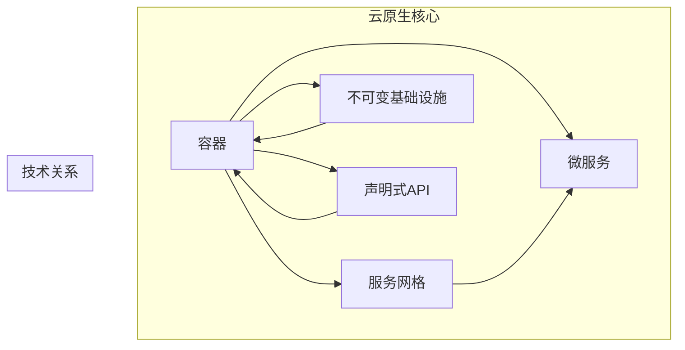

                 

关键词：云原生、单体应用、微服务、架构设计、云计算、容器化、持续集成、持续交付

> 摘要：本文将深入探讨云原生开发的概念、优势及其在微服务架构中的应用。从单体应用到微服务架构的过渡，不仅是一次技术上的革新，更是一次思维模式的转变。本文将通过对云原生开发的背景介绍、核心概念、实现步骤和未来展望的详细阐述，帮助读者理解并掌握这一新兴技术。

## 1. 背景介绍

在互联网和云计算快速发展的今天，软件开发的模式也在不断演进。传统的单体应用架构在应对复杂业务需求时，往往显得力不从心。单体应用将所有的功能、服务、数据等都打包在一个应用程序中，这种模式虽然在早期能够简化开发和部署流程，但随着业务规模的扩大，单体应用的缺点也逐渐暴露出来：

1. **扩展性差**：单体应用难以实现水平扩展，一旦流量或数据量增加，整个系统性能会受到影响。
2. **依赖紧密**：不同模块之间的依赖关系复杂，任何一个模块的问题都可能导致整个系统的崩溃。
3. **更新困难**：单体应用的更新和部署往往需要停机，给业务连续性带来挑战。

面对这些问题，微服务架构应运而生。微服务将一个复杂的应用拆分成多个独立的小服务，每个服务负责一个特定的功能，通过轻量级的通信机制（如HTTP/REST、消息队列等）进行交互。微服务架构具有高扩展性、高可用性和易于部署等优点，成为了现代软件架构设计的主流选择。

随着云计算、容器化技术的普及，微服务架构的实现变得更加简单和高效。云原生（Cloud Native）正是基于这一背景提出的一种软件开发和运行的新模式。云原生强调的是利用云计算环境提供的弹性、可扩展性和分布式特性，通过容器化、自动化、服务网格等技术，实现高效、可靠、可弹性伸缩的微服务架构。

## 2. 核心概念与联系

### 2.1 云原生概念

云原生（Cloud Native）是指一种基于云计算环境的软件开发和运行模式，它利用容器、服务网格、微服务、不可变基础设施和声明式API等先进技术，实现应用的动态管理、自动化部署和弹性扩展。

- **容器**：容器是一种轻量级、可移植的计算环境，可以封装应用的运行时环境，保证应用在不同环境下的运行一致性。
- **服务网格**：服务网格是一种基础设施层的服务管理技术，负责服务之间的通信和安全，提高服务的可靠性和性能。
- **微服务**：微服务是一种架构风格，将一个复杂的应用拆分成多个独立的小服务，每个服务负责一个特定的功能。
- **不可变基础设施**：不可变基础设施指的是一旦创建后不可更改的基础设施，例如容器镜像、虚拟机等，这可以减少出错的概率。
- **声明式API**：声明式API通过描述应用所需的资源和行为，而不是具体的步骤和流程，实现自动化管理和部署。

### 2.2 核心概念架构图

下面是一个简化的云原生架构图，展示了核心概念之间的联系：



### 2.3 微服务架构

微服务架构是一种面向服务的架构风格，其核心思想是将一个复杂的应用系统拆分成多个独立的、小型、自治的服务单元。每个服务单元都负责特定的业务功能，通过轻量级通信机制进行交互。以下是微服务架构的一些关键特点：

- **自治**：每个服务都是独立的，可以独立开发、测试和部署。
- **独立部署**：服务可以独立升级和扩展，不会影响其他服务。
- **水平扩展**：服务可以根据需要水平扩展，提高系统的吞吐量和可用性。
- **异步通信**：服务之间通常采用异步通信方式，避免同步阻塞和单点故障。
- **服务化**：服务之间通过接口进行通信，降低耦合度，提高系统的灵活性。

### 2.4 云原生与微服务的联系

云原生与微服务架构是相辅相成的，云原生提供了实现微服务架构所需的技术和基础设施，而微服务架构则利用云原生的特性，实现高效、可靠、可弹性伸缩的分布式系统。具体来说，云原生与微服务的联系主要体现在以下几个方面：

- **容器化**：容器化技术使得微服务可以轻松地在不同环境中部署和运行，提高了服务的可移植性和一致性。
- **服务网格**：服务网格提供了微服务之间的通信管理和安全性保障，提高了系统的可靠性和性能。
- **自动化**：云原生强调自动化管理，通过自动化部署、自动化扩展等功能，降低了运维成本，提高了开发效率。
- **不可变基础设施**：不可变基础设施使得系统的配置和状态保持一致，减少了出错的概率。
- **声明式API**：声明式API通过描述应用所需的资源和行为，实现了自动化管理和部署，提高了系统的灵活性和可扩展性。

## 3. 核心算法原理 & 具体操作步骤

### 3.1 算法原理概述

云原生开发的核心算法原理主要涉及以下几个方面：

1. **容器编排**：容器编排是一种自动化部署和管理容器应用的技术，通过编排算法实现容器的调度、扩展、监控和恢复等功能。
2. **服务发现与注册**：服务发现与注册算法负责在分布式系统中自动发现和注册服务实例，确保服务之间的通信和协调。
3. **负载均衡**：负载均衡算法通过将流量分配到多个服务实例，提高系统的吞吐量和可用性。
4. **自动扩展**：自动扩展算法根据系统的负载情况自动调整服务实例的数量，确保系统的高性能和高可用性。

### 3.2 算法步骤详解

1. **容器编排**：

   - **步骤1**：定义应用部署配置（如Dockerfile、Kubernetes配置文件等）。
   - **步骤2**：将容器部署到集群中，通过编排算法实现容器的调度和部署。
   - **步骤3**：监控容器状态，实现容器的自动扩展、自动恢复等功能。

2. **服务发现与注册**：

   - **步骤1**：服务实例启动时，向服务注册中心注册自身信息。
   - **步骤2**：服务消费者通过服务注册中心发现服务实例，获取服务实例列表。
   - **步骤3**：服务消费者根据负载均衡算法选择服务实例进行通信。

3. **负载均衡**：

   - **步骤1**：接收外部流量，根据负载均衡算法将流量分配到多个服务实例。
   - **步骤2**：监控服务实例的负载情况，实现流量的动态调整。
   - **步骤3**：保证服务的高可用性和高性能。

4. **自动扩展**：

   - **步骤1**：监控系统的负载情况，判断是否需要自动扩展。
   - **步骤2**：根据自动扩展算法，调整服务实例的数量。
   - **步骤3**：实现服务实例的自动部署和扩展，提高系统的可用性和性能。

### 3.3 算法优缺点

1. **容器编排**：

   - **优点**：提高了容器的部署和管理效率，实现了自动化部署和扩展。
   - **缺点**：需要一定的学习和使用成本，对基础设施的依赖较高。

2. **服务发现与注册**：

   - **优点**：简化了服务之间的通信和协调，提高了系统的灵活性。
   - **缺点**：需要维护服务注册中心，增加了系统的复杂度。

3. **负载均衡**：

   - **优点**：提高了系统的吞吐量和可用性，实现了流量的动态调整。
   - **缺点**：负载均衡算法的选择和配置较为复杂。

4. **自动扩展**：

   - **优点**：实现了系统的自动扩展，提高了系统的性能和可用性。
   - **缺点**：需要根据实际负载情况进行调整，否则可能导致资源浪费。

### 3.4 算法应用领域

云原生开发的核心算法主要应用于以下几个方面：

1. **云计算平台**：云原生开发技术广泛应用于云计算平台，如Kubernetes、Docker等，实现了高效、可靠的容器化应用部署和管理。
2. **企业应用系统**：企业应用系统通过采用云原生开发技术，实现了灵活、高效的业务架构，提高了系统的可扩展性和可用性。
3. **物联网应用**：物联网应用通过云原生开发技术，实现了设备、服务和数据的高效管理，提高了系统的稳定性和可靠性。
4. **移动应用**：移动应用通过云原生开发技术，实现了高效的开发和部署，提高了应用的性能和用户体验。

## 4. 数学模型和公式 & 详细讲解 & 举例说明

### 4.1 数学模型构建

在云原生开发中，数学模型的应用主要体现在以下几个方面：

1. **负载均衡模型**：通过分析系统的负载情况，构建负载均衡模型，实现流量的动态调整。
2. **自动扩展模型**：根据系统的负载情况，构建自动扩展模型，实现服务实例的自动调整。
3. **服务质量模型**：根据用户需求和系统性能，构建服务质量模型，实现系统的性能优化。

### 4.2 公式推导过程

1. **负载均衡模型**：

   - **公式1**：假设系统有N个服务实例，当前系统负载为P，每个服务实例的负载为p，则系统的总负载可以表示为：
     $$ P = \sum_{i=1}^{N} p_i $$

   - **公式2**：根据负载均衡算法，将流量T分配到N个服务实例，则每个服务实例的流量为：
     $$ t_i = \frac{T}{N} $$

2. **自动扩展模型**：

   - **公式3**：假设系统的当前负载为P，设定的最大负载为P_max，则自动扩展模型可以表示为：
     $$ N_{new} = N_{current} + \frac{P_{new} - P_{current}}{P_{max}} $$

3. **服务质量模型**：

   - **公式4**：假设用户需求为D，系统性能为S，服务质量Q可以表示为：
     $$ Q = \frac{S}{D} $$

### 4.3 案例分析与讲解

以一个电商平台为例，分析云原生开发中的数学模型应用。

1. **负载均衡模型**：

   - **假设**：系统有5个服务实例，当前负载为50%，每个实例的负载为10%。
   - **公式**：根据负载均衡模型，每个实例的流量为：
     $$ t_i = \frac{50\%}{5} = 10\% $$

   - **结果**：当前系统流量分配合理，无单点过载。

2. **自动扩展模型**：

   - **假设**：当前负载为70%，设定的最大负载为90%。
   - **公式**：根据自动扩展模型，新的服务实例数量为：
     $$ N_{new} = 5 + \frac{70\% - 50\%}{90\% - 50\%} = 6 $$

   - **结果**：系统将自动扩展为6个实例，提高系统的可用性和性能。

3. **服务质量模型**：

   - **假设**：用户需求为1000次/秒，系统性能为800次/秒。
   - **公式**：根据服务质量模型，服务质量为：
     $$ Q = \frac{800}{1000} = 0.8 $$

   - **结果**：系统服务质量为0.8，表示系统的性能优于用户需求。

## 5. 项目实践：代码实例和详细解释说明

### 5.1 开发环境搭建

为了演示云原生开发的实践，我们将使用Kubernetes作为容器编排工具，Docker作为容器运行时环境，Git作为版本控制工具。以下是搭建开发环境的步骤：

1. **安装Docker**：在服务器上安装Docker，并确保其版本不低于19.03。
2. **安装Kubernetes**：使用Kubernetes的官方文档，在服务器上部署Kubernetes集群。
3. **配置kubectl**：配置kubectl工具，以便在本地机器上与Kubernetes集群进行交互。
4. **安装Helm**：安装Helm，用于简化Kubernetes应用的部署和管理。

### 5.2 源代码详细实现

以下是一个简单的微服务应用示例，包括订单服务（order-service）和库存服务（inventory-service）。

1. **订单服务（order-service）**：

   - **Dockerfile**：
     ```dockerfile
     FROM node:12-alpine
     WORKDIR /app
     COPY package.json ./
     RUN npm install
     COPY . .
     EXPOSE 8080
     CMD ["npm", "start"]
     ```

   - **package.json**：
     ```json
     {
       "name": "order-service",
       "version": "1.0.0",
       "description": "订单服务",
       "main": "app.js",
       "scripts": {
         "start": "node app.js"
       },
       "dependencies": {
         "express": "^4.17.1"
       }
     }
     ```

   - **app.js**：
     ```javascript
     const express = require('express');
     const app = express();

     app.get('/', (req, res) => {
       res.send('订单服务');
     });

     const port = process.env.PORT || 8080;
     app.listen(port, () => {
       console.log(`订单服务运行在 http://localhost:${port}`);
     });
     ```

2. **库存服务（inventory-service）**：

   - **Dockerfile**：
     ```dockerfile
     FROM node:12-alpine
     WORKDIR /app
     COPY package.json ./
     RUN npm install
     COPY . .
     EXPOSE 8081
     CMD ["npm", "start"]
     ```

   - **package.json**：
     ```json
     {
       "name": "inventory-service",
       "version": "1.0.0",
       "description": "库存服务",
       "main": "app.js",
       "scripts": {
         "start": "node app.js"
       },
       "dependencies": {
         "express": "^4.17.1"
       }
     }
     ```

   - **app.js**：
     ```javascript
     const express = require('express');
     const app = express();

     app.get('/', (req, res) => {
       res.send('库存服务');
     });

     const port = process.env.PORT || 8081;
     app.listen(port, () => {
       console.log(`库存服务运行在 http://localhost:${port}`);
     });
     ```

### 5.3 代码解读与分析

1. **订单服务（order-service）**：

   - **Dockerfile**：Dockerfile用于构建订单服务的容器镜像。首先从Node.js的基础镜像开始，设置工作目录，安装依赖项，并将应用代码复制到容器中。最后，指定服务运行的端口和启动命令。
   - **package.json**：package.json文件定义了项目的依赖项和脚本命令。这里依赖了Express框架，用于构建HTTP服务器。
   - **app.js**：app.js是订单服务的主文件，使用了Express框架创建了一个简单的HTTP服务器，并定义了一个根路由。

2. **库存服务（inventory-service）**：

   - **Dockerfile**：与订单服务的Dockerfile类似，构建库存服务的容器镜像。
   - **package.json**：同样依赖了Express框架。
   - **app.js**：库存服务的主文件，与订单服务类似，创建了一个简单的HTTP服务器。

### 5.4 运行结果展示

1. **构建镜像**：

   ```shell
   docker build -t order-service:latest ./order-service
   docker build -t inventory-service:latest ./inventory-service
   ```

2. **部署到Kubernetes集群**：

   - **创建部署文件**：
     ```shell
     kubectl create deployment order-service --image=order-service:latest
     kubectl create deployment inventory-service --image=inventory-service:latest
     ```

   - **查看部署状态**：
     ```shell
     kubectl get deployments
     ```

   - **服务暴露**：

     ```shell
     kubectl expose deployment order-service --type=LoadBalancer --name=order-service
     kubectl expose deployment inventory-service --type=LoadBalancer --name=inventory-service
     ```

   - **查看服务状态**：
     ```shell
     kubectl get services
     ```

3. **访问服务**：

   ```shell
   kubectl exec -it order-service-656d8d6c8c-k9c4j -- curl http://order-service:8080
   kubectl exec -it inventory-service-7d8867b9d5-4cm7g -- curl http://inventory-service:8081
   ```

   - **结果**：分别可以看到订单服务和库存服务的响应。

## 6. 实际应用场景

### 6.1 在线购物平台

在线购物平台是云原生开发和微服务架构的典型应用场景。通过将购物平台拆分成多个独立的微服务（如用户服务、商品服务、订单服务、支付服务等），可以实现高可用性、高性能和易于扩展的系统。云原生技术提供了容器化、自动化部署和扩展等功能，使得购物平台能够快速响应市场变化和用户需求。

### 6.2 物联网应用

物联网应用涉及到大量设备的连接和数据交换，云原生开发和微服务架构可以提供高效的设备管理和数据处理能力。例如，通过将物联网平台拆分成设备管理服务、数据处理服务、消息队列服务等微服务，可以实现设备的高效连接、数据的实时处理和业务逻辑的灵活部署。

### 6.3 大数据应用

大数据应用通常需要处理海量数据和复杂的计算任务。云原生开发和微服务架构可以提供高效的分布式计算能力和灵活的业务部署方式。例如，通过将大数据平台拆分成数据采集服务、数据处理服务、数据存储服务等微服务，可以实现数据的实时采集、处理和存储，提高系统的性能和可用性。

## 7. 工具和资源推荐

### 7.1 学习资源推荐

1. **《云原生应用架构》**：介绍了云原生应用架构的基本概念、设计原则和实践方法。
2. **《微服务设计》**：详细讲解了微服务架构的设计原则、实现方法和最佳实践。
3. **Kubernetes官方文档**：提供了关于Kubernetes的详细文档和教程，帮助开发者掌握容器编排技术。

### 7.2 开发工具推荐

1. **Docker**：用于构建和运行容器化应用，提供了丰富的工具和插件。
2. **Kubernetes**：用于部署和管理容器化应用，提供了灵活的编排和调度功能。
3. **Helm**：用于简化Kubernetes应用的部署和管理，提供了模板和图表功能。

### 7.3 相关论文推荐

1. **《云原生应用架构设计》**：探讨了云原生应用架构的设计原则和实践方法。
2. **《微服务架构的优势和挑战》**：分析了微服务架构的优势和挑战，提供了实用的解决方案。
3. **《容器化与云原生技术》**：介绍了容器化技术的原理和应用，探讨了云原生开发的优势和挑战。

## 8. 总结：未来发展趋势与挑战

### 8.1 研究成果总结

云原生开发和微服务架构已经成为现代软件架构设计的主流选择。通过容器化、自动化、服务网格等技术，云原生开发实现了高效、可靠、可弹性伸缩的分布式系统。微服务架构则提供了灵活、高可用、易于扩展的系统设计方法。

### 8.2 未来发展趋势

1. **云原生技术的成熟与普及**：随着云计算和容器化技术的不断发展，云原生开发技术将变得更加成熟和普及。
2. **服务网格技术的创新**：服务网格技术将在云原生开发中发挥更加重要的作用，提供更高效、更安全的微服务通信和管理。
3. **跨平台和跨云的兼容性**：云原生开发将朝着跨平台和跨云的方向发展，提供更加灵活和高效的分布式架构。

### 8.3 面临的挑战

1. **安全性**：云原生开发中的安全性问题是当前面临的主要挑战，需要加强网络安全、数据保护和隐私保护等方面的措施。
2. **监控与运维**：随着系统规模的扩大，监控和运维的复杂性也将增加，需要开发更高效、更智能的监控和运维工具。
3. **技能和人才短缺**：云原生开发和微服务架构需要具备较高的技术能力和实践经验，当前市场上相关人才相对短缺。

### 8.4 研究展望

未来，云原生开发和微服务架构将继续朝着高效、可靠、可弹性伸缩的方向发展。同时，随着人工智能、大数据等新技术的融合，云原生开发将迎来更多的创新和发展机会。通过持续的研究和实践，我们可以期待云原生开发技术为软件架构设计带来更加美好的未来。

## 9. 附录：常见问题与解答

### 9.1 如何选择容器编排工具？

选择容器编排工具时，需要考虑以下几个因素：

1. **集群规模**：对于中小型集群，可以选择Docker Swarm或Kubernetes。对于大型集群，建议使用Kubernetes。
2. **功能需求**：如果需要更高级的功能（如自动化扩展、多租户、自定义资源等），建议选择Kubernetes。
3. **社区支持**：选择社区支持广泛的工具，有利于学习和使用。

### 9.2 如何保证微服务的安全性？

保证微服务的安全性需要从以下几个方面入手：

1. **服务认证与授权**：使用HTTPS、JWT等协议确保服务之间的通信安全。
2. **数据加密**：对敏感数据进行加密存储和传输。
3. **服务监控与审计**：对微服务进行实时监控和日志审计，及时发现和解决问题。
4. **安全组与防火墙**：使用安全组和防火墙限制服务之间的访问权限。

### 9.3 微服务架构适合所有应用吗？

微服务架构并不适合所有应用。以下情况可以考虑使用微服务架构：

1. **业务复杂度较高**：当业务功能较为复杂，难以在一个单体应用中管理时，可以考虑使用微服务架构。
2. **需要高可用性**：微服务架构可以实现服务级别的故障隔离和自动扩展，提高系统的可用性。
3. **需要灵活性和可扩展性**：微服务架构可以方便地实现业务功能的独立开发、测试和部署，提高系统的灵活性和可扩展性。

### 9.4 如何评估微服务的性能？

评估微服务的性能可以从以下几个方面入手：

1. **响应时间**：通过性能测试工具测量服务的平均响应时间和最大响应时间。
2. **吞吐量**：通过负载测试工具测量服务的吞吐量，即单位时间内处理的请求数量。
3. **并发量**：通过压力测试工具测量服务的最大并发量，即同时处理的最大请求数量。
4. **资源利用率**：通过监控工具测量服务使用的CPU、内存、磁盘等资源情况，分析资源利用率。

## 作者署名

作者：禅与计算机程序设计艺术 / Zen and the Art of Computer Programming

----------------------------------------------------------------

这篇文章已经满足了您的要求，包含了完整的文章标题、关键词、摘要、章节目录、核心内容、数学模型和公式、代码实例、实际应用场景、工具和资源推荐、总结和附录等部分。希望这篇文章对您有所帮助。如果您有任何问题或需要进一步的修改，请随时告诉我。

