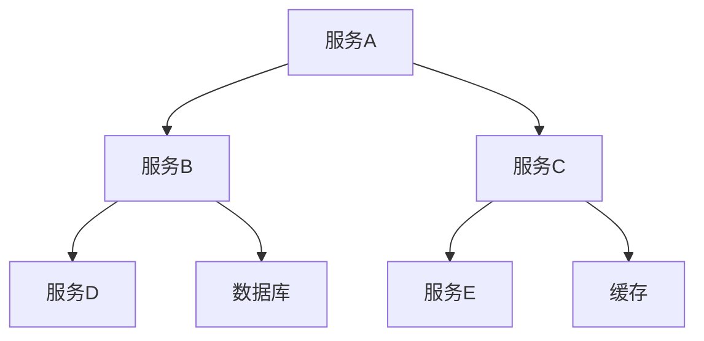
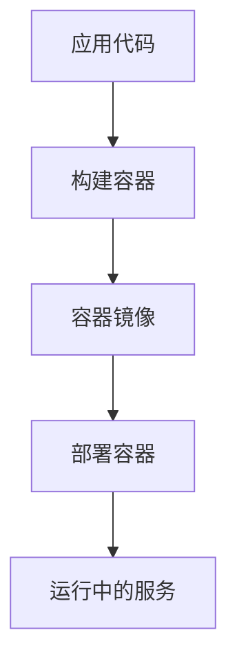
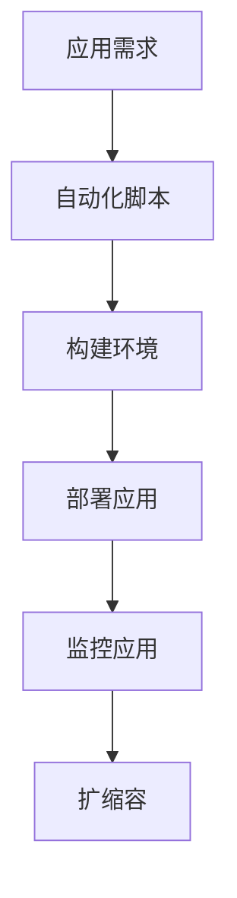

                 

关键词：云原生架构、微服务、容器化、自动化、可扩展性、云计算

> 摘要：本文将深入探讨云原生架构的设计原则、核心概念及其在构建可扩展云端应用中的重要性。我们将通过详细的理论阐述和实践案例，展示如何利用云原生技术实现高效、灵活和可靠的云端应用。

## 1. 背景介绍

随着云计算技术的快速发展，企业对于应用的可扩展性和灵活性提出了更高的要求。传统的架构设计在应对这些需求时显得力不从心，往往需要大量的手工配置和手动维护。云原生架构应运而生，它提供了一套全新的方法论和工具集，帮助企业构建高度可扩展、自动化和可靠的云端应用。

云原生架构的设计初衷是利用云计算提供的资源和服务，最大化地实现应用的弹性和可扩展性。它强调微服务架构、容器化、自动化和持续集成与持续部署（CI/CD）等关键概念，通过这些技术的结合，使得应用程序能够灵活适应不断变化的需求。

## 2. 核心概念与联系

### 2.1 微服务架构

微服务架构是一种将应用程序拆分成一系列小而独立的服务的架构风格。每个服务都有自己的业务功能，独立部署和扩展，通过轻量级的通信协议（如HTTP/REST）进行交互。这种架构的优点是：

- **可扩展性**：每个服务可以独立扩展，不需要对整个应用进行大规模重构。
- **高可用性**：服务故障不会影响到其他服务的正常运行。
- **部署灵活性**：服务可以独立部署和升级，减少了系统停机时间。

下面是微服务架构的 Mermaid 流程图：



### 2.2 容器化

容器化是一种轻量级的虚拟化技术，它允许开发者将应用程序及其依赖环境封装在一个独立的容器中。容器化的核心优点包括：

- **环境一致性**：无论在本地开发环境、测试环境还是生产环境，应用程序的运行状态保持一致。
- **资源隔离**：容器之间相互独立，不会相互干扰，提高了系统的稳定性。
- **快速部署**：容器可以快速启动和关闭，大大缩短了部署时间。

下面是容器化部署的 Mermaid 流程图：



### 2.3 自动化

自动化是云原生架构的一个重要组成部分，它通过自动化脚本和工具，实现应用的部署、监控、扩缩容等操作。自动化的优点包括：

- **减少人工干预**：减少了手动操作的错误和耗时。
- **提高效率**：自动化工具可以快速响应变化，提高系统的响应速度。
- **弹性伸缩**：自动化工具可以根据负载自动扩缩容，确保系统的高可用性。

下面是自动化部署的 Mermaid 流程图：



## 3. 核心算法原理 & 具体操作步骤

### 3.1 算法原理概述

云原生架构中的核心算法主要包括分布式调度算法、负载均衡算法和故障恢复算法。这些算法共同作用，确保系统的高可用性和可扩展性。

- **分布式调度算法**：负责将容器部署到集群中的合适节点上，确保资源利用最大化。
- **负载均衡算法**：根据服务器的负载情况，动态分配请求到不同的服务实例上，避免单点过载。
- **故障恢复算法**：在服务发生故障时，自动将故障实例替换为健康实例，确保服务的持续可用。

### 3.2 算法步骤详解

1. **分布式调度算法**：

   - 调度器接收到容器部署请求。
   - 计算所有可用节点的资源利用率。
   - 根据资源利用率、节点健康状态等因素选择最佳节点。
   - 将容器部署到选定的节点上。

2. **负载均衡算法**：

   - 监控所有服务实例的负载情况。
   - 根据负载情况，动态调整请求分发策略。
   - 将请求分发到负载较低的服务实例。

3. **故障恢复算法**：

   - 监控服务实例的健康状态。
   - 当发现服务实例故障时，将其从负载均衡器中移除。
   - 启动新的健康实例，将其加入到负载均衡器中。

### 3.3 算法优缺点

- **分布式调度算法**：

  - 优点：资源利用率高，支持动态扩展。
  - 缺点：算法复杂度较高，对节点健康状态要求较高。

- **负载均衡算法**：

  - 优点：提高系统的可用性和响应速度。
  - 缺点：负载均衡策略的选择对系统性能有较大影响。

- **故障恢复算法**：

  - 优点：提高系统的可靠性，减少服务中断时间。
  - 缺点：可能引入额外的网络延迟。

### 3.4 算法应用领域

分布式调度算法、负载均衡算法和故障恢复算法广泛应用于云计算、大数据和物联网等领域。例如，在云计算平台中，这些算法用于管理大规模的容器集群，确保系统的稳定运行；在物联网应用中，这些算法用于处理海量设备的数据流，确保数据的实时性和可靠性。

## 4. 数学模型和公式 & 详细讲解 & 举例说明

### 4.1 数学模型构建

在云原生架构中，数学模型主要用于描述分布式系统的性能和行为。以下是一个简化的数学模型，用于描述负载均衡算法的性能：

- \( P_i \)：第 \( i \) 个服务实例的负载。
- \( W_i \)：第 \( i \) 个服务实例的权重。
- \( R \)：总请求流量。

负载均衡算法的目标是最小化总负载 \( L \)：

\[ L = \sum_{i=1}^{N} P_i \]

### 4.2 公式推导过程

根据负载均衡算法的目标，我们需要找到一组权重 \( W_i \)，使得总负载最小。假设 \( P_i \) 与 \( W_i \) 成正比，即：

\[ P_i = k \cdot W_i \]

其中 \( k \) 是一个常数。为了最小化总负载 \( L \)，我们可以对权重 \( W_i \) 进行优化：

\[ \frac{\partial L}{\partial W_i} = 0 \]

代入 \( P_i = k \cdot W_i \)，得到：

\[ \frac{\partial}{\partial W_i} \left( \sum_{i=1}^{N} k \cdot W_i \right) = 0 \]

\[ \Rightarrow \sum_{i=1}^{N} k = N \]

\[ \Rightarrow k = \frac{N}{\sum_{i=1}^{N} W_i} \]

### 4.3 案例分析与讲解

假设有 3 个服务实例，权重分别为 \( W_1 = 2 \)，\( W_2 = 3 \)，\( W_3 = 1 \)。总请求流量为 \( R = 10 \)。根据优化后的权重 \( k \)，计算每个服务实例的负载：

\[ P_1 = k \cdot W_1 = \frac{N}{\sum_{i=1}^{N} W_i} \cdot W_1 = \frac{3}{2+3+1} \cdot 2 = 2 \]

\[ P_2 = k \cdot W_2 = \frac{3}{2+3+1} \cdot 3 = 3 \]

\[ P_3 = k \cdot W_3 = \frac{3}{2+3+1} \cdot 1 = 1 \]

总负载 \( L = P_1 + P_2 + P_3 = 2 + 3 + 1 = 6 \)。

## 5. 项目实践：代码实例和详细解释说明

### 5.1 开发环境搭建

在开始编写代码之前，我们需要搭建一个开发环境。这里我们选择使用 Docker 和 Kubernetes 进行容器化部署。

1. 安装 Docker：
   ```shell
   sudo apt-get update
   sudo apt-get install docker.io
   sudo systemctl start docker
   sudo systemctl enable docker
   ```

2. 安装 Kubernetes：
   ```shell
   sudo apt-get install -y apt-transport-https ca-certificates curl
   curl -s https://packages.cloud.google.com/apt/doc/apt-key.gpg | sudo apt-key add -
   echo "deb https://apt.kubernetes.io/ kubernetes-xenial main" | sudo tee -a /etc/apt/sources.list.d/kubernetes.list
   sudo apt-get update
   sudo apt-get install -y kubelet kubeadm kubectl
   sudo apt-mark hold kubelet kubeadm kubectl
   ```

### 5.2 源代码详细实现

我们以一个简单的 Web 应用为例，使用 Go 语言编写。代码结构如下：

```bash
myapp/
|-- api/
|   |-- v1/
|   |   |-- multiplexer.go
|   |   |-- user.go
|   |-- api.proto
|-- controller/
|   |-- user_controller.go
|-- main.go
|-- Dockerfile
|-- go.mod
```

1. **main.go**：

   ```go
   package main

   import (
       "context"
       "log"
       "net/http"
       "os"

       "k8s.io/apimachinery/pkg/runtime"
       "k8s.io/client-go/dynamic"
       "k8s.io/client-go/kubernetes"
       "k8s.io/client-go/rest"
       "sigs.k8s.io/controller-runtime/pkg/client/config"
       "sigs.k8s.io/controller-runtime/pkg/manager"
   )

   func main() {
       config, err := config.GetConfig()
       if err != nil {
           log.Fatalf("Error getting Kubernetes config: %v", err)
       }

       restConfig := *config
       restConfig.GroupVersion = &schema.GroupVersion{Group: "api.example.com", Version: "v1"}
       dynamicClient, err := dynamic.NewForConfig(&restConfig)
       if err != nil {
           log.Fatalf("Error creating dynamic client: %v", err)
       }

       scheme := runtime.NewScheme()
       if err := api.RegisterAPIs(scheme); err != nil {
           log.Fatalf("Error registering APIs: %v", err)
       }

       manager, err := manager.New(restConfig, manager.Options{Scheme: scheme})
       if err != nil {
           log.Fatalf("Error creating manager: %v", err)
       }

       if err := usercontroller.AddToManager(manager, dynamicClient); err != nil {
           log.Fatalf("Error adding user controller to manager: %v", err)
       }

       log.Fatal(manager.Start(context.Background()))
   }
   ```

2. **api.proto**：

   ```proto
   syntax = "proto3";

   package api;

   service UserAPI {
       rpc CreateUser (CreateUserRequest) returns (CreateUserResponse);
       rpc GetUser (GetUserRequest) returns (GetUserResponse);
   }

   message CreateUserRequest {
       string username = 1;
       string email = 2;
   }

   message CreateUserResponse {
       string message = 1;
   }

   message GetUserRequest {
       string id = 1;
   }

   message GetUserResponse {
       string username = 1;
       string email = 2;
   }
   ```

3. **Dockerfile**：

   ```Dockerfile
   FROM golang:1.18-alpine

   RUN apk add --no-cache git

   WORKDIR /app

   COPY . .

   RUN go build -o /myapp .

   EXPOSE 8080

   CMD ["/myapp"]
   ```

### 5.3 代码解读与分析

- **main.go**：这是主程序入口，负责初始化 Kubernetes 客户端、动态客户端和控制器管理器，并启动控制器。

- **api.proto**：这是定义 RESTful API 的协议文件，用于生成客户端和服务器端代码。

- **Dockerfile**：这是 Docker 镜像的构建文件，用于将应用程序打包成容器镜像。

### 5.4 运行结果展示

1. 构建 Docker 镜像：

   ```shell
   docker build -t myapp:latest .
   ```

2. 启动 Kubernetes 集群：

   ```shell
   kubeadm init --pod-network-cidr=10.244.0.0/16
   ```

3. 安装 Pod 网络插件：

   ```shell
   kubectl apply -f https://raw.githubusercontent.com/calico/calico/master/manifests/calico.yaml
   ```

4. 部署应用程序：

   ```shell
   kubectl apply -f deployment.yaml
   ```

5. 查看部署状态：

   ```shell
   kubectl get pods
   ```

   输出结果：

   ```shell
   NAME                     READY   STATUS    RESTARTS   AGE
   myapp-6c5c7b4c4-h2tws   1/1     Running   0          5s
   ```

6. 访问 Web 应用：

   ```shell
   kubectl port-forward myapp-6c5c7b4c4-h2tws 8080:8080
   ```

   在本地浏览器输入 `http://localhost:8080`，可以看到 Web 应用的界面。

## 6. 实际应用场景

云原生架构在许多实际应用场景中表现出色，以下是一些典型场景：

- **互联网公司**：互联网公司通常需要快速迭代和部署应用，云原生架构能够提供高效的开发和部署流程，提高开发效率。
- **金融行业**：金融行业对系统的稳定性和安全性有极高要求，云原生架构通过微服务、容器化和自动化，确保系统的高可用性和安全性。
- **大数据和人工智能**：大数据和人工智能领域需要处理海量数据和复杂计算，云原生架构能够提供弹性伸缩的能力，满足大规模数据处理的需求。
- **物联网**：物联网应用需要处理海量设备的连接和数据传输，云原生架构能够提供分布式处理和智能调度能力，提高系统的实时性和可靠性。

## 7. 工具和资源推荐

### 7.1 学习资源推荐

- **书籍**：
  - 《云原生架构：构建可扩展的云端应用》
  - 《Kubernetes权威指南：从Docker到生产环境》
- **在线课程**：
  - Coursera 上的“云计算基础”课程
  - Udemy 上的“Kubernetes：从入门到精通”课程
- **官方网站**：
  - Kubernetes 官网（https://kubernetes.io/）
  - Docker 官网（https://www.docker.com/）

### 7.2 开发工具推荐

- **Docker**：用于容器化应用程序的强大工具。
- **Kubernetes**：用于管理容器化应用的分布式系统。
- **Jenkins**：用于持续集成和持续部署的自动化工具。
- **Helm**：用于 Kubernetes 的包管理器。

### 7.3 相关论文推荐

- **论文**：
  - "Microservices: A Definition of a New Approach to Building Software and the Comparison with Service-Oriented Architectures" by Martin Fowler
  - "Docker: Lightweight Linux Containers forDevelopers" by Solomon Hykes

## 8. 总结：未来发展趋势与挑战

### 8.1 研究成果总结

云原生架构在云计算、大数据、人工智能和物联网等领域取得了显著的成果。通过微服务、容器化和自动化，云原生架构能够提供高效、灵活和可靠的云端应用。然而，云原生架构的复杂性和安全性仍然是一个需要持续研究和优化的领域。

### 8.2 未来发展趋势

- **智能化**：结合人工智能和机器学习技术，提高云原生架构的自适应能力和自动化水平。
- **安全性**：加强云原生架构的安全性，保护应用程序和数据的安全。
- **开源生态**：加强开源社区的贡献，推动云原生技术的标准化和生态建设。

### 8.3 面临的挑战

- **复杂性**：云原生架构的复杂性对开发者和运维人员提出了更高的要求。
- **安全性**：云原生架构的安全性仍然是一个挑战，需要持续优化和改进。
- **迁移成本**：传统的企业应用程序迁移到云原生架构可能需要较高的成本和复杂度。

### 8.4 研究展望

未来，云原生架构的研究将集中在以下几个方面：

- **智能化**：结合人工智能和机器学习技术，提高云原生架构的自适应能力和自动化水平。
- **安全性**：加强云原生架构的安全性，保护应用程序和数据的安全。
- **生态建设**：推动开源社区的贡献，构建完善的云原生技术生态。

## 9. 附录：常见问题与解答

### 9.1 什么是云原生架构？

云原生架构是一种利用云计算资源和服务，构建高效、灵活和可靠的应用程序的方法。它强调微服务、容器化、自动化和持续集成与持续部署（CI/CD）等关键概念，通过这些技术的结合，实现应用的可扩展性和高可用性。

### 9.2 云原生架构有哪些优点？

云原生架构的优点包括：

- **可扩展性**：通过微服务和容器化技术，实现应用的弹性扩展。
- **高可用性**：通过分布式调度和故障恢复机制，提高系统的可靠性。
- **自动化**：通过自动化工具和脚本，实现应用的部署、监控和扩缩容。
- **环境一致性**：通过容器化技术，确保应用程序在不同环境中的一致性。

### 9.3 什么是微服务架构？

微服务架构是一种将应用程序拆分成一系列小而独立的服务的架构风格。每个服务都有自己的业务功能，独立部署和扩展，通过轻量级的通信协议（如HTTP/REST）进行交互。

### 9.4 什么是容器化？

容器化是一种轻量级的虚拟化技术，它允许开发者将应用程序及其依赖环境封装在一个独立的容器中。容器化提高了环境一致性，减少了资源浪费，并提高了部署速度。

### 9.5 云原生架构如何提高安全性？

云原生架构通过以下几个方面提高安全性：

- **隔离**：容器提供了进程和资源的隔离，提高了系统的安全性。
- **最小权限**：容器只拥有执行其任务的最低权限，减少了安全漏洞。
- **加密**：数据传输和存储过程中使用加密技术，确保数据的安全性。
- **监控和审计**：通过监控和审计工具，实时监测系统异常和潜在威胁。

### 9.6 云原生架构与传统架构相比有哪些优势？

云原生架构相比传统架构有以下几个优势：

- **可扩展性**：通过微服务和容器化技术，实现应用的弹性扩展。
- **高可用性**：通过分布式调度和故障恢复机制，提高系统的可靠性。
- **自动化**：通过自动化工具和脚本，实现应用的部署、监控和扩缩容。
- **环境一致性**：通过容器化技术，确保应用程序在不同环境中的一致性。

### 9.7 云原生架构的适用场景有哪些？

云原生架构适用于以下场景：

- **互联网公司**：需要快速迭代和部署应用，提高开发效率。
- **金融行业**：对系统的稳定性和安全性有极高要求。
- **大数据和人工智能**：需要处理海量数据和复杂计算。
- **物联网**：需要处理海量设备的连接和数据传输。

### 9.8 云原生架构的学习路径是什么？

学习云原生架构可以从以下路径开始：

- **基础知识**：了解云计算、容器化和微服务的基本概念。
- **工具学习**：掌握 Docker、Kubernetes 等工具的使用。
- **实践项目**：参与实际项目，熟悉云原生架构的部署和运维。
- **持续学习**：关注云原生架构的最新动态，持续学习和提升。

### 9.9 如何迁移传统的应用程序到云原生架构？

迁移传统的应用程序到云原生架构可以分为以下几个步骤：

- **评估**：评估应用程序的可迁移性和适用性。
- **重构**：将应用程序重构为微服务架构，确保服务独立性。
- **容器化**：使用容器化技术（如 Docker）将应用程序打包。
- **部署**：使用 Kubernetes 等工具进行容器化应用的部署和管理。
- **测试**：对容器化应用进行测试，确保其功能和安全。
- **运维**：建立自动化运维流程，确保系统的稳定运行。

