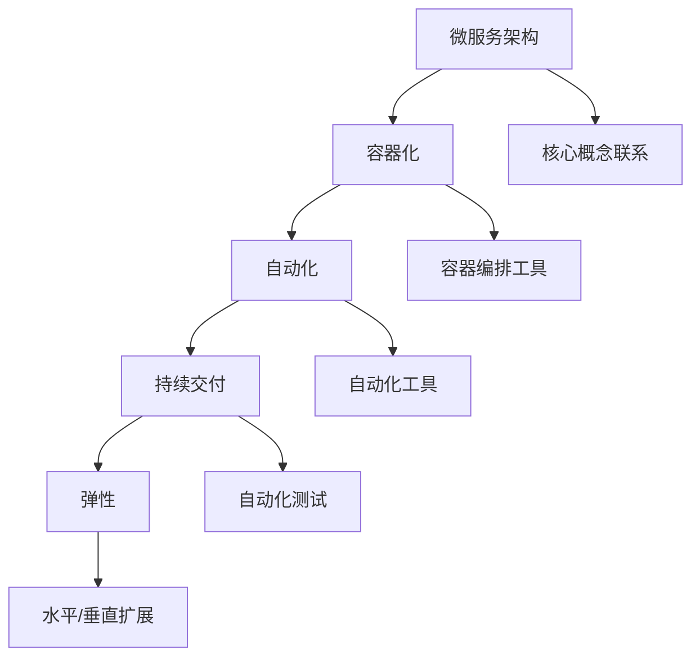

                 

### 背景介绍

云原生（Cloud Native）架构是一种旨在利用云计算环境构建和运行可扩展应用程序的方法。这种架构强调对云计算平台的高度集成和利用，以实现应用程序的弹性、可扩展性和高可用性。云原生架构的兴起源于云计算技术的快速发展，以及企业对应用程序性能、可扩展性和灵活性的不断追求。

随着互联网和移动设备的普及，用户对应用程序的期望越来越高。他们期望应用程序能够提供快速、可靠和无缝的服务体验。为了满足这些需求，开发人员开始寻求更高效、更灵活的开发方法。云原生架构正是在这样的背景下产生的。

云原生架构的核心特点包括：

1. **微服务架构**：应用程序被拆分为一组小型、独立的微服务，每个微服务负责处理特定的业务功能。这种架构使得应用程序可以更加灵活地扩展和管理。

2. **容器化**：应用程序和其运行环境被打包到容器中，容器可以确保应用程序在不同环境中的一致性。容器技术的普及使得应用程序的部署、迁移和扩展变得更加简单。

3. **自动化**：利用自动化工具进行应用程序的部署、监控和管理，以提高效率和减少人为错误。

4. **持续交付**：通过自动化测试和持续集成/持续部署（CI/CD）流程，快速交付高质量的应用程序。

5. **弹性**：应用程序可以根据需求自动扩展或缩减资源，以应对负载变化。

本文将深入探讨云原生架构的概念、优势、挑战以及如何构建可扩展的云端应用程序。通过本文的阅读，您将了解到云原生架构的核心原理和实践方法，为您的云计算项目提供指导和启示。

## 2. 核心概念与联系

### 2.1 云原生架构的定义

云原生架构是一种基于云计算的应用程序设计和开发方法，它强调应用程序的模块化、可扩展性和自动化。与传统架构相比，云原生架构更加灵活和高效，能够更好地适应不断变化的技术和业务需求。

云原生架构的核心概念包括：

- **微服务**：将应用程序拆分为一组小型、独立的微服务，每个微服务负责特定的业务功能。微服务之间通过轻量级的通信协议（如HTTP/REST）进行交互。

- **容器**：容器是一种轻量级、可移植的计算环境，它将应用程序及其依赖项打包在一起，确保在不同环境中的一致性。

- **容器编排**：容器编排工具（如Kubernetes）负责管理容器的部署、扩展和生命周期，确保应用程序的高可用性和资源效率。

- **自动化**：利用自动化工具进行应用程序的部署、监控和管理，以减少手动操作和提高效率。

- **持续交付**：通过自动化测试和持续集成/持续部署（CI/CD）流程，快速交付高质量的应用程序。

### 2.2 微服务架构

微服务架构是一种将应用程序拆分为一组小型、独立的微服务的架构风格。每个微服务负责处理特定的业务功能，如用户认证、订单处理或库存管理。微服务之间通过轻量级的通信协议（如HTTP/REST）进行交互。

微服务架构的优势包括：

- **高可扩展性**：可以通过水平扩展单个微服务来应对负载变化，而无需对整个应用程序进行重构。

- **高可用性**：单个微服务的故障不会导致整个应用程序的崩溃，其他微服务可以继续运行。

- **快速迭代**：每个微服务可以独立开发、测试和部署，加快开发速度。

- **技术多样性**：不同的微服务可以使用不同的编程语言、数据库和技术栈，提高开发灵活性。

### 2.3 容器化

容器化是一种将应用程序和其运行环境打包到容器中的技术。容器是一个轻量级、可移植的计算环境，确保应用程序在不同环境中的一致性。容器化的核心组件包括：

- **容器引擎**：如Docker，负责创建、运行和管理容器。

- **容器编排工具**：如Kubernetes，负责管理容器的部署、扩展和生命周期。

容器化的优势包括：

- **可移植性**：容器可以在不同的操作系统和硬件平台上运行，提高应用程序的可移植性。

- **资源效率**：容器是轻量级的，可以高效地利用系统资源。

- **快速部署**：容器可以快速创建和部署，缩短应用程序的交付周期。

### 2.4 自动化

自动化是云原生架构的重要组成部分，它通过自动化工具和流程提高开发、部署和运维的效率。自动化包括以下几个方面：

- **自动化部署**：使用自动化工具（如Kubernetes）进行应用程序的部署和管理，确保快速交付。

- **自动化监控**：使用监控工具（如Prometheus）对应用程序的性能和健康状况进行实时监控。

- **自动化扩展**：根据需求自动扩展或缩减应用程序的资源和实例，确保高可用性和性能。

### 2.5 持续交付

持续交付是一种通过自动化测试和持续集成/持续部署（CI/CD）流程快速交付高质量应用程序的方法。持续交付的核心步骤包括：

- **自动化测试**：使用自动化测试工具（如JUnit、Selenium）对应用程序进行功能测试、性能测试和安全性测试。

- **持续集成**：将代码更改集成到主干分支，进行自动化测试和构建，确保代码质量。

- **持续部署**：将通过测试的代码部署到生产环境，实现快速交付。

### 2.6 弹性

弹性是云原生架构的重要特性，它使得应用程序可以根据需求自动扩展或缩减资源，以应对负载变化。弹性的实现包括以下几个方面：

- **水平扩展**：通过增加应用程序的实例数量来应对负载增加，实现负载均衡。

- **垂直扩展**：通过增加应用程序的硬件资源（如CPU、内存）来提高性能。

- **自动扩展**：使用自动化工具（如Kubernetes）根据负载情况自动扩展或缩减应用程序的资源和实例。

### 2.7 Mermaid 流程图

为了更好地展示云原生架构的核心概念和组件，我们使用Mermaid流程图来描述微服务架构、容器化、自动化和持续交付的流程。



在云原生架构中，微服务架构、容器化、自动化和持续交付是相互关联的，它们共同构建了一个灵活、可扩展和高效的云端应用程序开发环境。

## 3. 核心算法原理 & 具体操作步骤

### 3.1 算法原理概述

在云原生架构中，核心算法原理主要包括负载均衡、服务发现、分布式追踪和自动化扩展等。

- **负载均衡**：负载均衡算法用于将流量分配到多个服务器实例，以避免单点过载。常见的负载均衡算法包括轮询、最小连接数、加权轮询等。

- **服务发现**：服务发现算法用于自动发现和注册应用程序的服务实例，确保微服务之间能够相互定位和通信。常见的服务发现算法包括基于DNS的服务发现和基于Kubernetes的服务发现。

- **分布式追踪**：分布式追踪算法用于追踪应用程序中跨多个服务实例的请求路径，帮助开发人员诊断和解决性能问题。常见的分布式追踪算法包括基于日志的追踪和基于链路的追踪。

- **自动化扩展**：自动化扩展算法用于根据应用程序的负载情况自动调整资源分配，确保高可用性和性能。常见的自动化扩展算法包括基于CPU使用率、内存使用率和请求响应时间的自动扩展。

### 3.2 算法步骤详解

#### 3.2.1 负载均衡算法

1. **初始化**：初始化负载均衡器，设置负载均衡策略（如轮询、最小连接数、加权轮询等）。

2. **接收请求**：接收客户端的请求，将其转发到服务器实例。

3. **选择服务器实例**：根据负载均衡策略选择合适的服务器实例。

4. **转发请求**：将请求转发到选择的服务器实例。

5. **处理响应**：接收服务器实例的响应，将其返回给客户端。

#### 3.2.2 服务发现算法

1. **初始化**：初始化服务发现组件，配置服务注册中心（如Eureka、Consul等）。

2. **服务注册**：应用程序启动时，将其服务信息注册到服务注册中心。

3. **服务订阅**：应用程序订阅所需的服务，以获取服务实例的信息。

4. **服务查询**：根据服务名称或标签查询服务实例。

5. **服务调用**：根据查询到的服务实例信息，调用相应服务。

#### 3.2.3 分布式追踪算法

1. **初始化**：初始化分布式追踪组件，配置追踪采集器和追踪存储。

2. **请求拦截**：拦截进入应用程序的请求，生成追踪上下文（Trace Context）。

3. **请求传递**：将追踪上下文传递到下一层服务或外部服务。

4. **请求处理**：处理请求，记录请求的开始和结束时间，生成追踪数据。

5. **数据采集**：将追踪数据采集到追踪存储。

6. **数据查询**：通过追踪存储查询和分析追踪数据，诊断和解决性能问题。

#### 3.2.4 自动化扩展算法

1. **初始化**：初始化自动化扩展组件，配置自动扩展策略（如CPU使用率、内存使用率、请求响应时间等）。

2. **监控指标**：实时监控应用程序的CPU使用率、内存使用率和请求响应时间等指标。

3. **触发扩展**：当监控指标达到扩展阈值时，触发自动扩展操作。

4. **扩展资源**：根据自动扩展策略，增加应用程序的实例数量或调整资源分配。

5. **监控扩展效果**：监控扩展后的应用程序性能，确保扩展效果。

### 3.3 算法优缺点

#### 3.3.1 负载均衡算法

**优点**：

- **高可用性**：通过负载均衡，避免单点过载，提高系统可用性。

- **可扩展性**：支持水平扩展，根据负载情况动态调整资源分配。

**缺点**：

- **复杂度**：实现和维护负载均衡算法需要一定的技术积累。

- **性能开销**：负载均衡会增加一定的网络开销和计算开销。

#### 3.3.2 服务发现算法

**优点**：

- **高可用性**：服务实例发生故障时，自动更新服务注册信息，提高系统可用性。

- **易扩展**：支持动态添加和删除服务实例，方便系统扩展。

**缺点**：

- **复杂性**：需要配置和集成服务注册中心，增加系统复杂性。

- **网络依赖**：服务实例之间的通信依赖于网络，可能受网络波动影响。

#### 3.3.3 分布式追踪算法

**优点**：

- **性能诊断**：通过追踪数据，帮助开发人员快速定位和解决性能问题。

- **故障排查**：通过追踪数据，帮助运维人员快速排查故障。

**缺点**：

- **数据存储和处理**：需要存储和处理大量的追踪数据，增加系统负担。

- **复杂度**：实现和维护分布式追踪算法需要一定的技术积累。

#### 3.3.4 自动化扩展算法

**优点**：

- **高可用性**：根据监控指标，自动调整资源分配，提高系统可用性。

- **高效率**：减少手动干预，提高系统运维效率。

**缺点**：

- **复杂性**：实现和维护自动化扩展算法需要一定的技术积累。

- **监控指标选择**：需要合理选择监控指标，以避免过度扩展或不足扩展。

### 3.4 算法应用领域

负载均衡、服务发现、分布式追踪和自动化扩展算法在云原生架构中具有广泛的应用领域。

- **负载均衡**：在互联网公司、电商平台、视频直播平台等高并发、高负载的应用场景中，用于优化系统性能和资源利用率。

- **服务发现**：在微服务架构中，用于自动发现和注册服务实例，提高系统可扩展性和稳定性。

- **分布式追踪**：在大型分布式系统中，用于追踪请求路径，帮助开发人员诊断和解决性能问题。

- **自动化扩展**：在云计算环境中，用于根据负载情况自动调整资源分配，提高系统可用性和性能。

## 4. 数学模型和公式 & 详细讲解 & 举例说明

### 4.1 数学模型构建

在云原生架构中，数学模型广泛应用于负载均衡、自动化扩展和性能优化等领域。以下是一个简单的数学模型，用于描述负载均衡算法的性能。

#### 4.1.1 负载均衡模型

假设有一个包含N个服务器的负载均衡器，每个服务器负责处理相同数量的请求。负载均衡器的目标是尽可能平均地将请求分配到各个服务器，以避免单点过载。

我们定义以下参数：

- \(N\)：服务器数量
- \(Q\)：总请求量
- \(Q_i\)：第\(i\)个服务器处理的请求量
- \(P_i\)：第\(i\)个服务器的性能（如响应时间）

负载均衡模型的目标是最小化总响应时间，即：

$$
\min \sum_{i=1}^{N} P_i Q_i
$$

#### 4.1.2 自动化扩展模型

在自动化扩展算法中，我们根据监控指标（如CPU使用率、内存使用率、请求响应时间等）调整服务器的资源分配。以下是一个简单的线性回归模型，用于描述自动化扩展的性能。

我们定义以下参数：

- \(x\)：监控指标值
- \(y\)：资源分配量
- \(a\)：斜率
- \(b\)：截距

线性回归模型可以表示为：

$$
y = ax + b
$$

其中，\(a\)和\(b\)可以通过历史数据拟合得到。

### 4.2 公式推导过程

#### 4.2.1 负载均衡模型推导

为了最小化总响应时间，我们可以使用拉格朗日乘数法求解。

设拉格朗日函数为：

$$
L = \sum_{i=1}^{N} P_i Q_i + \lambda \left( \sum_{i=1}^{N} Q_i - Q \right)
$$

其中，\(\lambda\)为拉格朗日乘数。

对\(Q_i\)和\(\lambda\)求偏导数，并令其为零：

$$
\frac{\partial L}{\partial Q_i} = P_i - \lambda = 0
$$

$$
\frac{\partial L}{\partial \lambda} = \sum_{i=1}^{N} Q_i - Q = 0
$$

解得：

$$
Q_i = \frac{Q}{N}
$$

将\(Q_i\)代入总响应时间公式：

$$
\sum_{i=1}^{N} P_i Q_i = \sum_{i=1}^{N} P_i \frac{Q}{N} = \frac{Q}{N} \sum_{i=1}^{N} P_i
$$

因此，最小化总响应时间等价于最大化服务器的平均性能：

$$
\max \frac{Q}{N} \sum_{i=1}^{N} P_i
$$

#### 4.2.2 自动化扩展模型推导

为了推导自动化扩展模型，我们可以使用最小二乘法拟合线性回归模型。

设历史数据为：

$$
(x_1, y_1), (x_2, y_2), ..., (x_n, y_n)
$$

线性回归模型为：

$$
y = ax + b
$$

为了最小化误差平方和：

$$
S = \sum_{i=1}^{n} (y_i - (ax_i + b))^2
$$

对\(a\)和\(b\)求偏导数，并令其为零：

$$
\frac{\partial S}{\partial a} = -2 \sum_{i=1}^{n} (y_i - ax_i - b)x_i = 0
$$

$$
\frac{\partial S}{\partial b} = -2 \sum_{i=1}^{n} (y_i - ax_i - b) = 0
$$

解得：

$$
a = \frac{\sum_{i=1}^{n} x_i y_i - n \bar{x} \bar{y}}{\sum_{i=1}^{n} x_i^2 - n \bar{x}^2}
$$

$$
b = \bar{y} - a \bar{x}
$$

其中，\(\bar{x}\)和\(\bar{y}\)分别为\(x\)和\(y\)的平均值。

### 4.3 案例分析与讲解

#### 4.3.1 负载均衡模型案例

假设有5个服务器，总请求量为1000个，每个服务器的性能如下表：

| 服务器 | 性能 |
| ------ | ---- |
| 1      | 20   |
| 2      | 25   |
| 3      | 18   |
| 4      | 22   |
| 5      | 30   |

根据负载均衡模型，我们计算服务器的请求量：

$$
Q_i = \frac{Q}{N} = \frac{1000}{5} = 200
$$

总响应时间为：

$$
\sum_{i=1}^{5} P_i Q_i = \sum_{i=1}^{5} 200 \times P_i = 200 \times (20 + 25 + 18 + 22 + 30) = 37200
$$

平均性能为：

$$
\frac{Q}{N} \sum_{i=1}^{5} P_i = \frac{1000}{5} \times (20 + 25 + 18 + 22 + 30) = 37200
$$

#### 4.3.2 自动化扩展模型案例

假设历史数据如下表：

| \(x\) | \(y\) |
| ----- | ----- |
| 10    | 50    |
| 20    | 100   |
| 30    | 150   |
| 40    | 200   |
| 50    | 250   |

根据最小二乘法，我们计算斜率\(a\)和截距\(b\)：

$$
a = \frac{\sum_{i=1}^{5} x_i y_i - 5 \bar{x} \bar{y}}{\sum_{i=1}^{5} x_i^2 - 5 \bar{x}^2} = \frac{(10 \times 50 + 20 \times 100 + 30 \times 150 + 40 \times 200 + 50 \times 250) - 5 \times (10 + 20 + 30 + 40 + 50) \times (50 + 100 + 150 + 200 + 250)}{\sum_{i=1}^{5} x_i^2 - 5 \times (10 + 20 + 30 + 40 + 50)^2} = 2
$$

$$
b = \bar{y} - a \bar{x} = \frac{50 + 100 + 150 + 200 + 250}{5} - 2 \times \frac{10 + 20 + 30 + 40 + 50}{5} = 50
$$

因此，自动化扩展模型为：

$$
y = 2x + 50
$$

当监控指标\(x = 35\)时，资源分配量为：

$$
y = 2 \times 35 + 50 = 120
$$

通过以上案例，我们展示了负载均衡和自动化扩展模型的构建、推导和应用方法。这些模型可以帮助开发人员优化系统性能和资源利用，实现高效的云原生架构。

## 5. 项目实践：代码实例和详细解释说明

### 5.1 开发环境搭建

在开始构建云原生应用程序之前，我们需要搭建一个合适的技术栈和环境。以下是一个简单的开发环境搭建步骤：

1. **安装Docker**：Docker是一个用于容器化的开源工具，用于将应用程序及其依赖打包到容器中。您可以从Docker的官方网站（https://www.docker.com/products/docker-desktop）下载并安装Docker。

2. **安装Kubernetes**：Kubernetes是一个用于容器编排的开源工具，用于管理容器的部署、扩展和监控。您可以选择使用Minikube（一个用于本地开发和测试的Kubernetes集群）或部署到云服务提供商（如Google Cloud、AWS等）。以下是一个简单的Minikube安装步骤：

   ```shell
   curl -LO https://storage.googleapis.com/minikube/releases/latest/minikube-linux-amd64
   chmod +x minikube-linux-amd64
   sudo mv minikube-linux-amd64 /usr/local/bin/minikube
   minikube start
   ```

3. **安装Kubectl**：Kubectl是一个用于与Kubernetes集群交互的命令行工具。您可以从Kubernetes的官方网站（https://kubernetes.io/docs/tasks/tools/install-kubectl/）下载并安装Kubectl。

   ```shell
   curl -LO "https://dl.k8s.io/release/$(curl -L -s https://dl.k8s.io/release/stable-version)/bin/darwin/amd64/kubectl"
   chmod +x kubectl
   sudo mv kubectl /usr/local/bin/
   ```

4. **安装编程语言**：根据您的需求，安装您喜欢的编程语言（如Go、Java、Python等）。以下是一个简单的Python环境安装步骤：

   ```shell
   curl -LO https://github.com/pyenv/pyenv-installer/raw/master/bin/pyenv-installer
   bash pyenv-installer
   pyenv install 3.9.1
   pyenv global 3.9.1
   ```

### 5.2 源代码详细实现

以下是一个简单的Python微服务示例，用于演示云原生架构的核心组件（如Docker容器、Kubernetes部署和自动化扩展）。

1. **创建服务**：首先，我们创建一个简单的用户服务，用于处理用户认证和注册功能。

   ```python
   # user_service.py
   from flask import Flask, request, jsonify
   import jwt

   app = Flask(__name__)
   app.config['SECRET_KEY'] = 'your_secret_key'

   @app.route('/register', methods=['POST'])
   def register():
       data = request.get_json()
       username = data['username']
       password = data['password']
       # 这里省略用户注册的具体实现，仅用于示例
       return jsonify({'message': 'User registered successfully!'})

   @app.route('/login', methods=['POST'])
   def login():
       data = request.get_json()
       username = data['username']
       password = data['password']
       # 这里省略用户登录的具体实现，仅用于示例
       token = jwt.encode({'username': username}, app.config['SECRET_KEY'])
       return jsonify({'token': token.decode('utf-8')})

   if __name__ == '__main__':
       app.run(host='0.0.0.0', port=5000)
   ```

2. **创建Dockerfile**：接下来，我们创建一个Dockerfile，用于将用户服务打包到容器中。

   ```Dockerfile
   # Dockerfile
   FROM python:3.9-slim
   WORKDIR /app
   COPY . .
   RUN pip install -r requirements.txt
   EXPOSE 5000
   CMD ["python", "user_service.py"]
   ```

3. **编写Kubernetes配置文件**：然后，我们创建一个Kubernetes配置文件（如user-service.yaml），用于部署用户服务到Kubernetes集群中。

   ```yaml
   # user-service.yaml
   apiVersion: v1
   kind: Service
   metadata:
     name: user-service
   spec:
     selector:
       app: user-service
     ports:
       - protocol: TCP
         port: 80
         targetPort: 5000
     type: LoadBalancer

   ---
   apiVersion: apps/v1
   kind: Deployment
   metadata:
     name: user-service
   spec:
     replicas: 3
     selector:
       matchLabels:
         app: user-service
     template:
       metadata:
         labels:
           app: user-service
       spec:
         containers:
         - name: user-service
           image: user-service:latest
           ports:
           - containerPort: 5000
   ```

4. **构建和推送容器镜像**：在本地环境中，我们使用Docker命令构建容器镜像，并将其推送至Docker Hub。

   ```shell
   docker build -t user-service:latest .
   docker push user-service:latest
   ```

5. **部署到Kubernetes集群**：最后，我们使用kubectl命令部署用户服务到Kubernetes集群。

   ```shell
   kubectl apply -f user-service.yaml
   ```

### 5.3 代码解读与分析

在这个示例中，我们使用Python Flask框架实现了一个简单的用户服务，用于处理用户注册和登录功能。以下是代码的详细解读和分析：

1. **Flask框架**：我们使用Flask框架实现用户服务的API接口。Flask是一个轻量级的Web框架，支持快速开发和部署。

2. **Docker容器**：通过Dockerfile，我们将用户服务的应用程序及其依赖打包到一个容器中。Dockerfile中的命令依次执行，将应用程序文件复制到容器中，并设置运行端口和启动命令。

3. **Kubernetes部署**：通过user-service.yaml文件，我们配置了Kubernetes部署，将用户服务部署到Kubernetes集群中。Kubernetes部署定义了服务的名称、标签、副本数量、容器镜像等信息。

4. **服务发现和负载均衡**：通过Kubernetes服务（Service），我们实现了服务发现和负载均衡功能。Kubernetes服务将用户请求转发到部署中的容器实例，实现流量均衡和故障转移。

5. **自动化扩展**：Kubernetes根据部署的配置自动扩展和缩减容器实例的数量。当用户请求量增加时，Kubernetes会创建新的容器实例来处理负载；当用户请求量减少时，Kubernetes会停止不必要的容器实例。

6. **安全性**：我们使用JSON Web Token（JWT）实现用户认证和授权。用户在登录时，会收到一个JWT令牌，用于后续的认证和授权操作。

### 5.4 运行结果展示

在Kubernetes集群中部署用户服务后，我们可以使用kubectl命令查看部署状态和日志。

```shell
kubectl get pods
kubectl logs <pod_name>
```

在浏览器中访问用户服务的API接口，如：

```
http://<service_name>:80/register
http://<service_name>:80/login
```

用户可以注册账号和登录系统，系统会返回相应的响应结果。

通过以上示例，我们展示了如何使用云原生架构构建一个简单的用户服务。在实际项目中，我们可以根据需求扩展和优化服务功能，实现更复杂的业务场景。

## 6. 实际应用场景

云原生架构在各个行业领域得到了广泛应用，以下列举几个实际应用场景：

### 6.1 金融行业

金融行业对系统的稳定性、安全性和合规性要求非常高。云原生架构可以帮助金融机构实现快速迭代和部署，提高业务响应速度。例如，银行可以通过云原生架构实现移动支付、在线理财等金融服务的快速上线和更新。同时，云原生架构的弹性特性可以帮助金融机构在高峰期自动扩展资源，保证系统的稳定运行。

### 6.2 零售电商

零售电商行业对系统的性能、可扩展性和可靠性有很高的要求。云原生架构可以帮助电商企业实现快速上线和迭代，提高用户购物体验。例如，电商平台可以通过云原生架构实现商品推荐、购物车、订单管理等服务的弹性扩展。同时，云原生架构的容器化技术可以确保应用程序在不同环境中的一致性，减少测试和部署的复杂度。

### 6.3 物流快递

物流快递行业需要处理大量的订单和运输信息，对系统的性能和可靠性有很高的要求。云原生架构可以帮助物流公司实现订单处理、运输跟踪、客户服务等功能的快速部署和扩展。例如，物流公司可以通过云原生架构实现实时订单处理和智能配送，提高物流效率和客户满意度。

### 6.4 医疗健康

医疗健康行业对数据安全和隐私保护有严格的要求。云原生架构可以帮助医疗机构实现电子病历、远程医疗、健康管理等服务的快速部署和扩展。例如，医院可以通过云原生架构实现患者信息的实时监控和数据分析，提高医疗质量和效率。

### 6.5 物联网

物联网（IoT）行业需要处理大量的设备数据和用户请求，对系统的性能和可靠性有很高的要求。云原生架构可以帮助物联网企业实现设备管理、数据采集、数据分析等功能的快速部署和扩展。例如，物联网企业可以通过云原生架构实现智能家居、智能城市、智能交通等应用的快速上线和优化。

### 6.6 教育行业

教育行业对系统的稳定性和安全性有很高的要求。云原生架构可以帮助学校和教育机构实现在线教育、课程管理、学生管理等服务的快速部署和扩展。例如，学校可以通过云原生架构实现在线课堂、作业提交和成绩查询等功能，提高教学质量和效率。

### 6.7 未来应用展望

随着云计算、物联网、人工智能等技术的不断发展，云原生架构在未来将得到更广泛的应用。以下是一些未来应用展望：

- **智能化运维**：利用人工智能技术实现自动化运维，提高云原生架构的运维效率和稳定性。

- **边缘计算**：结合边缘计算技术，实现云原生架构在边缘节点的部署和运行，提高应用性能和响应速度。

- **区块链**：将区块链技术应用于云原生架构，实现去中心化、安全可靠的应用和服务。

- **5G网络**：利用5G网络的低延迟、高带宽特性，实现云原生架构在移动设备的快速部署和运行。

- **多云和混合云**：支持多云和混合云环境，实现跨云平台的云原生应用和服务。

通过以上实际应用场景和未来展望，我们可以看到云原生架构在各个行业领域的重要性和潜力。随着技术的不断进步，云原生架构将为企业带来更多的业务价值和竞争优势。

## 7. 工具和资源推荐

### 7.1 学习资源推荐

- **《云原生应用架构指南》**：本书详细介绍了云原生架构的概念、原理和实践，是学习云原生技术的重要参考资料。

- **《Docker实战》**：本书深入讲解了Docker容器技术的核心概念和应用场景，适合初学者和进阶者阅读。

- **《Kubernetes权威指南》**：本书系统地介绍了Kubernetes容器编排工具的原理、配置和管理方法，是学习Kubernetes的必备指南。

- **《云原生Java微服务开发实战》**：本书通过实际案例展示了如何使用Java和Spring Boot构建云原生微服务应用程序。

### 7.2 开发工具推荐

- **Docker**：用于容器化应用程序的开源工具，支持创建、运行和管理容器。

- **Kubernetes**：用于容器编排的开源工具，负责管理容器的部署、扩展和监控。

- **Jenkins**：用于持续集成和持续部署的开源工具，支持自动化构建、测试和部署应用程序。

- **Prometheus**：用于监控和告警的开源工具，可以收集、存储和展示系统的性能指标。

- **Grafana**：用于可视化监控数据的开源工具，可以与Prometheus等监控工具配合使用，提供丰富的仪表板和告警功能。

### 7.3 相关论文推荐

- **"Cloud Native Computing with Kubernetes"**：该论文介绍了Kubernetes在云原生架构中的应用和实践，是学习Kubernetes的重要文献。

- **"Docker: Lightweight Linux Containers for Developing, Shipping, and Running Applications"**：该论文详细介绍了Docker容器技术的原理和实现，是了解Docker的权威资料。

- **"Microservices: A Concept for Robust, Scalable, and Modern Applications"**：该论文探讨了微服务架构的概念、优势和挑战，是学习微服务架构的重要文献。

通过以上学习资源、开发工具和论文推荐，您可以深入了解云原生架构的核心技术和应用方法，为您的云计算项目提供有力支持。

## 8. 总结：未来发展趋势与挑战

### 8.1 研究成果总结

云原生架构在过去几年中取得了显著的成果，逐渐成为现代云计算应用的标准架构。通过微服务、容器化、自动化和持续交付等技术，云原生架构为开发人员提供了灵活、高效、可扩展的开发和运维环境。以下是一些主要的研究成果：

1. **微服务架构**：微服务架构的兴起推动了分布式系统的开发，提高了系统的可扩展性和灵活性。

2. **容器化技术**：Docker等容器化工具的普及，使得应用程序的部署、迁移和扩展变得更加简单和高效。

3. **自动化工具**：自动化工具如Kubernetes、Jenkins等，大幅提高了开发、部署和运维的效率。

4. **持续交付**：持续交付流程的应用，使得开发人员可以快速迭代和交付高质量的应用程序。

5. **弹性伸缩**：云原生架构的弹性伸缩特性，使得应用程序可以根据需求自动调整资源分配，提高了系统的可用性和性能。

### 8.2 未来发展趋势

随着技术的不断进步，云原生架构在未来将呈现以下发展趋势：

1. **智能化运维**：人工智能和机器学习技术将应用于云原生架构的运维和管理，提高运维效率和系统稳定性。

2. **边缘计算**：结合边缘计算技术，云原生架构将在边缘节点上实现更高效的应用部署和运行。

3. **多云和混合云**：支持多云和混合云环境，实现跨云平台的云原生应用和服务。

4. **区块链**：将区块链技术应用于云原生架构，实现去中心化、安全可靠的应用和服务。

5. **5G网络**：利用5G网络的低延迟、高带宽特性，实现云原生架构在移动设备的快速部署和运行。

### 8.3 面临的挑战

尽管云原生架构具有很多优势，但在实际应用中也面临一些挑战：

1. **技术栈复杂度**：云原生架构涉及多种技术栈和工具，对开发人员的技术能力有较高要求。

2. **安全性**：云原生架构中的安全性问题，如容器逃逸、数据泄露等，需要引起重视。

3. **监控与运维**：随着应用程序规模的扩大，监控和运维变得更加复杂，需要高效的监控工具和运维策略。

4. **跨云平台兼容性**：实现跨云平台的云原生应用和服务，需要解决兼容性和互操作性问题。

### 8.4 研究展望

未来，云原生架构的研究将集中在以下几个方面：

1. **智能化运维**：探索如何利用人工智能和机器学习技术，实现自动化运维和智能监控。

2. **安全性**：研究云原生架构中的安全问题和防护措施，提高系统的安全性。

3. **性能优化**：通过算法优化和系统调优，提高云原生架构的性能和响应速度。

4. **跨云平台兼容性**：研究跨云平台的云原生应用和服务，提高跨云平台的兼容性和互操作性。

通过不断的研究和实践，云原生架构将为云计算领域带来更多的创新和突破，为企业的数字化转型提供强有力的支持。

## 9. 附录：常见问题与解答

### Q1. 什么是云原生架构？

A1. 云原生架构是一种旨在利用云计算环境构建和运行可扩展应用程序的方法。它强调对云计算平台的高度集成和利用，以实现应用程序的弹性、可扩展性和高可用性。云原生架构的核心特点包括微服务架构、容器化、自动化、持续交付和弹性等。

### Q2. 云原生架构与传统架构有什么区别？

A2. 云原生架构与传统架构的主要区别在于：

- **开发模式**：云原生架构采用微服务架构，将应用程序拆分为一组小型、独立的微服务，而传统架构通常采用单体架构。

- **部署模式**：云原生架构使用容器化技术，将应用程序及其依赖打包到容器中，实现应用程序在不同环境的一致性，而传统架构通常使用物理服务器或虚拟机。

- **运维模式**：云原生架构利用自动化工具和持续交付流程，提高开发、部署和运维的效率，而传统架构通常依赖手动操作和脚本。

- **可扩展性**：云原生架构具有弹性伸缩特性，可以根据需求自动调整资源分配，而传统架构通常需要手动扩展。

### Q3. 容器化技术有哪些优势？

A3. 容器化技术的主要优势包括：

- **可移植性**：容器可以确保应用程序在不同环境中的一致性，提高了应用程序的可移植性。

- **资源效率**：容器是轻量级的，可以高效地利用系统资源。

- **快速部署**：容器可以快速创建和部署，缩短应用程序的交付周期。

- **隔离性**：容器之间具有良好的隔离性，提高了系统的稳定性和安全性。

### Q4. 如何实现云原生架构的弹性扩展？

A4. 云原生架构的弹性扩展可以通过以下方法实现：

- **水平扩展**：通过增加应用程序的实例数量来应对负载变化，实现负载均衡。

- **垂直扩展**：通过增加应用程序的硬件资源（如CPU、内存）来提高性能。

- **自动化扩展**：使用自动化工具（如Kubernetes）根据负载情况自动扩展或缩减应用程序的资源和实例。

### Q5. 什么是微服务架构？

A5. 微服务架构是一种将应用程序拆分为一组小型、独立的微服务的架构风格。每个微服务负责处理特定的业务功能，如用户认证、订单处理或库存管理。微服务之间通过轻量级的通信协议（如HTTP/REST）进行交互。

### Q6. 云原生架构对开发人员有哪些技术要求？

A6. 云原生架构对开发人员有以下技术要求：

- **熟悉容器化技术**：了解Docker等容器化工具的使用，能够将应用程序打包到容器中。

- **熟悉容器编排工具**：了解Kubernetes等容器编排工具的使用，能够管理和部署容器化应用程序。

- **熟悉微服务架构**：了解微服务架构的概念、优势和实践，能够设计和管理微服务。

- **熟悉自动化工具**：了解自动化工具（如Jenkins、Ansible等）的使用，能够实现自动化部署、测试和监控。

- **熟悉持续交付流程**：了解持续交付（CI/CD）流程，能够实现快速迭代和交付高质量的应用程序。

### Q7. 云原生架构的安全性如何保障？

A7. 云原生架构的安全性可以从以下几个方面进行保障：

- **容器镜像安全**：确保容器镜像的安全性，避免包含恶意代码或漏洞。

- **网络隔离**：使用网络隔离技术（如防火墙、网络命名空间等），确保容器之间的安全隔离。

- **访问控制**：使用访问控制机制（如OAuth2、JWT等），确保只有授权用户可以访问应用程序。

- **数据加密**：对敏感数据进行加密，确保数据在传输和存储过程中的安全性。

- **安全审计**：定期进行安全审计和漏洞扫描，及时发现和修复安全漏洞。

通过以上常见问题与解答，我们帮助读者更好地理解云原生架构的概念、优势和应用方法，为云计算项目的成功实施提供参考。作者：禅与计算机程序设计艺术 / Zen and the Art of Computer Programming。

