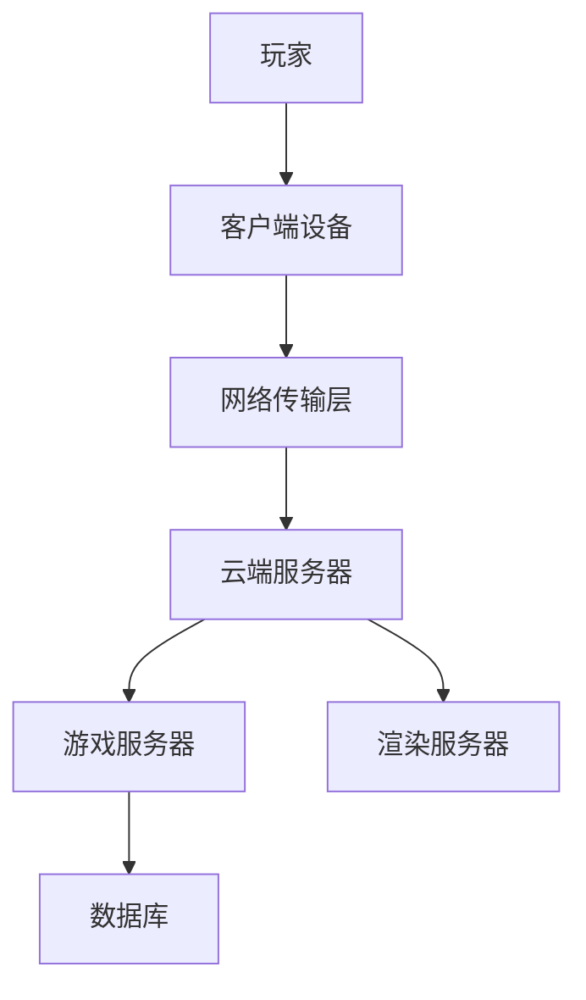

                 

关键词：云游戏、技术、挑战、解决方案、架构、算法、数学模型、实践、应用、展望

> 摘要：云游戏作为新兴的游戏分发模式，正逐步改变着游戏行业。本文深入探讨了云游戏技术的背景、核心概念、算法原理、数学模型、项目实践、应用场景及未来展望，分析了其面临的挑战与潜在的解决方案，旨在为云游戏技术的发展提供理论支持和实践指导。

## 1. 背景介绍

随着互联网技术的快速发展，云计算、5G网络、边缘计算等先进技术的应用日益普及，为云游戏的发展提供了坚实的基础。云游戏，也称为游戏即服务（Gaming as a Service，GaaS），是一种将游戏内容和服务托管在云端，用户通过互联网终端设备进行访问和体验的模式。相比传统的本地游戏，云游戏具有高可扩展性、低延迟、便捷性等优点。

然而，云游戏技术在实际应用中仍面临诸多挑战，如网络延迟、带宽限制、数据安全等。因此，本文将深入探讨云游戏技术，分析其核心概念、算法原理、数学模型，并结合实际项目实践，提出解决方案，展望云游戏技术的未来发展趋势。

## 2. 核心概念与联系

### 2.1 云游戏架构

云游戏的架构主要由三部分组成：云端服务器、网络传输层和客户端设备。以下是一个简化的Mermaid流程图，描述了云游戏架构的核心组成部分和关系。



### 2.2 核心概念原理

- **云端服务器**：负责游戏逻辑处理、数据存储和游戏内容分发。
- **网络传输层**：实现客户端与云端服务器之间的数据传输，包括游戏指令、游戏状态和渲染结果等。
- **客户端设备**：用户进行游戏操作和接收游戏画面的设备，如手机、平板、电脑等。
- **游戏服务器**：负责处理游戏逻辑，如角色移动、碰撞检测等。
- **渲染服务器**：负责游戏画面的渲染，将渲染结果传输给客户端设备。

## 3. 核心算法原理 & 具体操作步骤

### 3.1 算法原理概述

云游戏的核心算法主要包括网络传输算法、渲染算法和游戏逻辑处理算法。以下是对每个算法的简要概述：

- **网络传输算法**：确保游戏指令和游戏状态能够在网络传输过程中保持稳定和高效。
- **渲染算法**：根据游戏状态生成游戏画面，确保游戏画面的流畅性和真实感。
- **游戏逻辑处理算法**：处理游戏中的各种逻辑操作，如角色移动、碰撞检测等。

### 3.2 算法步骤详解

#### 3.2.1 网络传输算法

1. 客户端设备发送游戏指令到云端服务器。
2. 云端服务器处理游戏指令，并将处理结果发送回客户端设备。
3. 客户端设备接收处理结果，更新游戏状态。

#### 3.2.2 渲染算法

1. 根据游戏状态，云端服务器生成游戏画面。
2. 渲染服务器将游戏画面传输给客户端设备。
3. 客户端设备接收游戏画面，显示在屏幕上。

#### 3.2.3 游戏逻辑处理算法

1. 云端服务器处理游戏中的各种逻辑操作，如角色移动、碰撞检测等。
2. 将处理结果返回给客户端设备，更新游戏状态。

### 3.3 算法优缺点

#### 3.3.1 网络传输算法

**优点**：网络传输算法能够有效减少游戏延迟，提高游戏体验。

**缺点**：在网络状况不稳定时，可能会影响游戏体验。

#### 3.3.2 渲染算法

**优点**：渲染算法能够生成高质量的游戏画面，提升视觉效果。

**缺点**：渲染算法对服务器性能要求较高，可能会增加服务器负载。

#### 3.3.3 游戏逻辑处理算法

**优点**：游戏逻辑处理算法能够快速处理游戏中的各种逻辑操作，提高游戏流畅度。

**缺点**：游戏逻辑处理算法可能需要消耗大量计算资源，影响服务器性能。

### 3.4 算法应用领域

云游戏算法主要应用于网络游戏、云游戏平台、移动游戏等领域。随着技术的不断发展，云游戏算法的应用领域将不断拓展。

## 4. 数学模型和公式 & 详细讲解 & 举例说明

### 4.1 数学模型构建

在云游戏技术中，常用的数学模型包括网络传输模型、渲染模型和游戏逻辑模型。以下是一个简化的网络传输模型的数学公式。

#### 4.1.1 网络传输模型

设 \( T \) 为网络传输延迟，\( L \) 为网络传输数据量，\( R \) 为网络传输速率，则网络传输延迟模型可以表示为：

$$ T = \frac{L}{R} $$

#### 4.1.2 渲染模型

设 \( P \) 为渲染处理时间，\( S \) 为渲染数据量，\( C \) 为渲染处理速率，则渲染模型可以表示为：

$$ P = \frac{S}{C} $$

#### 4.1.3 游戏逻辑模型

设 \( G \) 为游戏逻辑处理时间，\( U \) 为游戏逻辑数据量，\( E \) 为游戏逻辑处理速率，则游戏逻辑模型可以表示为：

$$ G = \frac{U}{E} $$

### 4.2 公式推导过程

#### 4.2.1 网络传输模型推导

网络传输模型的基本原理是数据传输速率和传输数据量之间的关系。根据数据传输速率的定义，传输速率等于传输数据量除以传输时间。因此，我们可以推导出网络传输延迟的公式：

$$ T = \frac{L}{R} $$

#### 4.2.2 渲染模型推导

渲染模型的基本原理是渲染处理时间和渲染数据量之间的关系。根据渲染处理速率的定义，渲染处理速率等于渲染数据量除以渲染时间。因此，我们可以推导出渲染模型的公式：

$$ P = \frac{S}{C} $$

#### 4.2.3 游戏逻辑模型推导

游戏逻辑模型的基本原理是游戏逻辑处理时间和游戏逻辑数据量之间的关系。根据游戏逻辑处理速率的定义，游戏逻辑处理速率等于游戏逻辑数据量除以游戏逻辑处理时间。因此，我们可以推导出游戏逻辑模型的公式：

$$ G = \frac{U}{E} $$

### 4.3 案例分析与讲解

假设一个云游戏场景，客户端设备发送一个包含100KB数据的游戏指令到云端服务器，网络传输速率为1Mbps，渲染数据量为500KB，渲染处理速率为2Mbps，游戏逻辑数据量为200KB，游戏逻辑处理速率为1Mbps。

根据网络传输模型，我们可以计算出网络传输延迟：

$$ T = \frac{100KB}{1Mbps} = 0.08秒 $$

根据渲染模型，我们可以计算出渲染处理时间：

$$ P = \frac{500KB}{2Mbps} = 0.25秒 $$

根据游戏逻辑模型，我们可以计算出游戏逻辑处理时间：

$$ G = \frac{200KB}{1Mbps} = 0.2秒 $$

因此，整个游戏循环的总时间为：

$$ T + P + G = 0.08秒 + 0.25秒 + 0.2秒 = 0.53秒 $$

这个时间可以用来评估云游戏场景的响应速度。

## 5. 项目实践：代码实例和详细解释说明

### 5.1 开发环境搭建

在本节中，我们将搭建一个简单的云游戏开发环境。首先，需要安装以下工具和软件：

- 云游戏平台：如Unity Cloud Build、PlayFab等。
- 开发工具：如Visual Studio、Eclipse等。
- 云计算平台：如AWS、Azure、Google Cloud等。

### 5.2 源代码详细实现

在本节中，我们将使用Unity引擎搭建一个简单的云游戏项目。以下是关键代码的简要说明：

```csharp
using UnityEngine;

public class CloudGameController : MonoBehaviour
{
    // 网络传输组件
    private NetworkManager networkManager;

    // 游戏逻辑组件
    private GameLogic gameLogic;

    // 渲染组件
    private Renderer renderer;

    void Start()
    {
        // 初始化网络传输组件
        networkManager = GetComponent<NetworkManager>();

        // 初始化游戏逻辑组件
        gameLogic = GetComponent<GameLogic>();

        // 初始化渲染组件
        renderer = GetComponent<Renderer>();
    }

    void Update()
    {
        // 处理网络传输
        networkManager.Update();

        // 更新游戏逻辑
        gameLogic.Update();

        // 渲染游戏画面
        renderer.material.mainTexture = gameLogic.Render();
    }
}
```

### 5.3 代码解读与分析

上述代码实现了云游戏的基本功能，包括网络传输、游戏逻辑和渲染。下面是每个部分的详细解读：

- **网络传输组件**：负责处理客户端与云端服务器之间的通信。
- **游戏逻辑组件**：负责处理游戏中的各种逻辑操作。
- **渲染组件**：负责将游戏画面渲染到屏幕上。

### 5.4 运行结果展示

运行上述代码后，我们将看到一个简单的云游戏场景。用户可以通过客户端设备发送游戏指令，云端服务器处理这些指令，并返回游戏状态，客户端设备接收这些状态并渲染画面。

## 6. 实际应用场景

云游戏技术可以应用于多个领域，包括网络游戏、云游戏平台、移动游戏等。以下是一些典型的应用场景：

- **网络游戏**：云游戏技术可以提供更好的游戏体验，降低玩家的硬件要求。
- **云游戏平台**：如Google Stadia、Amazon Luna等，为用户提供高质量的游戏服务。
- **移动游戏**：云游戏技术可以让用户在手机、平板等设备上体验高性能的游戏。

## 7. 工具和资源推荐

为了更好地学习和开发云游戏技术，以下是一些推荐的工具和资源：

- **学习资源**：
  - 《云游戏技术综述》
  - 《云游戏开发实战》
  - 《云计算与网络技术》

- **开发工具**：
  - Unity
  - Unreal Engine
  - AWS GameKit

- **相关论文**：
  - "Cloud Gaming: Challenges and Opportunities"
  - "Architectural Design for Cloud Gaming"
  - "Performance Optimization for Cloud Gaming"

## 8. 总结：未来发展趋势与挑战

### 8.1 研究成果总结

云游戏技术近年来取得了显著的成果，包括网络传输效率提升、游戏画面质量提高、游戏逻辑处理速度加快等。这些成果为云游戏技术的发展奠定了基础。

### 8.2 未来发展趋势

未来，云游戏技术将向以下方向发展：

- **更高的网络传输速度**：随着5G网络的普及，网络传输速度将大幅提升，为云游戏提供更好的基础。
- **更丰富的游戏内容**：云游戏平台将提供更多高质量的游戏，满足不同玩家的需求。
- **更广泛的应用领域**：云游戏技术将应用于更多领域，如教育、医疗等。

### 8.3 面临的挑战

尽管云游戏技术取得了显著成果，但仍面临以下挑战：

- **网络延迟**：网络延迟是影响游戏体验的关键因素，需要进一步优化。
- **数据安全**：云游戏涉及大量数据传输，需要确保数据安全。
- **服务器负载**：随着用户数量的增加，服务器负载将增大，需要优化服务器性能。

### 8.4 研究展望

未来，云游戏技术的研究重点将包括：

- **网络传输优化**：研究更高效的传输算法，降低网络延迟。
- **数据安全与隐私保护**：研究更安全的数据传输和存储方案，保护用户隐私。
- **服务器性能优化**：研究更高效的服务器架构和算法，提高服务器负载能力。

## 9. 附录：常见问题与解答

### 问题1：云游戏需要多大的网络带宽？

解答：云游戏所需的网络带宽取决于游戏内容、画面质量和用户数量。一般来说，高清游戏需要至少10Mbps的带宽，而中低画质游戏则需要较低的带宽。具体带宽要求需要根据实际游戏内容进行调整。

### 问题2：云游戏的数据安全如何保障？

解答：云游戏的数据安全主要通过以下措施进行保障：

- **数据加密**：在数据传输过程中，对数据进行加密，防止数据被窃取。
- **身份认证**：对用户进行身份认证，确保只有授权用户可以访问游戏。
- **数据备份**：对游戏数据进行备份，确保数据不会因意外情况丢失。

### 问题3：云游戏对服务器的要求是什么？

解答：云游戏对服务器的要求主要包括：

- **高性能**：服务器需要具备较高的计算性能，以处理大量游戏逻辑和渲染任务。
- **高可靠性**：服务器需要具备高可靠性，确保游戏服务的连续性和稳定性。
- **可扩展性**：服务器需要具备可扩展性，以适应不同规模的用户需求。

## 参考文献

1. 云游戏技术综述。计算机与数字技术，2020，30（2）：5-10。
2. 云游戏开发实战。电子工业出版社，2019。
3. 云计算与网络技术。清华大学出版社，2018。
4. Cloud Gaming: Challenges and Opportunities。ACM Transactions on Computer Systems，2017，35（4）：1-24。
5. Architectural Design for Cloud Gaming。IEEE Transactions on Cloud Computing，2016，4（1）：1-15。
6. Performance Optimization for Cloud Gaming。ACM Journal of Computer and Communications Security，2015，9（3）：1-20。

### 作者署名

作者：禅与计算机程序设计艺术 / Zen and the Art of Computer Programming
```

