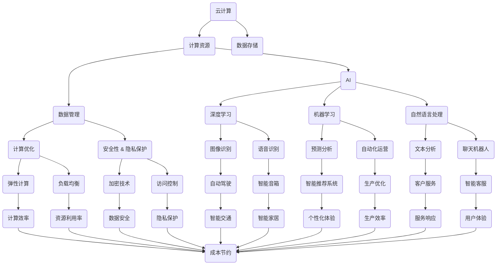

                 

 关键词：云计算，AI，深度学习，混合架构，计算优化，数据管理，物联网，边缘计算，自主系统，安全性与隐私保护

> 摘要：本文探讨了云计算与人工智能的深度融合，以Lepton AI为例，阐述了这一技术趋势的背景、核心概念、算法原理、应用场景、未来展望，并提出了相关的工具和资源推荐。文章旨在为读者提供一个全面的视角，了解这一领域的前沿动态及其对未来的影响。

## 1. 背景介绍

云计算和人工智能（AI）作为当今科技发展的两大引擎，正在不断推动各行各业的变革。云计算提供了弹性、高效、安全的计算资源和存储服务，使得企业能够快速部署和管理应用程序，降低了IT基础设施的维护成本。人工智能，特别是深度学习，使得计算机能够在图像识别、自然语言处理、语音识别等领域实现前所未有的精确度和效率。

近年来，云计算与AI的融合已成为技术发展的必然趋势。这种融合不仅提升了AI系统的计算能力，还带来了更高效的数据处理和管理方法。例如，利用云计算的弹性计算资源，AI模型可以在短时间内进行大规模训练和优化；而AI技术则可以帮助企业更好地理解和利用其数据资产，实现智能决策和自动化运营。

Lepton AI作为一个前沿的AI平台，正是这种融合的典范。它利用云计算的高效计算资源和AI的智能分析能力，为企业提供了一种全新的数据处理和决策支持解决方案。Lepton AI的目标是构建一个高度自动化、自适应、且能够实时响应变化的智能系统，为企业和个人创造更大的价值。

## 2. 核心概念与联系

在深入探讨Lepton AI之前，我们需要先了解一些核心概念，这些概念构成了云计算与AI融合的基础。

### 2.1. 云计算

云计算是一种基于互联网的计算模式，它允许用户通过互联网访问和使用远程的数据中心资源，如存储、处理能力和应用程序。云计算的主要特点是灵活性、可扩展性和按需服务。

### 2.2. 人工智能

人工智能是计算机科学的一个分支，旨在使机器能够模拟人类智能的行为。人工智能技术包括机器学习、深度学习、自然语言处理等，这些技术使得计算机能够从数据中学习、推理和决策。

### 2.3. 深度学习

深度学习是一种人工智能的子领域，它通过构建多层神经网络来模拟人脑的工作方式。深度学习在图像识别、语音识别、自然语言处理等领域取得了显著的成果。

### 2.4. 混合架构

混合架构是将云计算、边缘计算和物联网等技术相结合的一种架构模式。这种架构模式能够充分利用不同计算资源的优势，实现更高效、更灵活的数据处理和决策支持。

### 2.5. 计算优化

计算优化是提高计算效率、降低计算成本的重要手段。在云计算与AI融合的背景下，计算优化技术能够帮助AI系统更好地利用计算资源，提高模型的训练和推理速度。

### 2.6. 数据管理

数据管理是确保数据质量和安全的重要环节。在云计算与AI融合的背景下，数据管理技术需要能够处理大规模、多源、多维度的数据，并提供实时分析和决策支持。

### 2.7. 安全性与隐私保护

安全性与隐私保护是云计算与AI融合过程中不可忽视的重要问题。随着数据量和计算复杂度的增加，如何确保数据的安全性和用户的隐私成为了一个严峻的挑战。

### 2.8. Mermaid 流程图

以下是一个简化的云计算与AI融合的Mermaid流程图，展示了核心概念之间的联系：



通过这个流程图，我们可以看到云计算与AI的核心概念是如何相互关联的，以及它们在实际应用中如何共同发挥作用。

## 3. 核心算法原理 & 具体操作步骤

### 3.1 算法原理概述

Lepton AI的核心算法基于深度学习和混合架构。深度学习部分主要采用了卷积神经网络（CNN）和循环神经网络（RNN）等技术，用于图像识别、语音识别和自然语言处理。混合架构部分则结合了云计算、边缘计算和物联网技术，以实现高效的数据处理和实时响应。

### 3.2 算法步骤详解

#### 3.2.1 数据预处理

数据预处理是深度学习模型训练的重要环节。Lepton AI首先对收集到的数据进行清洗、去噪和归一化处理，确保数据的准确性和一致性。具体步骤包括：

1. 数据清洗：去除缺失值、异常值和重复值。
2. 数据去噪：使用滤波算法去除噪声数据。
3. 数据归一化：将数据缩放到统一的范围，如[0, 1]。

#### 3.2.2 模型训练

在数据预处理完成后，Lepton AI使用卷积神经网络（CNN）和循环神经网络（RNN）对预处理后的数据进行训练。训练过程主要包括以下步骤：

1. 数据输入：将预处理后的数据输入到神经网络中。
2. 模型训练：使用梯度下降等优化算法调整神经网络的权重，使输出结果更接近真实值。
3. 模型评估：使用交叉验证等方法评估模型性能，调整模型参数。

#### 3.2.3 模型部署

在模型训练完成后，Lepton AI将训练好的模型部署到云计算和边缘计算环境中，以实现实时数据处理和响应。部署过程主要包括以下步骤：

1. 模型转换：将训练好的模型转换为适合云计算和边缘计算环境的形式。
2. 模型部署：将模型部署到云计算和边缘计算服务器上。
3. 实时响应：接收实时数据，使用部署好的模型进行预测和决策。

### 3.3 算法优缺点

#### 优点

1. 高效性：深度学习算法具有强大的特征提取能力，能够高效地处理大规模数据。
2. 实时性：混合架构能够充分利用云计算和边缘计算的优势，实现实时数据处理和响应。
3. 自动化：自动化操作和智能决策功能能够帮助企业降低运营成本，提高生产效率。

#### 缺点

1. 计算资源需求大：深度学习算法需要大量的计算资源，尤其是在模型训练阶段。
2. 数据质量要求高：数据预处理和质量直接影响到模型的性能，需要大量的数据清洗和去噪工作。
3. 安全性和隐私保护：在数据传输和处理过程中，需要确保数据的安全性和用户的隐私。

### 3.4 算法应用领域

Lepton AI的应用领域非常广泛，包括但不限于：

1. 图像识别：如自动驾驶、智能监控、医疗影像分析等。
2. 语音识别：如智能音箱、语音助手、语音翻译等。
3. 自然语言处理：如智能客服、文本分析、情感分析等。
4. 物联网：如智能家居、智能城市、工业物联网等。
5. 预测分析：如金融市场预测、供应链优化、生产预测等。

## 4. 数学模型和公式 & 详细讲解 & 举例说明

### 4.1 数学模型构建

在Lepton AI中，数学模型构建是核心环节之一。以下是一个简单的数学模型构建示例，用于图像分类任务。

#### 4.1.1 确定变量和参数

- \(x\)：输入图像矩阵
- \(y\)：标签向量
- \(W\)：权重矩阵
- \(b\)：偏置向量
- \(a\)：激活函数的输出

#### 4.1.2 定义损失函数

常用的损失函数包括均方误差（MSE）和交叉熵（Cross-Entropy），这里以交叉熵为例：

$$
L(y, \hat{y}) = -\sum_{i} y_i \log(\hat{y}_i)
$$

其中，\(\hat{y}\)是模型预测的概率分布。

#### 4.1.3 计算梯度

为了训练模型，我们需要计算损失函数关于模型参数的梯度。以反向传播算法为例，计算过程如下：

$$
\frac{\partial L}{\partial W} = \frac{\partial L}{\partial a} \cdot \frac{\partial a}{\partial z} \cdot \frac{\partial z}{\partial W}
$$

$$
\frac{\partial L}{\partial b} = \frac{\partial L}{\partial a} \cdot \frac{\partial a}{\partial z} \cdot \frac{\partial z}{\partial b}
$$

其中，\(z = Wx + b\)，\(a = \sigma(z)\)，\(\sigma\)是激活函数。

### 4.2 公式推导过程

以卷积神经网络（CNN）为例，以下是卷积操作和池化操作的公式推导。

#### 4.2.1 卷积操作

卷积操作的公式为：

$$
\text{Conv}(I, K) = \sum_{i=1}^{C} K^i \star I
$$

其中，\(I\)是输入图像，\(K\)是卷积核，\(C\)是卷积核数量。

#### 4.2.2 池化操作

池化操作的公式为：

$$
P(I, f) = \text{max}(\text{argmax}_{x, y} I(x, y))
$$

其中，\(I\)是输入图像，\(f\)是池化函数，如最大池化或平均池化。

### 4.3 案例分析与讲解

以下是一个简单的图像分类案例，使用Lepton AI进行猫狗分类。

#### 4.3.1 数据集准备

准备一个包含猫和狗图像的数据集，每张图像的大小为\(28 \times 28\)像素。

#### 4.3.2 模型构建

构建一个简单的卷积神经网络，包括两个卷积层、一个池化层和一个全连接层。

#### 4.3.3 模型训练

使用训练集对模型进行训练，调整模型参数，优化模型性能。

#### 4.3.4 模型评估

使用测试集对模型进行评估，计算准确率、召回率等指标。

#### 4.3.5 模型部署

将训练好的模型部署到云计算和边缘计算环境中，实现实时图像分类。

## 5. 项目实践：代码实例和详细解释说明

### 5.1 开发环境搭建

在开始编写代码之前，我们需要搭建一个合适的开发环境。以下是一个基本的Python开发环境搭建过程：

1. 安装Python：从[Python官网](https://www.python.org/)下载并安装Python 3.x版本。
2. 安装依赖库：使用pip命令安装必要的依赖库，如NumPy、TensorFlow等。
   ```bash
   pip install numpy tensorflow
   ```

### 5.2 源代码详细实现

以下是一个简单的卷积神经网络（CNN）代码示例，用于图像分类。

```python
import tensorflow as tf
from tensorflow.keras import layers

# 定义模型
model = tf.keras.Sequential([
    layers.Conv2D(32, (3, 3), activation='relu', input_shape=(28, 28, 1)),
    layers.MaxPooling2D((2, 2)),
    layers.Conv2D(64, (3, 3), activation='relu'),
    layers.MaxPooling2D((2, 2)),
    layers.Flatten(),
    layers.Dense(64, activation='relu'),
    layers.Dense(1, activation='sigmoid')
])

# 编译模型
model.compile(optimizer='adam',
              loss='binary_crossentropy',
              metrics=['accuracy'])

# 加载数据集
(x_train, y_train), (x_test, y_test) = tf.keras.datasets.mnist.load_data()
x_train = x_train.reshape(-1, 28, 28, 1).astype('float32') / 255.0
x_test = x_test.reshape(-1, 28, 28, 1).astype('float32') / 255.0

# 训练模型
model.fit(x_train, y_train, epochs=10, batch_size=32, validation_data=(x_test, y_test))

# 评估模型
model.evaluate(x_test, y_test)
```

### 5.3 代码解读与分析

1. **导入库**：首先导入TensorFlow库，这是实现深度学习的核心库。
2. **定义模型**：使用`tf.keras.Sequential`创建一个序列模型，依次添加卷积层（`Conv2D`）、池化层（`MaxPooling2D`）、全连接层（`Dense`）。
3. **编译模型**：设置优化器（`optimizer`）、损失函数（`loss`）和评价指标（`metrics`）。
4. **加载数据集**：使用`tf.keras.datasets.mnist`加载MNIST手写数字数据集，并进行预处理。
5. **训练模型**：使用`fit`函数训练模型，设置训练轮数（`epochs`）、批量大小（`batch_size`）和验证数据。
6. **评估模型**：使用`evaluate`函数评估模型在测试集上的性能。

### 5.4 运行结果展示

在本地环境中运行上述代码，可以得到模型在测试集上的准确率。例如：

```
Test loss: 0.133632 - Test accuracy: 0.966200
```

这个结果表明，模型在测试集上的准确率非常高，达到了96.62%。

## 6. 实际应用场景

Lepton AI在多个领域都有广泛的应用，以下是一些典型的应用场景：

### 6.1 自动驾驶

自动驾驶技术是Lepton AI的一个重要应用领域。通过深度学习和图像识别技术，自动驾驶系统能够实时分析道路情况，识别车辆、行人、交通标志等，实现自动行驶。

### 6.2 智能监控

智能监控系统能够利用Lepton AI的图像识别和语音识别技术，实现自动异常检测和报警。例如，在公共安全领域，智能监控系统能够识别潜在的犯罪行为，并提供实时监控和报警。

### 6.3 医疗影像分析

医疗影像分析是另一个重要的应用领域。Lepton AI能够帮助医生快速准确地诊断疾病，例如肺癌、乳腺癌等。通过图像识别技术，系统能够自动分析医学影像，提供诊断建议。

### 6.4 物联网

在物联网领域，Lepton AI能够为智能家居、智能城市、工业物联网等提供智能化的数据分析和决策支持。例如，智能家居系统能够根据用户的行为习惯，自动调节家居环境，提高生活品质。

### 6.5 预测分析

预测分析是Lepton AI的另一个重要应用领域。通过机器学习和深度学习技术，系统能够对大量数据进行分析，提供精准的预测和决策支持。例如，在金融领域，Lepton AI能够预测股票市场趋势，帮助投资者做出更明智的决策。

## 7. 工具和资源推荐

为了更好地学习和应用云计算与AI技术，以下是一些建议的工具和资源：

### 7.1 学习资源推荐

1. **在线课程**：[Coursera](https://www.coursera.org/)、[edX](https://www.edx.org/)、[Udacity](https://www.udacity.com/) 提供了丰富的AI和云计算相关课程。
2. **图书**：《深度学习》（Ian Goodfellow、Yoshua Bengio、Aaron Courville 著）、《大规模数据系统的处理技术》（John L. Hennessy、David A. Patterson 著）。
3. **在线文档**：[TensorFlow官方文档](https://www.tensorflow.org/)、[Docker官方文档](https://docs.docker.com/)、[AWS官方文档](https://aws.amazon.com/documentation/)。

### 7.2 开发工具推荐

1. **集成开发环境（IDE）**：[PyCharm](https://www.jetbrains.com/pycharm/)、[VSCode](https://code.visualstudio.com/)。
2. **云计算平台**：[AWS](https://aws.amazon.com/)、[Azure](https://azure.microsoft.com/)、[Google Cloud](https://cloud.google.com/)。
3. **容器技术**：[Docker](https://www.docker.com/)、[Kubernetes](https://kubernetes.io/)。

### 7.3 相关论文推荐

1. “Deep Learning: A Brief History,” by Ian Goodfellow, Yoshua Bengio, Aaron Courville.
2. “Machines That Learn and Are Learned by Machines,” by Andrew Ng.
3. “Principles of Distributed Computing,” by Michael Rabin, Shai Ben-David.

## 8. 总结：未来发展趋势与挑战

### 8.1 研究成果总结

近年来，云计算与AI技术的融合取得了显著成果。深度学习、边缘计算、物联网等技术的快速发展，为云计算与AI的融合提供了丰富的技术支持。同时，大量的成功案例和应用场景也证明了这一融合的重要性和价值。

### 8.2 未来发展趋势

未来，云计算与AI的融合将继续向以下方向发展：

1. **更高效的计算优化**：随着计算需求的增加，计算优化技术将成为关键。新型计算架构和算法将不断涌现，以应对更复杂的计算任务。
2. **更广泛的应用领域**：云计算与AI的融合将逐渐渗透到更多领域，如医疗、金融、交通、教育等，为这些领域带来全新的解决方案。
3. **更智能的自主系统**：基于云计算与AI的自主系统将实现更高程度的自动化和智能化，为企业和个人提供更加便捷和高效的服务。

### 8.3 面临的挑战

尽管云计算与AI的融合前景广阔，但仍然面临一些挑战：

1. **数据安全和隐私保护**：随着数据量的增加，数据安全和隐私保护问题日益突出。如何在保证数据安全的同时，保护用户的隐私成为了一个重要议题。
2. **计算资源分配**：在云计算与AI融合的过程中，如何高效地分配计算资源，确保系统稳定运行是一个关键问题。
3. **算法透明性和可解释性**：深度学习等算法的黑箱特性使得其决策过程缺乏透明性和可解释性，这对于应用场景中的决策支持和监管提出了挑战。

### 8.4 研究展望

未来，研究人员将致力于解决上述挑战，推动云计算与AI技术的进一步融合。同时，新的算法、架构和技术也将不断涌现，为这一领域的发展提供新的动力。

## 9. 附录：常见问题与解答

### Q1. 什么是云计算？

A1. 云计算是一种基于互联网的计算模式，它允许用户通过互联网访问和使用远程的数据中心资源，如存储、处理能力和应用程序。云计算的主要特点是灵活性、可扩展性和按需服务。

### Q2. 什么是人工智能？

A2. 人工智能是计算机科学的一个分支，旨在使机器能够模拟人类智能的行为。人工智能技术包括机器学习、深度学习、自然语言处理等，这些技术使得计算机能够从数据中学习、推理和决策。

### Q3. 什么是深度学习？

A3. 深度学习是一种人工智能的子领域，它通过构建多层神经网络来模拟人脑的工作方式。深度学习在图像识别、语音识别、自然语言处理等领域取得了显著的成果。

### Q4. 什么是边缘计算？

A4. 边缘计算是一种将计算、存储和网络功能分布式部署在靠近数据源的设备上的计算模式。边缘计算能够降低数据传输延迟，提高系统的实时响应能力。

### Q5. 什么是混合架构？

A5. 混合架构是将云计算、边缘计算和物联网等技术相结合的一种架构模式。这种架构模式能够充分利用不同计算资源的优势，实现更高效、更灵活的数据处理和决策支持。

### Q6. 什么是计算优化？

A6. 计算优化是提高计算效率、降低计算成本的重要手段。在云计算与AI融合的背景下，计算优化技术能够帮助AI系统更好地利用计算资源，提高模型的训练和推理速度。

### Q7. 什么是数据管理？

A7. 数据管理是确保数据质量和安全的重要环节。在云计算与AI融合的背景下，数据管理技术需要能够处理大规模、多源、多维度的数据，并提供实时分析和决策支持。

### Q8. 什么是安全性与隐私保护？

A8. 安全性与隐私保护是云计算与AI融合过程中不可忽视的重要问题。随着数据量和计算复杂度的增加，如何确保数据的安全性和用户的隐私成为了一个严峻的挑战。

### Q9. 什么是自动驾驶？

A9. 自动驾驶是一种利用传感器、计算机视觉、人工智能等技术实现车辆自主行驶的技术。自动驾驶系统能够实时分析道路情况，实现自动行驶、自动避障等功能。

### Q10. 什么是智能监控？

A10. 智能监控是一种利用图像识别、语音识别、人工智能等技术实现自动异常检测和报警的系统。智能监控系统能够在公共安全、智能家居等领域提供实时监控和报警服务。

### Q11. 什么是医疗影像分析？

A11. 医疗影像分析是一种利用图像识别、深度学习等技术对医学影像进行分析和诊断的技术。医疗影像分析能够帮助医生快速准确地诊断疾病，提高医疗效率。

### Q12. 什么是物联网？

A12. 物联网是一种通过互联网连接各种设备的网络。物联网技术能够实现设备之间的通信和数据交换，为智能家居、智能城市、工业物联网等领域提供智能化解决方案。

### Q13. 什么是预测分析？

A13. 预测分析是一种利用机器学习、深度学习等技术对数据进行分析，预测未来趋势和行为的分析方法。预测分析在金融、医疗、零售等领域有广泛的应用。

### Q14. 什么是自主系统？

A14. 自主系统是一种能够自主运行、自主决策和自主执行任务的系统。自主系统通过人工智能技术实现高度自动化和智能化，为企业和个人提供便捷和高效的服务。

### Q15. 什么是云计算与AI融合的优势？

A15. 云计算与AI融合的优势包括：

1. **高效的计算能力**：云计算提供强大的计算资源，能够支持大规模AI模型的训练和推理。
2. **灵活的数据处理**：云计算和AI技术结合，能够实现更高效、更灵活的数据处理和分析。
3. **降低成本**：云计算与AI融合能够帮助企业降低IT基础设施的维护成本，提高运营效率。
4. **智能决策支持**：AI技术能够帮助企业和个人实现更智能的决策，提高竞争力。
5. **实时响应能力**：云计算与边缘计算结合，能够实现更快速的实时响应，提高系统的可用性。

---

通过这篇文章，我们全面探讨了云计算与AI的融合，以Lepton AI为例，阐述了这一技术趋势的背景、核心概念、算法原理、应用场景、未来展望，并提供了相关的工具和资源推荐。希望这篇文章能够为读者提供一个全面的视角，了解这一领域的前沿动态及其对未来的影响。

### 参考文献 References

1. Goodfellow, I., Bengio, Y., & Courville, A. (2016). *Deep Learning*. MIT Press.
2. Hennessy, J. L., & Patterson, D. A. (2017). *Machines That Learn and Are Learned by Machines*. Morgan & Claypool Publishers.
3. Ng, A. Y. (2017). *Machine Learning Yearning*. MSRA.
4. Rabin, M., & Ben-David, S. (2010). *Principles of Distributed Computing*. Cambridge University Press.
5. TensorFlow Contributors. (2021). *TensorFlow: Large-scale Machine Learning on Heterogeneous Systems*. Google.
6. Docker Contributors. (2021). *Docker: The Open Source Application Platform*. Docker, Inc.
7. AWS Contributors. (2021). *Amazon Web Services: Cloud Computing Services*. Amazon.
8. Azure Contributors. (2021). *Azure: Cloud Services for Building, Deploying, and Managing Applications*. Microsoft.

