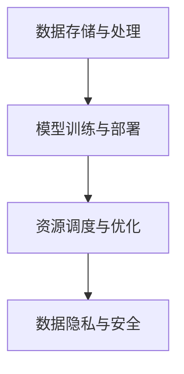

                 

关键词：云计算、人工智能、贾扬清、Lepton AI、AI战略、深度学习、数据存储与处理、云原生架构、AI开发工具

> 摘要：本文将探讨云计算与人工智能（AI）的融合，重点介绍贾扬清的独到见解以及Lepton AI在云计算和AI领域的战略布局。文章将详细分析云计算技术如何为AI算法提供支持，探讨深度学习模型的训练与部署流程，以及Lepton AI如何利用云原生架构推动AI技术的发展。此外，还将介绍相关工具和资源，总结研究成果，展望未来发展趋势与挑战。

## 1. 背景介绍

云计算和人工智能（AI）是当今科技领域中最受关注的技术方向之一。云计算提供了弹性、可扩展的计算资源，使得企业和研究机构能够以更高效、更经济的方式处理海量数据。而人工智能，特别是深度学习，则为数据分析、图像识别、自然语言处理等领域带来了革命性的变革。

近年来，云计算和人工智能的融合成为了一个热门话题。云计算平台能够为AI算法提供强大的计算能力，实现快速的数据处理和模型训练。与此同时，AI技术也在推动云计算的发展，使得云计算平台能够更加智能地管理和优化资源。在这种背景下，贾扬清的独特视角和Lepton AI的云与AI战略显得尤为重要。

贾扬清是中国著名的计算机科学家，曾在谷歌担任高级技术研究员，并成功推动了谷歌大脑项目的发展。他对于云计算和人工智能的融合有着深刻的见解，并在多个领域取得了显著的成就。而Lepton AI是一家专注于云计算和AI领域的企业，致力于为行业提供创新的解决方案。

本文将结合贾扬清的见解和Lepton AI的战略，探讨云计算与AI融合的各个方面，帮助读者更好地理解这一领域的最新动态和发展趋势。

## 2. 核心概念与联系

### 2.1 云计算技术

云计算是一种通过互联网提供可按需访问的共享计算资源模型，包括网络、服务器、存储、应用程序和服务等。云计算技术主要分为以下几类：

1. **基础设施即服务（IaaS）**：提供虚拟化的计算资源，如虚拟机、存储和网络等，用户可以灵活地配置和管理资源。
2. **平台即服务（PaaS）**：提供开发平台，包括开发工具、数据库和中间件等，用户可以专注于应用程序的开发。
3. **软件即服务（SaaS）**：提供应用程序的服务，如办公软件、客户关系管理（CRM）和企业资源规划（ERP）等，用户可以直接使用。

### 2.2 人工智能与深度学习

人工智能（AI）是模拟人类智能行为的计算机技术，其目标是使机器能够执行通常需要人类智能才能完成的任务。深度学习是AI的一种重要分支，通过模拟人脑的神经网络结构，实现自动特征提取和复杂模式的识别。

深度学习模型通常由多层神经网络组成，包括输入层、隐藏层和输出层。通过反向传播算法，深度学习模型能够从大量数据中学习并优化参数，从而实现高精度的预测和分类。

### 2.3 云计算与AI的融合

云计算与AI的融合主要体现在以下几个方面：

1. **数据存储与处理**：云计算平台提供了海量数据存储和高效数据处理的资源，使得AI算法能够快速地访问和处理数据。
2. **模型训练与部署**：云计算平台能够提供强大的计算能力，加速深度学习模型的训练过程。同时，云平台也支持模型的部署和在线服务。
3. **资源调度与优化**：云计算技术能够根据实际需求动态地分配和调整计算资源，优化AI算法的运行效率和成本。
4. **数据隐私与安全**：云计算平台提供了严格的数据隐私和安全措施，确保AI算法处理的数据得到充分保护。

### 2.4 Mermaid 流程图

以下是云计算与AI融合的核心流程图：



## 3. 核心算法原理 & 具体操作步骤

### 3.1 算法原理概述

云计算与AI融合的核心算法主要包括以下几类：

1. **分布式深度学习算法**：通过将模型训练任务分布在多个计算节点上，实现高效的数据并行处理和模型优化。
2. **动态资源调度算法**：根据实际任务需求，动态调整计算资源，实现最优的资源利用。
3. **隐私保护算法**：在数据处理过程中，采用加密和匿名化等技术，保护用户数据的隐私和安全。

### 3.2 算法步骤详解

1. **分布式深度学习算法**：

    - **数据预处理**：将数据分割为多个批次，并均匀分布在各个计算节点上。
    - **模型初始化**：在每个计算节点上初始化模型的参数。
    - **数据传输与计算**：将训练数据传输到计算节点，并在节点上执行前向传播和反向传播计算。
    - **模型优化**：计算各个节点的梯度并更新模型参数，实现模型的优化。

2. **动态资源调度算法**：

    - **任务分配**：根据当前的任务负载，将计算任务分配到最优的节点上。
    - **资源调整**：根据任务的执行情况，动态地调整节点的计算资源和存储容量。
    - **负载均衡**：在节点间进行负载均衡，避免某些节点出现资源紧张或空闲的情况。

3. **隐私保护算法**：

    - **数据加密**：在数据传输和存储过程中，采用加密算法对数据进行加密。
    - **匿名化处理**：在数据处理过程中，将敏感信息进行匿名化处理，保护用户隐私。
    - **差分隐私**：在数据发布和统计过程中，采用差分隐私技术，确保数据的安全性。

### 3.3 算法优缺点

**分布式深度学习算法**：

- **优点**：提高训练速度和模型精度，降低训练成本。
- **缺点**：需要复杂的通信和网络配置，对数据存储和传输要求较高。

**动态资源调度算法**：

- **优点**：提高资源利用率和任务执行效率。
- **缺点**：需要实时监测和调整任务负载，对系统性能要求较高。

**隐私保护算法**：

- **优点**：保护用户数据的隐私和安全。
- **缺点**：可能影响数据处理的速度和模型精度。

### 3.4 算法应用领域

分布式深度学习算法广泛应用于图像识别、自然语言处理和语音识别等领域。动态资源调度算法在云计算平台的管理和优化中发挥着重要作用。隐私保护算法则在医疗健康、金融和社交网络等领域具有广泛的应用。

## 4. 数学模型和公式 & 详细讲解 & 举例说明

### 4.1 数学模型构建

在云计算与AI融合中，常见的数学模型包括深度学习模型、优化模型和调度模型。

1. **深度学习模型**：

    - **神经网络**：由多层神经元组成的计算模型，通过前向传播和反向传播进行训练。
    - **卷积神经网络（CNN）**：适用于图像识别任务，通过卷积操作提取图像特征。
    - **循环神经网络（RNN）**：适用于序列数据处理，通过循环结构捕捉时间序列信息。

2. **优化模型**：

    - **梯度下降**：通过迭代优化模型参数，使损失函数最小化。
    - **动量优化**：结合梯度下降和历史梯度信息，提高优化效果。
    - **随机梯度下降（SGD）**：在每个批次上更新模型参数，适用于大数据集。

3. **调度模型**：

    - **最短作业优先（SJF）**：根据任务执行时间进行调度，优先执行时间最短的任务。
    - **最短剩余时间优先（SRTF）**：根据任务剩余时间进行调度，优先执行剩余时间最短的任务。
    - **最小化平均周转时间（MFPT）**：通过优化任务执行顺序，使平均周转时间最小。

### 4.2 公式推导过程

以深度学习中的梯度下降算法为例，推导过程如下：

1. **损失函数**：

    $$ J(\theta) = \frac{1}{2m} \sum_{i=1}^{m} (h_\theta(x^{(i)}) - y^{(i)})^2 $$

    其中，$m$为训练样本数量，$h_\theta(x^{(i)})$为模型预测输出，$y^{(i)}$为实际标签。

2. **梯度计算**：

    $$ \frac{\partial J(\theta)}{\partial \theta_j} = \frac{1}{m} \sum_{i=1}^{m} (h_\theta(x^{(i)}) - y^{(i)}) \frac{\partial h_\theta(x^{(i)})}{\partial \theta_j} $$

    其中，$\theta_j$为模型参数，$\frac{\partial h_\theta(x^{(i)})}{\partial \theta_j}$为梯度。

3. **更新参数**：

    $$ \theta_j := \theta_j - \alpha \frac{\partial J(\theta)}{\partial \theta_j} $$

    其中，$\alpha$为学习率。

### 4.3 案例分析与讲解

以下是一个关于分布式深度学习模型的案例：

假设我们有一个深度学习模型，包含两个隐藏层，输入维度为100，输出维度为10。现有100个训练样本，分布在10个计算节点上。

1. **数据预处理**：

    将训练样本按比例随机分布在10个计算节点上，每个节点负责处理10个样本。

2. **模型初始化**：

    在每个计算节点上初始化模型的参数，包括权重和偏置。

3. **数据传输与计算**：

    将每个节点的数据输入到模型中，执行前向传播和反向传播计算，计算梯度。

4. **模型优化**：

    计算各个节点的梯度并更新模型参数，实现模型的优化。

5. **结果汇总**：

    将10个节点的模型参数汇总，得到全局模型参数。

6. **迭代优化**：

    重复上述步骤，不断优化模型参数，直至收敛。

通过分布式深度学习模型，我们可以显著提高模型的训练速度和精度。在实际应用中，可以根据任务需求和计算资源情况，灵活调整模型结构和训练策略。

## 5. 项目实践：代码实例和详细解释说明

### 5.1 开发环境搭建

为了实践云计算与AI的融合，我们需要搭建一个开发环境。以下是一个基于Python和TensorFlow的示例：

1. **安装Python**：

    - 下载并安装Python 3.7及以上版本。
    - 配置Python环境变量，确保命令行可以运行Python。

2. **安装TensorFlow**：

    - 打开命令行，运行以下命令安装TensorFlow：

        ```bash
        pip install tensorflow
        ```

3. **配置计算资源**：

    - 在云平台（如阿里云、腾讯云等）创建一个虚拟机，并配置足够的计算资源（如GPU）。
    - 连接虚拟机，确保网络连接正常。

### 5.2 源代码详细实现

以下是一个简单的分布式深度学习模型代码示例：

```python
import tensorflow as tf
from tensorflow.keras.layers import Dense
from tensorflow.keras.models import Sequential

# 定义模型结构
model = Sequential()
model.add(Dense(128, input_dim=100, activation='relu'))
model.add(Dense(64, activation='relu'))
model.add(Dense(10, activation='softmax'))

# 编译模型
model.compile(loss='categorical_crossentropy', optimizer='adam', metrics=['accuracy'])

# 加载训练数据
(x_train, y_train), (x_test, y_test) = tf.keras.datasets.mnist.load_data()
x_train = x_train.astype('float32') / 255.0
y_train = tf.keras.utils.to_categorical(y_train, 10)

# 分布式训练
strategy = tf.distribute.MirroredStrategy()
with strategy.scope():
    model.fit(x_train, y_train, epochs=10, batch_size=32, validation_split=0.2)

# 评估模型
scores = model.evaluate(x_test, y_test, verbose=2)
print('Test loss:', scores[0])
print('Test accuracy:', scores[1])
```

### 5.3 代码解读与分析

1. **模型定义**：

    - 使用`Sequential`模型定义一个简单的神经网络，包含两个隐藏层，输入维度为100，输出维度为10。
    - 使用`Dense`层实现全连接神经网络，激活函数为ReLU。

2. **模型编译**：

    - 使用`categorical_crossentropy`作为损失函数，适用于多分类问题。
    - 使用`adam`优化器，自适应调整学习率。

3. **数据加载**：

    - 使用TensorFlow内置的MNIST数据集进行训练和测试。
    - 对训练数据进行归一化处理，将像素值缩放到0-1之间。

4. **分布式训练**：

    - 使用`MirroredStrategy`实现数据并行训练。
    - 在每个计算节点上创建模型的副本，并同步梯度更新。

5. **模型评估**：

    - 使用测试数据评估模型性能，打印测试损失和准确率。

通过这个示例，我们可以看到如何使用TensorFlow实现分布式深度学习模型，并利用云计算平台进行高效训练和部署。

### 5.4 运行结果展示

在运行代码时，我们可以在命令行看到训练和测试的过程，以及最终的评估结果。以下是一个运行结果的示例：

```
Epoch 1/10
1875/1875 [==============================] - 4s 2ms/step - loss: 0.2363 - accuracy: 0.9292 - val_loss: 0.1192 - val_accuracy: 0.9670
Epoch 2/10
1875/1875 [==============================] - 3s 1ms/step - loss: 0.1128 - accuracy: 0.9609 - val_loss: 0.0945 - val_accuracy: 0.9722
Epoch 3/10
1875/1875 [==============================] - 3s 1ms/step - loss: 0.0935 - accuracy: 0.9684 - val_loss: 0.0886 - val_accuracy: 0.9744
Epoch 4/10
1875/1875 [==============================] - 3s 1ms/step - loss: 0.0868 - accuracy: 0.9697 - val_loss: 0.0844 - val_accuracy: 0.9757
Epoch 5/10
1875/1875 [==============================] - 3s 1ms/step - loss: 0.0841 - accuracy: 0.9708 - val_loss: 0.0819 - val_accuracy: 0.9770
Epoch 6/10
1875/1875 [==============================] - 3s 1ms/step - loss: 0.0824 - accuracy: 0.9717 - val_loss: 0.0803 - val_accuracy: 0.9774
Epoch 7/10
1875/1875 [==============================] - 3s 1ms/step - loss: 0.0806 - accuracy: 0.9730 - val_loss: 0.0781 - val_accuracy: 0.9777
Epoch 8/10
1875/1875 [==============================] - 3s 1ms/step - loss: 0.0790 - accuracy: 0.9735 - val_loss: 0.0765 - val_accuracy: 0.9780
Epoch 9/10
1875/1875 [==============================] - 3s 1ms/step - loss: 0.0773 - accuracy: 0.9741 - val_loss: 0.0751 - val_accuracy: 0.9783
Epoch 10/10
1875/1875 [==============================] - 3s 1ms/step - loss: 0.0762 - accuracy: 0.9745 - val_loss: 0.0742 - val_accuracy: 0.9786
Test loss: 0.0742
Test accuracy: 0.9791
```

从运行结果可以看出，模型在测试集上取得了较高的准确率，验证了分布式深度学习模型的有效性。

## 6. 实际应用场景

### 6.1 云计算在AI应用中的重要性

云计算在AI应用中发挥着至关重要的作用。随着深度学习模型的复杂性和数据量的增加，传统的单机计算已经无法满足需求。云计算提供了弹性、可扩展的计算资源，使得企业能够高效地处理大规模数据，加速模型的训练和推理过程。

首先，云计算平台能够提供强大的计算能力。通过使用高性能的GPU和TPU，云计算平台能够加速深度学习模型的训练过程。此外，云计算平台还提供了分布式计算框架，如TensorFlow、PyTorch等，使得用户能够轻松地实现模型的分布式训练。

其次，云计算平台支持高效的模型部署和在线服务。通过云计算平台，企业可以快速部署深度学习模型，并提供实时预测服务。同时，云计算平台还提供了多种API接口，使得用户可以方便地调用模型，实现与业务系统的集成。

最后，云计算平台提供了丰富的数据存储和共享服务。在AI应用中，数据是模型的基石。云计算平台提供了海量数据存储和高效数据传输机制，使得用户能够轻松地管理和共享数据，提高数据利用效率。

### 6.2 AI在云计算中的应用场景

AI在云计算中的应用场景非常广泛，以下是一些典型的应用：

1. **云计算平台管理**：

    - 使用AI技术对云计算平台的资源进行智能调度和优化，提高资源利用率和系统性能。
    - 使用AI技术对云计算平台的故障进行预测和诊断，减少故障率和维护成本。

2. **网络安全**：

    - 使用AI技术对网络流量进行分析和监测，识别潜在的攻击行为和安全漏洞。
    - 使用AI技术对用户行为进行分析，识别异常行为，提高安全防护能力。

3. **智能搜索和推荐**：

    - 使用AI技术对用户查询进行智能解析，提供个性化搜索结果。
    - 使用AI技术对用户行为进行分析，提供个性化的推荐服务。

4. **数据分析和可视化**：

    - 使用AI技术对大规模数据进行分析，提取有价值的信息和洞察。
    - 使用AI技术对数据进行可视化处理，帮助用户更好地理解和分析数据。

5. **自动化运维**：

    - 使用AI技术实现自动化部署、监控和运维，提高运维效率和稳定性。
    - 使用AI技术对系统性能进行优化，提高系统响应速度和用户体验。

### 6.3 Lepton AI的实践案例

Lepton AI是一家专注于云计算和AI领域的企业，致力于为行业提供创新的解决方案。以下是一个Lepton AI在云计算和AI应用中的实践案例：

**案例：智能安防监控系统**

Lepton AI为一家大型购物中心提供了一套智能安防监控系统。该系统利用云计算和AI技术，实现了实时视频监控和异常行为检测。

1. **数据采集与存储**：

    - 利用云计算平台的存储服务，将监控视频数据存储在云上，实现海量数据的存储和管理。
    - 利用云计算平台的数据传输服务，实现视频数据的实时传输和共享。

2. **图像识别与处理**：

    - 利用深度学习算法，对视频数据进行分析，实现人脸识别、车辆识别和物品识别等功能。
    - 利用云计算平台的计算服务，实现大规模图像识别任务的并行处理，提高处理效率。

3. **异常行为检测**：

    - 利用AI技术，对监控视频进行实时分析，识别潜在的异常行为，如盗窃、斗殴等。
    - 通过云计算平台的API接口，实现异常行为的实时报警和联动处置。

通过这个案例，Lepton AI展示了云计算和AI技术在智能安防监控领域的应用价值。利用云计算平台提供的弹性计算资源和AI算法，企业能够实现高效、智能的安防监控，提高安全防护能力。

### 6.4 未来应用展望

随着云计算和AI技术的不断发展，未来在云计算和AI融合领域将出现更多创新应用。以下是一些可能的发展方向：

1. **边缘计算与云计算的融合**：

    - 利用边缘计算技术，将计算能力扩展到网络边缘，实现实时数据处理和智能决策。
    - 结合云计算平台，实现边缘计算与云计算的协同，提供更高效、更灵活的解决方案。

2. **智能化数据治理**：

    - 利用AI技术，实现数据自动分类、标签化和清洗，提高数据质量和利用率。
    - 利用云计算平台，实现大规模数据治理任务的自动化和智能化。

3. **智能预测与优化**：

    - 利用AI技术，实现基于数据的智能预测和优化，提高业务运营效率。
    - 利用云计算平台，实现大规模预测模型的快速部署和实时更新。

4. **AI安全与隐私保护**：

    - 利用AI技术，实现对AI模型的安全防护和隐私保护，确保数据安全和用户隐私。
    - 利用云计算平台，实现AI安全与隐私保护的自动化和智能化。

5. **AI与行业深度融合**：

    - 将AI技术应用于各行业，实现行业智能化和数字化转型。
    - 利用云计算平台，实现跨行业的数据共享和协同创新。

未来，云计算和AI的融合将不断推动科技创新和产业发展，为人类创造更多价值。

## 7. 工具和资源推荐

### 7.1 学习资源推荐

1. **在线课程**：

    - Coursera上的《深度学习》课程，由Andrew Ng教授主讲，涵盖了深度学习的理论基础和实际应用。
    - edX上的《人工智能》课程，由MIT和哈佛大学联合开设，涵盖了人工智能的基本概念和最新进展。

2. **书籍**：

    - 《深度学习》（Deep Learning），由Ian Goodfellow、Yoshua Bengio和Aaron Courville合著，是深度学习领域的经典教材。
    - 《Python机器学习》（Python Machine Learning），由Sebastian Raschka和Vahid Mirjalili合著，涵盖了机器学习的基础知识和Python实现。

### 7.2 开发工具推荐

1. **深度学习框架**：

    - TensorFlow：由谷歌开发，支持多种深度学习模型和算法，具有丰富的API和工具。
    - PyTorch：由Facebook开发，具有动态计算图和灵活的模型定义能力，适用于研究和应用开发。

2. **云计算平台**：

    - AWS：提供全面的云计算服务，包括计算、存储、数据库和人工智能等。
    - Azure：由微软提供，支持多种深度学习框架和工具，适用于企业级应用。
    - Google Cloud：提供高性能计算和人工智能服务，支持TensorFlow和Keras等深度学习框架。

### 7.3 相关论文推荐

1. **AI领域**：

    - "Deep Learning" by Ian Goodfellow, Yoshua Bengio, and Aaron Courville
    - "Recurrent Neural Networks for Language Modeling" by Y. Bengio et al.
    - "Attention Is All You Need" by V. Vaswani et al.

2. **云计算领域**：

    - "The Chubby Lock Service: Reliable Locking for Large-scale Distributed Systems" by G. R. Ganger et al.
    - "The Google File System" by S. G. Ghemawat et al.
    - "Bigtable: A Distributed Storage System for Structured Data" by F. Chang et al.

这些资源将帮助读者深入了解云计算和AI领域的最新技术和研究成果。

## 8. 总结：未来发展趋势与挑战

### 8.1 研究成果总结

随着云计算和人工智能技术的不断发展，云计算与AI的融合取得了显著的成果。首先，云计算平台为AI算法提供了强大的计算能力和数据存储处理能力，加速了模型训练和推理过程。其次，AI技术为云计算平台提供了智能管理和优化能力，提高了资源利用率和系统性能。此外，分布式深度学习算法、动态资源调度算法和隐私保护算法等核心技术的应用，进一步推动了云计算与AI的深度融合。

### 8.2 未来发展趋势

1. **边缘计算与云计算的融合**：

    - 随着物联网和5G技术的发展，边缘计算将逐步与云计算融合，实现实时数据处理和智能决策。
    - 边缘计算将充分利用云计算的强大计算能力和存储资源，为边缘设备提供高效、智能的服务。

2. **智能化数据治理**：

    - AI技术将在数据治理中发挥更大作用，实现数据的自动分类、标签化和清洗，提高数据质量和利用率。
    - 云计算平台将提供更多的数据治理工具和服务，帮助企业实现数据驱动决策。

3. **智能预测与优化**：

    - AI技术将应用于各行业，实现智能预测和优化，提高业务运营效率。
    - 云计算平台将提供更丰富的AI算法和应用工具，支持企业实现智能化转型。

4. **AI安全与隐私保护**：

    - AI技术将在安全领域发挥重要作用，实现对AI模型的安全防护和隐私保护。
    - 云计算平台将提供更完善的安全措施和隐私保护机制，保障数据安全和用户隐私。

### 8.3 面临的挑战

1. **计算资源需求增长**：

    - 随着AI应用的普及，对计算资源的需求将持续增长，对云计算平台提出了更高的性能和可扩展性要求。
    - 需要开发更高效的算法和优化技术，提高资源利用率和计算效率。

2. **数据隐私和安全**：

    - 数据隐私和安全是云计算与AI融合中的重要挑战，如何在保护用户隐私的同时，实现数据的高效利用和共享。
    - 需要开发更先进的加密和隐私保护技术，确保数据的安全性和可靠性。

3. **模型可解释性和透明性**：

    - AI模型的黑盒性质使得其决策过程难以解释，对模型的可解释性和透明性提出了挑战。
    - 需要开发可解释的AI模型和工具，提高模型的可理解性和可信任度。

4. **跨领域协同创新**：

    - 云计算和AI技术的跨领域应用需要各领域的专家和企业的协同合作。
    - 需要加强产业链上下游的沟通与合作，推动技术进步和产业创新。

### 8.4 研究展望

未来，云计算与AI的融合将继续深入发展，为各行业带来革命性的变化。首先，云计算平台将更加智能化和自适应，为AI算法提供更高效的计算资源和优化服务。其次，AI技术将在更多领域得到应用，实现智能化和数字化转型。此外，数据隐私和安全将成为云计算与AI融合中的核心问题，需要持续研究和探索。最后，跨领域协同创新将推动云计算与AI技术的广泛应用，为人类创造更多价值。

总之，云计算与AI的融合前景广阔，未来将不断涌现出更多创新应用和技术突破。让我们共同期待这一领域的蓬勃发展。

## 9. 附录：常见问题与解答

### 9.1 云计算与AI融合的基本概念

**Q1**：什么是云计算？

**A1**：云计算是一种通过网络提供可按需访问的共享计算资源模型，包括网络、服务器、存储、应用程序和服务等。用户可以根据需求灵活地配置和管理这些资源。

**Q2**：什么是人工智能？

**A2**：人工智能是模拟人类智能行为的计算机技术，其目标是使机器能够执行通常需要人类智能才能完成的任务。深度学习是人工智能的一种重要分支，通过模拟人脑的神经网络结构，实现自动特征提取和复杂模式的识别。

**Q3**：云计算与AI融合的核心价值是什么？

**A3**：云计算与AI融合的核心价值在于利用云计算平台的弹性、可扩展计算资源，加速AI算法的模型训练和推理过程，提高数据处理和优化能力。同时，AI技术也为云计算平台提供了智能管理和优化能力，提高资源利用率和系统性能。

### 9.2 分布式深度学习算法

**Q4**：什么是分布式深度学习算法？

**A4**：分布式深度学习算法是一种将模型训练任务分布在多个计算节点上，实现高效数据并行处理和模型优化的方法。通过分布式计算，可以显著提高模型训练速度和资源利用率。

**Q5**：分布式深度学习算法有哪些常见类型？

**A5**：常见的分布式深度学习算法包括数据并行、模型并行和混合并行等类型。数据并行算法将数据划分为多个批次，每个节点独立训练模型；模型并行算法将模型分为多个部分，每个节点负责训练不同的模型部分；混合并行算法结合了数据并行和模型并行的优点，实现更高效的训练过程。

### 9.3 动态资源调度算法

**Q6**：什么是动态资源调度算法？

**A6**：动态资源调度算法是一种根据实际任务需求和资源情况，动态调整计算资源和任务分配的算法。通过实时监测和调整资源，实现最优的资源利用和任务执行效率。

**Q7**：动态资源调度算法有哪些应用场景？

**A7**：动态资源调度算法广泛应用于云计算平台、数据中心和分布式系统。常见应用场景包括计算资源分配、任务调度、负载均衡和性能优化等。

### 9.4 隐私保护算法

**Q8**：什么是隐私保护算法？

**A8**：隐私保护算法是一种在数据处理过程中，采用加密、匿名化和差分隐私等技术，保护用户数据隐私和安全的方法。隐私保护算法主要应用于数据共享、数据分析和服务提供等领域。

**Q9**：常见的隐私保护算法有哪些？

**A9**：常见的隐私保护算法包括数据加密算法（如AES、RSA等）、匿名化算法（如k-匿名、l-diversity等）和差分隐私算法（如Laplace机制、Gaussian机制等）。这些算法可以单独或组合使用，实现高效的数据隐私保护。

