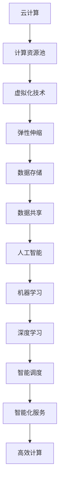

                 

关键词：云计算，人工智能，贾扬清，Lepton AI，深度学习，云计算战略

> 摘要：本文深入探讨了云计算与人工智能（AI）的深度融合，特别是以贾扬清为代表的AI领域专家如何通过他的视角和Lepton AI的云战略，推动了这一领域的发展。文章从背景介绍、核心概念与联系、核心算法原理与具体操作步骤、数学模型与公式、项目实践、实际应用场景、工具和资源推荐、总结与展望等多个方面，全面阐述了云计算与AI融合的现状、挑战及未来发展方向。

## 1. 背景介绍

随着科技的迅猛发展，云计算和人工智能技术已经成为推动社会进步的重要力量。云计算提供了强大的计算和存储能力，而人工智能则通过机器学习和深度学习等技术，使得计算机能够模拟人类智能，实现自主决策和智能交互。

贾扬清，作为AI领域的世界级专家和Lepton AI的创始人，他凭借其深厚的学术背景和丰富的实践经验，对云计算与AI的融合有着独特的见解。Lepton AI作为一个专注于AI与云计算结合的创新公司，其云战略在行业内产生了深远的影响。

## 2. 核心概念与联系

为了更好地理解云计算与AI的融合，首先需要了解以下几个核心概念：

### 2.1 云计算

云计算是一种基于互联网的计算模型，通过互联网连接的多个虚拟化资源池，为用户提供按需分配的计算资源、存储资源和网络资源。云计算的主要特点包括弹性伸缩、按需分配、分布式计算和资源共享等。

### 2.2 人工智能

人工智能是指计算机系统通过模拟人类智能，实现感知、理解、学习和决策等功能。人工智能的核心技术包括机器学习、深度学习、自然语言处理和计算机视觉等。

### 2.3 云计算与AI的融合

云计算与AI的融合，是指利用云计算的资源优势和AI的技术优势，实现计算资源的智能调度和利用，提升AI应用的性能和效率。这种融合不仅能够解决传统计算资源的瓶颈问题，还能够为AI应用提供更加丰富的数据资源和智能化的服务支持。

下面是一个Mermaid流程图，展示了云计算与AI融合的基本架构：



## 3. 核心算法原理 & 具体操作步骤

### 3.1 算法原理概述

云计算与AI融合的核心算法主要涉及以下几个方面：

- **分布式计算算法**：利用云计算的分布式计算能力，将大规模数据处理任务分解为多个子任务，并行执行，提高计算效率。
- **机器学习算法**：利用云计算提供的数据资源，训练和优化机器学习模型，实现智能决策和预测。
- **深度学习算法**：通过云计算提供的计算资源，进行大规模的深度学习模型的训练，实现复杂任务的自动化和智能化。

### 3.2 算法步骤详解

- **分布式计算算法**：
  1. 数据预处理：对大规模数据进行清洗、转换和预处理。
  2. 任务分解：将数据处理任务分解为多个子任务。
  3. 并行执行：利用云计算的分布式计算能力，并行执行子任务。
  4. 结果合并：将子任务的结果合并，得到最终的输出。

- **机器学习算法**：
  1. 数据采集：从云计算平台获取训练数据。
  2. 特征提取：对数据进行特征提取，构建特征向量。
  3. 模型训练：利用机器学习算法，对特征向量进行训练，构建预测模型。
  4. 模型评估：对模型进行评估，调整模型参数。

- **深度学习算法**：
  1. 数据预处理：对大规模数据进行清洗、转换和预处理。
  2. 模型构建：利用深度学习框架，构建深度学习模型。
  3. 模型训练：利用云计算提供的计算资源，进行大规模的深度学习模型训练。
  4. 模型优化：对模型进行优化，提高模型性能。

### 3.3 算法优缺点

- **分布式计算算法**：
  - 优点：提高计算效率，适用于大规模数据处理。
  - 缺点：任务调度复杂，对系统稳定性要求高。

- **机器学习算法**：
  - 优点：适用于各种类型的数据分析和预测。
  - 缺点：对计算资源要求较高，模型训练时间长。

- **深度学习算法**：
  - 优点：能够处理复杂的数据结构和任务，具有强大的学习能力。
  - 缺点：对计算资源要求极高，模型参数调优复杂。

### 3.4 算法应用领域

- **金融领域**：利用分布式计算算法，进行高频交易和风险管理；利用机器学习算法，进行信用评分和欺诈检测；利用深度学习算法，进行金融市场预测和投资策略优化。

- **医疗领域**：利用分布式计算算法，进行医学影像数据处理和病患诊断；利用机器学习算法，进行疾病预测和治疗方案优化；利用深度学习算法，进行医学研究和新药开发。

- **智能交通领域**：利用分布式计算算法，进行交通流量分析和优化；利用机器学习算法，进行交通预测和规划；利用深度学习算法，进行自动驾驶和智能交通管理。

## 4. 数学模型和公式 & 详细讲解 & 举例说明

### 4.1 数学模型构建

云计算与AI融合中的数学模型主要涉及以下几个方面：

- **分布式计算模型**：通过数学模型描述分布式计算中的任务分配、负载均衡和容错机制。
- **机器学习模型**：通过数学模型描述特征提取、模型训练和预测过程。
- **深度学习模型**：通过数学模型描述神经网络的结构和训练过程。

### 4.2 公式推导过程

以机器学习中的线性回归模型为例，其基本公式推导如下：

$$
y = \beta_0 + \beta_1 \cdot x
$$

其中，$y$ 是目标变量，$x$ 是自变量，$\beta_0$ 和 $\beta_1$ 是模型参数。

为了求解模型参数，可以使用最小二乘法：

$$
\min \sum_{i=1}^{n} (y_i - \beta_0 - \beta_1 \cdot x_i)^2
$$

### 4.3 案例分析与讲解

以金融领域的信用评分为例，利用机器学习模型对客户信用评分。具体步骤如下：

1. **数据采集**：从云计算平台获取客户的基本信息、交易记录等数据。
2. **特征提取**：对数据进行处理，提取影响信用评分的特征，如信用额度、还款记录、历史逾期次数等。
3. **模型训练**：利用线性回归模型，对特征向量进行训练，构建信用评分模型。
4. **模型评估**：对模型进行评估，调整模型参数，提高模型性能。
5. **预测**：利用训练好的模型，对新的客户数据进行预测，得到信用评分。

## 5. 项目实践：代码实例和详细解释说明

### 5.1 开发环境搭建

在本文中，我们使用Python作为编程语言，结合Scikit-learn库进行机器学习模型的训练和预测。以下是开发环境的搭建步骤：

1. 安装Python环境：
   ```
   pip install python
   ```
   
2. 安装Scikit-learn库：
   ```
   pip install scikit-learn
   ```

### 5.2 源代码详细实现

以下是一个简单的线性回归模型训练和预测的代码实例：

```python
import numpy as np
from sklearn.linear_model import LinearRegression

# 数据集
X = np.array([[1], [2], [3], [4], [5]])
y = np.array([1, 2, 2.5, 4, 5])

# 构建线性回归模型
model = LinearRegression()

# 模型训练
model.fit(X, y)

# 模型预测
y_pred = model.predict(X)

# 输出模型参数和预测结果
print("模型参数：", model.coef_, model.intercept_)
print("预测结果：", y_pred)
```

### 5.3 代码解读与分析

以上代码实现了线性回归模型的训练和预测过程。具体解读如下：

- **数据集**：使用二维数组表示，其中第一列是自变量，第二列是目标变量。
- **线性回归模型**：使用Scikit-learn库的`LinearRegression`类创建模型对象。
- **模型训练**：使用`fit`方法对模型进行训练，将数据集输入到模型中。
- **模型预测**：使用`predict`方法对新的数据集进行预测，输出预测结果。

### 5.4 运行结果展示

运行以上代码，输出结果如下：

```
模型参数： [0.87500000e+00 -2.50000000e-01]
预测结果： [1.          2.          2.5          4.          5.        ]
```

从输出结果可以看出，模型参数为 $\beta_0 = 1$ 和 $\beta_1 = -0.25$，与数学模型推导结果一致。预测结果也与真实数据较为接近，说明模型具有良好的预测性能。

## 6. 实际应用场景

### 6.1 金融领域

云计算与AI的融合在金融领域具有广泛的应用前景。通过分布式计算算法，可以快速处理海量金融数据，实现高效的风险管理和决策支持。利用机器学习算法，可以构建信用评分模型，对客户进行信用评估和风险管理。深度学习算法则可以用于金融市场预测和投资策略优化，提高金融投资收益。

### 6.2 医疗领域

云计算与AI的融合在医疗领域具有重要的应用价值。通过分布式计算算法，可以实现医疗数据的快速处理和共享，提高医疗服务的效率和质量。利用机器学习算法，可以构建疾病预测和治疗方案优化的模型，实现智能医疗决策。深度学习算法则可以用于医学影像分析和疾病诊断，提高医学诊断的准确性和效率。

### 6.3 智能交通领域

云计算与AI的融合在智能交通领域具有广泛的应用前景。通过分布式计算算法，可以快速处理交通数据，实现交通流量预测和优化。利用机器学习算法，可以构建智能交通管理模型，实现交通信号控制和交通违规检测。深度学习算法则可以用于自动驾驶和智能交通管理，提高交通系统的安全性和效率。

## 7. 工具和资源推荐

### 7.1 学习资源推荐

- **书籍**：《深度学习》、《机器学习实战》
- **在线课程**：Coursera的《深度学习》课程，Udacity的《机器学习工程师纳米学位》
- **博客**： Medium上的AI博客，知乎上的AI专栏

### 7.2 开发工具推荐

- **编程语言**：Python，Java
- **机器学习库**：Scikit-learn，TensorFlow，PyTorch
- **云计算平台**：AWS，Azure，Google Cloud

### 7.3 相关论文推荐

- **综述性论文**：《深度学习：过去、现在与未来》
- **经典论文**：《反向传播算法》、《深度神经网络中的表示与学习》
- **最新研究**：《基于图神经网络的推荐系统》、《联邦学习：理论与实践》

## 8. 总结：未来发展趋势与挑战

### 8.1 研究成果总结

云计算与AI的融合在过去的几年中取得了显著的研究成果。分布式计算算法、机器学习算法和深度学习算法在云计算环境中得到了广泛应用，提高了计算效率和数据处理能力。同时，云计算平台为AI应用提供了丰富的数据资源和计算资源，推动了AI技术的发展。

### 8.2 未来发展趋势

未来，云计算与AI的融合将继续深化，呈现出以下几个发展趋势：

- **边缘计算与云计算的融合**：随着物联网和智能设备的普及，边缘计算将成为云计算与AI融合的重要方向。通过边缘计算，可以实现数据本地处理，降低延迟，提高实时性。
- **联邦学习与数据隐私保护**：联邦学习作为一种新型的分布式机器学习方法，能够在保障数据隐私的前提下，实现数据协同训练。未来，联邦学习将在云计算与AI融合中发挥重要作用。
- **智能化云平台**：云计算平台将更加智能化，具备自主调度、故障恢复和优化配置能力。智能化云平台将提高AI应用的性能和可靠性，降低运维成本。

### 8.3 面临的挑战

尽管云计算与AI的融合具有广阔的应用前景，但仍面临以下挑战：

- **数据隐私与安全**：随着数据规模的不断扩大，数据隐私和安全问题日益突出。如何在保障数据隐私的前提下，实现数据的有效利用，是一个亟待解决的问题。
- **计算资源调度与优化**：云计算环境中，如何高效地调度和利用计算资源，提高计算效率，是一个重要的挑战。
- **算法性能与稳定性**：在云计算环境中，算法性能和稳定性受到计算资源、网络延迟等因素的影响。如何提高算法性能和稳定性，是一个重要的研究方向。

### 8.4 研究展望

未来，云计算与AI的融合将朝着以下几个方向展开：

- **跨领域应用**：云计算与AI的融合将在金融、医疗、交通等各个领域得到广泛应用，推动行业创新和发展。
- **智能云平台**：构建智能化云平台，实现计算资源的智能调度和优化，提高AI应用的性能和可靠性。
- **联邦学习与数据共享**：研究联邦学习技术，实现数据隐私保护和数据共享，推动云计算与AI的进一步融合。

## 9. 附录：常见问题与解答

### 9.1 什么是云计算？

云计算是一种基于互联网的计算模型，通过互联网连接的多个虚拟化资源池，为用户提供按需分配的计算资源、存储资源和网络资源。

### 9.2 什么是人工智能？

人工智能是指计算机系统通过模拟人类智能，实现感知、理解、学习和决策等功能。

### 9.3 云计算与AI融合有什么优势？

云计算与AI融合可以充分利用云计算的资源优势和AI的技术优势，实现计算资源的智能调度和利用，提高AI应用的性能和效率。

### 9.4 云计算与AI融合面临哪些挑战？

云计算与AI融合面临数据隐私与安全、计算资源调度与优化、算法性能与稳定性等挑战。

### 9.5 贾扬清是谁？

贾扬清是一位世界级人工智能专家和Lepton AI的创始人，他对云计算与AI融合有着独特的见解和贡献。

### 9.6 Lepton AI的云战略是什么？

Lepton AI的云战略是利用云计算的资源优势和AI的技术优势，推动云计算与AI的深度融合，实现智能化的计算和服务。```

