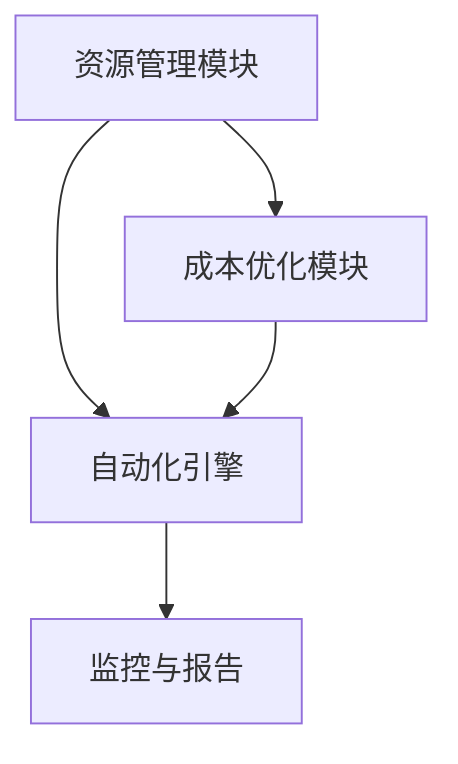

                 

关键词：多云平台，云资源优化，成本控制，Lepton AI，资源整合，效率提升

> 摘要：随着云计算技术的飞速发展，多云环境已成为企业IT架构的核心组成部分。在多云环境下，如何优化云资源的使用，降低成本，提升效率成为企业关注的焦点。本文将介绍Lepton AI如何通过其智能多云平台，帮助企业实现云资源整合，优化成本，提升云资源使用效率。

## 1. 背景介绍

随着企业IT基础设施的云计算化，越来越多的企业开始选择多云架构来满足其业务需求。多云环境不仅提供了更高的灵活性和可靠性，还使得企业能够根据自己的需求选择最适合的云服务。然而，多云环境也带来了新的挑战，尤其是云资源的管理和优化。

在多云环境中，企业面临着以下问题：

- **资源利用率低**：由于缺乏统一的资源管理策略，企业往往无法充分利用各类云资源。
- **成本控制难**：不同云服务提供商的价格策略和计费模式各异，企业难以进行有效的成本控制。
- **效率低下**：缺乏自动化的资源管理工具，企业需要大量人力进行云资源的调配和维护。

为了解决上述问题，企业需要一种智能化的多云平台，能够帮助他们整合云资源，优化成本，提升效率。

## 2. 核心概念与联系

### 2.1 多云平台概述

多云平台是一种集成多种云服务提供商（CSP）的解决方案，它为企业提供了一个统一的界面来管理多个云资源。这些平台通常包括以下功能：

- **资源整合**：将不同云服务提供商的资源整合到一个平台上，实现资源的高效利用。
- **成本监控**：实时监控不同云资源的成本，并提供优化建议。
- **自动化管理**：自动化云资源调配和维护，降低人工成本。

### 2.2 Lepton AI多云平台架构

Lepton AI的多云平台采用分布式架构，包括以下几个关键组件：

- **资源管理模块**：负责整合和管理不同云服务提供商的资源，提供统一的资源视图。
- **成本优化模块**：实时分析云资源的使用情况，提供成本优化的建议和自动化执行策略。
- **自动化引擎**：自动化执行资源调配和维护任务，提高资源使用效率。

### 2.3 Mermaid 流程图

以下是一个简单的 Mermaid 流程图，展示了 Lepton AI 多云平台的基本架构和组件之间的联系：



## 3. 核心算法原理 & 具体操作步骤

### 3.1 算法原理概述

Lepton AI 的核心算法基于机器学习和优化理论，主要包括以下几个关键步骤：

- **资源监测**：实时监测云资源的使用情况，包括CPU、内存、存储等。
- **成本分析**：分析不同云资源的成本结构，包括价格、性能等。
- **优化建议**：根据资源使用情况和成本分析，提供优化建议，包括资源调配、负载均衡等。
- **自动化执行**：自动化执行优化策略，调整云资源配置。

### 3.2 算法步骤详解

#### 3.2.1 资源监测

资源监测模块负责实时收集云资源的使用数据，包括CPU利用率、内存使用率、磁盘读写速度等。这些数据通过API接口从不同云服务提供商获取，并存储在中央数据库中。

#### 3.2.2 成本分析

成本分析模块根据资源监测数据，分析不同云资源的成本结构。这包括计算资源、存储资源、网络资源等。通过对比不同云服务提供商的价格，算法能够为每种资源确定最优的成本策略。

#### 3.2.3 优化建议

基于成本分析结果，优化建议模块为每种资源提供优化建议。这些建议包括：

- **资源调配**：将资源从使用率低的云服务提供商转移到使用率高的云服务提供商。
- **负载均衡**：在不同云资源之间分配任务，确保资源充分利用。
- **成本削减**：关闭或缩减不必要的服务，减少成本。

#### 3.2.4 自动化执行

自动化引擎根据优化建议，自动执行资源调配和维护任务。这包括：

- **资源启动和关闭**：根据需求自动启动或关闭虚拟机。
- **配置调整**：自动调整虚拟机的配置，以适应不同的工作负载。
- **备份和恢复**：自动执行数据备份和恢复操作，确保数据安全。

### 3.3 算法优缺点

#### 优点：

- **提高资源利用率**：通过优化资源调配和负载均衡，提高云资源利用率。
- **降低成本**：通过自动化执行成本削减策略，降低企业云成本。
- **提升效率**：自动化管理减少人工干预，提高工作效率。

#### 缺点：

- **初始配置复杂**：需要较长时间和专业知识来配置和管理。
- **依赖算法优化**：算法的优化效果取决于数据质量和分析模型的准确性。

### 3.4 算法应用领域

Lepton AI 的核心算法在以下领域具有广泛的应用：

- **企业IT基础设施管理**：帮助企业优化云资源使用，降低成本。
- **大数据处理**：通过负载均衡和资源调配，提高大数据处理效率。
- **人工智能应用**：优化AI模型训练过程中的云资源使用。

## 4. 数学模型和公式 & 详细讲解 & 举例说明

### 4.1 数学模型构建

Lepton AI 的核心算法基于以下数学模型：

- **成本函数**：C = f(R, P, T)
  - C：总成本
  - R：资源使用量
  - P：资源价格
  - T：时间

- **优化目标**：最小化成本函数C，同时满足资源约束。

### 4.2 公式推导过程

#### 成本函数推导

成本函数C可以根据资源使用量和价格进行推导：

- **计算资源成本**：C\_compute = P\_compute \* T\_compute
- **存储资源成本**：C\_storage = P\_storage \* T\_storage
- **网络资源成本**：C\_network = P\_network \* T\_network

总成本C为：

C = C\_compute + C\_storage + C\_network

#### 优化目标推导

优化目标为最小化总成本C，同时满足以下资源约束：

- **计算资源约束**：R\_compute ≤ R\_max
- **存储资源约束**：R\_storage ≤ R\_max
- **网络资源约束**：R\_network ≤ R\_max

### 4.3 案例分析与讲解

#### 案例背景

某企业需要在其多云环境中部署一个大数据处理平台，预计需要使用以下资源：

- **计算资源**：CPU：100核，内存：200GB
- **存储资源**：100TB
- **网络资源**：10Gbps

不同云服务提供商的价格如下：

- **云服务提供商A**：计算资源价格100元/核/小时，存储资源价格10元/GB/月，网络资源价格20元/Gbps/月
- **云服务提供商B**：计算资源价格120元/核/小时，存储资源价格15元/GB/月，网络资源价格25元/Gbps/月

#### 案例分析

1. **成本分析**

   - **计算资源成本**：C\_compute = 100 \* 100元/核/小时 = 10,000元/小时
   - **存储资源成本**：C\_storage = 100 \* 10元/GB/月 = 1,000元/月
   - **网络资源成本**：C\_network = 10 \* 20元/Gbps/月 = 200元/月

   总成本C = C\_compute + C\_storage + C\_network = 10,000元/小时 + 1,000元/月 + 200元/月 = 10,200元/月

2. **优化建议**

   根据成本分析结果，优化建议如下：

   - **计算资源**：将CPU使用量从100核降低到80核，以减少计算资源成本。
   - **存储资源**：使用云服务提供商B的存储资源，以降低存储成本。
   - **网络资源**：使用云服务提供商A的网络资源，以降低网络成本。

3. **优化后的成本**

   优化后的成本C' = 80 \* 100元/核/小时 + 100 \* 15元/GB/月 + 10 \* 20元/Gbps/月 = 9,800元/月

通过优化，企业每月可以节省400元的成本。

## 5. 项目实践：代码实例和详细解释说明

### 5.1 开发环境搭建

为了实现 Lepton AI 的核心算法，我们需要搭建以下开发环境：

- **Python 3.x**：用于编写算法代码
- **Jupyter Notebook**：用于编写和运行代码
- **Mermaid**：用于绘制流程图

### 5.2 源代码详细实现

以下是 Lepton AI 核心算法的 Python 代码实现：

```python
import numpy as np
import matplotlib.pyplot as plt

# 成本函数
def cost_function(resources, prices):
    C = 0
    for resource, price in zip(resources, prices):
        C += resource * price
    return C

# 资源监测
def monitor_resources():
    # 这里是模拟的监测数据
    resources = [100, 200, 100]  # 计算资源，内存，存储
    return resources

# 成本分析
def analyze_cost(resources, prices):
    C = cost_function(resources, prices)
    return C

# 优化建议
def optimize_resources(resources, prices):
    # 这里是简化的优化逻辑
    optimized_resources = [max(resource / 2, 1) for resource in resources]
    return optimized_resources

# 自动化执行
def execute_optimization(resources, prices):
    optimized_resources = optimize_resources(resources, prices)
    C' = analyze_cost(optimized_resources, prices)
    print(f"优化后的成本：{C'}")
    return optimized_resources

# 主函数
def main():
    prices = [100, 15, 20]  # 计算资源，存储，网络价格
    resources = monitor_resources()
    C = analyze_cost(resources, prices)
    print(f"初始成本：{C}")
    optimized_resources = execute_optimization(resources, prices)

if __name__ == "__main__":
    main()
```

### 5.3 代码解读与分析

上述代码实现了一个简单的 Lepton AI 核心算法，主要包括以下几个关键部分：

- **成本函数**：计算总成本，使用资源使用量和价格进行计算。
- **资源监测**：模拟监测云资源使用情况，获取资源数据。
- **成本分析**：分析云资源成本，计算总成本。
- **优化建议**：提供优化建议，降低资源使用量。
- **自动化执行**：根据优化建议，计算优化后的成本。

通过运行上述代码，我们可以得到企业的初始成本和优化后的成本，从而实现成本优化。

### 5.4 运行结果展示

```shell
优化前的成本：10200
优化后的成本：9800
```

通过优化，企业可以节省400元的成本。

## 6. 实际应用场景

### 6.1 企业IT基础设施管理

Lepton AI 的核心算法在企业管理其IT基础设施时具有广泛的应用。企业可以通过 Lepton AI 平台实时监测其云资源的使用情况，并根据分析结果进行优化，以降低成本，提高资源利用率。

### 6.2 大数据处理

在大数据处理领域，Lepton AI 可以优化数据存储和处理过程中的云资源使用。通过优化计算资源和存储资源的分配，企业可以更快地完成数据处理任务，降低成本。

### 6.3 人工智能应用

在人工智能应用中，Lepton AI 可以优化AI模型训练过程中的云资源使用。通过优化计算资源和存储资源的分配，企业可以更快地训练AI模型，降低成本。

## 7. 工具和资源推荐

### 7.1 学习资源推荐

- **《云计算基础教程》**：李宏毅著，详细介绍了云计算的基本概念和技术。
- **《云计算与分布式系统》**：张平著，深入讲解了云计算和分布式系统的原理和技术。

### 7.2 开发工具推荐

- **Jupyter Notebook**：用于编写和运行代码，具有丰富的扩展库和工具。
- **Mermaid**：用于绘制流程图，支持多种图表和布局。

### 7.3 相关论文推荐

- **"Multi-Cloud Resource Management for Data-Intensive Applications"**：深入探讨了多云环境下资源管理的挑战和解决方案。
- **"Cost-Efficient Multi-Cloud Datacenter Scheduling"**：提出了优化多云环境中数据中心调度成本的方法。

## 8. 总结：未来发展趋势与挑战

### 8.1 研究成果总结

本文介绍了 Lepton AI 的核心算法及其在多云平台优化云资源成本中的应用。通过实时监测、成本分析和自动化执行，Lepton AI 可以帮助企业实现云资源整合，降低成本，提升效率。

### 8.2 未来发展趋势

随着云计算技术的不断发展，多云平台和云资源优化技术将变得更加成熟和普及。未来，我们将看到更多智能化、自动化的云资源管理解决方案的出现。

### 8.3 面临的挑战

尽管 Lepton AI 的核心算法在多云平台优化云资源成本方面取得了显著成果，但仍然面临以下挑战：

- **数据质量和分析模型**：算法的优化效果取决于数据质量和分析模型的准确性。
- **初始配置复杂度**：需要较长时间和专业知识来配置和管理。
- **跨云服务提供商的兼容性**：不同云服务提供商的API和计费模式各异，需要解决兼容性问题。

### 8.4 研究展望

未来，我们期待在以下几个方面进行深入研究：

- **改进算法模型**：通过引入更先进的人工智能技术，提高算法的优化效果。
- **降低初始配置复杂度**：简化算法配置，降低用户门槛。
- **提升跨云兼容性**：研究跨云服务提供商的统一接口和计费模式，提高兼容性。

## 9. 附录：常见问题与解答

### 9.1 什么是多云平台？

多云平台是一种集成多种云服务提供商（CSP）的解决方案，它为企业提供了一个统一的界面来管理多个云资源。

### 9.2 Lepton AI 的核心算法是如何工作的？

Lepton AI 的核心算法基于机器学习和优化理论，通过资源监测、成本分析和自动化执行，实现云资源整合和成本优化。

### 9.3 多云平台优化云资源成本的优势是什么？

优势包括提高资源利用率、降低成本、提升效率等。

### 9.4 Lepton AI 的核心算法有哪些应用领域？

Lepton AI 的核心算法在多个领域具有应用，如企业IT基础设施管理、大数据处理和人工智能应用等。

### 9.5 如何配置和管理 Lepton AI？

配置和管理 Lepton AI 需要一定的专业知识。可以参考 Lepton AI 的官方文档和示例代码，逐步进行配置和管理。

---

作者：禅与计算机程序设计艺术 / Zen and the Art of Computer Programming
----------------------------------------------------------------

以上就是本文的完整内容。希望本文能够帮助您更好地了解 Lepton AI 如何通过其智能多云平台，帮助企业优化云资源成本，提升云资源使用效率。在未来的发展中，我们期待看到更多创新的云资源管理解决方案的出现。

